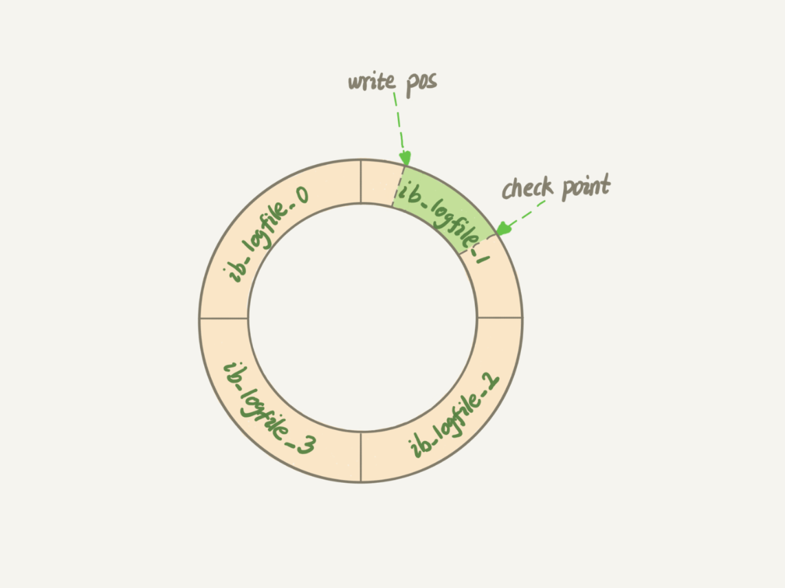

# MySQL基本架构


分为server层和存储引擎层

**Server层**：所有跨存储引擎的功能都是在这一层，比如存储过程、触发器和试图等。Server层包括如下几个部分：

| 名称     | 作用                          | 说明                                                         |
| -------- | :---------------------------- | ------------------------------------------------------------ |
| 客户端   | Mysql的客户端，一般为应用程序 |                                                              |
| 连接器   | 管理连接，权限验证            | 负责和客户端建立连接、获取权限、维护和管理连接，连接命令一般这么写：<br />mysql -h$ip -P$port -u$user -p<br /><br />如果通过了密码验证，mysql就会去权限表里获取你的权限，然后，这个连接里面以后的权限判断逻辑就会依赖这个权限，也就是说，即使这个时候通过管理员修改了这个用户的权限，也必须等到下一次重新建立连接才能有效。连接完成后，如果你没有任何继续的动作，那么这个连接将空闲，你可以在show processlist里面看到Sleep的连接，就表示这个连接是空闲的。客户端如果太长时间没动静，连接器就会自动将它断开。这个时间是由参数 wait_timeout 控制的，默认值是 8 小时。<br />客户端使用连接池的时候要注意设置空闲时间小于这个值。<br />注意wait_timeout修改要同时修改interactive_timeout和wait_timeout，请参考相关资料。 |
| 查询缓存 | 用于缓存查询                  | 一般来说弊大于利，生产环境一般是关掉了，原因是只要查询有更新，这个查询缓存就会失效，导致命中率降低，在频繁更新的场景下，其命中率会非常的低；Mysql也提供了按需使用的功能，可以将参数query_cache_type设置为DEMAND，这样通过类似：<br /> select SQL_CACHE * from T where ID=10；<br />这样的语句就可以开启查询缓存。注意Mysql8.0把查询缓存的功能整个删除了 |
| 分析器   | 词法和语法分析                | 先做词法分析，分析SQL里面的字符串是什么，表示什么。比如分析from 后面的是表明，where后面的列名；<br />然后做语法分析，判断SQL是否满足Mysql语法，经典的<br />You have an error in your SQL syntax<br />错误就是这么来的。 |
| 优化器   | 优化查询                      | 经过了分析器，MysQL就知道你要做什么了，优化器是在表里面有多个索引的时候，决定使用哪个索引；或者在一个语句有多表关联（join）的时候，决定各个表的连接顺序 |
| 执行器   | 执行SQL                       | 通过分析器我们知道了SQL到底要做什么。通过优化器我们知道了如何做（比如使用什么索引，如何进行join顺序），在执行器阶段就是执行SQL了。<br />开始执行的时候，要先判断一下你对这个表 T 有没有执行查询的权限，如果没有，就会返回没有权限的错误，如下所示：<br />mysql> select * from T where ID=10;<br />ERROR 1142 (42000): SELECT command denied to user 'b'@'localhost' for table 'T'<br />如果有权限，就打开表继续执行。打开表的时候，执行器就会根据表的引擎定义，去使用这个引擎提供的接口。<br />你会在数据库的慢查询日志中看到一个 rows_examined 的字段，表示这个语句执行过程中扫描了多少行。这个值就是在执行器每次调用引擎获取数据行的时候累加的。在有些场景下，执行器调用一次，在引擎内部则扫描了多行，因此引擎扫描行数跟 rows_examined 并不是完全相同的。我们后面会专门有一篇文章来讲存储引擎的内部机制，里面会有详细的说明。 |

**问**

为什么权限校验要在执行器阶段执行，原因是有些时候，SQL语句要操作的表不只是SQL字面上那些。比如如果有个触发器，得在执行器阶段（过程中）才能确定。优化器阶段前是无能为力的


# 查询和更新语句是如何执行的

关于这个问题，其实上面都已经进行说明了（还有图示），其实不管select还是update都会按照前面的基础架构图走一遍，先连接器，再分析器（为什么没有查询缓存，等会再说）、优化器、执行器。不同的是查询缓存还有涉及到的不同逻辑：

| 不同的地方   | 说明                                                         |
| ------------ | ------------------------------------------------------------ |
| 查询缓存     | 对于select，如果mysql（或SQL语句）被配置成了使用查询缓存，那么如果查询缓存中存在，那么select就直接返回了。<br />但是对于update语句，在一个表上有更新的时候，跟这个表有关的查询缓存会失效，所以这条语句就会把表 T 上所有缓存结果都清空。也正是一般不建议使用查询缓存的原因 |
| 日志模块不同 | update会涉及到两个日志模块：redo log（重做日志）和 binlog（归档日志） |
|              |                                                              |

# 日志模块一：REDO LOG

**redo log**：innodb引擎特有的一种log，实现了Mysql数据库异常恢复的能力，redo log是物理日志，记录的是“在某个数据页上做了什么修改”，redo log是循环写的，空间固定，会写完；

redo log是固定大小的，比如可以配置一组4个文件，每个文件的大小是1G，也就是可以记录4G的数据库操作。从头开始写，写到末尾再从头开始写，如此循环：



其中write pos为写入的位置，check point为待刷盘的位置，check point到write pos的位置为还没有刷盘的操作，从write pos到check point之间是已经刷盘可以复写的操作。当write pos写到check point那么日志就满了，必须刷盘，将check point向前移动才能继续写入操作。有了redo log，那么就能保证，数据库即使宕机或异常重启，之前提交的记录都不会丢失，这个能力就是crash-safe。

# 日志模块二：binlog

**binlog**：binlog是server层特有的，所有存储引擎都可以使用，但是binlog不具有crash-safe能力；

binlog是逻辑日志，记录的是这个语句的原始逻辑，比如“给ID为2的这一行的c字段加1”；最开始Mysql只有binlog，因为mysql一开始自带的是MyIASM引擎是没有redo log的；

binlog是追加写，写到一定大小时会写下一个，不会覆盖旧的日志。

BinLog有两种模式：


# MYSQL 索引

索引的目的：为了提高数据查询的效率，就像书的目录一样

## 索引的常见模型

索引的出现是为了提高查询效率，但是实现索引的方式却有很多种，所以这里也就引入了索引模型的概念。可以用于提高读写效率的数据结构很多，这里我先给你介绍三种常见、也比较简单的数据结构，它们分别是哈希表、有序数组和搜索树

下面我主要从使用的角度，为你简单分析一下这三种模型的区别。

**哈希表这种结构适用于只有等值查询的场景**，比如 Memcached 及其他一些 NoSQL 引擎

**有序数组在等值查询和范围查询场景中的性能就都非常优秀，但是有序数组索引只适用于静态（数据不会更改的数据）存储引擎**，因为你往有序数据中插入数据必须挪动后面的所有数据，成本太高

二叉搜索树的特点是：父节点左子树所有结点的值小于父节点的值，右子树所有结点的值大于父节点的值，查找的时间复杂度是O(log(N))，当然为了维持 O(log(N)) 的查询复杂度，你就需要保持这棵树是平衡二叉树。为了做这个保证，更新的时间复杂度也是 O(log(N))。二叉树是搜索效率最高的，但是实际上**大多数的数据库存储却并不使用二叉树。其原因是，索引不止存在内存中，还要写到磁盘上**，而为什么在磁盘上就不能用二叉树？那是因为磁盘的I/O是非常慢的，机械硬盘时代，随机读一个数据块需要10ms的时间。一个100w节点的平衡二叉树，如果树高20，一次查询可能需要访问20个数据块，单独访问一行就可能需要20*10=200ms的时间，这个时间是非常慢的。

那么，对于这种需要写到磁盘上的数据的查询，为了尽量减少访问次数，我们就应该用N叉树，这里N取决于数据块的大小。

以 InnoDB 的一个整数字段索引为例，这个 N 差不多是 1200。这棵树高是 4 的时候，就可以存 1200 的 3 次方个值，这已经 17 亿了。考虑到树根的数据块总是在内存中的，一个 10 亿行的表上一个整数字段的索引，查找一个值最多只需要访问 3 次磁盘。其实，树的第二层也有很大概率在内存中，那么访问磁盘的平均次数就更少了。

**N 叉树由于在读写上的性能优点，以及适配磁盘的访问模式，已经被广泛应用在数据库引擎中了。**

数据库技术发展到今天，跳表、LSM 树等数据结构也被用于引擎设计中，这里我就不再一一展开了。

## InnoDB的索引模型

innoDB的数据是以主键的顺序以索引的形式存放的，这种存储方式的表我们称之为索引组织表，innoDB使用B+树索引，因此innoDB的数据时存放在B+树索引中的。

### 索引的分类

根据叶子节点的内容，索引可分为主键索引（也叫聚簇索引，叶子节点上存的是整行数据）和非主键索引（也叫二级索引，叶子节点上存放的是主键值）

### 基于主键索引和非主键索引的查询有什么区别

基于非主键索引的查询需要多查找一颗索引树，这个称之为**回表**，**回表**会导致磁盘I/O的增加，影响效率，因此查询的时候能用主键查询是最好的。

### 索引的维护，页分裂和页合并

数据库的数据时变更的，可能会插入或删除数据，这二种操作都要影响到索引，需要调整索引以满足新的数据查询，对于插入而言，可能需要**页分裂**（比如数据页满了，需要申请一个新的数据页，部分数据需要挪到新的数据页上），页分裂会影响性能以及页的利用率；再说删除，删除后相邻的页可能需要**合并**以提高页利用率，它是页分裂的逆过程。

从性能上考虑，自增主键由于不需要页分裂，增加一条记录都是追加操作，不需要挪动数据，因此**自增主键性能是最好的**，而且，**主键长度越小，普通索引的叶子节点就越小，普通索引占用的空间也就越小**，因此自增主键索引在**性能和存储空间**上来说都是最好的。

**关于长短事务，已经autocommit等需要再总结一下**

### 覆盖索引

如果有这样的高频查询，可能通过建立一个冗余索引，就能支持索引覆盖（不需要回表），那么就可以考虑建立这样一个冗余索引，业务方，DBA需要权衡，性能（减少了访问次数，无需回表）和代价（存储空间，索引维护）的平衡。

### 最左前缀

最左前缀的具体含义不再解释，所要说明的是，B+树这种数据结构，支持用"最左前缀"来定位记录，意思就是，比如我有了一个非主键索引A（单列索引），但是同时这张表的查询需求中有这个列A和另外一个列B的查询，我是否需要建一个非主键索引A+B，那怎么办？如果这个时候再有A+B+C的查询需求呢？那么这个时候我们是不是只要建一个A+B+C的索引就可以了。这个索引根据最左前缀是不是就同时满足按照A或按照A+B来查询了？

这个最左前缀**可以是联合索引的最左N个字段，也可以是字符串索引的最左M个字符**。

### 索引下推

最左前缀可以用于在索引中定位记录。这时，你可能要问，那些不符合最左前缀的部分，会怎么样呢？

假设如下市民表：

```java
CREATE TABLE `tuser` (
  `id` int(11) NOT NULL,
  `id_card` varchar(32) DEFAULT NULL,
  `name` varchar(32) DEFAULT NULL,
  `age` int(11) DEFAULT NULL,
  `ismale` tinyint(1) DEFAULT NULL,
  PRIMARY KEY (`id`),
  KEY `id_card` (`id_card`),
  KEY `name_age` (`name`,`age`)
) ENGINE=InnoDB
```


我们还是以市民表的联合索引（name, age）为例。如果现在有一个需求：检索出表中“名字第一个字是张，而且年龄是 10 岁的所有男孩”。那么，SQL 语句是这么写的：

```java
mysql> select * from tuser where name like '张%' and age=10 and ismale=1;
```

你已经知道了前缀索引规则，所以这个语句在搜索索引树的时候，只能用 “张”，找到第一个满足条件的记录 ID3。当然，这还不错，总比全表扫描要好。

然后呢？当然是判断其他条件是否满足。在 MySQL 5.6 之前，只能从 ID3 开始一个个回表。到主键索引上找出数据行，再对比字段值。而 MySQL 5.6 引入的索引下推优化（index condition pushdown)， 可以在索引遍历过程中，对索引中包含的字段先做判断，直接过滤掉不满足条件的记录，减少回表次数。图 3 和图 4，是这两个过程的执行流程图。


在图 3 和 4 这两个图里面，每一个虚线箭头表示回表一次。图 3 中，在 (name,age) 索引里面我特意去掉了 age 的值，这个过程 InnoDB 并不会去看 age 的值，只是按顺序把“name 第一个字是’张’”的记录一条条取出来回表。因此，需要回表 4 次。图 4 跟图 3 的区别是，InnoDB 在 (name,age) 索引内部就判断了 age 是否等于 10，对于不等于 10 的记录，直接判断并跳过。在我们的这个例子中，只需要对 ID4、ID5 这两条记录回表取数据判断，就只需要回表 2 次。

**索引下推**需要再明确一下


# MySQL锁

## 锁设计的初衷是啥？

锁设计的初衷是为了防止对**共享资源**的并发访问。作为多用户共享的资源，当出现并发访问的时候，数据库需要合理地**控制资源的访问规则**。而**锁就是用来实现这些访问规则的重要数据结构**。

**根据加锁的范围，MySQL 里面的锁大致可以分成全局锁、表级锁和行锁三类**

## 全局锁

全局锁，就是对整个数据库实例加锁，这个是最大级别的锁，一旦锁住，所有的对数据的DML，DDL和更新类事务的提交语句全部会阻塞。

MySQL 提供了一个加全局读锁的方法，命令是 **Flush tables with read lock (FTWRL)**。

**全局锁的典型使用场景是，做全库逻辑备份**。也就是把整库每个表都 select 出来存成文本。

以前有一种做法，是通过 FTWRL 确保不会有其他线程对数据库做更新，然后对整个库做备份。注意，在备份过程中整个库完全处于只读状态。但是让整库都只读，听上去就很危险：

1. 如果你在主库上备份，那么在备份期间都不能执行更新，业务基本上就得停摆；
2. 如果你在从库上备份，那么备份期间从库不能执行主库同步过来的 binlog，会导致主从延迟。

看来加全局锁不太好。但是细想一下，备份为什么要加锁呢？我们来看一下不加锁会有什么问题。假设你现在要维护“极客时间”的购买系统，关注的是用户账户余额表和用户课程表。现在发起一个逻辑备份。假设备份期间，有一个用户，他购买了一门课程，业务逻辑里就要扣掉他的余额，然后往已购课程里面加上一门课。如果时间顺序上是先备份账户余额表 (u_account)，然后用户购买，然后备份用户课程表 (u_course)，会怎么样呢？你可以看一下这个图：


可以看到，这个备份结果里，用户 A 的数据状态是“账户余额没扣，但是用户课程表里面已经多了一门课”。如果后面用这个备份来恢复数据的话，用户 A 就发现，自己赚了。作为用户可别觉得这样可真好啊，你可以试想一下：如果备份表的顺序反过来，先备份用户课程表再备份账户余额表，又可能会出现什么结果？也就是说，不加锁的话，**备份系统备份的得到的库不是一个逻辑时间点，这个视图是逻辑不一致的。**

官方自带的逻辑备份工具是 **mysqldump**。当 mysqldump 使用参数–single-transaction 的时候，导数据之前就会启动一个事务，来确保拿到一致性视图。而由于 MVCC 的支持，这个过程中数据是可以正常更新的。

你一定在疑惑，有了这个功能，为什么还需要 FTWRL 呢？一致性读是好，但前提是引擎要支持这个隔离级别。比如，对于 MyISAM 这种不支持事务的引擎，如果备份过程中有更新，总是只能取到最新的数据，那么就破坏了备份的一致性。这时，我们就需要使用 FTWRL 命令了。

所以，**single-transaction 方法只适用于所有的表使用事务引擎的库**。如果有的表使用了不支持事务的引擎，那么备份就只能通过 FTWRL 方法。这往往是 DBA 要求业务开发人员使用 InnoDB 替代 MyISAM 的原因之一。

你也许会问，既然要全库只读，为什么不使用**set global readonly=true**的方式呢？确实 readonly 方式也可以让全库进入只读状态，但我还是会建议你用 FTWRL 方式，主要有两个原因：

1. 一是，在有些系统中，readonly 的值会被用来做其他逻辑，比如用来判断一个库是主库还是备库。因此，修改 global 变量的方式影响面更大，我不建议你使用。
2. 二是，在异常处理机制上有差异。如果执行 FTWRL 命令之后由于客户端发生异常断开，那么 MySQL 会自动释放这个全局锁，整个库回到可以正常更新的状态。而将整个库设置为 readonly 之后，如果客户端发生异常，则数据库就会一直保持 readonly 状态，这样会导致整个库长时间处于不可写状态，风险较高。

## 表级锁

分两种：

1. 表锁
2. 元数据锁

### 表锁

表锁的语法是 **lock tables … read/write**。

与 FTWRL 类似，可以用 unlock tables 主动释放锁，也可以在客户端断开的时候自动释放。需要注意，lock tables 语法除了会限制别的线程的读写外，也限定了本线程接下来的操作对象。

举个例子, 如果在某个线程 A 中执行 lock tables t1 read, t2 write; 这个语句，则其他线程写 t1、读写 t2 的语句都会被阻塞。同时，线程 A 在执行 unlock tables 之前，也只能执行读 t1、读写 t2 的操作。连写 t1 都不允许，自然也不能访问其他表

### MDL（metadata lock）

MDL 不需要显式使用，在访问一个表的时候会被自动加上。MDL 的作用是，保证读写的正确性。你可以想象一下，如果一个查询正在遍历一个表中的数据，而执行期间另一个线程对这个表结构做变更，删了一列，那么查询线程拿到的结果跟表结构对不上，肯定是不行的。

因此，在 MySQL 5.5 版本中引入了 MDL，当对一个表做增删改查操作的时候，加 MDL 读锁；当要对表做结构变更操作的时候，加 MDL 写锁。

1. 读锁之间不互斥，因此你可以有多个线程同时对一张表增删改查。
2. 读写锁之间、写锁之间是互斥的，用来保证变更表结构操作的安全性。因此，如果有两个线程要同时给一个表加字段，其中一个要等另一个执行完才能开始执行。

虽然 MDL 锁是系统默认会加的，但却是你不能忽略的一个机制。比如下面这个例子，我经常看到有人掉到这个坑里：给一个小表加个字段，导致整个库挂了。你肯定知道，给一个表加字段，或者修改字段，或者加索引，需要扫描全表的数据。在对大表操作的时候，你肯定会特别小心，以免对线上服务造成影响。而实际上，即使是小表，操作不慎也会出问题。我们来看一下下面的操作序列，假设表 t 是一个小表。

备注：这里的实验环境是 MySQL 5.6。


我们可以看到 session A 先启动，这时候会对表 t 加一个 MDL 读锁。由于 session B 需要的也是 MDL 读锁，因此可以正常执行。之后 session C 会被 blocked，是因为 session A 的 MDL 读锁还没有释放，而 session C 需要 MDL 写锁，因此只能被阻塞。如果只有 session C 自己被阻塞还没什么关系，但是之后所有要在表 t 上新申请 MDL 读锁的请求也会被 session C 阻塞。前面我们说了，所有对表的增删改查操作都需要先申请 MDL 读锁，就都被锁住，等于这个表现在完全不可读写了。

如果某个表上的查询语句频繁，而且客户端有重试机制，也就是说超时后会再起一个新 session 再请求的话，这个库的线程很快就会爆满。

你现在应该知道了，事务中的 MDL 锁，在语句执行开始时申请，但是语句结束后并不会马上释放，而会等到整个事务提交后再释放。基于上面的分析，我们来讨论一个问题，如何安全地给小表加字段？

首先我们要解决长事务，事务不提交，就会一直占着 MDL 锁。在 MySQL 的 information_schema 库的 innodb_trx 表中，你可以查到当前执行中的事务。

如果你要做 DDL 变更的表刚好有长事务在执行，要考虑先暂停 DDL，或者 kill 掉这个长事务。但考虑一下这个场景。如果你要变更的表是一个热点表，虽然数据量不大，但是上面的请求很频繁，而你不得不加个字段，你该怎么做呢？这时候 kill 可能未必管用，因为新的请求马上就来了。比较理想的机制是，在 alter table 语句里面设定等待时间，如果在这个指定的等待时间里面能够拿到 MDL 写锁最好，拿不到也不要阻塞后面的业务语句，先放弃。之后开发人员或者 DBA 再通过重试命令重复这个过程。


## 行锁

Mysql行锁是在引擎层实现的。并不是所有引擎都支持行锁，比如MyIASM就不支持行锁，不支持行锁意味着并发控制只能通过表锁，也就是在同一时刻，同一张表只能有一个更新在执行，这极大影响了数据库操作的并发度。这个也是InnoDB替换MyIASM的原因之一。

**在 InnoDB 事务中，行锁是在需要的时候才加上的，但并不是不需要了就立刻释放，而是要等到事务结束时才释放。这个就是两阶段锁协议。** 他并不是一般的，我加锁使用完毕后就释放锁，而是要等事务提交后才能释放锁。

这个带来的启示是，**如果你的事务中需要锁多个行，要把最可能造成锁冲突、最可能影响并发度的锁尽量往后放。**

### 死锁和死锁检测

在并发系统中不同线程出现循环资源依赖，涉及的线程都在等待别的线程释放资源，就会导致这几个线程都处于等待的状态，且无法解除这个状态，就称为死锁。典型的死锁如下图所示：


事务A拿到了id=1的锁，之后事务B拿到了id=2的锁；这个时候事务A准备拿id=2的锁，因为已被事务B锁住，因此处于等待，这个时候事务B也因为id=1的锁被事务A锁住处于等待状态，且这种状态无法解除，就出现了死锁。

当出现死锁以后，有两种策略：

1. 一种策略是，直接进入等待，直到超时。这个超时时间可以通过参数 innodb_lock_wait_timeout 来设置。
2. 另一种策略是，发起死锁检测，发现死锁后，主动回滚死锁链条中的某一个事务，让其他事务得以继续执行。将参数 innodb_deadlock_detect 设置为 on，表示开启这个逻辑。

在 InnoDB 中，**innodb_lock_wait_timeout** 的默认值是 50s，意味着如果采用第一个策略，当出现死锁以后，第一个被锁住的线程要过 50s 才会超时退出，然后其他线程才有可能继续执行。对于在线服务来说，这个等待时间往往是无法接受的。

但是，我们又不可能直接把这个时间设置成一个很小的值，比如 1s。这样当出现死锁的时候，确实很快就可以解开，但如果不是死锁，而是简单的锁等待呢？所以，超时时间设置太短的话，会出现很多误伤。

所以，正常情况下我们还是要采用第二种策略，即：主动死锁检测，而且 **innodb_deadlock_detect** 的默认值本身就是 on。主动死锁检测在发生死锁的时候，是能够快速发现并进行处理的，但是它也是有额外负担的。

你可以想象一下这个过程：每当一个事务被锁的时候，就要看看它所依赖的线程有没有被别人锁住，如此循环，最后判断是否出现了循环等待，也就是死锁。

那如果是我们上面说到的所有事务都要更新同一行的场景呢？每个新来的被堵住的线程，都要判断会不会由于自己的加入导致了死锁，这是一个时间复杂度是 O(n) 的操作。假设有 1000 个并发线程要同时更新同一行，那么死锁检测操作就是 100 万这个量级的。虽然最终检测的结果是没有死锁，但是这期间要消耗大量的 CPU 资源。因此，你就会看到 CPU 利用率很高，但是每秒却执行不了几个事务。

根据上面的分析，我们来讨论一下，怎么解决由**这种热点行更新导致的性能问题**呢？问题的症结在于，死锁检测要耗费大量的 CPU 资源。


1. 一种头痛医头的方法，就是如果你能确保这个业务一定不会出现死锁，可以临时把死锁检测关掉。但是这种操作本身带有一定的风险，因为业务设计的时候一般不会把死锁当做一个严重错误，毕竟出现死锁了，就回滚，然后通过业务重试一般就没问题了，这是业务无损的。而关掉死锁检测意味着可能会出现大量的超时，这是业务有损的。
2. 另一个思路是控制并发度。根据上面的分析，你会发现如果并发能够控制住，比如同一行同时最多只有 10 个线程在更新，那么死锁检测的成本很低，就不会出现这个问题。一个直接的想法就是，在客户端做并发控制。但是，你会很快发现这个方法不太可行，因为客户端很多。我见过一个应用，有 600 个客户端，这样即使每个客户端控制到只有 5 个并发线程，汇总到数据库服务端以后，峰值并发数也可能要达到 3000。因此，这个并发控制要做在数据库服务端。如果你有中间件，可以考虑在中间件实现；如果你的团队有能修改 MySQL 源码的人，也可以做在 MySQL 里面。基本思路就是，对于相同行的更新，在进入引擎之前排队。这样在 InnoDB 内部就不会有大量的死锁检测工作了。


可能你会问，如果团队里暂时没有数据库方面的专家，不能实现这样的方案，能不能从设计上优化这个问题呢？你可以考虑通过将一行改成逻辑上的多行来减少锁冲突。还是以影院账户为例，可以考虑放在多条记录上，比如 10 个记录，影院的账户总额等于这 10 个记录的值的总和。这样每次要给影院账户加金额的时候，随机选其中一条记录来加。这样每次冲突概率变成原来的 1/10，可以减少锁等待个数，也就减少了死锁检测的 CPU 消耗。这个方案看上去是无损的，但其实这类方案需要根据业务逻辑做详细设计。如果账户余额可能会减少，比如退票逻辑，那么这时候就需要考虑当一部分行记录变成 0 的时候，代码要有特殊处理。


# MVCC

**事务开启的时机**

begin/start transaction 命令并不是一个事务的起点，在执行到它们之后的第一个操作 InnoDB 表的语句，事务才真正启动。如果你想要马上启动一个事务，可以使用 start transaction with consistent snapshot 这个命令。

1. 第一种启动方式，一致性视图是在执行第一个快照读语句时创建的；
2. 第二种启动方式，一致性视图是在执行 start transaction with consistent snapshot 时创建的。

所以你看，数据库在设计的时候还是尽最大努力支持事务的并发，减少锁等待的时间。

**MVCC总结**

1. MVCC到底是解决了什么问题？MVCC是为了提升传统的


# 自增主键为什么不是连续的？

自增主键由于是


# MySQL实战

## 1. 长连接和短连接的问题

建立连接的过程通常是比较复杂的，所以我建议你在使用中要尽量减少建立连接的动作，也就是尽量使用长连接。但是全部使用长连接后，你可能会发现，有些时候 MySQL 占用内存涨得特别快，这是因为 MySQL 在执行过程中临时使用的内存是管理在连接对象里面的。这些资源会在连接断开的时候才释放。所以如果长连接累积下来，可能导致内存占用太大，被系统强行杀掉（OOM），从现象看就是 MySQL 异常重启了。

怎么解决这个问题呢？你可以考虑以下两种方案。

1. 定期断开长连接。使用一段时间，或者程序里面判断执行过一个占用内存的大查询后，断开连接，之后要查询再重连。
2. 如果你用的是 MySQL 5.7 或更新版本，可以在每次执行一个比较大的操作后，通过执行 mysql_reset_connection 来重新初始化连接资源。这个过程不需要重连和重新做权限验证，但是会将连接恢复到刚刚创建完时的状态。

## 2. wait_timeout和interactive_time

wait_timeout 是客户端 非交互式的连接时间，如果程序连接mysql SERVER，是交互连接,关联的时间参数为interactive_timeout, 这两个时间参数需要尽量一致吗,一般设置多少合适?这两个尽量设置成相同。值的话取决于业务。如果你面对的是成熟的开发（比如公司内部团队），可以设置小些，分钟级别就行


## 3.数据库的慢查询日志中看到一个 rows_examined 的字段，表示这个语句执行过程中扫描了多少行。这个值就是在执行器每次调用引擎获取数据行的时候累加的。

在有些场景下，执行器调用一次，在引擎内部则扫描了多行，因此引擎扫描行数跟 rows_examined 并不是完全相同的。我们后面会专门有一篇文章来讲存储引擎的内部机制，里面会有详细的说明。

## 3.怎样让数据库恢复到半个月内任意一秒的状态？

如果DBA说可以恢复到半个月内任意一秒的状态，那说明DBA至少保存有半个月内的所有归档日志，同时系统会定期做整库备份。

当需要恢复到指定的某一秒时，比如某天下午两点发现中午十二点有一次误删表，需要找回数据，那你可以这么做：首先，找到最近的一次全量备份，如果你运气好，可能就是昨天晚上的一个备份，从这个备份恢复到临时库；然后，从备份的时间点开始，将备份的 binlog 依次取出来，重放到中午误删表之前的那个时刻。

这样你的临时库就跟误删之前的线上库一样了，然后你可以把表数据从临时库取出来，按需要恢复到线上库去。
