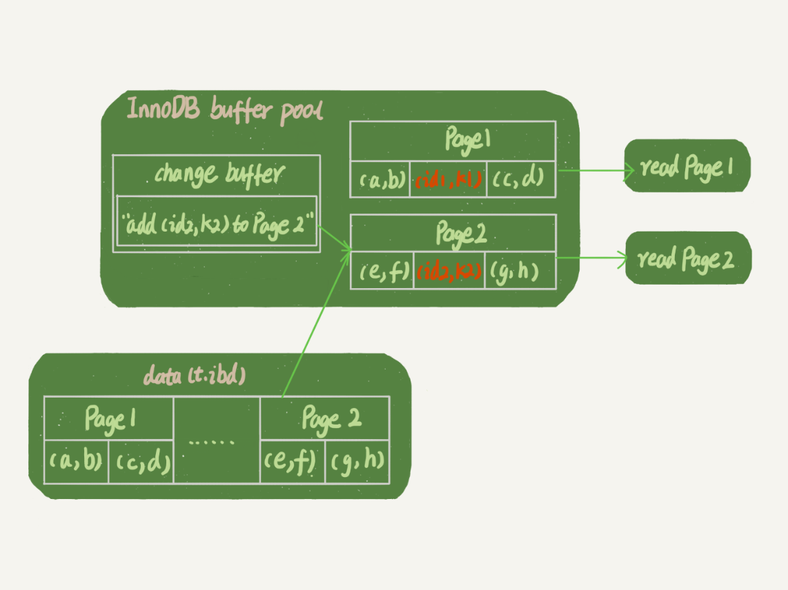
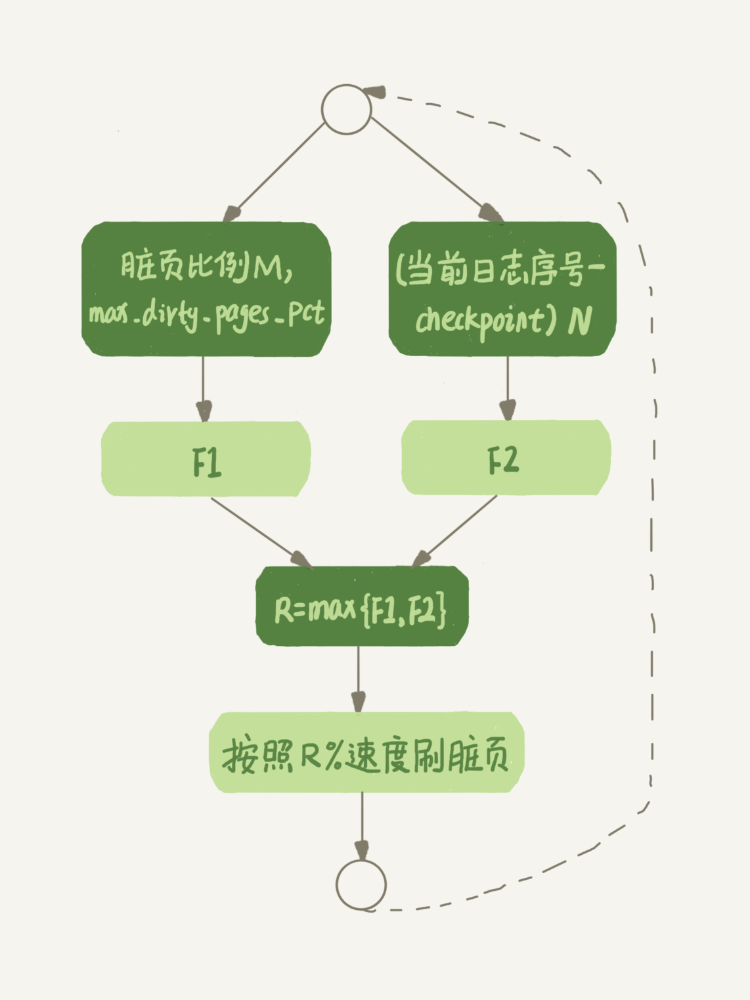

# 01 | 基础架构：一条SQL查询语句是如何执行的？

总结：

这篇文章讲的是一条SQL查询语句的执行流程是怎样的，这里主要要掌握Mysql的分层（Server和引擎），各个层的功能，比如Server层按照流程顺序有连接管理（用于管理连接、权限校验的）、查询缓存（用于select语句的缓存，如果有，就直接返回了）、分析器（此法分析和语法分析）、优化器（决定怎么执行，选择什么索引和执行策略）、最后执行器（按照计划执行），然后执行器就开始调用InnoDB引擎。InnoDB层，如果数据在内存里面，那么直接返回，如果不在，需要从磁盘读取数据到buffer_pool里再返回。

# 02 | 日志系统：一条SQL更新语句是如何执行的？

也是从一条SQL更新开始来讲整个流程：

1. 和SQL查询的不同，比如这里查询缓存的不同（会直接清掉缓存）
2. InnoDB和Server层的不同，这里着重涉及Redo Log和BinLog的作用，以及着重理解两阶段提交；
3. 理解redo log和binlog的作用，比如前者是做crash-safe的，简言之就是有异常恢复的能力；binlog更着重与point-in-time恢复和归档已经在主备复制中的作用；已经其他一些区别，比如前者是物理记录，后者记录的是逻辑日志，有statement和row两种格式。

两阶段提交：

1. 搞懂如果不用两阶段提交，会发生什么情况？ 数据不一致，可能会导致binlog中缺少或多出事务记录
2. 搞懂两阶段提交是如何保证binlog和redo log的数据一致性的。

搞懂binlog和redo log涉及到的两个参数的含义：

1. innodb_flush_log_at_trx_commit：用来控制事务提交的时候redo log的刷盘时间，1表示每次事务的日志都持久化到磁盘，这个值作者建议设置成1，否则可能会有数据丢失。
2. sync_binlog：用来控制事务提交时binlog的刷盘时间，1表示每次事务都会讲binlog持久化到磁盘，也建议设置成1

# 03 | 事务隔离：为什么你改了我还看不见？

这个章节主要是说的事务的ACID特性中的I（Isolation）：事务的隔离。

事务在并发处理的时候，可能发生哪些情况：脏读/不可重复读/幻读。那怎么来防止这种情况的发生？那就要事务和事务之间要进行隔离，数据库有4中隔离级别

对于读已提交，和不可重复读，数据库是如何实现的呢，那就要理解视图的概念。也就是，读已提交，事务在每次执行sQL查询开始执行的时候就会建立一个视图，访问时以数据库逻辑结果为准（区别与当前读）；而RR界别，是在事务启动的时候执行的。而读未提交，每次都是当前读，因为没有视图的概念。而串行化则全部通过锁来避免并发访问。

可以用如下命令查看隔离级别：

**mysql>**show variables like 'transaction_isolation';

## 事务隔离的实现

通过MVCC和undo log来实现。

### 不建议使用**长事务**：

长事务意味着系统里面会存在很老的事务视图。由于这些事务随时可能访问数据库里面的任何数据，所以这个事务提交之前，数据库里面它可能用到的回滚记录都必须保留，这就会导致大量占用存储空间。在 MySQL 5.5 及以前的版本，回滚日志是跟数据字典一起放在 ibdata 文件里的，即使长事务最终提交，回滚段被清理，文件也不会变小。我见过数据只有 20GB，而回滚段有 200GB 的库。最终只好为了清理回滚段，重建整个库。除了对回滚段的影响，长事务还占用锁资源，也可能拖垮整个库

### 事务的启动方式

MySQL 的事务启动方式有以下几种：

1. 显式启动事务语句， begin 或 start transaction。配套的提交语句是 commit，回滚语句是 rollback。
2. set autocommit=0，这个命令会将这个线程的自动提交关掉。意味着如果你只执行一个 select 语句，这个事务就启动了，而且并不会自动提交。这个事务持续存在直到你主动执行 commit 或 rollback 语句，或者断开连接。

有些客户端连接框架会默认连接成功后先执行一个 set autocommit=0 的命令。这就导致接下来的查询都在事务中，如果是长连接，就导致了意外的长事务。

因此，我会建议你总是使用 set autocommit=1, 通过显式语句的方式来启动事务。但是有的开发同学会纠结“多一次交互”的问题。对于一个需要频繁使用事务的业务，第二种方式每个事务在开始时都不需要主动执行一次 “begin”，减少了语句的交互次数。如果你也有这个顾虑，我建议你使用 commit work and chain 语法。在 autocommit 为 1 的情况下，用 begin 显式启动的事务，如果执行 commit 则提交事务。如果执行 commit work and chain，则是提交事务并自动启动下一个事务，这样也省去了再次执行 begin 语句的开销。同时带来的好处是从程序开发的角度明确地知道每个语句是否处于事务中。

### 查询长事务

你可以在 information_schema 库的 innodb_trx 这个表中查询长事务，比如下面这个语句，用于查找持续时间超过 60s 的事务。

select * from information_schema.innodb_trx where TIME_TO_SEC(timediff(now(),trx_started))>60

### 如何避免长事务对业务的影响？

这个问题，我们可以从应用开发端和数据库端来看。

首先，从应用开发端来看：

1. 确认是否使用了 set autocommit=0。这个确认工作可以在测试环境中开展，把 MySQL 的 general_log 开起来，然后随便跑一个业务逻辑，通过 general_log 的日志来确认。一般框架如果会设置这个值，也就会提供参数来控制行为，你的目标就是把它改成 1。
2. 确认是否有不必要的只读事务。有些框架会习惯不管什么语句先用 begin/commit 框起来。我见过有些是业务并没有这个需要，但是也把好几个 select 语句放到了事务中。这种只读事务可以去掉。
3. 业务连接数据库的时候，根据业务本身的预估，通过 SET MAX_EXECUTION_TIME 命令，来控制每个语句执行的最长时间，避免单个语句意外执行太长时间。（为什么会意外？在后续的文章中会提到这类案例）

其次，从数据库端来看：

1. 监控 information_schema.Innodb_trx 表，设置长事务阈值，超过就报警 / 或者 kill；
2. Percona 的 pt-kill 这个工具不错，推荐使用；
3. 在业务功能测试阶段要求输出所有的 general_log，分析日志行为提前发现问题；
4. 如果使用的是 MySQL 5.6 或者更新版本，把 innodb_undo_tablespaces 设置成 2（或更大的值）。如果真的出现大事务导致回滚段过大，这样设置后清理起来更方便。


# 04 | 深入浅出索引（上）

1. 知道**哈希索引和有序数组索引**为什么不适合数据库这种需要存储在磁盘上的数据做索引。一个是不支持范围查询，只能用于等值查询的场景；一个是索引维护代价太大

2. 知道**B+树**作为数据库的索引的数据结构的好处

3. 知道索引的几种类型，比如主键索引和二级索引，主键索引和二级索引的区别（要不要回表），已经尽量使用主键查找

4. 知道索引维护的相关知识，比如页分裂和页聚合，知道主键索引可以避免页分裂（追加操作，因为有序），尽量避免无序的主键

5. 知道主键长度越小，普通索引的叶子节点就越小，普通索引占用的空间也就越小。

6. 关于**重建索引**：

   为什么要重建索引：索引可能因为删除，或者页分裂等原因，导致数据页有空洞，重建索引的过程会创建一个新的索引，把数据按顺序插入，这样页面的利用率最高，也就是索引更紧凑、更省空间。

   对于上面例子中的 InnoDB 表 T，如果你要重建索引 k，你的两个 SQL 语句可以这么写：

   alter table T drop index k;

   alter table T add index(k);

   如果你要重建主键索引，也可以这么写：

   alter table T drop primary key;

   alter table T add primary key(id);

   重建索引 k 的做法是合理的，可以达到省空间的目的。但是，重建主键的过程不合理。不论是删除主键还是创建主键，都会将整个表重建。所以连着执行这两个语句的话，第一个语句就白做了。这两个语句，你可以用这个语句代替 ： alter table T engine=InnoDB。

# 05 | 深入浅出索引（下）

1. 知道**覆盖索引**可以避免回表，避免回表可以减少访问磁盘的次数（树的搜索次数），从而提升查询性能

2. 知道可以利用**最左前缀原则**减少索引，比如，有按照a，b的查询，有按照a，b，c的查询，那么我们就没必要再建一个类似a的索引了，因为根据最左原则，建立a，b，c这样的索引，a/a,b/a,b,c都可以走这个索引

3. 知道如果通过调整顺序可以少维护一下索引，那么这个时候顺序就是要优先考虑的。比如同样的有a，b的查询，你可以建(a,b)的索引，也可以建(b,a)的索引（加入字段区分度都差不多），但同时有个按b的查询，那如果你建（b，a）索引就没多大必要了，这时候建（a,b)和（b）就较好。

4. 知道**索引下推**的概念：

   索引(a,b,c)，根据最左前缀原则，如果索引只用到了前缀部分（比如只用了a，b），那么查询的时候，mysql在索引遍历的时候，对索引中的字段优先做判断，直接过滤掉不满足的记录，较少回表次数。比如：

   mysql> select * from tuser where name like '张%' and age=10 and ismale=1;

   (name,age)是索引，按照正常逻辑，这个时候我们知道在遍历索引的时候，只能用name，找到记录后再回表拿到数据，判断是否符合age=10和ismale=1是否满足条件。这个时候不同的mysql版本处理是不一样的：

   > 在 MySQL 5.6 之前，只能从 ID3 开始一个个回表。到主键索引上找出数据行，再对比字段值。

   > 而 MySQL 5.6 引入的索引下推优化（index condition pushdown)， 可以在索引遍历过程中，对索引中包含的字段先做判断，直接过滤掉不满足条件的记录，减少回表次数。如下图所示：

   

（左未5.6之前，右为5.6之后，就不用回表了）

# 06 | 全局锁和表锁 ：给表加个字段怎么有这么多阻碍？

## 全局锁

1. 了解根据加锁的范围分类：全局锁/表级锁/行级锁，

2. 了解全局锁是对整个数据库实例加锁，Mysql提供了一个全局锁命令：FTWRL（Flush tables with read lock），这条命令会让数据库只读，一下语句全部阻塞：DDL，DML，更新类事务的提交语句。

3. 了解全局锁的使用场景：做全库逻辑备份，也就是把整库每个表都 select 出来存成文本。

4. 了解使用FTWRL会使整个库处于只读状态，并明确危险性

   4.1  如果主库做备份，备份期间主库上不能执行任何更新，业务基本就停摆

   4.2  如果在备库做备份，那么备份期间从主库同步来的更新都不能同步到备库，造成主备延迟

5. 知道不加锁做备份的后果：会造成备份的数据得到的库不是一个逻辑时间点，备份的视图是逻辑不一致的。

6. 知道官方自带的备份工具是 mysqldump。

   当 mysqldump 使用参数–single-transaction 的时候，导数据之前就会启动一个事务，来确保拿到一致性视图。而由于 MVCC 的支持，这个过程中数据是可以正常更新的。为啥不用这个还要用FTWRL？因为这个需要引擎支持一定的隔离级别才可以。

7. 知道mysqldump的single-transaction 方法只适用于所有的表使用事务引擎的库。如果有的表使用了不支持事务的引擎，那么备份就只能通过 FTWRL 方法。这往往是 DBA 要求业务开发人员使用 InnoDB 替代 MyISAM 的原因之一。

8. 知道为什么不能用将整库设置为read-only的方式（set global readonly=true）来备份呢？原因是如下两点：

   > 一是，在有些系统中，readonly 的值会被用来做其他逻辑，比如用来判断一个库是主库还是备库。因此，修改 global 变量的方式影响面更大，我不建议你使用。

   > 二是，在异常处理机制上有差异。如果执行 FTWRL 命令之后由于客户端发生异常断开，那么 MySQL 会自动释放这个全局锁，整个库回到可以正常更新的状态。而将整个库设置为 readonly 之后，如果客户端发生异常，则数据库就会一直保持 readonly 状态，这样会导致整个库长时间处于不可写状态，风险较高。

## 表级锁

Mysql中分为：**表锁**/**元数据锁**

> 表锁语法：lock tables...read/write.    和FTWRL类似，可以用unlock tables主动释放锁。用lock tables锁住表的线程，如果断开，会自动释放锁。lock tables同时也会所做当前线程对表的操作

举个例子，如果在某个线程 A 中执行 lock tables t1 read, t2 write; 这个语句，则其他线程写 t1、读写 t2 的语句都会被阻塞。同时，线程 A 在执行 unlock tables 之前，也只能执行读 t1、读写 t2 的操作。连写 t1 都不允许，自然也不能访问其他表

如果没有行锁，表锁是常用的控制并发的方式。InnoDB因为支持行锁，一般不会使用表锁，影响较大。

> 元数据锁MDL（metadata lock）。MDL不需要显示使用，在访问一个表的时候会自动加上。MDL 的作用是，保证读写的正确性。你可以想象一下，如果一个查询正在遍历一个表中的数据，而执行期间另一个线程对这个表结构做变更，删了一列，那么查询线程拿到的结果跟表结构对不上，肯定是不行的。

在Mysql5.5版本中引入了MDL锁，当对表进行CRUD操作时加MDL读锁。在对表结果进行更新的时候，加MDL写锁。

>读锁之间不互斥，因此你可以有多个线程同时对一张表增删改查。
>
>读写锁之间、写锁之间是互斥的，用来保证变更表结构操作的安全性。因此，如果有两个线程要同时给一个表加字段，其中一个要等另一个执行完才能开始执行。

### 注意事项

1. 给大表做DDL（加字段，加索引等），需要扫描全表的数据，因此需要特别小心。而且MDL 会直到事务提交才释放，在做表结构变更的时候，你一定要小心不要导致锁住线上查询和更新。

2. 给小表做DDL，也可能因为操作不慎而出问题。举个例子：

   > 例子：一个小表，
   >
   > 1. 当前有sessionA的select在其上执行，拿到MDL读锁，
   > 2. 然后来个sessionB也做select操作，因为MDL读锁不互斥，那么可以运行；
   > 3. 又来个sessionC，做alter table操作，因为要拿MDL写锁，和MDL读锁互斥，阻塞等待；
   > 4. 后面陆续有session要拿MDL读锁，被3的MDL写锁阻塞，所有要拿MDL读锁的全被阻塞
   > 5. 所有的SQL都被阻塞，这个表基本上不能动了。
   > 6. 如果某个表上的查询语句频繁，而且客户端有重试机制，也就是说超时后会再起一个新 session 再请求的话，这个库的线程很快就会爆满。

3. 事务中的 MDL 锁，在语句执行开始时申请，但是语句结束后并不会马上释放，而会等到整个事务提交后再释放。

4. 如何安全的给小表加字段？

   > 1. 解决长事务，事务不提交，会一直占着MDL锁，在 MySQL 的 information_schema 库的 innodb_trx 表中，你可以查到当前执行中的事务。如果你要做 DDL 变更的表刚好有长事务在执行，要考虑先暂停 DDL，或者 kill 掉这个长事务
   > 2. alter table 加个等待时间，如果在这个指定的等待时间里面能够拿到 MDL 写锁最好，拿不到也不要阻塞后面的业务语句，先放弃。之后开发人员或者 DBA 再通过重试命令重复这个过程

# 07 | 行锁功过：怎么减少行锁对性能的影响？

## 两阶段锁协议

> 在 InnoDB 事务中，行锁是在需要的时候才加上的，但并不是不需要了就立刻释放，而是要等到事务结束时才释放，这个就是锁的两阶段锁协议

有了这样的定义，那么我们就应该**把最容易造成并发问题的事务语句放到一个事务的最后面**来执行，因为这个事务语句最容易造成锁冲突，最影响并发度。

## 死锁

> 死锁，就是资源互相等待造成的一种现象，当并发系统中不同线程出现循环资源依赖，涉及的线程都在等待别的线程释放资源时，就会导致这几个线程都进入无限等待的状态，称为死锁

当出现死锁，有两种策略：

1. 一种策略是，直接进入等待，直到超时。这个超时时间可以通过参数 **innodb_lock_wait_timeout** 来设置。
2. 另一种策略是，发起死锁检测，发现死锁后，主动回滚死锁链条中的某一个事务，让其他事务得以继续执行。将参数 **innodb_deadlock_detect** 设置为 on，表示开启这个逻辑。

使用innodb_lock_wait_timeout，不是一个很好的解决方案，设置长了，业务可能无法容忍；设置短了，很容易误伤。所以一般采用第二种方法来。但是第二种方法是有代价的：

### innodb_deadlock_detect=on的代价

你可以想象一下这个过程：每当一个事务被锁的时候，就要看看它所依赖的线程有没有被别人锁住，如此循环，最后判断是否出现了循环等待，也就是死锁。

每个新来的被堵住的线程，都要判断会不会由于自己的加入导致了死锁，这是一个时间复杂度是 O(n) 的操作。假设有 1000 个并发线程要同时更新同一行，那么死锁检测操作就是 100 万这个量级的。虽然最终检测的结果是没有死锁，但是这期间要消耗大量的 CPU 资源。因此，你就会看到 CPU 利用率很高，但是每秒却执行不了几个事务。

根据上面的分析，我们来讨论一下，怎么解决由这种热点行更新导致的性能问题呢？问题的症结在于，死锁检测要耗费大量的 CPU 资源。

1. 一种头痛医头的方法，就是如果你能确保这个业务一定不会出现死锁，可以临时把死锁检测关掉。但是这种操作本身带有一定的风险，因为业务设计的时候一般不会把死锁当做一个严重错误，毕竟出现死锁了，就回滚，然后通过业务重试一般就没问题了，这是业务无损的。而关掉死锁检测意味着可能会出现大量的超时，这是业务有损的。
2. 另一个思路是控制并发度。根据上面的分析，你会发现如果并发能够控制住，比如同一行同时最多只有 10 个线程在更新，那么死锁检测的成本很低，就不会出现这个问题。一个直接的想法就是，在客户端做并发控制。但是，你会很快发现这个方法不太可行，因为客户端很多。我见过一个应用，有 600 个客户端，这样即使每个客户端控制到只有 5 个并发线程，汇总到数据库服务端以后，峰值并发数也可能要达到 3000。因此，这个并发控制要做在数据库服务端。
3. 如果你有中间件，可以考虑在中间件实现；如果你的团队有能修改 MySQL 源码的人，也可以做在 MySQL 里面。基本思路就是，对于相同行的更新，在进入引擎之前排队。这样在 InnoDB 内部就不会有大量的死锁检测工作了。
4. 你可以考虑通过将一行改成逻辑上的多行来减少锁冲突。还是以影院账户为例，可以考虑放在多条记录上，比如 10 个记录，影院的账户总额等于这 10 个记录的值的总和。这样每次要给影院账户加金额的时候，随机选其中一条记录来加。这样每次冲突概率变成原来的 1/10，可以减少锁等待个数，也就减少了死锁检测的 CPU 消耗。这个方案看上去是无损的，但其实这类方案需要根据业务逻辑做详细设计。如果账户余额可能会减少，比如退票逻辑，那么这时候就需要考虑当一部分行记录变成 0 的时候，代码要有特殊处理

所以，基本上都是通过业务手段去避免。

# 08 | 事务到底是隔离的还是不隔离的？

这一章主要就是介绍事务隔离的MVCC实现原理，如下是一下概念

1. 快照读

   > 快照读，就是在读数据的时候，读的是数据行的快照记录，而不是数据行的当前记录，快照记录是指根据一定的规则从undo log日志中查找到的记录的可以读取的版本；当前记录是指记录的最新一条记录。

2. 当前读

   > 当前读，没有快照的概念，读到的用于是这个记录的当前数据，比如事务B更新了一条数据，但是没有提交，当前读就会读到这个已经更新的数据

3. undo日志中支持MVCC的部分

   > 1. undo日志包含了一个数据行的多个版本（所以MVCC就是多版本控制），每个版本隐藏有两个字段：事务id和回滚指针，事务id就是这个数据行的这个版本的更新事务id（这个版本是这个事务下更新完成的），回滚指针指向上一个版本的数据行。这样事务在读取数据行就可以找到历史的可以读的数据版本（也就是快照读）
   > 2. undo日志的历史数据版本什么时候删除？系统会判断，当没有事务再需要用到这些回滚日志时，回滚日志会被删除。什么时候才不需要了呢？就是当系统里没有比这个回滚日志更早的 read-view 的时候。

4. read-view和视图数组

   > read-view实际上就是select语句执行所生成的视图，对应到实现上有一个视图数组，在实现上， InnoDB 为每个事务构造了一个数组，用来保存这个事务启动瞬间，当前正在“活跃”的所有事务 ID。“活跃”指的就是，启动了但还没提交。数组里面事务 ID 的最小值记为低水位，当前系统里面已经创建过的事务 ID 的最大值加 1 记为高水位。这个视图数组和高水位，就组成了当前事务的一致性视图（read-view）。

5. 可见性规则

   > 简单的说就是：
   >
   > 版本未提交，不可见；
   >
   > 版本已提交，但是是在视图创建后提交的，不可见；
   >
   > 版本已提交，而且是在视图创建前提交的，可见。

6. 视图在事务中的生成规则和时间点

   > 1. RR级别下，视图read-view是在执行第一条语句的时候生成的。生成之后这个read-view就定下来了，不会更新了，后续所有的查询语句都要根据这个read-view和可见性规则来看查询可以读到的快照版本。
   > 2. RC级别下，视图read-view是在执行每一条语句的时候生成的。所有RC下能够看到别人已经提交的数据，因为生成视图的时候别的事务已经提交了，这个时候根据可见性规则就可以看到了。
   > 3. update和delete更新语句读到的永远是当前读
   > 4. select...for update和select...lock in share mode也是当前读

7. 一致性读、当前读和行锁

   > 一致性读就是MVCC的快照度，对于当前读，数据库要加锁，加锁后，其他事务在数据行上做更新就要锁等待。锁必须事务提交的时候才释放。

# 09 | 普通索引和唯一索引，应该怎么选择？

由城市人口表，引申出普通索引和唯一索引到底用哪个好，而引发的一系列问题。

城市人口表，有一个字段身份证号，业务经常要根据身份证号做查询，而且身份证号是唯一的，那么问题来了，身份证号肯定是要建索引的（因为省份证号较长，不建议作为主键），那么建唯一索引还是普通索引？

## 唯一索引 OR 普通索引

1. 首先唯一索引和普通索引在**查询效率**上相差无几，唯一索引不需要访问左右节点，因为是唯一的，所以直接返回命中的记录，但是普通索引需要看一下左右节点有没有满足条件的。但是因为只需要访问左右的节点，因此多出来的损耗几乎可忽略不计，况且innoDB是按页访问数据的，而一个页一般有上千个记录，大概率所有的数据都在一个页内。
2. **更新效率**上，这里涉及到一个change buffer的问题。因为change buffer的存在，建议在这种情况下使用普通索引，因为普通索引不需要判定唯一性，因此不需要将页从磁盘中预先读取出来，从而能够利用change buffer，提高效率和语句执行的速度。而唯一索引每次更新需要先查询有没有重复记录，因此每次必定会将页从磁盘读出从而无法利用change buffer，效率上没有普通索引来的快

## change buffer

1. 当innoDB需要更新数据时，如果数据在内存中，那么就直接更新内存。如果不在内存，在不影响数据一致性的情况下，就会放到一个称为change buffer的内存区，在下次查询需要访问这个数据页的时候，将数据页读入内存，然后执行 change buffer 中与这个页有关的操作（也就是merge过程）。通过这种方式就能保证这个数据逻辑的正确性。
2. 当一个表写多读少（也就是说大部分都是insert或update操作），那么就可以充分利用这个change buffer提高写入的效率。
3. 如果一张表写少读多，极端的，如果一个表写入后经常会跟着进行查询，那么change buffer可能就基本上排不上用场，因为刚进入changge buffer，后面页就被从磁盘读入内存进行merge，那这个时候远远不如不用change buffer来的效率更高。
4. change buffer也可以持久化到磁盘。
5. merge的执行时机，除了上面说的当从页面被从磁盘读入内存后进行merge，系统有后台线程会定期merge，另外在数据库正常关闭（shutdown）的时候也会执行merge操作。
6. 为什么change buffer效率高，因为减少了读磁盘的时间，所以执行速度会得到明显的提升。而且，数据从磁盘读入内存，是要占用buffer pool的
7. change buffer是用的buffer pool中的空间，change buffer 的大小，可以通过参数**innodb_change_buffer_max_size**来动态设置，这个参数设置为 50 的时候，表示 change buffer 的大小最多只能占用 buffer pool 的 50%
8. 更详细的说，如果要查询的页在内存里面，那么普通索引和唯一索引的效率也差不多。因为都用不上change buffer。唯一索引就多了一个判断比较而已。如果不在内存中，那么唯一索引就要将数据也从磁盘读入内存。而普通索引就直接使用change buffer了（内存操作，比从磁盘读数据快很多）。

## change buffer使用场景

1. 适用于普通索引，不适合唯一索引
2. 在普通索引的情况下，对于写多读少的业务来说，页面在写完以后马上被访问到的概率比较小，此时 change buffer 的使用效果最好。这种业务模型常见的就是账单类、日志类的系统；反过来，假设一个业务的更新模式是写入之后马上会做查询，那么即使满足了条件，将更新先记录在 change buffer，但之后由于马上要访问这个数据页，会立即触发 merge 过程。这样随机访问 IO 的次数不会减少，反而增加了 change buffer 的维护代价。所以，对于这种业务模式来说，change buffer 反而起到了副作用
3. 如果所有的更新后面，都马上伴随着对这个记录的查询，那么你应该关闭 change buffer。而在其他情况下，change buffer 都能提升更新性能。
4. 特别地，在使用机械硬盘时，change buffer 这个机制的收效是非常显著的。所以，当你有一个类似“历史数据”的库，并且出于成本考虑用的是机械硬盘时，那你应该特别关注这些表里的索引，尽量使用普通索引，然后把 change buffer 尽量开大，以确保这个“历史数据”表的数据写入速度。

## change buffer 和 redo log

```java
mysql> insert into t(id,k) values(id1,k1),(id2,k2);
```

假设想t表插入了两条数据，假设当时k索引的状态：查找到位置后，k1 所在的数据页在内存 (InnoDB buffer pool) 中，k2 所在的数据页不在内存中。如图 2 所示是带 change buffer 的更新状态图。


分析这条更新语句，你会发现它涉及了四个部分：内存、redo log（ib_log_fileX）、 数据表空间（t.ibd）、系统表空间（ibdata1）。

这条更新语句做了如下的操作（按照图中的数字顺序）：

1. Page 1 在内存中，直接更新内存；
2. Page 2 没有在内存中，就在内存的 change buffer 区域，记录下“我要往 Page 2 插入一行”这个信息将上述两个动作记入 redo log 中（图中 3 和 4）。

做完上面这些，事务就可以完成了。所以，你会看到，执行这条更新语句的成本很低，就是写了两处内存，然后写了一处磁盘（两次操作合在一起写了一次磁盘），而且还是顺序写的。

同时，图中的两个虚线箭头，是后台操作，不影响更新的响应时间。

那在这之后的读请求，要怎么处理呢？

比如，我们现在要执行 select * from t where k in (k1, k2)。这里，我画了这两个读请求的流程图。如果读语句发生在更新语句后不久，内存中的数据都还在，那么此时的这两个读操作就与系统表空间（ibdata1）和 redo log（ib_log_fileX）无关了。所以，我在图中就没画出这两部分。



从图中可以看到：

1. 读 Page 1 的时候，直接从内存返回。有几位同学在前面文章的评论中问到，WAL 之后如果读数据，是不是一定要读盘，是不是一定要从 redo log 里面把数据更新以后才可以返回？其实是不用的。你可以看一下图 3 的这个状态，虽然磁盘上还是之前的数据，但是这里直接从内存返回结果，结果是正确的。
2. 要读 Page 2 的时候，需要把 Page 2 从磁盘读入内存中，然后应用 change buffer 里面的操作日志，生成一个正确的版本并返回结果。可以看到，直到需要读 Page 2 的时候，这个数据页才会被读入内存。

所以，如果要简单地对比这两个机制在提升更新性能上的收益的话，**redo log 主要节省的是随机写磁盘的 IO 消耗（转成顺序写），而 change buffer 主要节省的则是随机读磁盘的 IO 消耗。**

# 10 | MySQL为什么有时候会选错索引？【实践比较多，有时间需要细看】【扫描行数】

1. 优化器除了看扫描行数，也看是否使用了临时表，是否排序等。

2. 知道扫描行数是怎么判断的

   > 扫描行数是根据索引的基数来判断的，也就是索引的区分度（一个索引上不同值得个数，cardinality）。可以用
   >
   > ```mysql
   > mysql>show index from table;
   > ```
   >
   > 来查看索引的基数，但是基数是不准确的。

3. mysql基数是怎么得到的？

   > 通过mysql采样来的。为什么通过采样？因为如果一行行取出来统计，**代价太高**
   >
   > 采样统计的时候，InnoDB 默认会选择 N 个数据页，统计这些页面上的不同值，得到一个平均值，然后乘以这个索引的页面数，就得到了这个索引的基数。假设共有10个索引数据页； page1：10个不同值； page2：20个不同值； page3：15 个不同值； 索引基数=(10+20+15)/3*10=150。
   >
   > 在 MySQL 中，有两种存储索引统计的方式，可以通过设置参数 **innodb_stats_persistent** 的值来选择：
   >
   > 1. 设置为 on 的时候，表示统计信息会持久化存储。这时，默认的 N 是 20，M 是 10。
   > 2. 设置为 off 的时候，表示统计信息只存储在内存中。这时，默认的 N 是 8，M 是 16。

4. 由上面得知，mysql没能准确判断扫描行数往往导致用错索引。

5. 因为统计采用不准确，那么可以通过analyze table t的方式来让mysql重新统计，

   这个情况可以让原本因为判断扫描行数错误的sQL重新走正确的索引，所以在实践中，如果你发现 explain 的结果预估的 rows 值跟实际情况差距比较大，可以采用这个方法来处理。

6. 索引异常的处理

   > 1. 使用force index，强制是mysql使用指定的索引
   > 2. 我们可以考虑修改语句，引导 MySQL 使用我们期望的索引
   > 3. 在有些场景下，我们可以新建一个更合适的索引，来提供给优化器做选择，或删掉误用的索引。

# 11 | 怎么给字符串字段加索引？【前缀索引】

## 前缀索引

1. 字符串前缀索引优点：空间占用小

2. 使用前缀索引，可能会导致查询次数增多。比如mysql会先通过前缀查，然后再回表查索引的完整值，再做比较满不满足条件。

3. 综上，使用前缀索引，要定义好长度，就可以做到既节省空间，又不用额外增加太多的查询成本。

4. 如何确定使用前缀索引的话我该选择什么样的长度？

   >我们可以通过统计索引上有多少个不同的值来判断要使用多长的前缀。比如：
   >
   >```mysql
   >
   >mysql> select 
   >  count(distinct left(email,4)）as L4,
   >  count(distinct left(email,5)）as L5,
   >  count(distinct left(email,6)）as L6,
   >  count(distinct left(email,7)）as L7,
   >from SUser;
   >```
   >
   >比如通过distinct email，区分度是100%，使用distinct left(email,7)，区分度是98%。说明使用email的长度7做前缀损失了2%的区分度。具体选择多少，要看业务上容忍多少的区分度损失。

5. 前缀索引对覆盖索引的影响

   > 前面说了如果使用覆盖索引就可以不回表了，但是如果使用前缀索引，那么不管值在不在索引的叶子节点都要进行回表，因此，**使用前缀索引就用不上覆盖索引对查询性能的优化了，这也是你在选择是否使用前缀索引时需要考虑的一个因素**。

那么，有没有方式即可以节省空间，又能得到相同的查询效率？答案是有的。

>1. 第一种方式是使用倒序存储。如果你存储身份证号的时候把它倒过来存，每次查询的时候，你可以这么写：
>
>   mysql> select field_list from t where id_card = reverse('input_id_card_string');
>
>   由于身份证号的最后 6 位没有地址码这样的重复逻辑，所以最后这 6 位很可能就提供了足够的区分度。当然了，实践中你不要忘记使用 count(distinct) 方法去做个验证
>
>2. 第二种方式是使用 hash 字段。你可以在表上再创建一个整数字段，来保存身份证的校验码，同时在这个字段上创建索引。mysql> alter table t add id_card_crc int unsigned, add index(id_card_crc);然后每次插入新记录的时候，都同时用 crc32() 这个函数得到校验码填到这个新字段。由于校验码可能存在冲突，也就是说两个不同的身份证号通过 crc32() 函数得到的结果可能是相同的，所以你的查询语句 where 部分要判断 id_card 的值是否精确相同。mysql> select field_list from t where id_card_crc=crc32('input_id_card_string') and id_card='input_id_card_string'这样，索引的长度变成了 4 个字节，比原来小了很多。
>
>接下来，我们再一起看看使用倒序存储和使用 hash 字段这两种方法的异同点。首先，它们的相同点是，都不支持范围查询。倒序存储的字段上创建的索引是按照倒序字符串的方式排序的，已经没有办法利用索引方式查出身份证号码在[ID_X, ID_Y]的所有市民了。同样地，hash 字段的方式也只能支持等值查询。它们的区别，主要体现在以下三个方面：从占用的额外空间来看，倒序存储方式在主键索引上，不会消耗额外的存储空间，而 hash 字段方法需要增加一个字段。当然，倒序存储方式使用 4 个字节的前缀长度应该是不够的，如果再长一点，这个消耗跟额外这个 hash 字段也差不多抵消了。在 CPU 消耗方面，倒序方式每次写和读的时候，都需要额外调用一次 reverse 函数，而 hash 字段的方式需要额外调用一次 crc32() 函数。如果只从这两个函数的计算复杂度来看的话，reverse 函数额外消耗的 CPU 资源会更小些。从查询效率上看，使用 hash 字段方式的查询性能相对更稳定一些。因为 crc32 算出来的值虽然有冲突的概率，但是概率非常小，可以认为每次查询的平均扫描行数接近 1。而倒序存储方式毕竟还是用的前缀索引的方式，也就是说还是会增加扫描行数。

# 12 | 为什么我的MySQL会“抖”一下？[Mysql刷脏]

​	平时执行很快的更新操作，其实就是在写内存和日志，而 MySQL 偶尔**“抖”一下的那个瞬间，可能就是在刷脏页（flush）**

## 刷脏页的时机

1. redo log满了，这个时候系统会停止所有更新操作，把checkpoint往前推一下，以便流出空间让redolog继续写。

2. 系统内存不足，也就是buffer pool内存不足，这个时候就要淘汰一些脏页，空出内存给别的数据页使用。

   你一定会说，这时候难道不能直接把内存淘汰掉，下次需要请求的时候，从磁盘读入数据页，然后拿 redo log 出来应用不就行了？这里其实是从性能考虑的。

   如果刷脏页一定会写盘，就保证了每个数据页有两种状态：

   1. 一种是内存里存在，内存里就肯定是正确的结果，直接返回；
   2. 另一种是内存里没有数据，就可以肯定数据文件上是正确的结果，读入内存后返回。这样的效率最高。

3. 系统空闲的时候刷脏
4. 系统正常关闭的时候，mysql会把内存中的脏页都刷到磁盘上

## 发生刷脏页的四种情况对性能的影响

3.4不用考虑，因为这个时候不需要关注性能了。考虑1.2两种情况。

第一种情况，需要尽量避免，因为这个时候所有的更新操作都不能用了。

第二种是常态，但是出现以下这两种情况，都是会明显影响性能的：

1. 一个查询要淘汰的脏页个数太多，会导致查询的响应时间明显变长；
2. 日志写满，更新全部堵住，写性能跌为 0，这种情况对敏感业务来说，是不能接受的。

所以，InnoDB 需要有控制脏页比例的机制，来尽量避免上面的这两种情况。

## InnoDB刷脏页的控制策略【需要细看】

> 接下来，我就来和你说说 InnoDB 脏页的控制策略，以及和这些策略相关的参数。
>
> 首先，你要正确地告诉 InnoDB 所在主机的 IO 能力，这样 InnoDB 才能知道需要全力刷脏页的时候，可以刷多快。这就要用到 **innodb_io_capacity** 这个参数了，它会告诉 InnoDB 你的磁盘能力。
>
> 这个值我建议你设置成磁盘的 IOPS。
>
> 磁盘的 IOPS 可以通过 fio 这个工具来测试，下面的语句是我用来测试磁盘随机读写的命令： 
>
> fio -filename=$filename -direct=1 -iodepth 1 -thread -rw=randrw -ioengine=psync -bs=16k -size=500M -numjobs=10 -runtime=10 -group_reporting -name=mytest 
>
> 其实，因为没能正确地设置 innodb_io_capacity 参数，而导致的性能问题也比比皆是。之前，就曾有其他公司的开发负责人找我看一个库的性能问题，说 MySQL 的写入速度很慢，TPS 很低，但是数据库主机的 IO 压力并不大。经过一番排查，发现罪魁祸首就是这个参数的设置出了问题。他的主机磁盘用的是 SSD，但是 innodb_io_capacity 的值设置的是 300。于是，InnoDB 认为这个系统的能力就这么差，所以刷脏页刷得特别慢，甚至比脏页生成的速度还慢，这样就造成了脏页累积，影响了查询和更新性能。
>
> 虽然我们现在已经定义了“全力刷脏页”的行为，但平时总不能一直是全力刷吧？毕竟磁盘能力不能只用来刷脏页，还需要服务用户请求。
>
> 所以接下来，我们就一起看看 InnoDB 怎么控制引擎按照“全力”的百分比来刷脏页。
>
> 根据我前面提到的知识点，试想一下，如果你来设计策略控制刷脏页的速度，会参考哪些因素呢？这个问题可以这么想，如果刷太慢，会出现什么情况？首先是内存脏页太多，其次是 redo log 写满。
>
> 所以，InnoDB 的刷盘速度就是要参考这两个因素：一个是**脏页比例**，一个是 **redo log 写盘速度**。InnoDB 会根据这两个因素先单独算出两个数字。
>
> 参数 innodb_max_dirty_pages_pct 是脏页比例上限，默认值是 75%。InnoDB 会根据当前的脏页比例（假设为 **M**），算出一个范围在 0 到 100 之间的数字，计算这个数字的伪代码类似这样：
>
> ```mysql
> 
> F1(M)
> {
>   if M>=innodb_max_dirty_pages_pct then
>       return 100;
>   return 100*M/innodb_max_dirty_pages_pct;
> }
> ```
>
> InnoDB 每次写入的日志都有一个序号，当前写入的序号跟 checkpoint 对应的序号之间的差值，我们假设为 **N**。
>
> InnoDB 会根据这个 N 算出一个范围在 0 到 100 之间的数字，这个计算公式可以记为 F2(N)。
>
> F2(N) 算法比较复杂，你只要知道 N 越大，算出来的值越大就好了。然后，根据上述算得的 F1(M) 和 F2(N) 两个值，取其中较大的值记为 R，之后引擎就可以按照 innodb_io_capacity 定义的能力乘以 R% 来控制刷脏页的速度。上述的计算流程比较抽象，不容易理解，所以我画了一个简单的流程图。图中的 F1、F2 就是上面我们通过脏页比例和 redo log 写入速度算出来的两个值。
>
> 现在你知道了，InnoDB 会在后台刷脏页，而刷脏页的过程是要将内存页写入磁盘。
>
> 所以，无论是你的查询语句在需要内存的时候可能要求淘汰一个脏页，还是由于刷脏页的逻辑会占用 IO 资源并可能影响到了你的更新语句，都可能是造成你从业务端感知到 MySQL“抖”了一下的原因。
>
> 要尽量避免这种情况，你就要合理地设置 innodb_io_capacity 的值，并且平时要多关注脏页比例，不要让它经常接近 75%。
>
> 其中，脏页比例是通过 Innodb_buffer_pool_pages_dirty/Innodb_buffer_pool_pages_total 得到的，具体的命令参考下面的代码：
>
> ```mysql
> 
> mysql> select VARIABLE_VALUE into @a from global_status where VARIABLE_NAME = 'Innodb_buffer_pool_pages_dirty';
> select VARIABLE_VALUE into @b from global_status where VARIABLE_NAME = 'Innodb_buffer_pool_pages_total';
> select @a/@b;
> ```
>
> 接下来，我们再看一个有趣的策略。
>
> 一旦一个查询请求需要在执行过程中先 flush 掉一个脏页时，这个查询就可能要比平时慢了。
>
> 而 MySQL 中的一个机制，可能让你的查询会更慢：在准备刷一个脏页的时候，如果这个数据页旁边的数据页刚好是脏页，就会把这个“邻居”也带着一起刷掉；
>
> 而且这个把“邻居”拖下水的逻辑还可以继续蔓延，也就是对于每个邻居数据页，如果跟它相邻的数据页也还是脏页的话，也会被放到一起刷。
>
> 在 InnoDB 中，innodb_flush_neighbors 参数就是用来控制这个行为的，值为 1 的时候会有上述的“连坐”机制，值为 0 时表示不找邻居，自己刷自己的。
>
> 找“邻居”这个优化在机械硬盘时代是很有意义的，可以减少很多随机 IO。机械硬盘的随机 IOPS 一般只有几百，相同的逻辑操作减少随机 IO 就意味着系统性能的大幅度提升。而如果使用的是 SSD 这类 IOPS 比较高的设备的话，我就建议你把 innodb_flush_neighbors 的值设置成 0。因为这时候 IOPS 往往不是瓶颈，而“只刷自己”，就能更快地执行完必要的刷脏页操作，减少 SQL 语句响应时间。
>
> 在 MySQL 8.0 中，innodb_flush_neighbors 参数的默认值已经是 0 了。


# 13 | 为什么表数据删掉一半，表文件大小不变？【数据库中收缩表空间的方法】【待细看】


# 14 | count(*)这么慢，我该怎么办？【不同引擎中 count(*) 的实现方式是不一样的，也分析了用缓存系统来存储计数值存在的问题】【待细看】


# 15 | 答疑文章（一）：日志和索引相关问题


# 16 | “order by”是怎么工作的？
