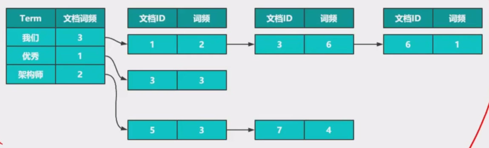
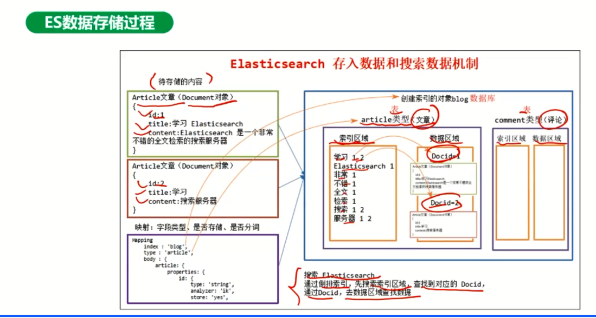

# Elasticsearch核心原理与索引分析

##　ES存储原理剖析

### ES介绍

应用场景之一：ELK（ES+logstash+Kibana）

S1，S2等等将日志发送到kafka，logstash进行处理，将处理后的日志写到ES里，然后kibana进行展现，admin管理员就可以在页面上进行各种查询和搜索。

**ES的本质**：搜索+存储，是基于Lucene构建的一个实时的分布式存储、搜索、分析的引擎。

**Lucene是一个存储引擎**，类似于InnoDB，Lucene也是一个存储引擎。和InnoDB一样，也是不能直接用的（就比方InnoDB是Mysql里面用到的，业务不会直接用。Lucene支持全文搜索。

**和solr的区别**，solr为传统的搜索引擎，是对现有的数据查询性能是非常好的，但是对于实时的数据，solr并不适合。实时产生的数据我想实时被搜索到，那么就用ES最好。已经有的数据，用solr是比较好的。

**ES是一个分布式存储**，既然是分布式，那么就会涉及到分片高可用主从集群等问题

**ES是一个搜索引擎**，既然是搜索，那mysql也可以搜索啊，这里注意，ES的搜索是模糊搜索，mysql也可以，比如 like '%car%'，但是这种就会不走索引，就会全表扫描。相反，ES的模糊搜索就可以大显身手了。

### Lucene架构

**定义**：开源全文检索引擎工具包，但不是一个完成的全文检索引擎，而是给全文检索引擎的架构；提供了完整的索引引擎和检索引擎，部分文本分析引擎。

**Lucene架构（上图）**：

Documents是文档，可以认为是对应MySQL里的一个记录。左侧Documents是指输入

分词引擎，用于分析Documents中的词，产生很多次

索引引擎，词和文档的关系

检索引擎，模糊搜索。

**Lucene分词器**

**倒排索引 VS 正向索引**

正向索引：给定完整的条件，找到确定的一条记录

倒排索引：不完整的条件（或词），模糊找到到记录

**Lucene-倒排**

文档词频（出现在文档中的文档数）和词频率（在一个文档中出现的次数）

**Lucene-FST**【需要进一步了解其原理】

用于查询分词的。字典树的查找

1. FST-Finite State Transducer

2. 字典表的查找
3. TRIE树的优化

根节点是空白的，后面按照字母进行存储，空间复杂度就降低了。可以和hashMap比较一下查询的时间复杂度。

TRIE树的还可以进行AL的模糊查询。是对字典表的优化。

TRIE树是有前缀的。FST在此基础上又做了优化，也可以后缀查询

**FST**

1. 共享前缀
2. 共享后缀
3. 同步哦output定位Term

通过计算一个output值就能定位到相同后缀不能词的一个定位。

**Lucene-SKIPList(跳表)**

1. 倒排中文档ID有序
2. 跳跃间隔
3. 层次

跳表就是对有序链表的二分查找，是对有序链表查找的优化。

**应用场景**

### 索引的写入效率如何保证

#### 数据写入

1. document写入内存缓冲区，同时将数据也写入到translog中。写入内存可以从2开始看；写入到日志文件，其实是直接写到OS cache，是为了高可靠，即使ES挂了，这个document也不会丢。这里还有如果操作系统也挂了，那么这里最多丢5秒的数据（由上图右边分支的写入，每隔5秒就会写入到磁盘）
2. 内存缓冲区每个一秒或者buffer满了就会写入到OS的段文件（页缓存？），每一秒都会写入段的文件，因此他的段的文件是非常多的。只有写入到操作系统的段文件才能建议索引，也才能被ES搜索到，所以ES所有写入的数据会延后1秒（最多一秒）后就能搜索到。准实时。
3. 刷盘，为了提高高可靠，每隔30分钟或者translog已经很大（右图中的OS cache），就会把段文件直接写入到磁盘，写入后会对段文件进行合并，这里commit point会记录当前可用的段文件

**问题**，translog过大是指右边落盘后的文件太大还是右边的os cache太大？左右两边的OS cache以及下面的磁盘之间是独立的还是在空间上有关系的？我看图中是有虚线相连的。

左边落磁盘进行合并是不是和LSM很像，不止这个很像，而且ES的document删除和更新也都很像，

**document删除和更新**：

文档删除也是写入（标记删除），文档更新不会直接更新，而是先标记删除再写入一条新数据。最后再在段合并的时候进行历史数据清理。**其实上面的手段都是为了避免磁盘的随机写入的问题**

**问题**，translog的作用是不是仅仅为了多个备份的作用？为了防止ES异常（比如宕机等）document数据的恢复？

ES实例（存储的例子）：

****

## ES系统架构剖析

## 企业级ES索引构建架构实践

## 企业级ES搜索架构实践

## 企业级ES应用调优
