# 百万级电商平台即时到账通讯系统设计实践

百万级（日活）

P7架构师涵盖的6大块：

基础架构：RPC框架，spring，注册中心，配置中心等。

整体架构：从app到CDN，到LVS到NGX到网关到业务逻辑层到数据库层，链路涉及到的知识点

存储：这个不用说，比如mysql，redis等存储的原理，涉及到数据库层和存储相关的东西。

案例：比如今天讲的IM、风控、交易等。

治理篇：服务治理，服务管控平台，监控等

运维篇：DevOps，CI/CD, 云原生等。

## 即时通讯系统架构设计详解

### 即时通讯系统需求分析

点对点的消息通讯怎么实现，两种模式：

1. 直连，。这里涉及到一个叫P2P打洞的东西，如果双方都处在不同的局域网网络中，如果要建立链接，那么会经历一个非常复杂的P2P打洞的过程。需要借助于一个服务器S，因为A和B（通信的两端）都没有固定的IP，但我们有一个公共的服务器S，A和B都可以链接到S，在S开来，A和B实际上就有一个能够对外使用的IP。但这种情况国家一直在打压，因为网安无法监控管控这种情况的发生。A和B的消息都不会放到S，管控起来就比较麻烦，而且消息也不好漫游，A，B之间的通信消息只能A，B本地才能看到。现在的直连模式往往局限在局域网中（A和B都在一个局域网）。比如飞鸽传书。

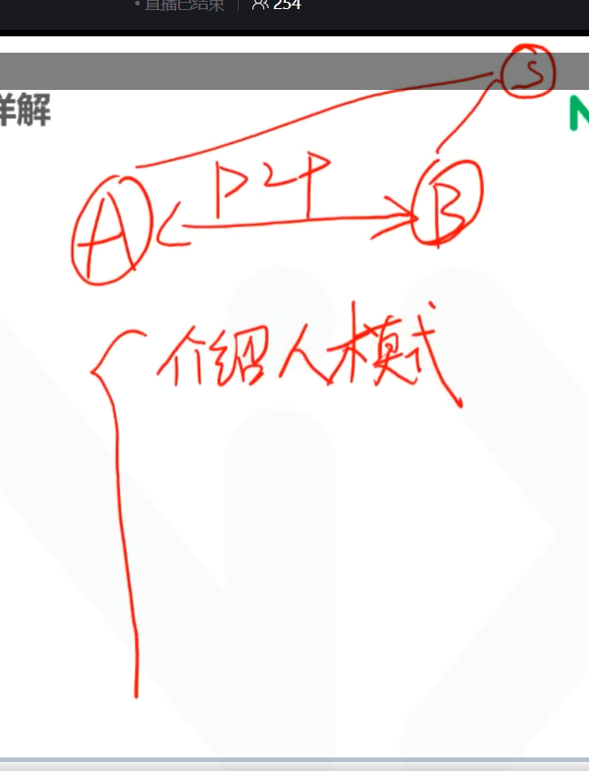

​           也叫介绍人模式

2. 代理模式

   代理模式，是直接通过S服务器，S服务器会保存消息。，S会统一管控

   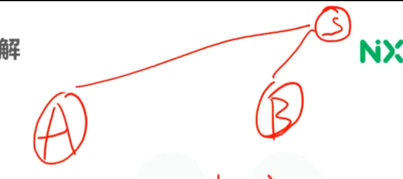

   

**用户在线状态区分**

PC时代有很多状态，

但是移动时代，这个状态就不那么重要的，一般都视为在线，都可以进行互相通信，有网络就在线，没网络就离线。

**联系人/好友列表**

在PC时代，都是好友啥的。在特殊行业，就是联系人，比如这种二手电商的，一般都是联系人。

转转联系人是核心的涉及，很多的表都和联系人表有关。

**离线/在线消息存储**

如果对方离线，先存储，等对方在线了，统一拉去过来。

在线消息：一定会专门存一份，可以实现漫游，比如手机上，电脑上都要可以看到消息。

### 三层架构设计

1. 网关层
2. 业务逻辑层
3. 数据访问层

网关层实际上和其他的不一样，是TCP长连接的。

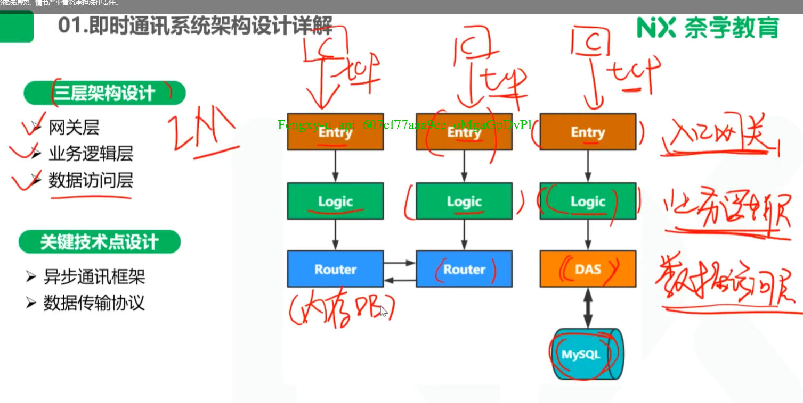

im的网关entry，其目的就是维护和客户端的TCP长连接。

业务请求由logic进行实现，logic就是业务逻辑层。im核心业务就是lodic的职责

数据访问层：数据库的CRUD。

上面的Router是一个内存DB。router是转转自研的。现在已经干掉了，用了redis。

router存一些经常变化的数据。每个entry都有一个id，收到一条消息，怎么知道要推送给哪个entry？那么这个router就是存uid-entry的映射关系。

### **关键技术点设计**

异步通讯框架，单线程的纯异步的一个自研框架，内部用的传输协议是PB

外部到entry就是自定义的TCP的封装。

entry层后期还扩展到了http-entry（支持http协议），ws-entry（支持websocket协议）

### 网关层设计

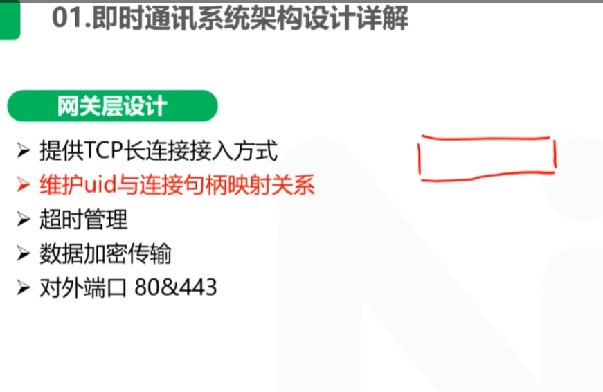

uid和连接句柄映射关系：其实就是uid和socket文件句柄的映射关系

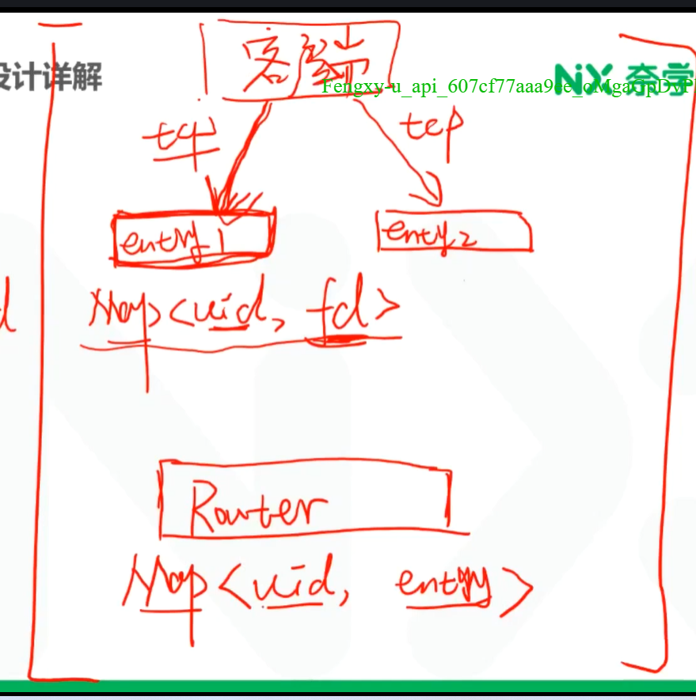

看一下流程， 客户端连接到某个entry的时候，会保存Map<uid, fd>， Router组件会维护Map<uid, entry>的映射关系。当一个消息过来的时候，如果知道要通过哪个socket发回呢？

1. 通过router找到对应的entry，
2. 对应的entry通过uid，找到fd，然后就能将消息返回给接收方。

通过router和entry的两个map就能管理所有的uid和所有的fd在整个集群的映射关系。

**超时管理**

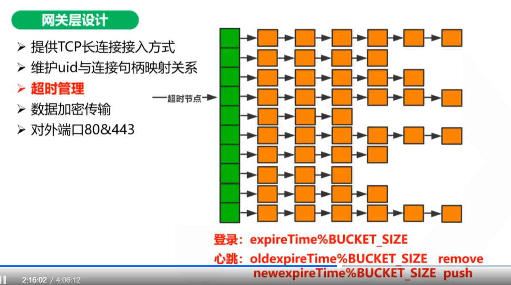

这个图和注册中心里的那个是一样的。

首先要知道弱网络，比如现在带着手机到外面逛一圈，很多地方都是弱网络，比如电梯，厕所，等等地方。

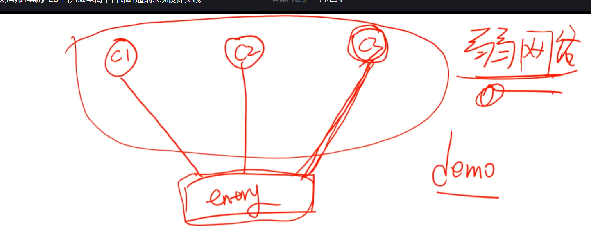

也就说客户端（移动端）和entry之间是经常断网的。

这时候就通过心跳来判断网络是否OK，心跳的作用：

1. 保活
2. 检测延迟

然后就由上面的心跳算法。

这里有如下这些算法：

1.  遍历算法：假如心跳周期是30秒，我们认为2个心跳周期收不到心跳就认为掉线了，那么搞一个map<uid, 心跳时间>,  如果新的连接做增加，如果是心跳来，更新这个map。搞一个独立线程，每隔10秒遍历这个map，如果发现超过60秒了，那么就能达到判断是否要踢开连接。

2. 链表法，上面1这种算法，如果客户端几百几千很OK，但是如果几十万几百万的连接呢，那是不行的。这个时候我们可以看看，大部分（比如90%）连接都是OK的，之后10%左右的连接是检测不OK的。

   这个时候可以用链表，通过尾插法，如果有心跳，那么就把节点放到尾部。这样每次只要从头遍历（头是最不经常访问的，），遍历到心跳在60秒周期内的，就说明后面都是不需要check的了。

   搞一个独立线程，从头开始扫描节点（遍历）就能找出有问题的客户端。

   

3. 动态数组，这里直接看注册中心的那个算法。

   比如现在时间是10：47：00， 来了一个心跳，然后心跳周期20秒，2个周期不来心跳就需要剔除，那么这个心跳的超时时间就是10：47：40，用这个时间用桶的大小取模， 放到对应的桶里面，同时将10：47：40作为应答传回给客户端。下次客户端再来心跳的时候（比如是10：47：20），就把这个时间带过来，找到原来的桶的位置，把这个桶移到10：48：00计算得出的桶的位置。

   另外一个线程，遍历这个桶（比如每秒扫描一次），如果发现这个桶的值（超时时间）已经超时了。就把这个桶里面的客户端全部剔除。

**数据加密传输**

实际上是模仿了https的加密过程。

** 对外端口80&443**

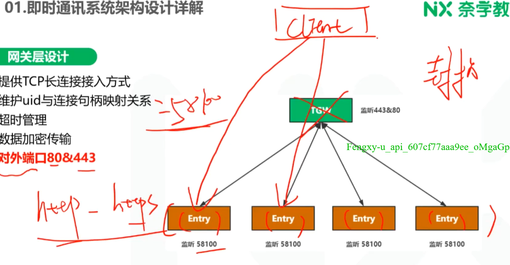

那么一开始，可能是每个client直接连entry，在entry上可能有各种端口（比如58000等等），但是你会发现，这些端口经常被三大网络运营商封掉，因为这些不多见的端口可能是不安全的。

解决办法，TGW（腾讯的一款负载均衡组件），因为转转的机器是在腾讯机房的，所以就用了这个TGW，实际上就是用LVS做的一个集群，很稳定。当然是收费的，但是转转是腾讯投资的，所以比较便宜。

然后所有的客户端还是连的443或80，而且很少被运营商拦截。

转转一开始用的是直连，然后用的是iplist，最后用的TGW，TGW针对entry的扩展很友好，而且如果下掉entry，能将客户端均匀的达到下面的entry上。

思考两个问题：

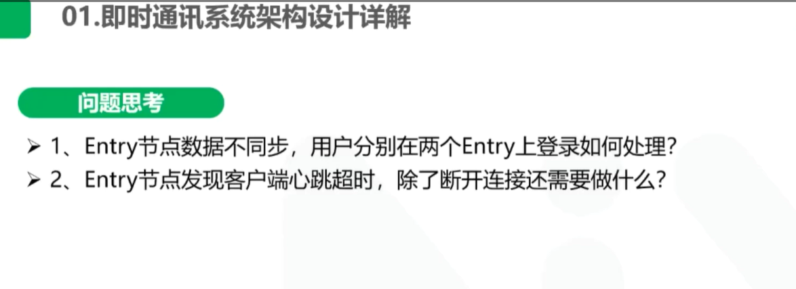

问题1：

router中有Map<uid, entry>，因此通过这个就可以知道最后登录的是哪台entry。

问题2：

1. 需要将Router中的相关记录删除，比如Map<uid, entry>删除等。如果不这样做，就会造成im里面一个经典的问题：假在线。但是假在线实际上不止是这个会造成，当entry无法完成信息删除时，就会存在，比如entry的消息到了logic，logic异常（比如重启），这个时候信息就不能删除。

### 业务逻辑层设计

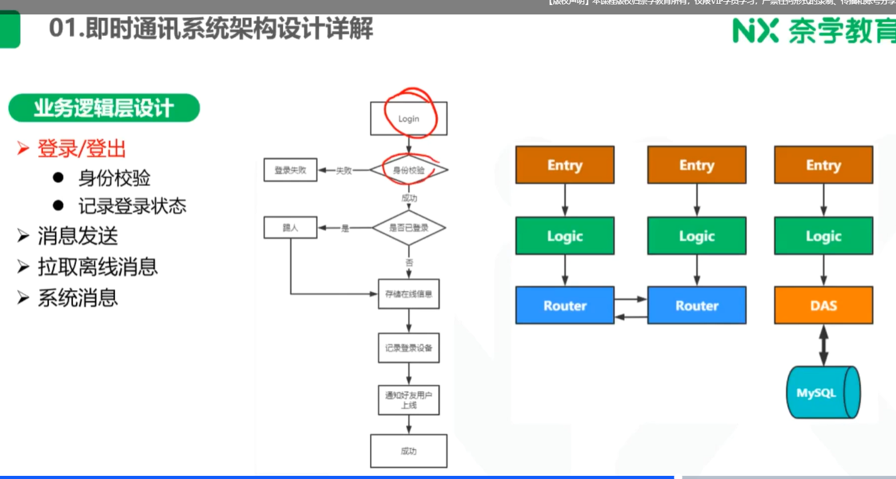

#### 登录/登出

这里面，client登录的时候会获取一个类似token的东西，下次再登录的时候，就会带着这个token，然后请求到logic，logic会验证这个token，如果不存在，那么entry可以直接断开这个连接（因为是不合法的客户端）。

如果一个客户端已经登录了entry2，这个时候用户又用其他设备登录了entry1，那么这个时候存在一个踢人的动作，就是把原先的entry2踢掉，这个就是PC端微信你如果再另外一台机器登录，前面登录的地方就会提示你的微信已经在另外一台机器登录。怎么知道他原先已经登录了”？ 还是通过这个Router找到后，通知对应的entry。

上图中  存储在线信息  实际上就是Router中登记信息到Map<uid, entry>.  Router是互相备份的，防止单点登录

记录登录设备，就是如果客户段是个手机，这里会记录手机的deviceToken（国产前5使用量的手机都有这个deviceToken），方便后面的手机推送，当哪一天你不在线了，别人给你发消息了。作为转转这个平台，我是不是要及时告知你，但是你又没登录。我怎么告知你？那么最经济实惠，最方便的就是手机push，手机push是免费的（也有收费的，比如激光推送），

这里怎么记录，就是logic调用DB，写到数据库就可以。

通知好友用户上线，这个在QQ时代是有的，现在是没有的。

登出这个功能，这个已经很少有人在用了。现在大部分的登出都是靠entry的心跳。

上述为**登录流程**

#### 消息发送

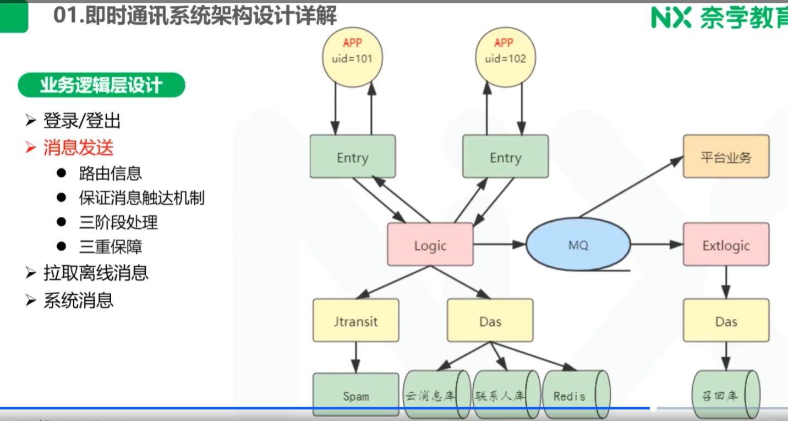

这里架构上考虑一个“轻重分离”的，就是轻量级的核心的，及时性比较高的业务，和重量级的边缘的业务分开。

比如上图中logic就是一个核心业务，非核心业务边缘业务扩展业务运营业务由Extlogic进行处理, Logic和extlogic既然分开了，怎么通信，使用MQ。MQ就起到了分离的作用。

Redis就是前面架构中的router，转转后来由Redis代替了。原先的router很重。

Jtransit和Spam就是logic业务逻辑的一部分，需要访问其他的服务。

消息的发送过程，分成了**三个阶段处理**，并且由**三重保障**

IM的核心就是如果你在线就要即时推送给你，即时你不在线，也要保证消息的触达，比如通过手机推送，微信或短信方式，IM在这块应该做到即时 + 可靠

看一下这张图：

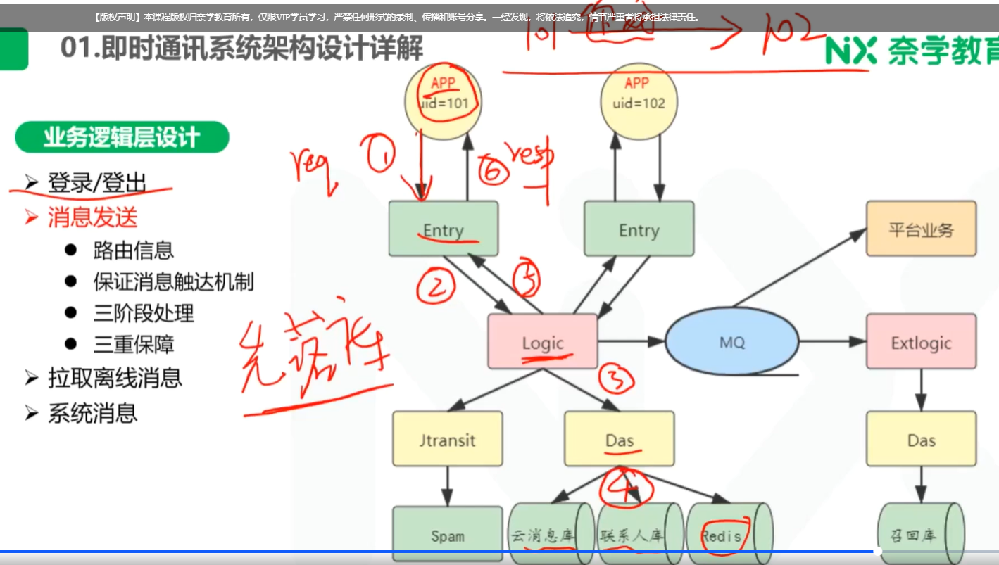

这个图反应了发送的流程：

1. entry接收到app101发送来的”你好“的消息
2. entry只负责处理连接，不关心消息，直接把消息发给logic处理
3. logic收到后，先落库（这里一定要先落库），对应图上的3和4，
4. logic处理完返回给entry
5. entry将reponse返回给客户端

如果在落地成功后，但是消息没有正常返回，比如6失败，那么一般（比如在微信）就由一个红色感叹号，你可以重发。那么重发就会消息重复，这里就要做幂等处理。

还有就是落库失败了，那就是真的失败了。

上述为第一个阶段：消息发送阶段

第二个阶段：消息推送过程

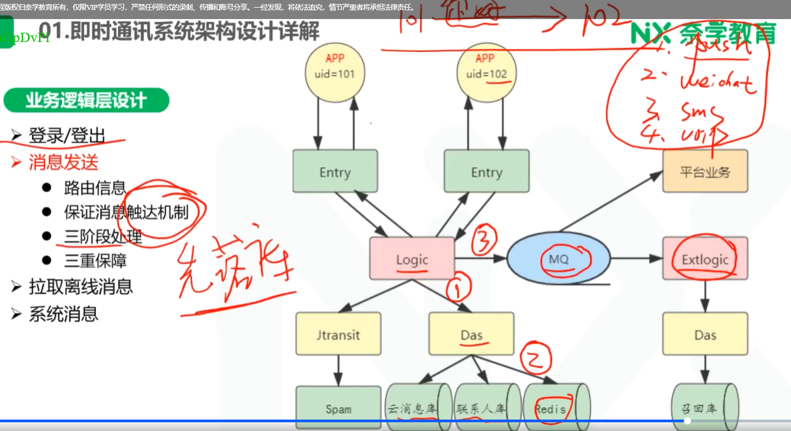

先说不在线的情况，logic先到redis（先前的router）看看消息接口方（uid102）在不在线，如果不在先，会让extlogic做处理，利用各种手段推送到102，比如手机推送，微信通知，sms，voip等手段通知。

第一层保障：通过redis或者102在线或不在线。

如果在线，redis会告诉102位于哪一台entry，这里就有问题了，就是假在线问题（数据不一致问题导致），entry可能看102已经不在线了。这个时候以entry为准，如果ientry说不在线了，就按照不在线处理，这个时候entry会往logic发送一个unreachable事件。告诉102不在线。这个就是第二层保障。

第二层保障：entry发现不在线，entry发送unreachable事件。

logic收到unreachable后，logic发送给extlogic进行处理，和原来的一样的处理（通过各种方式推送消息）

如果entry也发现102在线了，那么就把消息在长连接上面推送给102，第二阶段完成。

上面还没完，entry把消息推给102后，102要恢复一个resp，这个就是第三个阶段。

logic需要等待102的ack，如果一定时间等不到102的ack，那么就会认为102离线了。logic会继续走MQ做前面一样的处理。这个是最后一层保障

第三层保障：logic等不到102的ack，发送extlogic继续处理。

下面有个问题，logic要处理成千上万的类似102的ack回复，logic怎么处理比较好呢？这里会涉及到时间轮算法。

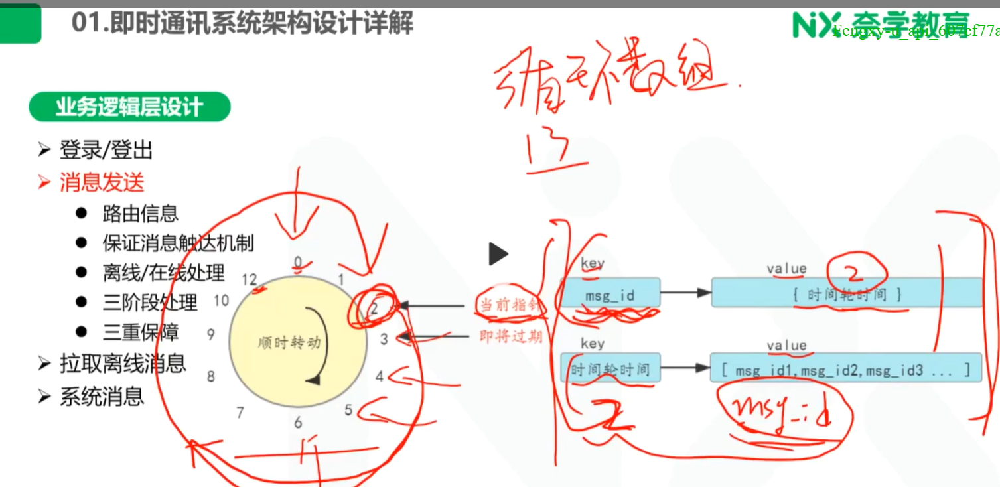

他是怎么通过时间轮管理这么多客户端的。

看一下时间轮是如何做到对ack的应答的处理，有2个数据结构：

1. map<msg_id, 时间轮时间>
2. map<时间轮时间，所有的这个时间（他们时间轮时间一样）发送的msgid集合>

时间轮时间你可以认为是发送这一刻通过时间计算得到的一个值。 这两个数据结果都可以保存在redis中。

时间轮不停的转动，如果发现3这个时间已经过期了，那么就可以认为3对应的所有msgid集合都过期了（在规定时间内没收到ack）。

#### 拉取离线消息

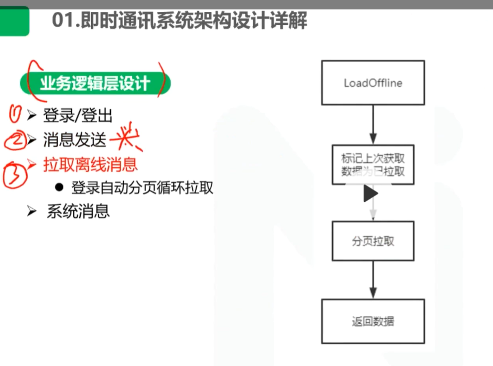

先说一下IM要存哪些消息	

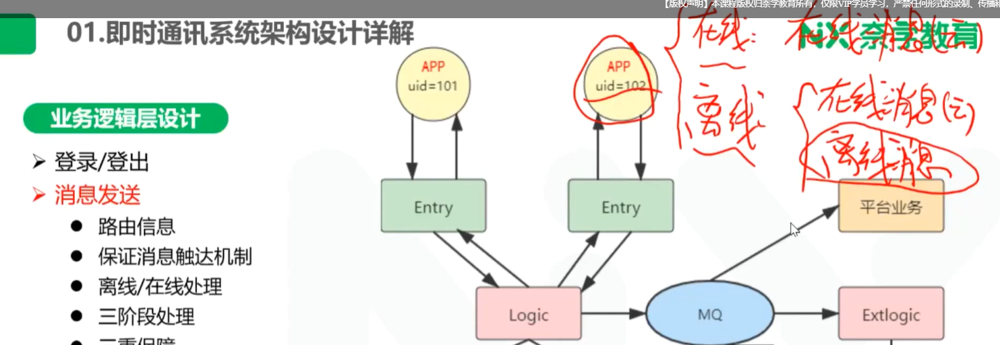

如果在线，就是存在线消息库（云消息库）

如果离线，除了在线消息也要存离线消息（方便客户端拉取）

我们看看怎么拉取。

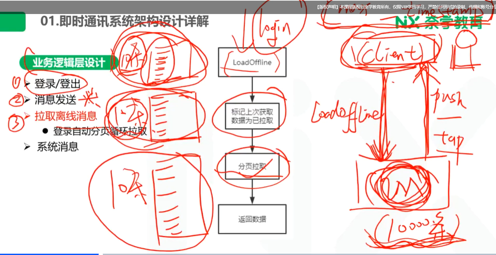

这里我们看一下，首先拉取离线消息的时机是什么？

时机是用户登录的时候，会拉取需要拉取的离线消息，步骤：

1. loadOffine，直接从已标记拉取的地方拉取数据，那么是不是一次把所有的离线消息都拉取呢，当然不是，如果全部拉取是不是一个tcp消息太大（考虑10000条消息），所以拉取的方式是一次多少条的拉取，加入一次10条。

   1.1  客户端将已经拉取到本地的消息的最大时间戳发给服务器，服务器根据这个值按照升序拉取10条给客户端

   1.2  客户端接收到后，把新的最大的时间戳发送给服务器。服务器首先会根据客户端发送的标志（比如可以通过这个最大的时间戳）将已经发送成功的消息标记未已拉取（update状态），然后再根据这个最大的时间戳返回新的10条数据。

   这个就是分页拉取的流程。

   这里分析一下，这个登录自动分页循环拉取有什么问题。

   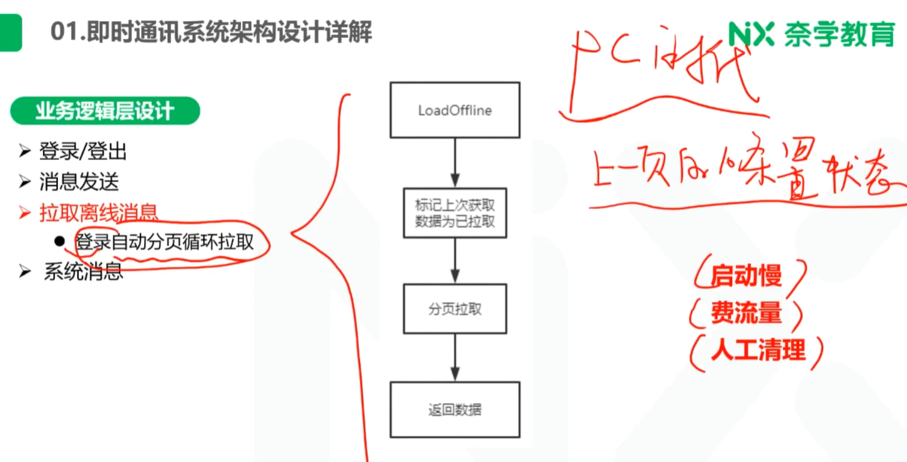

   

有如下问题：

1. 客户端启动慢，是不是如果离线消息由10000条，只有把这些消息都拉取到本地，客户端才能启动成功，这个就会非常慢
2. 费流量，这个消息多的话是肯定的。
3. 人工清理，每天凌晨的时候会将已经置状态的消息清理掉（这些消息已经被客户端正常拉取了，不再需要了）

上述是PC时代，移动时代就不这么去玩了。

#### 系统消息

有两种消息，p2p就是前面说的，用户和用户的消息，s2p就是系统对用户的消息。s2p有通知消息和批量消息之分

通知消息一般是发给一个人，比如下单的时候，支付成功的时候系统都会给你发消息。

批量也叫广播消息，1对多的消息。比如明天有个活动，会广播给指定的用户。

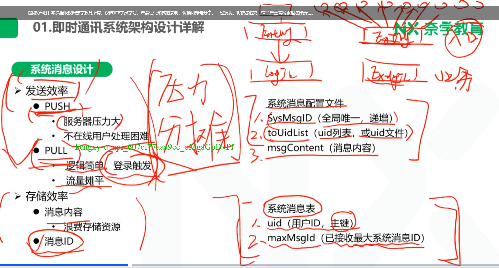

##### 发送效率

push？pull？

push存在很多的复杂性，一个是性能，特别是批量消息，服务器压力很大。另外一个用户不在线怎么处理。这个时候就可以考虑压力分摊，也是一个设计的思路。可以将压力分摊到客户端，再客户端登录的时候来触发pull消息。因为每个客户端登录时间不一样，这样流量就分摊了。也可以在心跳的时候拉取消息。

##### 存储效率

只存消息id，消息内容只要存一个地方就可以了。  有个系统消息表，uid-已接收的最大消息ID。  系统消息配置文件，id，消息内容，和需要发送的用户列表。

##### 系统消息设计

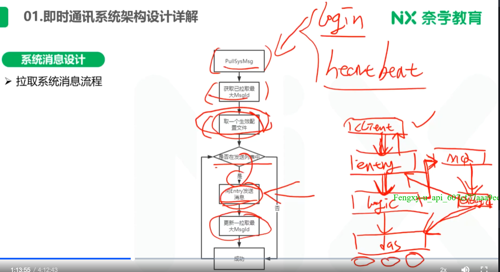

步骤：

1. 客户端在登录或心跳的时候（触发拉取系统消息的时机）将已拉取的最大的msgId带给服务器，服务器根据这个取一个生效的配置文件（见前面的系统消息配置文件），
2. 用户在发送列表吗？每个系统消息都会有一个用户列表，只有在用户列表里的用户才需要拉取消息
3. 如果是，那么就会给entry推系统消息
4. 更新拉取最大msgId。

### 数据访问层

Router【未看】和DAS【未看】

## 纯异步高性能开发框架深度剖析【未看】

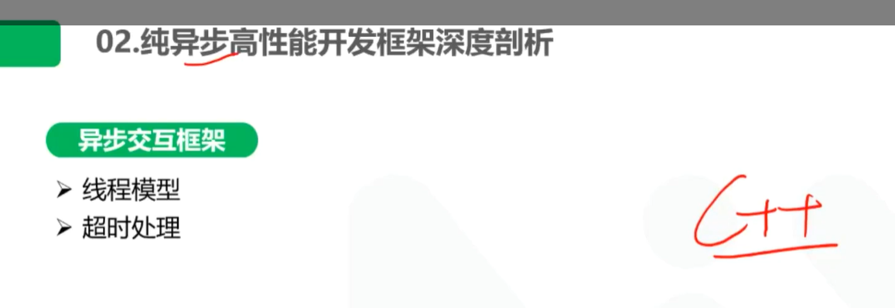

## 电商即时通讯系统设计实践【未看】

## 设计实践作业【未看】

