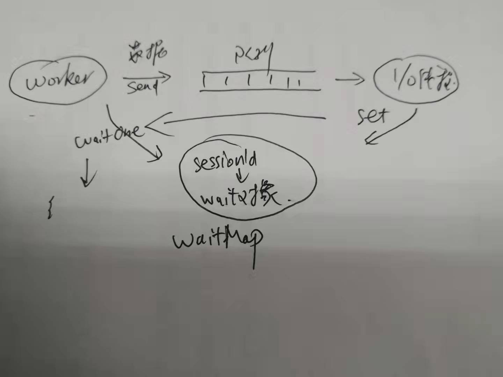

# RPC框架深入剖析与设计

## RPC实现原理深入分析

###　RPC作用

屏蔽组包解包、屏蔽数据发送接收、提高开发效

### PRC核心组成

序列化/反序列号， 负载均衡和路由，连接管理，远程对象方法代理

RPC调用方式：同步调用和异步调用。

### RPC调用过程

 

代理->序列化->网络传输->反序列化->服务端代理

## 精简版RPC调用代码实例

### 没有RPC如何实现远程调用

client端                                                   server端

​                                                               （1）监听端口

（2）建立与server的连接                      （3）响应连接请求

（4）组装数据

（5）发送数据包                                    （6）接收数据包

​                                                               （7）解析数据包并调用相应方法

​                                                               （8）组装请求处理结果数据包

​                                                               （9）发送结果数据包

（10）接收处理结果数据包

（11）解析返回数据包

### 精简版RPC调用代码实现

如果自己考虑实现一套RPC调用，最关键的不是网络连接那一套，而是协议

【to be continue】：实现代码演练，序列化和反序列化的通用代码掌握，也就是包括上面11个流程的过程。目的是清楚RPC调用的具体过程，清楚序列化和反序列化的通用代码逻辑。	

## RPC服务消费方设计实现

RPC核心八大块：

### 客户端

#### 连接管理

##### **初始化时机**

RPC的初始连接有两种模式

饿汉式：重启的时候立马建立与下游的连接，不管有没有请求过来。有可能浪费资源，如果下游较少，可以使用饿汉式连接

懒汉式：需要的时候建立连接，对于下游节点比较多，而且每个节点的访问频率不同的情况可以采用懒汉式

##### **连接数维护**

##### **心跳/重连**

##### **客户端线程模型**

对于RPC连接管理，先看看连接的管理

1. 数据库连接，数据库采用了半双工通信，因此如果只有一条连接，那么效率比较低，同一个时间，只能执行一条SQL，因此有了数据库连接池，客户端一般使用数据库连接池，有几十条连接。对于使用数据库连接池的work线程池，既要干活，又要做I/O的事情。而且work线程池的大小一般要大于数据库连接池的数量，否则无法充分利用连接池中的数据库连接 
2. RPC连接池，可以设计为半双工，也可以全双工。因为可以双向通信，因此可以单条也可以多条。一般RPC和一个服务提供方只采用一个连接。客户端会对每一个服务提供方建立一个连接。

RPC连接池是针对多个下游。那么使用RPC连接池的线程池，他干了啥，他只干work的事情，不做I/O的事情，IO的事情谁做？ RPC池来做。

**客户端线程模型如下**

一个或多个IO线程，两个队列，一个是请求队列，一个是应答队列。work线程只是将请求放入队列中，然后阻塞，等应答回来的时候，再唤醒work线程，将结果返回。

#### 负载均衡

负载均衡，不是指的均匀，而是指均衡，合理。确保多个服务提供方节点流量合理，支持节点扩容和发布。负载均衡是在连接管理的上游。

##### 轮询

##### 随机

 ##### 取模

##### 带权重

特点：

1. 权重0~10范围内取值
2. 值越大表示权重越高
3. 权重高分配流量比较大。

带权重的负载均衡往往是和其他几种负载均衡结合使用的，比如轮训+带权重、等等

1. 轮询 + 带权重

   

   比如如上图的这样一个权重，第一个节点25%，第二个节点50%，第三个25%，这样第一个请求，先打到节点1，然后2,3请求打到节点2，第4个请求打到节点3.

   这个只是理论上的，现实一般不会使用这种方式。

2. 随机 + 带权重

​                                                                          

​       右边的一个0~100的数据区间，使用一个随机生成的随机数（0~100），落到0~25的就打到节点1， 落到25~75的就落到节点2，落到75~100的就落到节点3， 通过这种方式实现带权重的流量随机分配。问题是，一个请求就要产生一个随机数，这个是一个CPU密集型的操作，这个是缺陷。

那么对于带权重的流量分配，有一个方案：权重数组

3. 权重数组

   数据结构：

   3.1    根据权重值填充

   3.2    0，1的位置随机打乱

   

   预先给每一个服务提供方的节点创建这样一个数组，长度一般可以是10. 数据里面的值要么是0，要么是1,0表示我要使用这个节点，1表示不适用节点。

   ​                                                                  

   0和1的数量和权重值相匹配，实际流量来了之后，可以轮询这个数组，如果是1就不适用这个节点，如果是0就使用这个节点。

   ​                                 

   比如这种，根据index去轮询，index=0，轮询到某个节点的某个index，是0就让流量过去，是1就继续轮询，直到为0就让流量过去那个节点。

##### 一致性哈希

#### 路由分发

​                                               

**定义**：通过一些列规则过滤出可以选择的服务提供方列表，在应用隔离、灰度发布、读写分离中都发挥着作用。     

Router其实就是过滤，要过滤就需要有过滤的规则。

##### 路由功能设计

1. 匹配规则: 待比较的属性/运算符/比较的值/匹配节点，比如如下这个规则：

   

   属性是IP，IP在IP1，IP2之内的，那么流量就走Node1和Node2

   

   数据结构：使用链表，

   

   

   

   

   比如如上图的实例，第一个过滤器，所有调用都不走A-1，言下之意就是，所有的流量都只走2,3，4. 然后经过第二个filter2， 灰度流量走A-1. ，这个最终结果就是灰度流量走1， 正常流量走2,3,4

   再比如说，实际情况是，经常会将服务提供方进行分组，比如双11搞活动，准备把活动相关的流程打到A3，A4，然后把A3，A4的机器配合提高到64核等等，高流量高配置，这个组（a3a4）里面的流量只承载核心的流量，然后你就可以将上游的流量打个标签，只让有标签的流量打到这个分组，其他的流量不允许打到A3A4

   

#### 超时处理

客户端还有超市处理，即如果客户端在一定的时间内还没有收到服务端的回包，那么消费端就是抛出超时异常。从而提示上游这个请求超时了。

超时的大体逻辑：

这里有工作线程和I/O线程，我们看看步骤

1. work线程将数据包发送到一个队列中，同时把当前数据包的sessionId和一个wait对象的绑定关系放到一个等待Map中，
2. work线程调用wait对象的waitOne（实际上使用带超时时间的countDownLatch.wait方式），work线程阻塞
3. I/O线程拿到数据包后进行处理，等回包来的时候，解析出sessionId，并从等待map中获取wait对象，
4. I/O线程调用wait对象的set方法（countDownLatch.countDown())方法唤醒work线程
5. work拿到回包后继续处理，如果在指定的时候拿不到，那么就超时了。这个就是超时处理

## RPC服务提供方设计实现

#### 服务端

##### 队列/线程池

注意考察两个指标：对耗时任务的容忍性/加锁开销。同时实验表明，在一定的压力下，两者区别不大（等待时间和执行时间两个指标）

##### 超时丢弃

超时丢弃：快速失败已经超时的请求，缓解队列堆积

##### 优雅关闭

##### 过载保护

### 总结

​     超时丢弃/优雅关闭/过载保护  都是一种柔性可用的手段。

## RPC高级功能实现

服务熔断/服务降级/限流/动态权重

### 服务熔断

当某服务出现**不可用或响应超时**的情况时，服务消费方暂停对下游服务的调用，以防止整个系统出现雪崩

### 服务降级

对业务降级，跳过异常调用，返回关键数据，确保服务可用

### 动态权重

为刚启动节点分配较低权重，并逐步提高权重

### 限流

通过调用方流量，以达到对服务提供方的保护。

服务熔断是对调用方说的，动态权重是对调用方，限流是对调用方，服务降级是针对业务，我下游服务不可用，我上游做一些补偿措施。服务熔断/动态权重/限流都是  限制上游--->保护下游--->柔性可用（目的）

**互联网追求高吞吐量，高可用性 **

## 主流RPC产品选型

一般会根据如下几个维度来选型RPC

1. 语言：是否支持多语言
2. 框架特性：
3. 成熟度
4. 技术支持
5. 社区活跃度

gRPC(google)/Dubbo(ali)/brpc(baidu)/Thrift(facebook)

### gRPC

由google开发，语言中立、平台中立、高性能、开源通用的RPC框架,为什么要语言中立，要考虑他是google，他的产品面向全世界，要考虑各个厂商，各个不同平台。比如下图：

C++的客户端可以调用PHP的服务端

#### 传输协议

HTTP/2，注意是2，不是1。http2是支持长连接的。

#### 接口定义和序列化

PB（protoBuf）

#### 客户端寻址

本地配置，需要开发注册中心，言外之意就是没有注册中心

#### 支持多语言

Java，C++，Python，GO，Ruby，Node.js，C#等

### Dubbo

阿里巴巴开元的一个高性能优秀的服务框架，致力于提供高性能和透明化的RPC远程服务调用，和spring无缝集成

#### 传输/序列化

多种通信协议面向不同的应用场景

#### 语言

仅java

#### 扩展性

Dubbo SPI机制

#### 配套设施

自带注册中心和监控

### brpc

典型特征：高性能

最牛的就是brpc，

#### 传输/序列化

多种通信协议面向不同的应用场景

#### 语言

C++，java

### Thrift

facebook在07年开发的框架，包括独特的序列化格式和IDL，支持多开发语言

#### 传输/序列化

多种通信协议面向不同的应用场景

#### 语言

多语言，跨语言，跨平台

### 总体比较

开发语言，注册中心，侧重点，还有社区支持度是几个主要的考察点。

记住几个重要的特征：

1.  Dubbo重在服务治理比较好，也因为这个用的人比较多。gRPC和Thrift均需要自己实现
2. 性能最好的是brpc，如果公司用的C++而且对性能要求极高，可选择brpc
3. 跨语言的只有国外的产品，Thrift和gRPC，
4. 通讯协议，gRpc比较特殊，使用的是HTTP/2.其他都支持多种协议和多种场景。
5. 序列化，brpc和gRPC只支持pb？其他两款可支持多款。

## Dubbo原理和源码【暂时未看】

## RPC【总结】~你到底学到了什么

### （一）RPC的几大功能

客户端：路由、负载均衡、连接管理、超时处理

服务端：队列/线程池、过载保护、超时丢弃、优雅关闭

高级功能：服务熔断（客户端）、服务降级（业务）、动态权重（客户端，上游）、限流（客户端）

### （二）路由

路由的目的是什么？这里的路由就是对请求的路由，路由就是为了将不同的请求打到不同的服务上，请求的路由可以分为如下几种：

1. 网关对下游的请求路由，这一部分路由可以通过Zuul、gateway、Kong等网关来完成，这些网关会根据一定的规则对请求的url（基于url的数据格式）进行路由，网关对请求的路由是服务粒度的，而不是节点粒度的，

2. 服务和服务之间的RPC调用的路由是将请求到某个服务的请求基于一定的规则路由到其中某些实例节点，比如灰度发布场景中需要将小部分流量打入专门的节点，而大部分流量不需要打入这个节点。路由的原理就是给定一组集群实例列表（同一个服务的），通过规则来过滤请求，从而达到将某些请求只路由到指定下游节点的目的。在设计的时候一般每个过滤器都是单一的属性值运算，这样通过这些过滤器组合就可以完成最终不同请求打到不同节点的目的。比如服务提供方P有三个下游节点，P1是灰度节点，只允许请求参数中type值为abtest的请求走P1，其他请求打到P2，P3两个节点中，那么这个filter就可以这样设计：

   1. 第一个过滤器，所有的请求只走P2，P3两个节点；
   2. 第二个过滤器，属性为type，值为abtest的请求走P1，

   这样，就能达到所有的type值为abtest的请求走P1，其他请求走P2和P3的路由目的。

   更进一步，可以设计过滤的算法，比如待比较属性，运算符（equal，in, greater,lower,between,not in等等），属性匹配值，匹配节点（如果满足前面的运算，请求就打入的节点）。

   数据结构（主要是filter），可以直接用链表

### （三）负载均衡

负责均衡我们要学习啥？这里仅仅讨论的是RPC中的负载均衡，而不是广义上的负载均衡

RPC中的负载均衡就是请求链上的最后一次请求分发，在路由（如果有）之后，请求仅仅需要打在服务集群中的部分节点集，那么这部分请求如何在节点集中负载？主要有轮询、随机、权重和一致性哈希。轮询、随机一般适用于请求只需要均匀分布在下游节点集中即可。

权重这种在RPC中还是比较常见的一种需求，也就是要求达到下游的流量根据节点权重有所不同，比如三个下游节点P1，P2，P3，但是P1，P2因为机器配置不好，因此配置了将P1，P2的权重配置为25%，25%，P3为50%。如何设计？

1. 按照(1,1,2)这样的顺序来安排请求，也就是P1一个，P2一个，P3两个，这样的顺序打流量。这个实际上是轮询+权重。这个被证明是有问题的（？？）
2. 按照随机+权重，可以考虑设计一个数组，数组的长度为100。每个请求要发到下游节点的时候，随机生成一个1~100的数，落在1~25，发给P1，落在26~50发给P2，落在51~100发给P3，这样是可以满足要求的。

1. 但是每个请求都要耗费CPU来计算这个随机数，这是一个很耗CPU的操作，如果有大量的请求，CPU资源将有很大一部分在生成随机数上。怎么破？ 

   权重数组的设计，如下：

对调用的每个下游的节点维护一个数组，数组的元素为0或1，数据长度可以自定义，智能能保证0（表示通过，1表示不通过）的占比符合权重即可，比如上面的例子中，50%的流量打到P3，那么0和1各占比一般。数组的0和1无序排列。

维护一个index，index从0开始，到数组长度结束，比如请求1过来了，从最下面的数组开始，0表示打到P3，然后下一个请求从第二个数组，是1，那么不走P2，然后第一个数组，index=0的位置为0，表示打到P1，这样index递增，每个数组判断，如果0就打到对应的下游节点，否则就继续移动指针。

### （四）

## RPC【总结】~还有那些需要加强的

### 1. 从分析一个使用较多的RPC框架来看看RPC的整体功能和处理流程

