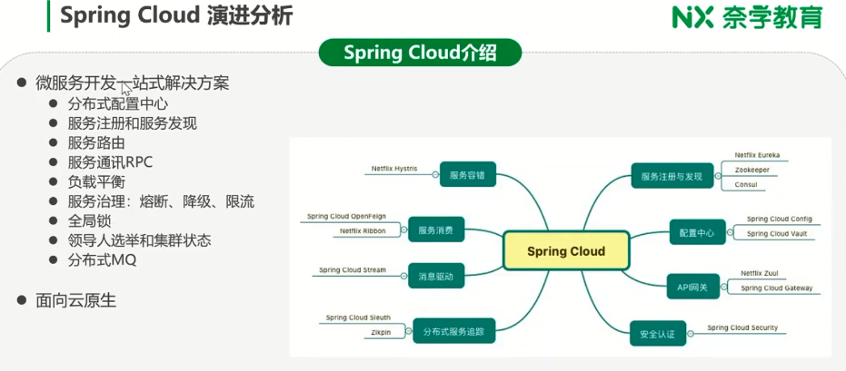
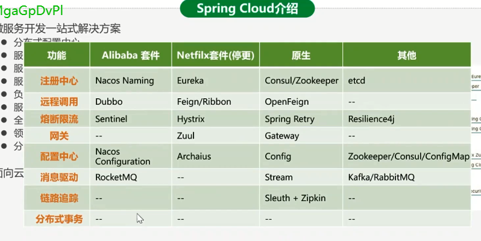
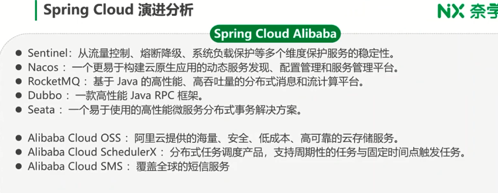
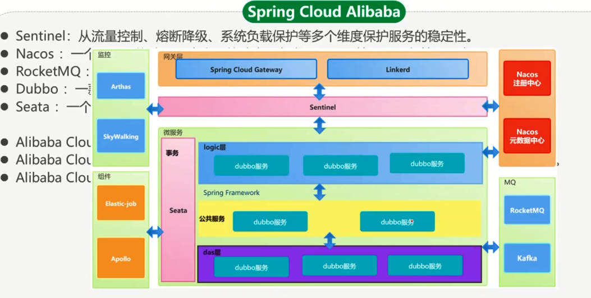
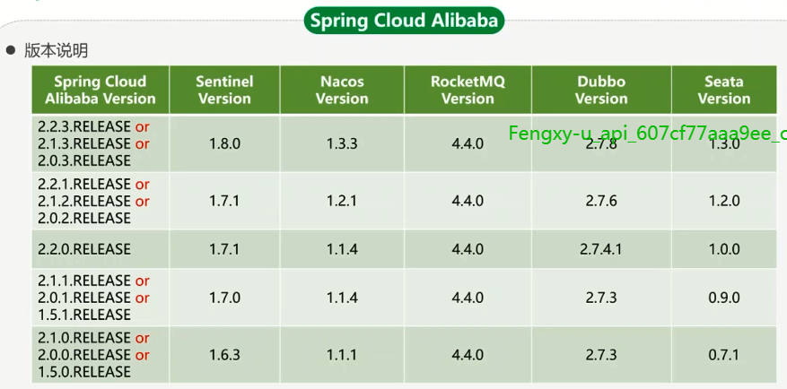
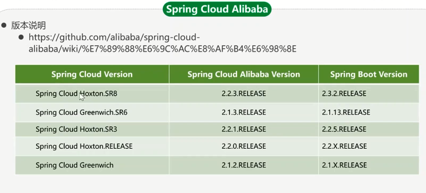
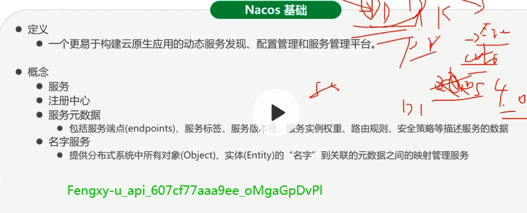
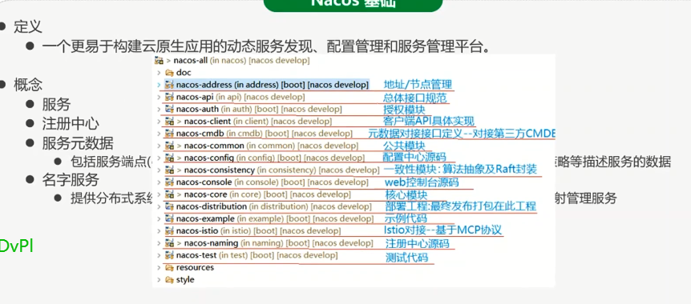
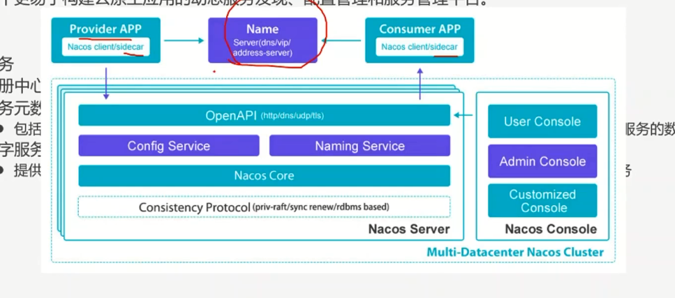
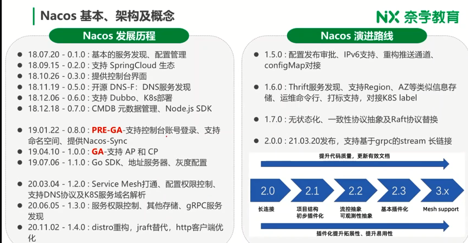

# Spring Cloud Alibaba之Nacos设计原理剖析

spring cloud stream 是指对消息的包装，

Dubbo3.0集成了注册中心，他有个插件化的东西， 只要把新的注册中心以插件化的方式集成进来就OK了。

spring cloud原生的除了网关Gateway可以用一下，其他的也没太多好处。比如zk做注册中心，如果你微服务有上万台，因为zk是cp模型，有Leader和Foller，写都在主，如果集中上线，特别是大促的时候，leader的压力是非常大的，大促的时候重启也非常慢，所以这时候zk就不合适了，一定要用AP模型，用ap的话要么换协议，或用消息组件，协议可以用gossip协议

nacos有两个协议，一个是raft协议，一个是disto协议。raft保证数据存储的一致性，统一配置这块用的。服务注册这块是用disto，最终一致的一个东西。

消息驱动，kafka性能最高，但是主要是做olap的。离线用。

在线的话RocketMQ性能是要好于RabbitMQ，组件比较多的，吞吐量没有rocketmq高。

## Spring cloud演进分析

Sentinel是和Redis进行配置做的限流。能做到集群限流。放在网关是比较合适的，就是网关的一个集群限流。

超时时间可以根据流量进行调整，这是一个时间，比如在流量小的时候一个超时实践，当大促或流量大的时候把超时时间设置的小一些。比如和外部的服务的超时时间有个动态配置。

因为网关对不同的公司，定制性还是比较强的，所以spring cloud alibaba就没有实现网关。

网关可以用Gateway等组件，或者直接使用nginx+lua也是可以的。实现起来也是比较简单的。

Nacos注册中心和元数据中心分开了。

skywalking链路跟踪，需要能够智能的识别，比如因为某个下游服务挂了，引起连锁反应，需要能识别出是哪个下游导致的问题。

apollo配置，多机房配置更友好。

## nacos基本、架构和概念

> 一个更易于构建云原生应用的动态服务发现、配置管理和服务管理平台

DDD，顶层设计是相当好的，但落实到代码就要根据自己公司的定义和理解。

目前nacos的服务管理平台不是特别好，连监控的图都没有。

cmdb 资产管理

上面是nacos 1.6版本的东西

## （后面未细看）
