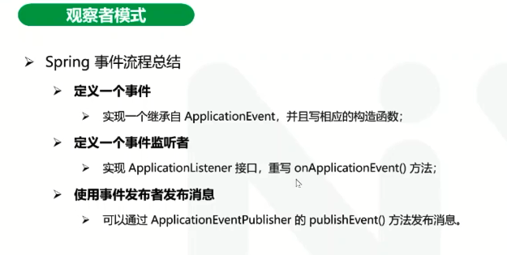
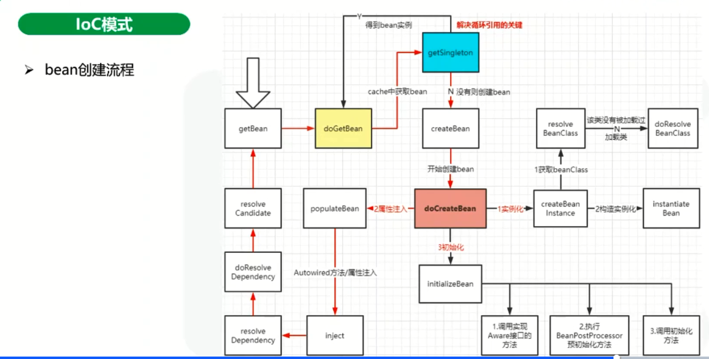
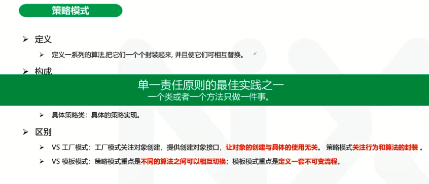
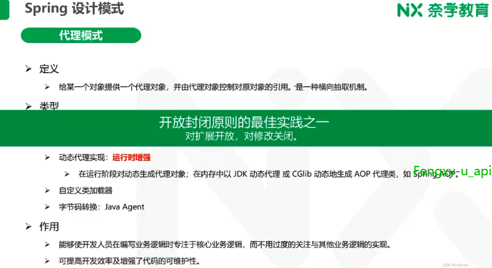

# **Spring生态架构设计与实践**

## spring生态和演进分析

spring做了哪些。如上。

Iaas，Paas,Saas,Faas，Baas

三大两小

Web apps包括spring MVC等

spring batch：离线的，大数据相关的。

这张图是比较老的图。

上图是现在的：

spring boot

## spring设计思想深入分析

单纯的设计模式，其实没多大意思，主要是要将相应的思想运用到架构中去。

可以用如上的几个指导意义考虑单一原则。

单一原则并不是拆的越细越好，

主要防止大而全的类，防止不想关的功能耦合在一起。

开闭原则

## spring设计模式和核心功能深入剖析

> 本质，是面向对象设计原则的实际运用，是对类的封装性、继承性和多态性以及类的关联关系和组合关系的充分理解

有GOF的23中，J2EE的，以及IOC的模式

现在大厂都在 ： DDD + 设计模式

复用 + 扩展性

### 工厂模式

 	

上图是spring的工厂方法。

### 模板模式

我们从spring的事务管理器看一下模板方式是怎么用的：

模板方式是依赖倒置原则的最佳实践之一

观察者模式

从架构上来说，比如zookeeper的watch机制，实际上就是观察者模式。

其中DI，除了DI，还有依赖查找，都可以实现注入（实现）。

注意，从上到下，层次越低，比如DIP是最高的设计原则，然后才是理论，然后实现

Ioc里面的架构涉及到了观察者模式，模板模式，反射 工长模式，如下图：

bean的创建流程

流程：实例化，属性注入，初始化。

