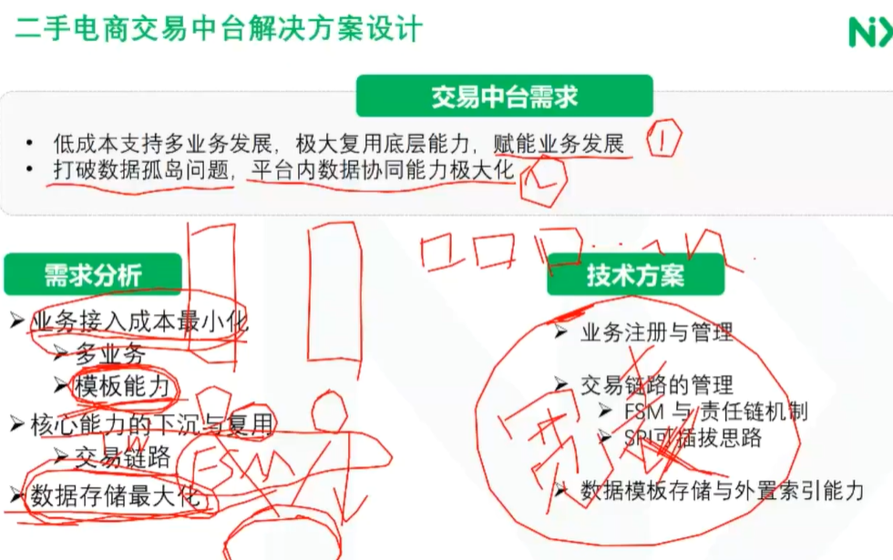

# 企业级交易系统设计（交易相关）

## 二手电商交易链路设计

各种中台。

### 二手电商

> 电商是互联网商业化的最直接模式，
>
> 二手电商是电商的一种，区别传统电商具有许多个性化的东西。

二手电商前台庞大复杂（c2c，b2c，c2p2c，c2b2c 等等等等），

所以就必须要设计一套交易链路来满足上述的业务。

### 交易链路

以上为一个正向流程（无异常业务）

如上为负向行为，在订单支付的每个环节都有可能出现负向行为，比如取消订单、支付不成功、退款、拒绝退款等。发生时间可以在支付前支付后发货前发货后等等。

再来看一下状态：

​	注意，上图中上面的退款是只没有发货的时候的退款，下面的退款是指已发货的退款。

上面不是list，是一个图，因此需要用一种数据结构表达出这幅图。   枚举表示所有的状态。

拓扑图里面最小的结构就是从一个状态在什么动作下到另外一个状态的跃迁

## 二手电商交易基础能力建设演进

### 交易链路需求

我们看到前面的分析，状态是一个图，那么怎么样更好的管理这个状态以及状态之间的流转？如果状态增加了或减少了，如何维护？

业务有哪些痛点?

1. 拓补图复杂，上面交易的状态其实并不是太复杂，但是还有更加复杂的业务场景，其拓扑图可能更加复杂。
2. 传统的switch无法支持高效开发
3. 代码的耦合度高

因此引入FSM，状态机。

### FSM

> Finite State Machine
>
> 有限状态以及在状态之间转移和动作等行为的数学模型

也就是对状态图进行抽象。考虑状态的最小单位，以及怎么在db中结构化存储这个状态。

#### FSM框架

上图是FSM框架要处理的一些逻辑，对应实际的表来看看：

source_status是初始状态，target_status是目标状态，handler是动作，也就是说状态source_status在动作handler下会转换到状态target_status. 

role是权限，不是每个人都可以执行操作，有权限控制，

op_type,操作类型

fsm_type表示状态机的类型，这里是按照业务来分的，比如B2C是一种业务，他是一种状态机，如果c2c那么状态机就是另外一种。

job_codes，可能是定时任务，可能不是一次就能完成的，可能要持续做某些工作的（没懂），才能完成状态的流转。

transaction_codes,比如状态从已支付到退款中，可能涉及到分布式事务，告诉其他模块状态有跃迁，需要进行处理。

#### FSM执行机

其实就是状态机的流转逻辑的设计

右边的DefaultFsmEngine是FSM引擎，相当于把前面表的数据装载到内存。

FSM的初始化:

FsmTemplate就是一个FSM，

FsmNode就是前面说的状态的一个最小单位，也是表里面的一条数据就是一个FsmNode

右边是一个状态机的初始化配置。比如从数据库中加载。

这里能看到perform代码中会做一些事务性的东西。

下面看一下确认收货的Action：

#### fsm优缺点

可以使用责任链模式或反射实现可插拔的设计

有的复杂的业务，可以使用多个FSM状态机，比如支付和退款分开状态机，因为退款和支付可能是不同的微服务。

另外action也可以是多个。

### 基础能力建设1.0需求

业务逻辑层都放在一起，会引起很多问题。

那么就要拆分，如下图：

如果退款和订单服务进行了拆分，那么FSM也建议拆开，否则还是耦合在一起。

像下面这样。

但是支付和退款两个状态是相关的。两个FSM如何协同呢？

比如订单已经退款了，但是支付这边还在发货，订单完成，这肯定是不可以的。

这里就有这个状态共享的机制。比如上图两个状态都可以访问。

那如何解耦呢？

比如退款的时候，会发一个MQ给支付的正向逻辑进行处理。这里涉及数据一致性，我们使用了rocketmq的事务，也就是退款流程和发退款消息的流程保证原子性。

这个是业务拆分时机。

拆分带来了问题，如何解决？

平台化&产品话

## 二手电商交易中台解决方案设计

中台包括业务中台，技术中台（消息队列，定时任务等等），数据中台。【这里需要找资料好好看一下】

### 交易中台需求

第一个很好理解，中台就是为了复用，让前台能更快更好的接入，支持业务的高速发展

第二个，数据孤岛，如果业务形成了中台，数据也要中台话。

数据存储最大化，还没有完全理解【？】

拿到业务的身份，根据不同的身份来找对应的链路模板和数据模板。

数据迁移，从没有中台到有这个中台，怎么迁移。

这里，比如中台的订单流程包括4个状态，

但是前台业务比较复杂，在已支付和已发货之间还有待收货，分拣，质检，平台发货的流程。

实现通过AOP来，通过配置来实现。

复用，就是复用下面的中台的，共建，就是前端业务和中台一起共建业务。

上面为AOP所能达到的目的。

### 切面设计

事务可以用分布式事务来完成。

这里对于交易流程把控力度不够，因为把中台的能力暴露出去了，你对流程的控制就弱了。后面如果流程有调整怎么办？

核心三张表

这个扩展表是在ES里面的。

上面为模板表

数据中台的时候如果把业务的数据整合到中台。

业务+bizDTO+业务数据，是没有中台话之前的数据，其他的为中台的数据。

# 企业级交易系统设计（支付相关）

## 交易支付中心设计与实践

看一下业务模型：

其中担保交易和及时交易很好理解，

押金交易一般常见于拍卖，竞价，双方都要缴纳一定的保证金，以保证交易的正常进行。

比如买方和卖方都要缴纳一定的保证金，在竞拍场景下。

左边收单机构直接给商户进行结算，称为一清。

右边收单机构是跟其他中间机构结算，中间机构再和商户结算，这个是属于二清。

### 支付中心架构

收银台除了展示支付方式，还有营销的作用

清算核心：情分+结算

上面为收银台，左边c2c，右边b2c，可以看到收银台还有一些营销的活动，

### 收银台

上图为充值流程

这个是支付流程

组合支付，涉及到回滚，因此将更容易失败的交易放到第一步来完成，

收银台的设计

### 支付核心

上面为订单和支付流程。

1. 下单
2. 支付，唤起第三方app（商户app集成了三方支付的sdk）进行支付，支付成功后，三方支付会异步通知后台。

这个是比较完整的一个时序图

1. 下单，然后商户后端创建订单，商户后端再调用微信Server统一下单，微信Server生成预付单
2. 微信server返回预付单信息，商户后端继续处理支付信息，把相关信息返回给商户前端
3. 用户看到了支付信息，开始确认支付
4. 唤起微信app，然后直接发起支付请求。（这个时候客户端要带着前面支付信息，因此微信Server要进行逻辑验证）
5. 用户输入密码，提交支付授权。
6. 支付结果微信server异步返回给后端。
7. 如果没有成功返回给后端，微信会回调app（?)，

这里异步通知 + 同步查询， 保证数据的正确性。

再看一下支付单据的设计：

### 支付通用架构

## 交易账户设计与实践

### 保证金账户

## 交易清分结算设计与实践【未看】

## 运营中心平台设计与实践【未看】

