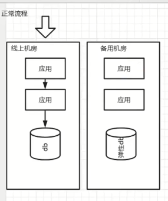
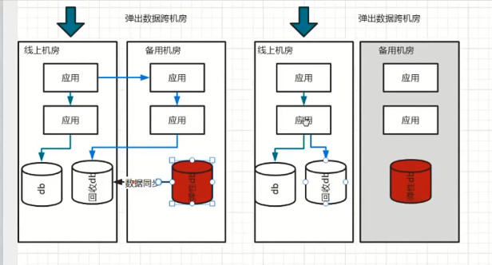
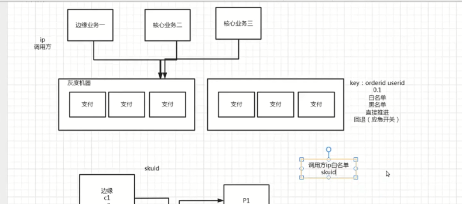
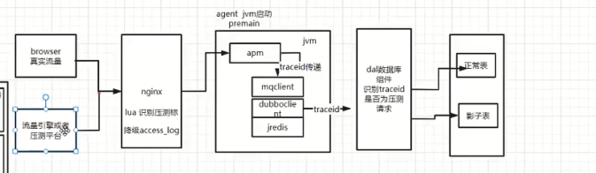

# 企业级服务治理与管控平台设计实践

## {引深}服务框架 & 服务治理

这里面有查询中心，比服务更细粒度的注册，比如接口（这些服务治理也要考虑），另外zookeeper在信息过多的情况下会有写压力，可以用自研的register代替。

另外provider都有哨兵，防止闪断对准确性的影响，等等。

再看一下服务治理所包含的东西（狭义的）：

广义的：

而狭义的就是为了解决稳定性的、性能德国、观测性相关的的一些狭义的治理

效率治理：流量的录播和回放，双引擎流量回放

先看这个图， 管理端就是管控平台（服务治理管理等），有个服务注册配置中心，还有监控中心、分布式跟踪（apm）， RPC框架（包含一个sidecar服务治理，用于服务治理，是和网络调用分开的），

服务治理的本地proxy，api网关

## 服务治理与管控平台需求分析

这里面服务健康状态看一下，如果全靠我们的注册中心和provider之间的心跳，会有一个闪断或假死的问题，注册中心可能会直接剔除这个节点，那么可以使用哨兵，让监听的次数更高一点去监听是真的活还是假死等。

服务路由：AB测试，灰度路由

服务编排：要和容器k8s打通，如果容量不够了，要进行容器调拨

调度中心：k8s相关，会和cmdb交互。

单元化架构

弹性化架构

流量单元化

解决：1. 数据库连接问题，机房数据库连接不过

2. 容灾

看看第一个问题：

这个机房的所有应用直接连接数据库，如果对应用节点进行扩容，那么数据库的连接数就会成为瓶颈，比如一个数据库的连接数7~8k，如果应用多了，就会超过这个连接数。

如果应用之间和数据库之间加了proxy，连接数是可以降低下来了，但是proxy又会成为瓶颈。而且也会多一次网络交互。这样我们可以做一个单元化的东西。

city1有三个数据中心，city2有一个数据中心，city3有三个数据中心。

可以根据uid的后两位取模，打到某个机房。

同城的服务发现可以用register，可以用专线。

跨城，用vip （haproxy + lvs）

请求打到70-79单元后，怎么调用其他模块，还要在rpc里面的根据76（uid的后2位）路由到机房的应用

DB也要有一个数据组件，在这个组件里面去调这个zoneclient,路由到自己单元的库里面。

GZone是只有一份数据，Czone如果跨城市，是可以最终一致性的

GZone一般是没有改造的

弹性化架构

比如在大促的时候，某个机房容量不够了、那么肯定要扩，怎么扩，考虑到大促之后这个机房就不需要了，还是回到原来的架构。

所以加一个机房。

比如把80-99的流量弹出去一部分到新的机房。

 

线上机房，需要将部分流量弹到备用机房。

老数据走线上机房，新的走备用机房

结束后，

数据要回迁

回到PPT

路由策略

负载均衡

比如：

可以调低权重weight，

但如何做到动态根据机器情况进行动态调整呢，

可以分几个维度进行采集，cpu核数、内存、系统load， tp99等，由采集工具进行采集，然后打分，再根据权重进行动态的权重调整。这个就是自适应的负载均衡。

## 服务治理与管控平台核心技术分析

服务分组：比如边缘业务、核心业务

上面为全链路压测的一些方式

如果不是按照真实流量配比，压出来的效果就有问题，影子库影子表、压测库压测表（不会到线上）

nginx的lua脚本识别压测标，降级access_log, 然后都带着traceid，最后压测的进因子库。

调用量，秒级别就是qps，分钟级别

异常量：系统，业务异常

请求耗时：tp99（%99的最大值）

这个是调用量，比如降了是业务问题还是监控问题

实际上就是tp99，tp90，这个也是很重要的一个耗时。

## 服务治理与管控平台企业级实践

上图是一个原理图，他们之间是如何交互运行的。注意SDK里面的内容是非常丰富的，SDK有哪些动作，限流。路由，降级等都在SDK，

上图是熔断流程。

注意有一个停机钩子，就是停机完了，要告诉注册中心的。

## 服务管理平台客户端SDK设计

## APM应用实践
