# 企业级百万并发高性能网关设计与实践

## 微服务架构API网关技术分析

### 业务分层架构

网关/业务逻辑层/数据访问层

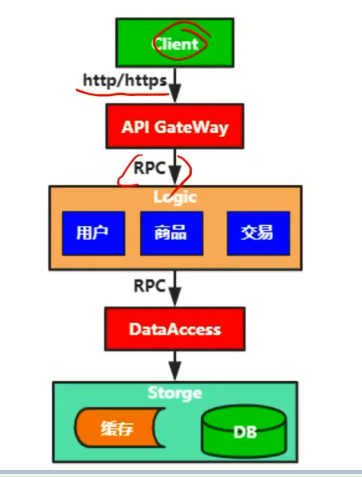

#### 网关层

> 系统的唯一入口，封装了系统的内部结构，为客户提供服务。

请求鉴权/数据完整性校验/协议适配转换/路由转发/负载均衡

##### Zuul方案

> Zuul是netflix公司开元的一个ApI 网关服务，其核心功能就是路由转发和过滤器。其核心思想就是一切皆为过滤器

**Zuul的特性**

1. 本质上一个web servlet
2. 一切皆filter
3. RequestContext
4. Groovy动态编译

大体的意思是（从Filter publisher），有一个发布filter的流程，可以固化，然后从里面读出配置好的filter到内存，然后filter runner运行这些filter，这些fileter是总体上分为1,2,3,顺序执行，其中1是路由前的fileter，2是路由中的filter，3是路由后的filter

如下是这些filter的运行顺序图：

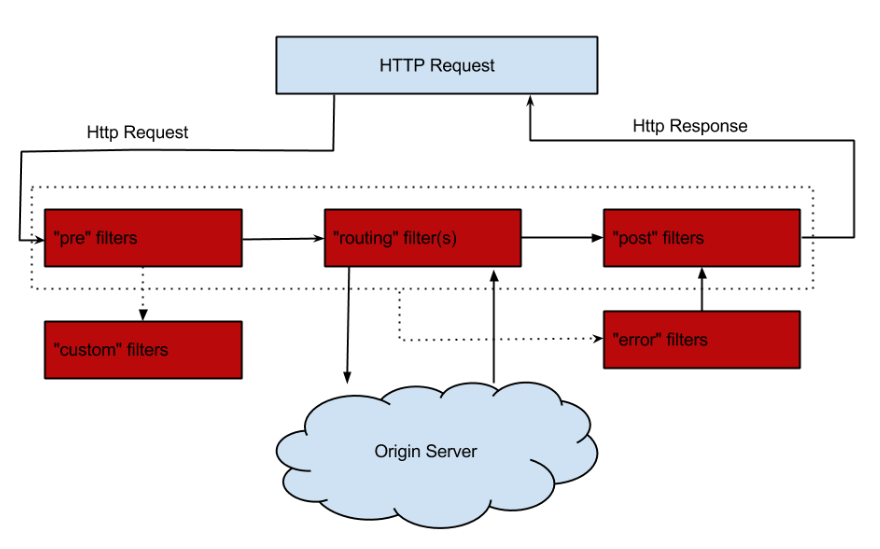

这里面有任何一个阶段出错，都会执行error filters。error filter执行完了，会执行post filters。

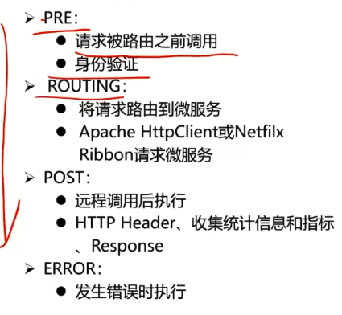

###### Spring Cloud集成Zuul

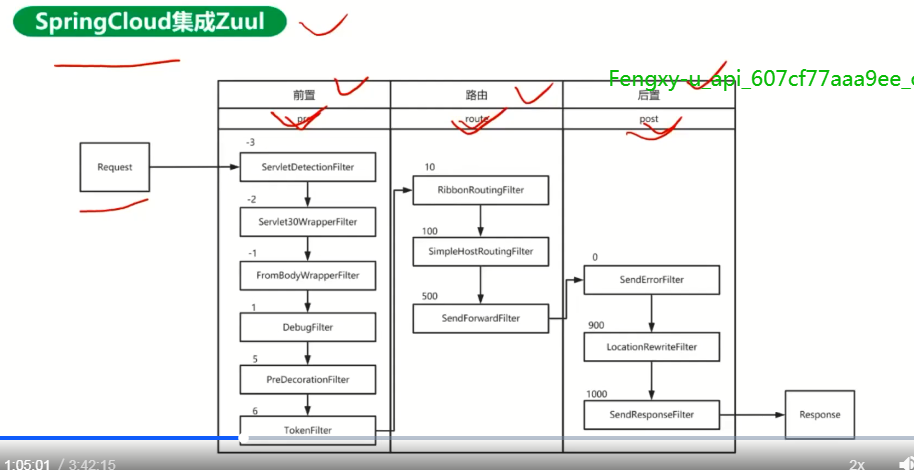

### 自研网关层核心功能各个击破

**自研网关需求**

> 打造一个高性能的分布式网关，实现http请求转发道rpc服务，接口权限校验、反作弊拦截等相关功能。

**整体架构设计**

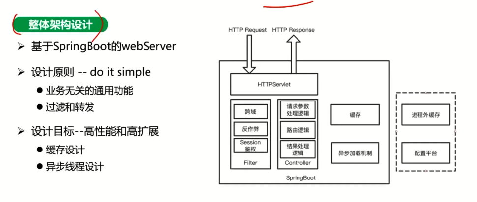

**网关时序图**

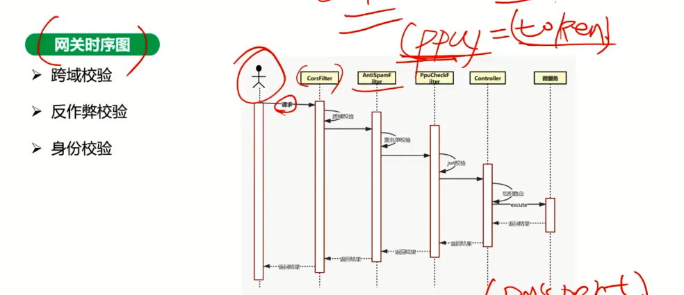

**跨域问题**

> 同源策略，是浏览器重要的安全策略，从一个源（比如http://api.naixuejiaoyu.com)加载的文档或脚本默认不能访问另一个源（比如www.58.com)的资源

这里面什么是同源，要满足下面三种情况：

协议，比如http， 域名，比如api.naixuejiaoyu.com. 端口，比如80。只有三者都相同，才叫同源，否则就是不同源（也就是跨域），有如下几种方法解决跨域问题：

1. 代理

2. jsonP

   用callback包裹一下，把参数放进去，前段script里拿到参数（参数里包含跨域访问的数据）

3. websocket

   把http换成websocket，成本太高了吧

4. CORS

   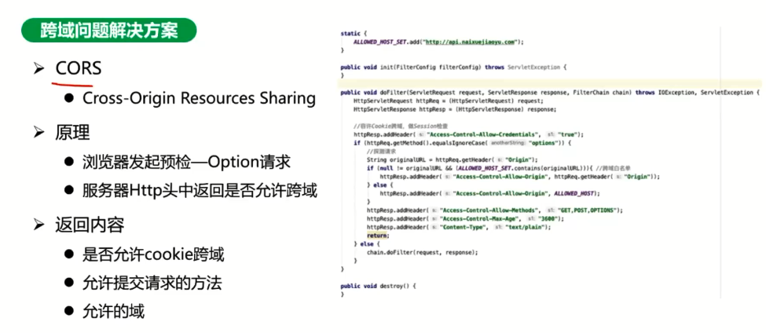

**鉴权方案设计**

http本身是没有状态的，但是实际需求上需要http有状态，比如登录的状态，那么就要有一种机制，服务器端可以保留上次的状态，服务器端就要保留这些会话，这个就是session

> session，保存在服务端的客户端和服务器的会话信息

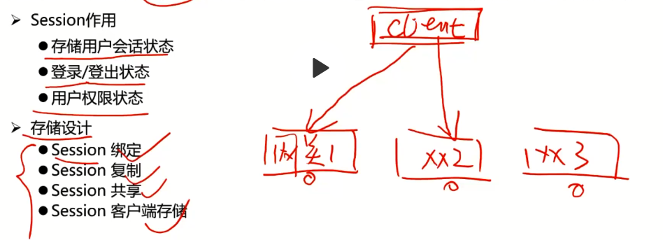

session如何存储，有四种方案，

1. session绑定

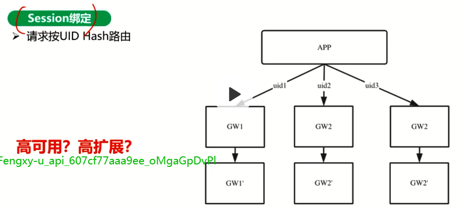

如上，比如用uid%3，这样每次都能讲请求路由到指定的机器上。为了达到高可用，要做冗余，那么每个网关还要有一个冗余，上面是主，下面是备。利用率是50%

高可用性差，而且，扩展性也非常的差。

2. session复制

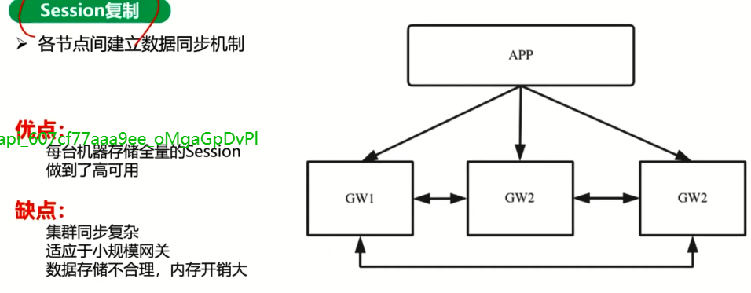

优点是高可用，任何一个节点挂了没有任何关系，因为每个节点都是全量的session数据。另外，可扩展性好，增加节点后只要把全量数据同步过去就好。

缺点也很明显，同步太复杂了，内存占用较高，如果网关数量很庞大，那这个同步的消息量有多少？局域网流量风暴，消耗资源

3. Session共享

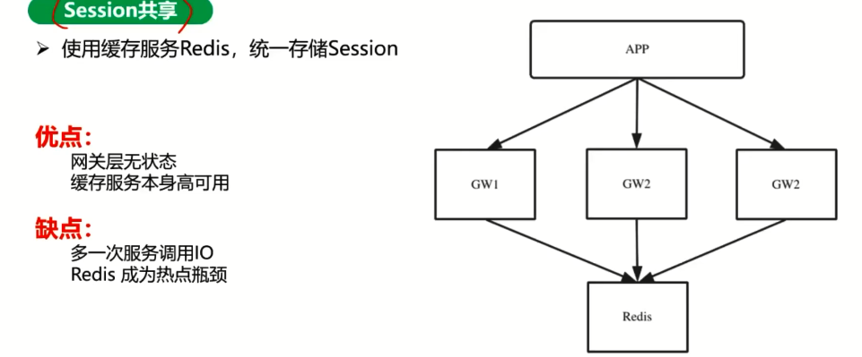

这个有个主意点，为什么业务逻辑层使用redis不会成为瓶颈，而这里会成为瓶颈呢？ 原因是这里是网关，网关的话就需要考虑高性能，如果网关在Redis等上耗费大量时间，就会有性能的问题，容易成为瓶颈。

上面三种方案多多少少都有一些问题。想一个问题，如果服务端不保存，让客户端来保存

4. session客户端缓存

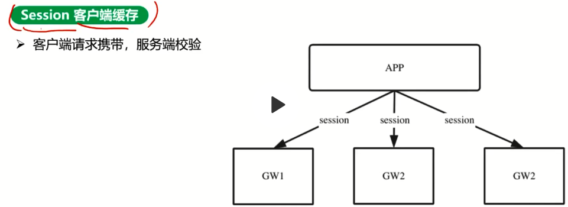

session信息每次返回给前端， 由前端保存，这样服务端就不需要保存这个会话信息了。这样就不存在状态问题了，自然而然就容易扩展了。

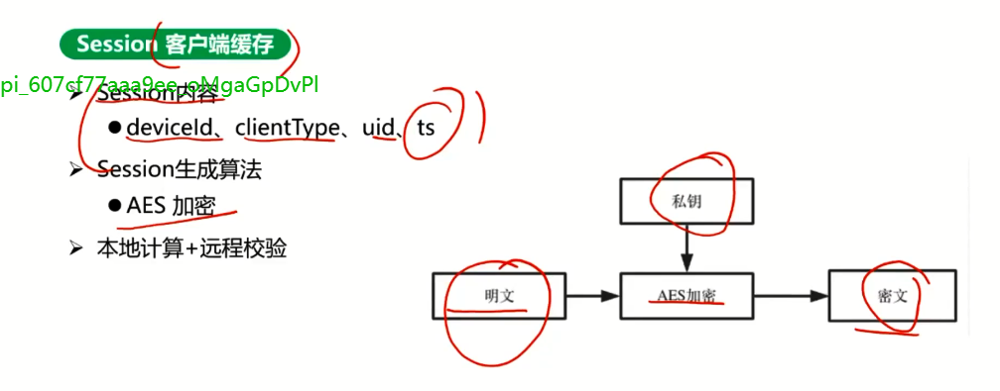

这里如果每次请求都要到专门的秘钥系统去进行加解密或校验，那这个也很容易成为瓶颈，所以采用本机计算+远程校验的手段进行处理。

**反作弊设计**

> 针对恶意流量，从网关层进行拦截，防止对后端服务造成高并发的压力。

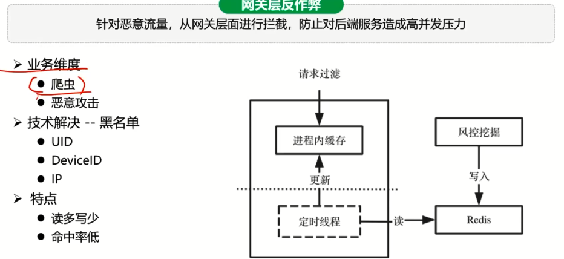

这里面特点是指这个黑名单，具有读多写少的特点，比如每天有500w日活，但是黑名单只有1000个，这个命中率实际上就很低，而且每个请求都会读这个黑名单。

这里要注意，如果要网关负责黑名单的校验，那么有两个简单的途径，要么直接访问风控挖掘部分，要么直接方位redis，但是站在网关角度，每次请求都要访问风控或redis，那么是不太可取的，存在性能瓶颈，最好的办法是访问内存，由本地系统或外部系统更新这个黑名单到本地存储。

**路由设计**

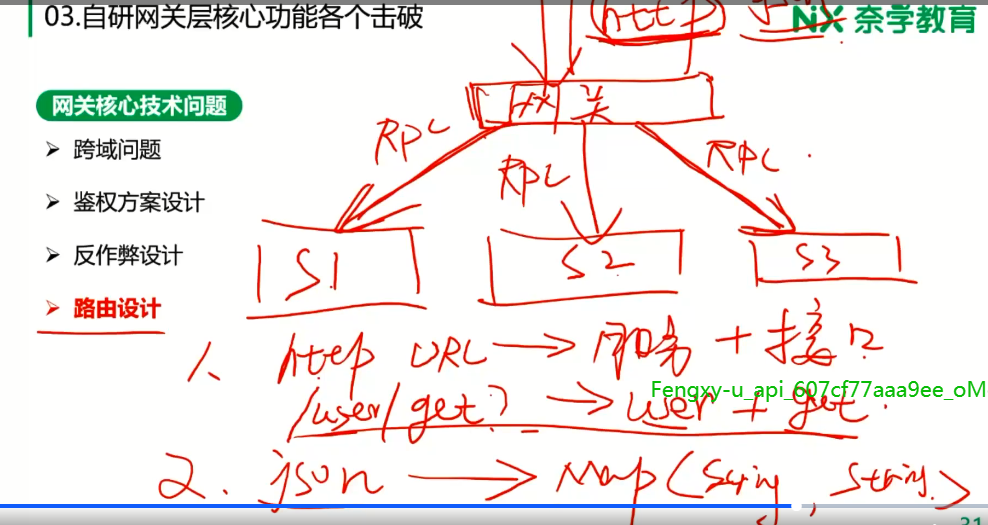

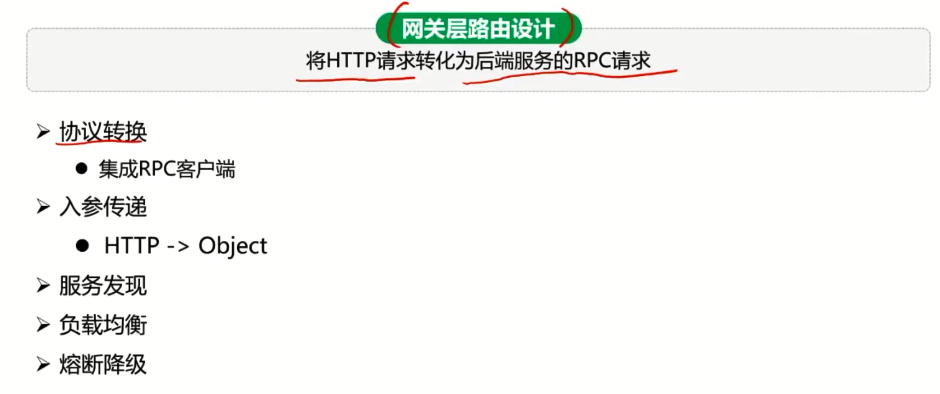

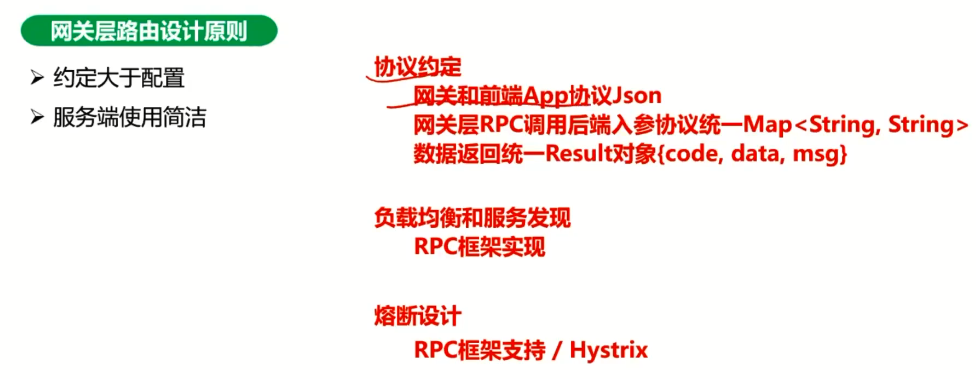

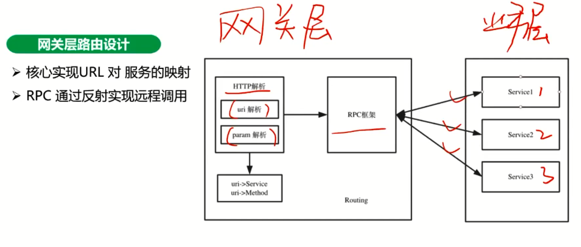

需要考虑两点：

1. 怎么将http请求转发到特定的服务，这个很简单，就是用url->服务+接口的映射即可，

   比如：http://xxx/user/get，映射到user服务的get接口

2. 有了到服务和接口的映射，那么路由实际上就完成，下面就是如何把http请求转化为RPC请求。http请求很好办，一般都是json格式，rpc请求这里考虑到网关的通用性，直接使用Map<String,String>

数据返回，可以用简单的{code，data，msg}

下面是扩展的涉及到具体路由相关逻辑的图：

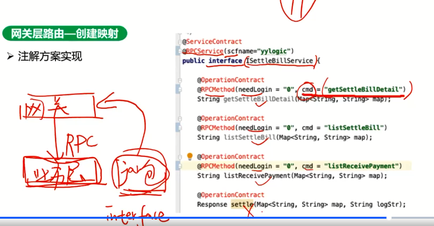

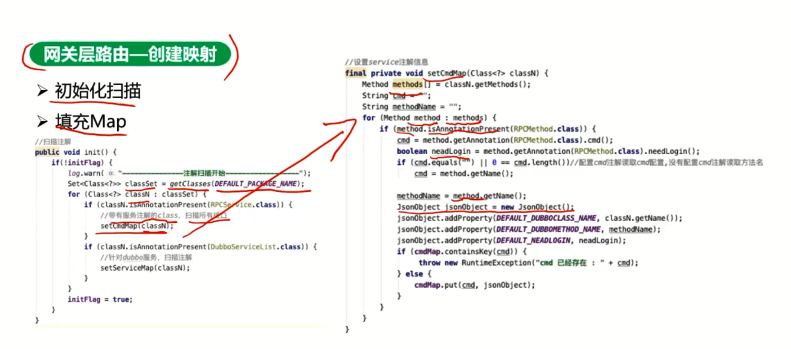

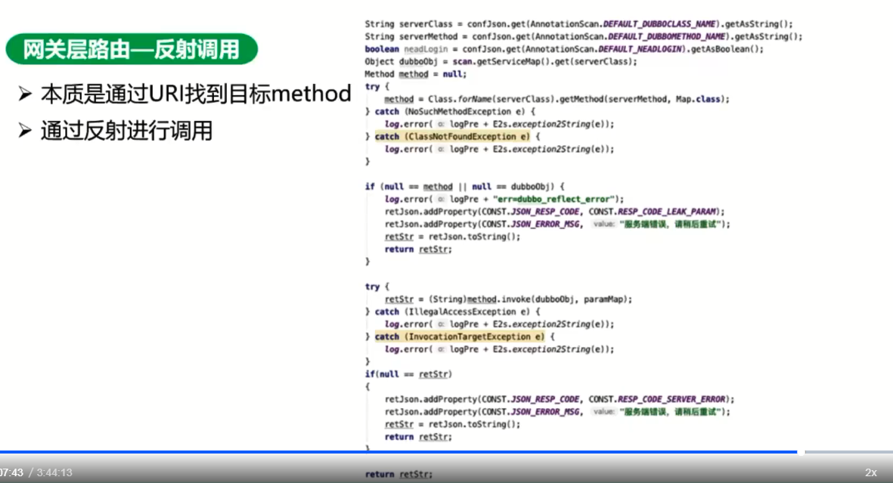

这里存在的问题，业务层如果有接口变动，都要提供jar包给到网关。这样每次业务系统有改动，都要提供给玩网关进行更新，完了后网关需要重启，造成开发效率的降低。

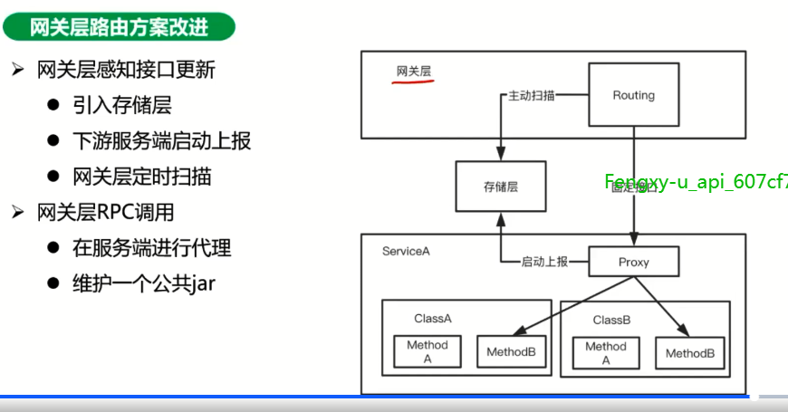

这个是对上面网关层路由的改进，目的就是达到网关不需要因为下游的变更而变更。要达到这样一个目的，需要维护一个公共的jar包，这个jar包是不会变的。那么如果路由到具体的服务+接口上呢？这里就使用了代理，代理是统一的（也是公共的），这个代理实际上就是这个公共的jar的接口，网关层只需要知道有哪些新的服务就可以了。知道服务，就直接调用proxy这个统一的代理接口就行，具体接口的路由，是由proxy在本地配置的，每个下游服务有自己的配置。前面说到网关要调用下游需要下游的具体的信息，这里增加了存储层，每次proxy有新的服务，就需要在存储层增加记录。这样网关就知道有新的服务了，当新的请求到来，就能根据新的数据库记录路由到新的服务上。

这样网关就不需要每次重启了。

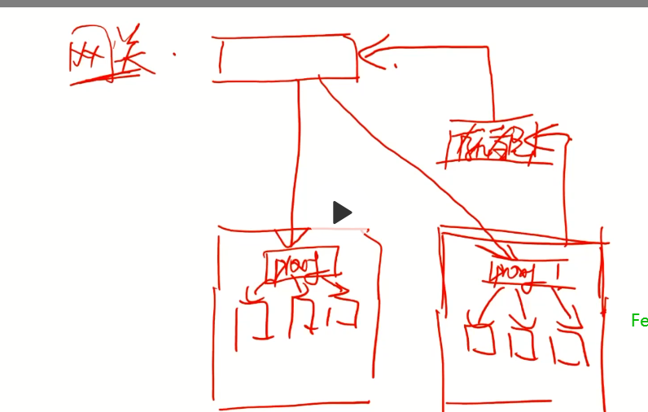

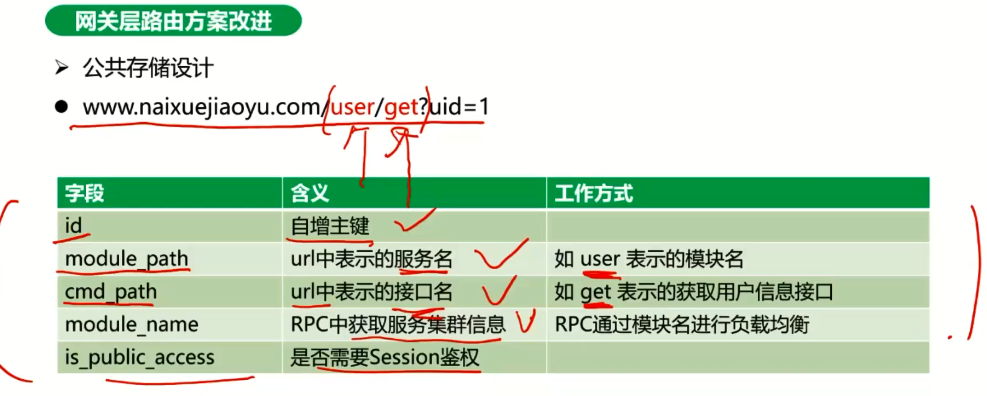

上述是存储层的设计，也就是说网关从这张表中就可以调用对应的服务，并把响应的参数传给公共的proxy接口。

我们再看看proxy都做了什么事情：

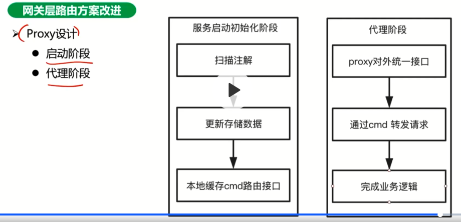

这个方案有个问题，如果是新的服务，OK没关系，我按照上述的方案引入proxy。但是。。。线上已经存在的服务呢，难道让业务同学为了这种架构新增业务并修改原来的接口吗？

如果不用proxy这种方案，网关很累，如果用了proxy方案，业务同学很累。有没有第三种方案？

## 网关层黑名单设计实践

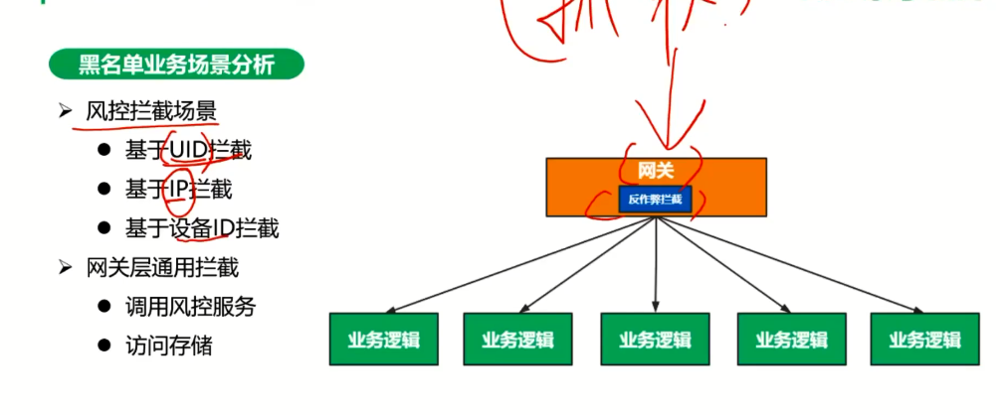

基于UID，如果有的恶意的人，经常是在二手电商下单了，然后要求卖家降价，否则就取消订单。这种就可以根据UID将经常欺诈的UID放入黑名单。

基于IP，一般是爬虫类的，可能会一个IP频繁的抓取数据。

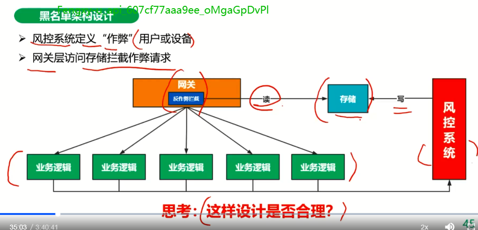

上述是网关直接读存储，由风控系统负责写存储。但是这样设计是否合理？

这里面可以分析一下，每天有500w日活，但是白名单只有5000个，那么相当于99.99%的查询是无效的，都返回了不在黑名单中的结果。黑名单呈现出下面的特点：

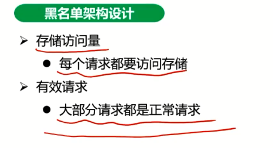

那么我们进一步优化成本地的缓存，较少网络I/O，如下图：

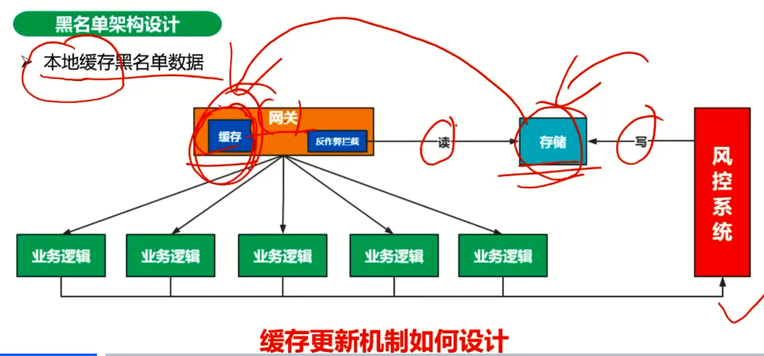

这样就有个问题，也就是数据不一致的问题，这个是缓存带来的问题。这时候就要考虑需要将外部的数据及时更新到网关，考虑一下前面说过的注册中心配置中心如何将服务和配置信息及时更新到服务的消费方。这个缓存更新机制如何设计。

第一个，这个是比较显而易见的，网关在启动的时候加载数据，也是很多缓存的相关设计里面通用的做法

第二个，变更通知，就是如果这个黑名单有变化，一定要及时+可靠的获取到变更通知，以尽量较少延迟带来的损失。

于是乎再看：

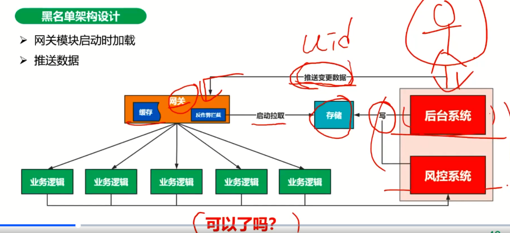

网关模块启动加载没问题。

数据推送，风控系统和后台系统会主动推送变更数据，对于后台系统，管理员是可以手动添加黑名单，保存在存储系统后会直接推动变更数据到网关。可以了吗？

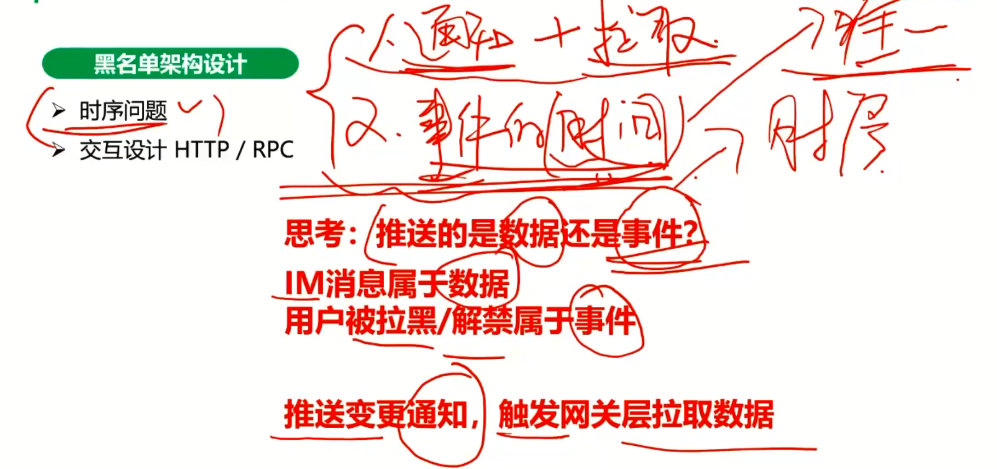

这里面有几个问题，

首先时序问题，如果是风控推送变更数据，比如通知了拉黑某个UId的数据，但是管理员很快意识到刚才误操作了，很快就又解禁了。如果解禁在uid之前到达，你有可能最终还是把这个uid拉黑了（实际上这个uid应该解禁）。这里就有时序问题，对于这样的问题，有两种解决方案：

1. 采用通知+拉取的方式。数据我不通知你，因为数据有时序问题。我只通知，通知后由网关主动拉取到最新的数据，不管哪个通知先到，我拉取到的都是当前最新数据，不会出现逻辑上的混乱（时序乱）
2. 事件上维护一个全局（甚至全球）唯一的分布式序号，客户端根据序号做处理，这个方案是比较复杂的方案

其次，交互设计的问题，是通过http还是通过RPC？这里涉及到一个数据分发系统，对应多个需要数据的节点，我怎么做才能优雅的把数据分发到需要的节点上？

RPC： 风控系统和网关保持RPC连接，比较重（没有解耦），不够优雅

MQ： 实现了解耦，但是风控系统不知道结果。网关没法返回结果。

http：风控系统通过http方式轻量的方式通知

zk：我把要分发的数据放到zk的节点中去，客户端（网关）去订阅这个节点，这样就可以通知到网关。

配置中心：分发一个配置项到配置中心，网关就可以通过配置中心得通知机制获取到数据

于是乎：

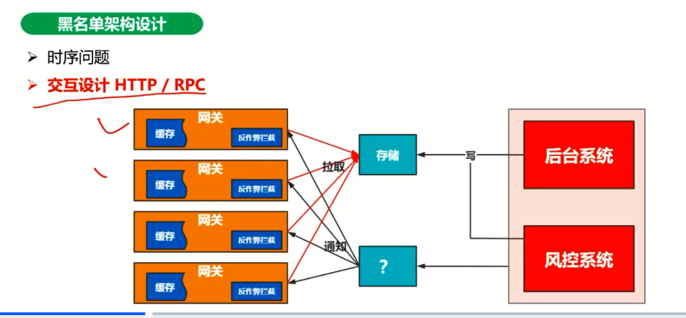

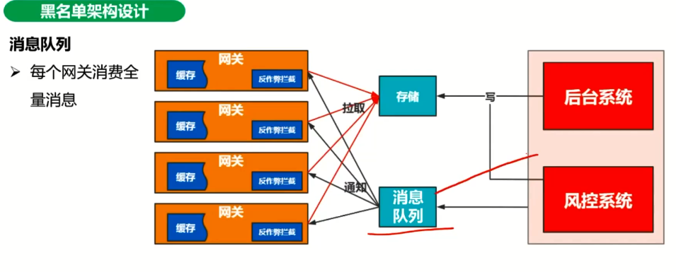

上面是一种方案，通知使用MQ来做，消费者（网关）采用广播消费（每个网关消费全量数据）

有什么问题吗？ 为了达到及时获取到黑名单，单独引用了一个消息队列，感觉是有点重。另外黑名单虽然每天都会产生一些数据，但毕竟没有大流量，也不会高频使用。

最后采用了配置中心的方案，如下图：

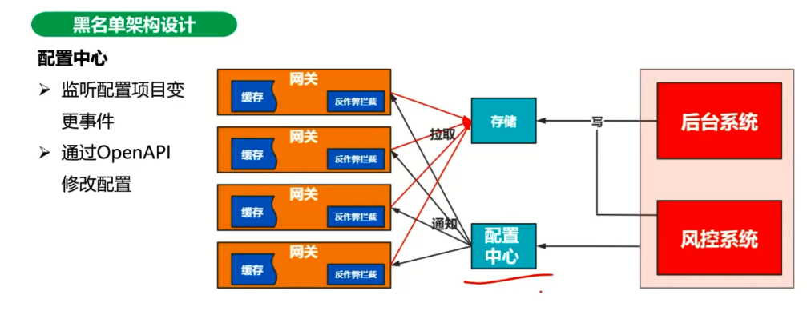

这里面实际上是因为先有了配置中心，所以借用配置中心，就用了这个方案，改动较小（否则还要专门搞一个MQ去做）。

1，由后台或风控系统通过配置中心的api（如果阿波罗，就是portal）写入配置，

2，网关获取到配置，到存储系统进行数据拉取，拉取之后更新网关的本地缓存。

你有可能会问，这样做是不是代价太高，没必要。实际上，如果这些放到业务系统，可能确实显得没必要，比如我就每次到redis去拿黑名单就行了。但是这里是网关，要高性能，所以才去这些方式还是很有必要的。

上面要注意，存储是单独的，不是配置中心的存储，所以一点有黑名单变更，首先后台或风控系统会将配置数据更新到数据。再触发网关拉取数据，怎么拉取？这里就用到了配置中心通知的功能。

暂时告一段落，我们进一步看，有没有继续优化的空间：

网关缓存的三种数据，可以考虑3个map：

1. uid->.... 2. ip->.... 3. deviceId->....

先不考虑异常情况，比如如果风控系统出bug了，瞬间将10万个uid（不在黑名单中的）当做黑名单打入了存储系统，这样客户端网关可能要耗费较大的内存。

考虑这样的问题，map，有99.99%的请求不能命中，有没有优化空间？

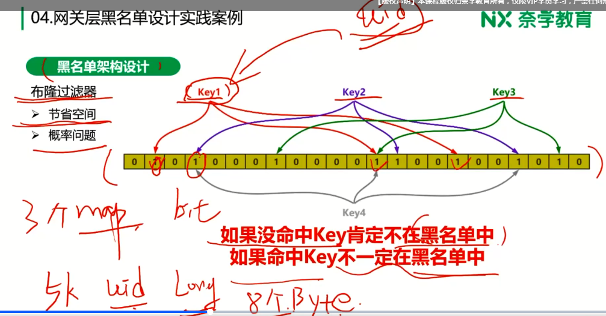

每个key，产生3个哈希值，对应数组中3个位置，这三个位置的值都是1,（数组初始化值为0），这样，每次请求都会计算key的3个哈希值，如果对应的位置上都是1，说明有可能黑名单有可能存在；如果有一个位置上的值为0，那么说明就一定不存在。

这样的好处：

1. 节省了空间，布隆过滤器每个key会产生3个bit的空间，而且每个bit位可以为多个key使用，大大节省了空间（想一下，如果不使用布隆过滤器，得要多少的存储空间）
2. 概率问题，正是切合了99.99%的查找问题，才提高了布隆过滤器的作用。

另外，布隆过滤器不能做删除操作，因为有冲突问题。因为可能有多个key的哈希值都在一个位置上，如果删除这个位置上的值，会影响对对其他值的判断。

但是黑名单可能有频繁的删（解禁）和加（拉黑）操作，需要能够删除布隆过滤器上的值），解决方案，布隆过滤器上不一定要是位图，可以是整型值（会导致存储空间扩大的问题），如果每次写入一个值，在已有值上追加1，就可以进行删除。删除一个uid，直接在对应的布隆过滤器上减去1即可。

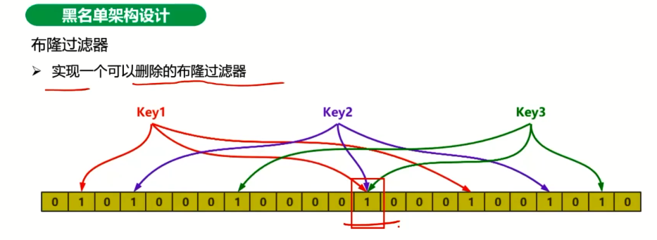

两点：

1. 根据实际情况，看看每个数组位要存储多大的数，比如0~15足够，那使用4bit一个位置足够；
2. 添加keyi，对应的位置+1操作，删除key，对应的位置-1操作。比如删除key2，那么第一个位置10变为01，红色的10变为01（参考上图）

