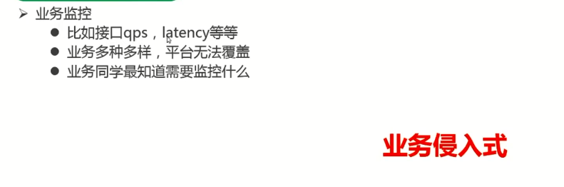
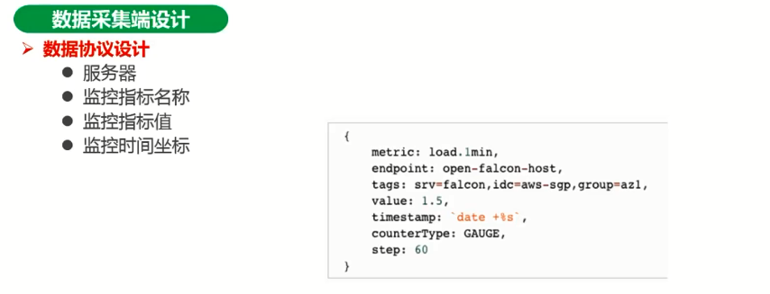
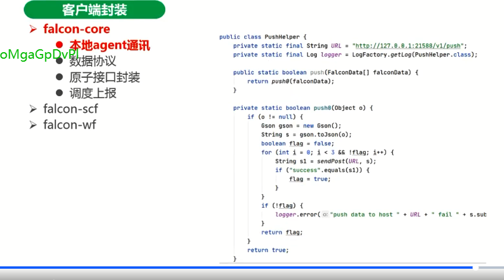
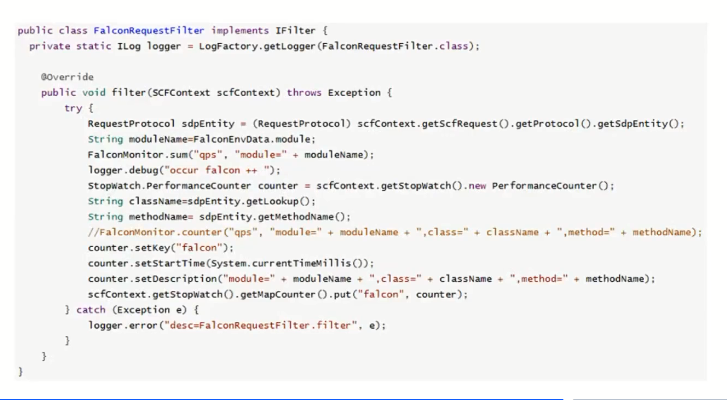

# 企业级监控平台设计和实践

监控的三板斧：**可监控，可灰度，可应急（报警）**。

> 可灰度：单号或者用户id灰度

> 可应急：不能无脑的赶紧应急，不能一边应急一边排查，一般分两个人，先上报领导和上下游等相关涉及方，一个应急止损，一个排查，这里的应急是根据我们的告警来的。

监控：系统监控、中间件的监控、业务数据的监控，集成监控（红绿灯，上下游的监控等等）

**还有像一些大的平台，比如美团、字节等公司，还有分布式链路跟踪，上下游错误识别等相关监控（可视化监控组）产品。这里的可视化监控，不是简单的柱状图，线性图啊啥的这么简单。**

运营业务监控，优惠时光机监控等等。

最后就是还有无核对，不上线。有了三板斧还不太给力，就是比如涉及到上下游的状态核对。

首先必须有监控，有监控报警，我们才能知道是哪里出了问题。如果监控不全，或者只有业务监控，缺少硬件的，流量的等监控，那么就会丢失关键信息，丢失关键线索会导致什么问题，就会导致无法排查。

排查需要综合考察告警项，搞清楚他们之间的关联，然后根据一定的知识储备来定位问题。因此相关的原理性的东西一定要有储备，比如操作系统、中间件、框架和组件。无法很难排查出问题。

排查出问题后，就需要进行解决。解决的话也是需要相关知识储备才可以。

业务监控大盘怎么做？

可以对我们的业务流、状态流专门做监控，比如一个订单在不同系统里面的订单个数的监控，如果不同系统的订单数不均匀，就可以监控出来是否有堆积或其他方面的问题。

## 监控需求分析及设计思考

### 什么是监控

> 这个产品生命周期运维环节中，提供事前预警发现故障，事后用于追踪定位问题的能力平台。

### 需求分析

1. 业务需求：实时性、便利性、灵活性、可视化

2. 功能需求：

   预警故障、掌握主动权

   记录数据、用于分析定位问题

3. 性能需求:

   监控服务不能影响业务性能

### 监控手段和意义

**进程监控**:比如用http的状态，tcp监控等等。或者把tcp的异常包装一下，包装成http的状态。

**语义监控**：业务是不是正常工作。

**错误日志监控**：业务是不是正常工作。比较校验类的错误不要打出来，只放真正异常的日志。

**数据波动监控**：流量的突增突降，毛刺。比如流量突然下来了，到底是我们的监控数据有问题还是业务存在什么问题

**机器资源监控**：比如资源不足

#### 进程监控

#### 语义监控

#### **错误日志监控**

#### 数据波动监控

环比、周比，同比等等，你的订单量、请求量等等

#### 资源监控

CPU满，可能是软中断，可能是序列化反序列化，可能是某个算法，可能是java的自旋锁，但是又得不到锁，科恩给你是一个死循环等等。

磁盘，比如内存不够用了，就会用磁盘，涉及到磁盘的页的异常中断的问题。比如swap区调小
网络，比如timewait多，吞吐量高怎么调优，高并发机器要调哪些参数等，

### 监控维度思考

### 监控指标设计

### 监控平台模型

#### 监控数据产生

1. 日志层面的数据，通过日志文件
2. 系统层的指标
3. JVM参数

业务监控：

1. 接口qps，latency等
2. 业务多种多样，平台无法覆盖
3. 业务同学最了解需要监控什么

#### 监控的业务逻辑

1. 预警故障，掌握主动权
2. 记录数据、用于分析定位问题

#### 监控的难点

服务多，维度多，采集jar，监控平台

### 监控平台架构设计

#### 数据采集

##### 数据采集端设计

###### agent聚合方案一：共享内存

###### agent聚合方案二：通讯传输

###### agent数据上报

###### 数据协议设计

#### 服务端设计

##### 预警能力

##### 数据存储

##### 数据展示

#### 客户端封装

说的是数据怎么发到agent

说的是数据格式

1分钟上报一次。

说的是数据需要做过滤，并不是所有的上报的数据都需要。scf

### 监控平台技术选型与落地

#### Zabbix

很早就有的一个监控平台，监控的维度并不是很多。

#### falcon + Grafana

这个用的比较多。oltp用的较多

#### Prometheus + Grafana

大数据方面用的比较多

注意看falcon和prometheus不太一样，前者client是一路把数据push到server。而prometheus是先推，server后面是拉取gateway的数据

#### 架构落地方案

## 稳定性监控（这个是哪个章节的？？？）

# 企业级监控平台设计和实践[重复但笔记内容不同]

监控三板斧

可监控和报警/可灰度/可应急

可监控和报警：系统监控、中间件组件、业务数据监控、集成监控、

可灰度：单号、用户id、黑白名单

可应急：无脑的赶紧应急，不能边排查。分两个人，先上报，一个人应急止损，一个人排查

无核对，不上线

业务监控大盘

应急预案平台

巡警平台能发现预案，不仅发现预案，还能报警，给我我们的负责人，负责人看到这个预案对不对，前期，这个预案是要人工核实的。

比如db挂了，监控出来了，然后启动db高可用方案，直接改配置。

执行预案，就要调管控的平台。

一开始不能进行自愈，因为危险性极大。刚开始是先报警，负责人能看到它生成的预案对不对，这样预案会越来越准确，达到一定的时间后，就可以做自愈（不需要人工去做了）

单独的监控都好做，但是如何集成起来，这个是需要考量一下的

## 监控需求分析和设计思考

什么是监控

> 整个产品生命周期运维环节中，提供事前预警发现故障，事后用于追查定位问题的能力平台。

像美团、字节等都有可视化监控组，会有一些产品，比如都有分布式链路跟踪、上下游错误识别（有上下游链路跟踪器自己识别哪些导致的链路问题，有逻辑分析，有指导性建议。）

虽然说最终还是要人来介入进行问题定位等，但是像可视化监控组等都会做一些更智能的东西。就比如在大数据的收集下进行分析，等等

### 需求分析

#### 业务需求

**实时性**

比如秒级和分钟级别，做需要设计的架构就不一样

**便利性**

客户端对接你的系统，要非常便利，成本低，甚至没有多少业务侵入性，比如链路跟踪，可以在jvm上加个代理，字节码注入等，对业务零侵入。比如在某些类的class注入字节码，比如加上begintime和endTime，就能统计出耗时等

**灵活性**

**可视化**

这个就不用说了。

#### 功能需求

如果第一个发现的不是你，是很尴尬的一件事。掌握主动权

#### 性能需求

不能影响业务性能

比如在jvm里面try。。。catch（举例，不一定合适），在jvm字节码里加反射

### 监控手段和意义

**进程监控**，比如alive---比如探活，比如监控http，根据状态，200还是404，Rpc可以包装一下，用http的返回码

**语义监控**--业务是不是正常工作

**错误日志监控**--业务是不是正常工作，这里主要要过滤掉一些常用的校验类的等等日志，如果特定场景下的，尽量不要打，这些地方是业务逻辑的一部分。否则会把有问题的日志埋掉。error尽量清0

**数据波动监控**---毛刺，比如秒杀，流量突然剧增，或者订单量下去了。比如说有爬虫或秒杀，订单量上去很简单；但是如果订单量下去了，这个时候就要注意看是监控有问题，还是真正的业务有问题。如果监控有问题，可能是监控数据漏掉了。

**机器资源不足**----机器资源监控，根据压测会有一个水位图，如果达到了这个水位，就可以报警；但是如果没有做过压测，怎么知道资源不足了，cpu，内存可用率，磁盘可用率，网络吞吐量能看出来足于不足

#### 进程监控

传统的解决方案自己写的话可能会有问题。更优雅的可以用daemontools工具里的supervise。

#### 语义监控

#### 错误日志监控

比如，ELK

#### 数据波动监控

#### 运营业务监控

这个是另外的监控，举个例子，有个叫

#### 优惠的时光机监控

#### 资源监控

比如 内存，最大内存和最小内存配置不合理，导致频繁申请内存，造成jvm内存阶梯型上涨。

CPU能直接看出哪个线程导致的CPU升高，然后再用jstack。但是如果cpu都满了。还能用吗

CPU满有很多原因，比如软中断。序列化和反序列化也能导致cpu满，算法类的，自旋锁，做一个自适应的咨询就好了

比如我们说内存有虚拟内存，2G的内存能用8个G（当然跑的是很慢的），这个就涉及到一个磁盘缺页的问题（页的异常中断），swap要配置小一点

网络更是干货，比如timewait高了，要怎么调等等。

日志层面，比如蚂蚁有个xflush，就是基于日志，能分析按照日志里面的关键字，统计sum，avg等等。还有会出一个曲线图，

业务层面，

### 监控指标设计

### 监控平台模型

首先是采集数据，然后再经过规则的处理，最后展示

### 监控数据产生

这里可能涉及到业务，如果是业务的监控（比如通过日志），就会有一定的业务侵入性

下面就讲架构涉及

## 监控平台的架构设计实践

### 监控平台架构设计

初创拉取

#### 数据采集

这里为什么要有agent，如果不用，那么微服务成千上万，如果都直接连server来push数据，那么server的连接数将造成很大的资源占用。

agent可以聚合，批量发送等。

agent和采集端在一个pod里面，内存可以共享，因为是在一个内存里操作，采集端写，agent读，需要有锁来控制并发问题。

一般的我们用UDP就行，因为不需要保证每次都可靠可达，可以丢失，用TCP效率不高

接下来看看一下采集的数据格式是什么样的。

#### 服务端设计

策略引擎，

写什么东西？

秒级的东西，比如QPS，比如订单的数目

以orderId为key，统计一秒内订单有多少，可以用redis，达到秒级的监控

Mysql主要存原始数据

influxDB主要存一些时序数据，比如这1分钟是多少，另外一分钟是多少。

防止误触发，不能到了阈值就报，要有一定的策略，防止误报

自定义报警规则，比如白名单，黑名单等等

redis存放一些时效性比较高的

#### 客户端封装

把要采集的一些key，运算号了，多长时间的平均值，最大值最小值，合计值等等。

接下来是agent部分

这个数据协议的格式。

这个是接口封装

这个是平均值的。

这个是把数据push到agent上面，这个是异步完成的，不能影响业务。

这个是sum的计算

这个是sum的推送

这个就是监控，调度上报，就是推送到我们的agent里面，这个就是monitor的代码，什么时候去做推送。

上面的最重要的就是pushTask，就是下面这个

就是前面那几个send函数

上面可以看到，有一个调度，每个一分钟上报一次数据，分别上报平均值最大最小值汇总值数据到agent。

falcon-core实际上做了上报的事，falcon-scf要做一些过滤，不是所有上报的数据都是要的。

以上都是在业务逻辑里面做一些过滤

这个是后置拦截器

这些拦截器就是把一些通用的东西放在里面，防止在各个业务代码里面集成

## 监控平台技术选型和落地

**Zabbix**

很早的一款产品了，监控的东西不是很多，cpu内存，jvm

**falcon**

用的比较多的，小米滴滴 一般和 grafana搭配

**Prometheus**

大数据相关的，也和grafana搭配

看一下优缺点

实际中推荐用open-falcon，常用语OLTP多一些

Prometheus大数据用的比较多

上面是open-falcon的流程。

这个是prometheus的流程

如果我们自己去做。如下图：

上面就是监控图，

client端收集错误日志

再看业务方使用

这个业务侵入还是比较大的，也可以使用xflush这种类型的，分析日志

左边是监控名称，右边是看板的描述，比如某个业务的下单成功率，可以点击进去看。

最好不要这届写javabean的代码，直接用脚本。

如上，其实没有什么复杂性。主要是客户端如何计算，上报。

还有就是agent，服务器等如何部署，

下面讲稳定性建设

## 稳定性建设

这个是比较重要的，稳定性方法论，比开发一个监控系统还重要

先预防、然后发现、最后应急

预防，比如风险意识及技术规范，比如并发的一锁二判三更新。

发现，就是上面说的一些监控，核对，实时的，分钟级的，小时和天级的。

CRG架构、

蚂蚁异地多活、三地五中心等等

​	

后面会有稳定性方法论
