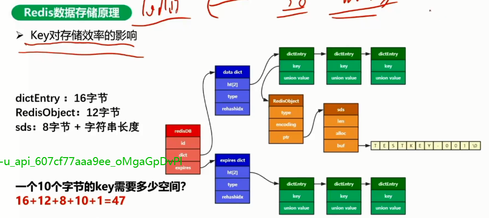
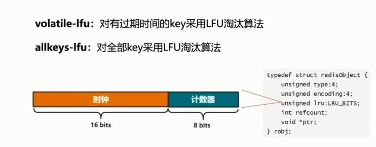
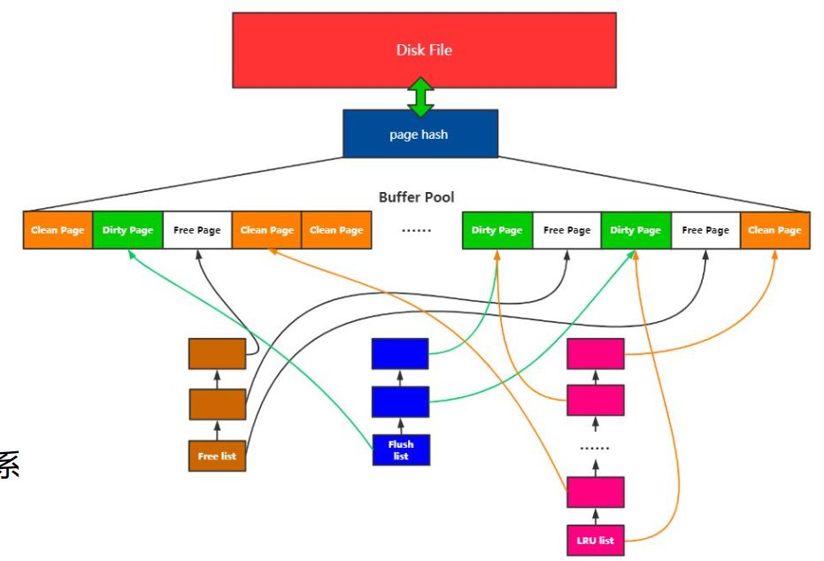
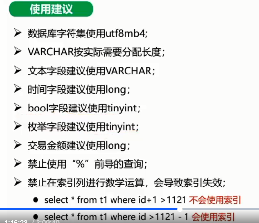
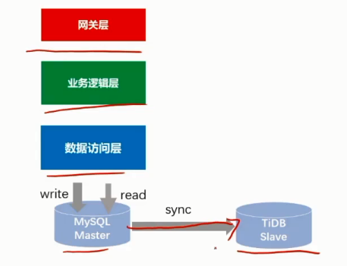

# 分布式架构存储

## 单机存储系统介绍

### 什么是存储引擎

> 存储系统的发动机，提供数据的增、删、读、改能力，直接决定存储系统的功能和性能

#### 性能因素

##### 写入方式

1. 顺序写
2. 随机写

##### 读取方式

1. 顺序扫描
2. 随机读

### 单机存储引擎

#### hash存储引擎

##### Hash存储特性

**时间复杂度**：O（1）

**满足“=”，”IN“的查询**

**不支持范围查询**

**不支持排序**

##### 代表产品

Redis/Memcached

Redis支持固话，速度方面两者差不多吧

#### B树存储引擎

Mysql是代表

##### B+树存储引擎特性

上面的**随机写**问题：因为叶子节点是排序的，所以如果要插入一个数据，不能直接追加，必须要插入到一定的位子上，就产生了随机写的问题。

**节点分裂**：叶子节点已经写满了，这个时候要插入一个元素，这个时候就要做页分裂操作，这个就涉及到数据的移动。 。

#### LSM存储引擎

##### 特性

1. 随机写变顺序写

2. 牺牲读性能

3. 增加后台合并开销

4. Flush

   Flush就是从内存刷新到L0层的刷盘

5. SSTFile

   就说L0，L1，L2这些层的文件都是SSTFile

6. Compaction

   就是从L0几个合并成L1的一个文件，这样的一个过程

目前现有的自研的很多的数据库其底层的存储引擎都是RocketDB。rocketDb提供了一个可集成的api，只要在其上包装一层应用，再能支持高可用，可扩展的这些分布式功能就ok了。

LSM牺牲了读性能，那这个读性能如何去优化了？

##### LSM引擎优化

###### 布隆过滤器快速判断

布隆过滤器快速判断文件是否存在，如果布隆过滤器直接过滤掉了（不在位图里面），那么就直接过滤了。否则再从文件里面找。

###### 文件内数据有序

知道你在，然后按照顺序去找。

##### 代表产品

LevelDB/RocketDB

**LevelDB**:谷歌的一个实验室项目

RocketDB：

### 存储模型

> 存储模型是存储系统外壳，描述存储系统以什么样的形式存储或管理数据

#### 关系模型

比如传统的RMDB数据库，Mysql，Oracle等，

#### 键值模型

k-v存储

#### 时序

t1：(), t2:(), 一个时间戳对应一个数据。时序数据库，比如InfluxDB，

一般应用在监控系统中，这一秒是什么数据，下一秒是什么数据。等等。。。

#### 图

风控或算法，描述一种关系的，实际中应用不多。

## Redis存储原理深入剖析

> Redis是C语言开发的一个高性能键值对内存数据库

### 数据存储原理

#### 数据结构

这种很不直观，用下面的图表示一下：

##### key对存储效率的影响

##### 内存清理

**定期删除**

**惰性删除**

**LRU**

和定时清理的思路类似，还是从链表中随机从所有数据中选出几个元素，根据redisObject的LRU_BITS来做LRU的顺序，然后就用LRU把最近最久未使用的干掉，这还是一种近似的做法

**LFU**【未完全理解，未细看】

我们看看A的使用频率最高，B次之，C最低。但是如果使用最近最久未使用的先淘汰，那显然A先淘汰（看图），但是根据实际情况，显然A不应该被淘汰，因为A使用频率很高，不应该被淘汰。

然后对LFU，我们有两种策略，来看一下：

一般我们还是使用volatile-lfu算法

### 数据固化方法

#### RDB

手动方式显然不会采用，自动方式也有问题，这里的问题还是会丢数据的。不像Mysql等，一旦存进去了就不会再丢数据了。

##### 优点

##### 缺点

数据丢失， save m n，n没到挂了，会丢失数据

##### RDB快照过程

这里注意，

持久化阈值判断实际上就是前面说的save m n的操作，要等待一定的时候才会写文件。

写文件的时候会先fork一个子进程，子进程负责来dupm内存数据，写入到临时文件，然后再用临时文件覆盖dump.db文件。

为什么先写到临时文件，而不是截止写入到dump.db文件，是怕万一中间写入的过程失败了怎么办，redis就没办法拿这个文件去做恢复了

#### AOF

看起来很不错，实时持久化（实际上还有有个配置，不一定非要实时），看看过程

##### AOF过程

看一下**文件同步**的配置：

因为缓存的数据就是可以丢的，因此这种情况下，一般没必要做到安全性很高。

**文件重写**

这个文件重写要注意了，因为aof里面会有很多无效的操作（比如先add，然后update，最后又del了，等等，这些操作合并起来有时候就跟没做似的），所以要重写。

整理压缩就是文件重新，把无效的命令处理掉

一般不会使用手动触发，一般会被动触发。

一个是文件大小，大于配置值就进行一次压缩

一个是文件增加相对于上次压缩后的大小的比例，大于配置值就进行压缩

##### AOF重写过程

子进程双写两个buffer，目的是确保数据不能丢

##### Redis重启恢复过程

这块是有问题的（坑），就是如果我开启了aof，但是aof文件不存在，那么启动成功，启动成功后，如果我开启了RDB备份，重新RDB，又会把RDB覆盖，导致我开启了aof的话，无法用RDB恢复。

解决办法是先关闭AOF，先让rdb起来，然后再打开aof开关。

### 可靠性保障方案

#### 主从模式

可以看一下同步过程，slave启动的时候会知道master地址，会发送同步请求，master创建快照，然后发送快照。

创建快照后会缓存后面的命令，然后会同步缓存命令，slave再装载数据。

后面就使用增量同步了。

这里还有个运行id，slave是有个运行id的，如果slave中间挂了，在恢复的时候master会从复制偏移量那里再继续同步。

#### 哨兵模式

##### 故障转移

如果哨兵发现Master挂了，要进行主从切换，那么客户端如何知道这个变化并进行重连？如果客户端绑定了真实的master地址，那么就会带来可变性，这里可以用虚拟ip来配置，如果主从切换，那么哨兵直接修改虚拟ip的映射就可以了，客户端无需修改配置，如下图：

#### 集群模式

1.无需哨兵

2.支持水平扩容

3. 自动迁移

集群模式实际上是一种分布式的架构了，那么就支持水平扩展，如上图，每个master节点管理一定的槽位，客户端根据key值能计算出槽位，但是计算出槽位，这个槽位是对应到哪个节点呢？只有知道了对应的master在哪个节点，才能到对应的节点进行查找，但是不支持批量操作，因为节点可能是在多个节点的。

我们看看客户端的路由

##### 客户端路由

既然有上面的问题，那么客户端如何路由？看上图：

1. 先请求任意一个redis节点，
2. redis节点计算槽位和对应节点
3. 节点就是自身？执行命令；如果不是自身，告诉客户端，应该走哪个节点
4. 客户端请求目标redis节点

这种情况下大概率是要走两次交互的，集群里的节点越多，出现两次交互的概率就越大。因此存在性能问题。

#### 集群模式-codis

> redis的分布式解决方案

有如下特点：

1. 数据分片策略对客户端透明

   客户端直接对接proxy，不需要关心分片，更不会有两次交互的性能问题，但加了中间proxy层，性能上稍有损耗

2. Zookeeper作为nameServer

   Zookeeper管理name server的元信息

3. 提供支持REdis协议的proxy

   client端直接对接proxy，原先怎么使用redis可以直接使用proxy，支持批量操作，全部由proxy层来做处理

4. proxy负责请求路由。

## MySQL innodb存储原理深入剖析

### Mysql记录存储

mysql不同于redis，mysql是一个存储系统，所有的数据都要从磁盘读取出来放到内存中，这个数据的存储格式是怎么样的？

mysql的数据存放在Page上，

**页头**

空间很小，包括页面的指针信息等，主要是控制信息，56个字节，包括页的左右兄弟页面指针、页面空间使用情况等信息

**虚记录**

有最小虚记录和最大虚记录，标识了这个页面的数据范围，在这个范围内的数据有可能存在这个页里面，但是如果不在这个范围，那么肯定不在这个页里面。

最大虚记录：比业内最大的数据主键还大

最小虚记录：比业内最小的数据主键还小

**记录堆**

上图中从Rect1开始一直到未分配空间之间的这块区域，用来存放数据的。这些数据分为如下几类：

已经分配的写入的数据，黄色的部分；

分配了写入了但是数据被删除了。蓝色部分

未分配的空间，浅绿色的部分

**自由空间链表**

就是被删除的这些数据会用一个链表连起来，方便管理

**Slot区**

用于数据查找，

**页尾**

占8个字节，主要存储页面的校验信息

### 页内记录维护

#### 顺序保证

Mysql是一颗B+树，它的顺序性如何保证。

**物理连续**

按顺序一个一个的存，如果有新数据，那么老数据可能因为顺序性的保证需要移动，像数组一样。见图上说明

**逻辑连续**

按链表组织，来一个分配一个，物理上无需连续，把指针链一下就ok，比如给9分配了一个空间，将9的指针指向10，ok

如果是自己设计数据库，那么这里显然用逻辑连续更好，因为物理连续需要移动数据，另外，看看数据区的已删除数据，如果不用链表，那么这些空间将很难利用。

如下是一张page和page，page内数据的指针图：

#### 插入策略

##### 自由空间链表

这个自由空间链表的目的是啥，就是为了要利用这些空间，方便插入新数据，利用已经删除的空间，防止造成内存的巨大浪费（因为内存是按照page分配的，如果一个page里面有效数据太少，那么基本上大部分空间都是这些被删除的数据，浪费空间）

##### 未使用空间

如果通过自有空间链表无法再进行分配，那么就会使用未使用的空间

#### 页内查询

数据定位到一个页面内，如果查找具体的数据

比如上图，进行查找，如果数据是物理连续的，而且每个数据的大小相等（如果大小不相等也不能用二分查找），那就可以直接用二分查找法找到数据。但是我们的数据是逻辑连续的，所以按照正常的情况，就只能用遍历了，从最小的那个主键开始遍历，直到找到对应的数据。

查找步骤：

1. 现在槽位上通过二分查找法找到数据对应的槽
2. 在槽指向的链表中查找到对应的数据。

实际上就是利用这些槽位实现近似二分查找的目的。

### 业内变长数据存储

每页至少两条数据，这就限制了单行最大只能8kb

一个数据段最大只能存储768字节，超出部分就要放到溢出页进行存储。那么就可以算一下最多能存储多少大字段（指超过768的字段）

（768+20）*10 < 8k(20是管理空间

VARCHAR字段

需要1~2个字段存储字段的时间长度，内容是存储在长度

### MySQL innoDB索引实现原理及使用优化

#### 聚族索引

#### 二级索引

和聚族索引的区别就是二级索引叶子节点存储的数据是PK值，不是数据本身。

二级索引要注意主键大小会影响所有二级索引的大小，因为二级索引叶子节点都是存储的主键的值

#### 联合索引

注意最左原则的一些使用要点：

不能跳过中间列不是说索引就失效了，只能使用跳过的中间列的前面一列做索引查询。

最后一个，如果中间使用范围，实际上后面那一列就不能使用索引了，这个是有索引的特性决定的。

#### 索引使用优化分析

##### 存储空间

###### 索引文件大小

索引文件大小是由什么决定的？

字段大小决定一个页里面的key的个数，个数决定树的层数

##### 主键选择

###### 自增主键

完全的顺序写入，效率很高

###### 随机主键

节点分裂，数据移动

上图中说的自增主键走两级索引的意思是：很多业务都有一个业务唯一键，如果再加一个主键（id，无业务含义），那么一般我查询都是用业务唯一键进行查询，那么势必走两次索引（要回表），是这个意思，并不是说一定会走两级索引

上图说的随机主键也是这个意思，只是主键不是自增的，而是无业务意思的随机值。也是一般需要走两级索引

业务主键，说写入查询效率高，是说业务主键一般设计为虽然不是自增，但是也是递增的（不是++的操作），这样效率也是很高的，而且这种一般就可以直接用这个主键进行查询，使用一次索引就可以了。

联合索引：大小是一个问题，对于dba来说维护也不好维护，一般不建议使用。

##### 联合索引

最左原则，

按照区分度设置字段顺序

另外，能用覆盖索引能查的，可以用联合索引

##### 联合索引使用

##### 字符串索引

合理设计索引长度，使用前缀索引

不支持%开头的模糊查询

## MySQL InnoDB存储引擎内存管理

1. 预分配内存空间

   预先分配空间，不是要用的时间才临时分配，就是buffer pool

2. 数据以页为单位加载

3. 数据内外层交换

   当需要从磁盘加载数据，那么是外到内的数据交换；如果是脏页要刷回磁盘，就是内到外的数据交换

### 技术点

#### 内存池

就是我要预分配空间的这个内存，buffer pool

#### 内存页面管理

##### 页面映射

有两个地方，一个是磁盘的数据，一个是内存的page数据，那么我怎么判断数据在内存还是磁盘，只有这样我才能不在磁盘的时候取加载，在的时候就知道找到内存。

那么有个页面映射，通过这个映射关系就可以快速找到对应的内存的数据

#### 数据淘汰

内存和磁盘相比较，肯定是内存要小的多，那如果内存满了怎么办，这个时候就涉及到数据淘汰的问题，

### 页面管理

空闲页/脏页/数据页

### 页面淘汰

#### LRU

上图的流程，访问到谁，我就把谁放到链条的头，这样链表的头都是最新访问的，那么在链表的尾部就是时间更久没有访问的。当需要淘汰数据的时候，我就把尾部的淘汰掉

上图中要访问新页P7，那么就淘汰尾节点P1淘汰掉。

那么对一个数据库来说，这样OK吗？  

思考，这时候有一个全表扫描如何处理：？

那么就会把内存全部填满，那些经常使用的热数据也会被淘汰掉，而LRU的目的就是要尽量保留热点数据（经常被访问和使用的数据），破坏了LRU的初衷。而且这些全部扫描的数据并不一定是热数据。

访问时间+频率：类似于Redis的LFU。

两个LRU表：一个是热数据的LRU，一个是正常的LRU，两个LRU有交换，一般情况从正常的LRU进行淘汰，

MySQL是如何解决的呢？

先看一张大图：

由上图我们看LRU只有一个，不是两个。LRU可以指向脏页，也可以指向数据页。

#### Mysql LRU

mysql使用一个LRU，但是一个LRU分成了两段，一个old，一个new，还有一个界限指针，

midpoint指针一侧是newLRU，一侧是oldLRU，而且new和old的长度的比值为5:3.

old是冷数据，new是热的数据

#### LRU设计实现

##### 页面装载

当有一个新数据来的时候，我们会把数据从磁盘装载到内存，那么会从free list中找一个空闲页，然后把磁盘的数据装载到这个空闲页，然后会new一个链表节点，这个节点指向这个数据页，然后把这个链表节点放到lru_old区，有机会可以移动到lru-new里面去。

物理上是一个大的链表，但逻辑上是有两个链表，每个链表有一个head，有一个tail

如果发生页面装载，那么这个数据就会放到LRU_old的head里面。

好，如果页面装载的时候free list为空，那如何处理，这个时候就要做页面淘汰。

页面淘汰的优先级：

首先，如果free list中有空页，那我们就从free list中找。如果没有，那么我们从LRU中进行淘汰，那么我们就从old里面tail的位置往前找，但是如果这个位置的数据正在被使用，那就继续往前找，如果找不到，比如都在用，那实际上LRU就没法淘汰了，那这个时候我们就从LRU flush链表中进行淘汰，也是从尾部找到可以刷的脏页，刷到磁盘后进行淘汰，

##### 页面淘汰

1. LRU尾部淘汰

2. Flush LRU淘汰

   从Flush LRU中将第一个脏页刷盘并“释放”，释放到哪里？这是个问题。

   mysql最开始的版本是放到了LRU的尾部，最后新版本直接放到了free llist里面，如果放到LRU的尾部，实际上还是要被淘汰，再放回free list中，省略了一步。

3. 

##### 位置移动

###### old->new

考虑在全表扫描的情况下，page里面的数据可能会频繁的访问，按道理来说这些数据就是热点数据了，就会放到LRU_new链表中去，那么又回到前面说的，如果是全表扫描，那么LRU_new又会被填满。

这里面有个变量innodb_old_blocks_time（假设这个值是2秒），这个变量是old存活时间，只有大于这个值，page才有机会进入new区的LRU。这样就限制了前面全表扫描直接进入LRU_new的链表。

什么叫才有机会？就是不一定会进入LRU_new这个区域，比如你虽然已经存活了2秒，但是访问并不频繁，还是不会进入new区

###### new —> old

在new里面的数据，可以认为都是热点数据，如果要移动到old区，肯定是将new区的tail位置的移动到old的head，这个很简单，直接把midpoint向左移动一下就可以了。

new到old的移动始终只要移动midpoint到5/8的位置即可，

##### LRU_new操作

按照前面的描述，LRU_new，有访问就会移动到head

这里面移动的时候是要加锁的，如果LRU被锁起来，就会影响性能。

Mysql的思路就是减少移动次数。

意思是当两次访问间隔中间页面淘汰数没有超过LRU_new的1/4，那么就不会把数据移动到new的head，而是保持不移动。

## Mysql innoDB存储引擎事务实现原理

### 事务基本概念

### Mysql事务实现原理

MVCC/undo log/redo log

MVCC-可见性

undo log

什么时机清理update的undo log？

就是这个版本对系统活跃的最小事务ID可见，那么说明对所有的事务ID都可见，那么这个版本之前的版本就可以删除，因为所有的事务都能至少看到这个版本，那前面的版本我就可以不要了啊。也就是说没有人能读到这个版本更老的版本了。

redo log

保证事务不丢

用于异常恢复：

比如mysql内存没来得及刷到磁盘就宕机了。怎么办？用redo log进行恢复

redo log的写入过程：

注意，7这个提交的步骤，如果autocommit为1（自动），那么不需要客户端发命令，如果autocommit为0（手动），这里应该有个客户端发提交命令的过程。

对于redolog， checkpoint会随着刷盘一直右移，另外在上图中我们看到，内存数据更新，redo log写入之后实际上这个update就成功，这里面并没有刷盘，那么什么时候刷盘呢？

innodb_flush_log_at_trx_commit控制什么时候刷盘。

显然1可靠性更高，0可能会丢一秒的数据，2可靠性要高一些，

redolog的意义何在，我可以在修改到内存后直接刷盘啊，为啥要用redolog，redolog的意思在哪？

redolog意义：

1. 体积小，记录页的修改，比写入页代价低，而刷盘是刷整个页，
2. 末尾追加，随机写（page对应的页不固定，随机）变为顺序写（直接在redolog后面追加，顺序写），

undolog帮助实现多版本，redolog帮助数据持久化

MVCC + undolog +redolog帮助我们实现了事务。

## Mysql使用及调优实践分析

写到这里。。。。。。。。。。。。。。。。。。。

### 分库分表设计

### 使用建议

## 分布式存储技术原理分析

### RocksDB数据库存储原理分析

#### RocksDB

> 使用C++编写的嵌入式kv存储引擎，其键值均允许使用二进制流，由facebook基于levelDB开发。

##### Log Structured-Merge Tree

##### LSM的设计依据

**随机写转化为顺序写**

**优化读性能**

##### 三种数据结构

memtable/logfile/sstfiles

从上面可以看到写入全部是先写log（用于确保数据不丢失），然后往menTable里面写入新记录，这个时候是没有磁盘I/O的，写完memtable后实际上就算成功了。另外所有的写操作都是新记录，比如更新的时候，它是不会去先查找原记录的。

memtable的大小是有限的，一般是32M, 写满之后就转化成为了ImmutableTable，再创建一个新的memTable继续写，immutabletable和memtable数据结构完全一样，只是是只读的，不允许写入了。

Immutable MemTable 也不能在内存中无限地占地方，会有一个后台线程，不停地把 Immutable MemTable 复制到磁盘文件中，然后释放内存空间。

每个 Immutable MemTable 对应一个磁盘文件，MemTable 的数据结构跳表本身就是一个有序表，写入的文件也是一个按照 Key 排序的结构，这些文件就是 SSTable（上图的sstfile）。把 MemTable 写入 SSTable 这个写操作，因为它是把整块内存写入到整个文件中，这同样是一个顺序写操作。

到这里，虽然数据已经保存到磁盘上了，但还没结束，因为这些 SSTable 文件，虽然每个文件中的 Key 是有序的，但是文件之间是完全无序的，还是没法查找。这里 SSTable 采用了一个很巧妙的分层合并机制来解决乱序的问题。SSTable 被分为很多层，越往上层，文件越少，越往底层，文件越多。每一层的容量都有一个固定的上限，一般来说，下一层的容量是上一层的 10 倍。当某一层写满了，就会触发后台线程往下一层合并，数据合并到下一层之后，本层的 SSTable 文件就可以删除掉了。

合并的过程也是排序的过程，除了 Level 0（第 0 层，也就是 MemTable 直接 dump 出来的磁盘文件所在的那一层。）以外，每一层内的文件都是有序的，文件内的 KV 也是有序的，这样就比较便于查找了。

然后我们再来说 LSM-Tree 如何查找数据。查找的过程也是分层查找，先去内存中的 MemTable 和 Immutable MemTable 中找，然后再按照顺序依次在磁盘的每一层 SSTable 文件中去找，只要找到了就直接返回。这样的查找方式其实是很低效的，有可能需要多次查找内存和多个文件才能找到一个 Key，但实际的效果也没那么差，因为这样一个分层的结构，它会天然形成一个非常有利于查找的情况：越是被经常读写的热数据，它在这个分层结构中就越靠上，对这样的 Key 查找就越快。

比如说，最经常读写的 Key 很大概率会在内存中，这样不用读写磁盘就完成了查找。即使内存中查不到，真正能穿透很多层 SStable 一直查到最底层的请求还是很少的。另外，在工程上还会对查找做很多的优化，比如说，在内存中缓存 SSTable 文件的 Key，用布隆过滤器避免无谓的查找等来加速查找过程。这样综合优化下来，可以获得相对还不错的查找。

##### LSM读

1. 读MemTable
2. 定位sstFile，文件内查找

##### LSM读优化

##### RocksDB性能问题

**读放大**：按层查找，可能最坏的情况查询会花时间

**空间放大**：每个更新都是写入一条新数据，可能造成空间的浪费，这是顺序写造成的。

**写放大**：空间放大就造成需要不断的压缩，这又会造成写放大。它是由压缩造成的。

### 分布式存储技术原理分析

#### CAP定理

#### 单机数据库的分布式解决方案

对于像Mysql这样的传统的单机数据库，有对应的分布式解决方案

1. 垂直拆分
2. 水平拆分
3. 读写分离

但是单机数据库的这种方案，业务浸入大，维护成本高。

#### 分布式数据库的特点

#### 分布式数据库的设计思路

##### 多副本存储

一般采用类似raft协议保证数据一致性，常见于一般的kv存储。比如redis的codis方案，

###### 存储方式

1. 底层kv存储
2. 依赖一致性协议，大多数现在都是使用Raft协议。

###### 技术难点-热点数据

1. 数据分块
2. 热数据迁移

这里因为多个副本之间有leader的存在，那么就涉及到可能某个集群节点里面有很多的leader，leader很多会造成什么问题，？因为写都是在leader里面啊，所以这台机器就形成了热点机器，流量在集群中就不均匀，单个节点就可能负载过重。因此需要将热数据迁移，就是将leader从这台机器迁移走。方式就是再在其他节点增加一个节点，然后下掉原来的那个节点，就会重新选举到其他节点。

实际上就是：**实时调整块位置将读写频繁的块均匀分布在各个存储节点。**

###### 技术难点-原子性

1. 保障多个key写入的原子性

如何保证多个key写入的原子性，这个就涉及到分布式事务，这里先看看**Percolator谷歌分布式事务模型**

其基本的思想是不会真正的做悲观锁，而是乐观锁。

比如上图，第一个先commit了，第二个在运行set的时候，如果第一个还没有commit，那么第二个的affected也是1（所以set并没有真正去锁资源），但是第二个事务提交的时候，发现记录被修改了，那么就不会提交。

**两阶段提交**

> prewrite阶段：
>
> 1. 获取锁
> 2. 写入数据

> commit阶段：
>
> 提交变更

详细看一下过程：

先简化一下模型，数据有一个id列，一个status。

两个隐藏列：lock字段，更新值的时候会先加锁，再更新记录。write字段，可以认为一个时间戳（也可以认为是一个版本号），也就是这条记录被修改的时刻的时间戳（版本号）。

1. 事务1，T1时刻开启一个事务，准备修改status 0 为 1，
2. 事务1，T3时刻提交事务，发现T1开始时候的这个时间戳>X（事务开始的时候这个记录的时间戳），说明从T1时刻开始没有事务对这条记录进行修改，那我认为这条记录就可以提交，加上锁
3. 事务1，加锁（看lock字段的值更新为lock，表明已经加锁成功）成功，那么修改status 值为1，同时时间戳修改为T3，同时释放这条记录的锁（lock字段的值为空）。
4. 然后事务2，T4时刻准备提交，还是按照刚才的逻辑进行比较，发现T2这个时间戳<T3（这个是数据最新的时间戳版本号，在第3步由事务1更新的）。说明啥，T2之后有另外的事务修改了这条记录，那么就有冲突，这就是乐观锁，它不是在set的时候就做比较，而是在提交的时候才做判断。这里有个问题啊，第二个事务的afftected也是1，那么根据这个判断，业务可能还会做RPC调用等的处理，那如果提交的时候发现冲突回滚，这个RPC调用是不能回滚的。这个后面会说到如何处理，看应用要怎么优化。

##### 主从模式

如果是这种模式，就是通过主从的机制，另外因为数据是分片的，那么会提供数据分片路由规则

 

### 分布式存储技术产品选型及适用场景分析

#### 常见分布式存储产品

##### 分类

Pika严格来说，不是分布式存储，是一个带固化的redis，支持主从同步，支持redis协议；那么pika就可以和codis结合起来，就成了一个固化的分布式存储了。

Pegasus，是一个完全的分布式存储

Titan，基于TiDB做的

##### MongoDB

##### TiDB

TiKV是基于RocksDB的，数据都是在一个个小块，这些块是放在TiKV里面组成集群，使用Raft一致性协议保证数据一致性。

Etcd集群

最终key定位在哪里？有Etcd集群存储元数据，TiDB通过ETCD定位具体的数据。

##### Codis

##### Pika（360）

Pika List	（暂时未看）

##### Pegasus（小米）

可以看出他是REdis固化、分布式的解决方案

##### Titan（美团）

titan基于TiKV，在TiKV基础上上层计算层兼容redis，就是一个带固化的，支持redis协议的分布式解决方案

##### 整合对比

基本上都是RocksDB存储引擎+兼容redis+分布式方案。

#### MySQL到TiDB迁移方案

##### 数据及流量迁移

1.  主从同步

   

   TiDB是支持从Mysql做主从同步的，Mysql的主同步到TiDB的从。线上数据mysql主，tidb从，这样两个数据就追齐了。

2. 双写

   

   把主从断掉，数据库访问层同时发MQ，另外一个数据访问层消费消息，做数据写入的事，这个时候可以认为两个写入是一致的。

3. 迁移流量-切读流量

   不是一刀切，直接把流量直接从mysql切到TiDB，这样一般的话死的很快，那么只切一部分

   

   这里只切比如10%，90%到mysql，10%到tidb。看一下有没有什么问题。这个观察可能要经历很长时间，一个星期都有可能。

   觉得没问题了，我们再切一点，再没问题，再切。

   最终，所有的读流量都切到tidb，如下图：

   

   

4. 迁移流量-停双写

   读流量切完了之后，停止mysql的写，同时断MQ，达到如下的效果

这里注意，双写这个东西我们持续了大概有半年，之所以这么久是因为TiDB还不是像MongodB那样成熟，所以要观察，而且随时如果有问题，我们还可切回来。

看一下一个关于锁的场景：

这里Mysql和TiDB对锁的使用是不一样的，mysql set的时候，如果有一个事务做了这个操作还没有提交，那么记录是锁住的，等待其他线程提交了后，affected是为0的，但是TiDB，这里set是锁不住的，那么事务2（上图所示）的set的结果也是affected==1.  那如果在这个判断里面有rpc操作等怎么处理，业务上是不允许的。

这个时候我们使用分布式锁，串行化处理

也就是在外面（事务启动的外面）加一个分布式锁，进行串行化处理就可以了。

后来TiDB接收到很多反馈这种问题的意见，最后TiDB在4.0版本也支持像Mysql的这种行锁了。

