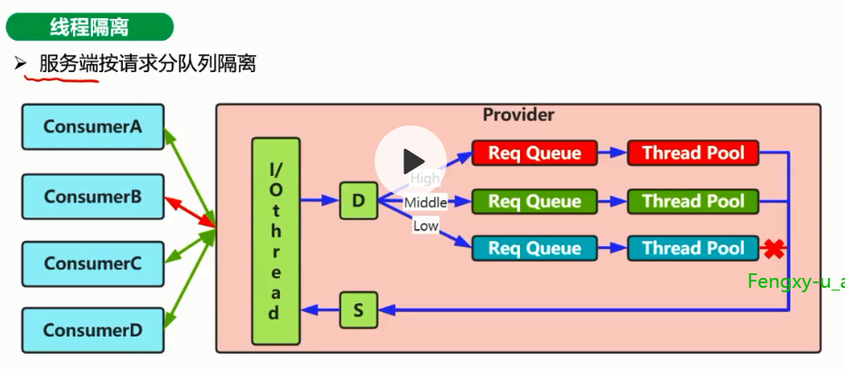

# 服务容错企业级解决方案

## 服务容错企业级应用场景分析与设计实践

先看下面这张图

这种情况就是比如某个节点出问题了，导致上游出现超时，那么四分之一的流量（打到ServiceD的）都会出现超时，导致上游的线程渐渐的大部分都是在等待超时，这样上游就资源耗尽了。

渐渐的，下游影响上游，最终导致如下图所示的流量情况。

这种场景的原因是单独的ServiceA在处理请求的时候出现了问题，比如有可能的原因是ServiceA调用下游出现耗时，或者单独serviceA在处理的时候有太多的耗时，这样导致serviceA的上游都会出现问题。

这种情况是某个上游到下游的流量突增导致压垮了下游，这么着其他调用这个下游的上游服务也就出问题了。

### 服务容错意义

### 服务容错解决方案

有如下解决方案：

1. 资源隔离
2. 服务熔断
3. 服务降级

#### 资源隔离

##### 资源隔离的两种常见类型

比如线程池1，专门调用A服务；线程池2，专门调用B服务，线程池3，专门调用C服务；

如果A服务出问题导致线程池资源耗尽，那只会影响线程1，不会影响2,和3

信号量来控制并发。比如对后端的并发控制在10个，那么最多同时会有10个请求打入后端。

###### 线程池隔离

**1. 服务方按请求分队列隔离**

不同的请求放到不同的线程池里面进行处理，假如这个粒度是按照客户端来源进行划分（先不考虑是否好落地），那么请求方B放在单独的一个队列里面，而恰好这个队里里面消费太慢，导致这个线程池不可用（大部分线程都在等待处理），那么只会影响请求方B，而不会影响其他的客户端。

**2.调用方按流量出口类型做资源隔离**

对流量的不同去向进行隔离，比如调用B服务的放到专门一个线程池中，这样如果B出问题了，顶多影响B对应的这个线程池

###### 信号量

##### 资源隔离涉及点

图示为hytrix的做法

##### 资源隔离对比

#### 服务熔断

##### 什么是服务熔断

> 服务熔断：临时关闭对系统某些功能的调用，个别业务不可用，**系统整体可用**

其中前两个很好理解，我直接把这个功能关闭掉（熔断），

阈值触发，比如说统计到有40%的流量有异常了，那么就触发熔断。

### 服务熔断和降级分析与设计实践

#### 服务熔断涉及点

服务熔断涉及的几个点：

1. 可熔断的服务：比如对计数服务进行熔断

   这个要根据具体的业务来看，比如上面的列表页，计数不重要，计数服务是可以熔断的。

2. 熔断触发方式：主动/被动

   > 主动：出于对资源的保护或合理分配流量，不需要等待触发，我直接熔断掉这个服务，比如双十一退款
   >
   > 被动：被动触发，就是前面的到达阈值触发这种情况

3. 恢复时机

   > 双十一过去了，退款恢复。另外被动情况什么时间恢复

#### 服务熔断降级涉及点

比如搜索返回兜底数据；还有浏览计数返回假数据：

ia

1. 可降级服务

   是一种补偿策略

2. 降级方法

3. 降级触发

   第一种很显然就是服务熔断了，我要降级

   第二种调用异常或超时，比如我调用A接口异常了，我做个降级，如果一直异常，那么进行熔断

4. 恢复时机

   调用OK了就恢复，降级不是一个状态，不需要恢复，OK了就可以，熔断需要恢复

#### 熔断降级

> 系统可用性可靠性保障手段，保证了服务的柔性可用

#### 断路器设计

##### 断路器是什么

> 服务熔断开关，当对下游服务调用异常达到设定阈值后，打开断路器，触发熔断

##### 断路器状态流转

半打开状态的意义：

1. 可以拿少部分流量做试探，比如已经断路器打开状态，但流量持续存在，这个时候我们可以用少部分流量试探一下，如果调用成功了，那么就可以关闭断路器。
2. 设置一个关闭窗口期，如果刚刚打开断路器就去试探，是不是毫无意思，我们可以有一个窗口期，比如15秒，打开断路器15秒后进入半打开状态，我再拿试探请求试探，成功关闭断路器，失败则重新恢复到打开状态。

##### 阈值与统计数据

1. 数据类型，一般使用百分比比较好

2. 颗粒度，可以是各种粒度，区别主要看你采集数据的粒度，比如你按服务采集，如果A调用这个服务1000此，有100次异常，然后达到阈值后，标记这个服务不可用，那就是服务粒度。

3. 数据结构，比如有三个统计项，成功数，失败数，超时数等等，那么失败/总请求数就是8/208
4. 统计单元，这个统计应该是在一个时间段进行统计的，这个统计单元怎么设定

上图是增加了起始时间的一个字段。

这里的时间段选择，大了或小了都会有问题，大了（比如一个小时），容易漏，比如在一个流量占比很小的时间段出现了问题，本来应该触发的，但实际上因为相比整个时间段流量还是很小，所以漏掉了。如果太小（比如1秒），在一个时间段虽然频繁出现异常，但时间因为时间段本来就很小，这个只是网络抖动，那么这时候就误判。如果是不大不小的时间（ 比如10秒），那么如果在时间段的交界处频繁出现异常，这个时候整体可能需要熔断了，但因为在交界处达不到触发阈值，也可能漏报。

所有关键在于要合理打开断路器：**减少误判**

比如一个槽就是1秒的数据，连续统计10秒的数据，每个时间段统计一下相关指标值，

滑动窗口，每统计1秒的数据，最老的槽的数据就不再有效，都拿最近10秒的时间，9个桶放历史数据，一个桶是最新的。

**数据结构**

用容量只有9的循环数据，或链表（加一个新的，就把第一个几点删掉）

**滑动窗口代码分析【未看】**

## 熔断组件Hytrix原理剖析

### 什么是Hystrix

>H ytrix语义为豪猪，Netflix开源的一个服务隔离组件，通过服务隔离来避免由于依赖延迟、异常等引起资源耗尽导致系统不可用的解决方案

 

### hystrix依赖隔离

### hytrix执行逻辑

### 断路器工作原理

转转的实现实际上是借鉴了这个hystrix的思想。

## Hytrix服务熔断降级应用案例

### 熔断降级配置【主要是代码，未细看】

#### 熔断降级Command

