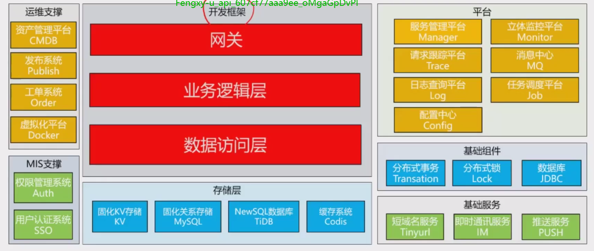

# 基础架构篇

## 网关

问到网关的问题：

- 站在对外的角度：网关是隐藏内部细节，统一入口
- 站在自己的角度：所有与业务无关的通用性功能全部由网关来承担
- 站在对内的视角：对下游的各个业务逻辑做路由转发和负载均衡

## 平台

立体监控平台：提供全方位的，多视角的，多维度的监控

消息中心MQ：MQ

任务调度中心：用来调度任务的管理中心

服务管理平台：服务的管理

请求跟踪平台：跟踪服务链路，服务依赖

日志查询平台：用来定位问题

配置中心：

## 存储层

KV存储/RDBMS/NewSQL/缓存系统

## 基础组件

分布式事务、分布式锁、数据库JDBC。
