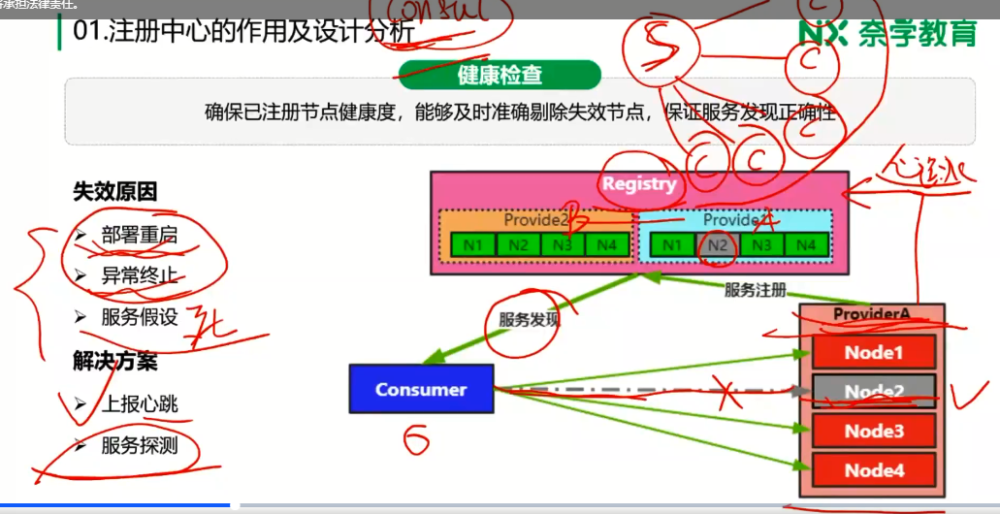
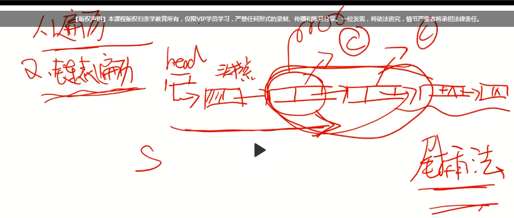

# 注册中心原理和设计实现

## 注册中心的作用和设计分析注册中心定义

注册中心用来实现微服务的自动注册和发现，是分布式系统中的核心基础服务

### 注册中心核心功能

#### 服务注册

服务提供方将服务的自身路由信息注册到注册中心，服务消费方获取这些信息以便于建立连接和发起调用，这些信息包括：

1. 路由信息：注册服务的节点的ip，port等路由信息
2. 服务信息：序列化协议、路由规则、节点权重，比如路由规则，如果你这个节点是一个灰度节点，那么就可以将这个信息注册到注册中心，这样上游调用的时候就知道你这个节点是一个灰度节点，这样在流量控制的时候业务就会做特殊处理。节点权重类似。注意，**这里的服务信息可以根据自身业务进行扩展**

#### 服务发现

首先，服务提供方的信息都已经注册到了注册中心，服务消费方如何能及时发现呢？而且这个发现要可靠。有三种方式：

1. 重启拉取，消费方在重启的时候需要能够一次性把提供方的信息拉取回来。

2. 订阅/拉取（通知回调），消费方要向服务提供方进行订阅，这样服务提供方如果有任何变动（扩容、缩容）就会通知到消费方，这里又有两种方式；第一，通知事件+客户端拉取；第二，通知变动。第一种和第二种的区别：

   

   注意这里，看起来第二种方式更简单，但实际上第一种方式更可靠，注册中心作为服务消费方的服务端（被动式编程），是不是越简单越好。第二种方式注册中心需要对每一个客户端都将变更内容推过去，而且因为是主动发起，所以需要对过程负责，这样就增加了注册中心的复杂度。第一种方式注册中心只要将变更事件广播出去即可，客户端自己调用S端提供的api接口即可。

3. 轮询，需要能够定期轮询拉取信息。

#### 健康检查

确保已注册的节点的健康度，能够及时准确的剔除失效节点，保证服务发现的正确性。

##### 节点为什么失效

可能的原因有如下几种：

1. 服务重启
2. 异常终止
3. 服务假死

##### 解决方案

1. P端上报心跳

2. 服务探测

   比如**服务假死**这种情况，用于上报心跳的线程仍然在正常工作，但是服务于工作线程的线程池已经不工作了，这个时候注册中心可能就会模拟正常的请求发到服务提供方看看是否有回应。这个接口就是探测接口，没有实际的业务逻辑，只是做一个回应。比如consul服务注册的时候可以通过一个http接口，就可以用来探活。如果服务已经假死，即使有心跳，也还是会将P剔除出去。

#### 变更通知

服务提供方B有四个节点，现在节点N2不可用了，现在B有两个订阅者C2和C3，那么注册中心就要将N2不可用的消息通知给C2和C3

### 注册中心设计

#### 数据存储

注册中心数据是怎么存储的。

##### 数据组织

集群维度/节点维度

一般是使用集群维度

涉及到两个key-list。

1. Pn->Pnlist：服务提供方PN->服务提供方PN的集群列表
2. Cn->Cnlist：服务消费方Cn->服务消费方Cn的集群列表

##### 订阅数据组织

订阅是C和P之间的订阅，双向都要建立关联关系，有如下两种数据结构：

1. Cn->Pnlist：消费方Cn到订阅的服务提供方集群列表（不是节点维度）
2. Pn->Cnlist：提供方Pn到被订阅方的集群列表（不是节点列表）

#### 超时处理

##### 数组遍历

数组遍历，这种最简单，就是每个服务提供方对应数组的节点，有一个指针去扫描，发现有超时就剔除。

##### 链表遍历

链表，每次有心跳包过来，就把这个服务提供方对应的链表节点移除并放到链表的尾部（尾插法），这样每次扫描只要扫从头节点开始的一系列节点即可（因为链表实际上是按时间排序了），后面的节点就不用扫描了。这种如果节点很多，心跳时间比较短，那么就会有频繁的节点插入和删除动作。

##### 动态分组

1. 第一次，服务器计算出改心跳的超时实践，用桶长度取模，入对应的桶。数组的值即超时时间
2. 以后每次上报心跳，都返回超时时间，这个时间会在下次上报心跳的时候带过来，目的是找到前一次的桶的位置，从这个桶里面删除，移入到新计算出来的桶的位置。
3. 有一个超时节点指针（比如每1分钟扫描一次），看看有哪些超时，如果超时了，那么这个桶里面的所有元素都超时。

这里面用到的数据结构就是取模数组+链表。效率高。

#### 变更通知

注册中心本身是一个集群，注册中心节点A健康检查，但是节点B进行通知，A和B节点如何一致，如何通信？

意思就是如果P的健康检查异常时注册中心中Node3节点发现的，那么这个信息如何在集群里同步，以使得其他几点能通知到对应的这个P服务的订阅者？

##### gossip协议

1. 6度分离理论
2. 周期性散播消息
3. 随机选择N个节点散播
4. 散播不重复不回传

consul用了这个gossip协议进行数据的传播

### 注册中心的作用

注册中心除了服务发现和注册，还有一些高级功能（服务治理相关）

#### 服务扩容/缩容

#### 机器迁移

#### 权重

#### 灰度发布

## 注册中心的本质和设计思考

### 注册中心是什么？

> 存储+订阅

### 存储系统的主要关注点

1. 服务可用性
2. 服务可靠性
3. 数据一致性保障

可用+可靠=稳定

### CAP定理

注册中心是AP模型，那么CP就一定不能用吗？不一定，实际上是有公司在用CP（比如zookeeper）的，那么CP如果发生刚好访问到不可用节点怎么处理？那么可以在本地保存一个缓存啊。这样就依然可用了。

## 注册中心选型对比

从上面可以看到，主流的几个注册中心其实都是CP模型。

CAP，两个条件：有数据共享，有连接。另外CAP只适用于读写。

eureka已经暂定社区支持了，谨慎使用

## Nacos中心深入分析

### Nacos功能分析

#### 服务注册与健康检查

##### 临时节点

临时节点每5秒上报一次心跳，3个心跳周期都没有上报，标记为不健康。6个心跳周期就剔除这个节点。

##### 持久化节点

是后端节点对永久节点进行探活，20秒探活一次，如果探活不可用，则标记为不可用，不会删除。

探测方式：tcp/http探测

一般服务节点可能作为临时节点使用，而存储节点作为永久节点来使用。

#### 数据模型

##### 数据存储

service下按照组的粒度来存储数据，相对于一般的注册中心，粒度更细。

##### 数据隔离

User一般指多租户；Namespace指环境；Group指项目应用，service就是前面数据存储的service

nacos这么设计主要是结合了阿里本身的战略目标。

#### 数据一致性保障

nacos即可以在CP模式下运行，也可以在AP模型上运行。

1. CP模型就是通过Raft协议保持一致性；
2. AP模型通过Distro AP一致性保障；

Distro是阿里自研的一种算法：

1. 客户端随机选择节点发送请求，比如节点1,2选择了nocos1；节点3,4选择了nocas2；、、、
2. 服务端各节点只负责部分数据，比如Nacos2只负责Node3,4的数据，node3,4打到其他节点的写请求全部转到Nacos2节点上。负责的写请求写入后，异步广播通知其他节点
3. 心跳的处理（需要继续深入看一下）

## Zookeeper深入剖析

### zookeeper核心模块

#### 选主逻辑

> 三种角色：Leader,Follower,Observer

参考图上的比较策略

三种角色的区别：

1. 只可以leader来写，如果写打到其他非leader节点，都要将写请求转发给leader，让leader来写入
2. follower参与选主逻辑和写入投票，而observer只接受写入结果，是不参与选主和写入投票的。
3. leader负责写，follower和observer负责读。

上面是选主逻辑。

#### 数据一致性保障

##### Zab

> Zab, Zookeeper Atomic Broadcast, Zookeeper原子广播协议

Zab是顺序一致性。

（此处省略代码...........)

#### 数据模型

树状的存储模型，分为永久节点和临时节点

##### DataNode

> Zookeeper中存储的最小单元，也是持久化数据节点描述的最小单元

##### DataTree

> 以树形结果存储了zookeeper中所有的数据信息。

##### ZkDataBase

### Zookeeper做注册中心

#### Dubbo + Zookeeper注册中心的使用【代码+使用，暂时未细看】

服务注册和服务订阅的源码分析、zookeeper选主相关代码逻辑分析

## 注册中心和服务治理

> 注册中心除了提供最基本服务注册和服务发现的功能以外，从系统架构角度分析，注册中心还可以提供哪些功能

**注册中心地位**

1. 功能角度：微服务架构中核心服务
2. 架构角度：可以触达任何服务，起到枢纽作用

因为注册中心和微服务架构中的每个服务都有触达，因此注册中心就成为了一个直观重要的通道，有了这个通道，就可以完成一些服务治理需要的工作，比如：

**服务治理命令下发通道：**

1. 动态权重
2. 流量路由
3. 服务熔断降级
4. 权限管理
5. 动态过载保护策略
6. AB测试
7. ......

因为注册中心和所有服务之间都可以作为通道使用，那么我们在这个上面就可以发送指令，依据可自定义的协议来完成一系列的功能。这里的admin就是服务管理平台

### 案例

#### 灰度上线

> 先发布少量节点验证，降低对线上业务的影响。

比如，刚发布的服务提供方a，我想让其中一个服务节点只接收1%的流量，那么我就可以下发一个指令到服务a的订阅方，告诉订阅方，服务a的流量控制在1%即可。

### 服务熔断

> 当服务提供方异常不可用，或实际业务需要暂停某些业务，有损提供服务，那么可以通过注册中心下发熔断指令

比如通过注册中心下发服务消费方A调用服务提供方B熔断指令（比如在大促互动需要暂停退款业务的时候）。。这样服务消费方就不会再调用B了。

## 注册中心【总结】~学到了什么

注册中心的功能（4个主要功能）以及大体的流程

注册中心设计需要注意的哪几个点？比如超时处理、数据一致性如何保证

注册中心除了核心功能，作为服务治理能做的事情，指令和数据采集的大体架构是什么

注册中心的本质是什么？

## 注册中心【总结】~还有什么需要加强的

1. 分析一款主流注册中心（nacos或zookeeper），分析注册中心功能、各种算法在中间中中的体现。分析其源码
2. 搞懂nacos在本节中的实践。（公司用的nacos）
3. 搞懂数据一致性的处理在各主流注册中心的处理
