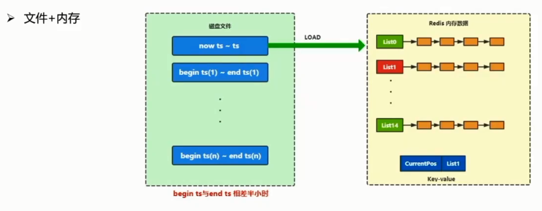
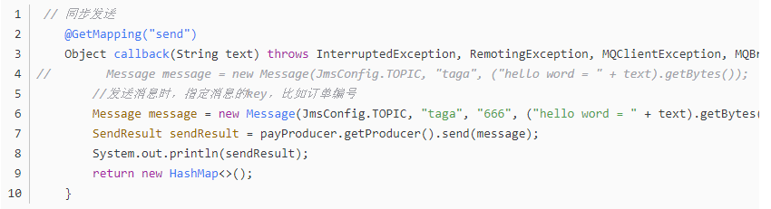

# 消息中间件

## 消息队列在分布式架构中的作用

### 什么是消息队列

> 在消息的传输过程中保存消息的容器，生产者和消费者不直接通信，依靠队列保证消息的可靠性，避免了系统间的相互影响。

### 消息队列主要角色

1. 服务端，也就是上图中的MQ Server
2. 客户端，分为消费者和生产者

### 应用场景

这个场景比较多，比如运营活动，如果不适用消息队列，会在正常逻辑中频繁的增加运营活动相关的代码，而且这个代码还有时效性，那么我们就可以使用消息队列来处理，和正常业务进行解耦。

原先的业务逻辑如下：

修改后的逻辑（注意多了的这块逻辑是通过MQ处理的）：

增加一个运营的logic，不管你怎么改，原先的业务逻辑是不需要改动的。

### 消息队列的主要作用

#### 业务解耦

原先的RPC，上游是需要知道下游的，业务紧密耦合，如果使用MQ，业务就完全独立了，直接无任务关联。我只管发消息，下游只管消费消息就可以ile

1. 提供系统的稳定性

2. 通过广播消息避免多次调用

3. 提高编码效率

   统一调用MQ即可，丢消息即可，不需要了解RPC的细节，下游的信息

问什么MQ不能取代RPC,因为如果都用MQ，那么MQ就成为整个系统的中心了，这样的话MQ的稳定性就成为整个系统的稳定性，MQ挂了就全部挂了。而RPC的链路有很多分支，这个地方异常不会影响我其他接口的调用。去中心话

#### 异步调用

> 对于无需关注调用结果的场景，可以通过消息队列异步处理

比如如下场景：

其实，红色的并不一定需要立即知道结果，前面两个是这个下单的关键操作，必须同步拿到结果才能继续处理。而后面的（红色）对主流程并不影响，完全可以异步处理。

#### 流量销峰

> 系统的吞吐量往往取决于底层存储服务的处理能力，数据访问层可以调整消费速度缓解存储服务压力，避免短暂的高峰将系统压垮

### 思考

使用消息队列能给系统带来很大的收益 ，但也会对系统架构造成一定的影响，不能完全替代RPC，要根据业务合理使用

#### 对系统架构影响

1. 系统可用性，如果大量使用MQ，那么MQ的稳定性势必影响整个系统的稳定性，可用性
2. 架构复杂性，如果大量使用，可能造成消息生产-消费之间的关系异常复杂，调用链路太复杂
3. 排查问题路径，应为链路复杂，排查问题带来困难，所以这里有个实践，**如果使用MQ，消息体尽量设置成head+body的格式，head中有链路追踪信息，比如logId，在生产和消费的地方打印logId，否则这个链路从日志上看就是断裂的，不利于排查问题**

## 主流消息队列选型对比

### 对比维度

#### 系统定位

大体定位，比如主要是AP问题还是TP，如果是AP，那么kafka，吞吐量大，比如在ELK中，kafka用于发送日志

#### 支持的功能

比如是否支持事务消息？延迟消息？持久化？等等

#### 可用性

#### 可靠性

#### 运维

### 基础项对比

### 可用性可靠性对比

### 功能对比

#### 顺序消息

这个功能，能不用就不用，因为顺序消息要求非常严格，必须单生产者（不如不是单生产，顺序如何保证，每台机器时间可能都不一样，即使你时间同步了，先发的也可能后到达队列，等等），mq单队列（如果多个队列，那么消费者消费的时候取的队列不一样，同样不能保证先到队列的先消费，比如msg1扔给队列1，然后msg2扔给队列2，但是某个消费者抢先拿到了msg2消费了，那就不能保证顺序了），单消费者（如果是多个消费者，那么C1先拿到了msg1，C2后拿到了msg2，但是你仍然不能保证C1就先消费，因为有可能C2这台机器性能很好优先消费了msg2），单线程（如果多线程，同样是按照顺序扔到了线程，但是有可能后到的消息抢先执行了，还是没办法保证顺序性）

所以实际上业务尽量绕过去，通过其他方式避免用这个顺序消息。

#### 延迟消息

也就是我先发到MQ，一定时间再来消费，目前只有RocketMQ支持，有18个level

#### 事务消息

有人说事务消息kafka不是支持吗？具体来说，Kafka 生产者在同一个事务内提交到多个分区的消息，要么同时成功，要么同时失败。这一保证在生产者运行时出现异常甚至宕机重启之后仍然成立。

这里说的事务是指消息发送和本地事务 要保证原子性的问题。

从消息查询、批量发送、消息失败重试这几个特性，我们就可以看到kafka是一个什么样的消息中间件。

如下为RocketMQ的半消息流程图：

看一下这三种消息的大体定位：

一个是OLAP，最求吞吐量；另外两个适合线上OLTP业务的。要求可靠的消息传输。

## RocketMQ深入剖析

### RocketMQ功能特性

1. 支持事务性消息
2. 支持延迟消息
3. 支持消息重发
4. 支持consume端tag过滤
5. 支持消息回放

前面几个前面都有说过，每个mq的对比

消息回放是什么？

#### 消息回放

场景应用：

就是说消息消费后，各种原因丢了丢了丢了，这时候就可以让MQ消息进行回放，重新消息一次，OK。

### RockMQ 拓扑图

#### Name Server

相当于注册中心，但不是传统意思上的。

注意，**name Server之间没有交互**，其作用是服务注册，服务发现。

所有的broker向nameServer注册，所有的客户端（生产方，消费方）向nameServer发现服务

这里的nameServer为什么没有数据同步啊，ap和cp啊，那么rocketMQ为啥没有？为啥？broker太少了，就这个几个，而且基本上也不变动，注册就注册到3个节点上（图中是3个节点）

#### broker

用来存储消息的

原来啊，我一个topic放到一个broker上，但是随着消息越来越多，一个topic的消息在一个broker上存不下了，就可以扩展出一个broker。

一个topic的消息存放在多个broker中，

broker是主备部署，正常情况下生产者向nameServer查找topic所在的broker，然后会把消息发到这个主broker上，主broker写入消息，主会将消息同步给备broker。

#### producer

生产者到nameServer查询topic所在的broker并发送消息到broker

#### consumer

消费者正常是到主broker上消费消息的，如果主broker挂了，那么会到备broker消费消息，因为备数据一定落后于主broker，所以那些在挂了之前还没同步到备broker的消息就暂时不会消费。在主broker挂了之后到主broker恢复期间，消息消费也从消费备broker，等主broker重启后，那些在主挂了后没及时同步到备的消息会被消费者消费。注意，不会发生主备切换，主挂了，生产证不会把消息发到备，否则，没及时同步到备的消息就丢失了。。

### RocketMQ 架构图

### 消息存储

#### CommitLog

存储消息主题，每个broker维护一个commitlog，所有需要发送到这个broker的主题消息按照时间顺序追加写入到这个log里。

#### ConsumerQueue

消费队列，会有一个类似dispatch的线程，将消息分发到不同的队列里。一般一个topic会对应有多个消息队列，如何分发？

一种是在broker里面扫描commitlog时根据消息的topic，然后根据一定的负载均衡算法进行分发（比如均匀的分到topic对应的几个queue里面。但是rocket没有这么做，

rocketmq是在生产者这里进行负载均衡的，它投递过来的消息，不仅有topic名称，还有队列Id。

##### maxOffset

最大偏移量，分发的时候我就把消息放到这个最大偏移量的地方，表明最新的信息相对于commitlog的这个偏移量。

##### consumerOffset

指当前消费者消费到哪里的一个偏移量，注意消费者可能并发消费，并不是一次只消费一条

##### minOffset

最小的偏移量，在minOffset和consumerOffset之间的应该是正在消费的，如果这个区间全部消费完了收到ack了，那么minOffset就会前移。否则这个minOffset不动。

有可能这中间的消息有一部分没消费成功（consumer挂了），那么下次消费端还是从minOffset进行消息，造成重复消费。这个是rocketMq存在的问题。

关于消费的问题，

这里我们可以看到，如果消费的慢，生产的速度快于消费，那么有可能消费消息时对commitlog的读取是比较多的随机读（读的是很老的数据，应为commit是顺序写，生产速度大于消息，说明这个顺序写的很快，消费读到数据离最新的写的位置很远。因此当消费者消费较慢时会有顺序写随机读的问题，可能有瓶颈。但不一定会实实在在带来性能问题，rocketmq在这里也是做了一些优化的。

下面看一看这个优化手段。

##### 随机读优化手段

###### commitlog文件切分，默认1G

超过1G，再写一个新的commitlog，老的commitlog如果消费完了，就可以不放在内存了

###### MMAP提升文件访问能力

用内存文件映射较少一次拷贝，较少文件的读性能。

###### SSD

#### 代码剖析（存储流程，分发流程）【暂未看】

### 特性分析

#### 可靠性分析

##### 刷盘机制

###### 同步刷盘

> 效率低，可靠性高

同步刷盘如上面的左图，Broker同步等待刷盘成功才返回给生产者成功，这种效率就比较低，因为有IO操作，但是可靠性高，数据一般不会丢。

###### 异步刷盘

> 效率高，可靠性低

这种就是不同步等待，只要数据放到虚拟内存就返回给生产者。然后等待一定的时机再刷盘，这种最多可能丢失一定时间的数据，可靠性没有同步刷盘高，但效率很高，没有没有耗时的刷盘操作。

一般实际上异步刷盘的多，很少用同步。

##### 主从复制机制

###### 异步复制

主broker同步消息给从的时候立马返回，不等待从同步成功。

###### 同步双写

主broker同步消息给从的时候等待从broker写入成功，然后才返回成功。

综合前面所说的，**同步刷盘+同步双写**是可靠性最好的，但是一般没必要这么严格。一般线上业务可以用低一些的配置，

#### 可用性分析

##### 主从模式Master宕机

broker可读不可写，消费方继续从从broker消费消息，生产者不能继续往这一组broker（包括主和从）里进行消息发送。

##### 集群搭建方式

###### 单Master方式

一般用于线下或开发环境部署方案，如果挂了，即不能生产也不能消费了

###### 多Master方式

其实就是比单Master方式增加了多个Master，这样如果master1挂了，生产者还可以把消息发到其他的master节点。但是挂掉的master节点就不能消费了。因为没有从Master了。

这种方式线上也不会这么干，线上一定是要主从模式的。

###### 多Master多Slave模式

这个就是前面一直介绍的这种模式，多组broker（主从broker称为一组），每组一个主broker，一个从broker

1. 异步复制

   这种情况的话就是前面说的那种，如果master挂了，那么消费者只能从从broker消费消息，那些主broker还没及时同步到从broker的消息就只能等待主broker重启后再消费。再不好的情况，如果主broker磁盘挂掉了，这部分没有及时同步到从broker的消息就会丢失。

2. 同步双写

   这种情况最严格，可靠性最高，master和从完全同步，不存在消息不一致的情况，挂了后直接从从broker消费。

   同步双写建议还是仅用在非常非常重要的消息，给他单独部署一个broker，使用这种同步双写

#### 生产方式

同步/异步/单向

主要说的是生产者发送消息要不要等待MQ返回结果，如果是同步，那就是P发送消息，MQ同步返回结果；如果是异步，那么P直接发送消息不等待结果MQ就返回，MQ异步处理后再返回结果；单向是最弱的，P只管发，不需要MQ返回任何结果（异步和单向什么区别？？）

生产上一般是同步，否则就没有多大意义了。

#### 消费方式-原理

> 消费消费一般分为Pull和Push两个方式，两种方式各有各的特点

##### Push

实时性高，但是没有考虑客户端的消费能力，

##### Pull

实时性低，但是可能造成很多无用的请求

如上两个不多说，大家都知道是这么回事。

##### RocketMQ的方式

> RocketMQ是基于拉的模式，但是使用了一种长轮询的机制，来平衡Push/Pull模型的各自缺点

具体方式：

1. Consumer发起拉取请求
2. Broker hold住请求，直到有新消息再返回
3. 请求超时，Consumer再次发起请求
4. 请求超时时间默认30s

所以，实际上还是推的，有数据就会在这个轮询里推给客户端。客户端把这次推的消费完了再发起请求拉取。broker还是考虑了consumer的消费能力的。

#### 消费方式-功能

##### 集群消费

> 集群内竞争消费，单条消息只消费一次，各节点均匀消费集群消息。。

##### 广播消息

> 各集群消费全量的消息，单条消息在每个集群都会被消费一次

也就是有多个消费方，一个集群内竞争消费。多个集群全量消费

#### 负载均衡

##### producer负载均衡

这个前面已经说过，但还有一些需要说明。

1. 定时获取queue信息

   producer会定时到nameserver获取queue信息，但是这个queue可能有多个，怎么选择呢

2. 负载均衡算法：随机递增取模

   可以认为就是轮询

3. 容错机制：故障延迟

   增加了容错机制，就是说如果broker挂了怎么做，那么会有个延迟时间，比如第一次是500ms，500ms后再看看能不能用。然后如果还是不行，增加到1秒（意思过了1秒我才去看这个broker能不能分发？？）
   
   

##### consumer负载均衡

一个队列只能被一个Group内一个消费者消费。因为一个消息只能被group内一个消费者消费，因此minOffset等在一个组内不能共用，但是多个Group是可以的。

一个group内的消费者，可以分配消费，比如消费者1消费队列1和队列2的消息，消费者2消费队列3的消息。

**目的**：让每个消费者合理的能分配到要消费的队列，不能有冲突（如果消费者多于队列数如何能保证不冲突？？？）

###### 客户端心跳上报数据

客户端要做心跳上报，把相关数据给到nameServer

###### 定时Rebalance 20S

每隔一定时间或在某些条件下触发消费端的Rebalance，消费者重新分配队列。

1. 获取队列信息

   从NameServer获取到队列信息，比如topic下游多少个队列

2. 获取消费者信息

   从broker处获取消费者信息，broker是知道消费者信息的。

3. 排序平均分派

   按照一定的策略平均分派，比如可以按照分页，有一个消费者就是一页，每页多少个就可以计算出来。

   

   

### 消费失败

#### 消费失败策略

1. 重试16次

   消费失败首先会重试，如果重试还是失败，就要加长这个重试的间隔，直到16次重试还是失败

2. 失败后rocketmq会将消息重新投递到commitLog，然后队列的消息会继续消费。然后失败的消息会进入死信队列，（也就是Retry Queue）

#### 实现原理

创建了Retry Queue的队列，客户端会默认订阅这个队列。这里也会结合延时消息实现重试间隔。

这里有个问题，rocketmq默认只创建了Retry Queue队列，如果有多个消费方，是只能有一个消费方消费的，所以你的业务如果单消费方消费会带来问题，这里就需要多创建几个Retry Queue队列

### Rocket高级功能

#### 事务消息

##### 业务场景分析

1. 用户下单

   创建订单（在交易系统）+减库存（在商品系统）

2. 发布或更新商品信息

   写商品库+更新外置索引

第二种情况：比如我们的业务逻辑先到商品库 写商品，然后发个MQ到search，更新索引等

##### 分布式事务【需重点了解的知识，需要扩展，未学】

强一致性/柔性事务/事务消息

###### 强一致性协议

两阶段提交2PC/三阶段提交3PC

**2PC**

第一阶段，准备，但是不提交

第二阶段，提交或回滚，

确定，如果第二阶段有一个commit失败怎么办，那么其他的参与者可能不知道是该提交还是不该提交

落地方案：XA

###### 柔性事务

TCC/SAGA

###### 事务消息

**简化了分布式事务模型**

**对业务友好**

具体就是如果一个事务需要调用2次RPC来完成，比如如下的

2次RPC转换了一次RPC和一次事务消息， 也就是我只要保证本地事务（订单）和消息发到MQ都成功或失败，就可以最终保证了数据一致性。这个就是事务消息。

和2PC区别就是2PC要求订单和减库存两个本地事务都成功或失败不同

事务消息只保证一个本地事务和一次事务消息能发到消息MQ，这个完整的数据一致性其实还需要MQ保证另外一个事务的执行，

看看RocketMQ的两阶段提交的事务消息方案：

这里主要的点就是这个回查接口，当MQ Server过了一定的时间发现客户端并没有告诉我这个半消息到底是要提交还是回滚，那么这个时候MQ server会回查业务系统，获取业务系统（客户端）的事务状态，如果事务已经提交成功，那么MQ Server就将半消息真正投递出去，否则就删掉这个半消息

回查接口具有业务侵入性，这个是需要考虑的

**MQ事务消息实现原理**

OP消息，存放roolback或commit的消息，如果是rollback，做一下记录即可。如果是commit，那就重新投递

回查：对比half消息和op消息进行回查。

如上图，如果来了OP消息是commit，那么半消息队列就把原消息重新投递到commitlog（topic和队列换回原来的）；如果到了超时时间还没收到任何消息，那么会对比OP消息，如果需要回查，会回查业务，根据业务状态决定重新投递还是咋的

**MQ事务消息缺点**

需要业务提供回查接口，业务浸入较大

#### 延迟消息

> 由业务场景或现实情况决定，需要在当前时候之后某一时间触发指定的业务逻辑或操作。

类似于这种业务场景，可以定时扫库，或者延时消息，那么**延时消息**更优雅，因为这种是点的操作，而不是扫描的操作，因此更加优雅。

##### RocketMQ的做法

由此我们看到，它只支持18个级别，其他的延时时间是没法精确设置的。

##### 实现原理

##### 延迟消息特点（缺点？）

## 消息队列扩展功能实现

### 事务消息扩展实现

每个需要事务消息的地方，使用事务消息表，然后扫库发送，清理。

### 延迟消息扩展实现

rocketMQ由于支持场景有限

我们知道延迟的话，用什么算法最好，那就是时间轮算法。

#### 时间轮算法

> 用于高效的实现大量的定时任务，实现简单并且有非常高的精度。

实现的数据结构：数组+链表

那么问题来了，如果时间跨度很大，这个数组不能搞的很大吧

##### 长时间跨度

文件+内存

时间轮可以解决短时间就到期或就绪的事件触发，但是如果是长时间的呢？比如2个小时，比如15天，甚至是1年时间跨度的？如果用数组+链表的时间轮，达到秒级的触发，如果是15天到期的事件，那么就需要86400*15长度的数组，显然这个没法落地。

那么就可以用文件+内存这种模式。

假如那个轮子，我不能放到内存，我把它放到redis里面，redis就不用数组，直接用链表。

Redis的key-value就是：key为当前pos，比如第一秒指向list0，第二秒指向list1，

如果redis能接受存半小时的数据，那么文件就存半小时区间数据。

比如第一个文件存今天1:30~2:00到期的数据。

第二个文件存今天2:00~2:30到期的数据，以此类推，如果磁盘空间够大，我可以存一年的也没有问题。

然后我来一个消息，如果是当前半小时之内到期的，我就直接存到redis，否则（半小时之外），就存在文件中。然后我只需要一个时机，把文件的内容装载到内存里就可以了。

###### 基于上述的方案我们改造RocketMQ

schedulelog files就是前面说的文件。memindex就是时间lun，内存索引

延迟消息发过来的时候，先把消息存起来，超过半个小时的，我往文件里面存，半个小时之内的，我存到时间轮里。

**dispatch改造**【具体有代码演示，未看，后续再继续了解】

原来是放一个特殊队列，现在是写到文件里去

## 消息队列架构实践课

### 认识MQ

**MQ的本质是什么？**

1. 通讯机制
2. 订阅系统
3. 消息存储系统

订阅系统，三种模型：信箱模型（poll）/BP机模型（push+poll）/电话模型（push）

**MQ应用场景**

1. 轻重分离

   把业务中轻量级和重量级的部分分开（重量级和轻量级指复杂度），核心业务和扩展业务分隔开。

2. 一多应用

   一对多的场景，比如典型的场景，一个消息可能有多个系统关心，这个时候就可以通过MQ来实现，让关心的系统订阅这个消息即可。

3. 结果忽略

   发送者不需要关心消费者的消费情况。

4. 流量缓存

   比如秒杀等场景

5. 架构保护

   一般都是分层架构，一般都是从上游调用下游，下游是不能调用上游的。下游调上游就容易对架构造成伤害，为了避免伤害，可以由下游往上游丢消息MQ，让上游进行消费。

   那么我同层之间能相互调用吗？不可以，如果同层之间调用，还是用MQ，如果MQ也不能用，那我觉得就要考虑业务下沉的问题了。

**架构功效**

解耦/异步/销峰

**架构取舍**

RPC/MQ：如果上游对下游关注，用RPC，否则可以用MQ

MQ对架构的影响：增加响应运维成本，增加架构的复杂性。这方面体现在，MQ引入了中间环节，增加了链路的复杂性。可能导致定位问题的复杂性。RPC出现问题，定位问题的复杂性要降低不少。而且引入MQ，如果MQ挂了，对系统的影响是十分巨大的。

### 分布式事务

在其他章节里会详细说明

### 剖析RocketMQ

**逻辑架构**

**物理架构**

将逻辑架构映射到实际的部署

#### 四大特性

##### 可靠性的保证

可靠性怎么保证的？需要从链路的各个环节来看：

1. 发消息阶段，P必须等待broker给一个response才算成功（如果不收到response，那发送阶段就不能保证不丢消息了）

2. broker收到消息后，消息需要罗盘，有两种方式：同步罗盘/异步罗盘。如果是异步罗盘，就有可能丢消息，比如这时候broker没电了（还没有落盘）。 另外一种，磁盘坏了，这种怎么帮，不管同步还是异步，机器不能用了，重启也没有，那就是单点故障，需要再搞一个broker（slave），这个就是复制（冗余），复制就涉及到同步复制和异步复制。

    也就是说最严格的情况，落盘用同步落盘，复制用同步复制。但是性能是最低的。意味着吞吐量就会低。

3. 消费环节

   如何保证消息不会丢失呢？ consumer拿到消息后，只要没有给producer返回成功，broker都认为消费没成功，rocketmq默认会再次发送这条消息重试（有16次的机会），16次都消费失败了，这条消息会进入死信队列永久保存。

   那么消费环节保证消息可靠性就要依赖于消费端的行为，也就是，一定是消费完了，才回复成功。这样如果不成功，rocketmq还会进行重试。

##### 可用性的保证

可用性一定是包含写可用性和读可用性，一定要从这两个方面来考虑可用性。

**写可用性的保证**

写可用是通过两组M-S来保证的，如果一个M挂了，那么就写到另外一个M（master），避免了把S提升为M的复杂性。

**读可用性**

正常情况表，消费者也是从M读的，如果M挂了，这时候才是S里面去读，这里面要注意，如果在挂的一刹那，消息还没同步给S（你选择的时候异步复制，同步复制不会出现这个问题），这个时候是会丢消息的。

##### 生产/消费方式

**生产方式**

单向生产/同步生产/异步生产

同步生产：

异步生产：

oneway发送：

可靠性越来越低，但是发送效率越来越l高

**消费方式**

poll/pull两种方式

rocketmq采用了折中的方式，采用的消费端向broker长轮询的方式

Group内竞争，Group和group之间广播消费

##### 负载均衡

一般rocketmq有个管理员，如果没有管理员，一般由运维同学来承担。

业务同学先发起申请topic，管理员会在rocketmq的控制台创建这个topic并做配置，一般来说要配置如下东西：

1. broker，一般至少配置两组（一主一从算一组）

2. queue，按照4/8/16这样的配置。

   按老师的经验，如果这个topic的qps在0~100，一般配置4个，如果100~1000，配置8个，大于1000，配置16个（老师个人经验），每家公司不太一样

下面就看看各个负载均衡。

###### 生产端的负载均衡

queue一般会平均分配给对应的broker，比如上面举的例子，2个broker组，4个queue的话，那么一般一个broker组分配2个queue。

其含义就是生产者的消息怎么均衡路由到最终的queue上去。

###### 消费端的负载均衡

将的是同一个topic下的queue里面的消息如何均衡的负载到消费者里面去消费的问题。

如上图，按照一般的逻辑，我一个queue可以让多个消费者消费，一个消费者也可以消费多个queue。但实际上这里的负载均衡比较特殊，应为一个queue里面要维护minOffset，maxOffset等，在同一个消费Group里面是不允许两个consumer消费同一个queue里面的消息的，这就带来了，queue和同一个Group里面的consumer只能是多对一的关系，而不是多对多的关系。

这同时带来了另外一个问题，那就是消费者数量如果比队列多的话，那么多出的消费者将处于空闲状态，否则必然会带来一个queue有多个消费者消费的问题。

###### NameServer的负载均衡

nameServer是无状态的，所有的路由信息都是保存在内存中的，所以不需要做什么负载均衡，nameserver对CPU要求并不高，顶多多加点内存就可以了。

###### broker的负载均衡

前面说生产者的时候已经说了。对queue做了负载均衡其实就是对broker做的负载均衡。

#### 一大存储

说到存储，一定会说存储的写和读，首先顺序写和顺序读相比于随机写和随机读性能上都有很大的提升。因此存储系统对磁盘读写的优化就一点：避免随机读写，具体做法无外乎如下两点：

1. 随机写转化为顺序写
2. 随机读，用好缓存

rocketmq的写：对rocketmq来说，消息往commitlog里面的写就是追加写（顺序写），dispatch消息的时候，queue也是一个文件，它也是追加写。

rocketmq的读：一般情况及时消费的话，很多都是顺序读，但是如果发生不能及时消费，比如过了几天才消费，那么就会发生较多的随机读，这个在线上定位问题的时候一定要知道。

#### 两大功能

##### 事务消息

流程不多说，事务消息的目的是为了让发送消息和本地事务是一个原子操作，要么都失败，要么都成功。但是消息到了消费者那里，如果一直得不到消费（比如超过了16次还是没消费成功），依然会出现不一致。

事务消息的一致是消息发送成功和本地事务的一致

但是RocketMQ的事务消息主要问题是业务侵入较大，**业务方需要实现回调函数查询本地事务的状态**，业务方可能不会接受这么做。

转转在实际业务中没有采用这种方式，而是用的事务表的方式，自己写了sdk，调用发送消息的时候实际上和本地事务在一个事务里面，通过这种方式达到最终一致性。

##### 延迟消息

RocketMQ的延时消息只支持很少的18个级别，不能满足业务的需求
