# 配置中心

------

如果服务A要将数据分发（或通知）到其他服务，一般有几种方式？

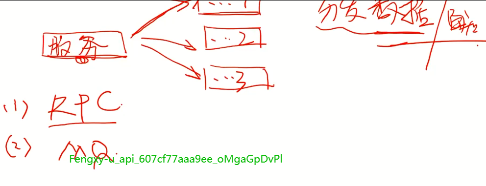

1. **RPC调用，太重，需要考虑失败等各种情况，重发等**
2. **MQ通知，**
3. **http，**
4. **ZK**
5. **配置中心**

注册中心从存储+订阅的功能来看，和配置中心相似，只是他的数据是应用的ip和端口号等数据，服务提供者将数据推到注册中心，服务消费端从注册中心订阅关于应用的配置。 为什么不用配置中心做注册中心，是因为配置中心只关注配置的生命周期，并不关注应用的生命周期。所以注册中心在提供应用的配置管理之外，还要对应用的生命周期进行管理，包括服务的健康检查等等的东西


## 配置的几种做法

1.  放在代码中，或敞亮文件中，需要重新编译
2. 如果放在conf/*
3. 放在DB中
4. 配置中心。

## 本地配置的问题

1. 需要重启
2. 生效慢（不能实时生效）
3. 难以维护

## 配种中心的优点

1. 集中管控
2. 热发布
3. 批量操作
4. 效率提升
5. 维护成功降低
6. 安全性保障

## 好的配置中心产品所具有的功能

1. 配置项管理：

   编辑、

   版本管理、

   热发布、

   灰度发布、

   环境隔离、

   提供api接口

2. 权限管理

   读权限，比如风控的一些配置项，都是需要保密的，

   写权限

3. 审计

   记录用户的操作行为。

## 配置中心是什么？

------

仅从实现角度，配置中心其实就是存储+订阅


## 主流配置中心选型对比

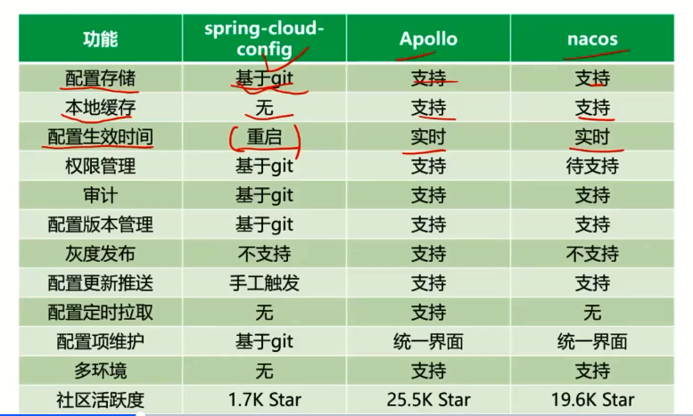


spring cloud config基于git。

spring cloud config无本地缓存，一旦发生网络分区，就会出现问题

spring cloud config需要进行重启


nacos不支持权限管理，不支持灰度发布。


## apollo配置中心剖析

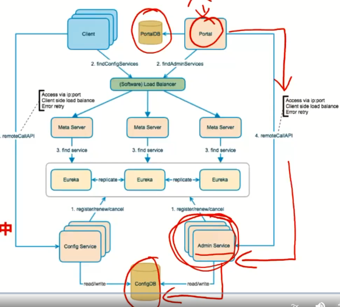


1. configService和adminService首先把自身注册到注册中心（由MetaService和Eureka组成），
2. portal会从注册中心查找AdminServer，apollo client（嵌入在需要获取配置的应用中）从注册中心查找configServer
3. 负载均衡器将查找服务请求达到Eureka进行服务查找
4. 查找到服务后portal调用adminService进行配置推送，client从configService拉取配置

目前内部的注册中心和ConfigService是打包在一起进行部署的，（简化了部署），在部署注册中心的时候就已经把configService也部署了。

问题：1. adminServer如何将数据推给configService。  2. client是调用configService，如何能将配置及时推给

解答：1. configServer不断扫描配置表（定时扫描）  2. client端长轮训configService，获取配置


### Apollo重要特性

#### 多环境支持

开发环境、测试环境、沙箱环境（很生产一样，但用户是我们自己的用户）、生产环境

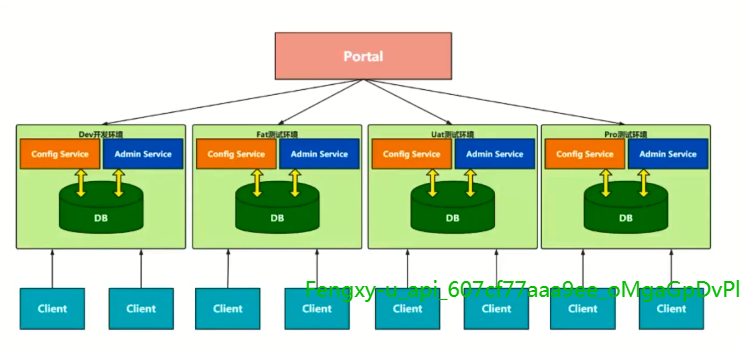


环境之间要做到隔离。

apollo对环境分别部署，物理上就已经进行了隔离。portal只需要ok


#### A把数据x推给B，几种方式

1. push：及时，但是重量，需要找到对方，并且处理失败和重试逻辑，A发起，A负责
2. 通知+拉取：及时，相对轻量， A把事件通知B，A长连接给B，或B用长轮训。 A提供接口
3. Long pull： 及时性基本可行。更轻量
4. 定时pull： 不及时，最轻量，

其实也就是1,3.，4,2只是业务上的实现。

（长轮训：用轻量级的方式模拟出长连接的效果）


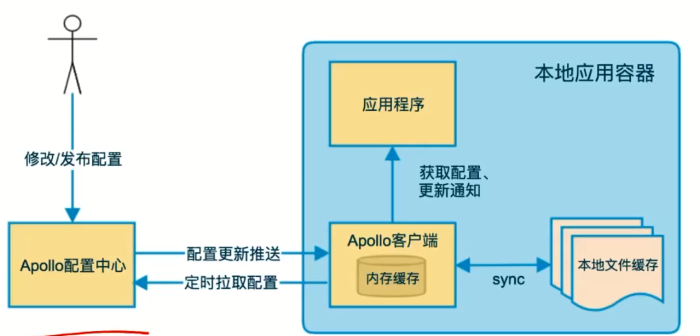


配置更新推送：客户端长轮训实现。---》  **实时性**

新的更新一定要落地到本地文件缓存。---》 **可用性**


#### 客户端长轮训逻辑：


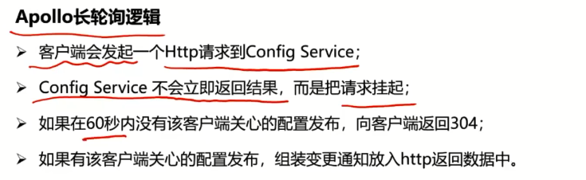

#### 客户端配置信息获取

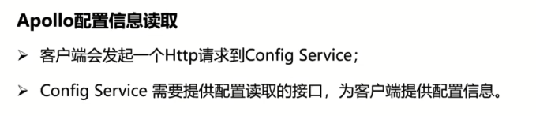


## apollo关键代码解读

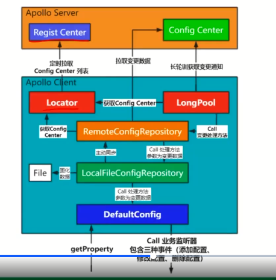


1. 按需拉取：getProperty
2. 定时长轮训获取配置，并通知应用（call业务监听器）


其中：

Locator服务拉取ConfigService服务列表供拉圈变更数据使用，

LongPool为长轮训，定时长轮训获取通知，有通知了就调用configService主动去拉取配置

LocalFileConfigRepository为文件固化。

RemoteConfigRepository好LongPool都要去获取configServer，

LongPool长轮训获取到通知变更后，会call RemoteConfigRepository，他会主动去configServer拉取变更数据；RemoteConfigRepository拉取到更新数据后会call  LocalFilleConfigRepository， LocalFileConfigRepository固化后会调用DefaultConfig继续往前通知，最后会通知业务监听器，这样热发布就到此结束了。

### DefaultConfig

这个是需要获取配置的应用首先要调用的接口，也就是DefaultConfig是应用获取配置的入口，提供两种方式的配置获取：

1. 拉取配置，应用直接获取配置，使用getProperty(key, defaultValue)接口，这个接口获取配置的顺序：

   1.1 系统属性

   1.2 从本地缓存

   1.3 从环境变量

   1.4 从本地properties文件

2. onRepositoryChange(namespace, properties)这个接口

   由上游配置仓库（LocalFileConfigRepository）获取到最新配置后主动通知，这里要注意，DefaultConfig通知下游是细粒度的，具体到要把变更的key，变更的类别（ADD，DELETE，UPDATE）通知到应用，那怎么知道哪些是增加，哪些是删除，哪些是更新呢？这里用了一个算法，具体代码如下（加了我的一些注释）

   ```java
   // 这个是已存在的配置的key值集合
   Set<String> previousKeys = previous.stringPropertyNames();
   // 这个是新变更的配置的key值结合
       Set<String> currentKeys = current.stringPropertyNames();
   
   // 取连个set的交集
       Set<String> commonKeys = Sets.intersection(previousKeys, currentKeys);
   // 交集和新变更集合的不同，为新增的key值
       Set<String> newKeys = Sets.difference(currentKeys, commonKeys);
   // 交集和旧集合的不同，为删除的key值
       Set<String> removedKeys = Sets.difference(previousKeys, commonKeys);
   
       List<ConfigChange> changes = Lists.newArrayList();
   
   // 以下为标记不同的变更类型
       for (String newKey : newKeys) {
         changes.add(new ConfigChange(namespace, newKey, null, current.getProperty(newKey),
             PropertyChangeType.ADDED));
       }
   
       for (String removedKey : removedKeys) {
         changes.add(new ConfigChange(namespace, removedKey, previous.getProperty(removedKey), null,
             PropertyChangeType.DELETED));
       }
   
       for (String commonKey : commonKeys) {
         String previousValue = previous.getProperty(commonKey);
         String currentValue = current.getProperty(commonKey);
         if (Objects.equal(previousValue, currentValue)) {
           continue;
         }
         changes.add(new ConfigChange(namespace, commonKey, previousValue, currentValue,
             PropertyChangeType.MODIFIED));
       }
   ```

   

3. DefaultConfig构造函数会将其上游的配置初始化到本地缓存中，所有一般情况下如果能从本地缓存中拿到配置，getProperty方式就直接返回给应用了。

#### 整体流程

应用从DefaultConfig**直接**获取配置的流程如下（太长，只能横着放：(。包括缓存的生成，形成一个闭环）：


### LocalFilleConfigRepository

这个是DefaultConfig的上游配置仓库，在获取到新配置的时候会将配置固化到文件中。当ConfigCenter不可用的时候就可以从这个固化文件中获取配置。

1. 拉取配置，下游拉取配置，要通过getConfig接口拉取配置，如果本地不存在，会从上游同步配置，然后将同步回来的配置放入缓存，同时固化到本地文件中。

2. 同DefaultConfig的onRepositoryChange方法，会通知下游，下游是谁？就是前面的DefaultConfig，通知流程如下：

   

   这里固化到文件时LocalFileConfigRepository特别的地方，通知下游，这个下游就是DefaultConfig

3. LocalFileConfigRepository初始化会同步配置。如果同步不成功，则从固化文件中获取配置并放入缓存。

#### 整理流程

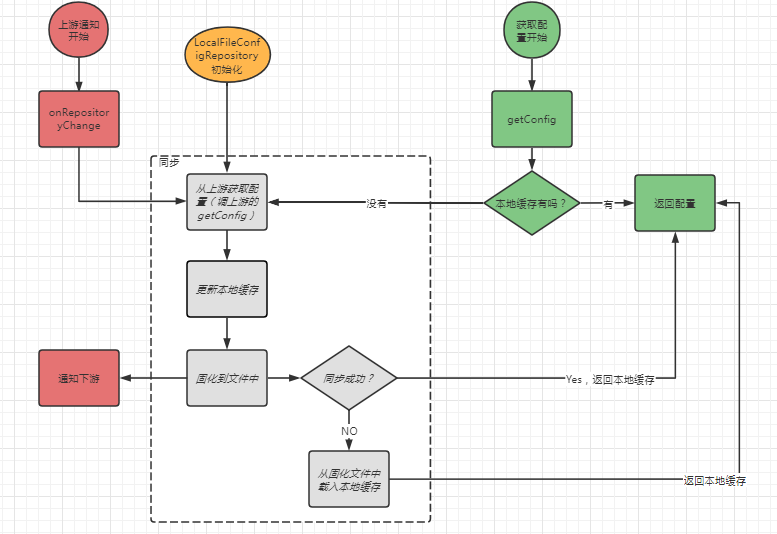

可以看到初始化的时候会走一遍同步流程，下游获取配置时当缓存不存在时也要做一下同步，最终返回本地缓存的配置。比较标准的流程。

### RemoteConfigRepository

这个配置仓库从configServer获取配置，同时会开启两个定时任务，一个是长轮询，一个是定时拉取。

1. 拉取配置，getConfig，如果本地缓存中没有，那么就从configServer短轮询获取配置，并更新本地缓存，同时通知下游有配置变更。
2. 开启定时短轮询获取配置，如果获取到就更新本地缓存，同时通知下游配置变更
3. 开启长轮训获取配置，结果200，说明有配置变更，通知RemoteConfigRepository做两件事，1去拉取一下配置，2去通知下游有新的配置。如果304，则继续下一轮长轮训

#### 整体流程

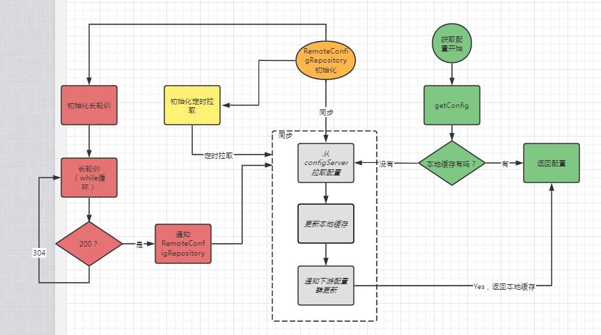


## 注册中心和配置中心的区别

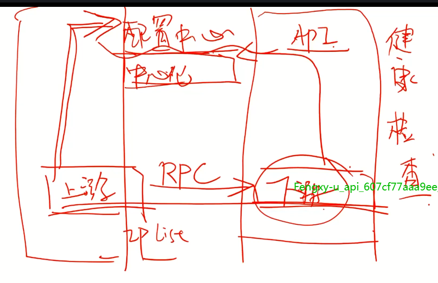

如果用配置中心作为注册中心，服务发现和变更通知是可以的，服务发现用长轮询、变更通知中配置中心也是有的。服务注册也可以，直接通过api把信息推给配置中心。但是。。配置中心缺少健康检查。配置中心不关系客户端的状态。


