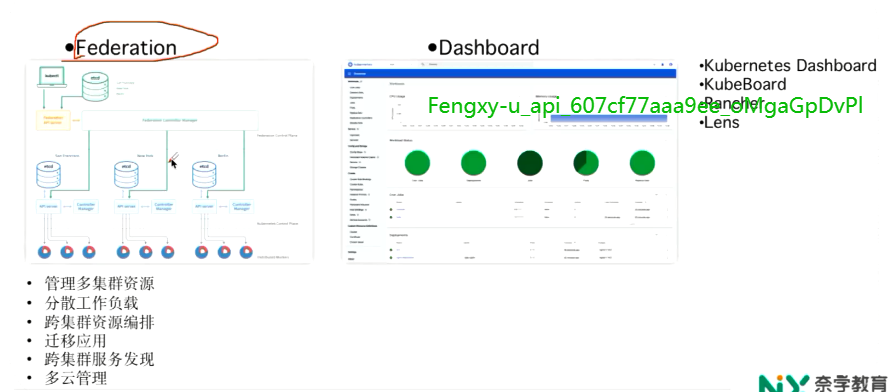
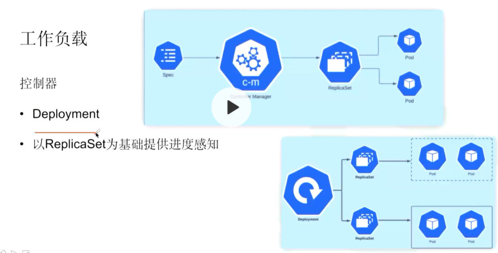

# 云原生背景知识

## 历史背景-kubernetes产生背景

### 容器化之路

#### 常用的容器化技术

##### chroot

最早不是为了虚拟化而开发出来的，歪打正着被虚拟化所用。

1. 可以改变正在运行的进程和子进程的根目录

2. 通过修改PCB来实现限制的

   PCB是进程三大件之一

3. 经chroot限制的进程不能够看到这个指定根目录之外的文件，也不能访问和读取，也不能写。

   比如上图中JAIL这个进程，只能看到自己的目录，看不到bob，alice等目录，限制住了。

4. 只能隔离文件系统

5. 无法限制CPU、内存、网络端口、命名空间等其他资源

chroot风行了一段时间，但是因为有限制（只能隔离文件系统等），所有大家就对chroot做了修改，进行了改进。然后就有了第二种虚拟化工具Jails：

##### Jails

1. 基于FreeeBSD机器，

2. 基于chroot的操作系统层虚拟化技术

3. 只是在chroot上做了一些扩展，并没有特别的改动和颠覆性的概念

4. 只能访问某个部分的文件系统，但是，jail机制限制了在软件监狱里的运行的行程，不能够影响操作系统的其他部分。

   看图，在沙盒里面不能访问沙盒之外的进程，也不能使用系统调用，如果要系统调用，只能通过jails的api来调用

5. 使用复杂，隔离级别较弱。

实际上他们这批人都是牛人，使用汇编等。太复杂

然后出现了第三代，大概在2000年左右：

##### vserver / openVZ

1. 使用的是操作系统级别的技术，而不是在用户态上面做的隔离
2. 隔离性较弱，有CPU超卖，内存共享问题

##### LXC

LXC是第一个最完整的linux虚拟化技术。08.09年左右国内已经有一些厂商在做虚拟化了，他们的LXC都是基于他们自己的场景来做的。

1. 通过cgroups和namespace来进行隔离的。

2. 是一种轻量级的虚拟化方法，区别于vmware等的物理隔离

   怎么在一个操作系统上模拟不同的操作系统？比如我们起了一个容器，宿主机是一个centos，但是我这个容器是ubuntu，debian。

   我们知道常用的发行版的操作系统一般由上图黄色的内核和绿色的工具包组成。也就是发行版=linux内核+工具包，比如ubuntu可能每半年就发行一个版本，但是内核2年可能才一个版本，所以几个连续版本的内核可能都是一样，变来变去的就是工具包。我们去容器化，去虚拟机里面创建操作系统的时候，其实容器里面的内核和当前宿主机的内核是完全同一套，变的只是工具包，就像上图的下面的部分，黄色是一样，变化的就是绿色的部分。

3. 那么弊端是啥，就是所有的容器都是使用相同的内核。如果某个内核有致命的bug，那么在所有虚拟机上都有问题。

4. 只能在linux操作系统中运行

5. LXC不安全，取决于宿主机

##### cgroup和namespace

###### cgroup

上图第二点的子系统是啥，它是cgroup里面要给非常有特色的东西，cgroup的api是一个伪文件系统，vitualFS，是一个虚拟的文件系统，用户是通过对虚拟文件系统的文件进行io操作来间接管理cgroup的，比如CPU，cpu是一个目录（子节点），cpu下面有子目录，目录里面有个文件，叫cpu，vi打开这个文件，写上值，cgroup就实时的生效了。这个文件结构就是一个虚拟的文件系统，真正是存在内存里面的。文件有值就控制，没有这个值就不控制，这个值不是在磁盘上的，而是在内存里的。只是为了用户方便，挂载出来了这么一个虚拟的文件系统。每个目录（cpuset，memoryset等等）就称为不同的子系统。子系统随着cgroup版本的不同而不同，比如v2就多一些，v2和v1的区别就在于能不能控制到内核态。

###### namespace

资源隔离，每个容器只能看到封装的资源，是看不到其他的虚拟机的namespace资源的，常用的namespace有IPC，Network，Mount，PID等。

### 集群管理工具

如果一台机器只放一个虚拟机就没有意义了，因此一般都是一台服务器会运行多个容器，那么这些容器如何管理，就要使用专门的集群管理工具。

如上，是在不同的历史时期所产生的工具。

#### Swarm

Swarm是docker原生支持的工具，是同一家公司出品的，

Swarm就是里面的章鱼，swarm替我们做了一些事，比如我们原来直接请求docker daemon，现在是让swarm来替我们做这件事，由swarm和docker daemon来管理docker容器。相当于是对docker的二次封装。

后来有了docker compose，swarm用的就更好了。compose也只能服务于本地，线上和测试环境也很少用compose去做

swarm缺点：严重依赖docker，因为是对docker的二次封装；没有解决网络问题和存储问题，没有企业级的解决方案

#### Fleet

Swarm之后是Fleet，CoreOS出的，但是后来被redhat收购，因此就消失在red hat众多产品的大海之中了。

每台机器都由fleet，采集docker容器的数据，放到etcd中。

#### k8s

服务编排，主要是user pod，到底要放到哪台机器运行，scheduler负责进行计算和编排。

流量编排，也就是k8s的网络模型，每个用户的使用场景不一样。因此k8s现在也没办法有解决方案，但是提供了CNI的概念。实际上是交给了用户。

存储编排

k8s服务编排做的最成功，存储编排次之，流量编排主要是商用的或第三方开源的。

后面课程都是围绕这三个编排来讲解的。

## 泛泛而谈，kubernetes架构及实现思路

### 组件

#### etcd

etcd2性能不太好，etcd2是kubernetes里面的性能瓶颈，pod数量等都有限制，否则太多的查询etcd是抗不住查询的。

后来有了3版本，性能要好很多，kubernetes的上限就比较大了

etcd的高可用做的还是不错的，恢复时间也是比较短的。

#### kube-apiserver

#### kube-controller-manage

一个是controller机制，一个是list&controller机制

controller-manage是控制下面的各个controller的，扩展性，如果需要不同的controller，添加就可以了‘

作用主要就是：确保集群中各种资源的实际状态和用户期望状态一致。

通过不停的轮询各种资源的实际状态，然后再和我们的用户状态比较，如果一致什么都不做，如果不一致就会做调整

#### kube-schedule

资源调度用的。

也就是说服务编排就是靠scheduler来算的。哪个pod要落在哪个机器上，就是由scheduler来操作的。

服务编排：在一个合适的时间，一个合适的地方，运行一个用户所期望的状态。合适的时间是由controller来计算的。合适的地点就是schedule来计算。它会计算当前集群里所有的资源，

合适的时候由controller来，合适的地方，由schedule计算，比如cpu够不够，内存够不够，哪台机器比较空闲等。然后根据当前pod所需要的资源进行匹配，然后找到合适的node来

#### kubelet

是运行在每个节点的agent。

控制Pod的生命周期，比如pod处于一个不是running的状态，那我就把它变成running的状态。kubelet只管理它所在的节点的pod

#### CRI

容器运行时，可是是docker和符合一定规范的任何其他容器。

kube从1.5就把docker抽出来了，抽象出CRI接口，只要实现了CRI接口的虚拟化都可以。1.5之后就出现了好几种容器。，后面的kube又把CNI等抽象出来了。

#### kube-proxy

也是运行在节点上的一个proxy，不止是本节点，也可以跨节点。

这个规则，在每一个pod里面都是全量，第一代是用用户态处理的。后面用了Iptables，使用的比较多。 从18年以后使用k8s的可能会用IPVS，不管是什么，新的方案都是更加的尝试优化这种规则的数量，当规则非常多的，比如上千个等等，就会有一些问题。ipvs可以对数量比较多的访问规则进行优化。

### 非核心组件

并不代表不重要，不是那么重要，拿掉这些暂时不会影响使用

南北流量靠Ingress Controller，东西流程（集群内部流量）是靠前面kube-proxy的service

Federation使用量不是很高。

### 设计理念

### 设计思路

一开始各个组件轮询API Server，轮询产生非常大的压力，后来变成了监听，api server有消息就推送给各个组件。客户端监听就好了

### 本节回顾

## kubernetes技术栈

### 应用定于及部署

### 编排和管理

CoreDNS为DNS组件，是Kube DNS的一种实现。 pod里面的节点先向local DNS 查，如果没有才向kube DNS查。 多了一个localDNS缓存（解决性能问题）后，每次更改Kube DNS又有问题了，带来数据缓存问题

CoreDNS插件比较多，比以前的性能稍差一些？

gRPC是kubernetes内部系统之间的通信框架

openResty是对Iginx的二次封装，Ingress组件，目前是主流，7层的反向代理。	

Istio主要是东西流量（内部流量）

API网关和南北流量还是有点区别的。

南北流量是7层的反向代理，一般的openResty还是更适合南北流量

### 运行环境

云原生存储，建议使用ceph，CSI的一种，问题是最少的，最稳定。

云原生网络，建议flannel和Calico，这个仅仅是说你有自己的IDC，如果是使用云厂商的，那只能用云厂商的网络。

### 容器注册

容器注册基本上就上面2个方案，当然云厂商可能也有自己的

密钥管理和参数管理，也是一种资源

### 可观测性和分析

Grafana + Prometheus 老牌的方案。 

监控 基本上 也就这几个

老的可能有zabbix

日志就ELK，里面可以用beats

# 云原生架构体系-Kubernetes组件

## Kubernetes基础概念

### 物理组件

kubenetes一般用控制面和数据面来收master和slave节点，控制面：control plane， 数据面：compute machines

#### Master（控制面）

##### Kube-apiserver

1. 提供了一个restful api接口，整个集群控制的一个入口i进程，所有的kubenates的api都是由kube-apiserver对外提供的，
2. 所有的资源也都是由apiserver进行管理的。
3. 所有对etcd的操作都是通过apiserver的。

早期，因为都走apiserver，性能就是一个问题，又有单点隐患。后来做了改进，优化，比如list-watch机制等

##### control-manage

资源控制中心

比如service，pod等等都是资源，所以都有对应的controller，所有的control都汇聚到了control-manage，由它来维护。

主要负责集群里面像node，pod副本集，service，namespace这些，都i是由control-manage来控制。不是直接控制，而是通过这些control来控制。

除了上面5个，还是工作负载的controller

##### kube-schedule

1. pod调度服务

   也就是3个ngx容器，4台机器，这些容器到底跑在哪些机器上，是由schedule进行调度的。

   实际上是通过apiserver完成的，因为所有的请求都是先到apiserver，由apiserver转发给schedule，然后schedule就来查这三个pod有没有分配，怎么分配。它由自己的算法。这个算法可以到官网去查一下。	也可以自己定制。如果不定制，schedule主要从NodeSelector，nodeAffinity，podAffinity三个维度进行计算

##### etcd

所有的master节点的数据等都是保存在etcd的。

##### DNS

负责服务发现的。

现在基本上用coreDNS，coredns为k8s做了很多深度定制，用起来比较舒服。但是因为coreDNS承载了所有的域名解析，所以性能也会有问题，后来在pod里面又加了localDNS（也是coredns实现的，），纯粹是一层缓存。

#### Slave（数据面）

##### Node节点

当Node节点加入到集群里面之后，就会有下面这些组件：

pod，只是一个资源的集合体，没有物理对应。之所以重要，因为它是k8s的基本调度单位，一个pod里面，ip资源，volume，共享。pod里的资源是完全一直的，相互可见的。就可以通过环回地址进行通信。pod可以理解为一组紧密关联的进程组

静态文件和动态资源是针对pod里面的容器来说的。

静态文件就是rootfs里面所创建的镜像。

动态资源就是创建容器所需要的namespace和cgroup，容器的运行时

探针，就绪探针和存活探针。就绪探针是为了外部流量进入pod时候判断用，如果contain还没就会，就绪探针就会返回F。外部流量不可进去。

存活探针，也就是可用性探针，就是要不要重启pod。如果存活探针返回失败，k8s就认为pod不在了，就会重启。如果返回true，就不动了。

##### kubelet

负责控制面和数据面交互的一个进程。控制面驻节点办公室，通过容器是看不到的（不是一个容器），主要负责每个pod里面的容器创建、销毁等，代替控制面来管理当前的节点，kubelet通过list-watch机制和apiserver进行交互。主要任务：

1. 创建pod
2. 做容器的健康检查，就是通过前面说的探针，kubelet定时的给容器发送请求给container，容器回复活还是死
3. 容器监控，kubelet负责采集并上报，可以兼容当前节点里面所有容器的资源使用情况。

##### kube-proxy

也是控制面驻节点办公室，权力闭kubelet小。是运行在每个节点上的网络代理，主要负责kubenetes service的通信和负载均衡。kube-proxy路由有三个规则。

### 逻辑组件

#### namespace

1. 逻辑上的一个概念， 资源和对象的抽象集合。
2. 划分不同工作空间的逻辑单位
3. 隔离项目
4. 隔离环境
5. 隔离用户（RBAC）。

#### Label/Selector

Label加上之后，是为了selector进行筛选的。

label/selector是k8s里面进行资源筛选的唯一组件。

#### annotation

annotation想写什么就写什么，没有一定的规范。一般提供给第三方工具使用。

注解是给人看的。label是给k8s看的

#### configMap/secret

向容器中注入配置信息的。

configMap，保存单个属性，也可以保存文件。主要是为了镜像和配置文件进行解耦。因为镜像运行的时候会需要很多的配置信息。流程是pod被创建的时候，会把相应的配置文件也注入到容器中去。

这里就有问题，配置是在etcd中，但是etcd不是强一致性，而是最终一致性。因此pod请求的时候拿到的数据不一定是最新的数据，比如创建的时候configMap是一个值，然后这个值被改了，后面实际要用的时候值可能还是旧值。

secret用来保存敏感信息，比如密码，也是存到configMap中，使用也一样。

#### volume

卷组，解决持久性和共享

持久性，就是k8s销毁容器的时候是直接kill的，没有东西会保留下来，如果希望可以保留下来，可以挂载在一个volume下，这样容器重启的时候就不会销毁了。

共享，比如两个container可以通过共享来进行通信

#### PV/PVC【没听懂】

volume申明的时候是在pod里面的，k8s为了实现存储和计算分离而抽象出来的编排机制。k8s存储和计算是分开编排的

### 网络组件

#### cluster IP

clusterIP相当于一个虚拟ip，客户端只要访问这个虚ip就行了。

### 工作负载

#### 控制器

##### RS（ReplicaSet）

主要功能：维护pod数量（pod必须无状态），pod里面要升级，也是靠rs升级（滚动升级）

##### Deployment

一般都是Deployment管理RS，RS管理pod，  实际上depolyment+rs替代了RC（ReplicaController）

##### DaemonSet

##### statefulSet

有状态的一直比较难设计，也是k8s比较难解决的，statefulset主要缓解了这一状况，pod上有序列号

##### job/cronjob

##### service

这里的service不是微服务里面的service，但是，但是，它在概念上更接近与微服务里面的服务。deployment里面都是容器，但是外部是不能访问的，就由service暴露出来。

这里service就和clouster ip关联起来了。注意这里几个ip的区别。

## kubernetes核心组件

### ETCD

分V1，v2，v3，v1性能差，v2可以

高可用/一致性/watch机制/复杂性低

