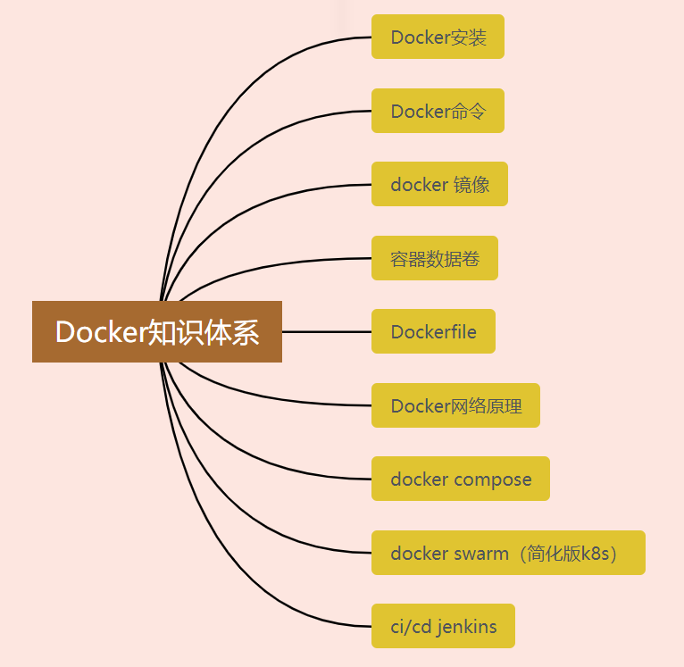

# 知识体系



# 内容

## Dockerfile

## docker镜像

### Dockerfile实际的应用

#### JAVA镜像

以下是java应用的docker镜像制作过程。

1. 基础镜像，基础镜像一般都是基于操作系统构架一个基础镜像。下面是典型的一个构建过程（Dockerfile内容）

   ```
   FROM centos:7
   #作者
   MAINTAINER shiwei
   
   #ADD 把java添加到容器中指定位置，
   #语法：ADD <src>... <dest>
   # ADD有一个特别的能力，有能力自动解压文件。如果<src>参数是一个可识别的压缩格式（tar, gzip, bzip2, etc）的本地文件（所以实现不了同时下载并解压），就会被解压到指定容器文件系统的路径<dest>
   #ADD指令可以让你使用URL作为<src>参数。当遇到URL时候，可以通过URL下载文件并且复制到<dest>
   #注意：URL下载和解压特性不能一起使用
   ADD jdk-8u331-linux-aarch64.tar.gz /usr/docker/java
   
   #这里要说明，有的操作系统镜像不包含语言包，如果这样，并且应用为中文应用，那么就要在Dockerfile中安装中文包。
   RUN yum install -y kde-l10n-Chinese
   RUN yum -y reinstall glibc-common
   RUN localedef -c -f UTF-8 -i zh_CN zh_CN.utf8
   RUN echo 'LANG="zh_CN.UTF-8"' > /etc/locale.conf
   RUN cp /usr/share/zoneinfo/Asia/Shanghai /etc/localtime
   
   RUN echo "export LC_ALL=zh_CN.UTF-8" >> /etc/profile
   
   #JAVA的环境配置
   ENV JAVA_HOME /usr/docker/java/jdk1.8.0_331
   ENV JRE_HOME $JAVA_HOME/jre
   ENV CLASSPATH=:$JAVA_HOME/lib/dt.jar:$JAVA_HOME/lib/tools.jar:$JRE_HOME/lib
   ENV PATH=$PATH:$JAVA_HOME/bin:$JRE_HOME/bin
   ```

   当然，也可以基于其他的操作系统，目的就是构建一个基础的java运行环境。

2. 基于基础镜像，运行的时候构建包含应用的镜像（也就是可以运行的容器应用）。比如如下就是结合docker-compose.yml和Dockerfile发布java应用。

   Dockerfile

   ```dockerfile
   #这个就是前面制作的基础镜像包
   FROM  centoszh:jre8
   MAINTAINER lqzhang
   
   # 挂载目录
   VOLUME /home/intple
   # 创建目录
   RUN mkdir -p /home/intple
   # 指定路径
   WORKDIR /home/intple
   
   EXPOSE 10086
   
   ENV TZ=Asia/Shanghai
   ```

   你可能疑惑这个没有ENTRYPOINT，容器怎么启动？别急，这个在docker-compose.yml文件中。

   docker-compose.yml

   ```yaml
   version: '3.7'
   services:
     intple-cloud-gateway:
       build:
         # Dokcerfile文件所在的位置
         context: gateway
         dockerfile: Dockerfile
       ports:
         - ${intple_cloud_gateway_port:-38282}:8282
       restart: always
       volumes:
         - /etc/localtime:/etc/localtime
         - ./gateway/target/intple-cloud-gateway.jar:/home/intple/intple-cloud-gateway.jar
       environment:
         - JAVA_OPTS=-Xmx1024M -Xms256M
       networks:
         dfone_net:
           ipv4_address: ${intple_cloud_gateway_default:-124.81.64.31}
       extra_hosts:
         - intple-cloud-db:${db_address:-124.81.62.1}
       command: ["java", "-Xmx1024M","-Xms256M","-jar", "intple-cloud-gateway.jar"]
     intple-cloud-file:
       build:
         # Dokcerfile文件所在的位置
         context: file
         dockerfile: Dockerfile
       volumes:
         - /etc/localtime:/etc/localtime
         - ./file/target/intple-cloud-file.jar:/home/intple/intple-cloud-file.jar
         - ./file/uploadPath:/home/intple/uploadPath
       environment:
         - JAVA_OPTS=-Xmx1024M -Xms256M
       ports:
         - 9305:9300
       env_file:
         - .env
       restart: always
       networks:
         dfone_net:
           ipv4_address: ${intple_cloud_file_default:-124.81.64.36}
       extra_hosts:
         - intple-cloud-db:${db_address:-124.81.62.1}
       command: ["java", "-Xmx1024M","-Xms256M","-jar", "intple-cloud-file.jar"]
     intple-cloud-nginx:
       #build:
         #context: nginx
       image: nginx:latest
       ports:
         - "30080:80"
       restart: always
       networks:
         dfone_net:
           ipv4_address: ${intple_cloud_nginx_default:-124.81.64.10}
       volumes:
         - ./nginx/projects:/home/intple/projects
         - ./nginx/conf/nginx.conf:/etc/nginx/nginx.conf
         - ./nginx/logs:/var/log/nginx
         - ./nginx/conf.d:/etc/nginx/conf.d
       depends_on:
         - intple-cloud-gateway
       links:
         - intple-cloud-gateway
     intple-cloud-auth:
       build:
         # Dokcerfile文件所在的位置
         context: auth
         dockerfile: Dockerfile
       restart: always
       environment:
         - JAVA_OPTS=-Xmx1024M -Xms256M
       volumes:
         - /etc/localtime:/etc/localtime
         - ./auth/target/intple-cloud-auth.jar:/home/intple/intple-cloud-auth.jar
       networks:
         dfone_net:
           ipv4_address: ${intple_cloud_auth_default:-124.81.64.32}
       extra_hosts:
         - intple-cloud-db:${db_address:-124.81.62.1}
       command: ["java", "-Xmx1024M","-Xms256M","-jar", "intple-cloud-auth.jar"]
     intple-cloud-system:
       build:
         # Dokcerfile文件所在的位置
         context: system
         dockerfile: Dockerfile
       restart: always
       environment:
         - JAVA_OPTS=-Xmx1024M -Xms256M
       volumes:
         - /etc/localtime:/etc/localtime
         - ./system/target/intple-cloud-system.jar:/home/intple/intple-cloud-system.jar
       networks:
         dfone_net:
           ipv4_address: ${intple_cloud_system_default:-124.81.64.34}
       extra_hosts:
         - intple-cloud-db:${db_address:-124.81.62.1}
       command: ["java", "-Xmx1024M","-Xms256M","-jar", "intple-cloud-system.jar"]
     intple-cloud-job:
       build:
         # Dokcerfile文件所在的位置
         context: job
         dockerfile: Dockerfile
       restart: always
       environment:
         - JAVA_OPTS=-Xmx1024M -Xms256M
       volumes:
         - /etc/localtime:/etc/localtime
         - ./job/target/intple-cloud-job.jar:/home/intple/intple-cloud-job.jar
       networks:
         dfone_net:
           ipv4_address: ${intple_cloud_job_default:-124.81.64.35}
       extra_hosts:
         - intple-cloud-db:${db_address:-124.81.62.1}
       command: ["java", "-Xmx1024M","-Xms256M","-jar", "intple-cloud-job.jar"]
     intple-cloud-codegen:
       build:
         # Dokcerfile文件所在的位置
         context: codegen
         dockerfile: Dockerfile
       restart: always
       environment:
         - JAVA_OPTS=-Xmx1024M -Xms256M
       volumes:
         - /etc/localtime:/etc/localtime
         - ./codegen/target/intple-cloud-codegen.jar:/home/intple/intple-cloud-codegen.jar
       networks:
         dfone_net:
           ipv4_address: ${intple_cloud_codegen_default:-124.81.64.37}
       extra_hosts:
         - intple-cloud-db:${db_address:-124.81.62.1}
       command: ["java", "-Xmx1024M","-Xms256M","-jar", "intple-cloud-codegen.jar"]
     intple-cloud-backend:
       build:
         # Dokcerfile文件所在的位置
         context: backend
         dockerfile: Dockerfile
       restart: always
       environment:
         - JAVA_OPTS=-Xmx2048M -Xms1024M
       networks:
         dfone_net:
           ipv4_address: ${intple_cloud_backend_default:-124.81.64.38}
       volumes:
         - /etc/localtime:/etc/localtime
         - ./backend/target/intple-cloud-backend.jar:/home/intple/intple-cloud-backend.jar
         #- ./backend/target/idsone.lic:/home/intple/idsone.lic
       extra_hosts:
         - intple-cloud-db:${db_address:-124.81.64.1}
       command: ["java", "-Xmx2048M","-Xms1024M","-jar", "intple-cloud-backend.jar"]
     # intple-cloud-dataaccess:
     #   build:
     #     # Dokcerfile文件所在的位置
     #     context: dataaccess
     #     dockerfile: Dockerfile
     #   restart: always
     #   environment:
     #     - JAVA_OPTS=-Xmx2048M -Xms1024M
     #   networks:
     #     dfone_net:
     #       ipv4_address: ${intple_cloud_dataaccess_default:-124.81.64.39}
     #   volumes:
     #     - /etc/localtime:/etc/localtime
     #     - ./dataaccess/target/intple-cloud-dataaccess.jar:/home/intple/intple-cloud-dataaccess.jar
     #     #- ./dataaccess/target/idsone.lic:/home/intple/idsone.lic
     #   extra_hosts:
     #     - intple-cloud-db:${db_address:-124.81.64.1}
     #   command: ["java", "-Xmx2048M","-Xms1024M","-jar", "intple-cloud-dataaccess.jar"]
     intple-cloud-dataservice1:
       build:
         # Dokcerfile文件所在的位置
         context: dataservice
         dockerfile: Dockerfile
       restart: always
       environment:
         - JAVA_OPTS=-Xmx2048M -Xms1024M
       networks:
         dfone_net:
           ipv4_address: ${intple_cloud_dataservice_1:-124.81.64.40}
       volumes:
         - /etc/localtime:/etc/localtime
         - ./dataservice/target/intple-cloud-dataservice.jar:/home/intple/intple-cloud-dataservice.jar
         - ./dataservice/target/dfone.lic:/home/intple/dfone.lic
       extra_hosts:
         - intple-cloud-db:${db_address:-124.81.64.1}
       command: ["java", "-Xmx2048M","-Xms1024M","-jar", "intple-cloud-dataservice.jar"]
     intple-cloud-dataservice2:
       build:
         # Dokcerfile文件所在的位置
         context: dataservice
         dockerfile: Dockerfile
       restart: always
       environment:
         - JAVA_OPTS=-Xmx2048M -Xms1024M
       networks:
         dfone_net:
           ipv4_address: ${intple_cloud_dataservice_2:-124.81.64.41}
       volumes:
         - /etc/localtime:/etc/localtime
         - ./dataservice/target/intple-cloud-dataservice.jar:/home/intple/intple-cloud-dataservice.jar
         - ./dataservice/target/dfone.lic:/home/intple/dfone.lic
       extra_hosts:
         - intple-cloud-db:${db_address:-124.81.64.1}
       command: ["java", "-Xmx2048M","-Xms1024M","-jar", "intple-cloud-dataservice.jar"]
     intple-cloud-dataservice3:
       build:
         # Dokcerfile文件所在的位置
         context: dataservice
         dockerfile: Dockerfile
       restart: always
       environment:
         - JAVA_OPTS=-Xmx2048M -Xms1024M
       networks:
         dfone_net:
           ipv4_address: ${intple_cloud_dataservice_3:-124.81.64.42}
       volumes:
         - /etc/localtime:/etc/localtime
         - ./dataservice/target/intple-cloud-dataservice.jar:/home/intple/intple-cloud-dataservice.jar
         - ./dataservice/target/dfone.lic:/home/intple/dfone.lic
       extra_hosts:
         - intple-cloud-db:${db_address:-124.81.64.1}
       command: ["java", "-Xmx2048M","-Xms1024M","-jar", "intple-cloud-dataservice.jar"]
   networks:
     dfone_net:
       external: true
   
   ```

   上面的dockerfile：Dockerfile就是会找运行docker compose命令的当前目录中的Dockerfile

#### Python镜像

1. 基础镜像

   Dockerfile

   ```dockerfile
   FROM ubuntu:20.04
   ARG DEBIAN_FRONTEND=noninteractive
   WORKDIR /opt/running
   RUN sed -i 's@//.*archive.ubuntu.com@//mirrors.aliyun.com@g' /etc/apt/sources.list
   RUN echo "APT::Install-Recommends \"false\";" > /etc/apt/apt.conf
   RUN echo "APT::Install-Suggests \"false\";">>/etc/apt/apt.conf 
   RUN apt-get update
   RUN apt install -y vim apt-transport-https ca-certificates curl software-properties-common build-essential libpq-dev libjpeg-dev python3-pip python3-dev
   ADD requirements.txt /opt/running/
   RUN pip install -r requirements.txt -i https://pypi.tuna.tsinghua.edu.cn/simple
   CMD ["bash"]
   ```

2. 可运行镜像

   Dockerfile

   ```dockerfile
   #这个是上面的基础镜像
   FROM yq-data-app:base
   #应用启动命令
   ADD start.sh /
   #应用包
   ADD  dist.tar.gz /opt/running
   
   WORKDIR /opt/running/
   #启动应用
   ENTRYPOINT ["/bin/sh", "/start.sh"]
   ```

   start.sh

   ```shell
   #! /bin/sh
   celery -A service beat -l info &
   
   celery -A service worker -l info --concurrency 4 &
   
   python3 /opt/running/manage.py grpcrunserver 0.0.0.0:8081
   ```

   

