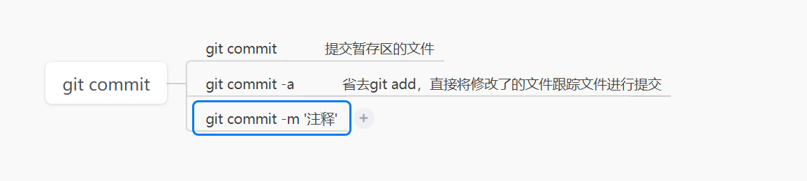

# git安装

# git安装后配置

## git config配置

Git 自带一个 `git config` 的工具来帮助设置控制 Git 外观和行为的配置变量。 这些变量存储在三个不同的位置：

1. `/etc/gitconfig` 文件: 包含系统上每一个用户及他们仓库的通用配置。 如果在执行 `git config` 时带上 `--system` 选项，那么它就会读写该文件中的配置变量。 （由于它是系统配置文件，因此你需要管理员或超级用户权限来修改它。）
2. `~/.gitconfig` 或 `~/.config/git/config` 文件：只针对当前用户。 你可以传递 `--global` 选项让 Git 读写此文件，这会对你系统上 **所有** 的仓库生效。
3. 当前使用仓库的 Git 目录中的 `config` 文件（即 `.git/config`）：针对该仓库。 你可以传递 `--local` 选项让 Git 强制读写此文件，虽然默认情况下用的就是它。。 （当然，你需要进入某个 Git 仓库中才能让该选项生效。）

每一个级别会覆盖上一级别的配置，所以 `.git/config` 的配置变量会覆盖 `/etc/gitconfig` 中的配置变量

你可以通过以下命令查看所有的配置以及它们所在的文件：

```console
$ git config --list --show-origin
```

## 配置用户信息

安装完 Git 之后，要做的第一件事就是设置你的用户名和邮件地址。 这一点很重要，因为每一个 Git 提交都会使用这些信息，它们会写入到你的每一次提交中，不可更改：

```console
$ git config --global user.name "John Doe"
$ git config --global user.email johndoe@example.com
```

再次强调，如果使用了 `--global` 选项，那么该命令只需要运行一次，因为之后无论你在该系统上做任何事情， Git 都会使用那些信息。 当你想针对特定项目使用不同的用户名称与邮件地址时，可以在那个项目目录下运行没有 `--global` 选项的命令来配置。

很多 GUI 工具都会在第一次运行时帮助你配置这些信息。

# git获取帮助

1. git help <verb>

   查看git的命令手册（无需联网，会打开html文件）。比如git help config，查看一下git config的帮助信息

2. git <verb> --help

上面2种都是跳出页面，如果简单的命令行输出，直接使用-h就可以了。

```cmd
C:\Users\Admin>git add -h
usage: git add [<options>] [--] <pathspec>...

    -n, --dry-run         dry run
    -v, --verbose         be verbose

    -i, --interactive     interactive picking
    -p, --patch           select hunks interactively
    -e, --edit            edit current diff and apply
    -f, --force           allow adding otherwise ignored files
    -u, --update          update tracked files
    --renormalize         renormalize EOL of tracked files (implies -u)
    -N, --intent-to-add   record only the fact that the path will be added later
    -A, --all             add changes from all tracked and untracked files
    --ignore-removal      ignore paths removed in the working tree (same as --no-all)
    --refresh             don't add, only refresh the index
    --ignore-errors       just skip files which cannot be added because of errors
    --ignore-missing      check if - even missing - files are ignored in dry run
    --sparse              allow updating entries outside of the sparse-checkout cone
```

# Git基础-获取仓库

两种方式获取仓库：

1. 将一个已经存在的项目纳入仓库（该项目尚未进行版本控制）
2. 从服务器克隆一个已存在的仓库

## 将已存在未进行版本控制的项目纳入仓库

1. 进入需要纳入仓库的目录
2. git init

这两步后，会在当前目录创建一个.git的文件夹，这个目录包含了git相关的所有信息，是git的骨干。但git init仅仅做了一个初始化的动作，项目里面的文件还是没有**被跟踪**

将一个已存在的但是尚未纳入git管理的文件或文件夹纳入管理，你应该开始追踪这些文件并进行初始提交。通过先git add后git commit来完成这个操作。

```console
$ git add *.c
$ git add LICENSE
$ git commit -m 'initial project version'
```

## 克隆现有的仓库

```cmd
# 直接克隆，会在当前目录建一个libgit2的目录，并在该目录下初始一个.git文件夹，从远程仓库拉取下所有数据放入 .git 文件夹，然后从中读取最新版本的文件的拷贝
$ git clone https://github.com/libgit2/libgit2
# 克隆并改名称，这会执行与上一条命令相同的操作，但目标目录名变为了 mylibgit
$ git clone https://github.com/libgit2/libgit2 mylibgit
```


# GIT的状态（一）

未跟踪，已跟踪（未修改，已修改，已暂存）


在一个存在.git的项目中，新增一个文件anew-file.txt，git status：

```cmd
$ git status
On branch master
Untracked files:                  # 显示未跟踪的文件
  (use "git add <file>..." to include in what will be committed)
        doc/anew-file.txt

nothing added to commit but untracked files present (use "git add" to track)
```

我们再add一下，就会暂存状态

```cmd
# 这个add会让刚加的文件处于暂存状态
$ git add ./doc/anew-file.txt
# add一下新文件，就直接是暂存了，后面直接commit就可以提交文件了。
$ git status
On branch master
Changes to be committed:
  (use "git restore --staged <file>..." to unstage)
        new file:   doc/anew-file.txt

```

我们再commit一下：

```cmd
# 提交文件。
$ git commit -m '提交anew-file.txt文件'
[master 02a8dc1] 提交anew-file.txt文件
 1 file changed, 0 insertions(+), 0 deletions(-)
 create mode 100644 doc/anew-file.txt

# 再git status一下，会发现工作区clean状态
$ git status
On branch master
nothing to commit, working tree clean

```

再修改anew-file.txt, 添加一些内容，再status一下：

```cmd
# 看到没有，这个文件处于modified状态。
$ git status
On branch master
Changes not staged for commit:
  (use "git add <file>..." to update what will be committed)
  (use "git restore <file>..." to discard changes in working directory)
        modified:   doc/anew-file.txt

no changes added to commit (use "git add" and/or "git commit -a")

```

Changes not staged for commit就表示已跟踪文件的内容发生了变化，但还没有放到暂存区

我们是否可以修改了之后就提交呢？看看：

```cmd
# 直接提交，看看可否，好像不行。
$ git commit -m '提交anew-file的修改'
On branch master
Changes not staged for commit:
  (use "git add <file>..." to update what will be committed)
  (use "git restore <file>..." to discard changes in working directory)
        modified:   doc/anew-file.txt

no changes added to commit (use "git add" and/or "git commit -a")
```

因为这些文件不是to be committed。所以不能直接提交。那怎么才能准备提交呢？ 就是要先放到暂存区，怎么才能放到呢，还是git add：

```cmd
# 看到没有，这里我省略了文件名，也是可以，只要目录对了就行。
$ git add ./doc
# 再看状态，可以commit了。
$ git status
On branch master
Changes to be committed:
  (use "git restore --staged <file>..." to unstage)
        modified:   doc/anew-file.txt

```

再commit提交就可以了。

这里，先不提交，我把anew-file文件再编辑一下。加点东西。再status一下

```cmd
# 看到没有，同一个文件即在暂存状态，又是modified，意思是刚才git add的是刚才的那次编辑的内容，这次的内容更改还是modified。如果你这个时候commit，那么提交后的就是前面一次git add时的文件内容，而不是当前的文件，如果让commit把当前的修改全部提交，那么不好意思，还要add一次。
$ git status
On branch master
Changes to be committed:
  (use "git restore --staged <file>..." to unstage)
        modified:   doc/anew-file.txt

Changes not staged for commit:
  (use "git add <file>..." to update what will be committed)
  (use "git restore <file>..." to discard changes in working directory)
        modified:   doc/anew-file.txt

```

git add一次：

```cmd
$ git add ./doc
$ git status
On branch master
Changes to be committed:
  (use "git restore --staged <file>..." to unstage)
        modified:   doc/anew-file.txt

# 可以看到提交了。但实际是2次insert，就是因为两次add。有历史。
$ git commit -m '提交修改'
[master 67120d5] 提交修改
 1 file changed, 2 insertions(+)

```

将git add命令理解为“精确地将内容添加到下一次提交中”而不是“将一个文件添加到项目中”要更加合适。实际上 Git 只不过暂存了你运行 `git add` 命令时的版本，如果在这个之后你又更改了文档，你还是要通过git add追加一次。

可以使用git status -s简略显示三种状态的文件：

```cmd
# M-修改中的， MM修改中的，并且是暂存的。
# A 添加到暂存区的
# ？？未跟踪的。
$ git status -s
MM doc/anew-file.txt
A  doc/anew-file2.txt
?? doc/README2.md
```


## 让git忽略某些文件

直接在.git同级目录下增加.gitignore文件。根据自己的需求编辑这个文件即可。此处略

# 查看文件差别

暂存和未暂存的区别，查看暂存的和上一次提交的区别。两个是不同的。

1. 查看尚未暂存的和已经暂存的区别，用git diff（没有参数）：
2. 参看已经暂存的和上次提交的区别，用git diff --staged（或者git diff --cached）

请注意，git diff 本身只显示尚未暂存的改动，而不是自上次提交以来所做的所有改动。 所以有时候你一下子暂存了所有更新过的文件，运行 `git diff` 后却什么也没有，就是这个原因。

# GIT提交更新

现在的暂存区已经准备就绪，可以提交了。 在此之前，请务必确认还有什么已修改或新建的文件还没有 `git add` 过， 否则提交的时候不会记录这些尚未暂存的变化。所以，**提交前一定要先git add，先git add，先git add**

每次准备提交前，先用 `git status` 看下，你所需要的文件是不是都已暂存起来了， 然后再运行提交命令 `git commit`，好习惯

git commit或git commit -m ‘填写你的本次提交的注释’

```cmd
$ git commit
[master 4465e51] aaaasdfsdf
 2 files changed, 5 insertions(+)
 create mode 100644 doc/anew-file2.txt
```

会告诉你哪个分支，更新了几个文件，等等信息

好了。有时候想省事，我每次commit都想把当前的文件提交上区，在不在暂存区无所谓，好吧，git commit -a 满足你的愿望：

```cmd
$ git status
On branch master
Changes not staged for commit:
  (use "git add <file>..." to update what will be committed)
  (use "git restore <file>..." to discard changes in working directory)
        modified:   doc/anew-file.txt

Untracked files:
  (use "git add <file>..." to include in what will be committed)
        doc/README2.md

no changes added to commit (use "git add" and/or "git commit -a")

$ git commit -a -m 'jump'
[master 021bd73] jump
 1 file changed, 1 insertion(+)

# 看到没有，没有staged的文件也被commit了。这里当然不能提交未跟踪的。
$ git status
On branch master
Untracked files:
  (use "git add <file>..." to include in what will be committed)
        doc/README2.md

nothing added to commit but untracked files present (use "git add" to track)


```

注意，git commit -a 一定是git管理的，未跟踪的是不会提交的（否则麻烦大了）



# git移除文件

使用git rm移除，它从已跟踪文件清单中移除（确切地说，是从暂存区域移除），并连带从工作目录中删除指定的文件，这样以后就不会出现在未跟踪文件清单中了。

如果只是简单的从文件目录中删除这个文件是不行的，还是要做一此git rm操作才可以。直接从文件目录中手动删除，会在git status中发现：

```cmd
$ git status
On branch master
Changes not staged for commit:
  (use "git add/rm <file>..." to update what will be committed)
  (use "git restore <file>..." to discard changes in working directory)
        deleted:    doc/anew-file2.txt

no changes added to commit (use "git add" and/or "git commit -a")
```

注意是not staged。怎么才能提交呢？ 先git rm一下：

```cmd
$ git rm ./doc/anew-file2.txt
rm 'doc/anew-file2.txt'
# rm之后才到暂存区了，才可以提交了。
$ git status
On branch master
Changes to be committed:
  (use "git restore --staged <file>..." to unstage)
        deleted:    doc/anew-file2.txt

```

再commit后就从仓库中删除了。

```cmd
$ git commit -m 'delete anew-file2.txt'
[master 6be6be9] delete anew-file2.txt
 1 file changed, 4 deletions(-)
 delete mode 100644 doc/anew-file2.txt

```

如果要删除之前修改过或已经放到暂存区的文件，则必须使用强制删除选项 `-f`，否则有报错：

```cmd
# 还未放到暂存，只是做了修改，rm的提示信息
$ git rm ./doc/README.md
error: the following file has local modifications:
    doc/README.md
(use --cached to keep the file, or -f to force removal)

```

我用git add放到暂存区，再rm的结果：

```cmd
$ git add ./doc/README.md

$ git status
On branch master
Changes to be committed:
  (use "git restore --staged <file>..." to unstage)
        modified:   doc/README.md

$ git rm ./doc/README.md
error: the following file has changes staged in the index:
    doc/README.md
(use --cached to keep the file, or -f to force removal)


```

还是一样的提示。这个时候可以-f一下，强制删除。再commit。

或者把文件从 Git 仓库中删除（亦即从暂存区域移除），但仍然希望保留在当前工作目录中。 换句话说，你想让文件保留在磁盘，但是并不想让 Git 继续跟踪，使用 `--cached` 选项。

```
$ git rm --cached ./doc/README.md
rm 'doc/README.md'

$ git status
On branch master
Changes to be committed:
  (use "git restore --staged <file>..." to unstage)
        deleted:    doc/README.md

Untracked files:
  (use "git add <file>..." to include in what will be committed)
        doc/README.md
```

看一下，这个文件实际上还在目录里面，只是状态变成了未被跟踪。

## 移除总结


# Git查看历史

使用git log查看，会根据时间倒序显示更新历史。不做过多介绍。

# Git撤销操作

## 撤销操作

这里，我们将会学习几个撤消你所做修改的基本工具。 注意，有些撤消操作是不可逆的。 这是在使用 Git 的过程中，会因为操作失误而导致之前的工作丢失的少有的几个地方之一。

有时候我们提交完了才发现漏掉了几个文件没有添加，或者提交信息写错了。 此时，可以运行带有 `--amend` 选项的提交命令来重新提交：

```cmd
$ git commit --amend
```

例如，你提交后发现忘记了暂存某些需要的修改，可以像下面这样操作：

```cmd
$ git commit -m 'initial commit'
$ git add forgotten_file
$ git commit --amend
```

>当你在修补最后的提交时，与其说是修复旧提交，倒不如说是完全用一个 **新的提交** 替换旧的提交， 理解这一点非常重要。从效果上来说，就像是旧有的提交从未存在过一样，它并不会出现在仓库的历史中。
>
>修补提交最明显的价值是可以稍微改进你最后的提交，而不会让“啊，忘了添加一个文件”或者 “小修补，修正笔误”这种提交信息弄乱你的仓库历史。

## 取消暂存的文件

接下来的两个小节演示如何操作暂存区和工作目录中已修改的文件。 这些命令在修改文件状态的同时，也会提示如何撤消操作。 例如，你已经修改了两个文件并且想要将它们作为两次独立的修改提交， 但是却意外地输入 `git add *` 暂存了它们两个。如何只取消暂存两个中的一个呢？ `git status` 命令提示了你:

```cmd
$ git status
On branch master
Changes to be committed:
  (use "git restore --staged <file>..." to unstage)
        deleted:    doc/README.md

Untracked files:
  (use "git add <file>..." to include in what will be committed)
        doc/README.md
        doc/file1.txt
        doc/file2.txt

$ git add *
$ git status
On branch master
Changes to be committed:
  (use "git restore --staged <file>..." to unstage)
        modified:   doc/README.md
        new file:   doc/file1.txt
        new file:   doc/file2.txt
# file2不要提交,回退.
$ git reset HEAD doc/file2.txt
# file2已经从暂存里面去掉了.
$ git status
On branch master
Changes to be committed:
  (use "git restore --staged <file>..." to unstage)
        modified:   doc/README.md
        new file:   doc/file1.txt

Untracked files:
  (use "git add <file>..." to include in what will be committed)
        doc/file2.txt
```

> `git reset` 确实是个危险的命令，如果加上了 `--hard` 选项则更是如此。 然而在上述场景中，工作目录中的文件尚未修改，因此相对安全一些。

## 撤销对文件的修改

如果你并不想保留对 `CONTRIBUTING.md` 文件的修改怎么办？ 你该如何方便地撤消修改——将它还原成上次提交时的样子（或者刚克隆完的样子，或者刚把它放入工作目录时的样子）？ 幸运的是，`git status` 也告诉了你应该如何做

```cmd
$ git status
On branch master
Changes not staged for commit:
  (use "git add <file>..." to update what will be committed)
  (use "git restore <file>..." to discard changes in working directory)
        modified:   doc/file1.txt

no changes added to commit (use "git add" and/or "git commit -a")

```

可以用get restore `<file>` ...或git checkout -- `<file>`来完成相同的操作

>请务必记得 `git checkout -- <file>` 是一个危险的命令。 你对那个文件在本地的任何修改都会消失——Git 会用最近提交的版本覆盖掉它。 除非你确实清楚不想要对那个文件的本地修改了，否则请不要使用这个命令。

>从2.23后开始引入了两个新的命令： `git switch` 用来切换分支，`git restore`用来还原工作区的文件，用来分担git checkout的工作(原来git checkout是可以干切换分支和回退工作区两个任务的)

# Git远程仓库


