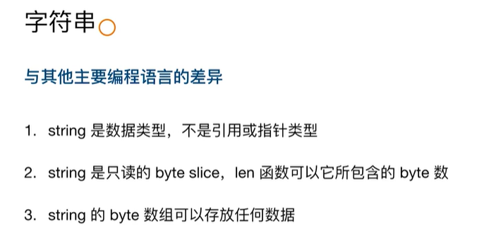
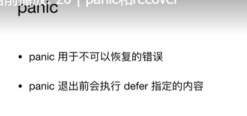

# 语言发展及历史

GO语言之处是为了解决Google内部开发当中面临的挑战而诞生的。这些挑战包括：

> 1. 多核硬件架构的广泛应用
> 2. 超大规模分布式计算集群(上万台甚至更大)
> 3. Web模式导致的前所未有的开发规模和更新速度

历史回顾

> 1. 诞生于2007的Google，当时是为了解决google内部所发现的一些软件开发的挑战，创始人：
>
>    
>
>    当时有一封邮件（一个创始人发给另外两个工程师的说明），说明为什么用go这个名字：
>
>    
>
> 2. 从这个时候到2009，Go语言出现了第一个版本。基本是google工程师用他们的20%的时间来开发这样一门语言。go语言的几个特点：
>
>    极致简单：比如c有37个关键字，C++ 84个，Go只有25个关键字
>
>    高效：是一种编译的强类型语言，在支持垃圾回收的同时，为了提供更高效的内存访问，Go也提供了使用指针进行直接的内存访问。
>
>    生产力：不仅语法简洁，还有特别的接口类型，go还有一些变成约束，直接就为开发做出了一些更好的选择，比如复合和继承（复合大于继承），go语言就直接支持了复合。
>
>    实际上，Go已经称为了云计算语言，比如区块链的ethereum，hyperledger，docker和k8s等

# 开发环境构建

> GOPATH
>
> 1. go1.8版本前必须设置这个变量
>
> 2. go1.8之后(含1.8)如果没有设置,使用默认值:
>
>    Unit上默认$HOME/go,  windows上默认%USERPROFILE%/go , mac上GOPATH可以通过~/.bash_profile来修改

## Atom

### 安装（仅以windows为例）

安装有点麻烦，因为墙的原因，以下为我的步骤：

1. atom的安装，有个中文网站，到这里下载http://atom.baisheng999.com/，因为https://atom.io访问不了。

2. 安装好了，打开atom，通过file->settings->install方式是不行的，只能通过其他方式

3. 因为apm是默认安装的，通过apm吧（注意，atom默认会同时安装apm和npm，默认安装路径D:\program\Atom x64\resources\app\apm\bin下面，我的atom安装路径为D:\program）

4. 先进入C盘的 C:/Users/你的用户名/.atom/packages目录下，然后git clone https://github.com/joefitzgerald/go-plus.git

5. 然后进入到C:/Users/你的用户名/.atom/packages/go-plus目录，执行：npm install，然后就可以了。

   

# 程序编写入门

## 入口程序

```go
// 如果是应用程序入口，那么包名必须是main包
package main

import "fmt"

// 如果是go的入口，必须是main方法：func main()
func main(){
  fmt.Println("hello world")
}

// this is wrong
func main() int {
    fmt.Println("hello world")
    return 1
}

// this is OK
func main() {
    fmt.Println("hello world")
    os.Exit(-1)
}

// this is wrong
func main(String[] args){
    fmt.Println("hello world")
}

// this is ok
func main(){
    // （第一个参数是入口本身
    fmt.Println(os.Args)
    fmt.Println("hello world")
}
```

作为应用的入口，go的文件名可以不叫main， 另外入口类所在的目录可以不是main！！

### 和其他语言的差异：

1. Go中main函数不支持任何返回值
2. 通过os.Exit来返回状态

### 获取命令行参数

和其他语言的区别，

1. main函数不支持传入参数
2. 程序中直接通过os.Args获取命令行参数


## 编写测试程序

规则

> 1. 源码文件以_test结尾：xxx_test.go
> 2. 测试方法名以Test开头：func TestXXX(t *testing.T){...}


# 基本程序结构

变量赋值

> 和其他语言差异：
>
> 1. 赋值可以进行自动类型推断
> 2. 在一个赋值语句中可以对多个变量同时赋值

常量

> 和其他语言差别，可以快速设置连续值

基础数据类型

> 
>
> 这里要注意这样做主要是你的程序在不同平台，不会因为32位或64的不同而导致一些问题。但是像int，uint在32位和64位是不一样的，32位的就是32，64位就是64
>
> 和其他变成语言的区别：
>
> 1. Go语言不允许隐式类型转换
> 2. 别名和原有类型之间也不能进行隐式转换
>
> 像一般语言，小的类型可以往大的类型转换，Go杜绝，甚至别名和原类型也不能转换，
>
> ```go
> // 别名
> type MyInt int64
> func TestType(t *testing T){
>   var a int32 = 1
>   var b int64
>   // 显示转化
>   b = int64(a)
>   var c MyInt
>   c = MyInt(b)
>   t.Log(a,b,c)
> }
> ```

> 类型的预定义值：
>
> 
>
> Go中也有某些类型的预定义值，和java类似

指针类型

> 和其他语言的区别：
>
> 1. 有限制，比如不支持指针运算
> 2. string 是值类型，默认初始化值是空字符串，而不是nil
>
> ```go
> func TestPoint(t *testing.T){
>   a := 1
>   // 指针类型，变量前面加&
>   aPtr := &a
>   // 打印指针类型的变量就是打印指针的地址
>   // 输出如下：
>   // type_test.go:19: 1 0xc00000e1d8
>   t.Log(a,aPtr)
>   // 打印类型
>   // 输出如下：
>   // type_test.go:20: int, *int
>   t.Logf("%T, %T", a, aPtr)
>     
>   // 这个不可以，不能对指针进行运算，有的语言可以对指针进行运算，比如快速访问数组中的元素，go中不行。
>   // aPtr = aPtr + 1
> }
> 
> func TestString(t *testing.T){
>     
> }
> ```
>
> ```go
> func TestString(t *testing.T){
>   var a string
>     // 下面打印**，说明string初始为空串
>   t.Log("*" + a + "*")
> 
>   // 这里要用空串判断，而不是if a==nil 
>   if a==""{
>     
>   }
> }
> ```
>
> 

运算符

> 
>
> 
>
> 基本和其他语言相同，区别是++，--运算符只支持后置运算符，避免犯错，再看比较运算符
>
> 
>
> 语义上来说和其他语言差别不大。
>
> 但是对于某些类型的是不是可以比较以及比较的情况是什么样的，go语言有些特殊。比如如何比较切片，如何比较数组等等。比如：
>
> 
>
> 一般语言，比如java，用==比较数组，一般是比较引用，而不是比较里面的值是否相同。但是go里面不一样。 
>
> ```go
> func TestOperator(t *testing.T){
>   a :=[...]int{1,2,3,4}
>   b:=[...]int{1,4,3,2}
>   c:=[...]int{1,2,3,4,5}
>   d:=[...]int{1,2,3,4}
>   // 返回false
>   t.Log(a==b)
>   // 有编译错误，因为长度不一样，不能比较
>   t.Log(a==c)
>   // 返回true
>   t.Log(a==d)
> }
> ```
>
>  逻辑运算符，和其他语言一般相同：
>
> 
>
>  
>
> 位运算符，和主流语言基本一致：
>
> 
>
> 和其他语言的不同在于，Go有一个按位清零运算符：
>
> 
>
>  后面细讲。
>
> 
>
> 

循环

> GO语言仅支持for关键字的循环
>
> 
>
> 左右括弧实际上是不需要的。
>
> 
>
>  
>
> ```go
> func TestWhileLoop(t *testing.T) {
> 	n := 0
>     // 相当于 while （n<5){}
> 	for n < 5 {
> 		t.Log(n)
> 		n++
> 	}
> }
> ```
>
> 

条件

> 
>
>  区别：
>
> 
>
>  
>
> 第一个很好理解， 第二个是go特殊的语法，有什么用？
>
> ```go
> func TestIfMultSec(t *testing.T) {
>     // go的函数可以多返回值，下面的if先拿到somefunc函数的两个返回值，然后再根据返回值的结果进行流程控制。
>     // 非常方便。
>     if v,err := somefunc(); err == nil{
>         t.Log("1==1")
>     }else {
>         t.Log("1==1")
>     }
> }
> ```
>
>  
>
> Switch条件：
>
> 
>
> 跟大多数语言类似，但GO有一点区别。
>
> 1. 不限制是常量还是整数，比如可以是字符串
> 2. case结束不需要break，go默认会跳出循环，不像其他语言如果没有显示break会继续执行。
> 3. case后可以放置变量的多个枚举，只要命中任何一个都会进入case块。
> 4. 支持单独的switch（无变量），就像上面右边显示的那样，这个时候case相当于if语句
>
> 下面是代码实例：
>
> ```go
> func TestSwitchMultiCase(t *testing.T) {
> 	for i := 0; i < 5; i++ {
> 		switch i {
>             // 看到没有，这里是2个枚举，用逗号隔开就行
> 		case 0, 2:
> 			t.Log("Even")
>             // 这里不需要break，会自动跳出循环
> 		case 1, 3:
> 			t.Log("Odd")
> 		default:
> 			t.Log("it is not 0-3")
> 		}
> 	}
> }
> 
> // 这个是只有switch，没有变量的情况，相当于if/else
> func TestSwitchCaseCondition(t *testing.T) {
> 	for i := 0; i < 5; i++ {
> 		switch {
> 		case i%2 == 0:
> 			t.Log("Even")
> 		case i%2 == 1:
> 			t.Log("Odd")
> 		default:
> 			t.Log("unknow")
> 		}
> 	}
> }
> ```
>
> 

# 常见集合

## 数组


### 数组定义和初始化

```go
func TestArrayInit(t *testing.T) {
    // 声明长度为3的int类型一维数组，
	var arr [3]int   // 初始化为零
    // arr1用{}进行初始化
	arr1 := [4]int{1, 2, 3, 4}
    // 不知名长度，根据初始化值类确定
	arr3 := [...]int{1, 3, 4, 5}
    // 和其他语言一样，直接引用下标进行赋值
	arr1[1] = 5
	t.Log(arr[1], arr[2])
	t.Log(arr1, arr3)
}
```


### 数组的访问

```go
func TestArrayTravel(t *testing.T) {
	arr3 := [...]int{1, 3, 4, 5}
    // for循环，使用len进行循环
	for i := 0; i < len(arr3); i++ {
		t.Log(arr3[i])
	}
    
    // 使用range来循环，idx表示下标，e表示元素，
    // 这个例子会打印下标和元素值
    for idx, e := range arr3 {
		t.Log(idx,e)
	}
    
    // 下面的编译有问题，因为idx未使用，编译不通过
    for idx, e := range arr3 {
		t.Log(e)
	}
    
    // 这种编译可以，但是这个时候e就是指代数组的下标了，而不是元素值了。
    for e := range arr3 {
		t.Log(e)
	}
    
    // 如果不需要idx，但是后面如果不使用，用"_"代替就可以了。
    // 这个会只打印元素值
	for _, e := range arr3 {
		t.Log(e)
	}
}
```

和其他语言的区别：


数组的截取：


这里注意啊，开始索引是包含的，结束索引是不包含的，如果包含了，那么像a[1:len(a)]就会发生越界问题。看例子：

```go
func TestArraySection(t *testing.T) {
	arr3 := [...]int{1, 2, 3, 4, 5}
    // 所有的数组元素
	arr3_sec := arr3[:]
    // 前三个元素
    arr4_sec := arr3[:3]
    // 后四个元素
    arr5_sec := arr3[1:]
    // 下面这个错误，不支持负数
    arr6_sec := arr3[:-1]
    // 从1到3的2个元素
    arr7_sec := arr3[1:3]
	t.Log(arr3_sec, arr4_sec,arr5_sec, arr7_sec)
}
```


## 切片


一个结构体，第一个指针，指向数组，第二个是元素的个数，第三个是数组容量。这里的len是有点特殊的，其他的语言可能没有这样的数据结构。

```go
func TestSliceInit(t *testing.T) {
    // 声明切片，和一般数组的区别，[]中没有具体的数值，没有...
	var s0 []int
    // 初始化应该都是0.这里也会打印0
	t.Log(len(s0), cap(s0))
    // 往数组里面追加一个元素，值为1，
	s0 = append(s0, 1)
    // 打印1，1，说明这个时候数组长度为1，元素的个数也是1
	t.Log(len(s0), cap(s0))

    // 带初始值的声明
	s1 := []int{1, 2, 3, 4}
    // 打印4，4，
	t.Log(len(s1), cap(s1))

    // 调用make函数声明切片，元素3个，容量5
	s2 := make([]int, 3, 5)
    //这里打印3，5，
	t.Log(len(s2), cap(s2))
    // 打印0，0，0，3个元素都是0，如果打印s2[3],这个时候会报错数组越界
	t.Log(s2[0], s2[1], s2[2])
    // 追加一个元素
	s2 = append(s2, 1)
    // 这个时候可以打印s2[3]了，因为已经变成4个元素了。
	t.Log(s2[0], s2[1], s2[2], s2[3])
    // 打印4，5，验证了上面的逻辑
	t.Log(len(s2), cap(s2))
}
```

### 切片的声明方式


看一下，切片的长度如何动态扩展：

```go
func TestSliceGrowing(t *testing.T) {
	s := []int{}
	for i := 0; i < 10; i++ {
        // 这里为什么不直接append(s,i),而要赋值给s？
        // 这里设计到结构体和指针的相关知识，大体是append之后，结构体变化，go会构建一个新的结构，将原有的元素copy进去，
        // 所以s就指向了新的结构体（不是原来的了），所以要用新的一个s
		s = append(s, i)
		t.Log(len(s), cap(s))
	}
    // 打印结果如下：
    /*
    slice_test.go:26: 1 1
    slice_test.go:26: 2 2
    slice_test.go:26: 3 4
    slice_test.go:26: 4 4
    slice_test.go:26: 5 8
    slice_test.go:26: 6 8
    slice_test.go:26: 7 8
    slice_test.go:26: 8 8
    slice_test.go:26: 9 16
    slice_test.go:26: 10 16
    */
    // 可以看到cap都是按照2被的增长。
}
```

### 切片共享存储空间


运用切片，可以做一种共享存储结构，有多个slice，指向同一块存储空间。如图中，

Q2指向第四个元素，长度是3，cap是9.  summer指向地第六个元素，长度3，容量7，如图所示。

如上Q2和summer共享了months这个空间，当你修改了一个元素，比如June，那么所有切片的这个元素值都会改变。

```go
func TestSliceShareMemory(t *testing.T) {
	year := []string{"Jan", "Feb", "Mar", "Apr", "May", "Jun", "Jul", "Aug", "Sep",
		"Oct", "Nov", "Dec"}
    // 3个元素
	Q2 := year[3:6]
    // 这里打印[Apr May Jun] 3 9
    // 3很好理解，9是因为从3（apr）数，往后year的空间是9，所以cap是9.这里要注意
	t.Log(Q2, len(Q2), cap(Q2))
    // 另外一个切片
	summer := year[5:8]
    // 打印[Jun Jul Aug] 3 7
    // 和前面同理
	t.Log(summer, len(summer), cap(summer))
    // 改变第5个的值为Unknow
	summer[0] = "Unknow"
    // 打印[Apr May Unknow]，因为Jun改为了Unknow了。
	t.Log(Q2)
    // 打印[Jan Feb Mar Apr May Unknow Jul Aug Sep Oct Nov Dec]
	t.Log(year)
}
```

### 数组VS切片


数组是不能伸缩的，切片可以。数组可以比较（长度相同），看看切片的比较：

```go
func TestSliceComparing(t *testing.T) {
	a := []int{1, 2, 3, 4}
	b := []int{1, 2, 3, 4}
	// if a == b { //切片只能和nil比较，这个a==b是有问题的。
	// 	t.Log("equal")
	// }
	t.Log(a, b)
}
```

## map


看一下make，为什么没有初始长度的初始化，因为不需要，map本身是key-value数据接口，不是单一的元素，只要有cap就行了。另外，用make初始化固定长度，性能上可能也会好一点。

```go
func TestInitMap(t *testing.T) {
    // 定义一个key为int，value为int型的map，并初始化三个元素，key-value用：号隔开
	m1 := map[int]int{1: 1, 2: 4, 3: 9}
    // 打印4，key为2的元素对应的值
	t.Log(m1[2])
    // 打印len m1=3， 长度是3
	t.Logf("len m1=%d", len(m1))
	m2 := map[int]int{}
    // key=4的元素value值赋值16
	m2[4] = 16
    // 打印len m2=1， 赋值了一个元素，长度为1
	t.Logf("len m2=%d", len(m2))
    // 使用make定义，注意这里，10表示cap，长度实际上还是0
	m3 := make(map[int]int, 10)
    // 打印len m3=0， 没有赋值，其长度为0，
	t.Logf("len m3=%d", len(m3))
}
```

再看一个问题，map中如果值不存在或存在，和其他语言的表现是不是一样？

```go
func TestAccessNotExistingKey(t *testing.T) {
	m1 := map[int]int{}
    // 打印0，不打印nil，这里要注意，对于不存在的key，打印其value是0值
	t.Log(m1[1])
    // 赋值key=2的元素值
	m1[2] = 0
    // 打印0， 这个是正常结果
	t.Log(m1[2])
    // 赋值key=3的元素值
	m1[3] = 0
    
    // 那既然key不存在和存在都是打印0，那么如何判断是否存在呢？看下面
    // 看一下go的if的特殊用法，这里m1[3]返回两个值，第一个是value，第二个是这个key的元素是否存在，这里如果ok是true，就会打
    // 印值，否则打印不存在
	if v, ok := m1[3]; ok {
		t.Logf("Key 3's value is %d", v)
	} else {
		t.Log("key 3 is not existing.")
	}
}
```

总结就是：


map遍历


不要太简单，

```go
func TestTravelMap(t *testing.T) {
	m1 := map[int]int{1: 1, 2: 4, 3: 9}
    // 使用range语法，这里如果k不适用，可以用_代替，如果只需要k，那么可以for k := range m1,这样的话只打印key的值。
	for k, v := range m1 {
		t.Log(k, v)
	}
}
```

## map和工厂模式

在Go语言中，函数是一等公民，map的值除了可以是数值类型之外，也可以是函数，在后面关于多态，关于接口，关于函数的时候，你就会知道，你可以用map来实现其他语言比较多代码才能实现的工厂功能。


先看一下函数的基本用法：

```go
func TestMapWithFunValue(t *testing.T) {
	m := map[int]func(op int) int{}
    // m[1]的函数定义，返回参数本身
	m[1] = func(op int) int { return op }
    // m[2]的函数定义，返回平方值
	m[2] = func(op int) int { return op * op }
    // m[3]的函数定义，返回三次方的值
	m[3] = func(op int) int { return op * op * op }
    // 函数传值并返回结果
	t.Log(m[1](2), m[2](2), m[3](2))
}
```

另外举个例子，go中是没有set的，我们也可以用map来实现：


```go
func TestMapForSet(t *testing.T) {
	mySet := map[int]bool{}
    // 把key作为set中的元素，key值设置为true，就表示这个元素存不存在。
	mySet[1] = true
	n := 3
    // 如果值为true，就表示存在。
	if mySet[n] {
		t.Logf("%d is existing", n)
	} else {
		t.Logf("%d is not existing", n)
	}
	mySet[3] = true
	t.Log(len(mySet))
    // 删除某个key的值，相当于删除set里的某个元素
	delete(mySet, 1)
	n = 1
    // 1已经被删掉，那么就不存在了。
	if mySet[n] {
		t.Logf("%d is existing", n)
	} else {
		t.Logf("%d is not existing", n)
	}
}
```


# 字符串

## 和其他语言的差异




string的零值不是一个空nil，而是要给空字符串，string是数据类型

```go
func TestString(t *testing.T) {
	var s string
	t.Log(s) //初始化为默认零值“”
	s = "hello"
    // 因为是字符串，长度就是英文字符的个数个byte，输出5
	t.Log(len(s))
	//s[1] = '3' //string是不可变的byte slice，这里不能赋值
	//s = "\xE4\xB8\xA5" //可以存储任何二进制数据
	s = "\xE4\xBA\xBB\xFF"
    // 打印出来是乱码，因为xBB是随便输入的。
	t.Log(s)
    // 存储的是4个byte，所以打印出来是4
	t.Log(len(s))
	s = "中"
    // 中文的中占3个byte，这里就是3
	t.Log(len(s)) //是byte数

    // 这里用了rune类型，它是把s转换为unicode，这里得到一个s的unicode切片？
	c := []rune(s)
    // 长度应该是1
	t.Log(len(c))
	//	t.Log("rune size:", unsafe.Sizeof(c[0]))
    // 打印中字的unicode，打印 中 unicode 4e2d
	t.Logf("中 unicode %x", c[0])
    // 打印中字的UTF-8的存储值：打印 中 UTF8 e4b8ad
	t.Logf("中 UTF8 %x", s)
}
```

unicode和utf-8的关系：


字符串的pkg的使用：

```go
func TestStringFn(t *testing.T) {
	s := "A,B,C"
    // 得到一个切片
	parts := strings.Split(s, ",")
    // 依次打印A，B，C
	for _, part := range parts {
		t.Log(part)
	}
    // 元素用符号join，打印：A-B-C
	t.Log(strings.Join(parts, "-"))
}

func TestConv(t *testing.T) {
    // int转化为字符串
	s := strconv.Itoa(10)
    // 打印 str10
	t.Log("str" + s)
    // 这里不能直接t.Log(10 + strconv.Atoi("10"))，会有报错。，用下面的。
	if i, err := strconv.Atoi("10"); err == nil {
		t.Log(10 + i)
	}
}
```


# 函数

一等公民


## go语言的函数

看一下用法：

```go
//返回2个值的函数，注意定义格式
func returnMultiValues() (int, int) {
    // 返回2个值，逗号隔开。
	return rand.Intn(10), rand.Intn(20)
}

// 这个函数比较特殊，输入和输出都是函数。
func timeSpent(inner func(op int) int) func(op int) int {
	return func(n int) int {
		start := time.Now()
		ret := inner(n)
		fmt.Println("time spent:", time.Since(start).Seconds())
		return ret
	}
}

// 被包装函数
// 函数定义，
func slowFun(op int) int {
	time.Sleep(time.Second * 1)
	return op
}

func TestFn(t *testing.T) {
    // 多个返回值，如果哪个参数不使用，用“_”号替换即可。
	a, _ := returnMultiValues()
	t.Log(a)
    
    // 这里实现了传入一个函数，打印函数执行的耗时的功能，
    // 输入是一个函数，返回是一个修改后的函数，这个函数包装了输入函数，并在输入函数执行前后进行的耗时统计。
    // 我们调用返回的函数，就是计算出函数调用的耗时。
    // 输入的函数可以是任意需要统计耗时的函数。
	tsSF := timeSpent(slowFun)
	t.Log(tsSF(10))
}
```

学习函数式编程，推荐一本书《计算机程序的构造和解释》

## 可变长参数及defer

### 可变长参数

可变参数在很多语言都是支持的，意思就是不需要指定参数的长度。


可以看看如下用法：

```go
func Sum(ops ...int) int {
	ret := 0
    // 切片的用法。
	for _, op := range ops {
		ret += op
	}
	return ret
}

func TestVarParam(t *testing.T) {
	t.Log(Sum(1, 2, 3, 4))
	t.Log(Sum(1, 2, 3, 4, 5))
}
```


### defer


类似于java的try...finally.比如上图中的defer func，不会立即执行，方法结束后才会执行，panic是一个中断，中断执行完才会执行defer的函数。

看一下用法：

```go
func Clear() {
	fmt.Println("Clear resources.")
}

func TestDefer(t *testing.T) {
    // 不会立即执行，
	defer Clear()
	fmt.Println("Start")
    // 在panic之前就会执行clear(), 
	panic("err")
}
```


# 面向对象编程

太多的人问GO语言是不是一种面向对象语言，下面就是一个回答：


## 封装数据和行为


```go
type Employee struct {
	Id   string
	Name string
	Age  int
}

func TestCreateEmployeeObj(t *testing.T) {
	e := Employee{"0", "Bob", 20}
	e1 := Employee{Name: "Mike", Age: 30}
	e2 := new(Employee) //返回指针，类似于&e
    // 直接赋值，不需要用->符号
	e2.Id = "2"
	e2.Age = 22
	e2.Name = "Rose"
    // 打印e的值，ID:0-Name:Bob-Age:20
	t.Log(e)
    // 打印e1的值：ID:-Name:Mike-Age:30
	t.Log(e1)
    // e1的id为空
	t.Log(e1.Id)
    // 打印：ID:2-Name:Rose-Age:22
	t.Log(e2)
    // 打印：e is encap.Employee
	t.Logf("e is %T", e)
    // 打印：e2 is *encap.Employee
	t.Logf("e2 is %T", e2)
}
```

行为方法定义


看一下例子：

```go
// 这种是指针方式，避免了内存拷贝
// func (e *Employee) String() string {
// 	return fmt.Sprintf("ID:%s/Name:%s/Age:%d", e.Id, e.Name, e.Age)
// }

// 第一种方式，注意方法名前面有e Employee的申明，主要是为了获取它的值
func (e Employee) String() string {
	fmt.Printf("Address is %x\n", unsafe.Pointer(&e.Name))
	return fmt.Sprintf("ID:%s-Name:%s-Age:%d", e.Id, e.Name, e.Age)
}

func TestStructOperations(t *testing.T) {
	e := Employee{"0", "Bob", 20}
    
    // 可以根据下面打印，看看指针方式和非指针方式的不同，指针方式，地址是不一样的，非指针方式是一样的。
	fmt.Printf("Address is %x\n", unsafe.Pointer(&e.Name))
    // 调用实例的方法。这里注意，如果 e := &Employee{"0", "Bob", 20}, 仍然可以使用e.String()进行调用。
	t.Log(e.String())
}
```


## GO语言的相关接口


这个就不会存在类似java的循环依赖了。


看看用法：

```go
// 接口定义
type Programmer interface {
	WriteHelloWorld() string
}

// 实现先写一个struct
type GoProgrammer struct {
}

// 和接口一样的签名即可，不需要implement等，
// 注意这里是结构体方法的第二种写法，指针写法。
func (g *GoProgrammer) WriteHelloWorld() string {
	return "fmt.Println(\"Hello World\")"
}

func TestClient(t *testing.T) {
    // 定义接口类型变量
	var p Programmer
    // 实现。
	p = new(GoProgrammer)
    // 调用实例方法
	t.Log(p.WriteHelloWorld())
}
```

## 自定义类型


比如我们把前面的讲函数式编程的例子改写一下：

```go
// 定义一个IntConv自定义类型，，后面就可以简化很多。
type IntConv func(op int) int

func timeSpent(inner IntConv) IntConv {
	return func(n int) int {
		start := time.Now()
		ret := inner(n)
		fmt.Println("time spent:", time.Since(start).Seconds())
		return ret
	}
}

func slowFun(op int) int {
	time.Sleep(time.Second * 1)
	return op
}

func TestFn(t *testing.T) {
	tsSF := timeSpent(slowFun)
	t.Log(tsSF(10))
}
```

## 扩展和复用【to be learned】


## 不一样的接口类型，一样的多态


看代码：

```go
type Code string
type Programmer interface {
	WriteHelloWorld() Code
}

// 一个实现类
type GoProgrammer struct {
}

func (p *GoProgrammer) WriteHelloWorld() Code {
	return "fmt.Println(\"Hello World!\")"
}

// 第二个实现类
type JavaProgrammer struct {
}

func (p *JavaProgrammer) WriteHelloWorld() Code {
	return "System.out.Println(\"Hello World!\")"
}

func writeFirstProgram(p Programmer) {
    // 多态
    // 打印类型（根据不同的p，有不同的打印，
	fmt.Printf("%T %v\n", p, p.WriteHelloWorld())
}

func TestPolymorphism(t *testing.T) {
	goProg := &GoProgrammer{}
	javaProg := new(JavaProgrammer)
	writeFirstProgram(goProg)
	writeFirstProgram(javaProg)
}
```

空接口和断言


看一下例子：

```go
// 这个interface{}就是一个空接口类型，代表可以是任何类型。 并不是一个真正的接口，类似于java的Object。
// 在方法内部，java一般需要instanceof进行判断，go也需要判断，就是用p.(type)来判断。
func DoSomething(p interface{}) {
    // 可以用下面的if语法判断接口类型，也可以用switch
    
	// if i, ok := p.(int); ok {
	// 	fmt.Println("Integer", i)
	// 	return
	// }
	// if s, ok := p.(string); ok {
	// 	fmt.Println("stirng", s)
	// 	return
	// }
	// fmt.Println("Unknow Type")
	switch v := p.(type) {
	case int:
		fmt.Println("Integer", v)
	case string:
		fmt.Println("String", v)
	default:
		fmt.Println("Unknow Type")
	}
}

func TestEmptyInterfaceAssertion(t *testing.T) {
	DoSomething(10)  // int型
	DoSomething("10")  // string型
}
```

## GO接口最佳实践


# 编写好的错误处理

GO的发明者认为过度的抛出异常的方式不好，因此GO没有异常，同时GO支持方法返回多个参数，


使用说明：

```go
// 如果代码有较多的固定的几个异常，可以预先定义，以便于外部对error进行判断
var LessThanTwoError = errors.New("n should be not less than 2")
var LargerThenHundredError = errors.New("n should be not larger than 100")

func GetFibonacci(n int) ([]int, error) {
	if n < 2 {
		return nil, LessThanTwoError
	}
	if n > 100 {
		return nil, LargerThenHundredError
	}
	fibList := []int{1, 1}

	for i := 2; /*短变量声明 := */ i < n; i++ {
		fibList = append(fibList, fibList[i-2]+fibList[i-1])
	}
	return fibList, nil
}

func TestGetFibonacci(t *testing.T) {
	if v, err := GetFibonacci(1); err != nil {
		if err == LessThanTwoError {
			fmt.Println("It is less.")
		}
		t.Error(err)
	} else {
		t.Log(v)
	}

}

func GetFibonacci1(str string) {
	var (
		i    int
		err  error
		list []int
	)
	if i, err = strconv.Atoi(str); err == nil {
		if list, err = GetFibonacci(i); err == nil {
			fmt.Println(list)
		} else {
			fmt.Println("Error", err)
		}
	} else {
		fmt.Println("Error", err)
	}
}

func GetFibonacci2(str string) {
	var (
		i    int
		err  error
		list []int
	)
    
    // 好的实践，尽早发现，尽早避免
	if i, err = strconv.Atoi(str); err != nil {
		fmt.Println("Error", err)
		return
	}
	if list, err = GetFibonacci(i); err != nil {

		fmt.Println("Error", err)
		return
	}
	fmt.Println(list)
}
```


## panic和recover




recover


在go语言，也是可以这么做的。

​	

因为panic是会调用defer的，所有这个可以通过recover()进行一些特别的处理。比如：


这可能是危险的。recover可能不会检测一些不可恢复的异常，如果没做处理，很可能导致僵尸服务，就是检测都OK的（因为你把异常自己处理了，外部无法感知），但实际上，程序已经crash了。


一旦crash，守护进程就会把失败服务重启。


# 包和依赖管理

