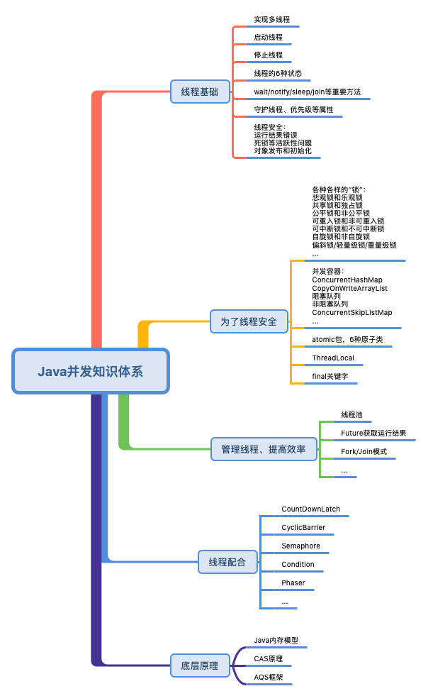

# java基础

## String

不可变类，一旦初始化后，值就不会被改变，这样做的好处：不用担心作为参数传入方法中被改变，线程安全。

> String的equals和compareTo方法。
>
> equals() 可以接收一个 Object 类型的参数，而 compareTo() 只能接收一个 String 类型的参数；
> equals() 返回值为 boolean，而 compareTo() 的返回值则为 int。当compareTo()返回0，则表示两个字符串完全相同。

### ==和equals区别

==，作用在基本类型是，是比较值是否相等的，作用在引用类型上，是比较对象的地址是否相等。我们看一下源码：

```java
public boolean equals(Object obj) {
    return (this == obj);
}

```

实际上就是一个地址的比较。

### final修饰的好处

Java 语言之父 James Gosling 的回答是，他会更倾向于使用 final，因为它能够缓存结果，当你在传参时不需要考虑谁会修改它的值；如果是可变类的话，则有可能需要重新拷贝出来一个新值进行传参，这样在性能上就会有一定的损失。

James Gosling 还说迫使 String 类设计成不可变的另一个原因是**安全**，当你在调用其他方法时，比如调用一些系统级操作指令之前，可能会有一系列校验，如果是可变类的话，可能在你校验过后，它的内部的值又被改变了，这样有可能会引起严重的系统崩溃问题，这是迫使 String 类设计成不可变类的一个重要原因。

总结来说，使用 final 修饰的第一个好处是**安全**；第二个好处是**高效**，比如常量池。

```java
String s1 = "java";、
String s2 = "java";
```

只有字符串是不可变时，我们才能实现字符串常量池，字符串常量池可以为我们缓存字符串，提高程序的运行效率。


试想一下如果 String 是可变的，那当 s1 的值修改之后，s2 的值也跟着改变了，这样就和我们预期的结果不相符了，因此也就没有办法实现字符串常量池的功能了

### String 和 StringBuilder、StringBuffer 的区别

因为 String 类型是不可变的，所以在字符串拼接的时候如果使用 String 的话性能会很低，因此我们就需要使用另一个数据类型 StringBuffer，它提供了 append 和 insert 方法可用于字符串的拼接，它使用 synchronized 来保证线程安全.因为它使用了 synchronized 来保证线程安全，所以性能不是很高，于是在 JDK 1.5 就有了 StringBuilder，它同样提供了 append 和 insert 的拼接方法，但它没有使用 synchronized 来修饰，因此在性能上要优于 StringBuffer，所以在非并发操作的环境下可使用 StringBuilder 来进行字符串拼接,

### String 和 JVM

```java
String s1 = "Ja" + "va";
String s2 = "Java";
System.out.println(s1 == s2);
```

虽然 s1 拼接了多个字符串，但对比的结果却是 true，代码 "Ja"+"va" 被直接编译成了 "Java" ，因此 s1==s2 的结果才是 true，这就是编译器对字符串优化的结果

## HashMap

### 一个简单的hashMap要考虑哪些因素

1. 因为hashMap的需求很简单，就是要让查询快，最快的查询的时间复杂度显然就是O(1)，那么怎么能最快，很自然的我们想到，数组是一组连续的空间的数据结构，如果能通过下标直接查找到数组元素，无疑是效率最高的。如果能通过一个函数f，作用于key，得到一串数字，这个数字作为数组的下标，是不是就很OK。通过String（或其他能作为key的对象）得到一串数字的，那就是hashCode()值。好，解决了方法的问题，那么问题来了，hashCode（）的返回是int值，取值范围[-2147483648, 2147483647]，如果用这种方法，我的数组岂不是长度要40多亿？所以用这种方法无法落地，因为不可能用这么大空间的数组。这个时候我们就要参考数组的长度了。如果你数组的长度为n，那么这个算出来的hashCode就要和数组的长度取模，才能是最终计算的结果（数组下标）在数组长度范围内。也就是最终：

   > 假如数组长度为n，hash函数为hashCode()，一个元素key对应的数组的下标的计算公式为：
   >
   > hash = mod(hashCode(key), n);

2. 通过上面的方法，给定一个key，得出了这个key存放的数组的下标（id），如果id冲突了怎么办？那么只有放到一起了，用指针链接起来形成链表，也就是数组的每个下标对应存放下标冲突的多个key的值。

   > 举例说明：假如数组长度为8，使用如果公式计算下标：
   >
   > hash_index = hash & (n-1)
   >
   > 也就是hash_index = hash & 7。那么我们看看如下几个key对应的计算出的下标：
   >
   > 
   >
   > 上图中绿色的存放1个元素，红色的有hash冲突，放了2个元素，黄色的没有元素

上面基本实现了一个简单的hashMap，那么任然有很多的问题需要解决：

>1. 这里所有的元素存放都需要获取一个索引位置，而如果元素的位置不够散列碰撞严重，那么就失去了散列表存放的意义，没有达到预期的性能。
>
>2. 在获取索引ID的计算公式中，需要数组长度是2的倍数，那么怎么进行初始化这个数组大小。
>
>3. 数组越小碰撞的越大，数组越大碰撞的越小，时间与空间如何取舍。
>
>4. 目前存放7个元素，已经有两个位置都存放了2个字符串，那么链表越来越长怎么优化。
>
>5. 随着元素的不断添加，数组长度不足扩容时，怎么把原有的元素，拆分到新的位置上去。

### 扰动函数

```java
 public V put(K key, V value) {
    // 使用了hash扰动函数，hash(key)，看看它是如何计算出需要的hash值得。
    return putVal(hash(key), key, value, false, true);
}

static final int hash(Object key) {
    int h;
    // 如果key为null，那么就在桶的第0个位置
    // 否则用key.hashCode() ^ (h >>> 16);
    return (key == null) ? 0 : (h = key.hashCode()) ^ (h >>> 16);
}
```

这里的和高位的16位异或其实就是扰动。

#### 为什么使用扰动函数

HashMap中是使用`(n - 1) & hash`来计算数组下标的。hashMap源码这里hash就是用的hash(key)计算出来的，我们看到这个函数不只是直接获取哈希值，还进行了一次扰动计算，`(h = key.hashCode()) ^ (h >>> 16)`。把哈希值右移16位，也就正好是自己长度的一半，之后与原哈希值做异或运算，这样就混合了原哈希值中的高位和低位，增大了**随机性**。计算方式如下图；


（图中应该是jdk1.7中的算法，使用的是hash & （n-1），jdk1.8中的改成了(n-1) & hash)

**说白了，使用扰动函数就是为了增加随机性，让数据元素更加均衡的散列，减少碰撞，也是因为有些数据计算出的哈希值差异主要在高位，而 HashMap 里的哈希寻址是忽略容量以上的高位的，那么这种处理就可以有效避免类似情况下的哈希碰撞。**

### 初始化容量和负载因子

接下来我们讨论下一个问题，从我们模仿HashMap的例子中以及HashMap默认的初始化大小里，都可以知道，散列数组需要一个2的倍数的长度，因为只有2的倍数在减1的时候，才会出现`01111`这样的值。

那么这里就有一个问题，我们在初始化HashMap的时候，如果传一个17个的值`new HashMap<>(17);`，它会怎么处理呢？

#### 寻找2的倍数的最小值

HashMap在初始化的时候有如下代码：

```java
public HashMap(int initialCapacity, float loadFactor) {
    ...
    this.loadFactor = loadFactor;
    this.threshold = tableSizeFor(initialCapacity);
}
```

1. 阀值`threshold`，通过方法`tableSizeFor`进行计算，是根据初始化来计算的。
2. 这个方法也就是要寻找比[初始值](https://www.zhihu.com/search?q=初始值&search_source=Entity&hybrid_search_source=Entity&hybrid_search_extra={"sourceType"%3A"answer"%2C"sourceId"%3A2022919698})大的，最小的那个2进制数值。比如传了17，我应该找到的是32。

计算阈值大小的方法：

```java
static final int tableSizeFor(int cap) {
    int n = cap - 1;
    n |= n >>> 1;
    n |= n >>> 2;
    n |= n >>> 4;
    n |= n >>> 8;
    n |= n >>> 16;
    return (n < 0) ? 1 : (n >= MAXIMUM_CAPACITY) ? MAXIMUM_CAPACITY : n + 1;
}
```

MAXIMUM_CAPACITY = 1 << 30（2的30次幂），这个是临界范围，也就是最大的Map集合。

乍一看可能有点晕 怎么都在向右移位1、2、4、8、16，这主要是为了把二进制的各个位置都填上1，当二进制的各个位置都是1以后，就是一个标准的2的倍数减1了，最后把结果加1再返回即可。

那这里我们把17这样一个初始化计算阀值的过程，用图展示出来，方便理解


#### 负载因子

```java
static final float DEFAULT_LOAD_FACTOR = 0.75f;
```

负载因子是做什么用的？

> 负载因子，可以理解成一辆车可承重重量超过某个阀值时，把货放到新的车上。

那么在HashMap中，负载因子决定了数据量多少了以后进行扩容。*这里要提到上面做的HashMap例子，我们准备了7个元素，但是最后还有3个位置空余，2个位置存放了2个元素。* 所以可能即使你数据比数组容量大时也是不一定能正正好好的把数组占满的，而是在某些下标位置出现了大量的碰撞，只能在同一个位置用链表存放，那么这样就失去了Map数组的性能。

这个值大了，扩容的频率就比较低，**占用的空间比较小**，**但发生hash碰撞的几率就会提升**（为什么提升？因为我们用的是（n-1） & hash来计算下标的，这个公式和n有关，n越大，冲突就越小）

这个值小了，扩容的频率就比较高，**会占用更多的空间**，**但是发生碰撞的概率就会小**

所以，要选择一个合理的大小下进行扩容，默认值0.75就是说当阀值容量占了3/4s时赶紧扩容，减少Hash碰撞。

同时0.75是一个默认构造值，在创建HashMap也可以调整，**比如你希望用更多的空间换取时间，可以把负载因子调的更小一些，减少碰撞**。


有三个构造函数：

1. 无参数构造函数，使用默认加载因子0.75
2. 有一个容量capacity的参数，那么加载因子默认0.75，
3. 一个capacity和一个加载因子。那么hashmap会初始化阈值为比capacity大的最小的2的幂次方这个数为阈值。即这个时候阈值=大于capacity的最小的2的幂次方。然后在put进行扩容的时候会优先使用这个阈值为容量。

### HashMap扩容

#### 扩容的时机

> 1. 初始化后第一次put元素会进行扩容。实际上HashMap构造函数如果有capacity参数，那么其初始阈值都是大于capacity的最小的2的幂次方，而不是参数中的capacity*加载因子。
> 2. 在put操作添加元素（不是覆盖元素）时判断，如果容量超过了阈值就进行扩容。
> 3. 在执行putAll方法或通过其他存量Map构造HashMap时如果容量超过阈值则进行扩容
> 4. 如果在进行链表满足长度>=8，但是数组长度（容量）还不足64时，先进行扩容

#### 扩容的流程

```java
    final Node<K,V>[] resize() {
        Node<K,V>[] oldTab = table;
        int oldCap = (oldTab == null) ? 0 : oldTab.length;
        int oldThr = threshold;
        int newCap, newThr = 0;
        if (oldCap > 0) {
            // 当前容量太大，超过了允许的最大容量1>>30(2的30次方)，那就把阈值设置为Integer最大，还
            // 是返回原来的桶（太大了不扩容了，就这么着吧）
            if (oldCap >= MAXIMUM_CAPACITY) {
                threshold = Integer.MAX_VALUE;
                return oldTab;
            }
            // 如果容量扩了2倍后<最大容量，并且初始容量>=16.则扩充后新的容量为原来的2倍，阈值为原来
            // 的两倍。如果扩2倍后容量超限了或初始容量还没到默认初始容量，则不扩容。
            else if ((newCap = oldCap << 1) < MAXIMUM_CAPACITY &&
                     oldCap >= DEFAULT_INITIAL_CAPACITY)
                newThr = oldThr << 1; // double threshold
        }
        // HashMap中没数据，但是已经设置了初始容量（参考HashMap的带容量的构造函数，会将阈值设置为
        // 传参中的容量的最小2的幂次方），则将容量扩至阈值的值，比如new HashMap(10);那么在第一次
        // put数据时扩容至16.
        else if (oldThr > 0) // initial capacity was placed in threshold
            newCap = oldThr;
        // 即没有数据，又没有阈值，那么容量扩到16，阈值设置为0.75*16。
        else {               // zero initial threshold signifies using defaults
            newCap = DEFAULT_INITIAL_CAPACITY;
            newThr = (int)(DEFAULT_LOAD_FACTOR * DEFAULT_INITIAL_CAPACITY);
        }
        
        // 如果扩容后的阈值这时候还没有设置（对应HashMap没数据，但是设置了初始容量。或者扩2倍后就超过
        // 最大容量了的情况
        if (newThr == 0) {
            float ft = (float)newCap * loadFactor;
            // 如果新的扩容容量<最大容量且容量*因子<最大容量，则用容量*因子作为新的阈值，否则用
            // Integer的最大值作为阈值。
            newThr = (newCap < MAXIMUM_CAPACITY && ft < (float)MAXIMUM_CAPACITY ?
                      (int)ft : Integer.MAX_VALUE);
        }
        threshold = newThr;
        
        
        // 走到这里，扩容后的阈值和容量都有了。
        // 开始将原数据copy到扩容后的数组中
        @SuppressWarnings({"rawtypes","unchecked"})
            Node<K,V>[] newTab = (Node<K,V>[])new Node[newCap];
        table = newTab;
        if (oldTab != null) {
            for (int j = 0; j < oldCap; ++j) {
                // e为桶中的当前节点元素
                Node<K,V> e;
                if ((e = oldTab[j]) != null) {
                    // 讲原节点设置为null
                    oldTab[j] = null;
                    
                    // 如果next为空，这种好办，说明链表只有一个元素，将原先的值放到按照新的扩容数组
                    // 计算出的桶位置放元素
                    if (e.next == null)
                        newTab[e.hash & (newCap - 1)] = e;
                    
                    // 原节点是一个红黑树
                    else if (e instanceof TreeNode)
                        ((TreeNode<K,V>)e).split(this, newTab, j, oldCap);
                    // 原节点的next不为空，说明链表有多个元素
                    else { // preserve order
                        Node<K,V> loHead = null, loTail = null;
                        Node<K,V> hiHead = null, hiTail = null;
                        Node<K,V> next;
                        do {
                            next = e.next;
                            
                            // 通过高位运算（e.hash & oldCap）来确定元素是否需要移动.
                            // ，比如 key1 的信息如下：
                            // key1.hash = 10 0000 1010
                            // oldCap = 16 0001 0000
                            // 使用 e.hash & oldCap 得到的结果，高一位为 0，当结果为 0 时表
                            // 示元素在扩容时位置不会发生任何变化，而 key 2 信息如下：
                            // key2.hash = 10 0001 0001
                            // oldCap = 16 0001 0000
                            // 这时候得到的结果，高一位为 1，当结果为 1 时，表示元素在扩容时
                            // 位置发生了变化，新的下标位置等于原下标位置 + 原数组长度
                            if ((e.hash & oldCap) == 0) {
                                if (loTail == null)
                                    loHead = e;
                                else
                                    loTail.next = e;
                                loTail = e;
                            }
                            else {
                                if (hiTail == null)
                                    hiHead = e;
                                else
                                    hiTail.next = e;
                                hiTail = e;
                            }
                        } while ((e = next) != null);
                        if (loTail != null) {
                            loTail.next = null;
                            newTab[j] = loHead;
                        }
                        if (hiTail != null) {
                            hiTail.next = null;
                            newTab[j + oldCap] = hiHead;
                        }
                    }
                }
            }
        }
        return newTab;
    }
```

#### 扩容算法说明：

JDK1.7和JDK1.8在这里的算法是不一样的，1.7的需要重新计算hash值，而1.8则不需要了。具体请看下图：


### HashMap的查找算法

```java
    public V get(Object key) {
        Node<K,V> e;
        return (e = getNode(hash(key), key)) == null ? null : e.value;
    }
    
    final Node<K,V> getNode(int hash, Object key) {
        Node<K,V>[] tab; Node<K,V> first, e; int n; K k;
        // 按照哈希值找到第一个元素，不为空再继续找
        if ((tab = table) != null && (n = tab.length) > 0 &&
            (first = tab[(n - 1) & hash]) != null) {
            
            // 检查first，如果哈希值相等&&key地址相同或key通过equals比较相等，找到返回
            if (first.hash == hash && // always check first node
                ((k = first.key) == key || (key != null && key.equals(k))))
                return first;
            // 不相等，则看next是否有值，如果next不为空说明是链表或红合数
            if ((e = first.next) != null) {
                // 红黑树，从树里面找到返回
                if (first instanceof TreeNode)
                    return ((TreeNode<K,V>)first).getTreeNode(hash, key);
                
                // 从链表里找，知道找到满足哈希值，key值都相等的，返回。
                do {
                    if (e.hash == hash &&
                        ((k = e.key) == key || (key != null && key.equals(k))))
                        return e;
                } while ((e = e.next) != null);
            }
        }
        
        // 其他情况，返回null
        return null;
    }
```

### Hashmap的put算法

```java
    public V put(K key, V value) {
        return putVal(hash(key), key, value, false, true);
    }
    
    final V putVal(int hash, K key, V value, boolean onlyIfAbsent,
                   boolean evict) {
        Node<K,V>[] tab; Node<K,V> p; int n, i;
        // 如果桶未空或桶长度为0，则进行扩容
        if ((tab = table) == null || (n = tab.length) == 0)
            n = (tab = resize()).length;
        
        // p表示要插入值所在的位置的桶的元素值，
        // 如果p没有值，那么就设置当前位置的桶的元素为要插入的值
        if ((p = tab[i = (n - 1) & hash]) == null)
            tab[i] = newNode(hash, key, value, null);
        
        // p不为空，说明这个位置有元素存在（发生了哈希冲突）
        else {
            Node<K,V> e; K k;
            
            // hash相同，key相等，把存在的p赋值给e
            if (p.hash == hash &&
                ((k = p.key) == key || (key != null && key.equals(k))))
                e = p;
            
            // p是红黑树节点，单独处理
            else if (p instanceof TreeNode)
                e = ((TreeNode<K,V>)p).putTreeVal(this, tab, hash, key, value);
            
            // p是链表，需要在链表中插入元素，循环操作
            else {
                for (int binCount = 0; ; ++binCount) {
                    // p的next为空，说明p是最后一个节点了，
                    if ((e = p.next) == null) {
                        // 将p的next赋值为新插入节点
                        // jdk1.8是尾插法，1.7是头插法
                        p.next = newNode(hash, key, value, null);
                        
                        // 如果binCount >= 7，也就是链表长度大于等于8，则进行链表->红黑树转换
                        if (binCount >= TREEIFY_THRESHOLD - 1) // -1 for 1st
                            // 转换
                            treeifyBin(tab, hash);
                        break;
                    }
                    
                    // p的next不为空且hash，key都和要插入的元素同，说明有相同的key存在，退出循环
                    if (e.hash == hash &&
                        ((k = e.key) == key || (key != null && key.equals(k))))
                        break;
                    
                    // 走到这里，说明p的next不为空，并且和插入元素不相等，那么继续下一轮循环。
                    p = e;
                }
            }
            
            // 这里很明确了，e不为空的话，说明是hash表中存在相同的元素了。
            if (e != null) { // existing mapping for key
                V oldValue = e.value;
                
                // 这个onlyIfAbsent传入的是false，所以if为true，将e的值替换为要插入的值即可。
                // 插入之后，这里直接返回oldValue了。下面的扩容逻辑就不需要走。
                if (!onlyIfAbsent || oldValue == null)
                    e.value = value;
                afterNodeAccess(e);
                return oldValue;
            }
        }
        ++modCount;
        
        // 如果桶的长度大于阈值了，进行扩容
        if (++size > threshold)
            resize();
        afterNodeInsertion(evict);
        return null;
    }

    final void treeifyBin(Node<K,V>[] tab, int hash) {
        int n, index; Node<K,V> e;
        
        // 如果桶为空或者桶长度<64， 则先进行扩容再说（不进行链表->红黑树的转换），退出
        if (tab == null || (n = tab.length) < MIN_TREEIFY_CAPACITY)
            resize();
        
        // 通不为空 && 桶长度>=64, && 要插入元素的位置的桶元素不为空
        else if ((e = tab[index = (n - 1) & hash]) != null) {
            TreeNode<K,V> hd = null, tl = null;
            do {
                // Node->TreeNode,进行链表的指针操作
                // 这里只是将普通节点转换为树节点，并未进行进一步操作
                TreeNode<K,V> p = replacementTreeNode(e, null);
                if (tl == null)
                    hd = p;
                else {
                    p.prev = tl;
                    tl.next = p;
                }
                tl = p;
            } while ((e = e.next) != null);
            if ((tab[index] = hd) != null)
                // 转红黑树操作，这里需要循环比较，染色、旋转
                hd.treeify(tab);
        }
    }

```

### HashMap 1.7 的死循环问题

其主要原因就是1.7 的resize操作中，多个线程rehash后可能引起链表反转，导致链表的指针指向出现了循环。JDK1.8 采用了尾差法，这个问题得到了改善。

## LinkedHashMap

### 和HashMap的区别

1. 自身的Entry<K,V>继承与HashMap.Node<K,V>，节点有before和after指针，实现双向链表的功能
2. 有头指针有尾指针，用于相关功能的实现。
3. 支持查询顺序和访问顺序（通过accessOrder来实现）


这张图也显示了和HashMap的区别，除了HashMap的功能，LinkedHashMap其实是维护了节点间的一个插入顺序，通过头指针和尾指针，已经每个节点的before和after指针。也就是说，LinkedHashMap在HashMap的数据结构的基础上，增加了节点和节点间的这种双向链表结构，而且和原HashMap没有关系的。

### 根据源码分析LinkedHashMap的相关功能

HashMap中留下来让LinkedHashMap实现的方法：

```java
    // Callbacks to allow LinkedHashMap post-actions
    void afterNodeAccess(Node<K,V> p) { }
    void afterNodeInsertion(boolean evict) { }
    void afterNodeRemoval(Node<K,V> p) { }
```

#### 节点写入

LinkedHashMap在节点写入中的newNode实际上是使用了自己实现的newNode方法，如下：

```java
    final V putVal(int hash, K key, V value, boolean onlyIfAbsent,
                   boolean evict) {
        // ......
        if ((p = tab[i = (n - 1) & hash]) == null)
            // 这个newNode方法最终会调用LinkedHashMap的newNode方法
            // 注意这个代码是在HashMap类中
            tab[i] = newNode(hash, key, value, null);
        else{
            // ......
            // 还记得这里吗？（看一下HashMap中的put代码块），这里如果e不为空，表示put的时候，发现
            // 值已经存在了，我们再这里看看LinkedHashMap做了什么。
            if (e != null) { 
                V oldValue = e.value;
                if (!onlyIfAbsent || oldValue == null)
                    e.value = value;
                
                // 这个是在LinkedHashMap中实现的。
                afterNodeAccess(e);
                return oldValue;
            }
    }

    // 注意，这个代码是在LinkedHashMap中，为方便写在了一个代码块中
    Node<K,V> newNode(int hash, K key, V value, Node<K,V> e) {
        // 节点是用的LinkedHashMap.Entry
        LinkedHashMap.Entry<K,V> p =
            new LinkedHashMap.Entry<K,V>(hash, key, value, e);
        
        // 将节点p插入到双向链表的尾部，实现了按插入顺序排序。
        linkNodeLast(p);
        return p;
    }

    // 注意，这个代码是在LinkedHashMap中，为方便写在了一个代码块中
    private void linkNodeLast(LinkedHashMap.Entry<K,V> p) {
        LinkedHashMap.Entry<K,V> last = tail;
        // 尾指针指向当前新插入的节点
        tail = p;
        
        // 如果原来的尾节点为空，那么头指针也指向新插入的节点
        if (last == null)
            head = p;
        
        // 原尾节点变成新插入节点的before节点。原尾节点的after指向新插入的节点
        else {
            p.before = last;
            last.after = p;
        }
    }
      
    // 注意，这个代码是在LinkedHashMap中，为方便写在了一个代码块中
    void afterNodeAccess(Node<K,V> e) { // move node to last
        LinkedHashMap.Entry<K,V> last;
        
        // 如果LinkedHashMap是按照访问顺序 && 尾节点不是更新的节点
        if (accessOrder && (last = tail) != e) {
            LinkedHashMap.Entry<K,V> p =
                (LinkedHashMap.Entry<K,V>)e, b = p.before, a = p.after;
            // 更新的节点作为尾节点
            p.after = null;
            
            // 当前节点e的before节点为空，说明原更新的节点e为头节点，
            // 因为头节点e要移入尾部，因此这里让头指针指向e的after节点。
            if (b == null)
                head = a;
            
            // e的before不为空，让e的before节点的after指向e的after节点（不再指向e了）
            else
                b.after = a;
            
            // 如果e的after节点不为空，让e的after节点的before节点指向e的before节点
            if (a != null)
                a.before = b;
            
            // 如果e的after节点为空，说明e是尾节点，则把b作为尾指针
            else
                last = b;
            
            // 如果双向链表只有p一个节点，则让头指针指向p
            if (last == null)
                head = p;
            // 否则，p插入链表尾
            else {
                p.before = last;
                last.after = p;
            }
            tail = p;
            ++modCount;
        }
    }
```

####　节点删除

HashMap在removeNode方法的最后会调用afterNodeRemoval，LinkedHashMap重写了该方法，如下：

```java
    void afterNodeRemoval(Node<K,V> e) { // unlink
        LinkedHashMap.Entry<K,V> p =
            (LinkedHashMap.Entry<K,V>)e, b = p.before, a = p.after;
        // 下面的逻辑实际上就是从双向链表中删除链接。
        p.before = p.after = null;
        if (b == null)
            head = a;
        else
            b.after = a;
        if (a == null)
            tail = b;
        else
            a.before = b;
    }
```

#### 节点读取

LinkedHashMap重写了get方法：

```java
    public V get(Object key) {
        Node<K,V> e;
        if ((e = getNode(hash(key), key)) == null)
            return null;
        if (accessOrder)
            // 这个前面代码块已经分析过，是把方位的节点移动到最后。
            afterNodeAccess(e);
        return e.value;
    }
```

#### 节点遍历

```java
        public final void forEach(Consumer<? super K> action) {
            if (action == null)
                throw new NullPointerException();
            int mc = modCount;
            // 从头开始
            for (LinkedHashMap.Entry<K,V> e = head; e != null; e = e.after)
                action.accept(e.key);
            if (modCount != mc)
                throw new ConcurrentModificationException();
        }
```

LinkedHashMap 就是维护了插入顺序或者访问顺序的HashMap。
如果设置了维护访问顺序，某个元素被访问，这个元素会移动到最后，遍历时最后才会到这个元素。


## Map比较（TreeMap/Hashtable/LinkedHashMap/HashMap）


类的关系图如上：

HashMap 的性能表现非常依赖于哈希码的有效性，请务必掌握 hashCode 和 equals 的一些基本约定，比如：

1. equals 相等，hashCode 一定要相等。
2. 重写了 hashCode 也要重写 equals。
3. hashCode 需要保持一致性，状态改变返回的哈希值仍然要一致。
4. equals 的对称、反射、传递等特性。

LinkedHashMap和TreeMap在保证顺序性上不同：

>LinkedHashMap 通常提供的是遍历顺序符合插入顺序，它的实现是通过为条目（键值对）维护一个双向链表。注意，通过特定构造函数，我们可以创建反映访问顺序的实例，所谓的 put、get、compute 等，都算作“访问”
>
>对于 TreeMap，它的整体顺序是由键的顺序关系决定的，通过 Comparator 或 Comparable（自然顺序）来决定。

## ConcurrentHashMap（jdk1.8）

HashMap的线程安全版本。底层是HashMap基本相同，只是支持了线程安全。

ConcurrentHashMap的并发粒度最细，是Node级别的。而ConcurrentHashMap在1.7版本中是segment级别，一个HashMap里面的元素被分成16个segment。而Hashtable是this级别的，要锁就锁整个hashTable。而1.8版本的CHM（ConcurrentHashMap简称）是Node级别的，并发度最好。

```java
    final V putVal(K key, V value, boolean onlyIfAbsent) {
        // .....
        for (Node<K,V>[] tab = table;;) {
            Node<K,V> f; int n, i, fh;
            if (tab == null || (n = tab.length) == 0)
                // ......
            else if ((f = tabAt(tab, i = (n - 1) & hash)) == null) {
                // ......
            }
            //.....
            else {
                V oldVal = null;
                // 看这里，这些锁都是加在Node节点上的。不会影响其他线程对其他节点的操作。
                // ConcurrentHashMap中有很多这样的synchronized，都是所在节点Node上。
                synchronized (f) {
                    // ......
                }
            }
        }
        addCount(1L, binCount);
        return null;
    }
```

### CHM在7和8的区别

1. 并发度不同，7中是按照segment加锁的，最大并发就是segment的个数（也就是16），但在8中是按照node锁的，也就是说，支持最大数组长度的并发。
2. 保证并发安全的原理不同，7是采用segment段来保证安全，Segment 继承ReentrantLock；8中是采用Node（粒度）+CAS（原子操作）+synchronized （jvm自带的锁）来实现的。
3. hash碰撞解决方案不同，7的话是采用链表，8采用链表+红黑树，链表超过8就转化为红黑树，提高查询效率
4. 时间复杂度上，7的链表的遍历是O(n)，n为链表长度；8上变为红黑树后，遍历是O（logN），N为节点数。

### 为什么是链表长度>=8的时候才做链表到红黑树的转换

概括下来有如下原因

1. 首先是如果链表长度过长，在链表上做查询，这个算法的查询效率是不高的，O（n），而如果是用红黑树，由于红黑树自平衡，所以能让算法的时间复杂度适中保持在O（logn），提高查询效率
2. 为什么不直接使用红黑树，而要先用链表？因为TreeNode的存储空间比普通Node要大两倍，而且在链表长度很小的情况下红黑树和链表的查询并没有多大区别。因此没有一开始就使用红黑树，而是要等到包含有足够多的Node节点才转为红黑树
3. 我们可以总结一下，当发生hash冲突时，我们会将节点转为链表，一开始碰撞的不多，链表比较少，空间占用也小，而且因为链表节点不多，所以查询效率也没有太大问题。后面当碰撞的越来越多，这时候链表的节点就越来越多，如果能转化为红黑树，就能显著提高查询效率。因此系统需要确定一个临界点（阈值），这个临界点就是长度8。java8对这个选择也有说明：

```java
In usages with well-distributed user hashCodes, tree bins 
are rarely used.  Ideally, under random hashCodes, the 
frequency of nodes in bins follows a Poisson distribution 
(http://en.wikipedia.org/wiki/Poisson_distribution) with a 
parameter of about 0.5 on average for the default resizing 
threshold of 0.75, although with a large variance because 
of resizing granularity. Ignoring variance, the expected 
occurrences of list size k are (exp(-0.5) * pow(0.5, k) / 
factorial(k)). The first values are:
 
 0:    0.60653066
 1:    0.30326533
 2:    0.07581633
 3:    0.01263606
 4:    0.00157952
 5:    0.00015795
 6:    0.00001316
 7:    0.00000094
 8:    0.00000006
 more: less than 1 in ten million
```

大体意思是，如果 hashCode 分布良好，也就是 hash 计算的结果离散好的话，那么红黑树这种形式是很少会被用到的，因为各个值都均匀分布，很少出现链表很长的情况。在理想情况下，链表长度符合泊松分布，各个长度的命中概率依次递减，当长度为 8 的时候，概率仅为 0.00000006。这是一个小于千万分之一的概率，通常我们的 Map 里面是不会存储这么多的数据的，所以通常情况下，并不会发生从链表向红黑树的转换。

但是，HashMap 决定某一个元素落到哪一个桶里，是和这个对象的 hashCode 有关的，JDK 并不能阻止我们用户实现自己的哈希算法，如果我们故意把哈希算法变得不均匀，例如：

```java
@Override
public int hashCode() {
    // 囧，这样烂的hashCode可能导致大量的哈希碰撞，
    return 1;
}
```

**事实上，链表长度超过 8 就转为红黑树的设计，更多的是为了防止用户自己实现了不好的哈希算法时导致链表过长，从而导致查询效率低，而此时转为红黑树更多的是一种保底策略，用来保证极端情况下查询的效率。**

通常如果 hash 算法正常的话，那么链表的长度也不会很长，那么红黑树也不会带来明显的查询时间上的优势，反而会增加空间负担。所以通常情况下，并没有必要转为红黑树，所以就选择了概率非常小，小于千万分之一概率，也就是长度为 8 的概率，把长度 8 作为转化的默认阈值。

所以如果平时开发中发现 HashMap 或是 ConcurrentHashMap 内部出现了红黑树的结构，这个时候往往就说明我们的哈希算法出了问题，需要留意是不是我们实现了效果不好的 hashCode 方法，并对此进行改进，以便减少冲突

### CHM和HashTable的区别

1. 并发机制不同，HashTable在jdk1.0就存在了。使用了最原始的synchronized，而且是所在整个Hashtable上的。CHM的并发度就高的多了。性能上高了很多。
2. 迭代时修改的不同
3. Hashtable（包括 HashMap）不允许在迭代期间修改内容，否则会抛出ConcurrentModificationException 异常，相反，ConcurrentHashMap 即便在迭代期间修改内容，也不会抛出ConcurrentModificationException


## CopyOnWriteArrayList

说白了。就是采用了类似MVCC？读的话用的是历史版本。写的时候copy一份新的，在新的数组里面写，写完了再把指针指向最新的。在写期间是可以读的，但读的可能是老的版本。写是有可重入锁做的lock，写写互斥。

特点：

1. 空间的消耗，写的时候完全复制一份新的数组，占用空间较大，另外，写的话也会占用CPU资源，降低整体性能
2. 数据一致性问题，写的时候和读的不是一个版本，因此读到的结果不一定是最新的。如果你的业务要求一定读到最新的，那么CopyOnWrite不适合。
3. 迭代器不会抛出异常，因为本来就是为了读的效率更高，迭代操作也不会加锁。
4. 如上的一些分析同样适用于CopyOnWriteXXX的其他一些类。比如CopyOnWriteArraySet


# 并发编程和多线程




## 如何正确停止线程

通常情况下，我们不会手动停止一个线程，而是允许线程运行到结束，然后让它自然停止。但是依然会有许多特殊的情况需要我们提前停止线程，比如：用户突然关闭程序，或程序运行出错重启等。

在这种情况下，即将停止的线程在很多业务场景下仍然很有价值。尤其是我们想写一个健壮性很好，能够安全应对各种场景的程序时，正确停止线程就显得格外重要。但是Java 并没有提供简单易用，能够直接安全停止线程的能力。

### 如何停止线程？

对于 Java 而言，最正确的停止线程的方式是使用 interrupt。但 interrupt 仅仅起到通知被停止线程的作用。而对于被停止的线程而言，它拥有完全的自主权，它既可以选择立即停止，也可以选择一段时间后停止，也可以选择压根不停止。那么为什么 Java 不提供强制停止线程的能力呢？

是因为Java 希望程序间能够相互通知、相互协作地管理线程，因为如果不了解对方正在做的工作，贸然强制停止线程就可能会造成一些安全的问题，为了避免造成问题就需要给对方一定的时间来整理收尾工作。比如：线程正在写入一个文件，这时收到终止信号，它就需要根据自身业务判断，是选择立即停止，还是将整个文件写入成功后停止，而如果选择立即停止就可能造成数据不完整，不管是中断命令发起者，还是接收者都不希望数据出现问题。

#### 使用interrupt停止线程

```java
while (!Thread.currentThread().isInterrupted() && more work to do) {
    // do more work
}

```

我们一旦调用某个线程的 interrupt() 之后，这个线程的中断标记位就会被设置成 true。每个线程都有这样的标记位，当线程执行时，应该定期检查这个标记位，如果标记位被设置成 true，就说明有程序想终止该线程。回到源码，可以看到在 while 循环体判断语句中，首先通过 Thread.currentThread().isInterrupt() 判断线程是否被中断，随后检查是否还有工作要做

#### sleep期间能够感知到中断

答案是**能**

```java
public class StopDuringSleep {

    public static void main(String[] args) throws InterruptedException {
        Runnable runnable = () -> {
            int num = 0;
            try {
                while (!Thread.currentThread().isInterrupted() && num <= 1000) {
                    System.out.println(num);
                    num++;
                    // 如果sleep期间被中断，这里会抛出异常。
                    Thread.sleep(1000000);
                }
            } catch (InterruptedException e) {
                e.printStackTrace();
            }
        };

        Thread thread = new Thread(runnable);
        thread.start();
        Thread.sleep(5);
        thread.interrupt();
    }
}

```

如果 sleep、wait 等可以让线程进入阻塞的方法使线程休眠了，而处于休眠中的线程被中断，那么线程是可以感受到中断信号的，并且会抛出一个 InterruptedException 异常，同时清除中断信号，将中断标记位设置成 false

#### 两种最佳处理方式

##### 方法签名抛异常，run() 强制 try/catch

```java
void subTask2() throws InterruptedException {
    Thread.sleep(1000);
}

```

##### 再次中断

```java
private void reInterrupt() {
    try {
        Thread.sleep(2000);
    } catch (InterruptedException e) {
        // 再次中断，如果线程在休眠期间被中断，那么会自动清除中断信号。如果这时手动添加中断信号，中断信号
        // 依然可以被捕捉到。这样后续执行的方法依然可以检测到这里发生过中断，可以做出相应的处理，整个线程
        // 可以正常退出
        Thread.currentThread().interrupt();
        e.printStackTrace();
    }
}

```

#### 错误的停止方法

1. 通过stop(), suspend(), resume()，这些方法现在都是@Deprecated。首先stop是直接停止，就是不给你继续处理的机会，会导致数据不完整等；suspend()会导致线程不释放锁，容易造成死锁，在被resume之前不会释放，所以suspend()和resume()这个组合被废弃了。

#### 通过volatile方式停止

```java
public class VolatileCanStop implements Runnable {
    private volatile boolean canceled = false;
    @Override
    public void run() {
        int num = 0;
        try {
            // 这个方式也是可以的。通过业务标记位，一定要是volatile变量
            while (!canceled && num <= 1000000) {
                if (num % 10 == 0) {
                    System.out.println(num + "是10的倍数。");
                }
                num++;
                Thread.sleep(1);
            }
        } catch (InterruptedException e) {
            e.printStackTrace();
        }
    } 

    public static void main(String[] args) throws InterruptedException {
        VolatileCanStop r = new VolatileCanStop();
        Thread thread = new Thread(r);
        thread.start();
        Thread.sleep(3000)；
        r.canceled = true;
    }
}

```

## 线程的状态及相关

### 操作系统线程状态 OR java线程状态

我们通常说的线程状态一般可能都是基于某种编程语言来说的，首先我们要明确线程是操作系统的一个概念，编程语言中所说的线程都是基于操作系统线程，并在此基础上进行封装而来的，所以来说编程语言对线程生命周期的管理实际上也是基于操作系统对于线程的生命周期管理。比如对于java的Runnable状态，对应到操作系统实际上是分成了Running和Ready两种状态。

#### 通用的线程状态


这“五态模型”的详细情况如下所示。

1. **初始状态**，指的是线程已经被创建，但是还不允许分配 CPU 执行。这个状态属于编程语言特有的，不过这里所谓的被创建，仅仅是在编程语言层面被创建，而在操作系统层面，真正的线程还没有创建。
2. **可运行状态**，指的是线程可以分配 CPU 执行。在这种状态下，真正的操作系统线程已经被成功创建了，所以可以分配 CPU 执行。
3. 当有空闲的 CPU 时，操作系统会将其分配给一个处于可运行状态的线程，被分配到 CPU 的线程的状态就转换成了**运行状态**。
4. 运行状态的线程如果调用一个阻塞的 API（例如以阻塞方式读文件）或者等待某个事件（例如条件变量），那么线程的状态就会转换到**休眠状态**，同时释放 CPU 使用权，休眠状态的线程永远没有机会获得 CPU 使用权。当等待的事件出现了，线程就会从休眠状态转换到可运行状态。
5. 线程执行完或者出现异常就会进入**终止状态**，终止状态的线程不会切换到其他任何状态，进入终止状态也就意味着线程的生命周期结束了。

这五种状态在不同编程语言里会有简化合并。例如，C 语言的 POSIX Threads 规范，就把初始状态和可运行状态合并了；Java 语言里则把可运行状态和运行状态合并了，这两个状态在操作系统调度层面有用，而 JVM 层面不关心这两个状态，因为 JVM 把线程调度交给操作系统处理了。

下面我们就看看JAVA中的线程状态

### JAVA中的线程的线程状态

下面我们逐个介绍线程的 6 种状态，如图所示，首先来看下左上角的 New 状态。


#### New

>New 表示线程被创建但尚未启动的状态：当我们用 new Thread() 新建一个线程时，如果线程没有开始运行 start() 方法，所以也没有开始执行 run() 方法里面的代码，那么此时它的状态就是 New

#### Runnable

>一旦线程调用了 start()，它的状态就会从 New 变成 Runnable，也就是状态转换图中中间的这个大方框里的内容。
>
>Java 中的 Runable 状态对应**操作系统线程状态**中的两种状态，分别是 **Running** 和 **Ready**，也就是说，Java 中处于 Runnable 状态的线程有可能正在执行，也有可能没有正在执行，正在等待被分配 CPU 资源.
>
>如果一个正在运行的线程是 Runnable 状态，当它运行到任务的一半时，执行该线程的 CPU 被调度去做其他事情，导致该线程暂时不运行，它的状态依然不变，还是 Runnable，因为它有可能随时被调度回来继续执行任务
>
>如果你熟悉操作系统线程的生命周期的话，可能会有个疑问：线程调用阻塞式 API（比如bio等io阻塞的方法） 时，是否会转换到 BLOCKED 状态呢？在操作系统层面，线程是会转换到休眠状态的，但是在 JVM 层面，Java 线程的状态不会发生变化，也就是说 Java 线程的状态会依然保持 RUNNABLE 状态。JVM 层面并不关心操作系统调度相关的状态，因为在 JVM 看来，等待 CPU 使用权（操作系统层面此时处于可执行状态）与等待 I/O（操作系统层面此时处于休眠状态）没有区别，都是在等待某个资源，所以都归入了 RUNNABLE 状态。也就是说，**java的RUNNABLE状态，有部分情况是对应到了操作系统的休眠状态的**

#### **阻塞状态**(Blocked/Waiting/Timed Waiting)

 Java 中阻塞状态通常不仅仅是 Blocked，实际上它包括三种状态，分别是 Blocked(被阻塞）、Waiting(等待）、Timed Waiting(计时等待），**只要 Java 线程处于这三种状态之一，那么这个线程就永远没有 CPU 的使用权**

##### Blocked

> 从 Runnable 状态进入 Blocked 状态只有一种可能，就是进入 synchronized 保护的代码时没有抢到 monitor 锁，无论是进入 synchronized 代码块，还是 synchronized 方法。
>
> 当处于 Blocked 的线程抢到 monitor 锁，就会从 Blocked 状态回到Runnable 状态

##### Waiting

>1. 没有设置 Timeout 参数的 Object.wait() 方法。
>2. 没有设置 Timeout 参数的 Thread.join() 方法。
>3. LockSupport.park() 方法。

刚才强调过，Blocked 仅仅针对 synchronized monitor 锁，可是在 Java 中还有很多其他的锁，比如 ReentrantLock，如果线程在获取这种锁时没有抢到该锁就会进入 Waiting 状态，因为本质上它执行了 **LockSupport.park()** 方法，所以会进入 Waiting 状态。同样，Object.wait() 和 Thread.join() 也会让线程进入 Waiting 状态.

Blocked 与 Waiting 的区别是 Blocked 在等待其他线程释放 monitor 锁，而 Waiting 则是在等待某个条件，比如 join 的线程执行完毕，或者是 notify()/notifyAll() 。

##### TimeWaiting

区别是这个有超时时间

#### **Terminated 终止**

两种情况会终止，一种run执行完了。第二种是run内部抛异常导致终止。

## wait/notify/notifyAll方法使用注意事项

### 为什么 wait 必须在 synchronized 保护的同步代码中使用？

```java
     * this method should always be used in a loop:
     * <pre>
     *     synchronized (obj) {
     *         while (&lt;condition does not hold&gt;)
     *             obj.wait();
     *         ... // Perform action appropriate to condition
     *     }
     * </pre>
     * This method should only be called by a thread that is the owner
     * of this object's monitor
```

在使用 wait 方法时，必须把 wait 方法写在 synchronized 保护的 while 代码块中，并始终判断执行条件是否满足，如果满足就往下继续执行，如果不满足就执行 wait 方法，而在执行 wait 方法之前，必须先持有对象的 monitor 锁，也就是通常所说的 synchronized 锁。

如果条件判断不在while循环里，有可能造成虚假唤醒，就是本来不该被唤醒的线程被唤醒了，为什么发生虚假唤醒？**核心在于唤醒的不可控，导致唤醒了不该唤醒的线程**，

### wait/notify和sleep的区别

1. wait/notify会释放锁，但是sleep不会释放锁。
2. 都可以造成线程阻塞
3. 都可以相应interrupt中断，在阻塞中收到中断信息都可以相应，并抛出InterruptException异常
4. wait必须在sychonized块使用，sleep无此要求
5. sleep有时间参数，过了这个时间就自动恢复运行，而wait如果没有时间参数，将永远等待，知道被中断或唤醒才能恢复
6. wait/notify是Object方法，sleep是Thread方法

## 有哪几种方法实现生产者消费者模型

### 用阻塞队列实现（BlockingQueue为例）

```java
public static void main(String[] args) {
    // 初始10个
    BlockingQueue<Object> queue = new ArrayBlockingQueue<>(10);
    Runnable producer = () -> {
        // 一直循环，如果不满就put，满了就阻塞
        while (true) {
            queue.put(new Object());
        }
    }; 
    new Thread(producer).start();
    new Thread(producer).start(); 

    Runnable consumer = () -> {
        // 一直循环，如果有就take，空就就阻塞
        while (true) {
            queue.take();
        }
    };
    new Thread(consumer).start();
    new Thread(consumer).start();
}
```

这种方式最简单，因为阻塞唤醒使用了BlockingQueue，不需要要手动编码，队列慢和队列空都会阻塞。

### 如何用 Condition 实现生产者消费者模式

```java
public class MyBlockingQueueForCondition {
   private Queue queue;
   private int max = 16;
   private ReentrantLock lock = new ReentrantLock();
   private Condition notEmpty = lock.newCondition();
   private Condition notFull = lock.newCondition(); 

   public MyBlockingQueueForCondition(int size) {
       this.max = size;
       queue = new LinkedList();
   }
 
   public void put(Object o) throws InterruptedException {
       // 获取锁，这把锁和take必须锁一个对象
       lock.lock();
       try {
           while (queue.size() == max) {
               // 使用condition的await阻塞
               notFull.await();
           }

           queue.add(o);
           notEmpty.signalAll();
       } finally {
           lock.unlock();
       }
   } 

   public Object take() throws InterruptedException {
       lock.lock();
       try {
           // 注意这里是while，不能是if
           while (queue.size() == 0) {
               notEmpty.await();
           }

           Object item = queue.remove();
           notFull.signalAll();
           return item;
       } finally {
           lock.unlock();
       }
   }
}

```

其实这个就是自己实现了一个简易版的BlockQueue

### 如何用 wait/notify 实现生产者消费者模式

实现一个queue

```java
class MyBlockingQueue {
   private int maxSize;
   private LinkedList<Object> storage;
   public MyBlockingQueue(int size) {
       this.maxSize = size;
       storage = new LinkedList<>();
   }

   public synchronized void put() throws InterruptedException {
       while (storage.size() == maxSize) {
           wait();
       }

       storage.add(new Object());
       notifyAll();
   } 

   public synchronized void take() throws InterruptedException {
       while (storage.size() == 0) {
           wait();
       }

       System.out.println(storage.remove());
       notifyAll();
   }
}

```

下面是主体代码：

```java
/**
* 描述：     wait形式实现生产者消费者模式
*/
public class WaitStyle {
   public static void main(String[] args) {
       MyBlockingQueue myBlockingQueue = new MyBlockingQueue(10);
       Producer producer = new Producer(myBlockingQueue);
       Consumer consumer = new Consumer(myBlockingQueue);
       new Thread(producer).start();
       new Thread(consumer).start();
   }
} 

// 生产者
class Producer implements Runnable {
   private MyBlockingQueue storage;
   public Producer(MyBlockingQueue storage) {
       this.storage = storage;
   }

   @Override
   public void run() {
       for (int i = 0; i < 100; i++) {
           try {
               storage.put();
           } catch (InterruptedException e) {
               e.printStackTrace();
           }
       }
   }
} 

// 消费者
class Consumer implements Runnable {
   private MyBlockingQueue storage;
   public Consumer(MyBlockingQueue storage) {
       this.storage = storage;
   } 

   @Override
   public void run() {
       for (int i = 0; i < 100; i++) {
           try {
               storage.take();
           } catch (InterruptedException e) {
               e.printStackTrace();
           }
       }
   }
}

```

## 线程池相关

### Java线程池分析

```java
    public ThreadPoolExecutor(int corePoolSize,
                              int maximumPoolSize,
                              long keepAliveTime,
                              TimeUnit unit,
                              BlockingQueue<Runnable> workQueue,
                              ThreadFactory threadFactory,
                              RejectedExecutionHandler handler) {
        if (corePoolSize < 0 ||
            maximumPoolSize <= 0 ||
            maximumPoolSize < corePoolSize ||
            keepAliveTime < 0)
            throw new IllegalArgumentException();
        if (workQueue == null || threadFactory == null || handler == null)
            throw new NullPointerException();
        this.acc = System.getSecurityManager() == null ?
                null :
                AccessController.getContext();
        // 核心线程数，也就是常驻线程池的线程数量
        this.corePoolSize = corePoolSize;
        // 最大线程数
        this.maximumPoolSize = maximumPoolSize;
        // 工作线程队列
        this.workQueue = workQueue;
        // keepAliveTime+时间单位
        // 空闲线程的存活时长，
        this.keepAliveTime = unit.toNanos(keepAliveTime);
        // 线程工厂
        this.threadFactory = threadFactory;
        // 拒绝策略
        this.handler = handler;
    }
```

### 线程创建的时机


1. 线程池希望保持较少的线程数，并且只有在负载变得很大时才增加线程。

2. 线程池只有在任务队列填满时才创建多于 corePoolSize 的线程，如果使用的是无界队列（例如 LinkedBlockingQueue），那么由于队列不会满，所以线程数不会超过 corePoolSize。

3. 通过设置 corePoolSize 和 maximumPoolSize 为相同的值，就可以创建固定大小的线程池。

4. 通过设置 maximumPoolSize 为很高的值，例如 Integer.MAX_VALUE，就可以允许线程池创建任意多的线程。

5. keepAliveTime+时间单位   当线程池中线程数量多于核心线程数时，而此时又没有任务可做，线程池就会检测线程的 keepAliveTime，如果超过规定的时间，无事可做的线程就会被销毁，以便减少内存的占用和资源消耗。如果后期任务又多了起来，线程池也会根据规则重新创建线程，所以这是一个可伸缩的过程，比较灵活，我们也可以用 setKeepAliveTime 方法动态改变 keepAliveTime 的参数值
6. ThreadFactory 实际上是一个线程工厂，它的作用是生产线程以便执行任务。我们可以选择使用默认的线程工厂，创建的线程都会在同一个线程组，并拥有一样的优先级，且都不是守护线程，我们也可以选择自己定制线程工厂，以方便给线程自定义命名，不同的线程池内的线程通常会根据具体业务来定制不同的线程名
7. workQueue是队列，handler是拒绝策略

### 拒绝策略


```java
    public static class CallerRunsPolicy implements RejectedExecutionHandler {
        public CallerRunsPolicy() { }

        /**
         * Executes task r in the caller's thread, unless the executor
         * has been shut down, in which case the task is discarded.
         *
         * @param r the runnable task requested to be executed
         * @param e the executor attempting to execute this task
         */
        public void rejectedExecution(Runnable r, ThreadPoolExecutor e) {
            // 如果没有被关闭，则直接运行run方法，这里的关键是：用的是调用线程来执行！！！
            if (!e.isShutdown()) {
                r.run();
            }
        }
    }

    public static class AbortPolicy implements RejectedExecutionHandler {
        public AbortPolicy() { }

        /**
         * Always throws RejectedExecutionException.
         *
         * @param r the runnable task requested to be executed
         * @param e the executor attempting to execute this task
         * @throws RejectedExecutionException always
         */
        public void rejectedExecution(Runnable r, ThreadPoolExecutor e) {
            // 用异常通知主线程，这个时候主线程决定怎么处理，可以重试等等
            throw new RejectedExecutionException("Task " + r.toString() +
                                                 " rejected from " +
                                                 e.toString());
        }
    }

    public static class DiscardPolicy implements RejectedExecutionHandler {
        public DiscardPolicy() { }

        /**
         * Does nothing, which has the effect of discarding task r.
         *
         * @param r the runnable task requested to be executed
         * @param e the executor attempting to execute this task
         */
        public void rejectedExecution(Runnable r, ThreadPoolExecutor e) {
            // 囧，直接丢弃了。业务一般不能这么干
        }
    }

    public static class DiscardOldestPolicy implements RejectedExecutionHandler {
        public DiscardOldestPolicy() { }

        /**
         * Obtains and ignores the next task that the executor
         * would otherwise execute, if one is immediately available,
         * and then retries execution of task r, unless the executor
         * is shut down, in which case task r is instead discarded.
         *
         * @param r the runnable task requested to be executed
         * @param e the executor attempting to execute this task
         */
        public void rejectedExecution(Runnable r, ThreadPoolExecutor e) {
            // 头节点直接丢弃了！！！！啥也不干，然后把当前任务加到队列中执行，这种策略与第二种不同之处
            // 在于它丢弃的不是最新提交的，而是队列中存活时间最长的，这样就可以腾出空间给新提交的任务，
            // 但同理它也存在一定的数据丢失风险。
            if (!e.isShutdown()) {
                e.getQueue().poll();
                e.execute(r);
            }
        }
    }
```

### JDK自带的常见的线程池

```java
// FixedThreadPool
// 1. 核心线程数=最大线程数=nThreads，
// 2. 始终是这么多线程一直在干活，不增也不减
// 总结：就是固定的几个线程干活，一直干，不少也不减，任务多了就放队列，无拒绝策略，队列无限放
// 可能造成任务太多，很多长时间在队列里得不到处理，造成客户端超时。
public static ExecutorService newFixedThreadPool(int nThreads) {
    return new ThreadPoolExecutor(nThreads, nThreads,
                                      0L, TimeUnit.MILLISECONDS,
                                      new LinkedBlockingQueue<Runnable>());
}

public static ExecutorService newFixedThreadPool(int nThreads, ThreadFactory threadFactory) {
    return new ThreadPoolExecutor(nThreads, nThreads,
                                      0L, TimeUnit.MILLISECONDS,
                                      new LinkedBlockingQueue<Runnable>(),
                                      threadFactory);
}
```

```java
//  CachedThreadPool
// 1. 线程数可无线扩展
// 2. 当线程闲置时还可以对线程进行回收
// 3. 不存储任何任务，只进行中转和传递
// 总结：只要有任务就创建线程执行，空闲60秒就回收。可无限创建线程执行任务。
// 可能造成开启N多线程，消耗系统资源。
public static ExecutorService newCachedThreadPool() {
        return new ThreadPoolExecutor(0, Integer.MAX_VALUE,
                                      60L, TimeUnit.SECONDS,
                                      new SynchronousQueue<Runnable>());
    }

    public static ExecutorService newCachedThreadPool(ThreadFactory threadFactory) {
        return new ThreadPoolExecutor(0, Integer.MAX_VALUE,
                                      60L, TimeUnit.SECONDS,
                                      new SynchronousQueue<Runnable>(),
                                      threadFactory);
    }
```

```java
    // ScheduledThreadPool
    // 1. 支持定时后周期性执行任务，有好几种模式，可参考其他资料
    public static ScheduledExecutorService newScheduledThreadPool(int corePoolSize) {
        return new ScheduledThreadPoolExecutor(corePoolSize);
    }

    public static ScheduledExecutorService newScheduledThreadPool(
            int corePoolSize, ThreadFactory threadFactory) {
        return new ScheduledThreadPoolExecutor(corePoolSize, threadFactory);
    }
```

```java
// 1.   SingleThreadExecutor
// 2. 单线程执行任务，
// 3. 非常适合用于所有任务都需要按被提交的顺序依次执行的场景
public static ExecutorService newSingleThreadExecutor() {
        return new FinalizableDelegatedExecutorService
            (new ThreadPoolExecutor(1, 1,
                                    0L, TimeUnit.MILLISECONDS,
                                    new LinkedBlockingQueue<Runnable>()));
    }

    public static ExecutorService newSingleThreadExecutor(ThreadFactory threadFactory) {
        return new FinalizableDelegatedExecutorService
            (new ThreadPoolExecutor(1, 1,
                                    0L, TimeUnit.MILLISECONDS,
                                    new LinkedBlockingQueue<Runnable>(),
                                    threadFactory));
    }
```

```java
// 同ScheduledThreadPool    但是只有一个线程在跑定时任务
public static ScheduledExecutorService newSingleThreadScheduledExecutor() {
        return new DelegatedScheduledExecutorService
            (new ScheduledThreadPoolExecutor(1));
    }

    public static ScheduledExecutorService newSingleThreadScheduledExecutor(ThreadFactory threadFactory) {
        return new DelegatedScheduledExecutorService
            (new ScheduledThreadPoolExecutor(1, threadFactory));
    }
```


###　ForkJoinPool

一般用于并行计算，可以将任务又分为子任务，拆分是fork，合并是join

###　线程池用到的阻塞队列


#### LinkedBlockingQueue

>对于 FixedThreadPool 和 SingleThreadExector 而言，它们使用的阻塞队列是容量为 Integer.MAX_VALUE 的 LinkedBlockingQueue，可以认为是无界队列。由于 FixedThreadPool 线程池的线程数是固定的，所以没有办法增加特别多的线程来处理任务，这时就需要 LinkedBlockingQueue 这样一个没有容量限制的阻塞队列来存放任务。这里需要注意，由于线程池的任务队列永远不会放满，所以线程池只会创建核心线程数量的线程，所以此时的最大线程数对线程池来说没有意义，因为并不会触发生成多于核心线程数的线程

#### SynchronousQueue

>第二种阻塞队列是 SynchronousQueue，对应的线程池是 CachedThreadPool。线程池 CachedThreadPool 的最大线程数是 Integer 的最大值，可以理解为线程数是可以无限扩展的。CachedThreadPool 和上一种线程池 FixedThreadPool 的情况恰恰相反，FixedThreadPool 的情况是阻塞队列的容量是无限的，而这里 CachedThreadPool 是线程数可以无限扩展，所以 CachedThreadPool 线程池并不需要一个任务队列来存储任务，因为一旦有任务被提交就直接转发给线程或者创建新线程来执行，而不需要另外保存它们。

####　DelayedWorkQueue       

> 第三种阻塞队列是DelayedWorkQueue，它对应的线程池分别是 ScheduledThreadPool 和 SingleThreadScheduledExecutor，这两种线程池的最大特点就是可以延迟执行任务，比如说一定时间后执行任务或是每隔一定的时间执行一次任务。DelayedWorkQueue 的特点是内部元素并不是按照放入的时间排序，而是会按照延迟的时间长短对任务进行排序，内部采用的是“堆”的数据结构。之所以线程池 ScheduledThreadPool 和 SingleThreadScheduledExecutor 选择 DelayedWorkQueue，是因为它们本身正是基于时间执行任务的，而延迟队列正好可以把任务按时间进行排序，方便任务的执行
>
> 我们自己创建使用 SynchronousQueue 的线程池时，如果不希望任务被拒绝，那么就需要注意设置最大线程数要尽可能大一些，以免发生任务数大于最大线程数时，没办法把任务放到队列中也没有足够线程来执行任务的情况

### 为什么不应该自动创建线程池

> FixedThreadPool，队列无界，如果固定的几个线程池处理过慢（比如业务的处理耗时较久），会导致队列越来越多，很多任务长时间得不到处理，而且容易造成内存空间的OOM，可能会造成严重的后果。
>
> SingleThreadExecutor，和FixedTreadPool有同样的问题
>
> CachedThreadPool，线程创建是无界的，来一个任务就会启动一个线程，如果任务很多，就会创建很多的线程进行处理，可能会超出最大值，并导致内存不足。同时超多的线程也会消耗大量的资源。
>
> ScheduledThreadPool 和 SingleThreadScheduledExecutor，用的是DelayedWorkQueue，也是一个无界队列，如果队列任务过多，也会造成内存问题。

### 多少的线程数合适？

合理设置线程数的目的：

> 我们调整线程池中的线程数量的最主要的目的是为了充分并合理地使用 CPU 和内存等资源，从而最大限度地提高程序的性能。在实际工作中，我们需要根据任务类型的不同选择对应的策略

> CPU 密集型任务，需要按照CPU核数的1~2倍来设置线程数，设置过多，起不到多大的作用，过大，CPU就可能满负荷在运行，会造成不必要的上下文切换，可能反而造成性能降低。
>
> I/O密集型任务，比如数据库，文件的读写，网络通信等，这种可以设置的大一些，可以是核数的几倍。，因为I/O基本不耗多少CPU，在等待的时候CPU就可以做别的事，设置的太少会浪费CPU资源。

《Java并发编程实战》的作者 Brain Goetz 推荐的计算方法：

>线程数 = CPU 核心数 *（1+平均等待时间/平均工作时间）
>
>想要更准确的话，可以进行压测，监控 JVM 的线程情况以及 CPU 的负载情况，根据实际情况衡量应该创建的线程数，合理并充分利用资源

### 如何正确关闭线程池

#### shutdown()

> shutdown（）相当于发送一个信号，告诉Executor有其他线程希望关闭线程池。这个时候线程池的做法是不再接收新的任务（直接执行拒绝策略进行拒绝），同时已经在运行的和在队列中未运行的还是会继续跑完。可以通过isShutdown（）获取到程序是否已经接收到关闭指令，以便做进一步处理。

#### isShutdown()

>它可以返回 true 或者 false 来判断线程池是否已经开始了关闭工作，也就是是否执行了 shutdown 或者 shutdownNow 方法。这里需要注意，如果调用 isShutdown() 方法的返回的结果为 true 并不代表线程池此时已经彻底关闭了，这仅仅代表线程池开始了关闭的流程，也就是说，此时可能线程池中依然有线程在执行任务，队列里也可能有等待被执行的任务

#### isTerminated()

> 这个方法可以检测线程池是否真正“终结”了，这不仅代表线程池已关闭，同时代表线程池中的所有任务都已经都执行完毕了，因为我们刚才说过，调用 shutdown 方法之后，线程池会继续执行里面未完成的任务，不仅包括线程正在执行的任务，还包括正在任务队列中等待的任务。比如此时已经调用了 shutdown 方法，但是有一个线程依然在执行任务，那么此时调用 isShutdown 方法返回的是 true ，而调用 isTerminated 方法返回的便是 false ，因为线程池中还有任务正在在被执行，线程池并没有真正“终结”。直到所有任务都执行完毕了，调用 isTerminated() 方法才会返回 true，这表示线程池已关闭并且线程池内部是空的，所有剩余的任务都执行完毕了

#### awaitTermination()

>第四个方法叫作 awaitTermination()，它本身并不是用来关闭线程池的，而是主要用来判断线程池状态的。比如我们给 awaitTermination 方法传入的参数是 10 秒，那么它就会陷入 10 秒钟的等待，直到发生以下三种情况之一：
>
>1. 等待期间（包括进入等待状态之前）线程池已关闭并且所有已提交的任务（包括正在执行的和队列中等待的）都执行完毕，相当于线程池已经“终结”了，方法便会返回 true；
>2. 等待超时时间到后，第一种线程池“终结”的情况始终未发生，方法返回 false；
>3. 等待期间线程被中断，方法会抛出 InterruptedException 异常。
>
>也就是说，调用 awaitTermination 方法后当前线程会尝试等待一段指定的时间，如果在等待时间内，线程池已关闭并且内部的任务都执行完毕了，也就是说线程池真正“终结”了，那么方法就返回 true，否则超时返回 fasle。我们则可以根据 awaitTermination() 返回的布尔值来判断下一步应该执行的操作

#### shutdownNow()

也是 5 种方法里功能最强大的，它与第一种 shutdown 方法不同之处在于名字中多了一个单词 Now，也就是表示立刻关闭的意思。在执行 shutdownNow 方法之后，首先会给所有线程池中的线程发送 interrupt 中断信号，尝试中断这些任务的执行，然后会将任务队列中正在等待的所有任务转移到一个 List 中并返回，我们可以根据返回的任务 List 来进行一些补救的操作，例如记录在案并在后期重试.

```java
public List<Runnable> shutdownNow() { 
    List<Runnable> tasks;
    final ReentrantLock mainLock = this.mainLock;
    mainLock.lock();
    try { 
        checkShutdownAccess();
        advanceRunState(STOP);
        
        // 让每一个已经启动的线程都中断，这样线程就可以在执行任务期间检测到中断信号并进行相应的处理，提前
        // 结束任务。这里需要注意的是，由于 Java 中不推荐强行停止线程的机制的限制，即便我们调用了 
        // shutdownNow 方法，如果被中断的线程对于中断信号不理不睬，那么依然有可能导致任务不会停止,
        // 可见我们在开发中落地最佳实践是很重要的，我们自己编写的线程应当具有响应中断信号的能力，正确停止
        // 线程的方法在第 2 讲有讲过，应当利用中断信号来协同工作
        interruptWorkers();
        tasks = drainQueue();
    } finally { 
        mainLock.unlock();
    } 

    tryTerminate();
    return tasks;
 }

```

### 线程池“复用线程”原理

核心原理就是Worker线程不断的从task中取任务，然后执行这个task的run方法，执行完了取下一个，从而达到复用（不用每次都开启一个新的线程来执行）

直接上代码：

```java
    public void execute(Runnable command) {
        if (command == null)
            throw new NullPointerException();
        /*
         * Proceed in 3 steps:
         *
         * 1. If fewer than corePoolSize threads are running, try to
         * start a new thread with the given command as its first
         * task.  The call to addWorker atomically checks runState and
         * workerCount, and so prevents false alarms that would add
         * threads when it shouldn't, by returning false.
         *
         * 2. If a task can be successfully queued, then we still need
         * to double-check whether we should have added a thread
         * (because existing ones died since last checking) or that
         * the pool shut down since entry into this method. So we
         * recheck state and if necessary roll back the enqueuing if
         * stopped, or start a new thread if there are none.
         *
         * 3. If we cannot queue task, then we try to add a new
         * thread.  If it fails, we know we are shut down or saturated
         * and so reject the task.
         */
        int c = ctl.get();
        // 如果小于核心线程数，则增加线程执行任务，
        if (workerCountOf(c) < corePoolSize) {
            // 尝试增加线程来执行传入的task
            // true表示按照核心线程数判断是否需要增加，如果<核心线程数就增加，大于等于就不能增加
            // false表示按照最大线程数判断。这里因为提前满足了小于核心线程数的条件，所有传了true
            // 为啥前面已经if判断了这里还要判断，是因为多线程并发的问题
            if (addWorker(command, true))
                // 如果增加线程处理任务成功，结束
                return;
            
            // 重新检查一下队列和状态
            c = ctl.get();
        }
        
        // 走到这里说明 1. 核心线程满了，加不了了。 2. addWorker失败了。
        // 这时候就需要重新看一下状态
        // 检查状态是否运行中，并尝试往队列中增加当前任务
        if (isRunning(c) && workQueue.offer(command)) {
            // 再次检查状态
            int recheck = ctl.get();
            // 如果不再是运行状态 && 删除任务成功，那就执行拒绝策略。
            if (! isRunning(recheck) && remove(command))
                reject(command);
            // 在运行状态或者删除失败了，如果还没有工作线程就增加一个工作线程
            else if (workerCountOf(recheck) == 0)
                addWorker(null, false);
        }
        // 线程池不是running状态或者增加任务到队列失败（比如满了），那么就尝试增加线程（这个时候还不知
        // 队列是否已满，所以还要尝试。
        // 如果队列也满了，就拒绝一下。
        else if (!addWorker(command, false))
            reject(command);
    }

    private boolean addWorker(Runnable firstTask, boolean core) {
        // .......
        boolean workerStarted = false;
        boolean workerAdded = false;
        Worker w = null;
        try {
            // 直接把任务放到work线程，
            // Worker就是对应一个线程
            w = new Worker(firstTask);
            final Thread t = w.thread;
            if (t != null) {
                // ......
                try {
                    // Recheck while holding lock.
                    // Back out on ThreadFactory failure or if
                    // shut down before lock acquired.
                    int rs = runStateOf(ctl.get());
                    if(.......){
                        // ......
                        // 放到工作线程池里面
                        workers.add(w);
                        workerAdded = true;
                        ......
                    }
                } finally {
                    // ......
                }
                if (workerAdded) {
                    // 直接启动这个工作线程。 
                    // 启动后干了啥，请看下面的Worker的run方法。
                    t.start();
                    workerStarted = true;
                }
            }
        } finally {
            if (! workerStarted)
                addWorkerFailed(w);
        }
        return workerStarted;
    }
```

Worker线程：

```java
    private final class Worker extends AbstractQueuedSynchronizer implements Runnable
    {

        /** Thread this worker is running in.  Null if factory fails. */
        final Thread thread;
        /** Initial task to run.  Possibly null. */
        Runnable firstTask;
        /** Per-thread task counter */
        volatile long completedTasks;

        /**
         * Creates with given first task and thread from ThreadFactory.
         * @param firstTask the first task (null if none)
         */
        Worker(Runnable firstTask) {
            setState(-1); // inhibit interrupts until runWorker
            this.firstTask = firstTask;
            
            // 注意这个this是实现Runnable的，所有，这个thread.start就是启动并执行
            // Worker的run方法
            this.thread = getThreadFactory().newThread(this);
        }

        /** Delegates main run loop to outer runWorker  */
        public void run() {
            // 运行Workder
            runWorker(this);
        }

        // Lock methods
        //
        // The value 0 represents the unlocked state.
        // The value 1 represents the locked state.

        protected boolean isHeldExclusively() {
            return getState() != 0;
        }

        protected boolean tryAcquire(int unused) {
            if (compareAndSetState(0, 1)) {
                setExclusiveOwnerThread(Thread.currentThread());
                return true;
            }
            return false;
        }

        protected boolean tryRelease(int unused) {
            setExclusiveOwnerThread(null);
            setState(0);
            return true;
        }

        public void lock()        { acquire(1); }
        public boolean tryLock()  { return tryAcquire(1); }
        public void unlock()      { release(1); }
        public boolean isLocked() { return isHeldExclusively(); }

        void interruptIfStarted() {
            Thread t;
            if (getState() >= 0 && (t = thread) != null && !t.isInterrupted()) {
                try {
                    t.interrupt();
                } catch (SecurityException ignore) {
                }
            }
        }
    }

    final void runWorker(Worker w) {
        Thread wt = Thread.currentThread();
        // 取出任务
        Runnable task = w.firstTask;
        // ........
        try {
            // 这个getTask()就是从队列里面取任务，不断的执行
            // 这里就是体现线程复用的地方
            while (task != null || (task = getTask()) != null) {
                // .......
                try {
                    // 这个暂时留给子类执行
                    beforeExecute(wt, task);
                    Throwable thrown = null;
                    try {
                        // 真正的开始执行任务（业务逻辑）
                        task.run();
                    } catch (RuntimeException x) {
                      // ......
                    }
                } finally {
                    task = null;
                    // .....
                }
            }
            completedAbruptly = false;
        } finally {
            processWorkerExit(w, completedAbruptly);
        }
    }
```

## java锁

### 锁的7大分类

- 偏向锁/轻量级锁/重量级锁；
- 可重入锁/非可重入锁；
- 共享锁/独占锁；
- 公平锁/非公平锁；
- 悲观锁/乐观锁；
- 自旋锁/非自旋锁；
- 可中断锁/不可中断锁。

#### 偏向锁/轻量级锁/重量级锁(重点看)

> 这三种锁特指 synchronized 锁的状态，通过在对象头中的 mark word 来表明锁的状态
>
> - 偏向锁
>
> 如果自始至终，对于这把锁都不存在竞争，那么其实就没必要上锁，只需要打个标记就行了，这就是偏向锁的思想。一个对象被初始化后，还没有任何线程来获取它的锁时，那么它就是可偏向的，当有第一个线程来访问它并尝试获取锁的时候，它就将这个线程记录下来，以后如果尝试获取锁的线程正是偏向锁的拥有者，就可以直接获得锁，开销很小，性能最好。
>
> - 轻量级锁
>
> JVM 开发者发现在很多情况下，synchronized 中的代码是被多个线程交替执行的，而不是同时执行的，也就是说并不存在实际的竞争，或者是只有短时间的锁竞争，用 CAS 就可以解决，这种情况下，用完全互斥的重量级锁是没必要的。轻量级锁是指当锁原来是偏向锁的时候，被另一个线程访问，说明存在竞争，那么偏向锁就会升级为轻量级锁，线程会通过自旋的形式尝试获取锁，而不会陷入阻塞。
>
> - 重量级锁
>
> 重量级锁是互斥锁，它是利用操作系统的同步机制实现的，所以开销相对比较大。当多个线程直接有实际竞争，且锁竞争时间长的时候，轻量级锁不能满足需求，锁就会膨胀为重量级锁。重量级锁会让其他申请却拿不到锁的线程进入阻塞状态。
>
> 你可以发现锁升级的路径：无锁→偏向锁→轻量级锁→重量级锁。 
>
> 综上所述，偏向锁性能最好，可以避免执行 CAS 操作。而轻量级锁利用自旋和 CAS 避免了重量级锁带来的线程阻塞和唤醒，性能中等。重量级锁则会把获取不到锁的线程阻塞，性能最差
>
> 

#### 可重入锁/非可重入锁

> 可重入锁指的是线程当前已经持有这把锁了，能在不释放这把锁的情况下，再次获取这把锁。同理，不可重入锁指的是虽然线程当前持有了这把锁，但是如果想再次获取这把锁，也必须要先释放锁后才能再次尝试获取.
>
> 可重入锁而言，最典型的就是 ReentrantLock 了，正如它的名字一样，reentrant 的意思就是可重入，它也是 Lock 接口最主要的一个实现类

#### **共享锁/独占锁**

>第 3 种分类标准是共享锁和独占锁。共享锁指的是我们同一把锁可以被多个线程同时获得，而独占锁指的就是，这把锁只能同时被一个线程获得。我们的读写锁，就最好地诠释了共享锁和独占锁的理念。读写锁中的读锁，是共享锁，而写锁是独占锁。读锁可以被同时读，可以同时被多个线程持有，而写锁最多只能同时被一个线程持有

#### **公平锁/非公平锁**

>公平锁的公平的含义在于如果线程现在拿不到这把锁，那么线程就都会进入等待，开始排队，在等待队列里等待时间长的线程会优先拿到这把锁，有先来先得的意思。而非公平锁就不那么“完美”了，它会在一定情况下，忽略掉已经在排队的线程，发生插队现象

#### **悲观锁/乐观锁**

> 悲观锁的概念是在获取资源之前，必须先拿到锁，以便达到“独占”的状态，当前线程在操作资源的时候，其他线程由于不能拿到锁，所以其他线程不能来影响我。而乐观锁恰恰相反，它并不要求在获取资源前拿到锁，也不会锁住资源；相反，乐观锁利用 **CAS 理念**，在不独占资源的情况下，完成了对资源的修改

#### **自旋锁/非自旋锁**

>自旋锁的理念是如果线程现在拿不到锁，并不直接陷入阻塞或者释放 CPU 资源，而是开始利用循环，不停地尝试获取锁，这个循环过程被形象地比喻为“自旋”，就像是线程在“自我旋转”。相反，非自旋锁的理念就是没有自旋的过程，如果拿不到锁就直接放弃，或者进行其他的处理逻辑，例如去排队、陷入阻塞等

#### **可中断锁/不可中断锁**(需细看)

>在 Java 中，synchronized 关键字修饰的锁代表的是不可中断锁，一旦线程申请了锁，就没有回头路了，只能等到拿到锁以后才能进行其他的逻辑处理。而我们的 ReentrantLock 是一种典型的可中断锁，例如使用 lockInterruptibly 方法在获取锁的过程中，突然不想获取了，那么也可以在中断之后去做其他的事情，不需要一直傻等到获取到锁才离开

### 悲观锁和乐观锁的本质

本质是对并发的预期。乐观锁认为一般不会有资源竞争，在实际操作数据时查看数据有没有被修改过，没有则继续，否则不处理；悲观锁认为资源竞争是一种常态，必须先拿到锁，再做进一步处理。

悲观锁一般使用CAS理论，通过值的比较看一下资源是否被其他竞争者修改过；

乐观锁先锁资源，比如synchonized，比如数据库的select for update；

#### java中的悲观锁和乐观锁

乐观锁：原子类

悲观锁：synchronized 关键字和 Lock 接口

#### 数据库中的悲观锁和乐观锁

乐观锁：update table set a='newA' where a='oldA';

悲观锁：select ... for update;

#### 乐观锁和悲观锁的使用

各有各的特点，不能认为乐观锁就一定优于悲观锁。

因为虽然悲观锁确实会让得不到锁的线程阻塞，但是这种**开销是固定的**。悲观锁的原始开销确实要高于乐观锁，但是特点是一劳永逸，就算一直拿不到锁，也不会对开销造成额外的影响。

反观乐观锁虽然一开始的开销比悲观锁小，但是如果一直拿不到锁，或者并发量大，竞争激烈，导致不停重试，那么消耗的资源也会越来越多，甚至开销会超过悲观锁。

#### 使用场景

悲观锁适合用于并发写入多、临界区代码复杂、竞争激烈等场景，这种场景下悲观锁可以避免大量的无用的反复尝试等消耗。

乐观锁适用于大部分是读取，少部分是修改的场景，也适合虽然读写都很多，但是并发并不激烈的场景。在这些场景下，乐观锁不加锁的特点能让性能大幅提高

### synchonied背后的monitor锁

synchonized作用的对象上有一个monitor锁（或内置锁），通过monitor锁的计时器来确定是否锁的状态；一个线程访问一个对象的时候，会发生如下几种情况：

1. 该对象上的monitor锁的计时器=0，那么直接获取锁，这个锁的拥有者是当前线程
2. 该对象上的monitor锁计时器>0，但是这个锁的拥有者就是当前线程，那么计数器+1，线程重新进入（可重入）
3. 该对象上的monitor锁计时器>0，但是这个锁的拥有者不是当前线程，线程阻塞，直到这个monitor计数器=0；

当一个线程结束对象上的方法调用（可以是异常或正常终止），那么该对象上的monitory的计数器-1.如果monitor计时器变为0，说明这个对象上的monitor锁被释放了

对照锁的两种不同实现来说明情况：

1. synchonized作用在方法上，那么会在方法上增加ACC_SYNCHRONIZED修饰符，方法执行完之后释放锁。
2. 作用在代码块中，是通过monitorenter和monitorexit的指令来实现加锁、释放锁的。具体的就是如果能拿到锁，monitorenter的地方计时器+1，monitorexit的地方计时器-1


### Synchonized和Lock的区别

#### 相同点

1. 都可以保证可见性（Lock持怀疑态度）


2. synchronized 和 ReentrantLock 都拥有可重入的特点

#### 不同点

1. 用法不同，Lock必须显示锁对象，在finally显式解锁对象，而synchronized不同

2. 家解锁顺序不一样，synchronized不可控，解锁是JVM按照加锁顺序的逆序来的。而Lock可以不按顺序解锁，比如：

   ```java
   lock1.lock();
   lock2.lock();
   ...
   lock1.unlock();
   lock2.unlock();
   ```

3. synchronized没有lock灵活，比如说超时时间，对锁的控制粒度更细。反观synchronized，得不到锁就只能等待，锁只能jvm释放，等等
4. synchronized 锁只能同时被一个线程拥有，但是 Lock 锁没有这个限制，比如读锁
5. 是否可以设置公平/非公平不同，公平锁是指多个线程在等待同一个锁时，根据先来后到的原则依次获得锁。ReentrantLock 等 Lock 实现类可以根据自己的需要来设置公平或非公平，synchronized 则不能设置
6. 性能区别，Java 5 以及之前，synchronized 的性能比较低，但是到了 Java 6 以后，发生了变化，因为 JDK 对 synchronized 进行了很多优化，比如自适应自旋、锁消除、锁粗化、轻量级锁、偏向锁等，所以后期的 Java 版本里的 synchronized 的性能并不比 Lock 差

#### 如何选择？

1. 如果能不用最好既不使用 Lock 也不使用 synchronized。因为在许多情况下你可以使用 java.util.concurrent 包中的机制，它会为你处理所有的加锁和解锁操作，也就是推荐优先使用工具类来加解锁。
2. 如果 synchronized 关键字适合你的程序， 那么请尽量使用它，这样可以减少编写代码的数量，减少出错的概率。因为一旦忘记在 finally 里 unlock，代码可能会出很大的问题，而使用 synchronized 更安全。
3. 如果特别需要 Lock 的特殊功能，比如尝试获取锁、可中断、超时功能等，才使用 Lock。

### lock接口

#### Lock.lock()

```java
//  Lock 并不是用来代替 synchronized 的，而是当使用 synchronized 不合适或不足以满足要求的时候，
// Lock 可以用来提供更高级功能的
// 通常情况下，Lock 只允许一个线程来访问这个共享资源。不过有的时候，一些特殊的实现也可允许并发访问，比如 
// ReadWriteLock 里面的 ReadLock。
public interface Lock {
    // 在对象上加锁，如果无法获取锁，则阻塞等待，直到获取到锁
    // 一般有lock（），在对应的finally就必须有unlock();
    void lock();
    void lockInterruptibly() throws InterruptedException;
    boolean tryLock();
    boolean tryLock(long time, TimeUnit unit) throws InterruptedException;
    void unlock();
    Condition newCondition();
}
```

##### 最佳实践

```java
Lock lock = ...;
lock.lock();
try{
    //获取到了被本锁保护的资源，处理任务
    //捕获异常
}finally{
    lock.unlock();   //释放锁
}
```

lock不能被中断，，这会带来很大的隐患：一旦陷入死锁，lock() 就会陷入永久等待，所以一般我们用 tryLock() 等其他更高级的方法来代替 lock().


#### Lock.lockInterruptibly()

```java
public interface Lock {
    void lock();
    // 和lock（）同样，会一直尝试获取锁，如果获取不到就一直在等待，和lock的不同是这个可以响应中断
    // 因此使用的时候要么在方法处throw异常，要不在方法内做一下try...catch(InterruptedException)
    // 这个方法也相当于没有超市时间的tryLock(time, unit).
    void lockInterruptibly() throws InterruptedException;
    boolean tryLock();
    boolean tryLock(long time, TimeUnit unit) throws InterruptedException;
    void unlock();
    Condition newCondition();
}
```

##### 最佳实践

```java
    public void lockInterruptibly() {
        try {
            lock.lockInterruptibly();
            try {
                System.out.println("操作资源");
            } finally {
                lock.unlock();
            }
        } catch (InterruptedException e) {
            e.printStackTrace();
        }
    }

```

#### Lock.tryLock()

```java
public interface Lock {
    void lock();
    void lockInterruptibly() throws InterruptedException;
    // 尝试获取锁，如果获取到，返回true；如果获取不到，返回false，方法本身不会阻塞
    // 如果返回false，程序还可以干其他的事情；
    // 使用这个，在Synchonized通常产生死锁的地方我们就可以避免死锁。其逻辑是如果获取不到锁，我们就再
    // 等待一段时间，再尝试获取锁，可以看后面的实践。
    boolean tryLock();
    boolean tryLock(long time, TimeUnit unit) throws InterruptedException;
    void unlock();
    Condition newCondition();
}
```

##### 典型代码实践

```java
    public void tryLock(Lock lock1, Lock lock2) throws InterruptedException {
        while (true) {
            if (lock1.tryLock()) {
                try {
                    if (lock2.tryLock()) {
                        try {
                            System.out.println("获取到了两把锁，完成业务逻辑");
                            return;
                        } finally {
                            lock2.unlock();
                        }
                    }
                } finally {
                    // 这里，如果lock2的锁获取不到，这里就会把lock1.unlock（）锁也释放，不会
                    // 一直拿着不释放从而造成死锁。
                    lock1.unlock();
                }
            } else {
                // 如果lock1被另外一个线程锁住，那么这里继续等待一段时间再在while里面尝试获取锁，
                // 等可以获取锁就可以进去
                Thread.sleep(new Random().nextInt(1000));
            }

        }
    }

```

#### Lock.tryLock(long time, TimeUnit unit)

```java
public interface Lock {
    void lock();
    void lockInterruptibly() throws InterruptedException;
    boolean tryLock();
    // 和tryLock的区别就是有一个超时时间，这个方法如果拿不到锁，会等待time的时间，如果在这个时间到了
    // 后还获取不到锁，那么就返回false；言外之意就是如果一开始就拿到锁了或者在time时间内获取到锁了，就
    // 返回true；
    // 这个也可以避免死锁，尝试time时间拿不到就放弃；
    // 这个可以响应中断，避免死锁。
    boolean tryLock(long time, TimeUnit unit) throws InterruptedException;
    void unlock();
    Condition newCondition();
}
```

#### Lock.unlock()

用于解锁的，u方法比较简单，对于 ReentrantLock 而言，执行 unlock() 的时候，内部会把锁的“被持有计数器”减 1，直到减到 0 就代表当前这把锁已经完全释放了，如果减 1 后计数器不为 0，说明这把锁之前被“重入”了，那么锁并没有真正释放，仅仅是减少了持有的次数。unlock总是在finally块中使用


### 公平锁和非公平所

> 公平锁指的是按照线程请求的顺序，来分配锁；
>
> 非公平锁指的是不完全按照请求的顺序，在一定情况下，可以允许插队

但需要注意这里的非公平并不是指完全的随机，不是说线程可以任意插队，而是仅仅“在合适的时机”插队

假设当前线程在请求获取锁的时候，恰巧前一个持有锁的线程释放了这把锁，那么当前申请锁的线程就可以不顾已经等待的线程而选择立刻插队。但是如果当前线程请求的时候，前一个线程并没有在那一时刻释放锁，那么当前线程还是一样会进入等待队列.。

这个区别就是看请求的时候前一个线程是否刚好释放了锁。如果是那么就插队，当前线程先于排队的线程得到锁，否则还是得排队。

#### 为什么要设置非公平所，而且它还是ReentryLock的默认策略

让我们考虑一种情况，假设线程 A 持有一把锁，线程 B 请求这把锁，由于线程 A 已经持有这把锁了，所以线程 B 会陷入等待，在等待的时候线程 B 会被挂起，也就是进入阻塞状态，那么当线程 A 释放锁的时候，本该轮到线程 B 苏醒获取锁，但如果此时突然有一个线程 C 插队请求这把锁，那么根据非公平的策略，会把这把锁给线程 C，这是因为唤醒线程 B 是需要很大开销的，很有可能在唤醒之前，线程 C 已经拿到了这把锁并且执行完任务释放了这把锁。相比于等待唤醒线程 B 的漫长过程，插队的行为会让线程 C 本身跳过陷入阻塞的过程，如果在锁代码中执行的内容不多的话，线程 C 就可以很快完成任务，并且在线程 B 被完全唤醒之前，就把这个锁交出去，这样是一个双赢的局面，对于线程 C 而言，不需要等待提高了它的效率，而对于线程 B 而言，它获得锁的时间并没有推迟，因为等它被唤醒的时候，线程 C 早就释放锁了，因为线程 C 的执行速度相比于线程 B 的唤醒速度，是很快的，所以 Java 设计者设计非公平锁，是为了提高整体的运行效率。

#### 优缺点


公平锁的优点在于各个线程公平平等，每个线程等待一段时间后，都有执行的机会，而它的缺点就在于整体执行速度更慢，吞吐量更小，相反非公平锁的优势就在于整体执行速度更快，吞吐量更大，但同时也可能产生线程饥饿问题，也就是说如果一直有线程插队，那么在等待队列中的线程可能长时间得不到运行

**需要注意的是**：tryLock()不遵守公平原则，言外之意就是当有线程执行 tryLock() 方法的时候，一旦有线程释放了锁，那么这个正在 tryLock 的线程就能获取到锁，即使设置的是公平锁模式，即使在它之前已经有其他正在等待队列中等待的线程，简单地说就是 tryLock 可以插队。


### 读写锁【暂未细看】

### 自旋锁【暂未细看】

### JVM对锁的优化

相比于 JDK 1.5，在 JDK 1.6 中 HotSopt 虚拟机对 synchronized 内置锁的性能进行了很多优化，包括自适应的自旋、锁消除、锁粗化、偏向锁、轻量级锁等。有了这些优化措施后，synchronized 锁的性能得到了大幅提高，下面我们分别介绍这些具体的优化。

#### 自适应的自旋锁

首先，我们来看一下自适应的自旋锁。先来复习一下自旋的概念和自旋的缺点。“自旋”就是不释放 CPU，一直循环尝试获取锁，如下面这段代码所：

```java
public final long getAndAddLong(Object var1, long var2, long var4) {
    long var6;
    do {
        var6 = this.getLongVolatile(var1, var2);
    } while(!this.compareAndSwapLong(var1, var2, var6, var6 + var4));
    return var6;
}

```

代码中使用一个 do-while 循环来一直尝试修改 long 的值。自旋的缺点在于如果自旋时间过长，那么性能开销是很大的，浪费了 CPU 资源。

在 JDK 1.6 中引入了自适应的自旋锁来解决长时间自旋的问题。自适应意味着自旋的时间不再固定，而是会根据最近自旋尝试的成功率、失败率，以及当前锁的拥有者的状态等多种因素来共同决定。自旋的持续时间是变化的，自旋锁变“聪明”了。比如，如果最近尝试自旋获取某一把锁成功了，那么下一次可能还会继续使用自旋，并且允许自旋更长的时间；但是如果最近自旋获取某一把锁失败了，那么可能会省略掉自旋的过程，以便减少无用的自旋，提高效率。

#### 锁消除

```java
public class Person {
    private String name;
    private int age;
    public Person(String personName, int personAge) {
        name = personName;
        age = personAge;
    }
    public Person(Person p) {
        this(p.getName(), p.getAge());
    }
    public String getName() {
        return name;
    }
    public int getAge() {
        return age;
    }
}

class Employee {
    private Person person;
    // makes a defensive copy to protect against modifications by caller
    public Person getPerson() {
        return new Person(person);
    }

    public void printEmployeeDetail(Employee emp) {
        Person person = emp.getPerson();
        // this caller does not modify the object, so defensive copy was unnecessary
        System.out.println("Employee's name: " + person.getName() + "; age: " + person.getAge());
    }
}
```

在这个例子中，其实是没有任何必要新建对象的，因为我们的 printEmployeeDetail() 方法没有对这个对象做出任何的修改，仅仅是打印，既然如此，我们其实可以直接打印最开始的 person 对象，而无须新建一个新的。

如果编译器可以确定最开始的 person 对象不会被修改的话，它可能会优化并且消除这个新建  person 的过程。

根据这样的思想，接下来我们就来举一个锁消除的例子，经过逃逸分析之后，如果发现某些对象不可能被其他线程访问到，那么就可以把它们当成栈上数据，栈上数据由于只有本线程可以访问，自然是线程安全的，也就无需加锁，所以会把这样的锁给自动去除掉。

```java
@Override
public synchronized StringBuffer append(Object obj) {
    toStringCache = null;
    super.append(String.valueOf(obj));
    return this;
}
```

这个方法是被 synchronized 修饰的同步方法，因为它可能会被多个线程同时使用。

但是在大多数情况下，它只会在一个线程内被使用，如果编译器能确定这个 StringBuffer 对象只会在一个线程内被使用，就代表肯定是线程安全的，那么我们的编译器便会做出优化，把对应的 synchronized 给消除，省去加锁和解锁的操作，以便增加整体的效率.

#### 锁粗化

```java
public void lockCoarsening() {
    synchronized (this) {
        //do something
    }

    synchronized (this) {
        //do something
    }

    synchronized (this) {
        //do something
    }
}
```

像上面的代码，同一个方法，获取锁/释放操作进行了3次，如果这三个独立开没有必要，完全可以合并成一个同步块，以减少性能开销（释放锁，获取锁都是有开销的）

但是对于循环的场景，还是要慎重的看这个问题，如下：

```java
for (int i = 0; i < 1000; i++) {
    synchronized (this) {
        //do something
    }
}
```

也就是我们在第一次循环的开始，就开始扩大同步区域并持有锁，直到最后一次循环结束，才结束同步代码块释放锁的话，这就会导致其他线程长时间无法获得锁。所以，这里的锁粗化不适用于循环的场景，仅适用于非循环的场景。

锁粗化功能是默认打开的，用 -XX:-EliminateLocks 可以关闭该功能。


#### 偏向锁/轻量级锁/重量级锁

- 偏向锁

对于偏向锁而言，它的思想是**如果自始至终，对于这把锁都不存在竞争，那么其实就没必要上锁，只要打个标记就行了**。一个对象在被初始化后，如果还没有任何线程来获取它的锁时，它就是可偏向的，当有第一个线程来访问它尝试获取锁的时候，它就记录下来这个线程，如果后面尝试获取锁的线程正是这个偏向锁的拥有者，就可以直接获取锁，开销很小。

- 轻量级锁

JVM 的开发者发现在很多情况下，synchronized 中的代码块是被多个线程交替执行的，也就是说，**并不存在实际的竞争，或者是只有短时间的锁竞争，用 CAS 就可以解决**。这种情况下，重量级锁是没必要的。**轻量级锁指当锁原来是偏向锁的时候，被另一个线程所访问，说明存在竞争，那么偏向锁就会升级为轻量级锁，线程会通过自旋的方式尝试获取锁，不会阻塞**。

- 重量级锁

  这种锁利用操作系统的同步机制实现，所以开销比较大。当多个线程直接有实际竞争，并且锁竞争时间比较长的时候，此时偏向锁和轻量级锁都不能满足需求，锁就会膨胀为重量级锁。重量级锁会让其他申请却拿不到锁的线程进入阻塞状态。

#### 锁升级的路径

最后，我们看下锁的升级路径。从无锁到偏向锁，再到轻量级锁，最后到重量级锁。结合前面我们讲过的知识，偏向锁性能最好，避免了 CAS 操作。而轻量级锁利用自旋和 CAS 避免了重量级锁带来的线程阻塞和唤醒，性能中等。重量级锁则会把获取不到锁的线程阻塞，性能最差。

JVM 默认会优先使用偏向锁，如果有必要的话才逐步升级，这大幅提高了锁的性能。


## 阻塞/非阻塞/双端队列【需要细看】

BlockingQueue 继承了 Queue 接口，是队列的一种。Queue 和 BlockingQueue 都是在 Java 5 中加入的。BlockingQueue 是线程安全的，我们在很多场景下都可以利用线程安全的队列来优雅地解决我们业务自身的线程安全问题。比如说，使用生产者/消费者模式的时候，我们生产者只需要往队列里添加元素，而消费者只需要从队列里取出它们就可以了


主要的并发队列图：


可以看出java提供的的线程安全的队列分为**阻塞和非阻塞**两大类。另外还有双端队列；

> 阻塞队列的典型例子就是 **BlockingQueue** 接口的实现类，BlockingQueue 下面有 6 种最主要的实现，分别是 ArrayBlockingQueue、LinkedBlockingQueue、SynchronousQueue、DelayQueue、PriorityBlockingQueue 和 LinkedTransferQueue

> 非阻塞并发队列的典型例子是 ConcurrentLinkedQueue，这个类不会让线程阻塞，利用 CAS 保证了线程安全。

>Deque 的意思是双端队列，音标是 [dek]，是 double-ended-queue 的缩写，它从头和尾都能添加和删除元素；而普通的 Queue 只能从一端进入，另一端出去。这是 Deque 和 Queue 的不同之处，Deque 其他方面的性质都和 Queue 类似

### 阻塞队列

put方法和take方法都是阻塞的。是生产者-消费者模型的典型引用队列，使用者不需要关系线程安全问题。

#### 接口说明


注意，put和take阻塞。其中，如果offer和poll还有带超时时间的方法，这两个方法和tryLock（time）类似，在超时时间内成功返回true，否则到时间了还没offer成功返回false。

#### 常见的阻塞队列

BlockingQueue 接口的实现类都被放在了 J.U.C 包中，本课时将对常见的和常用的实现类进行介绍，包括 ArrayBlockingQueue、LinkedBlockingQueue、SynchronousQueue、PriorityBlockingQueue，以及 DelayQueue。


#### 是否有界

此外，阻塞队列还有一个非常重要的属性，那就是容量的大小，分为有界和无界两种。

无界队列意味着里面可以容纳非常多的元素，例如 LinkedBlockingQueue 的上限是 Integer.MAX_VALUE，约为 2 的 31 次方，是非常大的一个数，可以近似认为是无限容量，因为我们几乎无法把这个容量装满。

但是有的阻塞队列是有界的，例如 ArrayBlockingQueue 如果容量满了，也不会扩容，所以一旦满了就无法再往里放数据了。

## 线程协作

### Semaphore 信号量


信号量实际上就是给定一个流量额度，task只能拿到额度才能运行。如果超过了额度，那么后续的task就必须等待，等待前面已经获得额度的task进行释放并重新拿到额度。通过这种方式来控制并发量。通过acquire获得额度，通过release来释放额度。

#### 信号量和固定大小的线程池的区别

根据信号量的说明，似乎信号量也能使用固定大小的线程池从而达到相同的效果，那为什么不用固定大小的线程池呢？答案是适用的场景不同。

1. 信号量有时候更加灵活，而使用线程池往往在业务上很难落地，比如，一个系统有多个请求的入口，可能是正常的http请求，有可能是线程池扔过来的任务，当需要对下游的并发访问进行控制时，这个时候用线程池就显得过重，业务上很难落地，这个时候用信号量其实就更好
2. 对于有条件的控制并发访问量，信号量可能更加灵活。比如下游系统在某个时间段要进行并发限制，而在其他时间段不需要做次限制，用线程池就很难做约束，这个时候用if判断，如果在这个时间内，使用一个信号量做流量控制就是很好的一个方法。

### CountDownLatch

CountDownLatch是给定一个额度值，然后一个线程调用CountDownLatch.await()来等待额度值变为0；言外之意，就是等待某些事情的发生，在CountDownLatch就是额度值减为0。


#### 用法及使用场景

##### 用法（一）：一个线程等待其他线程都执行完成，再继续自己的工作。

在实际场景中，很多情况下需要我们初始化一系列的前置条件（比如建立连接、准备数据），在这些准备条件都完成之前，是不能进行下一步工作的，所以这就是利用 CountDownLatch 的一个很好场景，我们可以让应用程序的主线程在其他线程都准备完毕之后再继续执行

##### 用法（二）：多个线程等待一个线程完成，然后这些线程再继续执行。

这和第一个用法有点相反，我们再列举一个实际的场景，比如在运动会上，刚才说的是裁判员等运动员，现在是运动员等裁判员。在运动员起跑之前都会等待裁判员发号施令，一声令下运动员统一起跑，我们用代码把这件事情描述出来，如下所示：

```java
public class RunDemo2 {
    public static void main(String[] args) throws InterruptedException {
        System.out.println("运动员有5秒的准备时间");
        CountDownLatch countDownLatch = new CountDownLatch(1);
        ExecutorService service = Executors.newFixedThreadPool(5);
        for (int i = 0; i < 5; i++) {
            final int no = i + 1;
            Runnable runnable = new Runnable() {
                @Override
                public void run() {
                    System.out.println(no + "号运动员准备完毕，等待裁判员的发令枪");
                    try {
                        // 所有的线程都必须等待，直到主线程（裁判）吹响口哨
                        countDownLatch.await();
                        System.out.println(no + "号运动员开始跑步了");
                    } catch (InterruptedException e) {
                        e.printStackTrace();
                    }
                }
            };
            service.submit(runnable);
        }

        Thread.sleep(5000);
        System.out.println("5秒准备时间已过，发令枪响，比赛开始！");
        countDownLatch.countDown();
    }
}
```

##### 使用注意点

下面来讲一下 CountDownLatch 的注意点：

- 刚才讲了两种用法，其实这两种用法并不是孤立的，甚至可以把这两种用法结合起来，比如利用两个 CountDownLatch，第一个初始值为多个，第二个初始值为 1，这样就可以应对更复杂的业务场景了；
- CountDownLatch 是不能够重用的，比如已经完成了倒数，那可不可以在下一次继续去重新倒数呢？这是做不到的，如果你有这个需求的话，可以考虑使用 CyclicBarrier 或者创建一个新的 CountDownLatch 实例。


### CyclicBarrier

CyclicBarrier 和 CountDownLatch 确实有一定的相似性，它们都能阻塞一个或者一组线程，直到某种预定的条件达到之后，这些之前在等待的线程才会统一出发，继续向下执行。正因为它们有这个相似点，你可能会认为它们的作用是完全一样的，其实并不是。

CyclicBarrier 可以构造出一个集结点，当某一个线程执行 await() 的时候，它就会到这个集结点开始等待，等待这个栅栏被撤销。直到预定数量的线程都到了这个集结点之后，这个栅栏就会被撤销，之前等待的线程就在此刻统一出发，继续去执行剩下的任务。

举一个生活中的例子。假设我们班级春游去公园里玩，并且会租借三人自行车，每个人都可以骑，但由于这辆自行车是三人的，所以要凑齐三个人才能骑一辆，而且从公园大门走到自行车驿站需要一段时间。那么我们模拟这个场景。

```java
public class CyclicBarrierDemo {
    public static void main(String[] args) {
        CyclicBarrier cyclicBarrier = new CyclicBarrier(3);
        for (int i = 0; i < 6; i++) {
            new Thread(new Task(i + 1, cyclicBarrier)).start();
        }
    }
    
    static class Task implements Runnable {
        private int id;
        private CyclicBarrier cyclicBarrier;

        public Task(int id, CyclicBarrier cyclicBarrier) {
            this.id = id;
            this.cyclicBarrier = cyclicBarrier;
        }

        @Override
        public void run() {
            System.out.println("同学" + id + "现在从大门出发，前往自行车驿站");
            try {
                Thread.sleep((long) (Math.random() * 10000));
                System.out.println("同学" + id + "到了自行车驿站，开始等待其他人到达");
                // 等待，知道所有的线程都在等待，然后再做下面的事情
                cyclicBarrier.await();
                System.out.println("同学" + id + "开始骑车");
            } catch (InterruptedException e) {
                e.printStackTrace();
            } catch (BrokenBarrierException e) {
                e.printStackTrace();
            }
        }
    }
}
```

#### CyclicBarrier 和 CountDownLatch 的异同

下面我们来总结一下 CyclicBarrier 和 CountDownLatch 有什么异同。

相同点：都能阻塞一个或一组线程，直到某个预设的条件达成发生，再统一出发。

但是它们也有很多不同点，具体如下。

- **作用对象不同**：CyclicBarrier 要等固定数量的线程都到达了栅栏位置才能继续执行，而 CountDownLatch 只需等待数字倒数到 0，也就是说 CountDownLatch 作用于事件，但 CyclicBarrier 作用于线程；CountDownLatch 是在调用了 countDown 方法之后把数字倒数减 1，而 CyclicBarrier 是在某线程开始等待后把计数减 1。
- **可重用性不同**：CountDownLatch 在倒数到 0  并且触发门闩打开后，就不能再次使用了，除非新建一个新的实例；而 CyclicBarrier 可以重复使用，在刚才的代码中也可以看出，每 3 个同学到了之后都能出发，并不需要重新新建实例。CyclicBarrier 还可以随时调用 reset 方法进行重置，如果重置时有线程已经调用了 await 方法并开始等待，那么这些线程则会抛出 BrokenBarrierException 异常。
- **执行动作不同**：CyclicBarrier 有执行动作 barrierAction，而 CountDownLatch 没这个功能。


### Condition、object.wait() 和 notify() 的关系

各自的用法就不说了，Condition是配置lock使用的，wait和notify是配置JVM的同步synchronized关键字使用的。

Condition 把 Object 的 wait/notify/notifyAll 转化为了一种相应的对象，其实现的效果基本一样，但是把更复杂的用法，变成了更直观可控的对象方法，是一种升级。

await 方法会自动释放持有的 Lock 锁，和 Object 的 wait 一样，不需要自己手动释放锁。

另外，调用 await 的时候必须持有锁，否则会抛出异常，这一点和 Object 的 wait 一样。


## ThreadLocal

### 使用场景

1. 用作保存每个线程独享的对象，为每个线程都创建一个副本，这样每个线程都可以修改自己所拥有的副本, 而不会影响其他线程的副本，确保了线程安全。
2. 用作保存每个线程独有的相关对象和信息，以便于在线程的后续方面调用中能直接使用这些信息而不需要从调用链路的最开始一路传递参数

第一种场景，比如SimpleDateFormat都知道不是线程安全的。如果在多个线程之间共享SimpleDateFormat对象就会出现问题，那么在多个线程里面如何使用这个SimpleDateFormat。如果每个需要SimleDateFormat的对象都new一个出来，那是不是比较浪费内存。一个方法之一就是每个线程使用一个SimpleDateFormat对应，使用ThreadLocal

第二种场景在实际中运用的比较多，就是如果需要处理的请求的参数较多，而这些信息在线程的调用链的整个过程有很多地方都会用到，那么就需要把这些信息放到一个公共的地方。那么你可能想到了HashMap，但是这个hashMap需要在多线程里面使用，所以是有线程安全的。你又想到了ConcurrentHashMap，这个是可以的，但是毕竟都是有锁的，都是有代价的。那么这个时候用ThreadLocal是最合适的。

### ThreadLocal是用来解决线程安全的问题的吗？

答案当然是：不是的。解决线程安全有很多办法，锁，等等。ThreadLocal只是不小心解决了某种场景下的线程安全问题（其实也不叫解决，只是顺带达到了线程安全的目的，如果解决，也可以用线程安全的map类等也是可以解决的）。其本质思想还是用多副本解决共享变量在多线程环境下的线程安全问题，否则你即使使用了ThreadeLocal但是threadLocal里面的变量仍然是static修饰的，还是会有线程安全问题

### 多个ThreadLocal在Thread中是如何存储的

如果在一个线程中有多个ThreadLocal变量存储，那么这些变量都是存储在哪里的呢？答案是存储在运行这个ThreadLocal的线程里面：

```java
public class Thread implements Runnable {
    // ......
    /* ThreadLocal values pertaining to this thread. This map is maintained
     * by the ThreadLocal class. 
     */
    // 就是这个threadLocals变量。
    // key: ThreadLocal实例
    // value: 存放的缓存值
    ThreadLocal.ThreadLocalMap threadLocals = null;

    /*
     * InheritableThreadLocal values pertaining to this thread. This map is
     * maintained by the InheritableThreadLocal class.
     */
    // 这个用于父线程的子线程存放的缓存值
    ThreadLocal.ThreadLocalMap inheritableThreadLocals = null;
}
```


其实意思是一个Thread不止可以保存一个ThreadLocal（我们在实际应用中一般可能只会用一个ThreadLocal对象），但实际上线程是可以支持保存多个ThreadLocal对象的。这些对象是保存在ThreadLocal.ThreadLocalMap里面的。

其中ThreadLocalMap是一种类似于HashMap的数据结构，他们专门用于保存ThreadLoca变量的哈希表，它有自己的set，get，rehash，resize方法，但是和HashMap不同，比如其中一个不同点就是，我们知道 HashMap 在面对 hash 冲突的时候，采用的是拉链法，但是 ThreadLocalMap 解决 hash 冲突的方式是不一样的，它采用的是线性探测法。如果发生冲突，并不会用链表的形式往下链，而是会继续寻找下一个空的格子。这是 ThreadLocalMap 和 HashMap 在处理冲突时不一样的点。


### ThreadLocal和内存泄漏

ThreadLocal用完了必须进行清理，否则可能带来一些不必要的问题，比如线程池的使用带来的问题（如果不清理，下一个请求处理的thread还是前面那一个，导致threadLocal里面的脏数据），内存泄漏也是一个问题。

#### Key的泄漏

key谁会引用？是ThreadLocalMap的Entry对象，如果我们手动在代码里在ThreadLocal不使用的情况用ThreadLocal instance = null能达到目的吗？答案是不能，虽然ThreadLocal这个实例为空了，但还有有Entry实例在引用这个实例，因此通过这种方法不能进行回收。因为对象是可达的。

ThreadLoca其实考虑了这一点，因此，ThreadLocal里的ThreadLocalMap的Entry是一个弱引用：

```java
public class ThreadLocal<T> {
    // ......
    static class ThreadLocalMap {

    // 看这里，entry是继承WeakReference的
    static class Entry extends WeakReference<ThreadLocal<?>> {
            /** The value associated with this ThreadLocal. */
            Object value;

            Entry(ThreadLocal<?> k, Object v) {
                super(k);
                value = v;
            }
            // ......
        }
        // ......
    }    
}
```

可以看到，这个 Entry 是 extends WeakReference。弱引用的特点是，如果这个对象只被弱引用关联，而没有任何强引用关联，那么这个对象就可以被回收，所以弱引用不会阻止 GC。因此，这个弱引用的机制就避免了 ThreadLocal 的内存泄露问题。

#### Value的内存泄漏


可以看到，左侧是引用栈，栈里面有一个 ThreadLocal 的引用和一个线程的引用，右侧是我们的堆，在堆中是对象的实例。

我们重点看一下下面这条链路：Thread Ref → Current Thread → ThreadLocalMap → Entry → Value → 可能泄漏的value实例。

这条链路是随着线程的存在而一直存在的，如果线程执行耗时任务而不停止，那么当垃圾回收进行可达性分析的时候，这个 Value 就是可达的，所以不会被回收。但是与此同时可能我们已经完成了业务逻辑处理，不再需要这个 Value 了，此时也就发生了内存泄漏问题。

JDK 同样也考虑到了这个问题，在执行 ThreadLocal 的 set、remove、rehash 等方法时，它都会扫描 key 为 null 的 Entry，如果发现某个 Entry 的 key 为 null，则代表它所对应的 value 也没有作用了，所以它就会把对应的 value 置为 null，这样，value 对象就可以被正常回收了。


### ThreadLocal父子进程之间如何传值


## Future【还有部分未了解】

```java
public interface Future<V> {
    // 取消任务的执行
    boolean cancel(boolean mayInterruptIfRunning);
    // 判断是否取消
    boolean isCancelled();
    // 判断是否执行完成，只表示是否执行完成了，有可能成功，有可能以抛出异常结束，这个时候isDone()
    // 也是返回true的。
    boolean isDone();
    // 如果任务完成，返回值；否则阻塞，直到完成任务或抛出ExecutionException异常
    // 或CancellationException异常
    // ExecutionException---任务执行过程中抛出异常
    // CancellationException---任务被取消了时抛出的异常
    V get() throws InterruptedException, ExecutionException;
    
    // 这个多加了个超时实践，和get（）区别在于这个如果等待timeout时间还没结束，那么这个
    // 方法就会抛出TimeoutException异常
    V get(long timeout, TimeUnit unit)
        throws InterruptedException, ExecutionException, TimeoutExceptio
}
```


### 用 FutureTask 来创建 Future


既然 RunnableFuture 继承了 Runnable 接口和 Future 接口，而 FutureTask 又实现了 RunnableFuture 接口，所以 FutureTask 既可以作为 Runnable 被线程执行，又可以作为 Future 得到 Callable 的返回值。

典型用法是，把 Callable 实例当作 FutureTask 构造函数的参数，生成 FutureTask 的对象，然后把这个对象当作一个 Runnable 对象，放到线程池中或另起线程去执行，最后还可以通过 FutureTask 获取任务执行的结果。


## JAVA内存模型（JMM）-不是内存结构

### JMM的三个内容

JMM最重要的三个内容：重排序、原子性、可见性。

#### 重排序

>假设我们写了一个 Java 程序，包含一系列的语句，我们会默认期望这些语句的实际运行顺序和写的代码顺序一致。但实际上，编译器、JVM 或者 CPU 都有可能出于优化等目的，对于实际指令执行的顺序进行调整，这就是重排序。
>
>重排序的好处：**提高处理速度**

那么为什么这么做就能提高处理速度呢？我们来看看：


我们可以看看这个是没有排序前的CPU指令执行顺序，注意，这里a这个变量的内存（主存）在b=5这条语句前后load了两次（load的意思就是从主存把数据取出来），store也有两次。那实际上是不是可以做一下优化，因为中间的b是另外一个变量，和a没有关系，所以把a相关的指令放到一起执行和按照代码的循序执行所产生的结果完全一致，因此有优化的空间。

再看一下优化后（指令重排）的情况：


可以看到重排后执行的执行顺序变了，a的操作放到了一起，节省了一个load和一次store。**重排序通过减少执行指令，从而提高了程序的运行速度，这个就是重排序带来的好处**

##### 重排序的三种情况

###### （1）编译器优化

>编译器（包括 JVM、JIT 编译器等）出于优化的目的，例如当前有了数据 a，把对 a 的操作放到一起效率会更高，避免读取 b 后又返回来重新读取 a 的时间开销，此时在编译的过程中会进行一定程度的重排。不过重排序并不意味着可以任意排序，它需要需要保证重排序后，不改变单线程内的语义，否则如果能任意排序的话，程序早就逻辑混乱了

###### （2）CPU重排序

> CPU 同样会有优化行为，这里的优化和编译器优化类似，都是通过乱序执行的技术来提高整体的执行效率。所以即使之前编译器不发生重排，CPU 也可能进行重排，我们在开发中，一定要考虑到重排序带来的后果

###### （3）内存的“重排序”

> 内存系统内不存在真正的重排序，但是内存会带来看上去和重排序一样的效果，所以这里的“重排序”打了双引号。由于内存有缓存的存在，在 JMM 里表现为主存和本地内存，而主存和本地内存的内容可能不一致，所以这也会导致程序表现出乱序的行为。


举个例子，线程 1 修改了 a 的值，但是修改后没有来得及把新结果写回主存或者线程 2 没来得及读到最新的值，所以线程 2 看不到刚才线程 1 对 a 的修改，此时线程 2 看到的 a 还是等于初始值。但是线程 2 却可能看到线程 1 修改 a 之后的代码执行效果，表面上看起来像是发生了重顺序


#### 原子性

>在编程中，具备原子性的操作被称为原子操作。原子操作是指一系列的操作，要么全部发生，要么全部不发生，不会出现执行一半就终止的情况

比如注明的i++操作就不是原子操作，它涉及到3个指令：

1. 第一个步骤是读取；

2. 第二个步骤是增加；

3. 第三个步骤是保存。

同时也表示i++操作不是线程安全的。

##### java中的原子操作有哪些

在了解了原子操作的特性之后，让我们来看一下 Java 中有哪些操作是具备原子性的。Java 中的以下几种操作是具备原子性的，属于原子操作：

1. 除了 long 和 double 之外的基本类型（int、byte、boolean、short、char、float）的读/写操作，都天然的具备原子性；

2. 所有引用 reference 的读/写操作；

3. 加了 volatile 后，所有变量的读/写操作（包含 long 和 double）。这也就意味着 long 和 double 加了 volatile 关键字之后，对它们的读写操作同样具备原子性；

4. 在 java.concurrent.Atomic 包中的一部分类的一部分方法是具备原子性的，比如 AtomicInteger 的 incrementAndGet 方法。

其中，long和double，规范同样规定，如果使用 volatile 修饰了 long 和 double，那么其读写操作就必须具备原子性了。但实际上即使是long和double，我们在编码的时候也很少加volatile，原因是在主流的jvm实现中，大部分应该都是把long和double作为原子操作来实现的。而且JVM规范也是“强烈建议”这么做。


#### 内存可见性

先看代码：

```java
/**
 * 描述：     演示可见性带来的问题
 */
public class VisibilityProblem {
    int a = 10;
    int b = 20;

    private void change() {
        a = 30;
        b = a;
    }

    private void print() {
        System.out.println("b=" + b + ";a=" + a);
    }
    
    public static void main(String[] args) {
        while (true) {
            VisibilityProblem problem = new VisibilityProblem();
            new Thread(new Runnable() {
                @Override
                public void run() {
                    try {
                        Thread.sleep(1);
                    } catch (InterruptedException e) {
                        e.printStackTrace();
                    }
                    problem.change();
                }
            }).start();

            new Thread(new Runnable() {
                @Override
                public void run() {
                    try {
                        Thread.sleep(1);
                    } catch (InterruptedException e) {
                        e.printStackTrace();
                    }
                    problem.print();
                }
            }).start();
        }
    }
}
```

下面我们运行这段代码并分析一下可能出现的情况。

- 第 1 种情况：是最普通的情况了。假设第 1 个线程，也就是执行 change 的线程先运行，并且运行完毕了，然后第 2 个线程开始运行，那么第 2 个线程自然会打印出 b = 30;a = 30 的结果。
- 第 2 种情况：与第 1 种情况相反。因为线程先 start，并不代表它真的先执行，所以第 2 种情况是第 2 个线程先打印，然后第 1 个线程再去进行 change，那么此时打印出来的就是 a 和 b 的初始值，打印结果为 b = 20;a = 10。
- 第 3 种情况：它们几乎同时运行，所以会出现交叉的情况。比如说当第 1 个线程的 change 执行到一半，已经把 a 的值改为 30 了，而 b 的值还未来得及修改，此时第 2 个线程就开始打印了，所以此时打印出来的 b 还是原始值 20，而 a 已经变为了 30， 即打印结果为 b = 20;a = 30。

这些都很好理解，但是有一种情况不是特别容易理解，那就是打印结果为 b = 30;a = 10，我们来想一下，为什么会发生这种情况？

- 首先打印出来的是 b = 30，这意味着 b 的值被改变了，也就是说 b = a 这个语句已经执行了；
- 如果 b = a 要想执行，那么前面 a = 30 也需要执行，此时 b 才能等于 a 的值，也就是 30；
- 这也就意味着 change 方法已经执行完毕了。

可是在这种情况下再打印 a，结果应该是 a = 30，而不应该打印出 a = 10。因为在刚才 change 执行的过程中，a 的值已经被改成 30 了，不再是初始值的 10。所以，如果出现了打印结果为 b = 30;a = 10 这种情况，就意味着发生了**可见性问题：a 的值已经被第 1 个线程修改了，但是其他线程却看不到**，由于 a 的最新值却没能及时同步过来，所以才会打印出 a 的旧值。发生上述情况的几率不高.


##### 能够保证可见性的措施

###### synchronized 不仅保证了原子性，还保证了可见性

这个关键字能保证线程安全性，不仅仅是因为它保证了同一个代码块同时只能被一个线程访问的情况，同时也是由于JMM保证了线程A释放了synchronized的锁之前所做的更改（内存），对于后面获得锁的线程是可见的，否则还是不能保证线程的安全性。

当然前面也说了，前面的那个案例，如果用volatile加载变量前面也是可以的，它也能保证可见性。


### 工作内存和主内存的关系

#### CPU有多级缓存，导致读写不一致，读数据过期

由于 CPU 的处理速度很快，相比之下，内存的速度就显得很慢，所以为了提高 CPU 的整体运行效率，减少空闲时间，在 CPU 和内存之间会有 cache 层，也就是缓存层的存在。虽然缓存的容量比内存小，但是缓存的速度却比内存的速度要快得多，其中 L1 缓存的速度仅次于寄存器的速度，如下图：


在图中，从下往上分别是内存，L3 缓存、L2 缓存、L1 缓存，寄存器，然后最上层是 CPU 的 4个核心。从内存，到 L3 缓存，再到 L2 和 L1 缓存，它们距离 CPU 的核心越来越近了，越靠近核心，其容量就越小，但是速度也越快。正是由于缓存层的存在，才让我们的 CPU 能发挥出更好的性能。

其实，线程间对于共享变量的可见性问题，并不是直接由多核引起的，而是由我们刚才讲到的这些 L3 缓存、L2 缓存、L1 缓存，也就是**多级缓存**引起的：每个核心在获取数据时，都会将数据从内存一层层往上读取，同样，后续对于数据的修改也是先写入到自己的 L1 缓存中，然后等待时机再逐层往下同步，直到最终刷回内存。

假设 core 1 修改了变量 a 的值，并写入到了 core 1 的 L1 缓存里，但是还没来得及继续往下同步，由于 core 1 有它自己的的 L1 缓存，core 4 是无法直接读取 core 1 的 L1 缓存的值的，那么此时对于 core 4 而言，变量 a 的值就不是 core 1 修改后的最新的值，core 4 读取到的值可能是一个**过期**的值，从而引起多线程时可见性问题的发生。

#### JMM的抽象：工作内存和主内存


#### 主内存和工作内存的关系

JMM 有以下规定：

（1）所有的变量都存储在主内存中，同时每个线程拥有自己独立的工作内存，而工作内存中的变量的内容是主内存中该变量的拷贝；

（2）线程不能直接读 / 写主内存中的变量，但可以操作自己工作内存中的变量，然后再同步到主内存中，这样，其他线程就可以看到本次修改；

（3） 主内存是由多个线程所共享的，但线程间不共享各自的工作内存，如果线程间需要通信，则必须借助主内存中转来完成。

听到这里，你对上图的理解可能会更深刻一些，从图中可以看出，每个工作内存中的变量都是对主内存变量的一个拷贝，相当于是一个副本。而且图中没有一条线是可以直接连接各个工作内存的，因为工作内存之间的通信，都需要通过主内存来中转。

正是由于所有的共享变量都存在于主内存中，每个线程有自己的工作内存，其中存储的是变量的副本，所以这个副本就有可能是过期的，我们来举个例子：如果一个变量 x 被线程 A 修改了，只要还没同步到主内存中，线程 B 就看不到，所以此时线程 B 读取到的 x 值就是一个过期的值，这就导致了可见性问题。


### HAPPENS-BEFORE原则

#### 什么是 happens-before 关系

> Happens-before 关系是用来描述和可见性相关问题的：如果第一个操作 happens-before 第二个操作（也可以描述为，第一个操作和第二个操作之间满足 happens-before 关系），那么我们就说第一个操作对于第二个操作一定是可见的，也就是第二个操作在执行时就一定能保证看见第一个操作执行的结果。


#### 一个不具备happens-before的例子

```java
public class Visibility {
    int x = 0;

    public void write() {
        x = 1;
    }
    
    public void read() {
        int y = x;
    }
}

```

代码很简单，类里面有一个 int x 变量 ，初始值为 0，而 write 方法的作用是把 x 的值改写为 1， 而 read 方法的作用则是读取 x 的值。

如果有两个线程，分别执行 write 和 read 方法，那么由于这两个线程之间没有相互配合的机制，所以 write 和 read 方法内的代码不具备 happens-before 关系，其中的变量的可见性无法保证，下面我们用例子说明这个情况。

比如，假设线程 1 已经先执行了 write 方法，修改了共享变量 x 的值，然后线程 2 执行 read 方法去读取 x 的值，此时我们并不能确定线程 2 现在是否能读取到之前线程 1 对 x 所做的修改，线程 2 有可能看到这次修改，所以读到的 x 值是 1，也有可能看不到本次修改，所以读到的 x 值是最初始的 0。既然存在不确定性，那么 write 和 read 方法内的代码就不具备 happens-before 关系。相反，如果第一个操作 happens-before 第二个操作，那么第一个操作对于第二个操作而言一定是可见的。


#### Happens-before原则

如果分别有操作 x 和操作 y，用 hb(x, y) 来表示 x happens-before y

##### 单线程规则

>在一个单独的线程中，按照程序代码的顺序，先执行的操作 happen-before 后执行的操作

这个规则很简单，也是最基本的规则，如果这个规则不能保证，那么程序就无法保证语义的正确了（逻辑混乱了要）

这里有一个注意点，我们之前讲过重排序，那是不是意味着 happens-before 关系的规则和重排序冲突，为了满足 happens-before 关系，就不能重排序了？

答案是否定的。其实只要重排序后的结果依然符合 happens-before 关系，也就是能保证可见性的话，那么就不会因此限制重排序的发生。

##### **锁操作规则（synchronized 和 Lock 接口等）**

>如果操作 A 是解锁，而操作 B 是对同一个锁的加锁，那么 hb(A, B) 

上图说明：


##### **volatile 变量规则**

>对一个 volatile 变量的写操作 happen-before 后面对该变量的读操作

这就代表了如果变量被 volatile 修饰，那么每次修改之后，其他线程在读取这个变量的时候一定能读取到该变量最新的值。我们之前介绍过 volatile 关键字，知道它能保证可见性，而这正是由本条规则所规定的.

##### **线程启动规则**

>Thread 对象的 start 方法 happen-before 此线程 run 方法中的每一个操作


在图中的例子中，左侧区域是线程 A 启动了一个子线程 B，而右侧区域是子线程 B，那么子线程 B 在执行 run 方法里面的语句的时候，它一定能看到父线程在执行 threadB.start() 前的所有操作的结果


##### **线程 join 规则**

>我们知道 join 可以让线程之间等待，假设线程 A 通过调用 threadB.start() 启动了一个新线程 B，然后调用 threadB.join() ，那么线程 A 将一直等待到线程 B 的 run 方法结束（不考虑中断等特殊情况），然后 join 方法才返回。在 join 方法返回后，线程 A 中的所有后续操作都可以看到线程 B 的 run 方法中执行的所有操作的结果，也就是线程 B 的 run 方法里面的操作 happens-before 线程 A 的 join 之后的语句


##### **中断规则**

> 对线程 interrupt 方法的调用 happens-before 检测该线程的中断事件

也就是说，如果一个线程被其他线程 interrupt，那么在检测中断时（比如调用 Thread.interrupted 或者 Thread.isInterrupted 方法）一定能看到此次中断的发生，不会发生检测结果不准的情况


##### **并发工具类的规则**

- 线程安全的并发容器（如 HashTable）在 get 某个值时一定能看到在此之前发生的 put 等存入操作的结果。也就是说，线程安全的并发容器的存入操作 happens-before 读取操作。
- 信号量（Semaphore）它会释放许可证，也会获取许可证。这里的释放许可证的操作 happens-before 获取许可证的操作，也就是说，如果在获取许可证之前有释放许可证的操作，那么在获取时一定可以看到。
- Future：Future 有一个 get 方法，可以用来获取任务的结果。那么，当 Future 的 get 方法得到结果的时候，一定可以看到之前任务中所有操作的结果，也就是说 Future 任务中的所有操作 happens-before Future 的 get 操作。
- 线程池：要想利用线程池，就需要往里面提交任务（Runnable 或者 Callable），这里面也有一个 happens-before 关系的规则，那就是提交任务的操作 happens-before 任务的执行。


### volatile和synchronized

volatile是轻量级的保证线程安全的修饰符，被volatile修饰的变量在任何一个线程写入数据后，其他线程都能看到写入后最新的值。因此在诸如共享变量只有赋值和获取操作时，用volatile就比synchronized高效，用volatile是无锁的。volatile除了可见性这个作用，还能防止重排序，一个金典的例子就是单例的双重检查锁模式。

#### volatile作用

可见性 + 防止重排序

#### synchronized和volatile

synchronized除了可见性，还能保证原子性和互斥性，这个volatile是无法做到的。因此各有个的使用场景。

### 带双重检查的单例模式

```java
public class Singleton {
    // volatile修饰，防止new新对象重排序带来的空指针问题
    private static volatile Singleton singleton;

    private Singleton() {
    }

    public static Singleton getInstance() {
        // 这一层是检查是为了效率，如果没有，所有线程都要尝试去获取锁，加了这一层检查，只有在第一次的
        // 竞争锁时才需要进入if语句
        if (singleton == null) {
            // 这个就不多说了
            synchronized (Singleton.class) {
                // 第二层check，这个如果不做，有可能创建多于一个的实例
                if (singleton == null) {
                    // 如果singleton不做volatile，下面的语句涉及的3个指令可能发生重排序
                    // 从而导致这个实例已经不是null了，但是singleton的私有变量还没有初始化完成
                    // 从而导致外部调用singleton出现空指针的异常
                    singleton = new Singleton();
                }
            }
        }

        return singleton;
    }
}
```


正常的执行顺序：

- 第一步是给 singleton 分配内存空间；
- 然后第二步开始调用 Singleton 的构造函数等，来初始化 singleton；
- 最后第三步，将 singleton 对象指向分配的内存空间（执行完这步 singleton 就不是 null 了）。

按照正常的1-2-3的执行顺序，是不存在问题的，一旦这个对象不是null了，那么就表明它初始化一定是完成了。但是。。。。。。如果出现了执行重排序的优化，导致1-2-3的正常执行顺序变成了1-3-2。那么我们看看如果对象不为null了，并不能说明singleton都初始化好了，如果这个时候有其他线程使用singleton，那么就有可能由于变量还没初始化导致出现空指针等其他问题。


## CAS

### CAS 简介

> 它的英文全称是 **Compare-And-Swap**，中文叫做“比较并交换”，它是一种思想、一种算法，它是原子类的底层原理，同时也是乐观锁的原理
>
> 在多线程的情况下，各个代码的执行顺序是不能确定的，所以为了保证并发安全，我们可以使用互斥锁。而 CAS 的特点是避免使用互斥锁，当多个线程同时使用 CAS 更新同一个变量时，只有其中一个线程能够操作成功，而其他线程都会更新失败。不过和同步互斥锁不同的是，更新失败的线程并**不会被阻塞**，而是被告知这次由于竞争而导致的操作失败，但还可以再次尝试


### CAS和乐观锁的关系

Doug Lea 大神在 **JUC** 包中大量使用了 CAS 技术，该技术既能保证安全性，又不需要使用互斥锁，能大大提升工具类的性能。下面我将通过两个例子来展示 CAS 在并发容器中的使用情况。

比如**ConcurrentHashMap**，如下：

```java
final V putVal(K key, V value, boolean onlyIfAbsent) {
    if (key == null || value == null) throw new NullPointerException();
    int hash = spread(key.hashCode());
    int binCount = 0;
    for (Node<K,V>[] tab = table;;) {
        Node<K,V> f; int n, i, fh;
        if (tab == null || (n = tab.length) == 0)
            tab = initTable();
        else if ((f = tabAt(tab, i = (n - 1) & hash)) == null) {
            // 这个就是使用CAS算法
            if (casTabAt(tab, i, null,
                         new Node<K,V>(hash, key, value, null)))
                break;                   // no lock when adding to empty bin
        }
    //以下部分省略
    ...
}
    
static final <K,V> boolean casTabAt(Node<K,V>[] tab, int i,
                                    Node<K,V> c, Node<K,V> v) {
    // 这个是最终的java的底层实现，是一个CPU的原子指令
    return U.compareAndSwapObject(tab, ((long)i << ASHIFT) + ABASE, c, v);
}

private static final sun.misc.Unsafe U;
```

可以看出，U 是 **Unsafe** 类型的，Unsafe 类包含 compareAndSwapInt、compareAndSwapLong、compareAndSwapObject 等和 CAS 密切相关的 native 层的方法，其底层正是利用 CPU 对 CAS 指令的支持实现的。

上面介绍的 casTabAt 方法，不仅被用在了 ConcurrentHashMap 的 putVal 方法中，还被用在了 merge、compute、computeIfAbsent、transfer 等重要的方法中，所以 ConcurrentHashMap 对于 CAS 的应用是比较广泛的。

比如**ConcurrentLinkedQueue**

```java
public boolean offer(E e) {
    checkNotNull(e);
    final Node<E> newNode = new Node<E>(e);
    for (Node<E> t = tail, p = t;;) {
        Node<E> q = p.next;
        if (q == null) {
            // CAS
            if (p.casNext(null, newNode)) {
                if (p != t) 
                    casTail(t, newNode); 
                return true;
            }
        }
        else if (p == q)
            p = (t != (t = tail)) ? t : head;
        else
            p = (p != t && t != (t = tail)) ? t : q;
    }
}
```


在 offer 方法中，有一个 for 循环，这是一个死循环，在第 8 行有一个与 CAS 相关的方法，是 **casNext** 方法，用于更新节点。那么如果执行 p 的 casNext 方法失败的话，casNext 会返回 false，那么显然代码会继续在 for 循环中进行下一次的尝试

**原子类中大量使用CAS**

比如AtomicInteger

```java
public final int getAndAdd(int delta) {
    return unsafe.getAndAddInt(this, valueOffset, delta);
}
```

再看看第二行的语句干了啥

```java
public final int getAndAddInt(Object var1, long var2, int var4) {
    int var5;
    do {
        // 先渠道var1对象var2偏移量的内存的值，其实就是AtomicInteger的value的内存值
        var5 = this.getIntVolatile(var1, var2);
        // 最终还是调用compareAndSwapXXX的方法，比较并更新
        // 这里是进行了自旋，会一直尝试
        // 注意只要getIntVolatile和compareAndSwapInt之间没有其他线程插入操作，一般是能更新成功
        // 然后就退出循环。因此不会导致一直循环执行
    } while(!this.compareAndSwapInt(var1, var2, var5, var5 + var4));
    return var5;
}
```


### CAS缺点

#### ABA问题

问题我就不描述了。解决办法是可以用带版本的比较更新，也就是atomic包中的**AtomicStampedReference**类

#### CAS使用场景有限

CAS一般用于单个变量的更新的原子操作，而不是那种比较复杂的多个共享变量的原子操作。比如atomic包中的大多数原子操作都是跟数值更新相关的。但是很多其他场景都比较复杂，因此不太适合用CAS，这时候lock和synchronized就更加适合

#### 循环+CAS场景下自旋的效率问题

很多工具类在使用CAS的时候会结合循环来使用，言外之意就是如果CAS更新失败，那么就会继续尝试，直到更新成功，如果并发不是很高的话，很容易更新成功，但是如果并发很高，有可能会造成线程一直在自旋，从而一直占用CPU资源（自旋是非常耗CPU资源的），造成性能的降低。


### 原子类

| 类型                               | 具体类                                                       |
| ---------------------------------- | ------------------------------------------------------------ |
| Atomic* 基本类型原子类             | AtomicInteger、AtomicLong、AtomicBoolean                     |
| Atomic*Array 数组类型原子类        | AtomicIntegerArray、AtomicLongArray、AtomicReferenceArray    |
| Atomic*Reference 引用类型原子类    | AtomicReference、AtomicStampedReference、AtomicMarkableReference |
| Atomic*FieldUpdater 升级类型原子类 | AtomicIntegerfieldupdater、AtomicLongFieldUpdater、AtomicReferenceFieldUpdater |
| Adder 累加器                       | LongAdder、DoubleAdder                                       |
| Accumulator 积累器                 | LongAccumulator、DoubleAccumulator                           |

#### Atomic* 基本类型原子类

基本类型原子类，它包括三种，分别是 AtomicInteger、AtomicLong 和 AtomicBoolean。

我们来介绍一下最为典型的 AtomicInteger。对于这个类型而言，它是对于 int 类型的封装，并且提供了原子性的访问和更新。也就是说，我们如果需要一个整型的变量，并且这个变量会被运用在并发场景之下，我们可以不用基本类型 int，也不使用包装类型 Integer，而是直接使用 AtomicInteger，这样一来就自动具备了原子能力，使用起来非常方便。

#### Atomic*Array 数组类型原子类

下面我们来看第二大类 AtomicXArray 数组类型原子类，数组里的元素，都可以保证其原子性，比如 AtomicIntegerArray 相当于把 AtomicInteger 聚合起来，组合成一个数组。这样一来，我们如果想用一个每一个元素都具备原子性的数组的话， 就可以使用 AtomicXArray。

它一共分为 3 种，分别是：

- AtomicIntegerArray：整形数组原子类；
- AtomicLongArray：长整形数组原子类；
- AtomicReferenceArray ：引用类型数组原子类。

#### Atomic*Reference 引用类型原子类

下面我们介绍第三种 AtomicReference 引用类型原子类。AtomicReference 类的作用和AtomicInteger 并没有本质区别， AtomicInteger 可以让一个整数保证原子性，而AtomicReference 可以让一个对象保证原子性。这样一来，AtomicReference 的能力明显比 AtomicInteger 强，因为一个对象里可以包含很多属性。

在这个类别之下，除了 AtomicReference 之外，还有：

- AtomicStampedReference：它是对 AtomicReference 的升级，在此基础上还加了时间戳，用于解决 CAS 的 ABA 问题。
- AtomicMarkableReference：和 AtomicReference 类似，多了一个绑定的布尔值，可以用于表示该对象已删除等场景

#### Atomic*FieldUpdater 升级类型原子类

第四类我们将要介绍的是 Atomic\FieldUpdater，我们把它称为原子更新器，一共有三种，分别是。

- AtomicIntegerFieldUpdater：原子更新整形的更新器；
- AtomicLongFieldUpdater：原子更新长整形的更新器；
- AtomicReferenceFieldUpdater：原子更新引用的更新器。

如果我们之前已经有了一个变量，比如是整型的 int，实际它并不具备原子性。可是木已成舟，这个变量已经被定义好了，此时我们有没有办法可以让它拥有原子性呢？办法是有的，就是利用 Atomic*FieldUpdater，如果它是整型的，就使用 AtomicIntegerFieldUpdater 把已经声明的变量进行升级，这样一来这个变量就拥有了 CAS 操作的能力。

#### Adder和Accumulator

##### Adder

>我们要知道 Adder 和 Accumulator 都是 Java 8 引入的，是相对比较新的类。对于 Adder 而言，比如最典型的 LongAdder，我们在第 40 讲的时候已经讲解过了，在高并发下 LongAdder 比 AtomicLong 效率更高，因为对于 AtomicLong 而言，它只适合用于低并发场景，否则在高并发的场景下，由于 CAS 的冲突概率大，会导致经常自旋，影响整体效率
>
>而 LongAdder 引入了分段锁的概念，当竞争不激烈的时候，所有线程都是通过 CAS 对同一个 Base 变量进行修改，但是当竞争激烈的时候，LongAdder 会把不同线程对应到不同的 Cell 上进行修改，降低了冲突的概率，从而提高了并发性

##### Accumulator

>那么 Accumulator 又是做什么的呢？Accumulator 和 Adder 非常相似，实际上 Accumulator 就是一个更通用版本的 Adder，比如 LongAccumulator 是 LongAdder 的功能增强版，因为 LongAdder 的 API 只有对数值的加减，而 LongAccumulator 提供了自定义的函数操作。

##### 使用场景

接下来我们说一下 LongAccumulator 的适用场景。

第一点需要满足的条件，就是需要大量的计算，并且当需要并行计算的时候，我们可以考虑使用 LongAccumulator。

当计算量不大，或者串行计算就可以满足需求的时候，可以使用 for 循环；如果计算量大，需要提高计算的效率时，我们则可以利用线程池，再加上 LongAccumulator 来配合的话，就可以达到并行计算的效果，效率非常高。

第二点需要满足的要求，就是计算的执行顺序并不关键，也就是说它不要求各个计算之间的执行顺序，也就是说线程 1 可能在线程 5 之后执行，也可能在线程 5 之前执行，但是执行的先后并不影响最终的结果。

一些非常典型的满足这个条件的计算，就是类似于加法或者乘法，因为它们是有交换律的。同样，求最大值和最小值对于顺序也是没有要求的，因为最终只会得出所有数字中的最大值或者最小值，无论先提交哪个或后提交哪个，都不会影响到最终的结果。


#### AtomicLong在高并发下性能不好如何解决

在并发的场景下，如果我们需要实现计数器，可以利用 AtomicInteger 和 AtomicLong，这样一来，就可以避免加锁和复杂的代码逻辑，有了它们之后，我们只需要执行对应的封装好的方法，例如对这两个变量进行原子的增操作或原子的减操作，就可以满足大部分业务场景的需求。

不过，虽然它们很好用，但是如果你的业务场景是并发量很大的，那么你也会发现，这两个原子类实际上会有较大的性能问题.


对于 AtomicLong 内部的 value 属性而言，也就是保存当前 AtomicLong 数值的属性，它是被 volatile 修饰的，所以它需要保证自身可见性。

这样一来，每一次它的数值有变化的时候，它都需要进行 flush 和 refresh。比如说，如果开始时，ctr 的数值为 0 的话，那么如图所示，一旦  core 1 把它改成 1 的话，它首先会在左侧把这个 1 的最新结果给 flush 到下方的共享内存。然后，再到右侧去往上 refresh 到核心 2 的本地内存。这样一来，对于核心 2 而言，它才能感知到这次变化。

由于竞争很激烈，这样的 flush 和 refresh 操作耗费了很多资源，而且 CAS 也会经常失败

##### LongAdder 带来的改进和原理

因为 LongAdder 引入了分段累加的概念，内部一共有两个参数参与计数：第一个叫作 base，它是一个变量，第二个是 Cell[] ，是一个数组。

其中的 base 是用在竞争不激烈的情况下的，可以直接把累加结果改到 base 变量上。

那么，当竞争激烈的时候，就要用到我们的 Cell[] 数组了。一旦竞争激烈，各个线程会分散累加到自己所对应的那个 Cell[] 数组的某一个对象中，而不会大家共用同一个。

这样一来，LongAdder 会把不同线程对应到不同的 Cell 上进行修改，降低了冲突的概率，这是一种分段的理念，提高了并发性，这就和 Java 7 的 ConcurrentHashMap 的 16 个 Segment 的思想类似。

竞争激烈的时候，LongAdder 会通过计算出每个线程的 hash 值来给线程分配到不同的 Cell 上去，每个 Cell 相当于是一个独立的计数器，这样一来就不会和其他的计数器干扰，Cell 之间并不存在竞争关系，所以在自加的过程中，就大大减少了刚才的 flush 和 refresh，以及降低了冲突的概率，这就是为什么 LongAdder 的吞吐量比 AtomicLong 大的原因，本质是空间换时间，因为它有多个计数器同时在工作，所以占用的内存也要相对更大一些。

那么 LongAdder 最终是如何实现多线程计数的呢？答案就在最后一步的求和 sum 方法，执行 LongAdder.sum() 的时候，会把各个线程里的 Cell 累计求和，并加上 base，形成最终的总和。

```java
public long sum() {
   Cell[] as = cells; Cell a;
   long sum = base;
   if (as != null) {
       for (int i = 0; i < as.length; ++i) {
           if ((a = as[i]) != null)
               sum += a.value;
       }
   }
   return sum;
}
```

##### AtomicLong和LongAdder如何选择

在低竞争的情况下，AtomicLong 和 LongAdder 这两个类具有相似的特征，吞吐量也是相似的，因为竞争不高。但是在竞争激烈的情况下，LongAdder 的预期吞吐量要高得多，经过试验，**LongAdder 的吞吐量大约是 AtomicLong 的十倍，不过凡事总要付出代价，LongAdder 在保证高效的同时，也需要消耗更多的空间**。

那么我们就要考虑了，有了更高效的 LongAdder，那 AtomicLong 可否不使用了呢？是否凡是用到 AtomicLong 的地方，都可以用 LongAdder 替换掉呢？答案是不是的，这需要区分场景。

LongAdder 只提供了 add、increment 等简单的方法，适合的是统计求和计数的场景，场景比较单一，而 AtomicLong 还具有 compareAndSet 等高级方法，可以应对除了加减之外的更复杂的需要 CAS 的场景。

结论：如果我们的场景仅仅是需要用到加和减操作的话，那么可以直接使用更高效的 LongAdder，但如果我们需要利用 CAS 比如 compareAndSet 等操作的话，就需要使用 AtomicLong 来完成。


## 死锁

### 什么是死锁

> 多个线程之间由于都在等待被他方持有的资源的一种状态为**死锁**，两个或多个线程（或进程）被无限期地阻塞，相互等待对方手中资源的一种状态。


如上图就是一个典型的死锁的例子。这是两个线程的情况，如果是多个线程，可能情况就更加复杂，如下图：


线程1持有A，准备获取B；

线程2持有B，准备获取C；

线程3持有C，准备获取D；

....


### 发生死锁的4个条件

#### 1. 互斥条件

>它的意思是每个资源每次只能被一个线程（或进程，下同）使用，为什么资源不能同时被多个线程或进程使用呢？这是因为如果每个人都可以拿到想要的资源，那就不需要等待，所以是不可能发生死锁的

#### 2. 请求与保持条件

> 指当一个线程试图获取资源，但发生了阻塞，则需对已获得的资源保持不放。如果在请求资源时阻塞了，并且会自动释放手中资源（例如锁）的话，那别人自然就能拿到我刚才释放的资源，也就不会形成死锁.这里面还有比如带超时的锁，到到达超时实践还拿不到锁就退出，也不会发生死锁

#### 3. 不剥夺条件

> 指线程已获得的资源，在未使用完之前，不会被强行剥夺。比如我们在上一课时中介绍的数据库的例子，它就有可能去强行剥夺某一个事务所持有的资源，这样就不会发生死锁了。所以要想发生死锁，必须满足不剥夺条件，也就是说当现在的线程获得了某一个资源后，别人就不能来剥夺这个资源，这才有可能形成死锁

#### 4. 循环等待

>通俗得讲就是多个线程之间必须形成“循环等待”，才有可能形成死锁，比如在两个线程之间，这种“循环等待”就意味着它们互相持有对方所需的资源、互相等待；而在三个或更多线程中，则需要形成环路，例如依次请求下一个线程已持有的资源等。


# JAVA面试QA

## 谈谈你对java平台的理解

1. 首先是java的跨语言特性，write once，run anywhere。就是说java代码一旦写好，那么就可以在各种平台的机器上运行，为什么这么说，是因为java有一个虚拟机JVM的这个东西，为什么要有这么个东西，我们可以看看C/C++。如果没有JVM，C/C++能做到平台无关吗？至少如果C/C++需要关注对底层操作系统的调用，你就做不到平台无关。但是java就可以，为什么？因为在代码->编译->运行这个从语言到执行这个过程中，java做了一层封装，将平台无关性封装到JVM了，jvm往上（java，class）平台无关，然后在不同的平台上有平台相关的jvm，这样是不是就可以到处运行了。
2. 每种语言都有每种语言的特性，java的特性就是反射、并发编程


## 什么是线程安全

线程安全，就是不管程序是在多线程环境或单线程环境都能保证程序执行结果的正确性，《Java Concurrency In Practice》的作者 Brian Goetz 对线程安全是这样理解的，**当多个线程访问一个对象时，如果不用考虑这些线程在运行时环境下的调度和交替执行问题，也不需要进行额外的同步，而调用这个对象的行为都可以获得正确的结果，那这个对象便是线程安全的。**

线程安全导致的问题包括：

1. 运行结果错误
2. 死锁/活锁（循环执行，无法停止）/饥饿（永远得不到执行）

## 哪些场景需要考虑线程安全问题

1. 共享变量或共享资源

   最典型的例子就是一个公共变量i，同时有多个线程执行++i操作，就必须加锁。

2. 依赖时序的操作

   这样的操作一般就是如下的代码：

   ```java
   if(条件满足){
       相关操作
   }
   ```

   其中条件满足和相关操作是一种依赖关系，时序关系，两者执行必须是原子操作，如果多个线程交叉执行，就会发生预想不到的结果。

3. 不同数据之间存在绑定关系

   比如ip端口号和ip，这两个值必须在一个原子操作里修改，否则会出现不一致的情况发生。

4. 对方没有声明自己是线程安全的

   这个就不用解释了

## 为什么多线程带来性能问题

1. 线程上下文切换开销，线程数往往是大于cpu核数的，CPU从执行一个线程到执行下一个线程，需要进行上下文切换，具体就是保存当前线程的上下文（数据和状态），以便于切换回来后能再次加载继续运行。然后加载下一个运行线程的上下文，。特别是如果我们的任务执行时间非常短，这个开销可能比程序执行的开销更大。
2. 缓存失效，由于程序有很大概率会再次访问刚才访问过的数据，所以为了加速整个程序的运行，会使用缓存，这样我们在使用相同数据时就可以很快地获取数据。可一旦进行了线程调度，切换到其他线程，CPU就会去执行不同的代码，原有的缓存就很可能失效了，需要重新缓存新的数据，这也会造成一定的开销，所以线程调度器为了避免频繁地发生上下文切换，通常会给被调度到的线程设置最小的执行时间，也就是只有执行完这段时间之后，才可能进行下一次的调度，由此减少上下文切换的次数
3. 协作开销，除了线程调度之外，线程协作同样也有可能带来性能问题。因为线程之间如果有共享数据，为了避免数据错乱，为了保证线程安全，就有可能禁止编译器和 CPU 对其进行重排序等优化，也可能出于同步的目的，反复把线程工作内存的数据 flush 到主存中，然后再从主内存 refresh 到其他线程的工作内存中，等等。这些问题在单线程中并不存在，但在多线程中为了确保数据的正确性，就不得不采取上述方法，因为线程安全的优先级要比性能优先级更高，这也间接降低了我们的性能。


