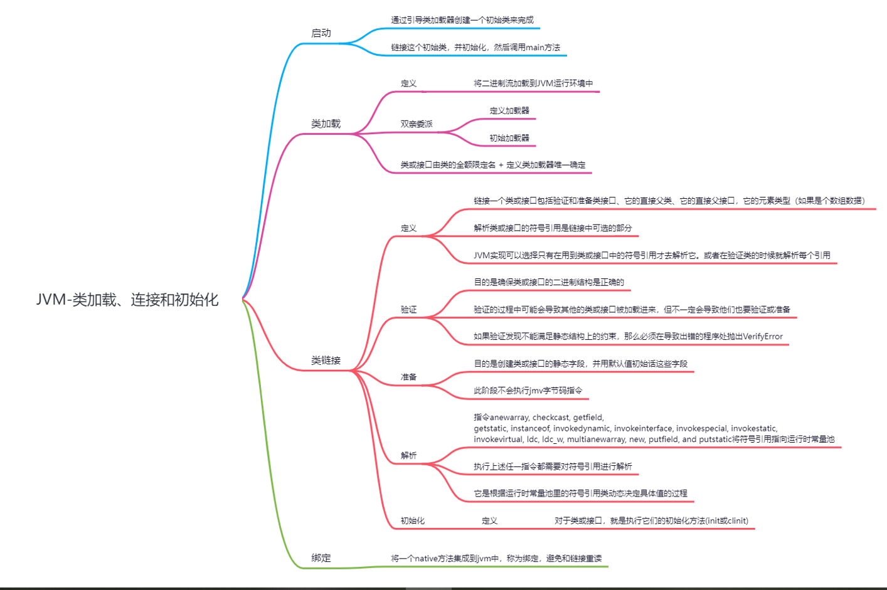

# jvm结构

## DataType

JVM操作的类型包括原始类型和引用类型，相对应的有原始类型的值和引用类型的值，

类型的校验-JVM希望编译器在编译期间尽可能的就能对类型做检查，是的jvm运行期间无需进行此类操作。

虚拟机的指令本身就可以确定操作的实际类型，比如iadd, ladd, fadd, and dadd是4个两个数值相加的操作赋，他们对应的4中操作类型是int，long，float和double

jvm支持对象，可以是实例或数组，对实例或数组的引用被称为引用类型，他们的值可以认为就是对象的指针。一个对象可以有多个引用存在。对象的操作都是通过引用他们的引用值来操作

### 总结

## 原始类型和值

分为数值类型，布尔类型和返回地址类型。

## 引用类型和值

## 运行时数据区

## 栈帧

# JVM编译

jvm编译器

# 类的加载、链接和初始化

