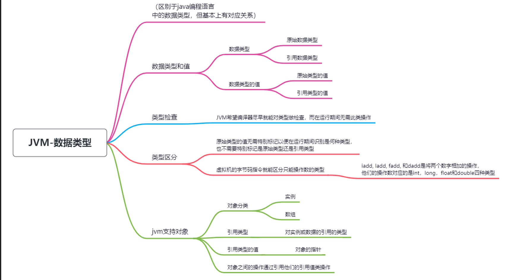
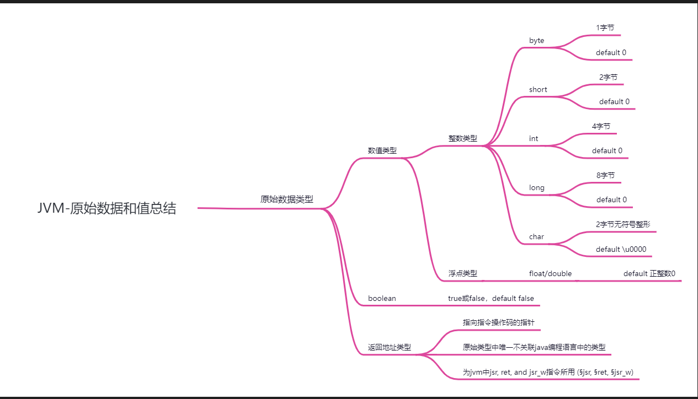
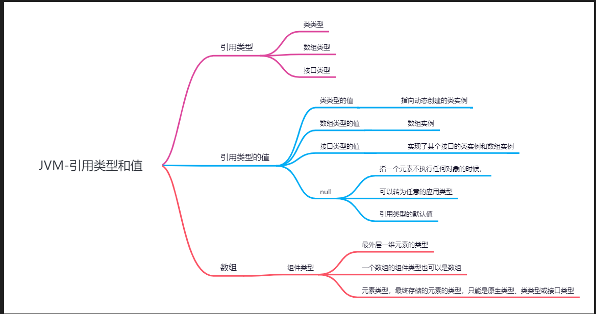
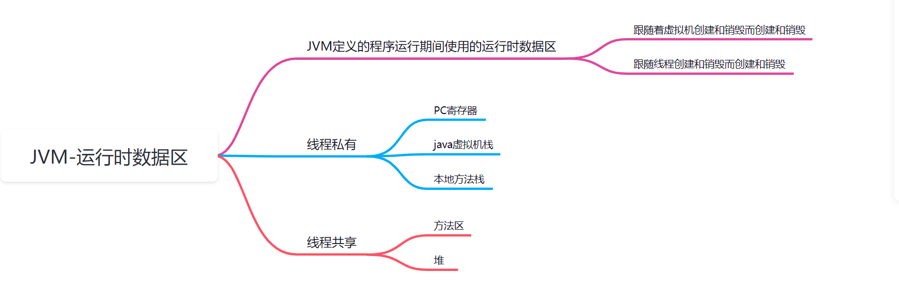
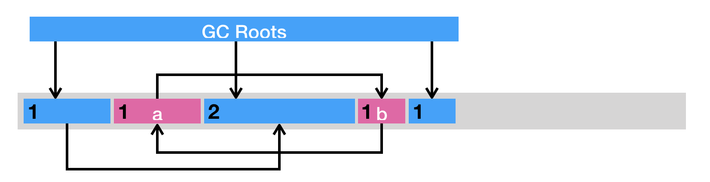

# jvm结构

## DataType

JVM操作的类型包括原始类型和引用类型，相对应的有原始类型的值和引用类型的值，

类型的校验-JVM希望编译器在编译期间尽可能的就能对类型做检查，是的jvm运行期间无需进行此类操作。

虚拟机的指令本身就可以确定操作的实际类型，比如iadd, ladd, fadd, and dadd是4个两个数值相加的操作赋，他们对应的4中操作类型是int，long，float和double

jvm支持对象，可以是实例或数组，对实例或数组的引用被称为引用类型，他们的值可以认为就是对象的指针。一个对象可以有多个引用存在。对象的操作都是通过引用他们的引用值来操作

### 总结

## 原始类型和值

分为数值类型，布尔类型和返回地址类型。

## 引用类型和值

## 运行时数据区

## 栈帧

# JVM编译

jvm编译器

# 类的加载、链接和初始化

.jpg)

# 垃圾回收

## 如何辨别对象已死亡？

### 引用计算法

也就是每个对象搞一个计数器，只要有某个引用指向这个对象，那么就+1，如果对象上有引用被指向了其他对象，那么就-1.

特点：

1. 额外的存储空间
2. 繁琐的更新操作
3. 致命的缺点：循环引用无法辨别的问题。

a和b对象互相引用，a的计算器是1，b的计算器是1，a和b没有其他任何引用指向他们。ab是死亡对象，但是ab永远不可能回收（因为计算器都是1不是0）

### 可达性分析

将一些列GC Root对象作为初始的存活对象合集，从根对象开始，探索被该集合引用到的对象，并加入该集合（这个过程称为标记），最后剩下的未被探索到的对象就是死亡对象，可以回收。

这里就引出GC root的定义。可以暂时理解未堆外对堆内的引用。包括但不限于：

1. java方法栈帧中的局部变量
2. 已加载类的静态变量
3. JNI handlers
4. 已启动且未停止的java线程。

可达性分析可以解决引用计数法所不能解决的循环引用问题

虽然可达性分析的算法本身很简明，但是在实践中还是有不少其他问题需要解决的。比如说，在多线程环境下，其他线程可能会更新已经访问过的对象中的引用，从而造成误报（将引用设置为 null）或者漏报（将引用设置为未被访问过的对象）。

误报并没有什么伤害，Java 虚拟机至多损失了部分垃圾回收的机会。漏报则比较麻烦，因为垃圾回收器可能回收事实上仍被引用的对象内存。一旦从原引用访问已经被回收了的对象，则很有可能会直接导致 Java 虚拟机崩溃。

如何解决？

#### stop the world 及安全点

传统方式：stop the world，直到垃圾回收工作完成，然后其他线程继续。

java虚拟机的做法是安全点机制，也就是当发生需要线程暂停的事件（比如GC，heap dump等），会等待所有的线程到达安全点并暂停，等待GC等完成后再继续从安全点处继续执行。

当然，安全点的初始目的并不是让其他线程停下，而是找到一个稳定的执行状态。在这个执行状态下，Java 虚拟机的堆栈不会发生变化。这么一来，垃圾回收器便能够“安全”地执行可达性分析。

那么安全点如何设置？我们可以看看根据线程的状态做不同的处理：

1. 正在调用JNI本地方法，由于本地代码需要通过 JNI 的 API 来完成上述三个操作，因此 Java 虚拟机仅需在 API 的入口处进行安全点检测（safepoint poll），测试是否有其他线程请求停留在安全点里，便可以在必要的时候挂起当前线程。
2. 解释执行字节码时，字节码与字节码之间皆可作为安全点，Java 虚拟机采取的做法是，当有安全点请求时，执行一条字节码便进行一次安全点检测。
3. 执行即时编译器生成的机器码则比较复杂。由于这些代码直接运行在底层硬件之上，不受 Java 虚拟机掌控，因此在生成机器码时，即时编译器需要插入安全点检测，以避免机器码长时间没有安全点检测的情况。HotSpot 虚拟机的做法便是在生成代码的方法出口以及非计数循环的循环回边（back-edge）处插入安全点检测。
4. 线程阻塞，阻塞的线程由于处于 Java 虚拟机线程调度器的掌控之下，因此属于安全点

另外安全点机制并不仅仅GC才会用到，其他的一些要求一致性的操作也可能会用到。

当标记完所有的对象，并可以对死亡对象进行垃圾回收了。主流的垃圾回收算法分如下几种：

1. 清除（sweep），也就是将死亡对象占据的空闲空间放到一个空闲列表中，如果有新对象需要分派空间，就从空闲列表中选择一个进行分配，

   >缺点：
   >
   >1. 内存碎片，因为堆中对象的地址必须是连续的，就会造成很多内存无法正好匹配对象的内存，造成所有的空闲总内存是够的，但是却无法分配的极端情况。
   >2. 分配效率低，你想如果是连续的空间，我直接通过一个指针就行，要多少我分配多少，指针移动多少位，下一个要分配的内存就从指针位置分配就行了。如果是不连续的，那这个就要根据空闲列表来查找可用的内存了。

2. 压缩(compact)，即把存活的对象聚集到内存区域的起始位置，从而留下一段连续的内存空间。这种做法能够解决内存碎片化的问题，但代价是压缩算法的性能开销

3. 复制（copy），即把内存区域分为两等分，分别用两个指针 from 和 to 来维护，并且只是用 from 指针指向的内存区域来分配内存。当发生垃圾回收时，便把存活的对象复制到 to 指针指向的内存区域中，并且交换 from 指针和 to 指针的内容。复制这种回收方式同样能够解决内存碎片化的问题，但是它的缺点也极其明显，即堆空间的使用效率极其低下。

