# 入门篇

## 创建容器镜像：如何编写正确、搞笑的Dockerfile

因为构建的镜像的第一条指令是FROM，因此选择镜像非常关键，如果关注的是镜像的安全和大小，那么可以选择Alpine；如果关注的是稳定性，那么可以选择Ubuntu，Centos，Debian

```dockerfile
FROM alpine:3.15                # 选择Alpine镜像
FROM ubuntu:bionic              # 选择Ubuntu镜像
```

### COPY

我们在本机上开发测试时会产生一些源码、配置等文件，需要打包进镜像里，这时可以使用 COPY 命令，它的用法和 Linux 的 cp 差不多，不过拷贝的源文件必须是“构建上下文”路径里的，不能随意指定文件。也就是说，如果要从本机向镜像拷贝文件，就必须把这些文件放到一个专门的目录，然后在 docker build 里指定“构建上下文”到这个目录才行。

我们一般用docker build是这么用的

```bash
# docker build [OPTIONS] PATH | URL | -
比如：
docker build -f Dockerfile.xxx -t "hello" .
docker build -t "hello" .
# 这里注意.号就是上下文路径，.号表示当前路径，表示运行docker命令的路径，如果你需要copy的文件在其他地方，需要指明这个路径
```

如果我们把dockerfile里面要COPY的文件放在执行docker build命令的目录，那么就要使用.号，否则要指明COPY的文件放置的那个路径。

```dockerfile
COPY ./a.txt  /tmp/a.txt    # 把构建上下文里的a.txt拷贝到镜像的/tmp目录。注意一定是构建上下文的a.txt，而不是当前目录
COPY /etc/hosts  /tmp       # 错误！不能使用构建上下文之外的文件
```

### RUN

再看看RUN命令：

RUN 通常会是 Dockerfile 里最复杂的指令，会包含很多的 Shell 命令，但 Dockerfile 里一条指令只能是一行，所以有的 RUN 指令会在每行的末尾使用续行符 \，命令之间也会用 && 来连接，这样保证在逻辑上是一行，就像下面这样：

```dockerfile
RUN apt-get update \
    && apt-get install -y \
        build-essential \
        curl \
        make \
        unzip \
    && cd /tmp \
    && curl -fSL xxx.tar.gz -o xxx.tar.gz\
    && tar xzf xxx.tar.gz \
    && cd xxx \
    && ./config \
    && make \
    && make clean
```

有的时候在 Dockerfile 里写这种超长的 RUN 指令很不美观，而且一旦写错了，每次调试都要重新构建也很麻烦，所以你可以采用一种变通的技巧：**把这些 Shell 命令集中到一个脚本文件里，用 COPY 命令拷贝进去再用 RUN 来执行**：

```dockerfile

COPY setup.sh  /tmp/                # 拷贝脚本到/tmp目录

RUN cd /tmp && chmod +x setup.sh \  # 添加执行权限
    && ./setup.sh && rm setup.sh    # 运行脚本然后再删除
```

RUN 指令实际上就是 Shell 编程，如果你对它有所了解，就应该知道它有变量的概念，可以实现参数化运行，这在 Dockerfile 里也可以做到，需要使用两个指令 ARG 和 ENV

### ARG和ENV

它们区别在于 ARG 创建的变量只在镜像构建过程中可见，容器运行时不可见，而 ENV 创建的变量不仅能够在构建镜像的过程中使用，在容器运行时也能够以环境变量的形式被应用程序使用。

下面是一个简单的例子，使用 ARG 定义了基础镜像的名字（可以用在“FROM”指令里），使用 ENV 定义了两个环境变量：

```dockerfile

ARG IMAGE_BASE="node"
ARG IMAGE_TAG="alpine"

ENV PATH=$PATH:/tmp
ENV DEBUG=OFF
```

还有一个重要的指令是 EXPOSE，它用来声明容器对外服务的端口号，对现在基于 Node.js、Tomcat、Nginx、Go 等开发的微服务系统来说非常有用:

```dockerfile
EXPOSE 443           # 默认是tcp协议
EXPOSE 53/udp        # 可以指定udp协议
```

讲了这些 Dockerfile 指令之后，我还要特别强调一下，因为每个指令都会生成一个镜像层，所以 Dockerfile 里最好不要滥用指令，尽量精简合并，否则太多的层会导致镜像臃肿不堪。

### docker build 是怎么工作的

Dockerfile 必须要经过 docker build 才能生效，所以我们再来看看 docker build 的详细用法。

刚才在构建镜像的时候，你是否对“构建上下文”这个词感到有些困惑呢？它到底是什么含义呢？要弄清楚我们首先要知道docker build实际的工作是由docker daemon完成的（实际上这也是docker client和docker daemon这种架构决定的），docker命令只是一个简单的客户端，否则将用户的请求发到真正处理事情的docker daemon。那这样的话，docker daemon当然不知道你在**客户端Dockerfile的COPY命令里的客户端本地的文件路径**。 docker所做的工作就是将"构建上下文"这个目录及里面的文件一股脑的打包上传给docker daemon。这样docker daemon才能获取这些文件。

明白了这一点，你就会知道，“构建上下文”其实与 Dockerfile 并没有直接的关系，**它其实指定了要打包进镜像的一些依赖文件**。而 COPY 命令也只能使用基于“构建上下文”的相对路径，因为“Docker daemon”看不到本地环境，只能看到打包上传的那些文件。

现在懂了吧？

但这个机制也会导致一些麻烦，如果目录里有的文件（例如 readme/.git/.svn 等）不需要拷贝进镜像，docker 也会一股脑地打包上传，效率很低。因此类似于.gitignore这种排除文件的方式登场。

你可以在“构建上下文”目录里再建立一个 .dockerignore 文件，语法与 .gitignore 类似，排除那些不需要的文件，下面是一个简单的示例，表示不打包上传后缀是“swp”“sh”的文件：

```
# docker ignore
*.swp
*.sh
```

另外关于 Dockerfile，一般应该在命令行里使用 -f 来显式指定。但如果省略这个参数，docker build 就会在当前目录下找名字是 Dockerfile 的文件。所以，如果只有一个构建目标的话，文件直接叫“Dockerfile”是最省事的。所以我们经常把dockerfile的名称就叫Dockerfile。

\现在我们使用 docker build 应该就没什么难点了，不过构建出来的镜像只有“IMAGE ID”没有名字，不是很方便。为此你可以加上一个 -t 参数，也就是指定镜像的标签（tag），这样 Docker 就会在构建完成后自动给镜像添加名字。当然，名字必须要符合上节课里的命名规范，用 : 分隔名字和标签，如果不提供标签默认就是“latest”

分享一下：


## 容器镜像：如何利用好docker hub这个宝藏

### 什么是Registry


看一下虚线流程（docker pull）：请求先到daemon，然后再从Registry拉取镜像放到本地。只有当 Registry 里存有镜像才能真正把它下载到本地。当然了，拉取镜像只是镜像仓库最基本的一个功能，它还会提供更多的功能，比如上传、查询、删除等等，是一个全面的镜像管理服务站点。

### 什么是docker hub

不过，你有没有注意到，在使用 docker pull 获取镜像的时候，我们并没有明确地指定镜像仓库。在这种情况下，Docker 就会使用一个默认的镜像仓库，也就是大名鼎鼎的“Docker Hub”（https://hub.docker.com/）。

Docker Hub 是 Docker 公司搭建的官方 Registry 服务，创立于 2014 年 6 月，和 Docker 1.0 同时发布。它号称是世界上最大的镜像仓库，和 GitHub 一样，几乎成为了容器世界的基础设施。

但和 GitHub、App Store 一样，面向所有人公开的 Docker Hub 也有一个不可避免的缺点，就是“良莠不齐”

### 如何在 Docker Hub 上挑选镜像

首先，你应该知道，在 Docker Hub 上有**官方镜像**、**认证镜像**和**非官方镜像**的区别

官方镜像是指 Docker 公司官方提供的高质量镜像（https://github.com/docker-library/official-images），都经过了严格的漏洞扫描和安全检测，支持 x86_64、arm64 等多种硬件架构，还具有清晰易读的文档，一般来说是我们构建镜像的首选，也是我们编写 Dockerfile 的最佳范例。

官方镜像目前有大约 100 多个，基本上囊括了现在的各种流行技术，下面就是官方的 Nginx 镜像网页截图

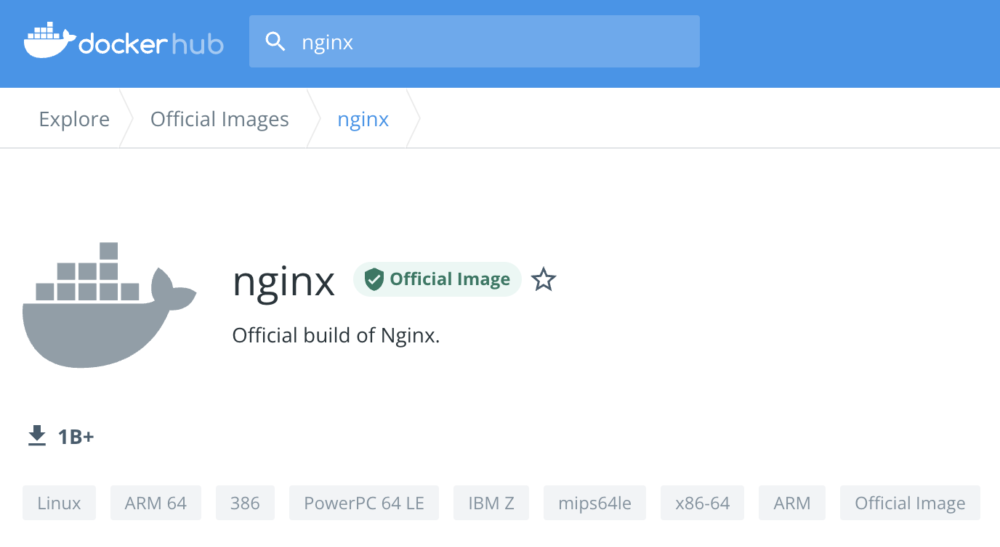


你会看到，官方镜像会有一个特殊的“Official image”的标记，这就表示这个镜像经过了 Docker 公司的认证，有专门的团队负责审核、发布和更新，质量上绝对可以放心。

第二类是认证镜像，标记是“Verified publisher”，也就是认证发行商，比如 Bitnami、Rancher、Ubuntu 等。它们都是颇具规模的大公司，具有不逊于 Docker 公司的实力，所以就在 Docker Hub 上开了个认证账号，发布自己打包的镜像，有点类似我们微博上的“大 V”。

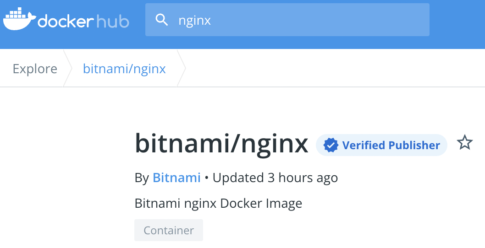


这些镜像有公司背书，当然也很值得信赖，不过它们难免会带上一些各自公司的“烙印”，比如 Bitnami 的镜像就统一以“minideb”为基础，灵活性上比 Docker 官方镜像略差，有的时候也许会不符合我们的需求。

除了官方镜像和认证镜像，剩下的就都属于非官方镜像了，不过这里面也可以分出两类。第一类是“半官方”镜像。因为成为“Verified publisher”是要给 Docker 公司交钱的，而很多公司不想花这笔“冤枉钱”，所以只在 Docker Hub 上开了公司账号，但并不加入认证。这里我以 OpenResty 为例，看一下它的 Docker Hub 页面，可以看到显示的是 OpenResty 官方发布，但并没有经过 Docker 正式认证，所以难免就会存在一些风险，有被“冒名顶替”的可能，需要我们在使用的时候留心鉴别一下。不过一般来说，这种“半官方”镜像也是比较可靠的。

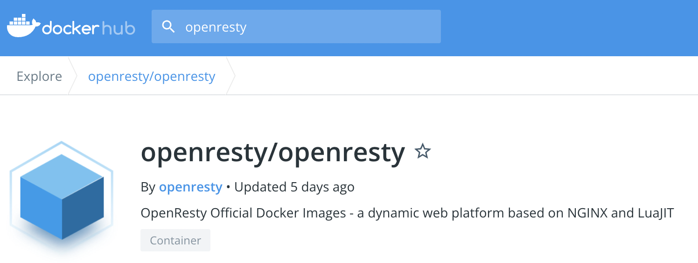

第二类就是纯粹的“民间”镜像了，通常是个人上传到 Docker Hub 的，因为条件所限，测试不完全甚至没有测试，质量上难以得到保证，下载的时候需要小心谨慎。

除了查看镜像是否为官方认证，我们还应该再结合其他的条件来判断镜像质量是否足够好。做法和 GitHub 差不多，就是看它的下载量、星数、还有更新历史，简单来说就是“好评”数量。

一般来说下载量是最重要的参考依据，好的镜像下载量通常都在百万级别（超过 1M），而有的镜像虽然也是官方认证，但缺乏维护，更新不及时，用的人很少，星数、下载数都寥寥无几，那么还是应该选择下载量最多的镜像，通俗来说就是“随大流”。

下面的这张截图就是 OpenResty 在 Docker Hub 上的搜索结果。可以看到，有两个认证发行商的镜像（Bitnami、IBM），但下载量都很少，还有一个“民间”镜像下载量虽然超过了 1M，但更新时间是 3 年前，所以毫无疑问，我们应该选择排在第三位，但下载量超过 10M、有 360 多个星的“半官方”镜像。	

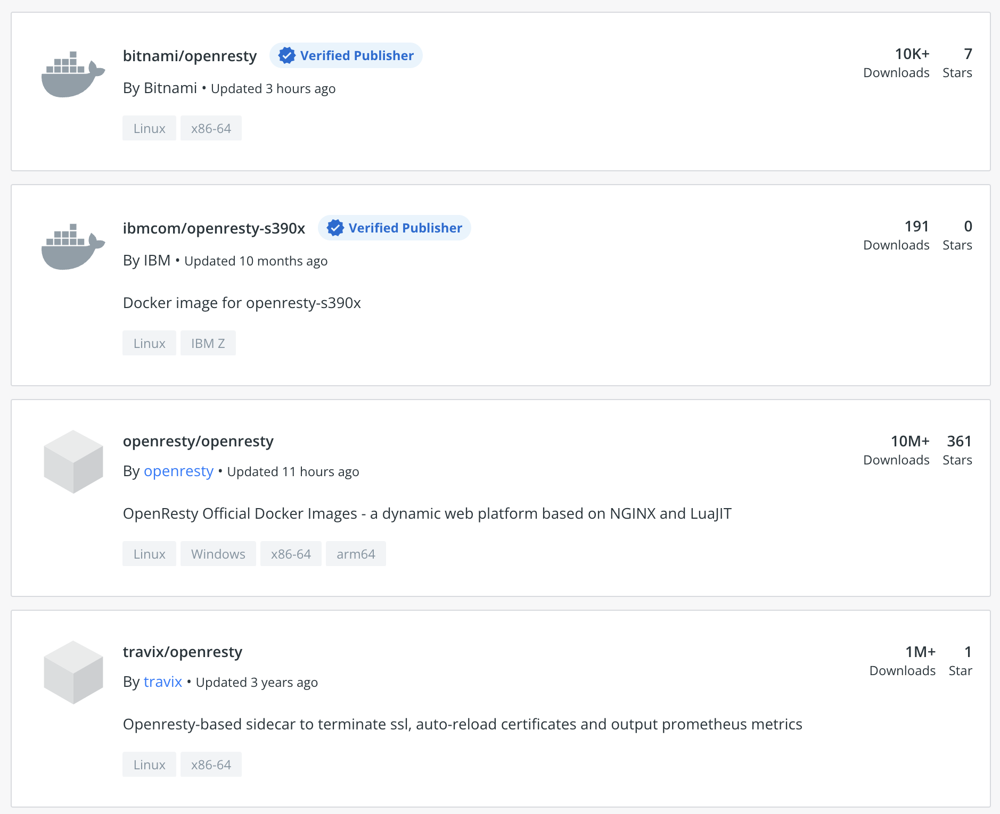

看了这么多 Docker Hub 上的镜像，你一定注意到了，应用都是一样的名字，比如都是 Nginx、Redis、OpenResty，该怎么区分不同作者打包出的镜像呢？

如果你熟悉 GitHub，就会发现 Docker Hub 也使用了同样的规则，就是“用户名 / 应用名”的形式，比如 bitnami/nginx、ubuntu/nginx、rancher/nginx 等等。

所以，我们在使用 docker pull 下载这些非官方镜像的时候，就必须把用户名也带上，否则默认就会使用官方镜像

```bash
docker pull bitnami/nginx
docker pull ubuntu/nginx
# 不带上用户名就是直接下载官方的了。
```

确定了要使用的镜像还不够，因为镜像还会有许多不同的版本，也就是“标签”（tag）。直接使用默认的“latest”虽然简单方便，但在生产环境里是一种非常不负责任的做法，会导致版本不可控。所以我们还需要理解 Docker Hub 上标签命名的含义，才能够挑选出最适合我们自己的镜像版本。

通常来说，镜像标签的格式是应用的版本号加上操作系统。

版本号你应该比较了解吧，基本上都是主版本号 + 次版本号 + 补丁号的形式，有的还会在正式发布前出 rc 版（候选版本，release candidate）。而操作系统的情况略微复杂一些，因为各个 Linux 发行版的命名方式“花样”太多了。

Alpine、CentOS 的命名比较简单明了，就是数字的版本号，像这里的 alpine3.15 ，而 Ubuntu、Debian 则采用了代号的形式。比如 Ubuntu 18.04 是 bionic，Ubuntu 20.04 是 focal，Debian 9 是 stretch，Debian 10 是 buster，Debian 11 是 bullseye。

另外，有的标签还会加上 slim、fat，来进一步表示这个镜像的内容是经过精简的，还是包含了较多的辅助工具。通常 slim 镜像会比较小，运行效率高，而 fat 镜像会比较大，适合用来开发调试。

下面我就列出几个标签的例子来说明一下。

- nginx:1.21.6-alpine，表示版本号是 1.21.6，基础镜像是最新的 Alpine。
- redis:7.0-rc-bullseye，表示版本号是 7.0 候选版，基础镜像是 Debian 11。
- node:17-buster-slim，表示版本号是 17，基础镜像是精简的 Debian 10。

### 该怎么上传自己的镜像

第一步，你需要在 Docker Hub 上注册一个用户，这个就不必再多说了。

第二步，你需要在本机上使用 docker login 命令，用刚才注册的用户名和密码认证身份登录，像这里就用了我的用户名“chronolaw”。

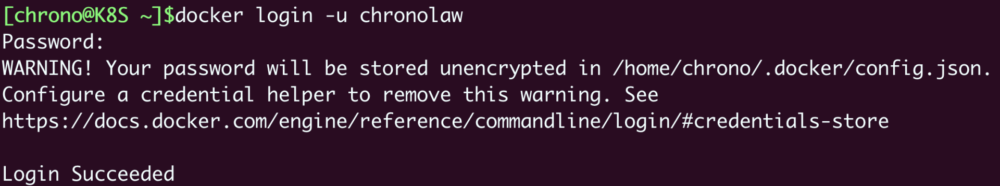

第三步很关键，需要使用 docker tag 命令，给镜像改成带用户名的完整名字，表示镜像是属于这个用户的。或者简单一点，直接用 docker build -t 在创建镜像的时候就起好名字。

这里我就用上次课里的镜像“ngx-app”作为例子，给它改名成 chronolaw/ngx-app:1.0。

```bash
docker tag ngx-app chronolaw/ngx-app:1.0
```

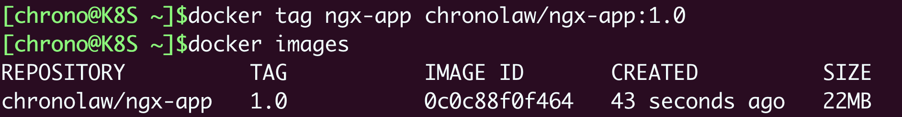

第四步，用 docker push 把这个镜像推上去，我们的镜像发布工作就大功告成了。

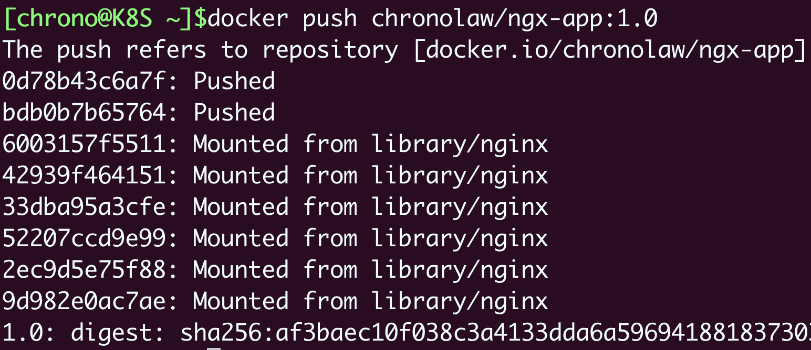

### 离线环境怎么办？

自建啊。

自建 Registry 已经有很多成熟的解决方案，比如 Docker Registry，还有 CNCF Harbor，不过使用它们还需要一些目前没有讲到的知识，步骤也有点繁琐，所以我会在后续的课程里再介绍。

下面我讲讲存储、分发镜像的一种“笨”办法，虽然比较“原始”，但简单易行，可以作为临时的应急手段。

Docker 提供了 save 和 load 这两个镜像归档命令，可以把镜像导出成压缩包，或者从压缩包导入 Docker，而压缩包是非常容易保管和传输的，可以联机拷贝，FTP 共享，甚至存在 U 盘上随身携带。

需要注意的是，这两个命令默认使用标准流作为输入输出（为了方便 Linux 管道操作），所以一般会用 -o、-i 参数来使用文件的形式

```
docker save ngx-app:latest -o ngx.tar
docker load -i ngx.tar
```


## 打破次元壁：容器该如何与外界互联互通

那么今天，我就以 Docker 为例，来讲讲有哪些手段能够在容器与外部系统之间沟通交流

### 如何拷贝容器内的数据

```bash
docker run -d --rm redis
```

注意这里使用了 -d、--rm 两个参数，表示运行在后台，容器结束后自动删除，然后使用 docker ps 命令可以看到 Redis 容器正在运行，容器 ID 是“062”

使用docker cp就可以，它可以在宿主机和容器之间拷贝文件，是最基本的一种数据交换功能。

docker cp 的用法很简单，很类似 Linux 的“cp”“scp”，指定源路径（src path）和目标路径（dest path）就可以了。如果源路径是宿主机那么就是把文件拷贝进容器，如果源路径是容器那么就是把文件拷贝出容器，注意需要用容器名或者容器 ID 来指明是哪个容器的路径。

比如容器ID是062，要从宿主机copy文件到容器内部，那么：

```bash
docker cp a.txt 062:/tmp
```

反过来，就是把容器内的文件copy到宿主机：

```bash
docker cp 062:/tmp/a.txt ./b.txt
```

### 如何共享主机上的文件

docker cp 的用法模仿了操作系统的拷贝命令，偶尔一两次的文件共享还可以应付，如果容器运行时经常有文件来往互通，这样反复地拷来拷去就显得很麻烦，也很容易出错。

你也许会联想到虚拟机有一种“共享目录”的功能。它可以在宿主机上开一个目录，然后把这个目录“挂载”进虚拟机，这样就实现了两者共享同一个目录，一边对目录里文件的操作另一边立刻就能看到，没有了数据拷贝，效率自然也会高很多。

沿用这个思路，容器也提供了这样的共享宿主机目录的功能，效果也和虚拟机几乎一样，用起来很方便，只需要在 docker run 命令启动容器的时候使用 -v 参数就行，具体的格式是“**宿主机路径: 容器内路径**”

我还是以 Redis 为例，启动容器，使用 -v 参数把本机的“/tmp”目录挂载到容器里的“/tmp”目录，也就是说让容器共享宿主机的“/tmp”目录。

```bash
# -d后台运行，--rm运行结束后自动删除， -v将宿主机目录挂载到容器内目录，实现共享
docker run -d --rm -v /tmp:/tmp redis
```

然后再用docker exec进入：

```bash
# 这时候就能看到宿主机的/tmp下的所有内容，实现了共享。
docker exec -it b5a sh    # b5a是容器ID
```

你也可以在容器里的“/tmp”目录下随便做一些操作，比如删除文件、建立新目录等等，再回头观察一下宿主机，会发现修改会即时同步，这就表明容器和宿主机确实已经共享了这个目录。

-v 参数挂载宿主机目录的这个功能，对于我们日常开发测试工作来说非常有用，我们可以在不变动本机环境的前提下，使用镜像安装任意的应用，然后直接以容器来运行我们本地的源码、脚本，非常方便。

这里我举一个简单的例子。比如我本机上只有 Python 2.7，但我想用 Python 3 开发，如果同时安装 Python 2 和 Python 3 很容易就会把系统搞乱，所以我就可以这么做：

1. 先使用 docker pull 拉取一个 Python 3 的镜像，因为它打包了完整的运行环境，运行时有隔离，所以不会对现有系统的 Python 2.7 产生任何影响。
2. 在本地的某个目录编写 Python 代码，然后用 -v 参数让容器共享这个目录。
3. 现在就可以在容器里以 Python 3 来安装各种包，再运行脚本做开发了

```bash
# 挂载
docker pull python:alpine
docker run -it --rm -v `pwd`:/tmp python:alpine sh
```

### 实现网络互通

现在我们使用 docker cp 和 docker run -v 可以解决容器与外界的文件互通问题，但对于 Nginx、Redis 这些服务器来说，网络互通才是更要紧的问题

Docker 提供了三种网络模式，分别是 null、host 和 bridge。

**null** 是最简单的模式，也就是没有网络，但允许其他的网络插件来自定义网络连接，这里就不多做介绍了。

**host** 的意思是直接使用宿主机网络，相当于去掉了容器的网络隔离（其他隔离依然保留），所有的容器会共享宿主机的 IP 地址和网卡。这种模式没有中间层，自然通信效率高，但缺少了隔离，运行太多的容器也容易导致端口冲突。

host 模式需要在 docker run 时使用 --net=host 参数，下面我就用这个参数启动 Nginx：

```bash
# host模式。共享所主机网络
docker run -d --rm --net=host nginx:alpine
```

第三种 **bridge**，也就是桥接模式，它有点类似现实世界里的交换机、路由器，只不过是由软件虚拟出来的，容器和宿主机再通过虚拟网卡接入这个网桥（图中的 docker0），那么它们之间也就可以正常的收发网络数据包了。不过和 host 模式相比，bridge 模式多了虚拟网桥和网卡，通信效率会低一些。

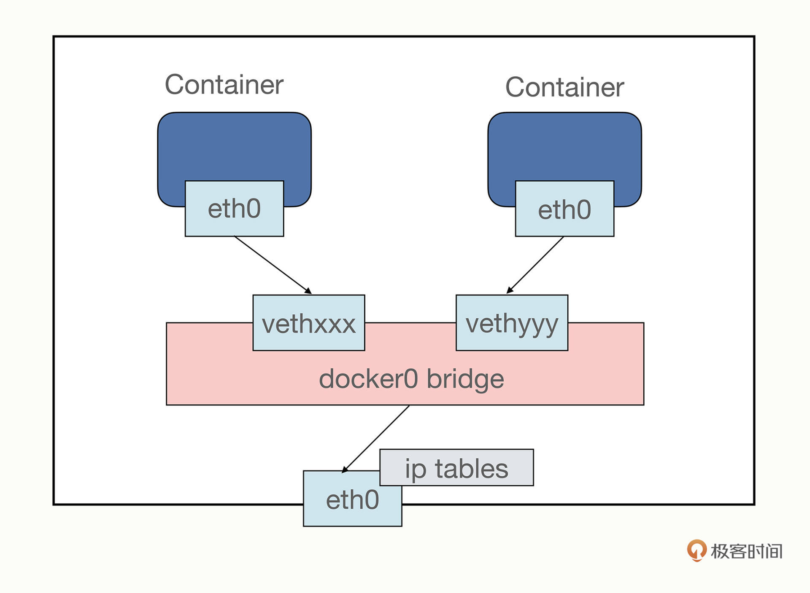


和 host 模式一样，我们也可以用 --net=bridge 来启用桥接模式，但其实并没有这个必要，因为 Docker 默认的网络模式就是 bridge，所以一般不需要显式指定。

```bash
docker run -d --rm nginx:alpine    # 默认使用桥接模式
docker run -d --rm redis           # 默认使用桥接模式
```

可以通过inspect查看ip信息：

```bash
# 
docker inspect xxx |grep IPAddress
```

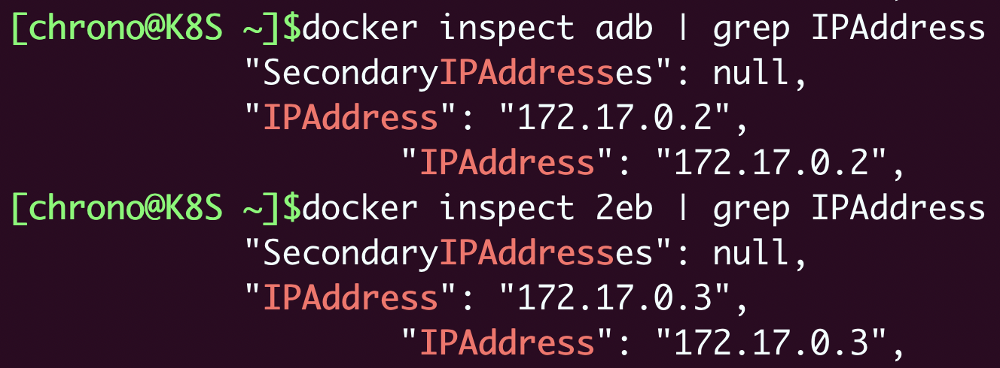


这显示出两个容器的 IP 地址分别是“172.17.0.2”和“172.17.0.3”，而宿主机的 IP 地址则是“172.17.0.1”，所以它们都在“172.17.0.0/16”这个 Docker 的默认网段，彼此之间就能够使用 IP 地址来实现网络通信了

### 如何分配服务端口号

使用 host 模式或者 bridge 模式，我们的容器就有了 IP 地址，建立了与外部世界的网络连接，接下来要解决的就是网络服务的端口号问题。

你一定知道，服务器应用都必须要有端口号才能对外提供服务，比如 HTTP 协议用 80、HTTPS 用 443、Redis 是 6379、MySQL 是 3306。第 4 讲我们在学习编写 Dockerfile 的时候也看到过，可以用 EXPOSE 指令声明容器对外的端口号。

一台主机上的端口号数量是有限的，而且多个服务之间还不能够冲突，但我们打包镜像应用的时候通常都使用的是默认端口，容器实际运行起来就很容易因为端口号被占用而无法启动。

解决这个问题的方法就是加入一个“中间层”，由容器环境例如 Docker 来统一管理分配端口号，在本机端口和容器端口之间做一个“映射”操作，容器内部还是用自己的端口号，但外界看到的却是另外一个端口号，这样就很好地避免了冲突。

**端口号映射需要使用 bridge 模式，并且在 docker run 启动容器时使用 -p 参数，形式和共享目录的 -v 参数很类似，用 : 分隔本机端口和容器端口**，比如，如果要启动两个 Nginx 容器，分别跑在 80 和 8080 端口上：

```bash
# 连个容器，再两个不同的端口号上。
docker run -d -p 80:80 --rm nginx:alpine
docker run -d -p 8080:80 --rm nginx:alpine
# 可以用docker ps看到映射的端口号
docker ps
```


## 玩转docker

### 搭建WordPress网站

```bash
# 拉取
docker pull wordpress:5
docker pull mariadb:10
docker pull nginx:alpine
```


# 初级篇

## YAML

yaml是kubectl世界里的通用语言，k8s里的所有对象都可以使用yaml进行描述，yaml是json的超级。关于yaml，具体可以参考官网：https://yaml.org/来查看不同版本的specification

## k8s对象

k8s有各种不同的对象，这些对象都有各自不同的yaml描述文件进行描述。这些不同对象的yaml描述文件遵循着共同的规范，我们来看一下。

```yaml
apiVersion: v1      # api版本号，参考kubectl api-resources
kind: Pod           # kind，对象的类型，比如Pod就是pod对象
metadata:           # metadata，元数据信息，
  name: ngx-pod        # name，对象的名称
  labels:              # labels，对象的标签，可以任意添加，key-value
    env: demo
    owner: chrono

# 你所期望的对象的状态
# 如下是一个pod的期望状态，spec里面就是一个containers数组，里面的每个元素又是一个对象
spec:
  containers:
  - image: nginx:alpine         # 镜像
    name: ngx                   # 名称
    ports:                      # 端口
    - containerPort: 80
```

apiVersion、kind、metadata 都被 kubectl 用于生成 HTTP 请求发给 apiserver，你可以用 --v=9 参数在请求的 URL 里看到它们。比如：

```http
https://192.168.49.2:8443/api/v1/namespaces/default/pods/ngx-pod
```

和 HTTP 协议一样，“header”里的 apiVersion、kind、metadata 这三个字段是任何对象都必须有的，而“body”部分则会与对象特定相关，每种对象会有不同的规格定义，在 YAML 里就表现为 spec 字段（即 specification），表示我们对对象的“期望状态”（desired status）

这份 YAML 文档完整地描述了一个类型是 Pod 的 API 对象，要求使用 v1 版本的 API 接口去管理，其他更具体的名称、标签、状态等细节都记录在了 metadata 和 spec 字段等里。

## 如何创建或删除k8s对象

```bash
kubectl apply -f ngx-pod.yml
kubectl delete -f ngx-pod.yml
```

Kubernetes 收到这份“声明式”的数据，再根据 HTTP 请求里的 POST/DELETE 等方法，就会自动操作这个资源对象，至于对象在哪个节点上、怎么创建、怎么删除完全不用我们操心。

## 如何编写YAML

### 1 查阅官方文档

https://kubernetes.io/docs/reference/kubernetes-api/，确定是很细很麻烦

### 2参考kubectl api-resources

### 3使用kubectl explain

比如，想看pod顶层相关字段：

```bash
fxy@master:~$ kubectl explain pod
KIND:     Pod
VERSION:  v1

DESCRIPTION:
     Pod is a collection of containers that can run on a host. This resource is
     created by clients and scheduled onto hosts.

FIELDS:
   apiVersion   <string>
     APIVersion defines the versioned schema of this representation of an
     object. Servers should convert recognized schemas to the latest internal
     value, and may reject unrecognized values. More info:
     https://git.k8s.io/community/contributors/devel/sig-architecture/api-conventions.md#resources

   kind <string>
     Kind is a string value representing the REST resource this object
     represents. Servers may infer this from the endpoint the client submits
     requests to. Cannot be updated. In CamelCase. More info:
     https://git.k8s.io/community/contributors/devel/sig-architecture/api-conventions.md#types-kinds

   metadata     <Object>
     Standard object's metadata. More info:
     https://git.k8s.io/community/contributors/devel/sig-architecture/api-conventions.md#metadata

   spec <Object>
     Specification of the desired behavior of the pod. More info:
     https://git.k8s.io/community/contributors/devel/sig-architecture/api-conventions.md#spec-and-status

   status       <Object>
     Most recently observed status of the pod. This data may not be up to date.
     Populated by the system. Read-only. More info:
     https://git.k8s.io/community/contributors/devel/sig-architecture/api-conventions.md#spec-and-status

```

然后，你可能对spec比较感兴趣，想知道具体怎么写，可以（因为太长，只截取了一部分）：

```bash
fxy@master:~$ kubectl explain pod.spec
KIND:     Pod
VERSION:  v1

RESOURCE: spec <Object>

DESCRIPTION:
     Specification of the desired behavior of the pod. More info:
     https://git.k8s.io/community/contributors/devel/sig-architecture/api-conventions.md#spec-and-status

     PodSpec is a description of a pod.

FIELDS:
   activeDeadlineSeconds        <integer>
     Optional duration in seconds the pod may be active on the node relative to
     StartTime before the system will actively try to mark it failed and kill
     associated containers. Value must be a positive integer.

   affinity     <Object>
     If specified, the pod's scheduling constraints

   automountServiceAccountToken <boolean>
     AutomountServiceAccountToken indicates whether a service account token
     should be automatically mounted.

   containers   <[]Object> -required-
     List of containers belonging to the pod. Containers cannot currently be
     added or removed. There must be at least one container in a Pod. Cannot be
     updated.
```

可以看到spec下有containers等字段，其中containers还是必须的。另外还标出了这个字段是一个数组还是一个对象，还是一个key-value。

### 4直接使用--dry-run=client和-o yaml自动生成模板

比如，生成一个名称为ngx，镜像为nginx：alpine，那么可以用如下命令：

```bash
fxy@master:~$ kubectl run ngx --image=nginx:alpine --dry-run=client -o yaml
apiVersion: v1
kind: Pod
metadata:
  creationTimestamp: null
  labels:
    run: ngx
  name: ngx
spec:
  containers:
  - image: nginx:alpine
    name: ngx
    resources: {}
  dnsPolicy: ClusterFirst
  restartPolicy: Always
status: {}
```

然后你就可以基于这个生成的“模板”来定制修改了。


# 中篇

## 使用kubeadm来搭建k8s

可以用kubeadm来搭建一个k8s环境

### 环境准备

所谓的多节点集群，要求服务器应该有两台或者更多，为了简化我们只取最小值，所以这个 Kubernetes 集群就只有两台主机，一台是 Master 节点，另一台是 Worker 节点。当然，在完全掌握了 kubeadm 的用法之后，你可以在这个集群里添加更多的节点。我们先用两台，将kubectl安装在master节点，这样的话就是2台机器：

master(192.168.135.132):  至少2 核 CPU、4GB

worker(192.168.135.133): 没有管理工作，只运行业务应用，所以配置可以低一些，为了节省资源我给它分配了 1 核 CPU 和 1GB 的内存，可以说是低到不能再低了

基于模拟生产环境的考虑，在 Kubernetes 集群之外还需要有一台起辅助作用的服务器。它的名字叫 Console，意思是控制台，我们要在上面安装命令行工具 kubectl，所有对 Kubernetes 集群的管理命令都是从这台主机发出去的。这也比较符合实际情况，因为安全的原因，集群里的主机部署好之后应该尽量少直接登录上去操作。这里因为本地只有虚拟机，资源有限，console就先放到master节点

### 安装前的准备工作【所有机器】

因为 Kubernetes 对系统有一些特殊要求，我们必须还要在 Master 和 Worker 节点上做一些准备。这些工作的详细信息你都可以在 Kubernetes 的官网上找到，但它们分散在不同的文档里，比较凌乱，所以我把它们整合到了这里，包括**改主机名**、**改 Docker 配置**、改**网络设置**、改**交换分区**这四步。

1. 由于 Kubernetes 使用主机名来区分集群里的节点，所以每个节点的 hostname 必须不能重名。你需要修改“/etc/hostname”这个文件，把它改成容易辨识的名字，比如 Master 节点就叫 master，Worker 节点就叫 worker。

```bash

sudo vi /etc/hostname
```

2. 安装docker（具体省略），这里安装完之后，需要配置一下/etc/docker/daemon.json。也就是把cgroup的驱动程序改成systemd，然后重启docker的守护进程，如下：

   ```bash
   cat <<EOF | sudo tee /etc/docker/daemon.json
   {
     "exec-opts": ["native.cgroupdriver=systemd"],
     "log-driver": "json-file",
     "log-opts": {
       "max-size": "100m"
     },
     "storage-driver": "overlay2"
   }
   EOF
   
   sudo systemctl enable docker
   sudo systemctl daemon-reload
   sudo systemctl restart docker
   ```

3. 为了让 Kubernetes 能够检查、转发网络流量，你需要修改 iptables 的配置，启用“br_netfilter”模块：

   ```bash
   
   cat <<EOF | sudo tee /etc/modules-load.d/k8s.conf
   br_netfilter
   EOF
   
   cat <<EOF | sudo tee /etc/sysctl.d/k8s.conf
   net.bridge.bridge-nf-call-ip6tables = 1
   net.bridge.bridge-nf-call-iptables = 1
   net.ipv4.ip_forward=1 # better than modify /etc/sysctl.conf
   EOF
   
   sudo sysctl --system
   ```

4. 你需要修改“/etc/fstab”，关闭 Linux 的 swap 分区，提升 Kubernetes 的性能：

   ```bash
   
   sudo swapoff -a
   sudo sed -ri '/\sswap\s/s/^#?/#/' /etc/fstab
   ```

### 安装kubeadm【所有机器】

master和worker都要做这一步

具体安装不再说，主要要换一下国内的源，另外，安装完之后用命令检查一下：

```bash

kubeadm version
kubectl version --client
```

### master节点下载k8s组件镜像

前面我说过，kubeadm 把 apiserver、etcd、scheduler 等组件都打包成了镜像，以容器的方式启动 Kubernetes，但这些镜像不是放在 Docker Hub 上，而是放在 Google 自己的镜像仓库网站 gcr.io，而它在国内的访问很困难，直接拉取镜像几乎是不可能的

所以我们需要采取一些变通措施，提前把镜像下载到本地

1. 先用命令获取一下k8s所需要的镜像列表：

   

```bash
# 无版本号的命令
kubeadm config images list
# 建议指定命令来获取镜像列表
kubeadm config images list --kubernetes-version v1.23.3
```

2. 从国内的镜像下载后改名称，可以用下面的shell脚本：

   ```shell
   # 改成你的镜像站点，注意最好先docker pull 测试一下
   repo=registry.aliyuncs.com/google_containers
   
   # 版本改成你自己安装时对应的版本号
   for name in `kubeadm config images list --kubernetes-version v1.23.3`; do
       # 去掉k8s.gcr.io/（包括斜杠）字符k8s.gcr.io，只保留名字
       src_name=${name#k8s.gcr.io/}
       # 去掉coredns/字符，只保留名字
       src_name=${src_name#coredns/}
   
       # 拉取镜像，执行本脚本之前可以先测试一下
       docker pull $repo/$src_name
   
       # 打tag
       docker tag $repo/$src_name $name
       # 删除原始镜像
       docker rmi $repo/$src_name
   done
   ```

3. 通过docker images查看是否已下载好所有组件：

   ```shell
   [root@master opt]# docker images
   REPOSITORY                           TAG       IMAGE ID       CREATED         SIZE
   k8s.gcr.io/kube-apiserver            v1.23.3   f40be0088a83   12 months ago   135MB
   k8s.gcr.io/kube-controller-manager   v1.23.3   b07520cd7ab7   12 months ago   125MB
   k8s.gcr.io/kube-scheduler            v1.23.3   99a3486be4f2   12 months ago   53.5MB
   k8s.gcr.io/kube-proxy                v1.23.3   9b7cc9982109   12 months ago   112MB
   k8s.gcr.io/etcd                      3.5.1-0   25f8c7f3da61   14 months ago   293MB
   k8s.gcr.io/coredns/coredns           v1.8.6    a4ca41631cc7   15 months ago   46.8MB
   k8s.gcr.io/pause                     3.6       6270bb605e12   17 months ago   683kB
   ```

   

### 安装master节点

然后开始安装master节点，在本人的机器上一开始是遇到如下错误的：

```bash
[root@master opt]# kubeadm init --pod-network-cidr=10.10.0.0/16 --apiserver-advertise-address=192.168.135.132 --kubernetes-version=v1.23.3
[init] Using Kubernetes version: v1.23.3
[preflight] Running pre-flight checks
[preflight] Pulling images required for setting up a Kubernetes cluster
[preflight] This might take a minute or two, depending on the speed of your internet connection
[preflight] You can also perform this action in beforehand using 'kubeadm config images pull'
[certs] Using certificateDir folder "/etc/kubernetes/pki"
[certs] Generating "ca" certificate and key
[certs] Generating "apiserver" certificate and key
[certs] apiserver serving cert is signed for DNS names [kubernetes kubernetes.default kubernetes.default.svc kubernetes.default.svc.cluster.local master] and IPs [10.96.0.1 192.168.135.132]
[certs] Generating "apiserver-kubelet-client" certificate and key
[certs] Generating "front-proxy-ca" certificate and key
[certs] Generating "front-proxy-client" certificate and key
[certs] Generating "etcd/ca" certificate and key
[certs] Generating "etcd/server" certificate and key
[certs] etcd/server serving cert is signed for DNS names [localhost master] and IPs [192.168.135.132 127.0.0.1 ::1]
[certs] Generating "etcd/peer" certificate and key
[certs] etcd/peer serving cert is signed for DNS names [localhost master] and IPs [192.168.135.132 127.0.0.1 ::1]
[certs] Generating "etcd/healthcheck-client" certificate and key
[certs] Generating "apiserver-etcd-client" certificate and key
[certs] Generating "sa" key and public key
[kubeconfig] Using kubeconfig folder "/etc/kubernetes"
[kubeconfig] Writing "admin.conf" kubeconfig file
[kubeconfig] Writing "kubelet.conf" kubeconfig file
[kubeconfig] Writing "controller-manager.conf" kubeconfig file
[kubeconfig] Writing "scheduler.conf" kubeconfig file
[kubelet-start] Writing kubelet environment file with flags to file "/var/lib/kubelet/kubeadm-flags.env"
[kubelet-start] Writing kubelet configuration to file "/var/lib/kubelet/config.yaml"
[kubelet-start] Starting the kubelet
[control-plane] Using manifest folder "/etc/kubernetes/manifests"
[control-plane] Creating static Pod manifest for "kube-apiserver"
[control-plane] Creating static Pod manifest for "kube-controller-manager"
[control-plane] Creating static Pod manifest for "kube-scheduler"
[etcd] Creating static Pod manifest for local etcd in "/etc/kubernetes/manifests"
[wait-control-plane] Waiting for the kubelet to boot up the control plane as static Pods from directory "/etc/kubernetes/manifests". This can take up to 4m0s
[apiclient] All control plane components are healthy after 12.006913 seconds
[upload-config] Storing the configuration used in ConfigMap "kubeadm-config" in the "kube-system" Namespace
[kubelet] Creating a ConfigMap "kubelet-config-1.23" in namespace kube-system with the configuration for the kubelets in the cluster
NOTE: The "kubelet-config-1.23" naming of the kubelet ConfigMap is deprecated. Once the UnversionedKubeletConfigMap feature gate graduates to Beta the default name will become just "kubelet-config". Kubeadm upgrade will handle this transition transparently.
[upload-certs] Skipping phase. Please see --upload-certs
[mark-control-plane] Marking the node master as control-plane by adding the labels: [node-role.kubernetes.io/master(deprecated) node-role.kubernetes.io/control-plane node.kubernetes.io/exclude-from-external-load-balancers]
[mark-control-plane] Marking the node master as control-plane by adding the taints [node-role.kubernetes.io/master:NoSchedule]
[bootstrap-token] Using token: vtg43i.c0yy8nij2vk6nkhm
[bootstrap-token] Configuring bootstrap tokens, cluster-info ConfigMap, RBAC Roles
[bootstrap-token] configured RBAC rules to allow Node Bootstrap tokens to get nodes
[bootstrap-token] configured RBAC rules to allow Node Bootstrap tokens to post CSRs in order for nodes to get long term certificate credentials
[bootstrap-token] configured RBAC rules to allow the csrapprover controller automatically approve CSRs from a Node Bootstrap Token
[bootstrap-token] configured RBAC rules to allow certificate rotation for all node client certificates in the cluster
[bootstrap-token] Creating the "cluster-info" ConfigMap in the "kube-public" namespace
[kubelet-finalize] Updating "/etc/kubernetes/kubelet.conf" to point to a rotatable kubelet client certificate and key
[addons] Applied essential addon: CoreDNS
[addons] Applied essential addon: kube-proxy

Your Kubernetes control-plane has initialized successfully!

To start using your cluster, you need to run the following as a regular user:

  mkdir -p $HOME/.kube
  sudo cp -i /etc/kubernetes/admin.conf $HOME/.kube/config
  sudo chown $(id -u):$(id -g) $HOME/.kube/config

Alternatively, if you are the root user, you can run:

  export KUBECONFIG=/etc/kubernetes/admin.conf

You should now deploy a pod network to the cluster.
Run "kubectl apply -f [podnetwork].yaml" with one of the options listed at:
  https://kubernetes.io/docs/concepts/cluster-administration/addons/

Then you can join any number of worker nodes by running the following on each as root:

kubeadm join 192.168.135.132:6443 --token vtg43i.c0yy8nij2vk6nkhm \
        --discovery-token-ca-cert-hash sha256:03c53fd012f14cf380075cb33a8da054dc384a22a2e5275aa69b00ab4ec9c45c 
```

master节点安装好了之后，如果直接直接使用kubectl get node去查看状态，会报如下错误：

```
The connection to the server localhost:8080 was refused - did you specify the right host or port?
```

所以要按照上面提示的步骤，执行如下操作：

```bash
  mkdir -p $HOME/.kube
  sudo cp -i /etc/kubernetes/admin.conf $HOME/.kube/config
  sudo chown $(id -u):$(id -g) $HOME/.kube/config
```

然后再执行kubectl get node就没有问题了。

### worker节点下载k8s组件

前面master节点已经安装完成了。那么worker节点怎么做呢，首先kubeadm init命令是只需要master节点才要执行的操作。在worker节点只需要join就可以了，一定记住kubeadm init成功后最后给出的那个join命令，这个命令直接copy到worker节点直接执行就行了：

```bash
kubeadm join 192.168.135.132:6443 --token vtg43i.c0yy8nij2vk6nkhm \
        --discovery-token-ca-cert-hash sha256:03c53fd012f14cf380075cb33a8da054dc384a22a2e5275aa69b00ab4ec9c45c
```

但是，还没到执行这个命令的时候，因为，worker节点的k8s组件还没下载呢，所以要先下载必须的组件，这里我们不需要控制面的那四个组件，只需要如下三个：

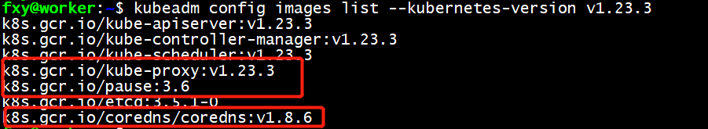

下面给出shell脚本：

```shell
for name in `kubeadm config images list --kubernetes-version v1.23.3`; do
    if [ ${name} == "k8s.gcr.io/kube-proxy:v1.23.3" ] || [ ${name} == "k8s.gcr.io/pause:3.6" ] || [ ${name} == "k8s.gcr.io/coredns/coredns:v1.8.6" ]; then
        src_name=${name#k8s.gcr.io/}
        src_name=${src_name#coredns/}

        docker pull $repo/$src_name

        docker tag $repo/$src_name $name
        docker rmi $repo/$src_name
	fi
done
```

执行的结果我就不给出了。

### 安装worker节点

开始执行join。。。。

```bash
fxy@worker:~$ sudo kubeadm join 192.168.135.132:6443 --token vtg43i.c0yy8nij2vk6nkhm         --discovery-token-ca-cert-hash sha256:03c53fd012f14cf380075cb33a8da054dc384a22a2e5275aa69b00ab4ec9c45c
[sudo] password for fxy: 
[preflight] Running pre-flight checks
[preflight] Reading configuration from the cluster...
[preflight] FYI: You can look at this config file with 'kubectl -n kube-system get cm kubeadm-config -o yaml'
W0122 09:56:22.217314    4059 utils.go:69] The recommended value for "resolvConf" in "KubeletConfiguration" is: /run/systemd/resolve/resolv.conf; the provided value is: /run/systemd/resolve/resolv.conf
[kubelet-start] Writing kubelet configuration to file "/var/lib/kubelet/config.yaml"
[kubelet-start] Writing kubelet environment file with flags to file "/var/lib/kubelet/kubeadm-flags.env"
[kubelet-start] Starting the kubelet
[kubelet-start] Waiting for the kubelet to perform the TLS Bootstrap...

This node has joined the cluster:
* Certificate signing request was sent to apiserver and a response was received.
* The Kubelet was informed of the new secure connection details.

Run 'kubectl get nodes' on the control-plane to see this node join the cluster.
```

如上是在我的worker节点执行的情况，成功了。好了，执行kubectl get nodes看看：

（注意：kubeadm join里面的token有时效性，如果超过24小时，可以用kubeadm token create来创建新的）

```bash
fxy@worker:~$ kubectl get nodes
The connection to the server localhost:8080 was refused - did you specify the right host or port?
```

失败了。

看看原因，好像是说要把master的admin.conf拷贝到所有worker节点：

```bash
# 在master节点上操作，把master上kubeadm init生成的admin.conf文件拷贝到其他所有worker节点，192.168.135.133是我的worker节点，fxy是worker的用户
sudo scp /etc/kubernetes/admin.conf fxy@192.168.135.133:~
# 下面的操作和前面master要做的类似，不同的是master节点原始admin.conf是在/etc/kubernetes/下面，而现在worker的这个文件是前一步操作中由master节点copy过来的。
mkdir -p $HOME/.kube
sudo cp -i $HOME/admin.conf $HOME/.kube/config
sudo chown $(id -u):$(id -g) $HOME/.kube/config
```

另外注意，如果kubeadm join失败，再次执行需要先执行下面的语句：

```bash
sudo kubeadm reset
```


上面admin.conf操作成功，并join之后，再执行一下kubectl get nodes，应该就能成功了。

```bash
fxy@worker:~/.kube$ kubectl get nodes
NAME     STATUS     ROLES                  AGE     VERSION
master   NotReady   control-plane,master   20h     v1.23.3
worker   NotReady   <none>                 4h14m   v1.23.3
```

至此，master和worker节点都安装好了，但是看看node的节点还是NotReady，是因为网络组件没有安装，还需要安装网络组件。

### 安装网络组件

前面我们看到不管是在master还是worker节点，运行kubect get nodes获取节点状态，都是NotReady，这个是因为网络组件还没安装。现在我们就来安装一下。

#### master节点

下载kube-flannel.yml并修改

```yaml
# chrono @ 2022-04

# https://github.com/flannel-io/flannel/blob/master/Documentation/kube-flannel.yml

# change net-conf.json
#   "Network": "10.10.0.0/16"

---
apiVersion: policy/v1beta1
kind: PodSecurityPolicy
metadata:
  name: psp.flannel.unprivileged
  annotations:
    seccomp.security.alpha.kubernetes.io/allowedProfileNames: docker/default
    seccomp.security.alpha.kubernetes.io/defaultProfileName: docker/default
    apparmor.security.beta.kubernetes.io/allowedProfileNames: runtime/default
    apparmor.security.beta.kubernetes.io/defaultProfileName: runtime/default
spec:
  privileged: false
  volumes:
  - configMap
  - secret
  - emptyDir
  - hostPath
  allowedHostPaths:
  - pathPrefix: "/etc/cni/net.d"
  - pathPrefix: "/etc/kube-flannel"
  - pathPrefix: "/run/flannel"
  readOnlyRootFilesystem: false
  # Users and groups
  runAsUser:
    rule: RunAsAny
  supplementalGroups:
    rule: RunAsAny
  fsGroup:
    rule: RunAsAny
  # Privilege Escalation
  allowPrivilegeEscalation: false
  defaultAllowPrivilegeEscalation: false
  # Capabilities
  allowedCapabilities: ['NET_ADMIN', 'NET_RAW']
  defaultAddCapabilities: []
  requiredDropCapabilities: []
  # Host namespaces
  hostPID: false
  hostIPC: false
  hostNetwork: true
  hostPorts:
  - min: 0
    max: 65535
  # SELinux
  seLinux:
    # SELinux is unused in CaaSP
    rule: 'RunAsAny'
---
kind: ClusterRole
apiVersion: rbac.authorization.k8s.io/v1
metadata:
  name: flannel
rules:
- apiGroups: ['extensions']
  resources: ['podsecuritypolicies']
  verbs: ['use']
  resourceNames: ['psp.flannel.unprivileged']
- apiGroups:
  - ""
  resources:
  - pods
  verbs:
  - get
- apiGroups:
  - ""
  resources:
  - nodes
  verbs:
  - list
  - watch
- apiGroups:
  - ""
  resources:
  - nodes/status
  verbs:
  - patch
---
kind: ClusterRoleBinding
apiVersion: rbac.authorization.k8s.io/v1
metadata:
  name: flannel
roleRef:
  apiGroup: rbac.authorization.k8s.io
  kind: ClusterRole
  name: flannel
subjects:
- kind: ServiceAccount
  name: flannel
  namespace: kube-system
---
apiVersion: v1
kind: ServiceAccount
metadata:
  name: flannel
  namespace: kube-system
---
kind: ConfigMap
apiVersion: v1
metadata:
  name: kube-flannel-cfg
  namespace: kube-system
  labels:
    tier: node
    app: flannel
data:
  cni-conf.json: |
    {
      "name": "cbr0",
      "cniVersion": "0.3.1",
      "plugins": [
        {
          "type": "flannel",
          "delegate": {
            "hairpinMode": true,
            "isDefaultGateway": true
          }
        },
        {
          "type": "portmap",
          "capabilities": {
            "portMappings": true
          }
        }
      ]
    }
  # 下面的network修改成和你kubeadm init里面的保持一致。其他基本不用动。
  net-conf.json: |
    {
      "Network": "10.10.0.0/16",
      "Backend": {
        "Type": "vxlan"
      }
    }
---
apiVersion: apps/v1
kind: DaemonSet
metadata:
  name: kube-flannel-ds
  namespace: kube-system
  labels:
    tier: node
    app: flannel
spec:
  selector:
    matchLabels:
      app: flannel
  template:
    metadata:
      labels:
        tier: node
        app: flannel
    spec:
      affinity:
        nodeAffinity:
          requiredDuringSchedulingIgnoredDuringExecution:
            nodeSelectorTerms:
            - matchExpressions:
              - key: kubernetes.io/os
                operator: In
                values:
                - linux
      hostNetwork: true
      priorityClassName: system-node-critical
      tolerations:
      - operator: Exists
        effect: NoSchedule
      serviceAccountName: flannel
      initContainers:
      - name: install-cni-plugin
       #image: flannelcni/flannel-cni-plugin:v1.0.1 for ppc64le and mips64le (dockerhub limitations may apply)
        image: rancher/mirrored-flannelcni-flannel-cni-plugin:v1.0.1
        command:
        - cp
        args:
        - -f
        - /flannel
        - /opt/cni/bin/flannel
        volumeMounts:
        - name: cni-plugin
          mountPath: /opt/cni/bin
      - name: install-cni
       #image: flannelcni/flannel:v0.17.0 for ppc64le and mips64le (dockerhub limitations may apply)
        image: rancher/mirrored-flannelcni-flannel:v0.17.0
        command:
        - cp
        args:
        - -f
        - /etc/kube-flannel/cni-conf.json
        - /etc/cni/net.d/10-flannel.conflist
        volumeMounts:
        - name: cni
          mountPath: /etc/cni/net.d
        - name: flannel-cfg
          mountPath: /etc/kube-flannel/
      containers:
      - name: kube-flannel
       #image: flannelcni/flannel:v0.17.0 for ppc64le and mips64le (dockerhub limitations may apply)
        image: rancher/mirrored-flannelcni-flannel:v0.17.0
        command:
        - /opt/bin/flanneld
        args:
        - --ip-masq
        - --kube-subnet-mgr
        resources:
          requests:
            cpu: "100m"
            memory: "50Mi"
          limits:
            cpu: "100m"
            memory: "50Mi"
        securityContext:
          privileged: false
          capabilities:
            add: ["NET_ADMIN", "NET_RAW"]
        env:
        - name: POD_NAME
          valueFrom:
            fieldRef:
              fieldPath: metadata.name
        - name: POD_NAMESPACE
          valueFrom:
            fieldRef:
              fieldPath: metadata.namespace
        - name: EVENT_QUEUE_DEPTH
          value: "5000"
        volumeMounts:
        - name: run
          mountPath: /run/flannel
        - name: flannel-cfg
          mountPath: /etc/kube-flannel/
        - name: xtables-lock
          mountPath: /run/xtables.lock
      volumes:
      - name: run
        hostPath:
          path: /run/flannel
      - name: cni-plugin
        hostPath:
          path: /opt/cni/bin
      - name: cni
        hostPath:
          path: /etc/cni/net.d
      - name: flannel-cfg
        configMap:
          name: kube-flannel-cfg
      - name: xtables-lock
        hostPath:
          path: /run/xtables.lock
          type: FileOrCreate
```

在master节点执行一下：

```bash
fxy@master:~$ kubectl apply -f kube-flannel.yml 
Warning: policy/v1beta1 PodSecurityPolicy is deprecated in v1.21+, unavailable in v1.25+
podsecuritypolicy.policy/psp.flannel.unprivileged created
clusterrole.rbac.authorization.k8s.io/flannel created
clusterrolebinding.rbac.authorization.k8s.io/flannel created
serviceaccount/flannel created
configmap/kube-flannel-cfg created
daemonset.apps/kube-flannel-ds created
```

过一会（网络要等一会才能ok），执行kubectl get nodes结果如下：

```bash
fxy@master:~$ kubectl get nodes
NAME     STATUS   ROLES                  AGE     VERSION
master   Ready    control-plane,master   22h     v1.23.3
worker   Ready    <none>                 5h27m   v1.23.3
```

work节点，运行kubectl get nodes得到同样的结果，说明在worker节点不需要kubectl apply。

至此，master和worker都能正确获取节点的状态。通过kubectl。


### Console安装

客户端安装很简单，只要kubectl工具就行了。在master节点执行：

```bash

scp `which kubectl` fxy@192.168.135.132:~/
scp ~/.kube/config fxy@192.168.135.132:~/.kube
```

（注意：这里我并没有验证，因为我的console就在master节点，小朋友们可以验证一下）

### 安装后其他说明

Kubernetes不能用systemctl管理，要用kubectl查看kube-system名字空间，然后删除flannel 的pod重启，或者用rollout命令重启。

## Deployment-让应用永不宕机

先得到deploy.yml文件的样例：

```bash
export out="--dry-run=client -o yaml"
kubectl create deploy ngx-dep --image=nginx:alpine $out
```

得到下面的样例（注释是我手动加的）：

```yaml
apiVersion: apps/v1
kind: Deployment
metadata:
  creationTimestamp: null
  labels:
    app: ngx-dep
  name: ngx-dep
spec:
  # 副本数量，有多少副本，k8s就会负责这个deploy里面就有多少副本，永不宕机
  replicas: 1
  # 选择器，跟下面模板里的metadata.labels要对应，否则apply会出错（yaml格式校验错误）
  # 意思是筛选出要被Deployment管理的pod对象
  selector:
    matchLabels:
      app: ngx-dep
  strategy: {}
  template:
    metadata:
      creationTimestamp: null
      labels:
        app: ngx-dep
    spec:
      containers:
      - image: nginx:alpine
        name: nginx
        resources: {}
status: {}
```

下面是对应关系图：


我们把replicas修改为2，执行如下命令：

```bash
fxy@master:~$ kubectl apply -f deploy.yml
deployment.apps/ngx-dep configured
fxy@master:~$ kubectl get deploy
NAME      READY   UP-TO-DATE   AVAILABLE   AGE
ngx-dep   2/2     2            2           12h
```

看一下kubectl get deploy的输出：

1. READY 表示运行的 Pod 数量，前面的数字是当前数量，后面的数字是期望数量，所以“2/2”的意思就是要求有两个 Pod 运行，现在已经启动了两个 Pod
2. UP-TO-DATE表示已经起起来的pod数量，也就是已经更新到最新状态的pod数量，因为如果要部署的 Pod 数量很多或者 Pod 启动比较慢，Deployment 完全生效需要一个过程，UP-TO-DATE 就表示现在有多少个 Pod 已经完成了部署，达成了模板里的“期望状态”
3. AVAILABLE更直接，要比 READY、UP-TO-DATE 更进一步，不仅要求已经运行，还必须是健康状态，能够正常对外提供服务，它才是我们最关心的 Deployment 指标
4. AGE很简单，表示deploy从创建到现在所经历的时间

因为deploy里面是pod，我们看一下get pod命令的结果：

```bash
fxy@master:~$ kubectl get pod
NAME                      READY   STATUS    RESTARTS      AGE
ngx-dep-bfbb5f64b-hz4vh   1/1     Running   1 (28m ago)   12h
ngx-dep-bfbb5f64b-p5n2f   1/1     Running   1 (28m ago)   12h
```

我们看到，deploy里面的两个pod，注意到，deploy里面的pod的命名规则：deploy名称 + 两串随机数。

另外，注意，deploy的名称是不能修改的，一旦改了，就是一个新的deploy了。我们试着把前面的deploy.yml的名称修改为ngx-deployment，

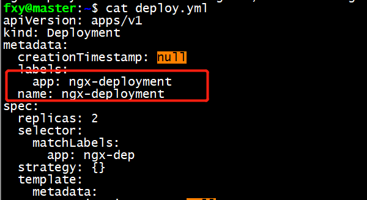


再执行一下apply看看：

```bash
fxy@master:~$ kubectl apply -f deploy.yml
deployment.apps/ngx-deployment created
fxy@master:~$ 
fxy@master:~$ 
fxy@master:~$ 
fxy@master:~$ kubectl get pod
NAME                             READY   STATUS    RESTARTS      AGE
ngx-dep-bfbb5f64b-hz4vh          1/1     Running   1 (33m ago)   12h
ngx-dep-bfbb5f64b-p5n2f          1/1     Running   1 (33m ago)   12h
ngx-deployment-bfbb5f64b-2724w   1/1     Running   0             9s
ngx-deployment-bfbb5f64b-xmlcg   1/1     Running   0             9s
fxy@master:~$ kubectl get deploy
NAME             READY   UP-TO-DATE   AVAILABLE   AGE
ngx-dep          2/2     2            2           12h
ngx-deployment   2/2     2            2           3m28s
```

看看打印，是created，而不是configured。再看get pod，发现多出来2个pod，get deploy也多出来一个deploy。

试着删除要给pod，再get pod看看：

```bash
fxy@master:~$ kubectl get pod
NAME                             READY   STATUS    RESTARTS   AGE
ngx-deployment-bfbb5f64b-2724w   1/1     Running   0          4m39s
ngx-deployment-bfbb5f64b-xmlcg   1/1     Running   0          4m39s
fxy@master:~$ 
fxy@master:~$ 
fxy@master:~$ kubectl delete pod ngx-deployment-bfbb5f64b-xmlcg
pod "ngx-deployment-bfbb5f64b-xmlcg" deleted
fxy@master:~$ kubectl get pod
NAME                             READY   STATUS    RESTARTS   AGE
ngx-deployment-bfbb5f64b-2724w   1/1     Running   0          5m18s
ngx-deployment-bfbb5f64b-5bsn7   1/1     Running   0          4s
```

怎么样，xmlcg的那个pod没了，但是k8s很快就起了一个5bsn7的pod来。

用scale扩充节点：

```bash
fxy@master:~$ kubectl scale --replicas=5 deploy ngx-deployment
deployment.apps/ngx-deployment scaled
fxy@master:~$ kubectl get pod
NAME                             READY   STATUS    RESTARTS   AGE
ngx-deployment-bfbb5f64b-2724w   1/1     Running   0          7m30s
ngx-deployment-bfbb5f64b-2qbtl   1/1     Running   0          4s
ngx-deployment-bfbb5f64b-4hg99   1/1     Running   0          4s
ngx-deployment-bfbb5f64b-5bsn7   1/1     Running   0          2m16s
ngx-deployment-bfbb5f64b-5q79d   1/1     Running   0          4s
```

再做个实验：缩容：

```bash
# 这里我改成了3个
fxy@master:~$ vi deploy.yml
fxy@master:~$ 
fxy@master:~$ 
fxy@master:~$ 
# apply一下
fxy@master:~$ kubectl apply -f deploy.yml
deployment.apps/ngx-deployment configured
fxy@master:~$ 
fxy@master:~$ 
# 看到没有，有两个这个Terminating.说明k8s正在删除多余的2个pod
fxy@master:~$ kubectl get pod
NAME                             READY   STATUS        RESTARTS   AGE
ngx-deployment-bfbb5f64b-2724w   1/1     Running       0          10m
ngx-deployment-bfbb5f64b-2qbtl   0/1     Terminating   0          3m25s
ngx-deployment-bfbb5f64b-4hg99   1/1     Running       0          3m25s
ngx-deployment-bfbb5f64b-5bsn7   1/1     Running       0          5m37s
ngx-deployment-bfbb5f64b-9w6gn   1/1     Terminating   0          39s
fxy@master:~$ 
# 这里就看到只有3个。同理，如果把replicas改成10，再用get pod就是10个pod了。
fxy@master:~$ kubectl get pod
NAME                             READY   STATUS    RESTARTS   AGE
ngx-deployment-bfbb5f64b-2724w   1/1     Running   0          10m
ngx-deployment-bfbb5f64b-4hg99   1/1     Running   0          3m32s
ngx-deployment-bfbb5f64b-5bsn7   1/1     Running   0          5m44s
```

kubectl get小技巧：

> kubectl get小技巧
>
> 可以通过-l参数对kubectl get的结果进行过滤,-l参数是对label进行过滤,可以使用==、!=、in、notin 的表达式等表达式.看两个例子，第一条命令找出“app”标签是 nginx 的所有 Pod，第二条命令找出“app”标签是 ngx、nginx、ngx-dep 的所有 Pod：
>
> ```bash
> fxy@master:~$ kubectl get pod -l app=ngx
> No resources found in default namespace.
> fxy@master:~$ kubectl get pod -l 'app in (ngx,nginx,ngx-dep,ngx-deployment)'
> NAME                             READY   STATUS    RESTARTS   AGE
> ngx-deployment-bfbb5f64b-2724w   1/1     Running   0          16m
> ngx-deployment-bfbb5f64b-4hg99   1/1     Running   0          9m29s
> ngx-deployment-bfbb5f64b-5bsn7   1/1     Running   0          11m
> ```
>
> 

关于deploy的其他东西:

1. 实际中一般不直接使用pod的对象,而是用deployment对象,即时pod就1个,只是replicas值为1,这样是为了利用k8s的deploy的永远在线功能,另外,也容易进行扩展成多个pod的真正的deployment
2. deployment除了永远在线,还有版本升级,回退,自动伸缩等的功能,
3. replicas修改为0可以保留deployment的配置,但是没有任何pod. 比如下线一个服务,可以先把这个值设置为0,观察一段时间如果没有问题再删除配置.如果有问题,那么可以快速恢复.
4. deployment比较多用在无状态多副本的服务中.比如典型的业务系统.
5. 不适用scale继续伸缩容,主要是可能导致实际的情况和配置描述不一致,导致混乱,不利于运维.
6. deployment里面的pod是由deployment自动创建的,而不能由外部已经存在的pod纳入deployment的管理,这个是由k8s的机制决定的.

## DaemonSet

daemonset不能像deployment由kubectl create生成,因此可以通过deployment的配置修改而得:

```bash
fxy@master:~$ cat daemonset.yml
apiVersion: apps/v1
kind: DaemonSet
metadata:
  creationTimestamp: null
  labels:
    app: redis-ds
  name: redis-ds
spec:
  selector:
    matchLabels:
      app: redis-ds
  template:
    metadata:
      creationTimestamp: null
      labels:
        app: redis-ds
    spec:
      containers:
      - image: redis:5-alpine
        name: redis
        ports:
        - containerPort: 6379
```

老一套,执行:

```bash
fxy@master:~$ kubectl apply -f daemonset.yml
daemonset.apps/redis-ds created
fxy@master:~$ 
fxy@master:~$ 
fxy@master:~$ 
# 太快,还正在创建容器
fxy@master:~$ kubectl get pod
NAME                             READY   STATUS              RESTARTS   AGE
ngx-deployment-bfbb5f64b-2724w   1/1     Running             0          70m
ngx-deployment-bfbb5f64b-4hg99   1/1     Running             0          62m
ngx-deployment-bfbb5f64b-5bsn7   1/1     Running             0          65m
redis-ds-txpqh                   0/1     ContainerCreating   0          10s
# 已经运行了.
fxy@master:~$ kubectl get pod
NAME                             READY   STATUS    RESTARTS   AGE
ngx-deployment-bfbb5f64b-2724w   1/1     Running   0          70m
ngx-deployment-bfbb5f64b-4hg99   1/1     Running   0          63m
ngx-deployment-bfbb5f64b-5bsn7   1/1     Running   0          65m
redis-ds-txpqh                   1/1     Running   0          16s
fxy@master:~$ kubect get ds
kubect: command not found
fxy@master:~$ kubectl get deploy
NAME             READY   UP-TO-DATE   AVAILABLE   AGE
ngx-deployment   3/3     3            3           70m
fxy@master:~$ 
# 查看到有一个pod了,不是有2个吗?
fxy@master:~$ kubectl get daemonset
NAME       DESIRED   CURRENT   READY   UP-TO-DATE   AVAILABLE   NODE SELECTOR   AGE
redis-ds   1         1         1       1            1           <none>          45s
```


从上面我们看到，只有work节点运行了redis-ds程序。这就要看k8s的污点和容忍度这个概念了。

污点（taint）：污点是k8s一个节点的属性，是一个节点的标签，为了和label区分，特地叫taint，一个节点包含污点，那么不符合五点的对象是无法在这个节点运行的。

容忍度（toleration）：pod的容忍度，有的pod不能容忍污点，只能挑选“干净”的节点，有的大大咧咧，可以容忍一定的污点。。

> K8s在创建集群的时候会自动给节点Node加上一些“污点”，方便pod的调度和部署，可以用kubectl describe node来看master和woker节点的状态。
>
> ```bash
> fxy@master:~$ kubectl describe node master
> Name:               master
> Roles:              control-plane,master
> Labels:             beta.kubernetes.io/arch=amd64
>                     beta.kubernetes.io/os=linux
>                     kubernetes.io/arch=amd64
>                     kubernetes.io/hostname=master
>                     kubernetes.io/os=linux
>                     node-role.kubernetes.io/control-plane=
>                     node-role.kubernetes.io/master=
>                     node.kubernetes.io/exclude-from-external-load-balancers=
> Annotations:        flannel.alpha.coreos.com/backend-data: {"VNI":1,"VtepMAC":"4e:8c:4f:65:f2:28"}
>                     flannel.alpha.coreos.com/backend-type: vxlan
>                     flannel.alpha.coreos.com/kube-subnet-manager: true
>                     flannel.alpha.coreos.com/public-ip: 192.168.135.132
>                     kubeadm.alpha.kubernetes.io/cri-socket: /var/run/dockershim.sock
>                     node.alpha.kubernetes.io/ttl: 0
>                     volumes.kubernetes.io/controller-managed-attach-detach: true
> CreationTimestamp:  Sat, 21 Jan 2023 17:21:19 +0800
> Taints:             node-role.kubernetes.io/master:NoSchedule
> Unschedulable:      false
> Lease:
>   HolderIdentity:  master
>   AcquireTime:     <unset>
>   RenewTime:       Mon, 23 Jan 2023 14:02:27 +0800
> Conditions:
>   Type                 Status  LastHeartbeatTime                 LastTransitionTime                Reason                       Message
>   ----                 ------  -----------------                 ------------------                ------                       -------
>   NetworkUnavailable   False   Mon, 23 Jan 2023 13:53:24 +0800   Mon, 23 Jan 2023 13:53:24 +0800   FlannelIsUp                  Flannel is running on this node
>   MemoryPressure       False   Mon, 23 Jan 2023 13:58:21 +0800   Sat, 21 Jan 2023 17:21:13 +0800   KubeletHasSufficientMemory   kubelet has sufficient memory available
>   DiskPressure         False   Mon, 23 Jan 2023 13:58:21 +0800   Sat, 21 Jan 2023 17:21:13 +0800   KubeletHasNoDiskPressure     kubelet has no disk pressure
>   PIDPressure          False   Mon, 23 Jan 2023 13:58:21 +0800   Sat, 21 Jan 2023 17:21:13 +0800   KubeletHasSufficientPID      kubelet has sufficient PID available
>   Ready                True    Mon, 23 Jan 2023 13:58:21 +0800   Sun, 22 Jan 2023 15:23:01 +0800   KubeletReady                 kubelet is posting ready status. AppArmor enabled
> Addresses:
>   InternalIP:  192.168.135.132
>   Hostname:    master
> Capacity:
>   cpu:                2
>   ephemeral-storage:  40453376Ki
>   hugepages-1Gi:      0
>   hugepages-2Mi:      0
>   memory:             3983192Ki
>   pods:               110
> Allocatable:
>   cpu:                2
>   ephemeral-storage:  37281831260
>   hugepages-1Gi:      0
>   hugepages-2Mi:      0
>   memory:             3880792Ki
>   pods:               110
> System Info:
>   Machine ID:                 8e7a8881e6d342ccb0d50be71d2c6d72
>   System UUID:                cc1b4d56-dec4-af9c-ad10-6100f3a9125d
>   Boot ID:                    263feb25-5476-497e-b689-55cf9bcf2841
>   Kernel Version:             5.15.0-58-generic
>   OS Image:                   Ubuntu 22.04.1 LTS
>   Operating System:           linux
>   Architecture:               amd64
>   Container Runtime Version:  docker://20.10.12
>   Kubelet Version:            v1.23.3
>   Kube-Proxy Version:         v1.23.3
> PodCIDR:                      10.10.0.0/24
> PodCIDRs:                     10.10.0.0/24
> Non-terminated Pods:          (6 in total)
>   Namespace                   Name                              CPU Requests  CPU Limits  Memory Requests  Memory Limits  Age
>   ---------                   ----                              ------------  ----------  ---------------  -------------  ---
>   kube-system                 etcd-master                       100m (5%)     0 (0%)      100Mi (2%)       0 (0%)         44h
>   kube-system                 kube-apiserver-master             250m (12%)    0 (0%)      0 (0%)           0 (0%)         44h
>   kube-system                 kube-controller-manager-master    200m (10%)    0 (0%)      0 (0%)           0 (0%)         44h
>   kube-system                 kube-flannel-ds-khjkh             100m (5%)     100m (5%)   50Mi (1%)        50Mi (1%)      22h
>   kube-system                 kube-proxy-g22gr                  0 (0%)        0 (0%)      0 (0%)           0 (0%)         44h
>   kube-system                 kube-scheduler-master             100m (5%)     0 (0%)      0 (0%)           0 (0%)         44h
> Allocated resources:
>   (Total limits may be over 100 percent, i.e., overcommitted.)
>   Resource           Requests    Limits
>   --------           --------    ------
>   cpu                750m (37%)  100m (5%)
>   memory             150Mi (3%)  50Mi (1%)
>   ephemeral-storage  0 (0%)      0 (0%)
>   hugepages-1Gi      0 (0%)      0 (0%)
>   hugepages-2Mi      0 (0%)      0 (0%)
> Events:
>   Type    Reason                   Age                    From        Message
>   ----    ------                   ----                   ----        -------
>   Normal  Starting                 9m12s                  kube-proxy  
>   Normal  Starting                 9m36s                  kubelet     Starting kubelet.
>   Normal  NodeHasSufficientMemory  9m34s (x8 over 9m35s)  kubelet     Node master status is now: NodeHasSufficientMemory
>   Normal  NodeHasNoDiskPressure    9m34s (x8 over 9m35s)  kubelet     Node master status is now: NodeHasNoDiskPressure
>   Normal  NodeHasSufficientPID     9m34s (x7 over 9m35s)  kubelet     Node master status is now: NodeHasSufficientPID
>   Normal  NodeAllocatableEnforced  9m34s                  kubelet     Updated Node Allocatable limit across pods
> fxy@master:~$ 
> ```
>
> 

可以看到master的污点：

node-role.kubernetes.io/master:NoSchedule

有了这样的污点，如果DaemonSet创建的pod不能容忍，那么DaemonSet是不能在master节点创建pod的。这也导致了前面apply之后，只有worker节点上部署了redis-ds这个pod。

有了这层说明，那么如何让master也能部署上DaemonSet创建的pod？很简单，要么去掉污点，要么pod能容忍污点。

1. 去掉污点，在master节点执行：

   ```bash
   # 去污点
   fxy@master:~$ kubectl taint node master node-role.kubernetes.io/master:NoSchedule-
   node/master untainted
   # 正在启动
   fxy@master:~$ kubectl get ds
   NAME       DESIRED   CURRENT   READY   UP-TO-DATE   AVAILABLE   NODE SELECTOR   AGE
   redis-ds   2         2         1       2            1           <none>          3h23m
   fxy@master:~$ kubectl get pod -o wide
   NAME                             READY   STATUS             RESTARTS      AGE     IP           NODE     NOMINATED NODE   READINESS GATES
   ngx-deployment-bfbb5f64b-2724w   1/1     Running            1 (22m ago)   4h33m   10.10.1.28   worker   <none>           <none>
   ngx-deployment-bfbb5f64b-4hg99   1/1     Running            1 (22m ago)   4h26m   10.10.1.29   worker   <none>           <none>
   ngx-deployment-bfbb5f64b-5bsn7   1/1     Running            1 (22m ago)   4h28m   10.10.1.26   worker   <none>           <none>
   redis-ds-6kqbn                   0/1     ImagePullBackOff   0             35s     10.10.0.3    master   <none>           <none>
   redis-ds-txpqh                   1/1     Running            1 (22m ago)   3h23m   10.10.1.25   worker   <none>           <none>
   # 这个时候AVAILABLE才变成2，才真正能提供服务
   fxy@master:~$ kubectl get ds
   NAME       DESIRED   CURRENT   READY   UP-TO-DATE   AVAILABLE   NODE SELECTOR   AGE
   redis-ds   2         2         2       2            2           <none>          3h24m
   fxy@master:~$ kubectl get pod -o wide
   NAME                             READY   STATUS    RESTARTS      AGE     IP           NODE     NOMINATED NODE   READINESS GATES
   ngx-deployment-bfbb5f64b-2724w   1/1     Running   1 (23m ago)   4h34m   10.10.1.28   worker   <none>           <none>
   ngx-deployment-bfbb5f64b-4hg99   1/1     Running   1 (23m ago)   4h27m   10.10.1.29   worker   <none>           <none>
   ngx-deployment-bfbb5f64b-5bsn7   1/1     Running   1 (23m ago)   4h29m   10.10.1.26   worker   <none>           <none>
   redis-ds-6kqbn                   1/1     Running   0             95s     10.10.0.3    master   <none>           <none>
   redis-ds-txpqh                   1/1     Running   1 (23m ago)   3h24m   10.10.1.25   worker   <none>           <none>
   # 复原master节点的污点
   fxy@master:~$ kubectl taint node master node-role.kubernetes.io/master:NoSchedule
   node/master tainted
   fxy@master:~$ 
   ```

2. 增加创建pod的容忍度，显式容忍master节点：

   在daemonset的描述文件中spec下增加如下容忍节点：

   ```yaml
   tolerations:
   - key: node-role.kubernetes.io/master
     effect: NoSchedule
     operator: Exists
   ```

   

容忍度不是daemonset的概念，是pod的概念，所以像job，cronJob，deployment里面都可以配置容忍度，以便灵活的调度pod。

其他：

1. DaemonSet为集群中的每个节点部署唯一的pod，经常用于监控、日志、代理等应用

2. DaemonSet和Deployment的yaml文件非常相似，只是没有replicas字段

3. 污点和容忍度是与DaemonSet相关的两个字段，分别从属于node和pod，共同决定了pod的调度策略

4. 静态pod也可以实现和DaemonSet类似的效果，但不受k8s控制，慎用。

5. 前面安装的flannel实际上就是DaemonSet创建的pod，

   ```bash
   fxy@master:~$ kubectl get ds -n kube-system
   NAME              DESIRED   CURRENT   READY   UP-TO-DATE   AVAILABLE   NODE SELECTOR            AGE
   kube-flannel-ds   2         2         2       2            2           <none>                   23h
   kube-proxy        2         2         2       2            2           kubernetes.io/os=linux   45h
   fxy@master:~$ kubectl get deploy -n kube-system
   NAME      READY   UP-TO-DATE   AVAILABLE   AGE
   coredns   2/2     2            2           45h
   fxy@master:~$ kubectl get ds -n kube-system
   NAME              DESIRED   CURRENT   READY   UP-TO-DATE   AVAILABLE   NODE SELECTOR            AGE
   kube-flannel-ds   2         2         2       2            2           <none>                   23h
   kube-proxy        2         2         2       2            2           kubernetes.io/os=linux   45h
   fxy@master:~$ 
   ```

6. 静态pod因为游离在系统之外，将来可能有被废弃的可能。

7. 与容忍度和污点相近的还有一个概念，那就是“亲和度”（nodeAffinity），作用是更偏好选择哪些节点，配置更复杂。

8. k8s的1.24版本，master节点的污点中的master修改为了control-plane.

## 静态Pod

DaemonSet是在k8s里面运行专属节点最常用的方式之一，除了这个还有个静态pod的部署手段。

静态pod不受k8s管理，不予apiserver和schedule发生关系，所以是静态的。

因为是pod，那么它也跑在容器上，也有yaml文件来描述这些pod，而唯一能管理它的就是每个节点上的kubelet了。

静态pod的配置描述文件默认放在/etc/kubernetes/manifests目录下，这个是k8s的专属目录。

```bash
fxy@master:~$ ls -al /etc/kubernetes/manifests/
total 24
drwxr-xr-x 2 root root 4096  1月 21 17:21 .
drwxr-xr-x 4 root root 4096  1月 21 17:21 ..
-rw------- 1 root root 2227  1月 21 17:21 etcd.yaml
-rw------- 1 root root 4019  1月 21 17:21 kube-apiserver.yaml
-rw------- 1 root root 3514  1月 21 17:21 kube-controller-manager.yaml
-rw------- 1 root root 1435  1月 21 17:21 kube-scheduler.yaml
fxy@master:~$ 
```


这里大家也看到了，这四个就是以静态pod的形式存在的，也是因为这个，他们能先于集群运行。如果有一些DaemonSet无法满足的pod，可以考虑静态pod，编写一个静态yaml文件放在这个目录下面，k8s发现变化就会创建或删除静态pod。


## service

云原生时代，微服务是最好的业务应用，为了更好的支持微服务，service应运而生，主要是解决微服务之间的负载均衡。用来解决服务发现。

我们都知道，ks8调度部署的pod的ip地址是随机改变的，那么同一个deployment里面的ip地址变来变去，该如何解决服务发现的问题？解决方案是加入中间层，这个中间层就是service，类似于nginx和lvs，但是nginx和lvs不是k8s自己的，因此就引入了service对象。

k8s会给service配置一个静态ip地址。

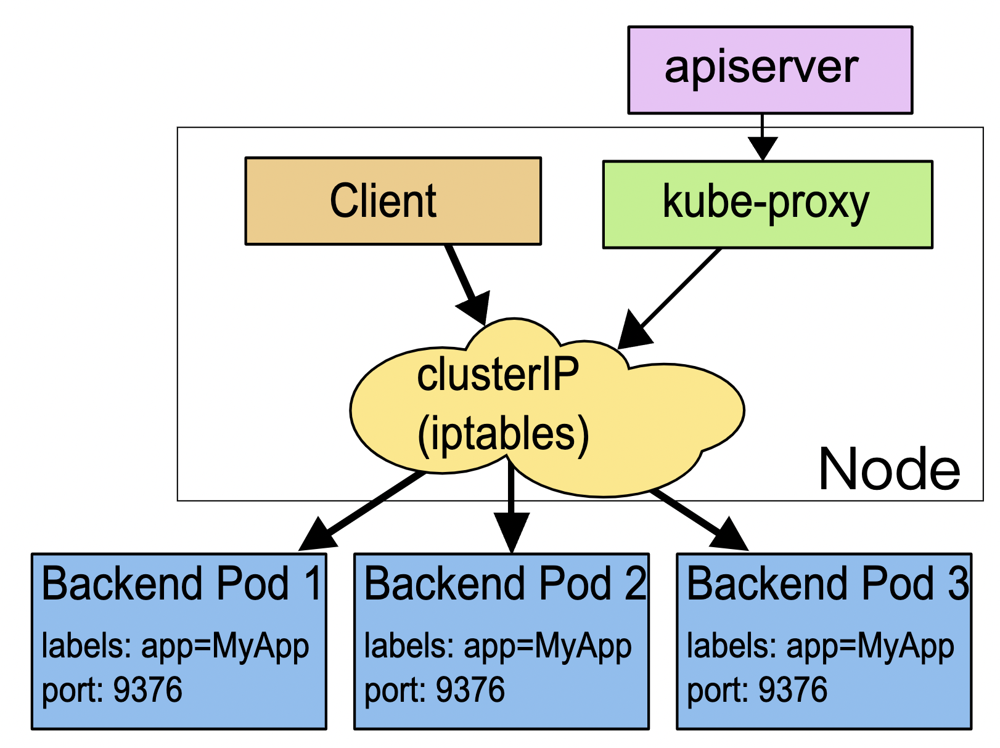

如上是service的工作原理，使用的是iptables技术，client和kube-proxy只需要访问service的clusterIP地址就可以了。每个节点上的 kube-proxy 组件自动维护 iptables 规则，客户不再关心 Pod 的具体地址，只要访问 Service 的固定 IP 地址，Service 就会根据 iptables 规则转发请求给它管理的多个 Pod，是典型的负载均衡架构。

service可以不适用iptables来实现负载均衡，也可以使用如下两种：

1. userspace：性能比iptables更差
2. ipvs：性能更好

我们来看一下service的yaml文件，这里k8s又反其道而行之，使用了kubectl expose。

```bash
export out="--dry-run=client -o yaml"
# ngx-dep是deployment对象中的pod的名称，service通过这个和deployment中的对象关联。
# target-port对应deployment中pod的容器端口
kubectl expose deploy ngx-dep --port=80 --target-port=80 $out
```

所以，看一下最终的yaml文件：

```bash
fxy@master:~$ cat service.yml
apiVersion: v1
kind: Service
metadata:
  name: ngx-svc
  
spec:
  selector:
    app: ngx-dep
    
  ports:
  - port: 80
    targetPort: 80
    protocol: TCP
fxy@master:~$ 
```

其中metadata.name是根据命令行参数自动填写上去的。端口也是。

仍然给出他们之间的关系：


（注意，这里service里面的selector对应的是deployment里面的pod的label，而不是deployment本身对象的name！！如果搞错了也可以创建service成功，但是你会发现service下的endpoints为空。）

```bash
fxy@master:~$ kubectl apply -f service.yml
fxy@master:~$ kubectl get svc
NAME         TYPE        CLUSTER-IP    EXTERNAL-IP   PORT(S)   AGE
kubernetes   ClusterIP   10.96.0.1     <none>        443/TCP   4d17h
ngx-svc      ClusterIP   10.99.34.59   <none>        80/TCP    49m
```

上面就可以看到k8s给ngx-svc分配了静态的ip地址：10.99.34.59.这个是一个虚地址，ping是无法成功的。不存在实体，只能用来转发流量。我们看看ngx-svc代理了哪些pod：

```bash
fxy@master:~$ kubectl describe svc ngx-svc
Name:              ngx-svc
Namespace:         default
Labels:            <none>
Annotations:       <none>
Selector:          app=ngx-dep
Type:              ClusterIP
IP Family Policy:  SingleStack
IP Families:       IPv4
IP:                10.99.34.59
IPs:               10.99.34.59
Port:              <unset>  80/TCP
TargetPort:        80/TCP
Endpoints:         10.10.1.37:80,10.10.1.38:80,10.10.1.39:80
Session Affinity:  None
Events:            <none>
```

我们再看看ngx-dep对应的pod的ip地址情况：

```bash
fxy@master:~$ kubectl get pod -o wide|grep ngx-deployment
ngx-deployment-6796688696-5bs4x   1/1     Running   0             58m     10.10.1.38   worker   <none>           <none>
ngx-deployment-6796688696-9kzgf   1/1     Running   0             58m     10.10.1.39   worker   <none>           <none>
ngx-deployment-6796688696-mz5vv   1/1     Running   0             58m     10.10.1.37   worker   <none>           <none>
```

看到了service就是代理了ngx-dep的三个pod。

因为k8s给service配置的是虚地址，我们只能进入到pod里面验证一下，

```bash
fxy@master:~$ kubectl exec -it ngx-deployment-6796688696-5bs4x -- sh
/ # curl 10.99.34.56
^C
/ # curl 10.99.34.59
srv : 10.10.1.38:80
host: ngx-deployment-6796688696-5bs4x
uri : GET 10.99.34.59 /
date: 2023-01-26T02:50:10+00:00
```

可以curl通 service的ip地址。

我们再删掉一个pod，看看service代理的pod的endpoints会不会变化：

```bash
# 删除10.10.1.38 这个pod
fxy@master:~$ kubectl delete pod ngx-deployment-6796688696-5bs4x
pod "ngx-deployment-6796688696-5bs4x" deleted
fxy@master:~$ kubectl get pod -o wide
NAME                              READY   STATUS    RESTARTS       AGE     IP           NODE     NOMINATED NODE   READINESS GATES
ngx-deployment-6796688696-9kzgf   1/1     Running   0              76m     10.10.1.39   worker   <none>           <none>
ngx-deployment-6796688696-fx6wj   1/1     Running   0              13s     10.10.1.40   worker   <none>           <none>
ngx-deployment-6796688696-mz5vv   1/1     Running   0              76m     10.10.1.37   worker   <none>           <none>
redis-ds-g7jlf                    1/1     Running   1 (109m ago)   2d20h   10.10.1.31   worker   <none>           <none>
redis-ds-ms7gr                    1/1     Running   3 (63m ago)    2d20h   10.10.0.7    master   <none>           <none>
fxy@master:~$ kubectl get svc ngx-svc
NAME      TYPE        CLUSTER-IP    EXTERNAL-IP   PORT(S)   AGE
ngx-svc   ClusterIP   10.99.34.59   <none>        80/TCP    75m
fxy@master:~$ kubectl describe svc ngx-svc
Name:              ngx-svc
Namespace:         default
Labels:            <none>
Annotations:       <none>
Selector:          app=ngx-dep
Type:              ClusterIP
IP Family Policy:  SingleStack
IP Families:       IPv4
IP:                10.99.34.59
IPs:               10.99.34.59
Port:              <unset>  80/TCP
TargetPort:        80/TCP
Endpoints:         10.10.1.37:80,10.10.1.39:80,10.10.1.40:80
Session Affinity:  None
Events:            <none>
```


看一下，10.10.1.38的ip没了。出现了一个新的ip，对应新的pod的ip地址。

用域名的方式访问service：

我们先来看看 DNS 域名。Service 对象的 IP 地址是静态的，保持稳定，这在微服务里确实很重要，不过数字形式的 IP 地址用起来还是不太方便。这个时候 Kubernetes 的 DNS 插件就派上了用处，它可以为 Service 创建易写易记的域名，让 Service 更容易使用。

使用 DNS 域名之前，我们要先了解一个新的概念：名字空间（namespace）。

namespace 的简写是“ns”，你可以使用命令 kubectl get ns 来查看当前集群里都有哪些名字空间，也就是说 API 对象有哪些分组：

```bash
fxy@master:~$ kubectl get ns
NAME              STATUS   AGE
default           Active   4d17h
kube-node-lease   Active   4d17h
kube-public       Active   4d17h
kube-system       Active   4d17h
```

Kubernetes 有一个默认的名字空间，叫“default”，如果不显式指定，API 对象都会在这个“default”名字空间里。而其他的名字空间都有各自的用途，比如“kube-system”就包含了 apiserver、etcd 等核心组件的 Pod。因为 DNS 是一种层次结构，为了避免太多的域名导致冲突，Kubernetes 就把名字空间作为域名的一部分，减少了重名的可能性。

Service 对象的域名完全形式是“对象. 名字空间.svc.cluster.local”，但很多时候也可以省略后面的部分，直接写“对象. 名字空间”甚至“对象名”就足够了，默认会使用对象所在的名字空间（比如这里就是 default）。

现在我们来试验一下 DNS 域名的用法，还是先 kubectl exec 进入 Pod，然后用 curl 访问 ngx-svc、ngx-svc.default 等域名：

```bash
fxy@master:~$ kubectl exec -it ngx-deployment-6796688696-9kzgf -- sh
/ # curl ngx-svc
srv : 10.10.1.40:80
host: ngx-deployment-6796688696-fx6wj
uri : GET ngx-svc /
date: 2023-01-26T03:10:12+00:00
/ # curl ngx-svc.default
srv : 10.10.1.37:80
host: ngx-deployment-6796688696-mz5vv
uri : GET ngx-svc.default /
date: 2023-01-26T03:10:25+00:00
/ # curl ngx-svc.default.svc.cluster.local
srv : 10.10.1.40:80
host: ngx-deployment-6796688696-fx6wj
uri : GET ngx-svc.default.svc.cluster.local /
date: 2023-01-26T03:16:13+00:00
```


可以看到，现在我们就不再关心 Service 对象的 IP 地址，只需要知道它的名字，就可以用 DNS 的方式去访问后端服务。比起 Docker，这无疑是一个巨大的进步，而且对比其他微服务框架（如 Dubbo、Spring Cloud），由于服务发现机制被集成在了基础设施里，也会让应用的开发更加便捷。（顺便说一下，Kubernetes 也为每个 Pod 分配了域名，形式是“IP 地址. 名字空间.pod.cluster.local”，但需要把 IP 地址里的 . 改成 - 。比如地址 10.10.1.87，它对应的域名就是 10-10-1-87.default.pod。）

如何让 Service 对外暴露服务由于 Service 是一种负载均衡技术，所以它不仅能够管理 Kubernetes 集群内部的服务，还能够担当向集群外部暴露服务的重任。

Service 对象有一个关键字段“type”，表示 Service 是哪种类型的负载均衡。前面我们看到的用法都是对集群内部 Pod 的负载均衡，所以这个字段的值就是默认的“ClusterIP”，Service 的静态 IP 地址只能在集群内访问。

除了“ClusterIP”，Service 还支持其他三种类型，分别是“ExternalName”“LoadBalancer”“NodePort”。不过前两种类型一般由云服务商提供，我们的实验环境用不到，所以接下来就重点看“NodePort”这个类型。

如果我们在使用命令 kubectl expose 的时候加上参数 --type=NodePort，或者在 YAML 里添加字段 type:NodePort，那么 Service 除了会对后端的 Pod 做负载均衡之外，还会在集群里的每个节点上创建一个独立的端口，用这个端口对外提供服务，这也正是“NodePort”这个名字的由来。

我们把service的type修改为NodePort，完整的service.yml如下：

```bash
fxy@master:~$ cat service.yml
apiVersion: v1
kind: Service
metadata:
  name: ngx-svc
  
spec:
  selector:
    app: ngx-dep
  
  type: NodePort 
  ports:
  - port: 80
    targetPort: 80
    protocol: TCP
```

然后apply，再通过kubectl get svc看一下：

```bash
fxy@master:~$ kubectl apply -f service.yml
service/ngx-svc configured
fxy@master:~$ kubectl get svc
NAME         TYPE        CLUSTER-IP    EXTERNAL-IP   PORT(S)        AGE
kubernetes   ClusterIP   10.96.0.1     <none>        443/TCP        4d17h
ngx-svc      NodePort    10.99.34.59   <none>        80:32679/TCP   91m
```

就会看到“TYPE”变成了“NodePort”，而在“PORT”列里的端口信息也不一样，除了集群内部使用的“80”端口，还多出了一个“32679”端口，这就是 Kubernetes 在节点上为 Service 创建的专用映射端口。（ClusterIP的意思应该就是只能再集群内部使用）	

因为这个端口号属于节点，外部能够直接访问，所以现在我们就可以不用登录集群节点或者进入 Pod 内部，直接在集群外使用任意一个节点的 IP 地址，就能够访问 Service 和它代理的后端服务了。

比如，我所在的机器是192.168.135.132，可以如下：

```bash
fxy@master:~$ curl 192.168.135.132:32679
srv : 10.10.1.37:80
host: ngx-deployment-6796688696-mz5vv
uri : GET 192.168.135.132 /
date: 2023-01-26T03:25:34+00:00
fxy@master:~$ curl 192.168.135.132:32679
srv : 10.10.1.39:80
host: ngx-deployment-6796688696-9kzgf
uri : GET 192.168.135.132 /
date: 2023-01-26T03:25:36+00:00
```

通过32679就访问到了svc，进而访问到了具体的pod。

下面画一下他们直接的关系：


## Ingress

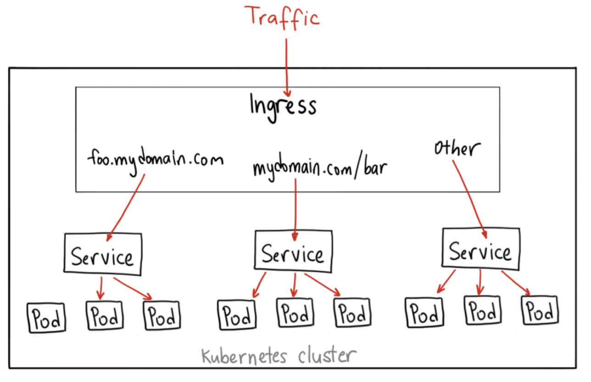


Service 很有用，但也只能说是“基础设施”，它对网络流量的管理方案还是太简单，离复杂的现代应用架构需求还有很大的差距，所以 Kubernetes 就在 Service 之上又提出了一个新的概念：Ingress。比起 Service，Ingress 更接近实际业务，对它的开发、应用和讨论也是社区里最火爆的，今天我们就来看看 Ingress，还有与它关联的 Ingress Controller、Ingress Class 等对象

我们知道了 Service 的功能和运行机制，它本质上就是一个由 kube-proxy 控制的四层负载均衡，在 TCP/IP 协议栈上转发流量。

但在四层上的负载均衡功能还是太有限了，只能够依据 IP 地址和端口号做一些简单的判断和组合，而我们现在的绝大多数应用都是跑在七层的 HTTP/HTTPS 协议上的，有更多的高级路由条件，比如主机名、URI、请求头、证书等等，而这些在 TCP/IP 网络栈里是根本看不见的。Service 还有一个缺点，它比较适合代理集群内部的服务。如果想要把服务暴露到集群外部，就只能使用 NodePort 或者 LoadBalancer 这两种方式，而它们都缺乏足够的灵活性，难以管控，这就导致了一种很无奈的局面：我们的服务空有一身本领，却没有合适的机会走出去大展拳脚。该怎么解决这个问题呢？Kubernetes 还是沿用了 Service 的思路，既然 Service 是四层的负载均衡，那么我再引入一个新的 API 对象，在七层上做负载均衡是不是就可以了呢？

不过除了七层负载均衡，这个对象还应该承担更多的职责，也就是作为流量的总入口，统管集群的进出口数据，“扇入”“扇出”流量（也就是我们常说的“南北向”），让外部用户能够安全、顺畅、便捷地访问内部服务。如上面的那张图。

再对比一下 Service 我们就能更透彻地理解 Ingress。Ingress 可以说是在七层上另一种形式的 Service，它同样会代理一些后端的 Pod，也有一些路由规则来定义流量应该如何分配、转发，只不过这些规则都使用的是 HTTP/HTTPS 协议。你应该知道，Service 本身是没有服务能力的，它只是一些 iptables 规则，真正配置、应用这些规则的实际上是节点里的 kube-proxy 组件。如果没有 kube-proxy，Service 定义得再完善也没有用。同样的，Ingress 也只是一些 HTTP 路由规则的集合，相当于一份静态的描述文件，真正要把这些规则在集群里实施运行，还需要有另外一个东西，这就是 Ingress Controller，它的作用就相当于 Service 的 kube-proxy，能够读取、应用 Ingress 规则，处理、调度流量。按理来说，Kubernetes 应该把 Ingress Controller 内置实现，作为基础设施的一部分，就像 kube-proxy 一样。不过 Ingress Controller 要做的事情太多，与上层业务联系太密切，所以 Kubernetes 把 Ingress Controller 的实现交给了社区，任何人都可以开发 Ingress Controller，只要遵守 Ingress 规则就好。这就造成了 Ingress Controller“百花齐放”的盛况。由于 Ingress Controller 把守了集群流量的关键入口，掌握了它就拥有了控制集群应用的“话语权”，所以众多公司纷纷入场，精心打造自己的 Ingress Controller，意图在 Kubernetes 流量进出管理这个领域占有一席之地。

这些实现中最著名的，就是老牌的反向代理和负载均衡软件 Nginx 了。从 Ingress Controller 的描述上我们也可以看到，HTTP 层面的流量管理、安全控制等功能其实就是经典的反向代理，而 Nginx 则是其中稳定性最好、性能最高的产品，所以它也理所当然成为了 Kubernetes 里应用得最广泛的 Ingress Controller。不过，因为 Nginx 是开源的，谁都可以基于源码做二次开发，所以它又有很多的变种，比如社区的 Kubernetes Ingress Controller（https://github.com/kubernetes/ingress-nginx）、Nginx 公司自己的 Nginx Ingress Controller（https://github.com/nginxinc/kubernetes-ingress）、还有基于 OpenResty 的 Kong Ingress Controller（https://github.com/Kong/kubernetes-ingress-controller）等等。根据 Docker Hub 上的统计，Nginx 公司的开发实现是下载量最多的 Ingress Controller，所以我将以它为例，讲解 Ingress 和 Ingress Controller 的用法。

先看一下api描述：

```bash
kubectl api-resources

NAME          SHORTNAMES   APIVERSION           NAMESPACED   KIND
ingresses       ing          networking.k8s.io/v1   true         Ingress
ingressclasses               networking.k8s.io/v1   false        IngressClass
```

你可以看到，Ingress 和 Ingress Class 的 apiVersion 都是“networking.k8s.io/v1”，而且 Ingress 有一个简写“ing”，但 Ingress Controller 怎么找不到呢？

这是因为 Ingress Controller 和其他两个对象不太一样，它不只是描述文件，是一个要实际干活、处理流量的应用程序，而应用程序在 Kubernetes 里早就有对象来管理了，那就是 Deployment 和 DaemonSet，所以我们只需要再学习 Ingress 和 Ingress Class 的的用法就可以了。

```bash
export out="--dry-run=client -o yaml"
kubectl create \      # 创建
ing \     #api名称
ngx-ing \   # ingress的名称
--rule="ngx.test/=ngx-svc:80" \   # 路由规则
--class=ngx-ink \     #ingress class的名称
$out   # 输入-yaml文件
```


看一下执行结果：

```bash
fxy@master:~$ export out="--dry-run=client -o yaml"
fxy@master:~$ kubectl create ing ngx-ing --rule="ngx.test/=ngx-svc:80" --class=ngx-ink $out
apiVersion: networking.k8s.io/v1
kind: Ingress
metadata:
  creationTimestamp: null
  name: ngx-ing
spec:
  ingressClassName: ngx-ink
  rules:
  - host: ngx.test
    http:
      paths:
      - backend:
          service:
            name: ngx-svc
            port:
              number: 80
        path: /
        pathType: Exact
status:
  loadBalancer: {}
fxy@master:~$ 
```

在这份 Ingress 的 YAML 里，有两个关键字段：“ingressClassName”和“rules”，分别对应了命令行参数，含义还是比较好理解的。只是“rules”的格式比较复杂，嵌套层次很深。不过仔细点看就会发现它是把路由规则拆散了，有 host 和 http path，在 path 里又指定了路径的匹配方式，可以是精确匹配（Exact）或者是前缀匹配（Prefix），再用 backend 来指定转发的目标 Service 对象。

再看看Ingress Class对象，

其实 Ingress Class 本身并没有什么实际的功能，只是起到联系 Ingress 和 Ingress Controller 的作用，所以它的定义非常简单，在“spec”里只有一个必需的字段“controller”，表示要使用哪个 Ingress Controller，具体的名字就要看实现文档了。

比如，如果我要用 Nginx 开发的 Ingress Controller，那么就要用名字“nginx.org/ingress-controller”，如下为ingress class的yml文件样板：

```yaml
apiVersion: networking.k8s.io/v1
kind: IngressClass
metadata:
  name: ngx-ink

spec:
  controller: nginx.org/ingress-controller
```

如下是ingress，ingress class，service的关系：


依次执行ingress-class.yml文件和ingress.yml文件，apply之后看看对象情况：

```bash
fxy@master:~$ kubectl get ingressclasses
NAME      CONTROLLER                     PARAMETERS   AGE
ngx-ink   nginx.org/ingress-controller   <none>       5m10s
fxy@master:~$ kubectl get ingress
NAME      CLASS     HOSTS      ADDRESS   PORTS   AGE
ngx-ing   ngx-ink   ngx.test             80      3m6s
fxy@master:~$ 
```

再看一下ingress的对象的详细信息：

```bash
fxy@master:~$ kubectl describe ing ngx-ing
Name:             ngx-ing
Labels:           <none>
Namespace:        default
Address:          
Default backend:  default-http-backend:80 (<error: endpoints "default-http-backend" not found>)
Rules:
  Host        Path  Backends
  ----        ----  --------
  ngx.test    
              /   ngx-svc:80 (10.10.1.41:80,10.10.1.43:80,10.10.1.46:80)
Annotations:  <none>
Events:       <none>
fxy@master:~$ 
```

可以看到Rules按照一定的格式清清楚楚的显示了路由规则。这里default backend是指如果通过rule无法路由到后端的服务，那么就用一个默认的后端服务，这里error是指没有找到默认的后端服务。没有影响。


# 高级篇

## PV

PVC, pv的claim，相当于一个请求，pod先绑定一个pvc，pvc在找到pv，但是因为pv太多了，pvc忙不过来，所以加了一个storageclass，pvc绑定一个storageclass，storageclass再绑定pv（pv上有storageClassName和storageclass关联）

