mongoDB的一个显著特点：

开发效率的显著提升和卓越的横向扩展能力。

区别于传统的数据库，mongoDB有几大难点：

1. mongodb是基于Json数据模型，鼓励使用更多的文档嵌套方式来减少多表关联的设计，从而达到易用，高性能的的目的，但是这种反范式的文档模型设计并没有一个完整的理论支持，导致想系统的学习，也没有相关的书籍和材料。
2. mongodb依赖于json和javascrpt语法，对开发者来说，比较简单，但是对于运维和DBA的同事，可能需要额外的学习
3. mongodb通过分片来进行横向扩展，分片的设计和调优相对比较复杂，主要要考虑mongodb本身的技术实现以及数据均衡带来的性能影响。这个需要深入学习。
4. 

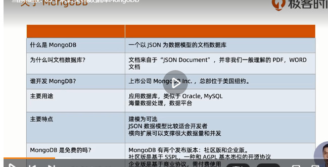

一个以json为数据模型的OLTP文档数据库

文档数据库，指json文档。并非一般的pdf，word等

mongoDB可以不需要建模。

mongoDB支持事务吗？最新的4.0已经可以支持事务，ACID事务。核心的交易型的数据也可以做到

mongoDB有免费的社区办和企业版，付费使用。

历史：

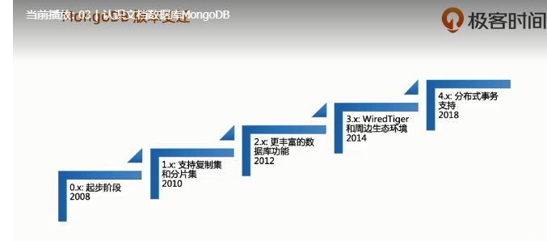

3.x阶段开始进入真正的成熟阶段。在此之前他们是没有存储引擎的，只是利用操作系统的api。通过整合wiredTiger，优化了性能方面的大批量操作的性能，突破了10倍的性能提升

4.x开始支持分布式事务，

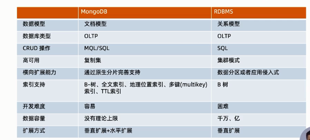

这个是和RDBMS的区别

MongoDB特色及优势：

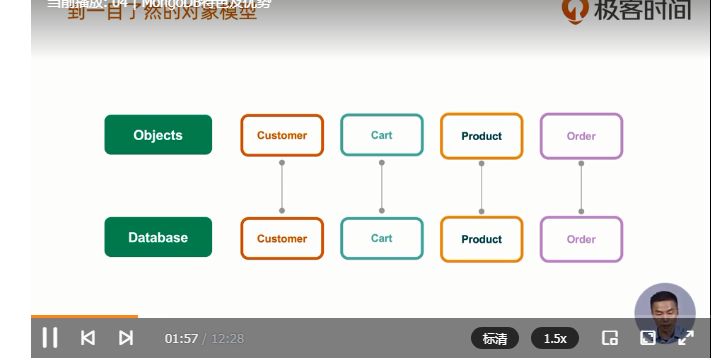

mongoDB存储的是对象的json，无模式（实际上也要进行模型设计）

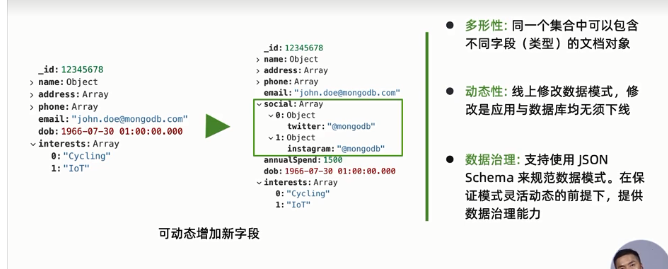

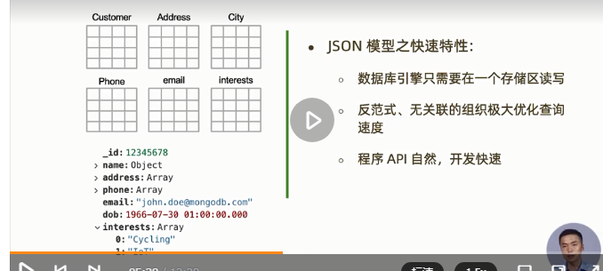

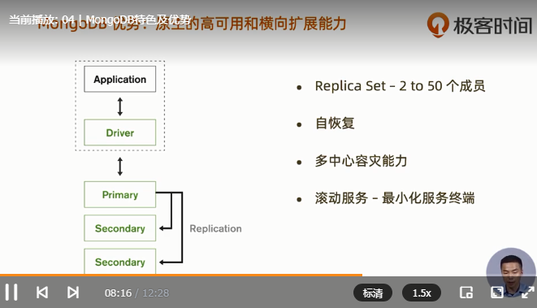

一般用3个分片就可以了。，Driver类似jdbc，

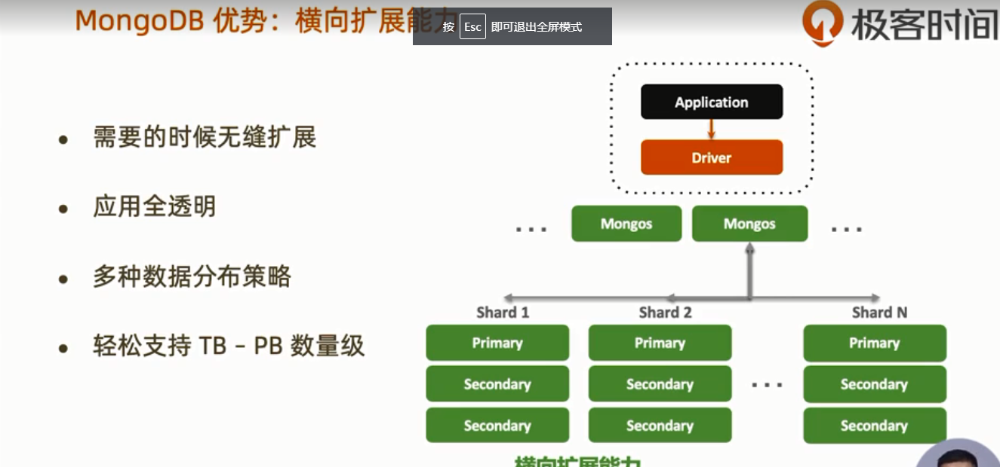

应用完全透明，不需要管理分片，无缝扩展，轻松支持TB，PB级别的数据

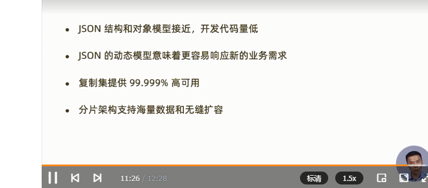

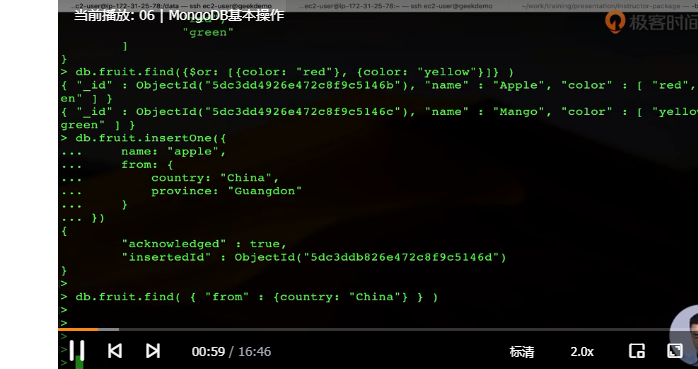

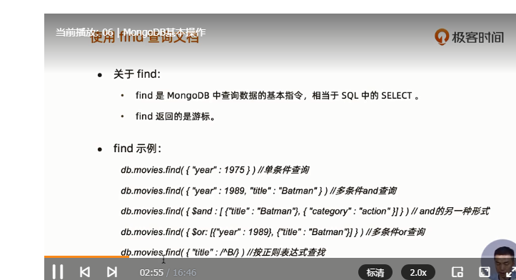

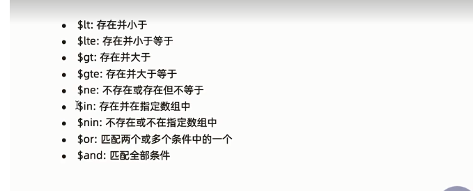

mongodb复制集及原理：

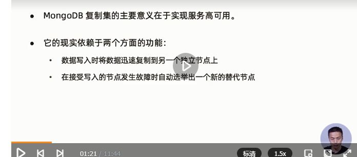

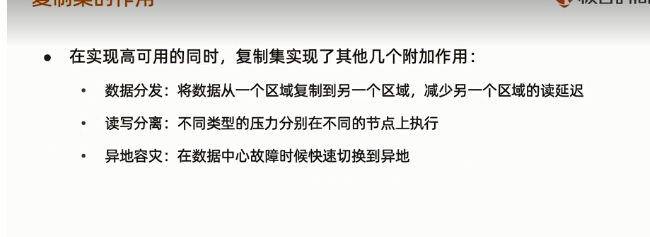

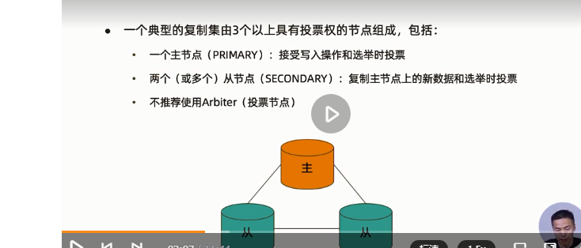

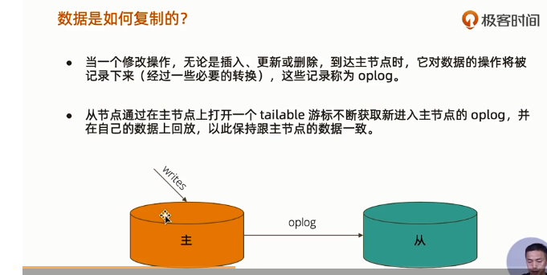

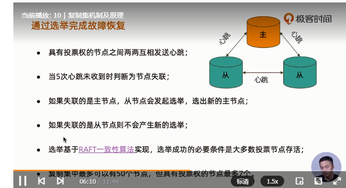

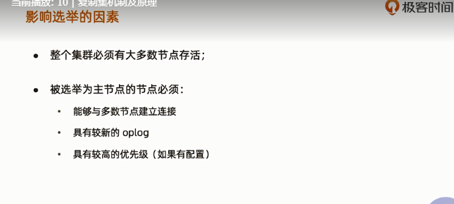

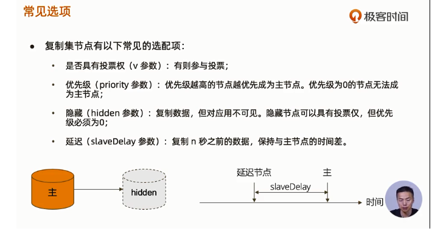

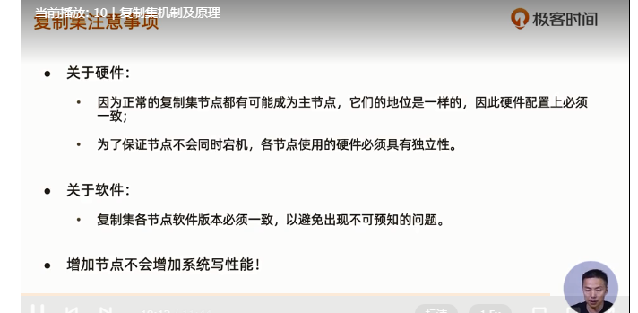

