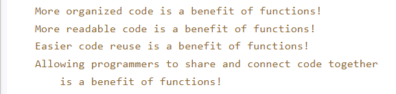
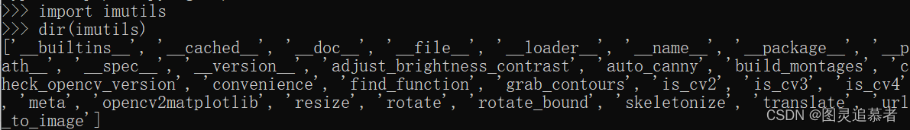
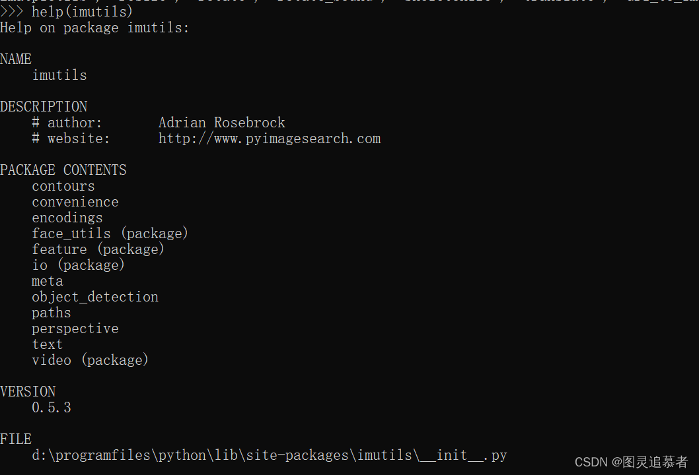
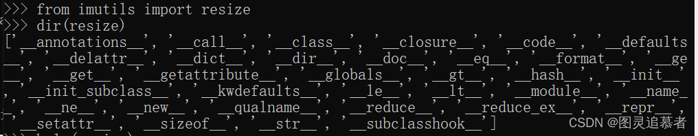
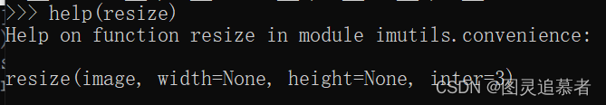

# 知识体系

# 内容

## 变量和类型

Python是面像对象的，在只用变量之前无需定义，也不需要定义变量的类型。所有的变量在Python都是对象

### Numbers

Python包含浮点和整型，也包括复杂数值，这里不详细说明。

```python
myint = 7
print(myint)
```

如果要定义浮点数，使用如下任一种notation

```python
myfloat = 7.0
print(myfloat)
myfloat = float(7)
print(myfloat)
```

### Strings

可以用单引号或双引号都可以。

```python
mystring = 'hello'
print(mystring)
mystring = "hello"
print(mystring)
```

区别就是单引号内可以直接引用双引号，双引号可以直接引用单引号。

```python
mystring = "Don't worry about apostrophes"
print(mystring)
```

Strings和Number的混合操作不被支持

```python
# This will not work!
one = 1
two = 2
hello = "hello"

print(one + two + hello)
```

上述执行会报错。


### Lists

```python
mylist = []
mylist.append(1)
mylist.append(2)
mylist.append(3)
print(mylist[0]) # prints 1
print(mylist[1]) # prints 2
print(mylist[2]) # prints 3

# prints out 1,2,3
for x in mylist:
    print(x)
```

如果越界，将会报错：

```python
mylist = [1,2,3]
print(mylist[10])
```

上述代码将会产生如下错误：

```txt
Traceback (most recent call last):
  File "<stdin>", line 2, in <module>
    print(mylist[10])
IndexError: list index out of range
```

实例：

```python
numbers = []
strings = []
names = ["John", "Eric", "Jessica"]

# write your code here
second_name = ["smith", "tik", "Elison"]


# this code should write out the filled arrays and the second name in the names list (Eric).
print(numbers)
print(strings)
print("The second name on the names list is %s" % second_name)
```


## 基本操作

### 算数操作

加减乘除和其他语言一样。

```python
number = 1 + 2 * 3 / 4.0
# 输出2.5
print(number)
```

两个连*号是幂操作：

```python
squared = 7 ** 2
cubed = 2 ** 3
# 输出分别是49和8
print(squared)
print(cubed)
```

### 字符串操作

字符串用加号：

```python
helloworld = "hello" + " " + "world"
# 输出hello world
print(helloworld)
```

字符串 * 一个数值为字符串重复：

```python
lotsofhellos = "hello" * 10
# 输出：hellohellohellohellohellohellohellohellohellohello
print(lotsofhellos)
print(lotsofhellos)
```

### list操作

+号作用在list上：

```python
even_numbers = [2,4,6,8]
odd_numbers = [1,3,5,7]
all_numbers = odd_numbers + even_numbers
# 输出：[1, 3, 5, 7, 2, 4, 6, 8]
print(all_numbers)
```

对list使用乘法，同字符串：

```python
# 输出：print([1,2,3] * 3)
print([1,2,3] * 3)
```

实例：

```python
x = object()
y = object()

# TODO: change this code
x_list = [x] * 10
y_list = [y] * 10
big_list = x_list + y_list

print("x_list contains %d objects" % len(x_list))
print("y_list contains %d objects" % len(y_list))
print("big_list contains %d objects" % len(big_list))

# testing code
if x_list.count(x) == 10 and y_list.count(y) == 10:
    print("Almost there...")
if big_list.count(x) == 10 and big_list.count(y) == 10:
    print("Great!")
    
# 输出：
    x_list contains 10 objects
    y_list contains 10 objects
    big_list contains 20 objects
    Almost there...
    Great!
```


## 字符串格式化

```python
# This prints out "Hello, John!"
name = "John"
# 输出：Hello, John!
print("Hello, %s!" % name)
```

多于一个参数，用逗号隔开，外面小括号：

```python
# This prints out "John is 23 years old."
name = "John"
age = 23
# 输出：John is 23 years old.
print("%s is %d years old." % (name, age))
```

列表的输出：

```python
# This prints out: A list: [1, 2, 3]
mylist = [1,2,3]
# 输出：A list: [1, 2, 3]
print("A list: %s" % mylist)
```

参考如下基本参数：

```
%s - String (or any object with a string representation, like numbers)
%d - Integers
%f - Floating point numbers
%.<number of digits>f - Floating point numbers with a fixed amount of digits to the right of the dot.
%x/%X - Integers in hex representation (lowercase/uppercase)
```

实例：

```python
data = ("John", "Doe", 53.44)
format_string = "Hello %s %s. Your current balance is $%s."
# 输出： Hello John Doe. Your current balance is $53.44.
print(format_string % data)
```


## 基本的字符串操作

```python
##########Sample-1################
astring = "Hello world!"
# 展示如果字符串包含',那么外面就用"包裹，反之也是
# 输出：single quotes are ' '
print("single quotes are ' '")
# 输出 12，len()作用于字符串是返回字符串的长度。
print(len(astring))

############Sample-2##################
astring = "Hello world!"
# 输出4. 这里和其他语言一样，index从0开始，
print(astring.index("o"))

##########Sample-3 #################
astring = "Hello world!"
# 输出3， l出现了3次。count()用于计算字符传出现的次数。
print(astring.count("l"))

########## Sample -4 ##############
astring = "Hello world!"
# 输出：lo w 
# 输出一个切片，输出index从3到6的字符，为什么不是7？和其他很多语言一样，这里不包括7，
print(astring[3:7])
# 输出：Hello w
# 如果冒号前面空，则输出从1到你数字的位置（exclude）
print(astring[:7])
# 输出：l
# 没有冒号，单独一个数字，则输出这个index位置的字符。
print(astring[3])
# 输出：lo world!
# 冒号后为空，则输出index到最后位置的字符。
print(astring[3:])

##########Sample -5 ################3
astring = "Hello world!"
# 输出：l 
# 这个是新的格式：[start:stop:step]，最后一个是步进，这个就表示从3开始，隔一个字符算一次
print(astring[3:7:2])
# 输出：lo w
# 这个和[3:7]一样的结果，因为步进默认是1
print(astring[3:7:1])

astring = "Hello world!"
# 输出：!dlrow olleH
# 这个有意思了，就是字符的倒排，看到步进式-1是，从后向前。
print(astring[::-1])

##########Sample -6 ################3
astring = "Hello world!"
#输出：HELLO WORLD!
print(astring.upper())
#输出：hello world!
print(astring.lower())

astring = "Hello world!"
#输出：True
print(astring.startswith("Hello"))
# 输出：False
print(astring.endswith("asdfasdfasdf"))
```


实例：

```python
s = "Strings are awesome!"
# Length should be 20
print("Length of s = %d" % len(s))

# First occurrence of "a" should be at index 8
print("The first occurrence of the letter a = %d" % s.index("a"))

# Number of a's should be 2
print("a occurs %d times" % s.count("a"))

# Slicing the string into bits
print("The first five characters are '%s'" % s[:5]) # Start to 5
print("The next five characters are '%s'" % s[5:10]) # 5 to 10
print("The thirteenth character is '%s'" % s[12]) # Just number 12
print("The characters with odd index are '%s'" %s[1::2]) #(0-based indexing)
print("The last five characters are '%s'" % s[-5:]) # 5th-from-last to end

# Convert everything to uppercase
print("String in uppercase: %s" % s.upper())

# Convert everything to lowercase
print("String in lowercase: %s" % s.lower())

# Check how a string starts
if s.startswith("Str"):
    print("String starts with 'Str'. Good!")

# Check how a string ends
if s.endswith("ome!"):
    print("String ends with 'ome!'. Good!")

# Split the string into three separate strings,
# each containing only a word
print("Split the words of the string: %s" % s.split(" "))
```


## 条件

```python
# S1
# Python用布尔表达式来计算条件，布尔表达式被比较或计算后返回True或False
x = 2
print(x == 2) # prints out True
print(x == 3) # prints out False
print(x < 3) # prints out True

# S2
# 注意复制用=号，而两个变量之间比较则用==号，不相等就是!=
# and 和 or用于复杂表达式
name = "John"
age = 23
if name == "John" and age == 23:   # True
    print("Your name is John, and you are also 23 years old.")

if name == "John" or name == "Rick":  # True
    print("Your name is either John or Rick.")
    
# S3
# in表达式表示是否包含的意思
name = "John"
if name in ["John", "Rick"]:  # True
    print("Your name is either John or Rick.")
```


Python代码使用缩排，而不是大括号{}来定义代码块。标准缩进是4个空格，tab和任意空格都是可以的。代码块不需要任何结束符。

```python
statement = False
another_statement = True
if statement is True:
    # do something
    pass
elif another_statement is True: # else if
    # do something else
    pass
else:
    # do another thing
    pass
```


```python
x = 2
if x == 2:
    print("x equals two!")
else:
    print("x does not equal to two.")
```

一个语句被计算成true，需要如下其中一个条件成立：

1. True，或表达式计算结果为True
2. 一个不是空的对象

为空的对象比如：空串""，空列表[]，数值0， False

### is操作符

不同于==，is操作不比较值，而是实例，

```python
x = [1,2,3]
y = [1,2,3]
print(x == y) # Prints out True
print(x is y) # Prints out False
```

### not操作符

```python
print(not False) # Prints out True
print((not False) == (False)) # Prints out False
```


## 循环

### for循环

```python
primes = [2, 3, 5, 7]
for prime in primes:
    print(prime)   
```

```python
# range函数返回一个迭代器，range是基于0的。
# Prints out the numbers 0,1,2,3,4
for x in range(5):
    print(x)

# Prints out 3,4,5
for x in range(3, 6):
    print(x)

# Prints out 3,5,7
for x in range(3, 8, 2):
    print(x)
```


###  while循环

```python
count = 0
while count < 5:
    print(count)
    count += 1  # This is the same as count = count + 1
```


### break 和continue

```python
# Prints out 0,1,2,3,4

count = 0
while True:
    print(count)
    count += 1
    if count >= 5:
        break

# Prints out only odd numbers - 1,3,5,7,9
for x in range(10):
    # Check if x is even
    if x % 2 == 0:
        continue
    print(x)
```


### 循环中的else

break退出不会走else。如果是条件不满足退出，则会走else。

```python
# Prints out 0,1,2,3,4 and then it prints "count value reached 5"

count=0
while(count<5):
    print(count)
    count +=1
else:
    print("count value reached %d" %(count))

# Prints out 1,2,3,4
for i in range(1, 10):
    if(i%5==0):
        break
    print(i)
else:
    print("this is not printed because for loop is terminated because of break but not due to fail in condition")
```


## 函数

函数使用了Python中的块，这个块有更多的代码甚至是另外一个块，块头是如下格式：block_keyword block_name(argument1,argument2, ...)。if， for，while就是block_keyword的例子。

函数的块头就是def，block_name就是函数名。比如：

```python
def my_function():
    print("Hello From My Function!")
```

函数可以接受参数：

```python
def my_function_with_args(username, greeting):
    print("Hello, %s , From My Function!, I wish you %s"%(username, greeting))
```

函数可以返回一个值，使用return：

```python
def sum_two_numbers(a, b):
    return a + b
```

### 如何调用？

和其他语言差不多，如下：

```python
# Define our 3 functions
def my_function():
    print("Hello From My Function!")

def my_function_with_args(username, greeting):
    print("Hello, %s, From My Function!, I wish you %s"%(username, greeting))

def sum_two_numbers(a, b):
    return a + b

# print(a simple greeting)
my_function()

#prints - "Hello, John Doe, From My Function!, I wish you a great year!"
my_function_with_args("John Doe", "a great year!")

# after this line x will hold the value 3!
x = sum_two_numbers(1,2)
```

一个实例：

```python
# Modify this function to return a list of strings as defined above
def list_benefits():
    return "More organized code", "More readable code", "Easier code reuse", "Allowing programmers to share and connect code together"

# Modify this function to concatenate to each benefit - " is a benefit of functions!"
def build_sentence(benefit):
    return "%s is a benefit of functions!" % benefit


def name_the_benefits_of_functions():
    list_of_benefits = list_benefits()
    for benefit in list_of_benefits:
        print(build_sentence(benefit))

name_the_benefits_of_functions()
```

上面代码输出如下：




## 类和对象

对象是变量和函数的封装，对象从类中获取属性和函数。类就是创建对象的模板。如下：

```python
class MyClass:
    variable = "blah"

    def function(self):
        print("This is a message inside the class.")
```

关于self：

- self只有在类的方法中才会有，其他函数或方法是不必带self的。
- 在调用时不必传入相应的参数。
- 在类的方法中，第一个参数永远是self，表示创建的类实例本身，而不是类本身。
- 可以把对象的各种属性绑定到self。

将类复制给一个对象，如下：

```python
class MyClass:
    variable = "blah"

    def function(self):
        print("This is a message inside the class.")

myobjectx = MyClass()
```

现在myobjectx 被赋值为一个Myclass的对象

### 存取对象变量

```python
class MyClass:
    variable = "blah"

    def function(self):
        print("This is a message inside the class.")

myobjectx = MyClass()
# 输出blah
print(myobjectx.variable)
```

可以创建同一个类的多个对象，那么每个对象都有类的变量的copy。

```python
class MyClass:
    variable = "blah"

    def function(self):
        print("This is a message inside the class.")

myobjectx = MyClass()
myobjecty = MyClass()

myobjecty.variable = "yackity"

# Then print out both values
# 打印 blah
print(myobjectx.variable)
# 打印 yackity
print(myobjecty.variable)
```

### 存取函数

```python
class MyClass:
    variable = "blah"

    def function(self):
        print("This is a message inside the class.")

myobjectx = MyClass()

# 输出：This is a message inside the class.
myobjectx.function()
```


### init函数

当类被初始化的时候会调用一个特殊的函数`__init__`用于在类中对变量进行赋值

```python
class NumberHolder:

   def __init__(self, number):
       self.number = number

   def returnNumber(self):
       return self.number

var = NumberHolder(7)
print(var.returnNumber()) #Prints '7'
```


实例：

```python
# define the Vehicle class
class Vehicle:
    name = ""
    kind = "car"
    color = ""
    value = 100.00
    def description(self):
        desc_str = "%s is a %s %s worth $%.2f." % (self.name, self.color, self.kind, self.value)
        return desc_str

# your code goes here
car1 = Vehicle()
car1.name = "Fer"
car1.color = "red"
car1.kind = "convertible"
car1.value = 60000.00

car2 = Vehicle()
car2.name = "Jump"
car2.color = "blue"
car2.kind = "van"
car2.value = 10000.00

# test code
print(car1.description())
print(car2.description())
```


## 字典

一个字典类似于数组，但是不适用索引而是用key-value。没有保存在字典里的值都可以用key获取，key可以是任何类型（字符串，数值，列表等）

```python
phonebook = {}
phonebook["John"] = 938477566
phonebook["Jack"] = 938377264
phonebook["Jill"] = 947662781
print(phonebook)
```

一个字典可以如下方式初始化：

```python
phonebook = {
    "John" : 938477566,
    "Jack" : 938377264,
    "Jill" : 947662781
}
# 输出：{'John': 938477566, 'Jill': 947662781, 'Jack': 938377264}
print(phonebook)
```

### 字典上的迭代遍历

就像列表一样，字典可以如下方式迭代，区别在于，字典不是按照存储的顺序。字典迭代基于key-value对之上。语法如下：

```python
phonebook = {"John" : 938477566,"Jack" : 938377264,"Jill" : 947662781}
for name, number in phonebook.items():
    print("Phone number of %s is %d" % (name, number))
```

### 删除一个值

```Python
phonebook = {
   "John" : 938477566,
   "Jack" : 938377264,
   "Jill" : 947662781
}
del phonebook["John"]
# 输出：{'Jack': 938377264, 'Jill': 947662781}
print(phonebook)
```

或者使用pop：

```python
phonebook = {
   "John" : 938477566,
   "Jack" : 938377264,
   "Jill" : 947662781
}
phonebook.pop("John")
print(phonebook)
```

实例：

```python
phonebook = {  
    "John" : 938477566,
    "Jack" : 938377264,
    "Jill" : 947662781
}  
# your code goes here

# testing code
if "Jake" in phonebook:  
    print("Jake is listed in the phonebook.")
    
if "Jill" not in phonebook:      
    print("Jill is not listed in the phonebook.")
```


## 模块和包

模块就是具有特殊功能的软件构建。比如一个乒乓游戏，其中一个模块可能负责游戏逻辑。另外一个模块在屏幕画图。每个模块包括一个可独立编辑的文件。

### 编写模块

Python中的模块就是带有.py后缀的python文件。模块的名称同文件的模块。一个python模块有一组函数，一组类、实现的变量若干。比如乒乓游戏，包含如下两个文件：

> mygame/
>
> ​     mygame/game.py
>
> ​     mygame/draw.py

game.py实现了游戏，应用了draw.py的draw_game函数。用其他的话说，draw这个模块实现了往屏幕上绘图的逻辑。

模块使用import命令引入其他模块。比如game.py脚本像这样：

```python
# game.py
# import the draw module
import draw

def play_game():
    ...

def main():
    result = play_game()
    draw.draw_game(result)

# this means that if this script is executed, then 
# main() will be executed
if __name__ == '__main__':
    main()
```

而draw模块可能长下面这个样子：

```python
# draw.py

def draw_game():
    ...

def clear_screen(screen):
    ...
```


上面的例子，game模块引入了draw模块，这样game模块就能使用在draw模块实现的函数了。看看main（）函数，会调用draw模块实现的draw_game函数来绘制game。为了使用draw模块的draw_game函数，我们比较函数是在哪个模块实现的，这就要用到点号，也就是为了引用draw模块的draw_game函数，我们必须引入draw模块，并且调用draw.draw_game.

当import draw指令执行的时候，python解释器会在脚本执行的目录找一个draw模块名称并且是.py结尾的文件。在上面这个情况下，就是找draw.py文件，如果找到了，就会被引入。如果没有找到，python就会继续在内建的模块中找。

你可能注意到了，当引入一个模块后，一个以.pyc结尾的文件会创建出来。这是一个编译后的python文件。Python把py文件编译成pyc文件，当下次再load这个模块的时候就不用再解析py文件了。也就是当pyc文件存在，模块就会被load，而不是py。这个过程对使用者透明。

### 将模块对象引入当前命令空间

（https://www.learnpython.org/en/Modules_and_Packages）

一个命令空间就是这样一个系统，每个对象都有一个名称能够被Python直接读取。我们使用from将draw_game引入到当前脚本的命令空间。

```python
# game.py
# import the draw module
from draw import draw_game

def main():
    result = play_game()
    draw_game(result)
```

上面的例子可以看到，draw_game不再有draw了。因为我们使用import指定了模块名称。

好处是你不用再每次都引用模块了。但是一个明明空间不能有相同的两个名字。所以import有可能覆盖一个已存在的对象。

### 引入一个模块的所有的对象

使用import *。

```python
# game.py
# import the draw module
from draw import *

def main():
    result = play_game()
    draw_game(result)
```

这个可能有一点risky，因为如果被引入的任务变化都会影响引入它的模块。但是更短，而且不用一个个引入该模块的所有的对象。

### 定制化引入的名称

引入的模块名称可以随意指定，使用import xxx as anotherxxx。这样有一个好多，如果两个模块都有同一个对象。

```python
# game.py
# import the draw module
if visual_mode:
    # in visual mode, we draw using graphics
    import draw_visual as draw
else:
    # in textual mode, we print out text
    import draw_textual as draw

def main():
    result = play_game()
    # this can either be visual or textual depending on visual_mode
    draw.draw_game(result)
```


### 模块初始化

一个模块首次被载入运行脚本，就会被初始化一次。如果另一个模块也引入了这个模块，它就不再被载入。所以模块中的变量是单例的。也就是说只被初始化一次。

```python
# draw.py

def draw_game():
    # when clearing the screen we can use the main screen object initialized in this module
    clear_screen(main_screen)
    ...

def clear_screen(screen):
    ...

class Screen():
    ...

# initialize main_screen as a singleton
main_screen = Screen()
```


扩展Python载入路径

除了默认从当前目录查找模块以及查找内建模块，还可以让Python指定查找路径。可以使用PYTHONPATH指定额外的模块路径。

```bash
PYTHONPATH=/foo python game.py
```

这个命令会执行game.py。使脚本可以从/foo目录查找模块，

也可以用如下方式：

```python
import sys

sys.path.append("/foo")
```

这样，/foo目录就加入到了python解释器搜索模块的路径中。

### 使用内建模块

https://docs.python.org/3/library/

如上地址可以查看python3有哪些内建库。

以python中的imutils库为例，使用以上dir()方法和help()方法查询该库的结果如下：





 查看某个库中函数的效果如下：





使用help（）函数可以了解某个库中某个函数的用法，参数个数，以及参数对应的属性等


比如要使用urllib库，：

```python
# import the library
import urllib

# use it
urllib.urlopen(...)
```

然后我们想查找在urllib中每个模块中实现的函数有哪些，可以使用dir函数：

```python
>>> import urllib
>>> dir(urllib)
['ContentTooShortError', 'FancyURLopener', 'MAXFTPCACHE', 'URLopener', '__all__', '__builtins__', 
'__doc__', '__file__', '__name__', '__package__', '__version__', '_ftperrors', '_get_proxies', 
'_get_proxy_settings', '_have_ssl', '_hexdig', '_hextochr', '_hostprog', '_is_unicode', '_localhost', 
'_noheaders', '_nportprog', '_passwdprog', '_portprog', '_queryprog', '_safe_map', '_safe_quoters', 
'_tagprog', '_thishost', '_typeprog', '_urlopener', '_userprog', '_valueprog', 'addbase', 'addclosehook', 
'addinfo', 'addinfourl', 'always_safe', 'basejoin', 'c', 'ftpcache', 'ftperrors', 'ftpwrapper', 'getproxies', 
'getproxies_environment', 'getproxies_macosx_sysconf', 'i', 'localhost', 'main', 'noheaders', 'os', 
'pathname2url', 'proxy_bypass', 'proxy_bypass_environment', 'proxy_bypass_macosx_sysconf', 'quote', 
'quote_plus', 'reporthook', 'socket', 'splitattr', 'splithost', 'splitnport', 'splitpasswd', 'splitport', 
'splitquery', 'splittag', 'splittype', 'splituser', 'splitvalue', 'ssl', 'string', 'sys', 'test', 'test1', 
'thishost', 'time', 'toBytes', 'unquote', 'unquote_plus', 'unwrap', 'url2pathname', 'urlcleanup', 'urlencode', 
'urlopen', 'urlretrieve']
```

这里找到了urlopen，我们再想了解urlopen具体的信息，可以使用help命令。

```python
help(urllib.urlopen)
```

### 编写package


package是包含多个package和模块的命名空间。他们是具有特殊要求的目录。

Python中的每个package都是一个目录，这个目录必须包含一个特殊的文件：\__init__\.py。这个文件（可以为空），表明它所在的目录是一个Python的package。引入方式同模块。

如果我们创建一个foo的目录（也就是package的name），然后我们就可以在这个package内创建一个叫bar的模块，然后我们在这个目录下面加一个\__init__.py的文件。

为了使用bar，我们有如下两种方式引入：

```python
import foo.bar
```

或者：

```python
from foo import bar
```

在第一种方式，我们访问bar的时候，必须在前面加上foo前缀。在第二中方式，我们不需要这样，因为我们把bar引入了命名空间。\_\_init\_\_.py文件也可以确定这个package暴露了哪些API模块，其他模块就是内部的，通过复写\__all__变量:

```python
__init__.py:

__all__ = ["bar"]
```

实例：

```python
import re

# Your code goes here
find_members = []
for member in dir(re):
    if "find" in member:
        find_members.append(member)
# 输出：['findall', 'finditer']
print(sorted(find_members))
```

https://www.learnpython.org/en/Numpy_Arrays
