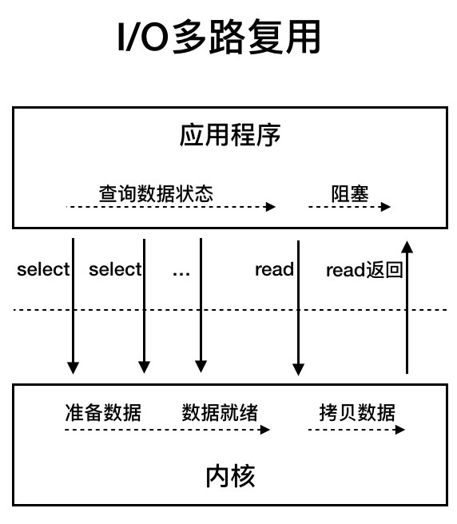

# 网络IO

网络IO的过程：

读数据（输入）：网线->网卡->驱动程序->内核buffer->socket->应用程序buffer

写数据（输出）：应用程序buffer->socket->内核buffer->驱动程序->网卡->网线

文件IO实际上是类似的一个过程。

同步不同步是说的请求方是不是一直参与拿数据这件事。如果请求方主动去拿（要么是等在那里（同步阻塞）直到有数据，要么是一直检查，有的话就等，没有就离开干自己的事（同步非阻塞）），就是同步，异步是相反，我发起读数据，然后就干我们的事了，内核你有数据给我拷贝到用户空间，通知我，我才拿数据（这个时候数据实际上已经在用户空间了）。

我们来看一下网络I/O的五种模型：

# 网络I/O模型

## 同步阻塞模型

### 流程

1. 应用程序调用read()读取数据，用户线程阻塞，让出CPU
2. 内核等待网卡数据到来，把数据从网卡拷贝到内核空间（更进一步，通过中断来实现），接着把数据拷贝到用户空间，再把用户线程叫醒

## 同步非阻塞 I/O

### 流程

1. 用户程序不断的调用read()，如果没数据，就直接返回，应用程序不阻塞；
2. 直到内核已经把数据拷贝到了内核缓冲区，这个时候read()阻塞，直到内核将数据拷贝到应用缓存，再把用户线程叫醒。

可以看到，和同步阻塞的不同是，read在没有数据的时候就会直接返回，不再阻塞在那里一直等待数据。相同点是：两个都是同步，都是要用户线程主动去询问操作系统是否有数据。

## I/O复用

前面我们看到，不管是阻塞还是非阻塞，应用程序的线程会直接参与到数据的查询，数据的读取。这就要求每有一个连接请求，都要分配专门的线程去进行这样的操作。如果应用有成千上万个连接，那么这个资源的消耗是巨大的。如下图，我每来一个连接，都要搞一个线程去服务这个连接。

因此就有了I/O复用，I/O复用的意思就是说有单独的或几个专门的线程去轮训多个通道（socket，channel），如果通道有数据了，就直接返回给用户线程，然后用户线程再去这个通道上去拿数据，也就是说，问操作系统有没有数据这个事情交给了专门的线程去做，这个线程不停的对这些fd进行轮训，任何一个通道有数据就返回，没数据就阻塞。有数据了就交由另外的工作线程去通道拿数据进行处理。

这里你可以看到，问有没有数据这个事被复用了，而不是每次都另外起个线程去问操作系统有没有数据，专门有人干了，而且是询问所有的通道。

这里面我们也看到，原来的同步的读read操作被分成两部分了，先是发起select()，问内核准备好了吗。如果准备好了，用户再发起read操作。read还是阻塞，但是read这个时候就是等操作系统将内核的数据拷贝到用户空间了。

上面右边的图提现了线程相关的信息，select可以放到一个或多个线程里面处理。receiver线程可以由线程池来做处理。这样一个线程池专做发现有没有数据包过来这件事，另外一个线程池用来处理数据（业务逻辑）。

回过头来我们再看最上面那张图。从数据的两个阶段来看（一个是等待数据，一个是数据已经到了内核，需要拷贝到用户缓冲）。同步和非同步和I/O复用，其实两个阶段都一样，只是第一个阶段的方式不一样，一个是全程阻塞，一个是不断的轮训，

那么第4,5两种不一样了。4,5两种多事操作系统会主动通知了。4,5的区别一个是做了一半的事情（4）：仅仅通知你内核已经有数据了，应用还得去取一下。一个是全部都给你准备好了，只要回调一下你就可以了，数据这时候也给你准备好了。5实际上没有两阶段了。

那么阻塞和非阻塞的区别是啥。区别就是用户线程到内核缓冲区拿数据的时候，如果没数据（数据还没到缓冲区），应用线程到底阻不阻塞的问题，如果阻塞，那就是同步阻塞，用户线程会一直等到数据到缓冲区，然后把数据取回来。如果不阻塞，没数据就直接返回了，那么就是非阻塞，所以非阻塞应用线程就要不断轮训，当缓冲区有数据了，那么这时候用户线程就阻塞了，直到返回数据。这就要求如果应用你要读，那你就必须不断的轮询，知道有数据你才会阻塞拿到数据。

I/O复用不仅仅体现在我在轮询的时候复用了（用一个单独的线程去轮询所有的通道），而且还在于询问线程通知receiver线程的时候，receiver处理完了还可以再处理其他的通道。也就是用线程池处理，替代了，发现一个有数据有new一个线程，让处理数据的也复用起来。

I/O复用的思路就是系统提供了一种函数可以同时监控多个fd的操作，这个函数其实就是我们常说的select,poll,epoll(只有linux才有)。有了这个函数，应用程序就可以用select去监听多个fd，select函数监控的fd只要有任何一个数据状态准备好了，select就会返回可读状态，这时询问线程再通知处理数据的线程（工作线程），对应的工作现场再发起recvfrom请求去读取数据。如下图：

## 信号驱动I/O模型

这个模型实际上是一个质的变化，由操作系统主动给出信号说，这个通道有数据了，然后询问线程就可以通知工作线程读取数据（读取的流程还是一样的）。这样就避免了I/O复用模型进行疯狂的轮询，空耗CPU（因为大部分时间连接都是空的，轮询相当于做无用功）。如下图：

## 异步I/O

思想就是，我不就是读一个数据吗，不就是写数据吗？我read，write告诉你读啥写啥不就可以了。我为什么要轮询。为什么操作系统不能有数据了主动通知我？看下面这个图：

这个才是真正的异步。应用调用aio_reade直接返回，注册一个监听器。完事，然后改干啥干啥。完了内核将数据拷贝到用户缓冲后直接通知监听器，OK。

目前windows里有IOCP是完全异步的。linux下完全异步现在内核还没有支持？

# 同步/异步/阻塞/不阻塞的关系和区别

# i/o复用的实现

# select/poll/epoll

> select是个系统调用，提供了一种用于实现多路复用I/O的机制。
>
> 优点：具有很高的移植性，像OS一样的每个unix系统都具有它