# JDBC必知必会

## 那些好用的连接池

### HikariCP

号称性能很好，比其他的都好很多，里面有很多关于性能的代码优化，之所以HikariCP这么快是因为HikariCP在各个地方做了各种各样的优化。

HikariCP是spring boot 2.x默认自带的数据库连接池，只要配置spring.datasource.hikari.*即可（spring boot1.x 默认是tomcat的连接池

### Druid

最大的特点就是监控，帮助发现很多问题，而且强调不会影响太多的性能。能防SQL注入，内置logging能诊断hack行为。

有一个界面，可以实时的看到数据的一些状态。

内置ExceptionSorter，数据库密码加密等。

还有一个特点，扩展点很多，在很多地方都有扩展点可以让我们扩展。

配置：

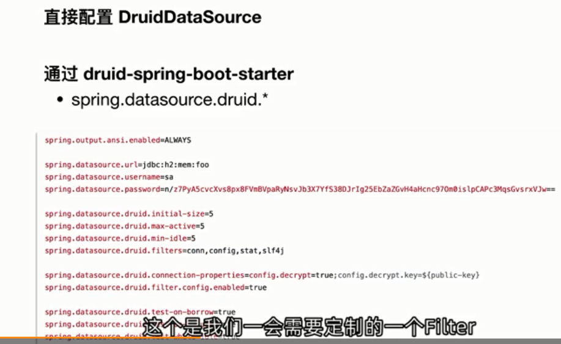

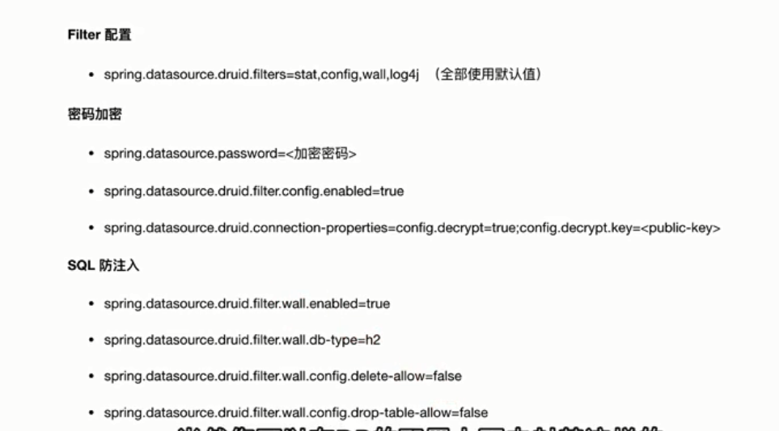

上面包括了一些SQL防注入的能力。

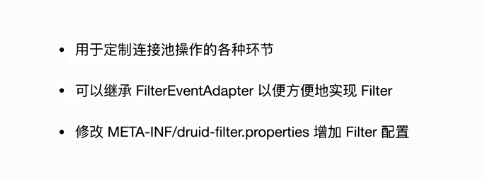

这个是怎么使用filter做扩展。

另外，如果你要引入其他的连接池，那么要在starter-jdbc里面把hikariCP排除掉

### 如何选择连接池

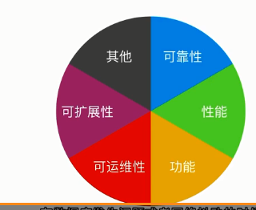

# O/R mapping

## 认识JPA

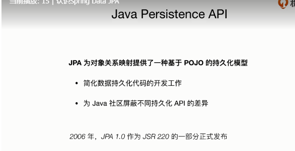

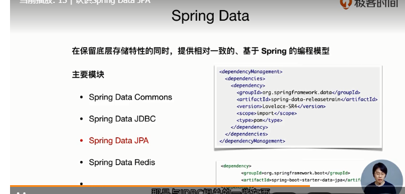

## Mybatis

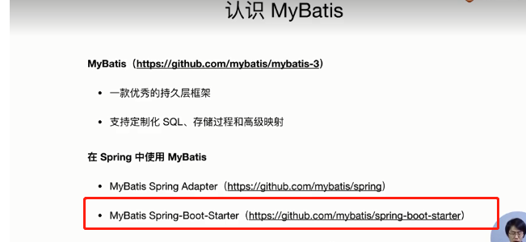

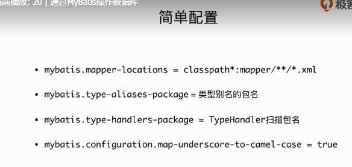

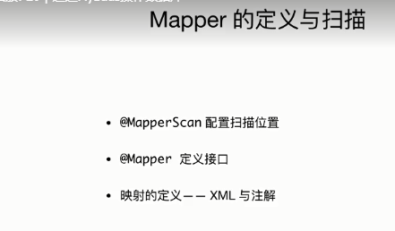

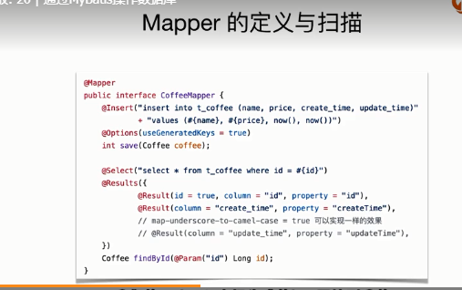

# 链路追踪

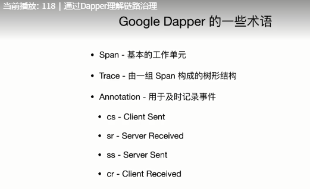

Span可以理解为一次RPC调用，Trace

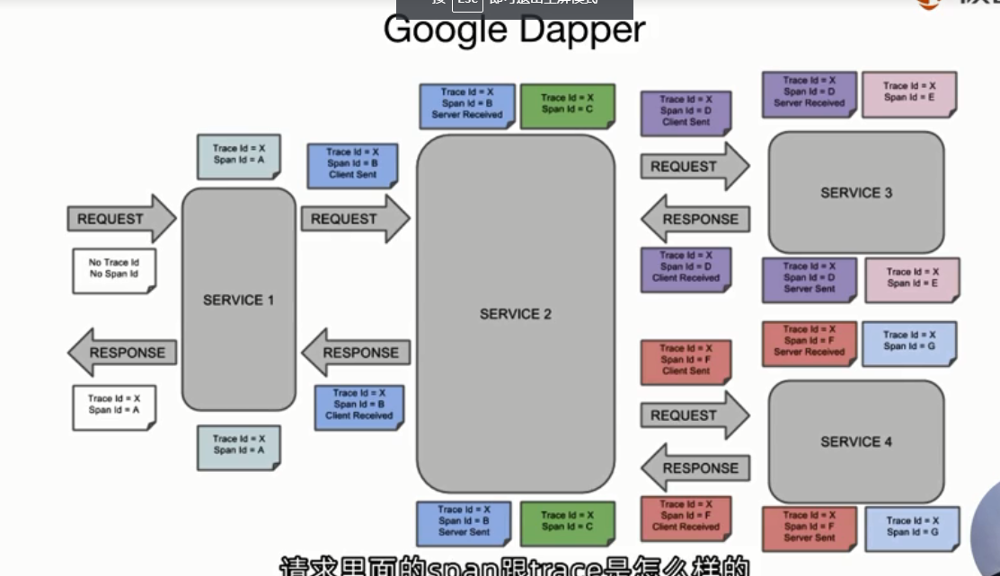

## spring cloud sleuth

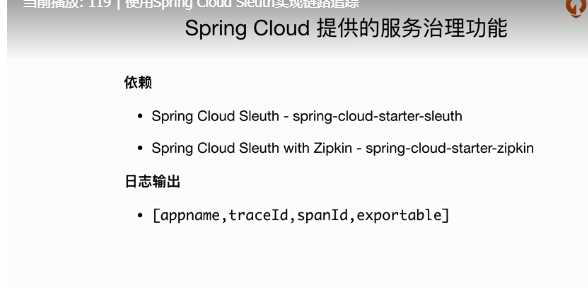

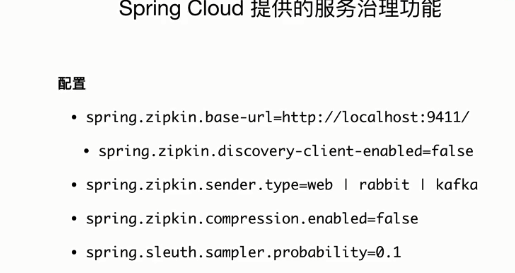

# 数据访问进阶

## 通过AOP打印数据访问层的摘要

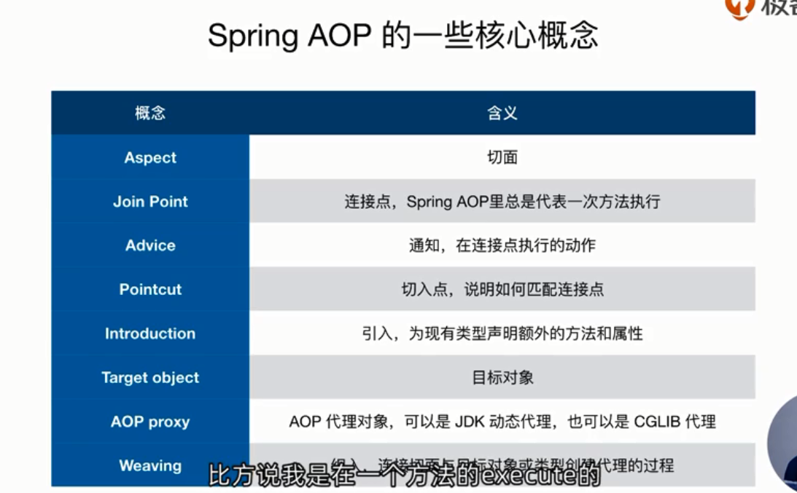

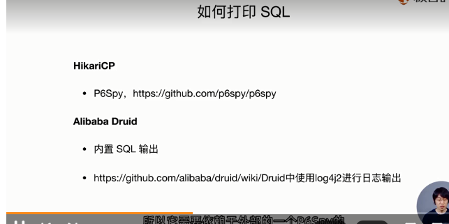

Druid内置有输出功能，

但是HikariCp是没有的，要借助其他工具，比如P6Spy
