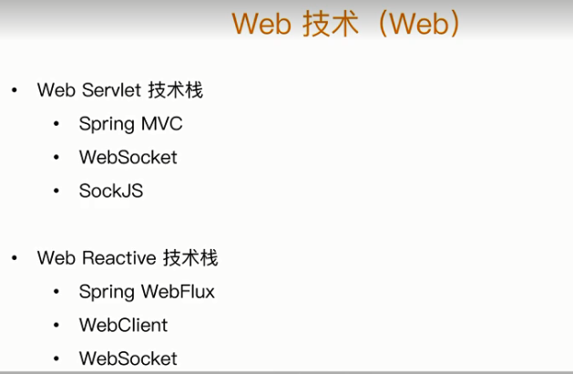
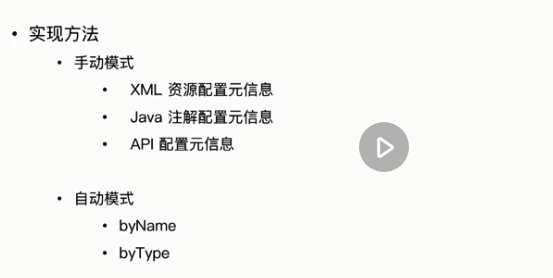

# spring framework总览

## 核心特性、数据存储、web技术、框架整合

### 核心特性


### 数据存储


O/R映射：早期对hibernate的支持和早期对JDO的支持（替代者：现在的JPA，其实现hibernate）

XML编列：和序列化反序列化进行类比的话，序列号就相当于XML编列，反序列化就是反编列。jaxb就是一种xml编列

### Web技术



WebSocket在Servlet3。0中才支持

如果了解了Web Servlet那么Reactive就比较容易理解了，很多东西和Web Servlet相似

### 框架整合和测试


JJMX：主要关注java的运维测，spring使得JMX更简单。spring framework（sf，简称）1。2开始引入了@ManagedResource

spring测试包含如下几个部分：


## Spring版本特性


3.x里面引入了大量的注解，我们都知道java5里面开始支持注解，因此这个版本以来java5. 3.x确定spring的内核。

4.x 是对spring boot 1.x的支持（spring boot 1.x是基于spring 4.x开发的） ，spring boot 2是基于spring 5.x开发的。

## spring 模块化设计


spring beans和spring-context就是ioc的核心实现，

无论spring beans还是spring context等都是需要spring-core来支持的

spring-jcl是5.x的，是为了支持java的日志还有logback等的，因为外部的日志容易变化，spring统一了一下

spring-jms是针对规范的一个支持

spring-messaging是针对新型的包括消息中间件kafka，等等的一个封装

spring-oxm也就是xml编列，

java语法特性的主要特性演变：


## JDK API实践：spring如何取舍java io，集合，反射等的api的使用


## spring编程模型


# spring IoC容器概述


## spring ioc依赖查找

我们已经知道了Ioc的实现由两种方式，一种是依赖查找，一种是依赖注入。

可以通过name查找，也可以通过id查找，name和id在上下文中必须是唯一的。

一个spring应用里面有多个上下文


实时查找就不说了，延迟查找可以使用ObjectFactory<T>的方式。

根据Bean类型查找，可以查找单个bean（这个简单就不多说了，用getBean(Class)这个接口就行了）。如果是要查找集合Bean，那么就要用到ListableFactoryBean了


根据java注解查找：getBeanWithAnnotation，还是通过ListableBeanFactory，可以查找到多个。

## spring 依赖注入


## Spring Ioc依赖来源

### 自定义bean

> 就是我们自己在spring应用里面定义的bean，通过注解，或xml配置的bean标签定义的bean，这种类型是最最常见的一种bean

### 容器内建bean对象

> 比如Enviroment对象，

### 容器内建依赖

## Spring Ioc配置元信息


## BeanFactory和ApplicationContext谁才是Ioc容器

BeanFactory是底层的容器，ApplicationContext在这上面增加了一些东西

ApplicationContext是BeanFactory的超集，具有beanFactory的所有功能并提供了一些企业级的功能。底层ApplicationContext组合了BeanFactory的实现。

## Spring应用上下文


## 使用Ioc容器


## Ioc容器生命周期

# Spring Bean基础


## 定义Spring Bean


### BeanDefinition


### BeanDefinition构建

1. 通过BeanDefinitionBuilder
2. 通过AbstractBeanDefinition以及派生类


### BeanDefinition注册


1. xml配置元信息
2. java注解配置元信息
3. java api配置元信息


## 实例化bean


## 初始化spring bean


## Spring bean延迟加载


非延迟加载，在spring上下文启动的过程中初始化，延迟加载的bean在真正要bean依赖查找的时候才做加载。


## Spring bean销毁


## spring bean垃圾回收


# Spring Ioc依赖查找


## 依赖查找的前世今生


## 单一类型依赖查找


## 集合类型依赖查找


## 层次性依赖查找


## 延迟依赖查找


## 安全依赖查找


是否安全：表示getBean是不是一定能找到bean，对于getBean，可能会存在不存在bean，或bean创建失败等异常情况。

## 内建可查找的依赖


## 依赖查找中的经典异常


# Spring Ioc依赖注入


## 依赖注入的模式和类型


字段注入是直接将bean注入到这个字段，是比较危险的一个操作，spring官方是不想采纳的。比如@Autowired方式，就要依赖Spring的api。是依赖外部的依赖，不是那么纯粹。如果用通用的api就要用@Resource。

## 自动绑定Autowiring


## 自动绑定Autowiring的模式


如果出现多个类型相同的bean，那么解决方法有如下几个：

1. 去掉多于的bean定义
2. 第二种方式就是把某个bean设置为primary
3. @Autowired注解和@Qulifier注解一起，类型 + 名称

### 自动绑定的限制和不足


## Setter方法注入




重点要理解一下api配置元信息：使用beandefinition

## 构造器注入


## 字段注入


是我们经常会用到的一种注入方式，虽然官方不推荐

@Autowired会忽略掉静态方法和静态字段，所以他的注入是实例字段注入，方法注入并不是只有@Autowired，


## 方法注入


除了字段注入，也可以用方法注入：也就是这些注解放到方法的上面进行自动的注入


## 接口回调注入


## 依赖注入类型选择


setter方法注入的缺点是注入时机的先后顺序完全依赖于用户的操作。

字段注入，在spring或spring boot里面处于淘汰状态，官方也不推荐

## 基础类型注入


这里有类型转化的发生，如上列出的都可以都直接用<property name="",value=""/>方式来注入，spring会类型转换为对应的标量类型或其他类型。基本上都是将value的值（string类型）转化为具体的类型。

## 集合类型的注入


```java
public class User implements BeanNameAware {

    private Long id;
    private String name;
    private City city;
    // 数组类的注入
    private City[] workCities;
    private List<City> lifeCities;
}

// xml配置文件
<bean id="user" class="org.geekbang.thinking.in.spring.ioc.overview.domain.User">
        <property name="id" value="1"/>
        <property name="name" value="小马哥"/>
        <property name="city" value="HANGZHOU"/>
        <property name="workCities" value="BEIJING,HANGZHOU"/>
        <property name="lifeCities">
            <list>
                <value>BEIJING</value>
                <value>SHANGHAI</value>
            </list>
        </property>
        // 也可以这样
        // <property name="lifeCities" value="BEIJING,HANGZHOU"/>
        <property name="configFileLocation" value="classpath:/META-INF/user-config.properties"/>
    </bean>
    
public enum City {
    BEIJING,
    HANGZHOU,
    SHANGHAI
}
```

如上为枚举数据的注入方式，还有list集合的注入


## 限定注入


比如如果User有两个实现，那么可以用@Autowired @Qulifier（“user的其中一个bean名称”）来限定来注入哪一个。

```java
    @Autowired
    private User user;    

// @Qulifier进行了分组，因此qulifiedUsers将只会注入下面的两个实例user1和user2
// 不会注入user
    @Autowired
    @Qualifier
    private Collection<User> qualifiedUsers; // 

// 这里不会包含加了@qulifier注解的user bean实例
    @Autowired
    private Collection<User> nonQualifiedUsers; // 

@Bean
    @Qualifier // 进行逻辑分组
    public User user1() {
        return createUser(7L);
    }

    @Bean
    @Qualifier // 进行逻辑分组
    public static User user2() {
        return createUser(8L);

    }
```

另外，像@LoadBalance这样的注解，看其申明就知道是@Qulifier的扩展，因此可以进行分组，RestTemplate上有@LoadBanlance注解的就具有负载均衡的能力，


## 延迟依赖注入


