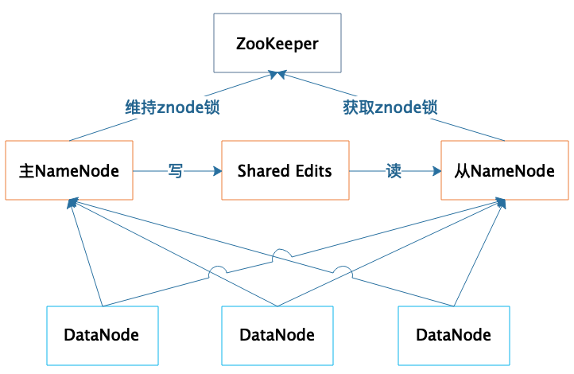

# 预习

## 大数据技术发展史

2004， Google发布三篇论文，也就是”三驾马车“，分别是分布式文件系统GFS，大数据分布式计算框架MapReduce，和NoSQL数据库系统BigTable。

你知道，**搜索引擎**主要就做两件事情，一个是网页抓取，一个是索引构建，而在这个过程中，有大量的数据需要存储和计算。这“三驾马车”其实就是用来解决这个问题的，你从介绍中也能看出来，一个文件系统、一个计算框架、一个数据库系统。

现在你听到分布式、大数据之类的词，肯定一点儿也不陌生。

但你要知道，在 2004 年那会儿，整个互联网还处于懵懂时代，Google 发布的论文实在是让业界为之一振，大家恍然大悟，原来还可以这么玩。

因为那个时间段，大多数公司的关注点其实还是聚焦在单机上，在思考如何提升单机的性能，寻找更贵更好的服务器。而 Google 的思路是部署一个大规模的服务器集群，通过分布式的方式将海量数据存储在这个集群上，然后利用集群上的所有机器进行数据计算。 

这样，Google 其实不需要买很多很贵的服务器，它只要把这些普通的机器组织到一起，就非常厉害了。

当时的天才程序员，也是 Lucene 开源项目的创始人 Doug Cutting 正在开发开源搜索引擎 Nutch，阅读了 Google 的论文后，他非常兴奋，紧接着就根据论文原理初步实现了类似 GFS 和 MapReduce 的功能

两年后的 2006 年，Doug Cutting 将这些大数据相关的功能从 Nutch 中分离了出来，然后启动了一个独立的项目专门开发维护大数据技术，这就是后来赫赫有名的 Hadoop，主要**包括 Hadoop 分布式文件系统 HDFS 和大数据计算引擎 MapReduce。**

Hadoop 发布之后，Yahoo 很快就用了起来。大概又过了一年到了 2007 年，百度和阿里巴巴也开始使用 Hadoop 进行大数据存储与计算。

Facebook 又发布了 Hive。**Hive** 支持使用 SQL 语法来进行大数据计算，比如说你可以写个 Select 语句进行数据查询，然后 Hive 会把 SQL 语句转化成 MapReduce 的计算程序。

这样，熟悉数据库的数据分析师和工程师便可以无门槛地使用大数据进行数据分析和处理了。Hive 出现后极大程度地降低了 Hadoop 的使用难度，迅速得到开发者和企业的追捧。据说，2011 年的时候，Facebook 大数据平台上运行的作业 90% 都来源于 Hive。


随后，众多 Hadoop 周边产品开始出现，大数据生态体系逐渐形成，其中包括：专门将关系数据库中的数据导入导出到 Hadoop 平台的 Sqoop；针对大规模日志进行分布式收集、聚合和传输的 **Flume**；MapReduce 工作流调度引擎 Oozie 等。

在 Hadoop 早期，MapReduce 既是一个执行引擎，又是一个资源调度框架，服务器集群的资源调度管理由 MapReduce 自己完成。但是这样不利于资源复用，也使得 MapReduce 非常臃肿。于是一个新项目启动了，将 MapReduce 执行引擎和资源调度分离开来，这就是**Yarn**。2012 年，Yarn 成为一个独立的项目开始运营，随后被各类大数据产品支持，成为大数据平台上最主流的资源调度系统。

同样是在 2012 年，UC 伯克利 AMP 实验室（Algorithms、Machine 和 People 的缩写）开发的**Spark** 开始崭露头角。当时 AMP 实验室的马铁博士发现使用 MapReduce 进行机器学习计算的时候性能非常差，因为机器学习算法通常需要进行很多次的迭代计算，而 MapReduce 每执行一次 Map 和 Reduce 计算都需要重新启动一次作业，带来大量的无谓消耗。还有一点就是 MapReduce 主要使用磁盘作为存储介质，而 2012 年的时候，内存已经突破容量和成本限制，成为数据运行过程中主要的存储介质。Spark 一经推出，立即受到业界的追捧，并逐步替代 MapReduce 在企业应用中的地位。

一般说来，像 MapReduce、Spark 这类计算框架处理的业务场景都被称作批处理计算，因为它们通常针对以“天”为单位产生的数据进行一次计算，然后得到需要的结果，这中间计算需要花费的时间大概是几十分钟甚至更长的时间。因为计算的数据是非在线得到的实时数据，而是历史数据，所以这类计算也被称为**大数据离线计算**。

而在大数据领域，还有另外一类应用场景，它们需要对实时产生的大量数据进行即时计算，比如对于遍布城市的监控摄像头进行人脸识别和嫌犯追踪。这类计算称为大数据流计算，相应地，有 Storm、Flink、Spark Streaming 等流计算框架来满足此类大数据应用的场景。 流式计算要处理的数据是实时在线产生的数据，所以这类计算也被称为**大数据实时计算**。

在典型的大数据的业务场景下，数据业务最通用的做法是，采用批处理的技术处理历史全量数据，采用流式计算处理实时新增数据。而像**Flink 这样的计算引擎，可以同时支持流式计算和批处理计算**。

除了大数据批处理和流处理，**NoSQL** 系统处理的主要也是大规模海量数据的存储与访问，所以也被归为大数据技术。 NoSQL 曾经在 2011 年左右非常火爆，涌现出 **HBase**、**Cassandra** 等许多优秀的产品，其中 HBase 是从 Hadoop 中分离出来的、基于 HDFS 的 NoSQL 系统。

上面我讲的这些基本上都可以归类为**大数据引擎或者大数据框架**。而**大数据处理的主要应用场景包括数据分析、数据挖掘与机器学习。数据分析主要使用 Hive、Spark SQL 等 SQL 引擎完成；数据挖掘与机器学习则有专门的机器学习框架 TensorFlow、Mahout 以及 MLlib 等**，内置了主要的机器学习和数据挖掘算法。


此外，大数据要存入分布式文件系统（HDFS），要有序调度 MapReduce 和 Spark 作业执行，并能把执行结果写入到各个应用系统的数据库中，还需要有一个大数据平台整合所有这些大数据组件和企业应用系统。


## 大数据应用发展史

### 大数据应用的搜索引擎时代

作为全球最大的搜索引擎公司，Google 也是我们公认的大数据鼻祖，它存储着全世界几乎所有可访问的网页，数目可能超过万亿规模，全部存储起来大约需要数万块磁盘。为了将这些文件存储起来，Google 开发了 GFS（Google 文件系统），将数千台服务器上的数万块磁盘统一管理起来，然后当作一个文件系统，统一存储所有这些网页文件。

你可能会觉得，如果只是简单地将所有网页存储起来，好像也没什么太了不起的。没错，但是 Google 得到这些网页文件是要构建搜索引擎，需要对所有文件中的单词进行词频统计，然后根据 PageRank 算法计算网页排名。这中间，Google 需要对这数万块磁盘上的文件进行计算处理，这听上去就很了不起了吧。当然，也正是基于这些需求，Google 又开发了 MapReduce 大数据计算框架。

其实在 Google 之前，世界上最知名的搜索引擎是 Yahoo。但是 Google 凭借自己的大数据技术和 PageRank 算法，使搜索引擎的搜索体验得到了质的飞跃，人们纷纷弃 Yahoo 而转投 Google。所以当 Google 发表了自己的 GFS 和 MapReduce 论文后，Yahoo 应该是最早关注这些论文的公司。

Doug Cutting 率先根据 Google 论文做了 Hadoop，于是 Yahoo 就把 Doug Cutting 挖了过去，专职开发 Hadoop。可是 Yahoo 和 Doug Cutting 的蜜月也没有持续多久，Doug Cutting 不堪 Yahoo 的内部斗争，跳槽到专职做 Hadoop 商业化的公司 Cloudera，而 Yahoo 则投资了 Cloudera 的竞争对手 HortonWorks。


### 大数据应用的数据仓库时代

经我们在进行数据分析与统计时，仅仅局限于数据库，在数据库的计算环境中对数据库中的数据表进行统计分析。并且受数据量和计算能力的限制，我们只能对最重要的数据进行统计和分析。这里所谓最重要的数据，通常指的都是给老板看的数据和财务相关的数据。

而 Hive 可以在 Hadoop 上进行 SQL 操作，实现数据统计与分析。也就是说，我们可以用更低廉的价格获得比以往多得多的数据存储与计算能力。我们可以把运行日志、应用采集数据、数据库数据放到一起进行计算分析，获得以前无法得到的数据结果，企业的数据仓库也随之呈指数级膨胀。

你看，在数据仓库时代，只要有数据，几乎就一定要进行统计分析，如果数据规模比较大，我们就会想到要用 Hadoop 大数据技术，这也是 Hadoop 在这个时期发展特别快的一个原因。技术的发展同时又促进了技术应用，这也为接下来大数据应用走进数据挖掘时代埋下伏笔。

### 大数据应用的数据挖掘时代

讲个真实的案例，很早以前商家就通过数据发现，买尿不湿的人通常也会买啤酒，于是精明的商家就把这两样商品放在一起，以促进销售。啤酒和尿不湿的关系，你可以有各种解读，但是如果不是通过数据挖掘，可能打破脑袋也想不出它们之间会有关系。

在商业环境中，如何解读这种关系并不重要，重要的是它们之间只要存在关联，就可以进行关联分析，最终目的是让用户尽可能看到想购买的商品。

更进一步，大数据还可以将每个人身上的不同特性挖掘出来，打上各种各样的标签：90 后、生活在一线城市、月收入 1～2 万、宅……这些标签组成了用户画像，并且只要这样的标签足够多，就可以完整描绘出一个人，甚至比你最亲近的人对你的描述还要完整、准确

现代生活几乎离不开互联网，各种各样的应用无时不刻不在收集数据，这些数据在后台的大数据集群中一刻不停地在被进行各种分析与挖掘。这些分析和挖掘带给我们的是美好还是恐惧，依赖大数据从业人员的努力。但是可以肯定，不管最后结果如何，这个进程只会加速不会停止，你我只能投入其中。

### 大数据应用的机器学习时代

在过去，我们受数据采集、存储、计算能力的限制，只能通过抽样的方式获取小部分数据，无法得到完整的、全局的、细节的规律。而现在有了大数据，可以把全部的历史数据都收集起来，统计其规律，进而预测正在发生的事情。这就是机器学习。

再举个和我们生活更近的例子。把人聊天的对话数据都收集起来，记录每一次对话的上下文，如果上一句是问今天过得怎么样，那么下一句该如何应对，通过机器学习可以统计出来。将来有人再问今天过得怎么样，就可以自动回复下一句话，于是我们就得到一个会聊天的机器人。Siri、天猫精灵、小爱同学，这样的语音聊天机器人在机器学习时代已经满大街都是了。

将人类活动产生的数据，通过机器学习得到统计规律，进而可以模拟人的行为，使机器表现出人类特有的智能，这就是人工智能 AI。


大数据从搜索引擎到机器学习，发展思路其实是一脉相承的，就是想发现数据中的规律并为我们所用。所以很多人把数据称作金矿，大数据应用就是从这座蕴含知识宝藏的金矿中发掘有商业价值的真金白银出来。数据中蕴藏着价值已经是众所周知的事情了，那么如何从这些庞大的数据中发掘出我们想要的知识价值，这正是大数据技术目前正在解决的事情，包括大数据存储与计算，也包括大数据分析、挖掘、机器学习等应用。


## 大数据引用领域：数据驱动一切

### 在医疗领域的应用

### 在教育领域的应用

### 在社交媒体领域的应用

### 在金融领域的应用

大数据在金融领域应用比较成熟的是**大数据风控**

在金融借贷中，如何识别出高风险用户，要求其提供更多抵押、支付更高利息、调整更低的额度，甚至拒绝贷款，从而降低金融机构的风险？事实上，金融行业已经沉淀了大量的历史数据，利用这些数据进行计算，可以得到用户特征和风险指数的曲线（即风控模型）。当新用户申请贷款的时候，将该用户特征带入曲线进行计算，就可以得到该用户的风险指数，进而自动给出该用户的贷款策略。

### 大数据在新零售领域的应用

### 大数据在交通领域的应用


# hadoop大数据原理和架构

传统的软件计算处理模型，都是“输入 -> 计算 -> 输出”模型。也就是说，一个程序给它传入一些数据也好，它自己从某个地方读取一些数据也好，总是先有一些输入数据，然后对这些数据进行计算处理，最后得到输出结果。但是在互联网大数据时代，需要计算处理的数据量急速膨胀。一来是因为互联网用户数远远超过传统企业的用户，相应产生了更大量的数据；二来很多以往被忽视的数据重新被发掘利用，比如用户在一个页面的停留时长、鼠标在屏幕移动的轨迹都会被记录下来进行分析。在稍微大一点的互联网企业，需要计算处理的数据量常常以 PB 计（1015 Byte）。正因为如此，传统的计算处理模型不能适用于大数据时代的计算要求。你能想象一个程序读取 PB 级的数据进行计算是怎样一个场景吗？一个程序所能调度的网络带宽（通常数百 MB）、内存容量（通常几十 GB ）、磁盘大小（通常数 TB）、CPU 运算速度是不可能满足这种计算要求的。


## 移动计算和移动数据更划算

大数据技术和传统的软件开发技术在架构思路上有很大不同，大数据技术更为关注数据，所以相关的架构设计也围绕数据展开，如何存储、计算、传输大规模的数据是要考虑的核心要素。传统的软件计算处理模型，都是“输入  ->  计算  ->  输出”模型。也就是说，一个程序给它传入一些数据也好，它自己从某个地方读取一些数据也好，总是先有一些输入数据，然后对这些数据进行计算处理，最后得到输出结果。但是在互联网大数据时代，需要计算处理的数据量急速膨胀。一来是因为互联网用户数远远超过传统企业的用户，相应产生了更大量的数据；二来很多以往被忽视的数据重新被发掘利用，比如用户在一个页面的停留时长、鼠标在屏幕移动的轨迹都会被记录下来进行分析。在稍微大一点的互联网企业，需要计算处理的数据量常常以 PB 计（1015 Byte）。正因为如此，传统的计算处理模型不能适用于大数据时代的计算要求。你能想象一个程序读取 PB 级的数据进行计算是怎样一个场景吗？一个程序所能调度的网络带宽（通常数百 MB）、内存容量（通常几十 GB ）、磁盘大小（通常数 TB）、CPU 运算速度是不可能满足这种计算要求的。那么如何解决 PB 级数据进。


**那么如何解决 PB 级数据进行计算的问题呢？**

这个问题的解决思路其实跟大型网站的分布式架构思路是一样的，采用分布式集群的解决方案，用数千台甚至上万台计算机构建一个大数据计算处理集群，利用更多的网络带宽、内存空间、磁盘容量、CPU 核心数去进行计算处理。关于分布式架构，你可以参考我写的《大型网站技术架构：核心原理与案例分析》这本书，但是大数据计算处理的场景跟网站的实时请求处理场景又有很大不同。

网站实时处理通常针对单个用户的请求操作，虽然大型网站面临大量的高并发请求，比如天猫的“双十一”活动。但是每个用户之间的请求是独立的，只要网站的分布式系统能将不同用户的不同业务请求分配到不同的服务器上，只要这些分布式的服务器之间耦合关系足够小，就可以通过添加更多的服务器去处理更多的用户请求及由此产生的用户数据。这也正是网站系统架构的核心原理。

我们再回过头来看大数据。**大数据计算处理通常针对的是网站的存量数据**，也就是刚才我提到的全部用户在一段时间内请求产生的数据，这些数据之间是有大量关联的，比如购买同一个商品用户之间的关系，这是使用协同过滤进行商品推荐；比如同一件商品的历史销量走势，这是对历史数据进行统计分析。网站大数据系统要做的就是将这些统计规律和关联关系计算出来，并由此进一步改善网站的用户体验和运营决策。

为了解决这种计算场景的问题，技术专家们设计了一套相应的技术架构方案。最早的时候由 Google 实现并通过论文的方式发表出来，随后根据这些论文，开源社区开发出对应的开源产品，并得到业界的普遍支持和应用。这段历史我们在前面的“预习”中已经讨论过了。

这套方案的核心思路是，既然数据是庞大的，而程序要比数据小得多，将数据输入给程序是不划算的，那么就反其道而行之，**将程序分发到数据所在的地方进行计算，也就是所谓的移动计算比移动数据更划算。**

有一句古老的谚语，说的是“当一匹马拉不动车的时候，用两匹马拉”。听起来是如此简单的道理，但是在计算机这个最年轻的科技领域，在很长一段时间里却并没有这样做。

当一台计算机的处理能力不能满足计算要求的时候，我们并没有想办法用两台计算机去处理，而是换更强大的计算机。

商业级的服务器不够用，就升级小型机；小型机不够用，就升级中型机；还不够，升级大型机，升级超级计算机。在互联网时代之前，这种不断升级计算机硬件的办法还是行得通的，凭借摩尔定律，计算机硬件的处理能力每 18 个月增强一倍，越来越强大的计算机被制造出来。传统企业虽然对计算机的处理需求越来越高，但是工程师和科学家总能制造出满足需求的计算机。

但是这种思路并不适合互联网的技术要求。Google、Facebook、阿里巴巴这些网站每天需要处理数十亿次的用户请求、产生上百 PB 的数据，不可能有一台计算机能够支撑起这么大的计算需求。

于是互联网公司不得不换一种思路解决问题，当一台计算机的计算能力不能满足需求的时候，就增加一台计算机，还不够的话，就再增加一台。就这样，由一台计算机起家的小网站，逐渐成长为百万台服务器的巨无霸。Google、Facebook、阿里巴巴这些公司的成长过程都是如此。

但是买一台新计算机和一台老计算机放在一起，就能自己开始工作了吗？两台计算机要想合作构成一个系统，必须要在技术上重新架构。这就是现在互联网企业广泛使用的负载均衡、分布式缓存、分布式数据库、分布式服务等种种分布式系统。

当这些分布式技术满足互联网的日常业务需求时，对离线数据和存量数据的处理就被提了出来，当时这些分布式技术并不能满足要求，于是大数据技术就出现了。

现在我们来看，移动计算程序到数据所在位置进行计算是如何实现的呢？

1. 将待处理的大规模数据存储在服务器集群的所有服务器上，主要使用 HDFS 分布式文件存储系统，将文件分成很多块（Block），以块为单位存储在集群的服务器上。

2. 大数据引擎根据集群里不同服务器的计算能力，在每台服务器上启动若干分布式任务执行进程，这些进程会等待给它们分配执行任务。

3. 使用大数据计算框架支持的编程模型进行编程，比如 Hadoop 的 MapReduce 编程模型，或者 Spark 的 RDD 编程模型。应用程序编写好以后，将其打包，MapReduce 和 Spark 都是在 JVM 环境中运行，所以打包出来的是一个 Java 的 JAR 包。

4. 用 Hadoop 或者 Spark 的启动命令执行这个应用程序的 JAR 包，首先执行引擎会解析程序要处理的数据输入路径，根据输入数据量的大小，将数据分成若干片（Split），每一个数据片都分配给一个任务执行进程去处理。

5. 任务执行进程收到分配的任务后，检查自己是否有任务对应的程序包，如果没有就去下载程序包，下载以后通过反射的方式加载程序。走到这里，最重要的一步，也就是移动计算就完成了。

6. 加载程序后，任务执行进程根据分配的数据片的文件地址和数据在文件内的偏移量读取数据，并把数据输入给应用程序相应的方法去执行，从而实现在分布式服务器集群中移动计算程序，对大规模数据进行并行处理的计算目标。

   

   这只是大数据计算实现过程的简单描述，具体过程我们会在讲到 HDFS、MapReduce 和 Spark 的时候详细讨论。

## 从RAID看垂直伸缩到水平伸缩的演化

### RAID

其实不论是在单机时代还是分布式时代，大规模数据存储都需要解决几个核心问题，这些问题都是什么呢？总结一下，主要有以下三个方面。

1.数据存储容量的问题。既然大数据要解决的是数以 PB 计的数据计算问题，而一般的服务器磁盘容量通常 1～2TB，那么如何存储这么大规模的数据呢？

2.数据读写速度的问题。一般磁盘的连续读写速度为几十 MB，以这样的速度，几十 PB 的数据恐怕要读写到天荒地老。

3.数据可靠性的问题。磁盘大约是计算机设备中最易损坏的硬件了，通常情况一块磁盘使用寿命大概是一年，如果磁盘损坏了，数据怎么办？


在大数据技术出现之前，我们就需要面对这些关于存储的问题，对应的解决方案就是 RAID 技术，RAID技术。

RAID（独立磁盘冗余阵列）技术是将多块普通磁盘组成一个阵列，共同对外提供服务。主要是为了改善磁盘的存储容量、读写速度，增强磁盘的可用性和容错能力。在 RAID 之前，要使用大容量、高可用、高速访问的存储系统需要专门的存储设备，这类设备价格要比 RAID 的几块普通磁盘贵几十倍。RAID 刚出来的时候给我们的感觉像是一种黑科技，但其原理却不复杂，下面我慢慢道来。

目前服务器级别的计算机都支持插入多块磁盘（8 块或者更多），通过使用 RAID 技术，实现数据在多块磁盘上的并发读写和数据备份。

常用 RAID 技术有图中下面这几种，光看图片你可能觉得它们都差不多，下面我给你讲讲它们之间的区别。


首先，我们先假设服务器有 N 块磁盘，**RAID 0** 是数据在从内存缓冲区写入磁盘时，根据磁盘数量将数据分成 N 份，这些数据同时并发写入 N 块磁盘，使得数据整体写入速度是一块磁盘的 N 倍；读取的时候也一样，因此 RAID 0 具有极快的数据读写速度。但是 RAID 0 不做数据备份，N 块磁盘中只要有一块损坏，数据完整性就被破坏，其他磁盘的数据也都无法使用了。

**RAID 1** 是数据在写入磁盘时，将一份数据同时写入两块磁盘，这样任何一块磁盘损坏都不会导致数据丢失，插入一块新磁盘就可以通过复制数据的方式自动修复，具有极高的可靠性。

结合 RAID 0 和 RAID 1 两种方案构成了 **RAID 10**，它是将所有磁盘 N 平均分成两份，数据同时在两份磁盘写入，相当于 RAID 1；但是平分成两份，在每一份磁盘（也就是 N/2 块磁盘）里面，利用 RAID 0 技术并发读写，这样既提高可靠性又改善性能。不过 RAID 10 的磁盘利用率较低，有一半的磁盘用来写备份数据。

一般情况下，一台服务器上很少出现同时损坏两块磁盘的情况，在只损坏一块磁盘的情况下，如果能利用其他磁盘的数据恢复损坏磁盘的数据，这样在保证可靠性和性能的同时，磁盘利用率也得到大幅提升。

顺着这个思路，**RAID 3** 可以在数据写入磁盘的时候，将数据分成 N-1 份，并发写入 N-1 块磁盘，并在第 N 块磁盘记录校验数据，这样任何一块磁盘损坏（包括校验数据磁盘），都可以利用其他 N-1 块磁盘的数据修复。


在计算机发展的早期，我们获得更强大计算能力的手段主要依靠垂直伸缩。一方面拜摩尔定律所赐，每 18 个月计算机的处理能力提升一倍；另一方面由于不断研究新的计算机体系结构，小型机、中型机、大型机、超级计算机，不断刷新我们的认知。但是到了互联网时代，这种垂直伸缩的路子走不通了，一方面是成本问题，互联网公司面对巨大的不确定性市场，无法为一个潜在的需要巨大计算资源的产品一下投入很多钱去购买大型计算机；另一方面，对于 Google 这样的公司和产品而言，即使是世界上最强大的超级计算机也无法满足其对计算资源的需求。

所以互联网公司走向了一条新的道路：水平伸缩，在一个系统中不断添加计算机，以满足不断增长的用户和数据对计算资源的需求。这就是最近十几年引导技术潮流的分布式与大数据技术。RAID 可以看作是一种垂直伸缩，一台计算机集成更多的磁盘实现数据更大规模、更安全可靠的存储以及更快的访问速度。而 HDFS 则是水平伸缩，通过添加更多的服务器实现数据更大、更快、更安全存储与访问。


## HDFS依然是存储的王者

我们知道，Google 大数据“三驾马车”的第一驾是 GFS（Google 文件系统），而 Hadoop 的第一个产品是 HDFS，可以说分布式文件存储是分布式计算的基础，也可见分布式文件存储的重要性。如果我们将大数据计算比作烹饪，那么数据就是食材，而 Hadoop 分布式文件系统 HDFS 就是烧菜的那口大锅。

**HDFS 也许不是最好的大数据存储技术，但依然最重要的大数据存储技术。**

那我们就从 HDFS 的原理说起，今天我们来聊聊HDFS 是如何实现大数据高速、可靠的存储和访问的。

Hadoop 分布式文件系统 HDFS 的设计目标是管理数以千计的服务器、数以万计的磁盘，将这么大规模的服务器计算资源当作一个单一的存储系统进行管理，对应用程序提供数以 PB 计的存储容量，让应用程序像使用普通文件系统一样存储大规模的文件数据。

如何设计这样一个分布式文件系统？其实思路很简单。

我们先复习一下专栏上一期，我讲了 RAID 磁盘阵列存储，RAID 将数据分片后在多块磁盘上并发进行读写访问，从而提高了存储容量、加快了访问速度，并通过数据的冗余校验提高了数据的可靠性，即使某块磁盘损坏也不会丢失数据。将 RAID 的设计理念扩大到整个分布式服务器集群，就产生了分布式文件系统，Hadoop 分布式文件系统的核心原理就是如此。

和 RAID 在多个磁盘上进行文件存储及并行读写的思路一样，HDFS 是在一个大规模分布式服务器集群上，对数据分片后进行并行读写及冗余存储。因为 HDFS 可以部署在一个比较大的服务器集群上，集群中所有服务器的磁盘都可供 HDFS 使用，所以整个 HDFS 的存储空间可以达到 PB 级容量


上图是 HDFS 的架构图，从图中你可以看到 HDFS 的关键组件有两个，一个是 DataNode，一个是 NameNode。

**DataNode 负责文件数据的存储和读写操作，HDFS 将文件数据分割成若干数据块（Block），每个 DataNode 存储一部分数据块，这样文件就分布存储在整个 HDFS 服务器集群中**。应用程序客户端（Client）可以并行对这些数据块进行访问，从而使得 HDFS 可以在服务器集群规模上实现数据并行访问，极大地提高了访问速度。

在实践中，HDFS 集群的 DataNode 服务器会有很多台，一般在几百台到几千台这样的规模，每台服务器配有数块磁盘，整个集群的存储容量大概在几 PB 到数百 PB。

**NameNode 负责整个分布式文件系统的元数据（MetaData）管理，也就是文件路径名、数据块的 ID 以及存储位置等信息，相当于操作系统中文件分配表（FAT）的角色**。HDFS 为了保证数据的高可用，会将一个数据块复制为多份（缺省情况为 3 份），并将多份相同的数据块存储在不同的服务器上，甚至不同的机架上。这样当有磁盘损坏，或者某个 DataNode 服务器宕机，甚至某个交换机宕机，导致其存储的数据块不能访问的时候，客户端会查找其备份的数据块进行访问。

下面这张图是数据块多份复制存储的示意，图中对于文件 /users/sameerp/data/part-0，其复制备份数设置为 2，存储的 BlockID 分别为 1、3。Block1 的两个备份存储在 DataNode0 和 DataNode2 两个服务器上，Block3 的两个备份存储 DataNode4 和 DataNode6 两个服务器上，上述任何一台服务器宕机后，每个数据块都至少还有一个备份存在，不会影响对文件 /users/sameerp/data/part-0 的访问。


和 RAID 一样，数据分成若干数据块后存储到不同服务器上，可以实现数据大容量存储，并且不同分片的数据可以并行进行读 / 写操作，进而实现数据的高速访问。你可以看到，HDFS 的大容量存储和高速访问相对比较容易实现，但是 HDFS 是如何保证存储的高可用性呢？

我们尝试从不同层面来讨论一下 HDFS 的高可用设计。

1. 数据存储故障容错

磁盘介质在存储过程中受环境或者老化影响，其存储的数据可能会出现错乱。HDFS 的应对措施是，对于存储在 DataNode 上的数据块，计算并存储校验和（CheckSum）。在读取数据的时候，重新计算读取出来的数据的校验和，如果校验不正确就抛出异常，应用程序捕获异常后就到其他 DataNode 上读取备份数据。

2. 磁盘故障容错

如果 DataNode 监测到本机的某块磁盘损坏，就将该块磁盘上存储的所有 BlockID 报告给 NameNode，NameNode 检查这些数据块还在哪些 DataNode 上有备份，通知相应的 DataNode 服务器将对应的数据块复制到其他服务器上，以保证数据块的备份数满足要求。

3. DataNode故障容错

DataNode 会通过心跳和 NameNode 保持通信，如果 DataNode 超时未发送心跳，NameNode 就会认为这个 DataNode 已经宕机失效，立即查找这个 DataNode 上存储的数据块有哪些，以及这些数据块还存储在哪些服务器上，随后通知这些服务器再复制一份数据块到其他服务器上，保证 HDFS 存储的数据块备份数符合用户设置的数目，即使再出现服务器宕机，也不会丢失数据。

4. NameNode故障容错

NameNode 是整个 HDFS 的核心，记录着 HDFS 文件分配表信息，所有的文件路径和数据块存储信息都保存在 NameNode，如果 NameNode 故障，整个 HDFS 系统集群都无法使用；如果 NameNode 上记录的数据丢失，整个集群所有 DataNode 存储的数据也就没用了。


所以，NameNode 高可用容错能力非常重要。NameNode 采用主从热备的方式提供高可用服务，请看下图。



集群部署两台 NameNode 服务器，一台作为主服务器提供服务，一台作为从服务器进行热备，两台服务器通过 ZooKeeper 选举，主要是通过争夺 znode 锁资源，决定谁是主服务器。而 DataNode 则会向两个 NameNode 同时发送心跳数据，但是只有主 NameNode 才能向 DataNode 返回控制信息。

正常运行期间，主从 NameNode 之间通过一个共享存储系统 shared edits 来同步文件系统的元数据信息。当主 NameNode 服务器宕机，从 NameNode 会通过 ZooKeeper 升级成为主服务器，并保证 HDFS 集群的元数据信息，也就是文件分配表信息完整一致。

而分布式系统可能出故障地方又非常多，内存、CPU、主板、磁盘会损坏，服务器会宕机，网络会中断，机房会停电，所有这些都可能会引起软件系统的不可用，甚至数据永久丢失。

所以在设计分布式系统的时候，软件工程师一定要绷紧可用性这根弦，思考在各种可能的故障情况下，如何保证整个软件系统依然是可用的。

根据我的经验，一般说来，常用的保证系统可用性的策略有冗余备份、失效转移和降级限流。虽然这 3 种策略你可能早已耳熟能详，但还是有一些容易被忽略的地方。

比如**冗余备份**，任何程序、任何数据，都至少要有一个备份，也就是说程序至少要部署到两台服务器，数据至少要备份到另一台服务器上。此外，稍有规模的互联网企业都会建设多个数据中心，数据中心之间互相进行备份，用户请求可能会被分发到任何一个数据中心，即所谓的异地多活，在遭遇地域性的重大故障和自然灾害的时候，依然保证应用的高可用。

当要访问的程序或者数据无法访问时，需要将访问请求转移到备份的程序或者数据所在的服务器上，这也就是**失效转移**。失效转移你应该注意的是失效的鉴定，像 NameNode 这样主从服务器管理同一份数据的场景，如果从服务器错误地以为主服务器宕机而接管集群管理，会出现主从服务器一起对 DataNode 发送指令，进而导致集群混乱，也就是所谓的“脑裂”。这也是这类场景选举主服务器时，引入 ZooKeeper 的原因

当大量的用户请求或者数据处理请求到达的时候，由于计算资源有限，可能无法处理如此大量的请求，进而导致资源耗尽，系统崩溃。这种情况下，可以拒绝部分请求，即进行**限流**；也可以关闭部分功能，降低资源消耗，即进行**降级**。限流是互联网应用的常备功能，因为超出负载能力的访问流量在何时会突然到来，你根本无法预料，所以必须提前做好准备，当遇到突发高峰流量时，就可以立即启动限流。而降级通常是为可预知的场景准备的，比如电商的“双十一”促销，为了保障促销活动期间应用的核心功能能够正常运行


## MapReduce即时编程模型，又是计算框架

在 Hadoop 问世之前，其实已经有了分布式计算，只是那个时候的分布式计算都是专用的系统，只能专门处理某一类计算，比如进行大规模数据的排序。很显然，这样的系统无法复用到其他的大数据计算场景，每一种应用都需要开发与维护专门的系统。而 Hadoop MapReduce 的出现，使得大数据计算通用编程成为可能。我们只要遵循 MapReduce 编程模型编写业务处理逻辑代码，就可以运行在 Hadoop 分布式集群上，无需关心分布式计算是如何完成的。也就是说，我们只需要关心业务逻辑，不用关心系统调用与运行环境，这和我们目前的主流开发方式是一致的。

请你先回忆一下，在前面专栏第 4 期我们讨论过，大数据计算的核心思路是移动计算比移动数据更划算。既然计算方法跟传统计算方法不一样，移动计算而不是移动数据，那么用传统的编程模型进行大数据计算就会遇到很多困难，因此 Hadoop 大数据计算使用了一种叫作 MapReduce 的编程模型。

其实 MapReduce 编程模型并不是 Hadoop 原创，甚至也不是 Google 原创，但是 Google 和 Hadoop 创造性地将 MapReduce 编程模型用到大数据计算上，立刻产生了神奇的效果，看似复杂的各种各样的机器学习、数据挖掘、SQL 处理等大数据计算变得简单清晰起来。

今天我们就来聊聊**Hadoop 解决大规模数据分布式计算的方案——MapReduce**。


在我看来，**MapReduce 既是一个编程模型，又是一个计算框架**。也就是说，开发人员必须基于 MapReduce 编程模型进行编程开发，然后将程序通过 MapReduce 计算框架分发到 Hadoop 集群中运行。我们先看一下作为编程模型的 MapReduce。

为什么说 MapReduce 是一种非常简单又非常强大的编程模型？

简单在于其编程模型只包含 Map 和 Reduce 两个过程，map 的主要输入是一对<key,value> 值，经过 map 计算后输出一对<key,value> 值；然后将相同 Key 合并，形成<key,value合集> ；再将这个 <key,value合集> 输入 reduce，经过计算输出零个或多个<key,value>  对。

同时，MapReduce 又是非常强大的，不管是关系代数运算（SQL 计算），还是矩阵运算（图计算），大数据领域几乎所有的计算需求都可以通过 MapReduce 编程来实现。

下面，我以 WordCount 程序为例，一起来看下 MapReduce 的计算过程。

WordCount 主要解决的是文本处理中词频统计的问题，就是统计文本中每一个单词出现的次数。如果只是统计一篇文章的词频，几十 KB 到几 MB 的数据，只需要写一个程序，将数据读入内存，建一个 Hash 表记录每个词出现的次数就可以了。这个统计过程你可以看下面这张图。


如果用 Python 语言，单机处理 WordCount 的代码是这样的。

```python
# 文本前期处理
strl_ist = str.replace('\n', '').lower().split(' ')
count_dict = {}
# 如果字典里有该单词则加1，否则添加入字典
for str in strl_ist:
if str in count_dict.keys():
    count_dict[str] = count_dict[str] + 1
    else:
        count_dict[str] = 1
```

单说来，就是建一个 Hash 表，然后将字符串里的每个词放到这个 Hash 表里。如果这个词第一次放到 Hash 表，就新建一个 Key、Value 对，Key 是这个词，Value 是 1。如果 Hash 表里已经有这个词了，那么就给这个词的 Value + 1。

小数据量用单机统计词频很简单，但是如果想统计全世界互联网所有网页（数万亿计）的词频数（而这正是 Google 这样的搜索引擎的典型需求），不可能写一个程序把全世界的网页都读入内存，这时候就需要用 MapReduce 编程来解决。

WordCount 的 MapReduce 程序如下。


```java

public class WordCount {

  public static class TokenizerMapper
       extends Mapper<Object, Text, Text, IntWritable>{

    private final static IntWritable one = new IntWritable(1);
    private Text word = new Text();

    public void map(Object key, Text value, Context context
                    ) throws IOException, InterruptedException {
      StringTokenizer itr = new StringTokenizer(value.toString());
      while (itr.hasMoreTokens()) {
        word.set(itr.nextToken());
        context.write(word, one);
      }
    }
  }

  public static class IntSumReducer
       extends Reducer<Text,IntWritable,Text,IntWritable> {
    private IntWritable result = new IntWritable();

    public void reduce(Text key, Iterable<IntWritable> values,
                       Context context
                       ) throws IOException, InterruptedException {
      int sum = 0;
      for (IntWritable val : values) {
        sum += val.get();
      }
      result.set(sum);
      context.write(key, result);
    }
  }
}
```


```

public void map(Object key, Text value, Context context
                    )
```


```

public void reduce(Text key, Iterable<IntWritable> values,
                       Context context
                       ) 
```


以上就是 MapReduce 编程模型的主要计算过程和原理，但是这样一个 MapReduce 程序要想在分布式环境中执行，并处理海量的大规模数据，还需要一个计算框架，能够调度执行这个 MapReduce 程序，使它在分布式的集群中并行运行，而这个计算框架也叫 MapReduce。


所以，当我们说 MapReduce 的时候，可能指编程模型，也就是一个 MapReduce 程序；也可能是指计算框架，调度执行大数据的分布式计算


## MapReduce如何让数据完成一次旅行

【后续未整理】