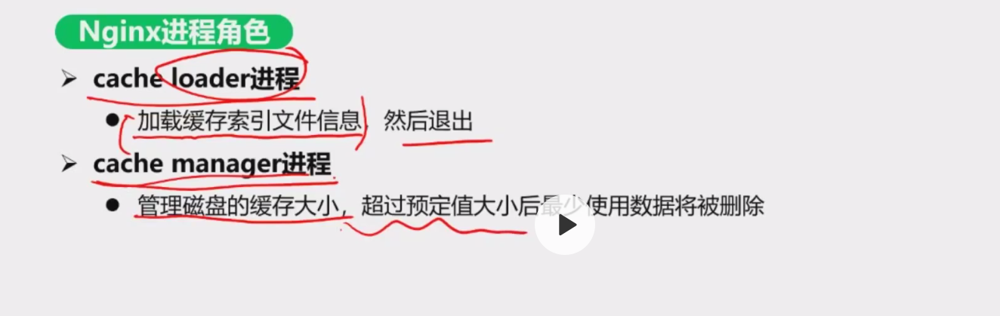

# Nginx反向代理分析，这个缓存索引文件是干啥用的？

# 我对nginx不是特别了解，当初Nginx当初设计的时候为什么要支持缓存的功能？如果做成完全的一个负载均衡做请求负载不就可以了吗？支持静态资源缓存的目的是啥？还有问一下，主流的互联网公司现在的一般实践是什么？一般会用nginx做静态资源缓存吗？比如他如果前段有CDN，后面还需要nginx吗？

# 数据访问层设计为单独层

在目前的大厂一般是怎么做的？一般是设计为单独一层吗？还是说一般业务初期都是和业务逻辑层在一起的？

# 关于ES原理的问题

1、 Lucene检索引擎和索引引擎有什么区别，从你讲解的视频看也都是词到文档能再说明一下吗？

     【索引引擎】是建立索引的过程；【检索引擎】是根据索引查找数据(文档)的过程；

2、  ES里面的词是不是不是课程里面的有语义的词（比如我们，优秀，we，are，wonderful等），而是从语言的最小单位开始，只要是文档中连续的单位都应该是词。比如“我们是优秀的架构师”中，每个字（我，们，是，优，秀，的，架，构，师）以及字上面的连续组合（是优，构师，我们是等等。。）都应该作为词？比如极客时间，在搜索栏搜“是”都是能搜索到的。
       

       这个取决于ES使用的 【分词器】，现在的【分词器】是非常完善的，小到一个字，大到一句话，都可以分的出来的； 课上为了讲【停用词过滤】，所以举了“是”“的”会被过滤的例子。

3、translog过大是指右边落盘后的文件太大还是右边的os cache太大？左右两边的OS cache以及下面的磁盘之间是独立的还是在空间上有关系的？我看图中是有虚线相连的。

     translog过大是指 右边落盘后的文件太大；OS cache 和 磁盘是独立的，但是在系统层面上，为了进行性能优化，OS cache 会使用 虚拟内存，虚拟内存的本质其实就是 磁盘。

4、translog的作用是不是仅仅为了多个备份的作用（当ES挂了的时候可以从translog或OS中恢复？）还有其他的作用吗？
    
     translog的作用就是为了 防止数据丢失的作用，即起到WAL的效果。

5、 document 写到translog和memory cache中 是同时进行的，这样设计的初衷是啥？（视频结束有提问，你在会后会确认答案），还有这个同时进行是什么意思
   （是指A，B两件事情不是先写A成功再写B，或者先写B成功再写A是吗）

     这个和第4个问题一样，设计的初衷就是防止数据丢失和数据恢复； 同时进行可以认为是两个线程并行进行的两个动作。

6、为什么不直接写translog而要写OS cache？为什么要先写OS cache再写translog？也是为了效率吗（写内存快，写文件慢）。
     
      translog就是OS cache中的日志文件，这是一个东西，不是分开的哈； translog可以理解成操作系统层面的日志文件，只要操作系统不挂，数据不会丢； 数据是追加写，所以速度是非常快的。

7、translog过大为什么要将段文件刷盘（见问题3的图）？这个是出于什么考虑？    

    段文件刷盘后，translog因为是日志，就没有存在的必要了，删除即可；translog的使命是为了防止数据丢失，既然数据已经刷盘了，为了节省磁盘空间，就可以把translog删除了。

8、如果translog是顺序写是不是也不需要os cache了？另外文件的顺序写和写内存，谁快？

    首先，translog就是顺序写的，直接写到磁盘上肯定没有写到os cache的速度快； os cache 提升了其写的性能；
    文件的顺序读写 和 内存读写可以认为是一个数量级（还是内存快一点）

9、在Lucene的架构图里面（见问题1的图），分词器是不是需要根据实际业务需求做定制化（或者是可配置规则），因为我看不同网站的搜索对可搜索的词有不同的定义，比如网站A可以搜索“是”或英文"i"这个单词，有的网站可能认为这个是停用词。如果这些网站的后台都用的ES，那么是不是分词器的分词规则是不同的。

     专门做 搜索的公司，肯定是需要做 定制化的，这样精度是最高的，比如： 百度； 如果公司规模不大，用开源的即可，不用投那么大成本做分词器。

# 关于RPC的一些问题

1. Route路由的问题：

   

   这个地方路由，一般是对同一个下游服务的不同实例进行路由吧，在业务逻辑层调用代理的地方实际上已经确定了是要调用哪一个服务，Router只是对请求打到哪些实例进行一个过滤和添加，是这样吗？

2. RPC消费方的超时处理的这个时间（t1)) 和 RPC提供方超时丢弃的超时时间(t2)是不是应该满足：t1> t2.（ 否则可能造成服务提供方还在处理消息，但消费方已经超时的情况？） 或者说这两个值要根据各方的实际业务来确定（比如消费方对业务处理耗时很敏感，那么t1就要设置的小一点，即使t1<t2; 又或者服务提供方的请求处理大部分都比较耗时，就要把t2设置的长一些，相应的t1也要设置的大一点），工程实践一般是如何处理的？转转和小年糕是如何实践的？  还有工程实践中有t1和t2互相交换做参考进行调整（这里涉及到动态调整）的吗？ 这里同样引申出另外一个问题，假设P接收到的请求的平均业务处理时间为t（p），P端队列长度为n，处理队列的线程池的线程数为m，那么队列里面请求的最大等待时间（从入队开始）就是(n/m)*t(p)。那实际情况n，m，还有超时丢弃的时间是否需要这么参考着公式进行配置？

3. 消费端负载均衡讲解的时候，为什么说量小的时候会造成不均匀？

 比如视频中都是按照1:2:1进行分配的，为什么会不均匀？ 没有理解，能再解释一下吗？

4. 参考如下图，为什么会出现一个应用重启后有错误的峰值？我的理解，一个应用重启前一般都是切断上游对该实例的流量(nacos或nginx应该都能很容易做到）->该实例停一段时间（可能是几分钟，让业务处理完交易）->上新版本。想问一下转转当时是如何做的，才会出现这种情况：

   

5. 过载保护的讲解中，RPC服务提供方的队列的长度是不做限制的吗？如果不做限制，超过一定长度做过载保护就比较合理，如果做了限制，我觉得就没多大必要再过载保护了，因为队列就那么长，再来请求队列也就放不进去了。就拿java来说，java线程池一般都是配置队列长度，超过这个长度并且已经达到最大线程数了，一般都会做特殊处理（比如丢弃、抛异常等等）。这个地方转转自研、dubbo、gRPC一般都是怎么做了能说一下吗？

6. 服务提供方的架构介绍中，有队列/线程池一节，这个根据介绍转转是采用了一个队列64线程的做法，那其他的RPC框架的做法是什么？另外，RPC的这个队列/线程池有能支持用户自定义（比如根据业务类型配置不同的队列线程池）吗？如果这个能自定义，我感觉业务逻辑层就可以省掉了再根据不同业务配置不同线程池处理这种逻辑了（我们的支付业务中，有时候银行会有接口粒度的限流，我们业务层就会根据不同的接口调用使用不同的线程池（java）以限制并发）。其他RPC框架队列/线程池这块一般是如何处理的？

7. 对于负载均衡的几种算法，在正常业务的运行期间（不需要对节点配置不一样的权重），你们用的是哪种算法？一致性哈希这种算法有什么框架会用吗？因为下游节点一般都是无状态节点，这种一致性哈希算法在RPC中有应用场景吗？

8. 路由、超时丢弃和过载保护是通用RPC框架都支持的功能吗？是可配置的吗？能介绍一下通用RPC（Dubbo，gRPC，thrift等）对这三个功能的支持情况吗？

9. 对RPC和注册中心涉及到的柔性可用做一下总结，涉及到如下概念：超时处理/超时丢弃/过载保护/服务熔断/服务降级/动态权重/限流/健康检查。等注册中心的看完后可以一起看看RPC设计实践课中的相关东西。

| 类型     | 上游/下游行为 | 保护对象（上游/下游）                      | 是否限流 | 限流的维度                                                   | 限流（主动/被动） | 实现方式         | 原理                                                         |
| -------- | ------------- | ------------------------------------------ | -------- | ------------------------------------------------------------ | ----------------- | ---------------- | ------------------------------------------------------------ |
| 过载保护 | 下游          | 下游                                       | 是       | 节点                                                         | 被动              | 下游RPC          | 如果不做处理，流量接收速度一直大于流量消费速度，进一步导致内存等资源耗尽，导致系统不可用，进而造成雪崩等灾难 |
| 超时丢弃 | 下游          | 下游                                       | 否       |                                                              |                   | 下游RPC          | 消息在队列中的等待时间太长，如果继续处理，那么客户端很可能也是超时，此时还不如进行丢弃处理（丢弃掉，就能节省线程资源）。 |
| 动态权重 | 上游          | 下游                                       | 是       | 节点+集群+其他粒度（比如介于节点和集群按组区分，需要看注册中心的存储模型） | 主动              | 上游RPC+注册中心 | 在灰度发布等场景中，这些场景要求上游打到下游集群不同节点的流量按照一定的比例进行分配，这完全是一种上游对下游的一种流量控制策略 |
| 服务降级 | 上游/下游     | 保护系统整体可用性                         | 针对业务 | 各种粒度，                                                   | 主动+被动         |                  |                                                              |
| 服务熔断 | 上游          | 保护下游，防止雪崩                         | 是       |                                                              | 被动              | 上游RPC          | 上游发现对下的调用频繁出现异常、超时等错误，及时的限制流量继续往下游发送，采取快速返回等措施 |
| 限流     | 上游/下游     | 入口限流，保护应用本身；出口限流，保护下游 | 是       | 各种粒度                                                     | 主动              |                  |                                                              |

