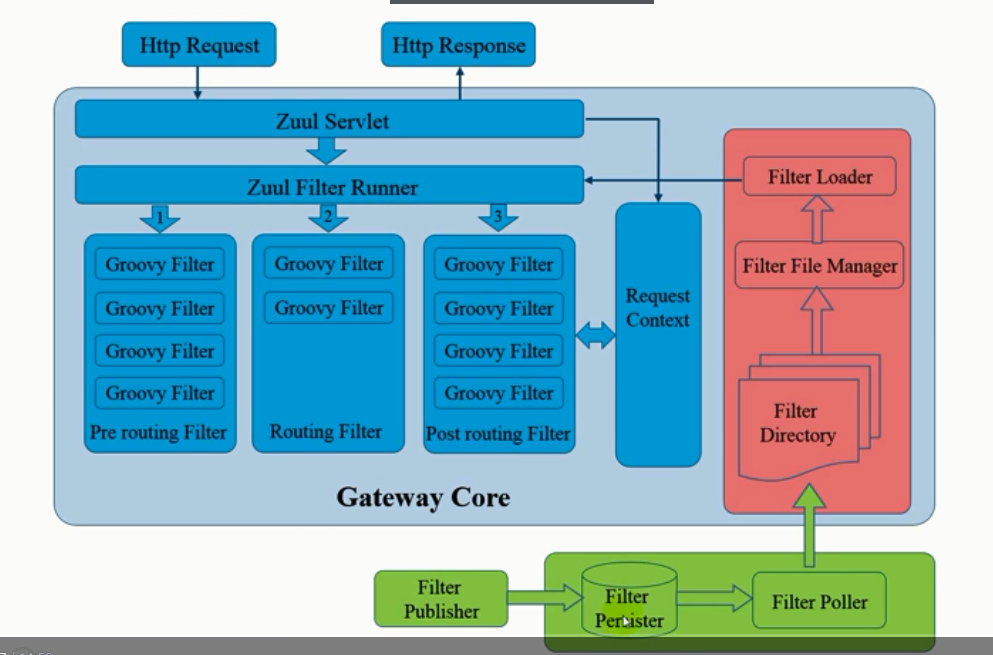
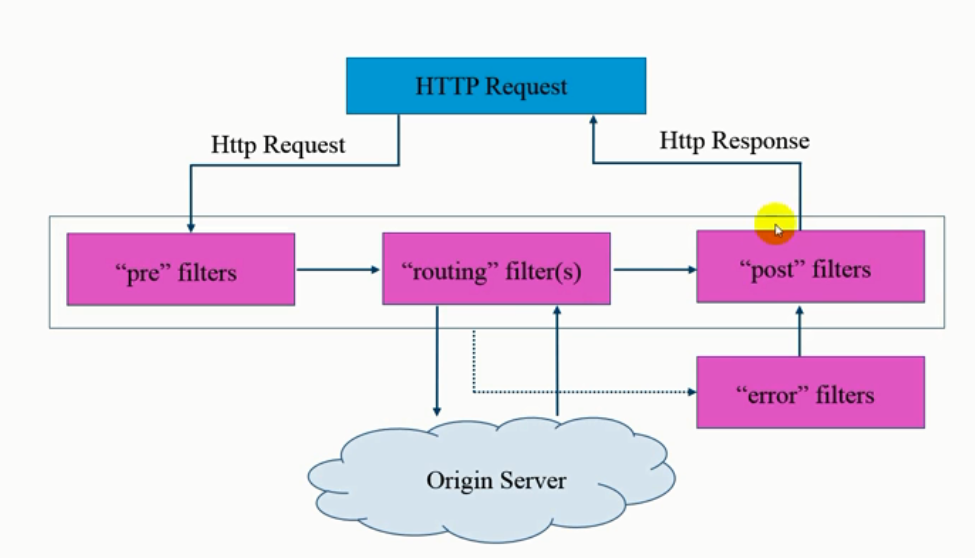
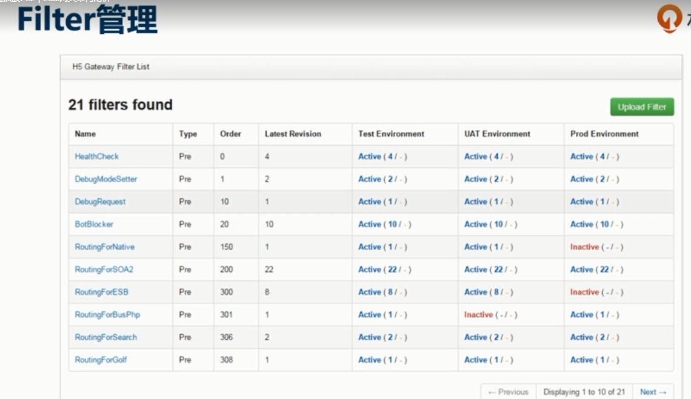

# Zuul架构和实践

绿色的：网关的存储模块，开发或运维管理过滤器的，主要有上传和激活的动作，过滤器是存储在数据库中的，开发人员可以上传和激活，管理他的一些状态 

红色的：网关的过滤器加载模块，定期扫描数据库中的过滤器，看有没有状态变化，如果有变更，会吧变更的过滤器拉到zuul网关本地的一个目录，然后会检查，然后加载到网关运行时的运行期里面

蓝色：网关的核心运行时模块，servlet设计，有前，后filters

Request Context：过滤器之间的信息交换通过context传递。而且是线程安全的。

过滤器管理界面

