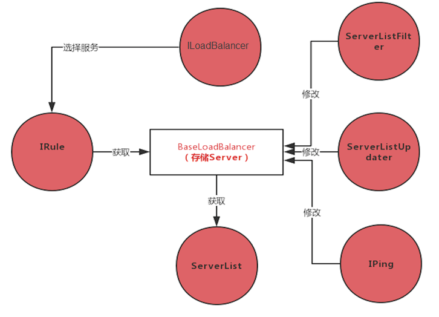
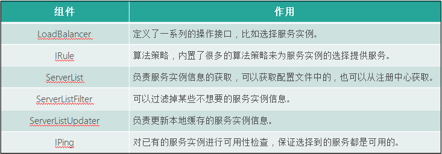
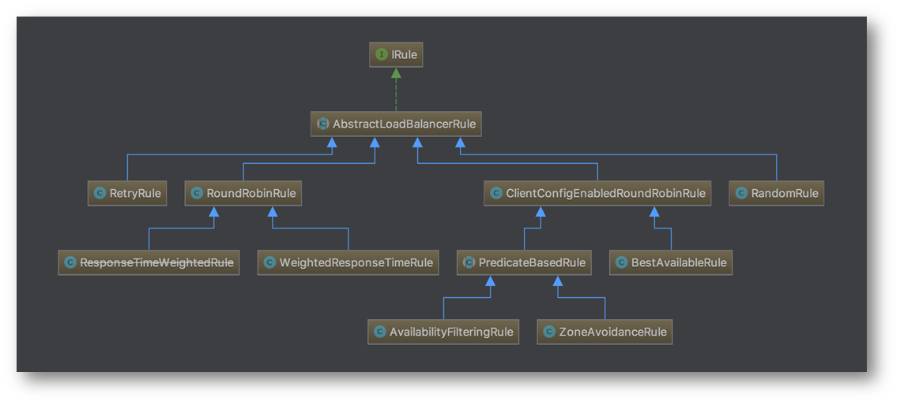
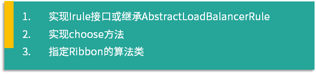

# 垒石spring boot

2014.4发布第一个版本

特点：

1. spring boot通过简单的步骤就可以直接启动spring应用
2. spring boot通过约定大于配置的方式可以很容易的导入一个功能
3. spring boot为spring整合第三方框架提供了开箱即用的功能

使用 Spring Boot 可以大大简化开发模式，提高开发效率

spring boot解决的问题：

1. 传统的spring 配置繁琐，需要手动导入maven依赖，并在xml里面添加配置
2. 传统spring如果要运行，需要安装tomcat等web容器，然后打包成war包运行，非常麻烦
3. 基本无监控

所以，spring亮点：

1.  只需要简单的配置就可以导入三方框架并使用，只需要引入starter包就可以，然后再增加第三方框架需要的配置即可。
2.  spring boot应用可可直接运行，Spring Boot 中自带监控功能 Actuator，可以实现对程序内部运行情况进行监控
3. 默认提供了监控功能，
4. Starter 包简化框架集成难度：将 Bean 的自动装配逻辑封装在 Starter 包内部，同时也简化了 Maven Jar 包的依赖，对框架的集成只需要加入一个 Starter 包的配置，降低了烦琐配置的出错几率。


**编译打包**

对 Spring Boot 项目进行打包，首先需要配置一个 spring-boot-maven-plugin 打包插件，在 configuration 节点中添加 mainClass 节点，指定程序的启动类。


spring boot中管理配置

可以指定不同的配置文件，比如application-xxx.properties. 然后用spring.profiles.active来指定使用什么环境的配置。

比如在application-dev.properties里指定server.port=8082， 在application-test.properties里指定server.port=8083, 那么如果配置spring.profiles.active=dev。那么应用的端口号就是8082


spring boot中有三种读取配置的方式：

Environment

@Value

@ConfigurationProperties

Environment：

```java
@Autowired
private Environment env;

......
env.getProperty("xxx");
```

前面我们讲解了通过 Environment 和 @Value 注解的方式来读取配置文件中的属性值，这两种方式都是对单独的属性进行读取，使用的时候也都是散落在各个类中，然后很多场景下，我们需要有一组配置，都是服务于某个功能或者业务的，比如数据源的配置：spring.datasource.url、spring.datasource.username，这些配置我们希望能够集中管理和使用，这个时候可以使用 @ConfigurationProperties 注解将属性值注入到实体类中。

```
@Configuration
@ConfigurationProperteis(prefix=“spring”)
public class User{
    private String name;
    private String addr;
}

// 配置文件中的配置
spring.name=myname;
spring.addr=addr;

// 具体使用，因为有了@Configuration的注解，可以直接使用@Autowired
......
@Autowired
private user user;

......
user.getName(); //值应该是myname
```


**spring boot starter自定义**

这里总结了自定义一个 Starter 需要的6个步骤：

1. 创建 Starter 项目；

2. 项目创建完后定义 Starter 需要的配置（Properties）类，比如数据库的连接信息；

3. 编写自动配置类，自动配置类就是获取配置，根据配置来自动装配 Bean；

4. 编写 spring.factories 文件加载自动配置类，Spring 启动的时候会扫描 spring.factories 文件，指定文件中配置的类；

5. 编写配置提示文件 spring-configuration-metadata.json（不是必须的），在添加配置的时候，我们想要知道具体的配置项是什么作用，可以通过编写提示文件来提示；


最后就是使用，在项目中引入自定义 Starter 的 Maven 依赖，增加配置值后即可使用。

**Spring Boot Admin**


**Spring Boot常用功能点 **

1. 替换内置tomcat

   直接在starter-web里面排除掉tomcat（默认是tomcat），然后增加比如jetty的start：spring-boot-starter-jetty

2. 容器的参数配置

   原来是在tomcat自己的server.xml里面，现在可以在application配置文件里面修改了，不同容器的配置前缀不同，比如tomcat为server.tomcat.xxx   server.jetty	就是Jetty的配置

3. filter的注册

   有两种方式，一种是注解@WebFilter，一种是通过FilterRegisterBean来注册


# Ribbon

ribbon是Netflix开发的负载均衡器。用于控制http和tcp的客户端行为。

为 Ribbon 配置服务提供者地址后，Ribbon 就可基于某种负载均衡算法，自动的帮助服务消费者进行请求。同时 Ribbon 默认为我们提供了很多负载均衡算法，例如：轮询、随机算法等。



看一下这个图，ILoadBalancer就是负载均衡器，他会选择使用某一种负载均衡算法，也就是IRule，然后Balancer会从ServerList里面根据算法选择一个发送请求。

这里面要注意Balancer里面会存储服务列表，这个列表会保存在本地，那这个服务列表如果有变动如何更新呢？ 这里就有一个ServerListUpdater组件用来在服务列表产生变化的时候更新ServerList。

还有个问题就是，缓存到本地的服务实例信息有可能已经无法提供服务了，这个时候就需要有一个检测的组件，来检测服务实例信息是否可用，这个组件就是 IPing。

有了服务信息后，在某些场景下我们可能需要过滤一部分信息，这个时候可以用 ServerListFilter 组件来实现过滤操作。

最后就是我们使用的入口了，我们要选择一个可用的服务，怎么选择？问谁要这个服务？这时

ILoadBalancer 就上场了，ILoadBalancer 中定义了软件负载均衡操作的接口，比如动态更新一组服务列表，根据指定算法从现有服务器列表中选择一个可用的服务等操作。






这个是负载均衡器的类图。

RoundRobinRule ，轮询算法，RandomRule 随机算法	

## 自定义负载均衡算法




### 自定义负载均衡场景

这里总结了 4 种自定义负载均衡算法的使用场景。

1. 定制跟业务更匹配的策略

这点是在开发过程中相关度比较大的，就是某些场景可能更适合轮询算法，但是单纯的轮询算法可能不是你想要的，这个时候就需要在轮询的基础上，加上一些你自己的逻辑，组成一个新的算法，让 Ribbon 使用这个算法来进行服务实例的选择。

2. 灰度发布

灰度发布是能够平滑过渡的一种发布方式，在发布过程中，先发布一部分应用，让指定的用户使用刚发布的应用，等到测试没有问题后，再将其他的全部应用发布。如果新发布的有问题，只需要将这部分恢复即可，不用恢复所有的应用。

3. 多版本隔离

多版本隔离跟灰度发布类似，为了兼容或者过度，某些应用会有多个版本，这个时候如何保证 1.0 版本的客户端不会调用到 1.1 版本的服务，就是我们需要考虑的问题。

4. 故障隔离

当线上某个实例发生故障后，为了不影响用户，我们一般都会先留存证据，比如：线程信息、JVM 信息等，然后将这个实例重启或直接停止。然后线下根据一些信息分析故障原因，如果我能做到故障隔离，就可以直接将出问题的实例隔离，不让正常的用户请求访问到这个出问题的实例，只让指定的用户访问，这样就可以单独用特定的用户来对这个出问题的实例进行测试、故障分析等。

## Ribbon使用方法

### 原生api

如果你没有使用 Spring Cloud，也可以在项目中单独使用 Ribbon，在这种场景下就需要使用 Ribbon 的原生 API。

### ribbon + restTemplate

当我们项目整合了 Spring Cloud 时，就可以用 Ribbon 为 RestTemplate 提供负载均衡的服务。

RestTemplate是spring提供的用于访问Rest接口的客户端，它提供了便捷的方法远程调用http方法

将 RestTemplate 和 Ribbon 整合起来，只需要在配置 RestTemplate 实例的时候，加一个 @LoadBalanced 的注解，这样 RestTemplate 在调用接口时，就不需要用固定的 IP 加端口的方式调用接口，而是可以用服务名称的方式进行接口的调用，自动具备客户端负载均衡的效果

```java
@Configuration
public class RestConfiguration{
    @Bean
    @LoadBalanced
    public RestTemplate restTemplate(){
        return new RestTemplate();
    }
}

// 使用
@RestController
public class RibbonController{
    @Autowired
    private RestTemplate restTemplate;
    
    @RequestMapping("/get")
    public Object get(){
        User user = restTemplate.getForEntity("http://user-service/user/get?id=1", User.class).getBody();
        return user;
    }
}
```


RestTemplate 能够直接使用服务名称调用对应的接口，功劳得归功于 @LoadBalanced。如果没有 @LoadBalanced，RestTemplate 是不具备服务名调用的方式的。那么这个小小的注解，为何如此厉害，我们来深入分析一下它的原理。

在源码 LoadBalancerAutoConfiguration 中，注入了所有加了 @LoadBalanced 注解的 restTemplate的Bean 实例，将 restTemplate的Bean 实例设置到 RestTemplateCustomizer 中，然后给 restTemplate 设置 LoadBalancerInterceptor 拦截器。这样 restTemplate 在调用的时候会进入 LoadBalancerInterceptor 拦截器，拦截器中的 createRequest 中通过 ServiceRequestWrapper 来执行替换 URI 的逻辑，ServiceRequestWrapper 中将 URI 的获取交给 LoadBalancerClient#reconstructURI 方法。整理的流程就是这样，更细节的点大家课后按照我的思路去梳理一遍。

### Ribbon + Feign


### Ribbon 饥饿加载模式

Ribbon 在进行客户端负载均衡时并不是在启动时就加载上下文，而是在第一次请求时才去创建，因此第一次调用会比较慢，有可能会引起调用超时。可以通过指定 Ribbon 客户端的名称，在启动时加载这些子应用程序上下文的方式，来避免这个问题。


# Feign

在日常工作中，我们经常会遇到需要调用内部 API 或者第三方 API 的情况，主要有以下方式：

1. HttpURLConnection

2. HttpClient

3. OKHttp

4. RestTemplate

Feign 是一个声明式的 REST 客户端，它的目的就是让 REST 调用更加简单。Feign 提供了 HTTP 请求的模板，通过编写简单的接口和插入注解，就可以定义好 HTTP 请求的参数、格式、地址等信息。

 

而且 Feign 会完全代理 HTTP 请求，我们只需要像调用方法一样调用它就可以完成服务请求及相关处理。Spring Cloud 对 Feign 进行了封装，使其支持 SpringMVC 标准注解和 HttpMessageConverters。Feign 可以与 Eureka 和 Ribbon 组合使用以支持负载均衡，与 Hystrix 组合使用，支持熔断回退。

如果你没有使用 Spring Cloud，那么可以直接用原生的 Feign 来调用 API，如果你使用了 Spring Cloud，可以直接用 Spring Cloud OpenFeign 来调用 API。

