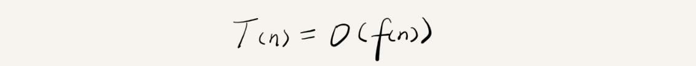
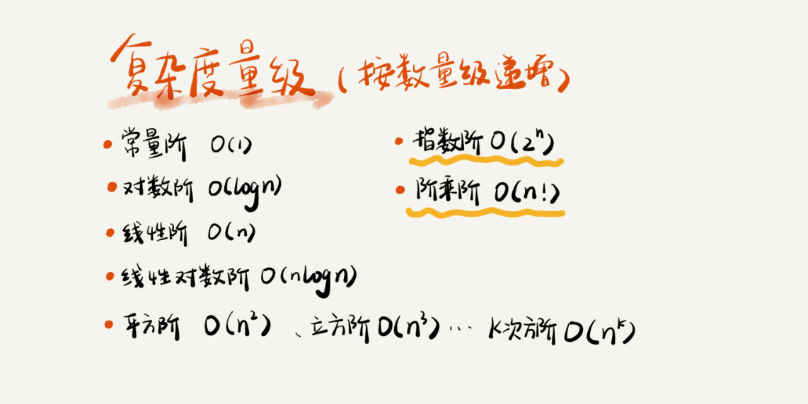
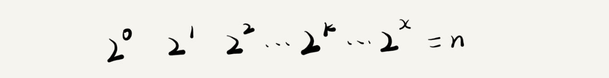
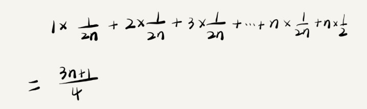
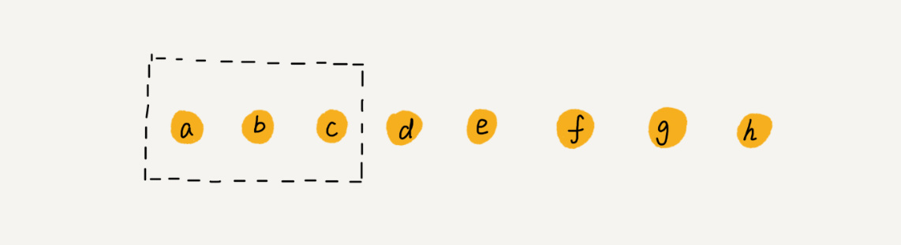

# 复杂度分析

## 为什么要这个复杂度分析

> 代码是跑在CPU上的，需要进行CPU运算和存储空间，需要消耗资源，那么如何评判算法代码的执行效率？，那就是时间和空间负责度分析。
>
> 我们需要一个不用具体的测试数据来测试，就可以粗略地估计算法的执行效率的方法

## 大O复杂度表示法

看一段代码：

```java
 int cal(int n) {   
     int sum = 0;   
     int i = 1;   
     for (; i <= n; ++i) {     
         sum = sum + i;   
     }   
     return sum; 
 }
```

这里很容易看出来代码的执行次数和数据规模n是成正比的。每一段代码执行的大多是**读数据-运算-写数据**这样的操作，虽然每一行代码的执行时间，执行的cpu个数都不同，但是我们可以大体上粗略估计，假设每行代码运行的时间是一样的，为unit_time。以这个为基础这段代码的执行时间是多少呢？

首先第2,3行只执行一次，2个的unit_time单位，4和5执行了n次，需要2n*unit_time的时间，所以总共执行时间为（2n+2）\*unit_time的单位时间。可以看出，**所有代码的执行时间 T(n) 与每行代码的执行次数成正比**，假设执行次数为f(n)，那么就是：

**所有代码的执行时间 T(n) 与每行代码的执行次数 f(n) 成正比**，也就是如下公式：



n 表示数据规模的大小；f(n) 表示每行代码执行的次数总和。因为这是一个公式，所以用 f(n) 来表示。公式中的 O，表示代码的执行时间 T(n) 与 f(n) 表达式成正比。

这就是大O时间复杂度表示法，大O表示的不是算法真正执行的时间，而是表示代码执行时间随着数据规模增长的趋势，所以也叫**渐进时间复杂度**

渐进时间复杂度中的常量、低阶、系数三部分并不左右增加趋势，比如T（n)=O(2n+2)（参考前面代码的复杂度），我们只需要记一个最大的复杂度量级就可了，O（2n+2）实际上就是O（n），

## 时间复杂度分析

### 只关注循环执行次数最多的一段代码

比如只执行常量次的代码，其中一个是低阶复杂度，系数等，都可或略，因为不左右增长趋势。

### 加法法则：总复杂度等于量级最大的那段代码的复杂度

比如如下代码：

```java

int cal(int n) {
   int sum_1 = 0;
   int p = 1;
   for (; p < 100; ++p) {
     sum_1 = sum_1 + p;
   }

   int sum_2 = 0;
   int q = 1;
   for (; q < n; ++q) {
     sum_2 = sum_2 + q;
   }
 
   int sum_3 = 0;
   int i = 1;
   int j = 1;
   for (; i <= n; ++i) {
     j = 1; 
     for (; j <= n; ++j) {
       sum_3 = sum_3 +  i * j;
     }
   }
 
   return sum_1 + sum_2 + sum_3;
 }
```

第一个量级：常量，忽略

第二个量级：n

第三个量级：n*n

根据，总的时间复杂度就等于量级最大的那段代码的时间复杂度，那么这个算法代码的时间复杂度就是O（n*n）。

**如果T1(n)=O(f(n))，T2(n)=O(g(n))；那么 T(n)=T1(n)+T2(n)=max(O(f(n)), O(g(n))) =O(max(f(n), g(n)))**

取最大值。

### 乘法法则：嵌套代码的复杂度等于嵌套内外代码复杂度的乘积

**如果 T1(n)=O(f(n))，T2(n)=O(g(n))；那么 T(n)=T1(n)*T2(n)=O(f(n))*O(g(n))=O(f(n)*g(n)).**

不用解释了，


## 几种常见的时间复杂度



我们可根据复杂度量级分为两类：

1. 多项式量级：除了指数级和阶乘阶都是多项式量级

2. 非多项式量级：指数级和阶乘阶

**我们把时间复杂度为非多项式量级的算法问题叫作 NP（Non-Deterministic Polynomial，非确定多项式）问题。**


当数据规模 n 越来越大时，非多项式量级算法的执行时间会急剧增加，求解问题的执行时间会无限增长。所以，非多项式时间复杂度的算法其实是非常低效的算法。因此，关于 NP 时间复杂度我就不展开讲了。我们主要来看几种常见的多项式时间复杂度。


## 常见的多项式时间复杂度

### O(1)

O(1) 只是常量级时间复杂度的一种表示方法，并不是指只执行了一行代码. 是效率最高的时间复杂度，比如大名鼎鼎的hash算法。

### O(logN), O(nLogN)

对数阶时间复杂度非常常见，同时也是最难分析的一种时间复杂度。我通过一个例子来说明一下。

```java
 i=1;
 while (i <= n)  {
   i = i * 2;
 }
```

2,3行是执行次数最多的，只要计算了执行2,3需要的次数就可以确定这段代码的时间复杂度。假设执行了x次，那么要执行多少次呢，



不多说了，很简单： 
$$
2^x=n
$$
x=log2n

我们知道，对数之间是可以互相转换的，log3n 就等于 log32 * log2n，所以 O(log3n) = O(C * log2n)，其中 C=log32 是一个常量。基于我们前面的一个理论：在采用大 O 标记复杂度的时候，可以忽略系数，即 O(Cf(n)) = O(f(n))。所以，O(log2n) 就等于 O(log3n)。因此，在对数阶时间复杂度的表示方法里，我们忽略对数的“底”，统一表示为 O(logn)。


如果你理解了我前面讲的 O(logn)，那 O(nlogn) 就很容易理解了。还记得我们刚讲的乘法法则吗？如果一段代码的时间复杂度是 O(logn)，我们循环执行 n 遍，时间复杂度就是 O(nlogn) 了。而且，O(nlogn) 也是一种非常常见的算法时间复杂度。比如，归并排序、快速排序的时间复杂度都是 O(nlogn)。


### O(m+n)、O(m*n)

执行效率由两个数据规模影响，

针对这种情况，原来的加法法则就不正确了，我们需要将加法规则改为：T1(m) + T2(n) = O(f(m) + g(n))。但是乘法法则继续有效：T1(m)*T2(n) = O(f(m) * f(n))。

## 空间复杂度

>空间复杂度全称就是渐进空间复杂度（asymptotic space complexity），表示算法的存储空间与数据规模之间的增长关系。

举例:

```java
void print(int n) {
  int i = 0;
  int[] a = new int[n];
  for (i; i <n; ++i) {
    a[i] = i * i;
  }

  for (i = n-1; i >= 0; --i) {
    print out a[i]
  }
}
```

跟时间复杂度分析一样，我们可以看到，第 2 行代码中，我们申请了一个空间存储变量 i，但是它是常量阶的，跟数据规模 n 没有关系，所以我们可以忽略。第 3 行申请了一个大小为 n 的 int 类型数组，除此之外，剩下的代码都没有占用更多的空间，所以整段代码的空间复杂度就是 O(n)。

我们常见的空间复杂度就是**O(1)、O(n)、O(n2 )**，像 O(logn)、O(nlogn) 这样的对数阶复杂度平时都用不到。而且，空间复杂度分析比时间复杂度分析要简单很多。所以，对于空间复杂度，掌握刚我说的这些内容已经足够了。


## 概括

常见的复杂度并不多，从低阶到高阶有：O(1)、O(logn)、O(n)、O(nlogn)、O(n2 )


## 浅析最好、最坏、平均、均摊时间复杂度

上一节我举的分析复杂度的例子都很简单，今天我们来看一个稍微复杂的。你可以用我上节教你的分析技巧，自己先试着分析一下这段代码的时间复杂度。

```java
// n表示数组array的长度
int find(int[] array, int n, int x) {
  int i = 0;
  int pos = -1;
  for (; i < n; ++i) {
    if (array[i] == x) {
       pos = i;
       break;
    }
  }
  return pos;
}
```

这个时候，问题就来了。我们优化完之后，这段代码的时间复杂度还是 O(n) 吗？

很显然，咱们上一节讲的分析方法，解决不了这个问题。因为，要查找的变量 x 可能出现在数组的任意位置。如果数组中第一个元素正好是要查找的变量 x，那就不需要继续遍历剩下的 n-1 个数据了，那时间复杂度就是 O(1)。但如果数组中不存在变量 x，那我们就需要把整个数组都遍历一遍，时间复杂度就成了 O(n)。所以，不同的情况下，这段代码的时间复杂度是不一样的。


为了表示代码在不同情况下的不同时间复杂度，我们需要引入三个概念：**最好情况时间复杂度、最坏情况时间复杂度和平均情况时间复杂度。**

> 最好情况时间复杂度就是，在最理想的情况下，执行这段代码的时间复杂度

>最坏情况时间复杂度就是，在最糟糕的情况下，执行这段代码的时间复杂度

就像我们刚刚讲到的，在最理想的情况下，要查找的变量 x 正好是数组的第一个元素，这个时候对应的时间复杂度就是最好情况时间复杂度。

如果数组中没有要查找的变量 x，我们需要把整个数组都遍历一遍才行，所以这种最糟糕情况下对应的时间复杂度就是最坏情况时间复杂度。

### 平均情况时间复杂度

我们都知道，最好情况时间复杂度和最坏情况时间复杂度对应的都是极端情况下的代码复杂度，发生的概率其实并不大。为了更好地表示平均情况下的复杂度，我们需要引入另一个概念：平均情况时间复杂度，后面我简称为平均时间复杂度。

平均时间复杂度又该怎么分析呢？我还是借助刚才查找变量 x 的例子来给你解释。

要查找的变量 x 在数组中的位置，有 n+1 种情况：在数组的 0～n-1 位置中和不在数组中。我们把每种情况下，查找需要遍历的元素个数累加起来，然后再除以 n+1，就可以得到需要遍历的元素个数的平均值，


我们知道，时间复杂度的大 O 标记法中，可以省略掉系数、低阶、常量，所以，咱们把刚刚这个公式简化之后，得到的平均时间复杂度就是 O(n)。

这个结论虽然是正确的，但是计算过程稍微有点儿问题。究竟是什么问题呢？我们刚讲的这 n+1 种情况，出现的概率并不是一样的。我带你具体分析一下。（这里要稍微用到一点儿概率论的知识，不过非常简单，你不用担心。）

我们知道，要查找的变量 x，要么在数组里，要么就不在数组里。这两种情况对应的概率统计起来很麻烦，为了方便你理解，我们假设在数组中与不在数组中的概率都为 1/2。另外，要查找的数据出现在 0～n-1 这 n 个位置的概率也是一样的，为 1/n。所以，根据概率乘法法则，要查找的数据出现在 0～n-1 中任意位置的概率就是 1/(2n)。

因此，前面的推导过程中存在的最大问题就是，没有将各种情况发生的概率考虑进去。如果我们把每种情况发生的概率也考虑进去，那平均时间复杂度的计算过程就变成了这样：



这个值就是概率论中的加权平均值，也叫作期望值，所以平均时间复杂度的全称应该叫加权平均时间复杂度或者期望时间复杂度。

引入概率之后，前面那段代码的加权平均值为 (3n+1)/4。用大 O 表示法来表示，去掉系数和常量，这段代码的加权平均时间复杂度仍然是 O(n)。

### 均摊时间复杂度(未细看)


# 数组

>数组（Array）是一种线性表数据结构。它用一组连续的内存空间，来存储一组具有相同类型的数据。

解释几个关键词

**什么是线性表**

>顾名思义，线性表就是数据排成像一条线一样的结构。每个线性表上的数据最多只有前和后两个方向。其实除了数组，链表、队列、栈等也是线性表结构。


**什么是非线性表**

> 比如二叉树、堆、图等。之所以叫非线性，是因为，在非线性表中，数据之间并不是简单的前后关系。


**第二个是连续的内存空间和相同类型的数据**

正是因为这两个限制，它才有了一个堪称“杀手锏”的特性：“随机访问”。但有利就有弊，这两个限制也让数组的很多操作变得非常低效，比如要想在数组中删除、插入一个数据，为了保证连续性，就需要做大量的数据搬移工作。

我在面试的时候，常常会问数组和链表的区别，很多人都回答说，“链表适合插入、删除，时间复杂度 O(1)；数组适合查找，查找时间复杂度为 O(1)”。实际上，这种表述是不准确的。数组是适合查找操作，但是查找的时间复杂度并不为 O(1)。即便是排好序的数组，你用二分查找，时间复杂度也是 O(logn)。所以，正确的表述应该是，数组支持随机访问，根据下标随机访问的时间复杂度为 O(1)。

## 查找/删除/插入

### 查找

如果是通过下标访问，比如数组下标是计算出的哈希值，那么通过下标来查找，算法复杂度就是O（1）

如果是排序的，比如用二分查找，那么负责度就是O（logN）

不是排序的，那么就是O（n）

### 插入

数组的插入和删除都是比较低效的，原因是要搬移很多数据。我们来分析一下：

如果在数组的末尾插入元素，那就不需要移动数据了，这时的时间复杂度为 O(1)。但如果在数组的开头插入元素，那所有的数据都需要依次往后移动一位，所以最坏时间复杂度是 O(n)。 因为我们在每个位置插入元素的概率是一样的，所以

**数组插入的平均情况时间复杂度**为 (1+2+...n)/n=O(n)。

另外，如果数组中存放的数据并不有序，那么就可以每次把要插入的数据搬运到尾部，这样**在特定场景下，在第 k 个位置插入一个元素的时间复杂度就会降为 O(1)**

### 删除

跟插入数据类似，如果我们要删除第 k 个位置的数据，为了内存的连续性，也需要搬移数据，不然中间就会出现空洞，内存就不连续了。我们先来分析一下：

对尾部删除，时间复杂度是O（1），如果在第一个删除，那么就是O（n），计算下来：

**数组删除的平均情况时间复杂度是O（n）**

但是在实际情况中，是不是一定要每次删除一个数据都要做搬运数据的操作呢，如果数组不要求一定要是数据的连续，我们完全可以将多次删除操作几种执行，提高效率。




**实际应用**

JVM的标记清除垃圾回收算法


# 链表


