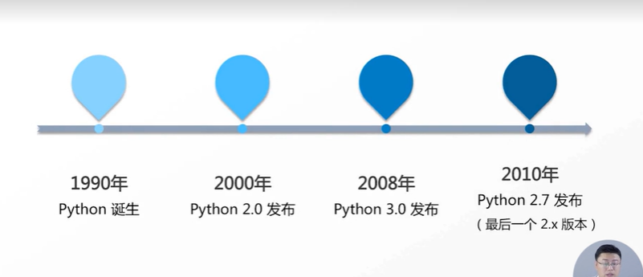
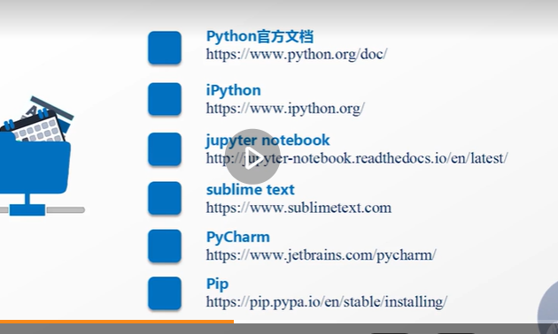

# python的历史和版本

注意，Python3.0并不是完全兼容2.0的。给开发这带来了麻烦。因此在10年，12年还是以python2.x为主。而且它的库，程序啊都是以2.0去发布的。13，14年的时候这个3.0的库开始丰富起来，到现在3.0变成了主力。10年发布的2.7是2.x的最后一个版本。

以下，以3.x版本来介绍。现在的主流的一些python库也逐渐放弃了对2.x的支持。

Python有官方的版本和发行版，python安装之后只有一个解释程序，所有的东西都要去编译。除了解释程序之外，python还有一些标准库，这个标准库给大家带来的帮助是有限的。

python除了标准版之外，还有一个叫发行版的东西，发行版除了解释器，标准库之外，还会集成常用的软件包。比如Anaconda，他集成了常用的科学计算的包（否则安装依赖很麻烦。）可以到镜像源来看看，比如清华大学开源软件镜像站。

# 学习的工具和网址

第一个就不用说了，可以看看tutorial

第二个可以帮助初学者补全python，交互式，提供输入，直接输出的功能。

第三个，可以在网页上进行编程。在调试的时候可以用这个jupyter notebook

第四个，专业的文本编辑器。比较大型的文本文件可以用这个。

第五个，如果是大型的python程序，文本编辑器也不能胜任了，这个时候就可以用集成的编辑器，PyCharm，集成开发环境。主要有很友好的提示。下载社区版的就可以了。

第六个，第三方软件，用来做什么的？当你安装第三方库的时候有依赖关系，可以用pip自动进行依赖关系的解释

