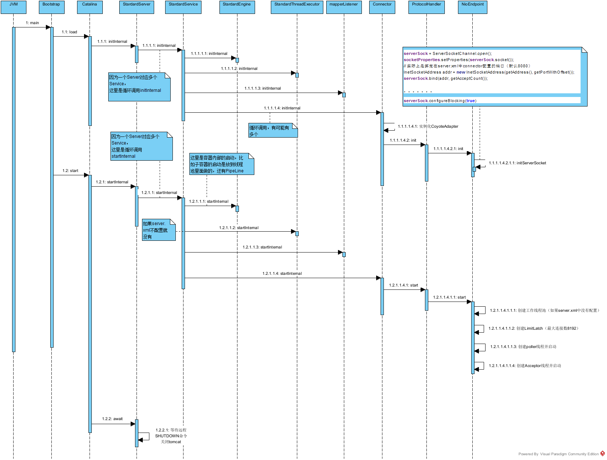

# 03 | 你应该知道的Servlet规范和Servlet容器

## Web容器的基本架构

为什么Tomcat容器要设计成目前的这个样子。实际上也是为了分层，简化http的调用过程。我们可以把一个应用从接收http请求，到最终业务处理后返回结果给调用方的过程做一下梳理，那么流程是这样的。

接收http请求->处理http请求->调用对应的业务处理器进行业务逻辑处理->处理http应答->返回给调用方。

如果我们每个应用除了进行业务逻辑处理还要关注http的相关处理，是不是不是太好。原因有如下几个方面：

1. http请求和http应答的处理具有一定的共性，实际上都是基于http协议进行处理。这部分类型在应用开发这块是可以做抽象的，而且业务开发也不需要关心这部分的处理
2. 重复造轮子，无法重用

因此就有了servlet规范来弄这个事，然后有了实现servlet规范的web容器。


> HTTP服务器隐藏了网络细节，用于处理http请求

> Servlet容器接收HTTP服务器封装好的请求数据，起到类似代理的作用，Servlet容器和Servlet接口实现了一种机制，这种机制只要求业务层实现自己的servlet，就可以和Servlet容器无缝结合完成整个请求的处理流程。这样Servlet容器解耦了HTTP服务器和业务逻辑层，实现了业务逻辑和网络请求的隔离，业务逻辑只要实现一个个的Servlet，而不用考虑其他的网络交互细节。

## Servlet接口

```java

public interface Servlet {
    void init(ServletConfig config) throws ServletException;
    
    ServletConfig getServletConfig();
    
    void service(ServletRequest req, ServletResponse res）throws ServletException, IOException;
    
    String getServletInfo();
    
    void destroy();
}
```

### 接口说明

ServletRequest 用来封装请求信息，ServletResponse 用来封装响应信息，因此本质上这两个类是对通信协议的封装。

例如HTTP请求对应的请求封装类就是HttpServletRequest和HttpServletResponse类。你可以通过 HttpServletRequest 来获取所有请求相关的信息，包括请求路径、Cookie、HTTP 头、请求参数等。还可以通过 HttpServletRequest 来创建和获取 Session。

### init方法

Servlet 容器在加载 Servlet 类的时候会调用 init 方法，在卸载的时候会调用 destroy 方法。我们可能会在 init 方法里初始化一些资源，并在 destroy 方法里释放这些资源，比如 **Spring MVC 中的 DispatcherServlet，就是在 init 方法里创建了自己的 Spring 容器**。

### ServletConfig

ServletConfig 的作用就是封装 Servlet 的初始化参数。你可以在web.xml给 Servlet 配置参数，并在程序里通过 getServletConfig 方法拿到这些参数。

### Servlet抽象类

有接口一般就有抽象类，抽象类用来实现接口和封装通用的逻辑，因此 Servlet 规范提供了 **GenericServlet** 抽象类，我们可以通过扩展它来实现 Servlet。虽然 Servlet 规范并不在乎通信协议是什么，但是大多数的 Servlet 都是在 HTTP 环境中处理的，因此 Servet 规范还提供了 **HttpServlet 来继承 GenericServlet**，并且加入了 HTTP 特性。这样我们通过继承 HttpServlet 类来实现自己的 Servlet，只需要重写两个方法：doGet 和 doPost。

## Servlet容器

### 工作流程

1. tomcat接收到请求，并将请求包装成ServletRequest
2. 调用Servlet容器的service方法
3. service方法拿到请求后，根据URL和Servlet的映射关系，找到对应的Servlet实现类，如果Servlet没加载，那么就用反射机制创建Servlet，
4. 调用init方法来完成初始化，
5. 接着调用Servlet的service方法来处理请求
6. 处理完请求后，把ServletResponse返回给HTTP服务器。


### Web应用

> 根据 Servlet 规范，Web 应用程序有一定的目录结构，在这个目录下分别放置了 Servlet 的类文件、配置文件以及静态资源，Servlet 容器通过读取配置文件，就能找到并加载 Servlet

Web 应用的目录结构大概是下面这样的：

```

| -  MyWebApp
      | -  WEB-INF/web.xml        -- 配置文件，用来配置Servlet等
      | -  WEB-INF/lib/           -- 存放Web应用所需各种JAR包
      | -  WEB-INF/classes/       -- 存放你的应用类，比如Servlet类
      | -  META-INF/              -- 目录存放工程的一些信息
```

Servlet 规范里定义了 **ServletContext** 这个接口来对应一个 Web 应用。Web应用部署好后，Servlet容器在启动时就会加载Web应用，并为每个 Web 应用创建唯一的 ServletContext 对象。你可以把 ServletContext 看成是一个全局对象，一个 Web 应用可能有多个 Servlet，这些 Servlet 可以通过全局的 ServletContext 来共享数据，由于 ServletContext 持有所有 Servlet 实例，你还可以通过它来实现 Servlet 请求的转发

### 扩展机制

Filter/Listener

> Filter 是过滤器，这个接口允许你对请求和响应做一些统一的定制化处理。流程如下：
>
> Web 应用部署完成后，Servlet 容器需要实例化 Filter 并把 Filter 链接成一个 FilterChain；Web容器运行，有请求进来的时候，获取第一个 Filter 并调用 doFilter 方法，doFilter 方法负责调用这个 FilterChain 中的下一个 Filter。

>Listener 是监听器，这是另一种扩展机制。当 Web 应用在 Servlet 容器中运行时，Servlet 容器内部会不断的发生各种事件，如 Web 应用的启动和停止、用户请求到达等.
>
>比如 Spring 就实现了自己的监听器，来监听 ServletContext 的启动事件，目的是当 Servlet 容器启动时，创建并初始化全局的 Spring 容器

# 05 | Tomcat系统架构（上）： 连接器是如何设计的？

## Tomcat 总体架构

tomcat要处理2个核心功能：

1. 处理socket，并负责网络字节流到请求和应答对象的转化
2. 加载和管理servlet，处理请求的业务逻辑。

因此，Tomcat 设计了两个核心组件连接器（**Connector**）和容器（**Container**）来分别做这两件事情。连接器负责对外交流，容器负责内部处理。

Tomcat 为了实现支持多种 I/O 模型和应用层协议，一个容器可能对接多个连接器，就好比一个房间有多个门。但是单独的连接器或者容器都不能对外提供服务，需要把它们组装起来才能工作，组装后这个整体叫作 Service 组件。这里请你注意，Service 本身没有做什么重要的事情，只是在连接器和容器外面多包了一层，把它们组装在一起。Tomcat 内可能有多个 Service，这样的设计也是出于灵活性的考虑。通过在 Tomcat 中配置多个 Service，可以实现通过不同的端口号来访问同一台机器上部署的不同应用。


从图上你可以看到，最顶层是 Server，这里的 Server 指的就是一个 Tomcat 实例。一个 Server 中有一个或者多个 Service，一个 Service 中有多个连接器和一个容器。连接器与容器之间通过标准的 ServletRequest 和 ServletResponse 通信。

## 连接器

我们可以把连接器的功能需求进一步细化，比如：

1. 监听网络端口。
2. 接受网络连接请求。
3. 读取网络请求字节流。
4. 根据具体应用层协议（HTTP/AJP）解析字节流，生成统一的 Tomcat Request 对象。
5. 将 Tomcat Request 对象转成标准的 ServletRequest。
6. 调用 Servlet 容器，得到 ServletResponse。
7. 将 ServletResponse 转成 Tomcat Response 对象。
8. 将 Tomcat Response 转成网络字节流。
9. 将响应字节流写回给浏览器。

通过分析连接器的详细功能列表，我们发现连接器需要完成 3 个高内聚的功能：

1. 网络通信。
2. 应用层协议解析。
3. Tomcat Request/Response 与 ServletRequest/ServletResponse 的转化。

因此 Tomcat 的设计者设计了 3 个组件来实现这 3 个功能，分别是 **Endpoint、Processor 和 Adapter**。其中 Endpoint 和 Processor 放在一起抽象成了 ProtocolHandler 组件，它们的关系如下图所示。


网络通信的 I/O 模型是变化的，可能是非阻塞 I/O、异步 I/O 或者 APR。应用层协议也是变化的，可能是 HTTP、HTTPS、AJP。浏览器端发送的请求信息也是变化的。

但是整体的处理逻辑是不变的，Endpoint 负责提供字节流给 Processor，Processor 负责提供 Tomcat Request 对象给 Adapter，Adapter 负责提供 ServletRequest 对象给容器。

### ProtocalHandler组件


1. Endpoint 是一个接口，对应的抽象实现类是 AbstractEndpoint，而 AbstractEndpoint 的具体子类，比如在 NioEndpoint 和 Nio2Endpoint 中，有两个重要的子组件：Acceptor 和 SocketProcessor
2. Acceptor 用于监听 Socket 连接请求
3. SocketProcessor 用于处理接收到的 Socket 请求，它实现 Runnable 接口，在 run 方法里调用协议处理组件 Processor 进行处理。为了提高处理能力，SocketProcessor 被提交到线程池来执行。而这个线程池叫作执行器（Executor)
4. Processor 接收来自 Endpoint 的 Socket，读取字节流解析成 Tomcat Request 和 Response 对象，并通过 Adapter 将其提交到容器处理，Processor 是对应用层协议的抽象
5. Endpoint 接收到 Socket 连接后，生成一个 SocketProcessor 任务提交到线程池去处理，SocketProcessor 的 run 方法会调用 Processor 组件去解析应用层协议，Processor 通过解析生成 Request 对象后，会调用 Adapter 的 Service 方法

### adaptor组件

ProtocolHandler 接口负责解析请求并生成 Tomcat Request 类。但是这个 Request 对象不是标准的 ServletRequest，也就意味着，不能用 Tomcat Request 作为参数来调用容器。Tomcat 设计者的解决方案是引入 CoyoteAdapter，这是适配器模式的经典运用，连接器调用 CoyoteAdapter 的 sevice 方法，传入的是 Tomcat Request 对象，CoyoteAdapter 负责将 Tomcat Request 转成 ServletRequest，再调用容器的 service 方法

# 06 | Tomcat系统架构（下）：聊聊多层容器的设计


Tomcat 通过一种分层的架构，使得 Servlet 容器具有很好的灵活性。

Context表示一个Web应用，一个Web应用对应多个Servlet，一个站点可以对应多个Context，一个Engine可以用多个长点。

## tomcat是怎么管理容器的？

Tomcat 就是用组合模式来管理这些容器的。具体实现方法是，所有容器组件都实现了 Container 接口，因此组合模式可以使得用户对单容器对象和组合容器对象的使用具有一致性。这里单容器对象指的是最底层的 Wrapper，组合容器对象指的是上面的 Context、Host 或者 Engine。

Container接口如下：

```java

public interface Container extends Lifecycle {
    public void setName(String name);
    public Container getParent();
    public void setParent(Container container);
    public void addChild(Container child);
    public void removeChild(Container child);
    public Container findChild(String name);
}
```

我们在上面的接口看到了 getParent、setParent、addChild 和 removeChild 等方法。

你可能还注意到 Container 接口扩展了 Lifecycle 接口，Lifecycle 接口用来统一管理各组件的生命周期

## 请求定位Servlet的过程

Tomcat 是怎么确定请求是由哪个 Wrapper 容器里的 Servlet 来处理的呢？答案是，Tomcat 是用 Mapper 组件来完成这个任务的

>Mapper 组件的功能就是将用户请求的 URL 定位到一个 Servlet，它的工作原理是：Mapper 组件里保存了 Web 应用的配置信息，其实就是容器组件与访问路径的映射关系，比如 Host 容器里配置的域名、Context 容器里的 Web 应用路径，以及 Wrapper 容器里 Servlet 映射的路径，你可以想象这些配置信息就是一个多层次的 Map

>假如有一个网购系统，有面向网站管理人员的后台管理系统，还有面向终端客户的在线购物系统。这两个系统跑在同一个 Tomcat 上，为了隔离它们的访问域名，配置了两个虚拟域名：manage.shopping.com和user.shopping.com，网站管理人员通过manage.shopping.com域名访问 Tomcat 去管理用户和商品，而用户管理和商品管理是两个单独的 Web 应用。终端客户通过user.shopping.com域名去搜索商品和下订单，搜索功能和订单管理也是两个独立的 Web 应用。
>
>针对这样的部署，Tomcat 会创建一个 Service 组件和一个 Engine 容器组件，在 Engine 容器下创建两个 Host 子容器，在每个 Host 容器下创建两个 Context 子容器。由于一个 Web 应用通常有多个 Servlet，Tomcat 还会在每个 Context 容器里创建多个 Wrapper 子容器。每个容器都有对应的访问路径，你可以通过下面这张图来帮助你理解。
>
>
>
>假如有用户访问一个 URL，比如图中的http://user.shopping.com:8080/order/buy，Tomcat 如何将这个 URL 定位到一个 Servlet 呢？
>
>1. 首先，根据协议和端口号选定 Service 和 Engine。我们知道 Tomcat 的每个连接器都监听不同的端口，比如 Tomcat 默认的 HTTP 连接器监听 8080 端口、默认的 AJP 连接器监听 8009 端口。上面例子中的 URL 访问的是 8080 端口，因此这个请求会被 HTTP 连接器接收，而一个连接器是属于一个 Service 组件的，这样 Service 组件就确定了。我们还知道一个 Service 组件里除了有多个连接器，还有一个容器组件，具体来说就是一个 Engine 容器，因此 Service 确定了也就意味着 Engine 也确定了。
>2. 然后，根据域名选定 Host。Service 和 Engine 确定后，Mapper 组件通过 URL 中的域名去查找相应的 Host 容器，比如例子中的 URL 访问的域名是user.shopping.com，因此 Mapper 会找到 Host2 这个容器。
>3. 之后，根据 URL 路径找到 Context 组件。Host 确定以后，Mapper 根据 URL 的路径来匹配相应的 Web 应用的路径，比如例子中访问的是/order，因此找到了 Context4 这个 Context 容器。
>4. 最后，根据 URL 路径找到 Wrapper（Servlet）。

## Pipeline-Valve

前面说的，容器是一步步从Engine一路调用到Wrapper，Wrapper最终调用servlet，那么这一步步调用是怎么实现的呢？ 是通过Pipeline-Valve机制。

Pipeline-Valve 是责任链模式，责任链模式是指在一个请求处理的过程中有很多处理者依次对请求进行处理，每个处理者负责做自己相应的处理，处理完之后将再调用下一个处理者继续处理。

> Valve 表示一个处理点：
>
> ```java
> 
> public interface Valve {
>   public Valve getNext();
>   public void setNext(Valve valve);
>   public void invoke(Request request, Response response)
> }
> ```

由于 Valve 是一个处理点，因此 invoke 方法就是来处理请求的。注意到 Valve 中有 getNext 和 setNext 方法，因此我们大概可以猜到有一个链表将 Valve 链起来了。请你继续看 Pipeline 接口

>```java
>
>public interface Pipeline extends Contained {
>  public void addValve(Valve valve);
>  public Valve getBasic();
>  public void setBasic(Valve valve);
>  public Valve getFirst();
>}
>```

Pipeline 中维护了 Valve 链表，Valve 可以插入到 Pipeline 中，对请求做某些处理。我们还发现 Pipeline 中没有 invoke 方法，因为整个调用链的触发是 Valve 来完成的，Valve 完成自己的处理后，调用getNext.invoke来触发下一个 Valve 调用.

每一个容器都有一个 Pipeline 对象，只要触发这个 Pipeline 的第一个 Valve，这个容器里 Pipeline 中的 Valve 就都会被调用到。但是，不同容器的 Pipeline 是怎么链式触发的呢，比如 Engine 中 Pipeline 需要调用下层容器 Host 中的 Pipeline。这是因为 Pipeline 中还有个 getBasic 方法。这个 BasicValve 处于 Valve 链表的末端，它是 Pipeline 中必不可少的一个 Valve，负责调用下层容器的 Pipeline 里的第一个 Valve。我还是通过一张图来解释


整个调用过程由连接器中的 Adapter 触发的，它会调用 Engine 的第一个 Valve。

```java

// Calling the container
connector.getService().getContainer().getPipeline().getFirst().invoke(request, response);
```

Wrapper 容器的最后一个 Valve 会创建一个 Filter 链，并调用 doFilter 方法，最终会调到 Servlet 的 service 方法。


# 07 | Tomcat如何实现一键式启停？


上面是tomcat提供的连接器和容器里面的各种组件，这些组件在tomcat启动的时候都要进行创建、组装和启动，然后tomcat服务停止的时候，都要去销毁，tomcat需要动态的管理这些组件。（其中红色箭头是请求处理的路径）。

如果有一套行之优先的管理这些组件的创建和销毁的流程，并能够一键启停？

## 一键式启停：Lifecycle 接口

我们把不变点抽象出来成为一个接口，这个接口跟生命周期有关，叫作 Lifecycle。Lifecycle 接口里应该定义这么几个方法：init、start、stop 和 destroy，每个具体的组件去实现这些方法

在父组件的 init 方法里需要创建子组件并调用子组件的 init 方法。同样，在父组件的 start 方法里也需要调用子组件的 start 方法，因此调用者可以无差别的调用各组件的 init 方法和 start 方法，这就是组合模式的使用，并且只要调用最顶层组件，也就是 Server 组件的 init 和 start 方法，整个 Tomcat 就被启动起来了。下面是 Lifecycle 接口的定义。


## 可扩展性：Lifecycle 事件

上面LifeCycle方面的具体实现是多边的，如果将来需要增加新的逻辑，修改start()方法的逻辑，这就违反了开闭原则，如何解决这个问题呢。那就是定义新的类，而不改变原来的类。

我们注意到，组件的 init 和 start 调用是由它的父组件的状态变化触发的，上层组件的初始化会触发子组件的初始化，上层组件的启动会触发子组件的启动，因此我们把组件的生命周期定义成一个个状态，把状态的转变看作是一个事件。而事件是有监听器的，在监听器里可以实现一些逻辑，并且监听器也可以方便的添加和删除，这就是典型的观察者模式。

体来说就是在 Lifecycle 接口里加入两个方法：添加监听器和删除监听器。除此之外，我们还需要定义一个 Enum 来表示组件有哪些状态，以及处在什么状态会触发什么样的事件。因此 Lifecycle 接口和 LifecycleState 就定义成了下面这样。


组件的生命周期有 NEW、INITIALIZING、INITIALIZED、STARTING_PREP、STARTING、STARTED 等，而一旦组件到达相应的状态就触发相应的事件，比如 NEW 状态表示组件刚刚被实例化；而当 init 方法被调用时，状态就变成 INITIALIZING 状态，这个时候，就会触发 BEFORE_INIT_EVENT 事件，如果有监听器在监听这个事件，它的方法就会被调用

## 重用性：LifecycleBase 抽象基类

回到 Lifecycle 接口，Tomcat 定义一个基类 LifecycleBase 来实现 Lifecycle 接口，把一些公共的逻辑放到基类中去，比如生命状态的转变与维护、生命事件的触发以及监听器的添加和删除等，而子类就负责实现自己的初始化、启动和停止等方法。为了避免跟基类中的方法同名，我们把具体子类的实现方法改个名字，在后面加上 Internal，叫 initInternal、startInternal 等。看看这个类：


从图上可以看到，LifecycleBase 实现了 Lifecycle 接口中所有的方法，还定义了相应的抽象方法交给具体子类去实现，这是典型的模板设计模式。

我们还是看一看代码，可以帮你加深理解，下面是 LifecycleBase 的 init 方法实现。

```java

@Override
public final synchronized void init() throws LifecycleException {
    //1. 状态检查
    if (!state.equals(LifecycleState.NEW)) {
        invalidTransition(Lifecycle.BEFORE_INIT_EVENT);
    }

    try {
        //2.触发INITIALIZING事件的监听器
        setStateInternal(LifecycleState.INITIALIZING, null, false);
        
        //3.调用具体子类的初始化方法
        initInternal();
        
        //4. 触发INITIALIZED事件的监听器
        setStateInternal(LifecycleState.INITIALIZED, null, false);
    } catch (Throwable t) {
      ...
    }
}
```

## 生命周期管理总体类图

通过上面的学习，我相信你对 Tomcat 组件的生命周期的管理有了深入的理解，我们再来看一张总体类图继续加深印象。


这里请你注意，图中的 StandardServer、StandardService 等是 Server 和 Service 组件的具体实现类，它们都继承了 LifecycleBase。StandardEngine、StandardHost、StandardContext 和 StandardWrapper 是相应容器组件的具体实现类，因为它们都是容器，所以继承了 ContainerBase 抽象基类，而 ContainerBase 实现了 Container 接口，也继承了 LifecycleBase 类，它们的生命周期管理接口和功能接口是分开的，这也符合设计中**接口分离**的原则

# 08 | Tomcat的“高层们”都负责做什么？

## 整体流程


1. Tomcat 本质上是一个 Java 程序，因此startup.sh脚本会启动一个 JVM 来运行 Tomcat 的启动类 Bootstrap。
2. Bootstrap 的主要任务是初始化 Tomcat 的类加载器，并且创建 Catalina。关于 Tomcat 为什么需要自己的类加载器，我会在专栏后面详细介绍。
3. Catalina 是一个启动类，它通过解析server.xml、创建相应的组件，并调用 Server 的 start 方法。
4. Server 组件的职责就是管理 Service 组件，它会负责调用 Service 的 start 方法。
5. Service 组件的职责就是管理连接器和顶层容器 Engine，因此它会调用连接器和 Engine 的 start 方法。

这样 Tomcat 的启动就算完成了。下面我来详细介绍一下上面这个启动过程中提到的几个非常关键的启动类和组件。

## Catalina


