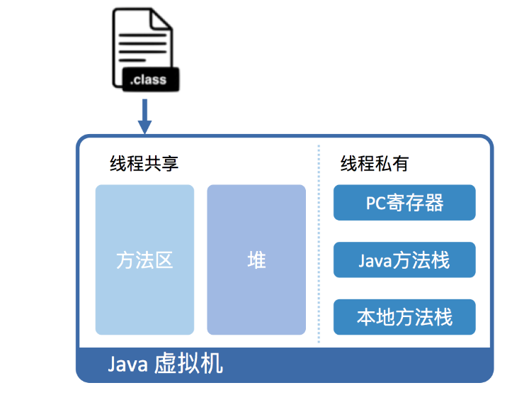
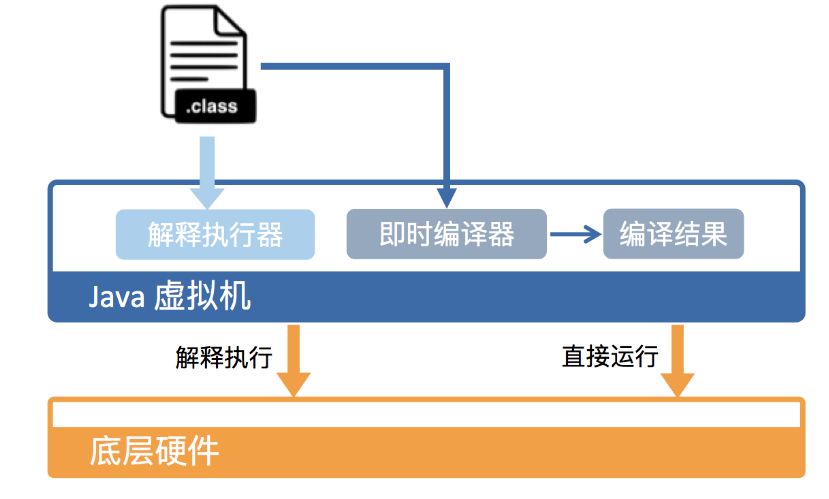
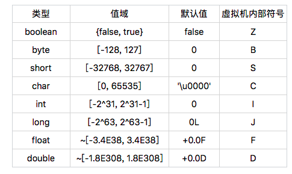
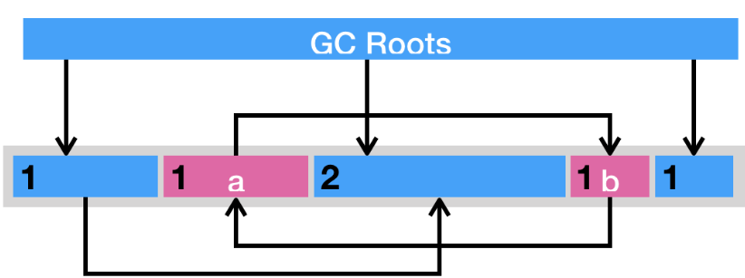
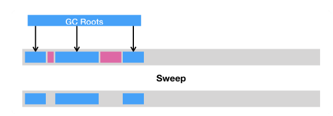
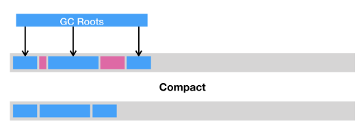
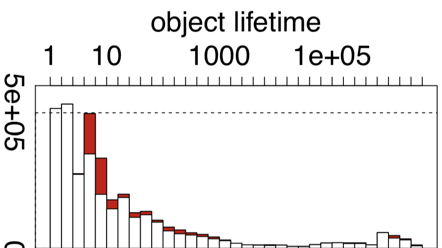

# Java虚拟机基本原理

## java代码是怎么运行

实际上，JRE 仅包含运行 Java 程序的必需组件，包括 Java 虚拟机以及 Java 核心类库等。我们 Java 程序员经常接触到的 JDK（Java 开发工具包）同样包含了 JRE，并且还附带了一系列开发、诊断工具。

```汇编

; 最左列是偏移；中间列是给机器读的机器码；最右列是给人读的汇编代码
0x00:  55                    push   rbp
0x01:  48 89 e5              mov    rbp,rsp
0x04:  48 83 ec 10           sub    rsp,0x10
0x08:  48 8d 3d 3b 00 00 00  lea    rdi,[rip+0x3b] 
                                    ; 加载"Hello, World!\n"
0x0f:  c7 45 fc 00 00 00 00  mov    DWORD PTR [rbp-0x4],0x0
0x16:  b0 00                 mov    al,0x0
0x18:  e8 0d 00 00 00        call   0x12
                                    ; 调用printf方法
0x1d:  31 c9                 xor    ecx,ecx
0x1f:  89 45 f8              mov    DWORD PTR [rbp-0x8],eax
0x22:  89 c8                 mov    eax,ecx
0x24:  48 83 c4 10           add    rsp,0x10
0x28:  5d                    pop    rbp
0x29:  c3                    ret
```

### 为什么java要在虚拟机上运行

Java 作为一门高级程序语言，它的语法非常复杂，抽象程度也很高。因此，直接在硬件上运行这种复杂的程序并不现实。所以呢，在运行 Java 程序之前，我们需要对其进行一番转换。

Java 虚拟机可以由硬件实现[1]，但更为常见的是在各个现有平台（如 Windows_x64、Linux_aarch64）上提供软件实现。这么做的意义在于，一旦一个程序被转换成 Java 字节码，那么它便可以在不同平台上的虚拟机实现里运行。这也就是我们经常说的“一次编写，到处运行”。

虚拟机的另外一个好处是它带来了一个托管环境（Managed Runtime）。这个托管环境能够代替我们处理一些代码中冗长而且容易出错的部分。其中最广为人知的当属自动内存管理与垃圾回收，这部分内容甚至催生了一波垃圾回收调优的业务。

### Java 虚拟机具体是怎样运行 Java 字节码的

从虚拟机视角来看，执行 Java 代码首先需要将它编译而成的 class 文件加载到 Java 虚拟机中。加载后的 Java 类会被存放于方法区（Method Area）中。实际运行时，虚拟机会执行方法区内的代码。

如果你熟悉 X86 的话，你会发现这和段式内存管理中的代码段类似。而且，Java 虚拟机同样也在内存中划分出堆和栈来存储运行时数据。

不同的是，Java 虚拟机会将栈细分为面向 Java 方法的 Java 方法栈，面向本地方法（用 C++ 写的 native 方法）的本地方法栈，以及存放各个线程执行位置的 PC 寄存器



从硬件视角来看，Java 字节码无法直接执行。因此，Java 虚拟机需要将字节码翻译成机器码。

在 HotSpot 里面，上述翻译过程有两种形式：第一种是解释执行，即逐条将字节码翻译成机器码并执行；第二种是即时编译（Just-In-Time compilation，JIT），即将一个方法中包含的所有字节码编译成机器码后再执行。




前者的优势在于无需等待编译，而后者的优势在于实际运行速度更快。HotSpot 默认采用混合模式，综合了解释执行和即时编译两者的优点。它会先解释执行字节码，而后将其中反复执行的热点代码，以方法为单位进行即时编译

### Java 虚拟机的运行效率究竟是怎么样的？

HotSpot 采用了多种技术来提升启动性能以及峰值性能，刚刚提到的即时编译便是其中最重要的技术之一。即时编译建立在程序符合二八定律的假设上，也就是百分之二十的代码占据了百分之八十的计算资源。对于占据大部分的不常用的代码，我们无需耗费时间将其编译成机器码，而是采取解释执行的方式运行；另一方面，对于仅占据小部分的热点代码，我们则可以将其编译成机器码，以达到理想的运行速度。理论上讲，即时编译后的 Java 程序的执行效率，是可能超过 C++ 程序的。这是因为与静态编译相比，即时编译拥有程序的运行时信息，并且能够根据这个信息做出相应的优化。举个例子，我们知道虚方法是用来实现面向对象语言多态性的。对于一个虚方法调用，尽管它有很多个目标方法，但在实际运行过程中它可能只调用其中的一个。这个信息便可以被即时编译器所利用，来规避虚方法调用的开销，从而达到比静态编译的 C++ 程序更高的性能。为了满足不同用户场景的需要，HotSpot 内置了多个即时编译器：C1、C2 和 Graal。Graal 是 Java 10 正式引入的实验性即时编译器，在专栏的第四部分我会详细介绍，这里暂不做讨论。


之所以引入多个即时编译器，是为了在编译时间和生成代码的执行效率之间进行取舍。C1 又叫做 Client 编译器，面向的是对启动性能有要求的客户端 GUI 程序，采用的优化手段相对简单，因此编译时间较短。C2 又叫做 Server 编译器，面向的是对峰值性能有要求的服务器端程序，采用的优化手段相对复杂，因此编译时间较长，但同时生成代码的执行效率较高。从 Java 7 开始，HotSpot 默认采用分层编译的方式：热点方法首先会被 C1 编译，而后热点方法中的热点会进一步被 C2 编译。

在计算资源充足的情况下，字节码的解释执行和即时编译可同时进行。编译完成后的机器码会在下次调用该方法时启用，以替换原本的解释执行。

### 总结

1. C直接编译成机器码，没有运行时的概念
2. java先编译成字节码，然后由不同平台的JVM解释字节码运行。有两种方式，一种是解释执行，一种是即时编译（JIT），就是将方法中的所有字节码编译成机器码后再执行。java hotspot采用了混合模式
3. jvm的作用，1是可移植性，实现了一次编写，到处运行的  2是提供了托管环境，代理处理垃圾回收等机制。
4. JVM导入字节码后，会在内存分配5个区域，堆，方法区，线程私有的pc寄存器，本地方法站，java方法栈。

## java的基本类型

Java 则不同，它引进了八个基本类型，来支持数值计算。Java 这么做的原因主要是工程上的考虑，因为使用基本类型能够在**执行效率**以及**内存使用**两方面提升软件性能。

### java虚拟机的boolean类型

在 Java 语言规范中，boolean 类型的值只有两种可能，它们分别用符号“true”和“false”来表示。显然，这两个符号是**不能被虚拟机直接使用的**。

在 Java 虚拟机规范中，boolean 类型则被映射成 int 类型。具体来说，“true”被映射为整数 1，而“false”被映射为整数 0。这个编码规则约束了 Java 字节码的具体实现。




在这些基本类型中，boolean 和 char 是唯二的无符号类型。在不考虑违反规范的情况下，boolean 类型的取值范围是 0 或者 1。char 类型的取值范围则是[0, 65535]。通常我们可以认定 char 类型的值为非负数。这种特性十分有用，比如说作为数组索引等。

### Java 基本类型的大小


## java虚拟机是如何加载类的

我们知道 Java 语言的类型可以分为两大类：基本类型（primitive types）和引用类型（reference types）。在上一篇中，我已经详细介绍过了 Java 的基本类型，它们是由 Java 虚拟机预先定义好的。

至于另一大类引用类型，Java 将其细分为四种：类、接口、数组类和泛型参数。由于泛型参数会在编译过程中被擦除（我会在专栏的第二部分详细介绍），因此 Java 虚拟机实际上只有前三种。在类、接口和数组类中，数组类是由 Java 虚拟机直接生成的，其他两种则有对应的字节流。

无论是直接生成的数组类，还是加载的类，Java 虚拟机都需要对其进行链接和初始化。接下来，我会详细给你介绍一下每个步骤具体都在干些什么。

### 加载

加载，是指查找字节流，并且据此创建类的过程。前面提到，对于数组类来说，它并没有对应的字节流，而是由 Java 虚拟机直接生成的。对于其他的类来说，Java 虚拟机则需要借助类加载器来完成查找字节流的过程。

村里有许多建筑师，他们等级森严，但有着共同的祖师爷，叫启动类加载器（bootstrap class loader）。启动类加载器是由 C++ 实现的，没有对应的 Java 对象，因此在 Java 中只能用 null 来指代。换句话说，祖师爷不喜欢像 Tony 这样的小角色来打扰他，所以谁也没有祖师爷的联系方式。

以盖房子为例，村里的 Tony 要盖个房子，那么按照流程他得先找个建筑师，跟他说想要设计一个房型，比如说“一房、一厅、四卫”。你或许已经听出来了，这里的房型相当于类，而建筑师，就相当于类加载器。村里有许多建筑师，他们等级森严，但有着共同的祖师爷，叫启动类加载器（bootstrap class loader）。

启动类加载器是由 C++ 实现的，没有对应的 Java 对象，因此在 Java 中只能用 null 来指代。换句话说，祖师爷不喜欢像 Tony 这样的小角色来打扰他，所以谁也没有祖师爷的联系方式。

除了启动类加载器之外，其他的类加载器都是 java.lang.ClassLoader 的子类，因此有对应的 Java 对象。这些类加载器需要先由另一个类加载器，比如说启动类加载器，加载至 Java 虚拟机中，方能执行类加载。村里的建筑师有一个潜规则，就是接到单子自己不能着手干，得先给师傅过过目。师傅不接手的情况下，才能自己来。在 Java 虚拟机中，这个潜规则有个特别的名字，叫双亲委派模型。

每当一个类加载器接收到加载请求时，它会先将请求转发给父类加载器。在父类加载器没有找到所请求的类的情况下，该类加载器才会尝试去加载。

在 Java 9 之前，***启动类加载器负责加载最为基础、最为重要的类，比如存放在 JRE 的 lib 目录下 jar 包中的类（以及由虚拟机参数 -Xbootclasspath 指定的类）***。除了启动类加载器之外，另外两个重要的类加载器是***扩展类加载器***（extension class loader）和***应用类加载器（application class loader）***，均由 Java 核心类库提供。

***扩展类加载器的父类加载器是启动类加载器。它负责加载相对次要、但又通用的类，比如存放在 JRE 的 lib/ext 目录下 jar 包中的类（以及由系统变量 java.ext.dirs 指定的类）***。***应用类加载器的父类加载器则是扩展类加载器。它负责加载应用程序路径下的类。（这里的应用程序路径，便是指虚拟机参数 -cp/-classpath、系统变量 java.class.path 或环境变量 CLASSPATH 所指定的路径。）***默认情况下，应用程序中包含的类便是由应用类加载器加载的。

Java 9 引入了模块系统，并且略微更改了上述的类加载器1。扩展类加载器被改名为平台类加载器

在 Java 虚拟机中，类的唯一性是由类加载器实例以及类的全名一同确定的。即便是同一串字节流，经由不同的类加载器加载，也会得到两个不同的类。在大型应用中，我们往往借助这一特性，来运行同一个类的不同版本。

### 链接

> 链接，是指将创建成的类合并至 Java 虚拟机中，使之能够执行的过程。它可分为验证、准备以及解析三个阶段
>
> 验证阶段的目的，在于确保被加载类能够满足 Java 虚拟机的约束条件.这就好比 Tony 需要将设计好的房型提交给市政部门审核。只有当审核通过，才能继续下面的建造工作
>
> 准备阶段的目的，则是为被加载类的静态字段分配内存.
>
> 解析阶段的目的，正是将这些符号引用解析成为实际引用。如果符号引用指向一个未被加载的类，或者未被加载类的字段或方法，那么解析将触发这个类的加载（但未必触发这个类的链接以及初始化。）

### 初始化

如果直接赋值的静态字段被 final 所修饰，并且它的类型是基本类型或字符串时，那么该字段便会被 Java 编译器标记成常量值（ConstantValue），其初始化直接由 Java 虚拟机完成。除此之外的直接赋值操作，以及所有静态代码块中的代码，则会被 Java 编译器置于同一方法中，并把它命名为 < clinit >。

类加载的最后一步是初始化，便是为标记为常量值的字段赋值，以及执行 < clinit > 方法的过程。Java 虚拟机会通过加锁来确保类的 < clinit > 方法仅被执行一次。

那么，类的初始化何时会被触发呢？JVM 规范枚举了下述多种触发情况：

- 当虚拟机启动时，初始化用户指定的主类；
- 当遇到用以新建目标类实例的 new 指令时，初始化 new 指令的目标类；
- 当遇到调用静态方法的指令时，初始化该静态方法所在的类；
- 当遇到访问静态字段的指令时，初始化该静态字段所在的类；
- 子类的初始化会触发父类的初始化；
- 如果一个接口定义了 default 方法，那么直接实现或者间接实现该接口的类的初始化，会触发该接口的初始化；
- 使用反射 API 对某个类进行反射调用时，初始化这个类；
- 当初次调用 MethodHandle 实例时，初始化该 MethodHandle 指向的方法所在的类。


## java对象的内存布局

在 Java 虚拟机中，每个 Java 对象都有一个对象头（object header），这个由标记字段和类型指针所构成。其中，标记字段用以存储 Java 虚拟机有关该对象的运行数据，如哈希码、GC 信息以及锁信息，而类型指针则指向该对象的类。

在 64 位的 Java 虚拟机中，对象头的标记字段占 64 位，而类型指针又占了 64 位。也就是说，每一个 Java 对象在内存中的额外开销就是 16 个字节。以 Integer 类为例，它仅有一个 int 类型的私有字段，占 4 个字节。因此，每一个 Integer 对象的额外内存开销至少是 400%。这也是为什么 Java 要引入基本类型的原因之一。

为了尽量较少对象的内存使用量，64 位 Java 虚拟机引入了压缩指针[1]的概念（对应虚拟机选项 -XX:+UseCompressedOops，默认开启），将堆中原本 64 位的 Java 对象指针压缩成 32 位的。

这样一来，对象头中的类型指针也会被压缩成 32 位，使得对象头的大小从 16 字节降至 12 字节。当然，压缩指针不仅可以作用于对象头的类型指针，还可以作用于引用类型的字段，以及引用类型数组。

## JVM 垃圾回收（1）

>垃圾回收，顾名思义，便是将已经分配出去的，但却不再使用的内存回收回来，以便能够再次分配

我们先来讲一种古老的辨别方法：引用计数法（reference counting）。它的做法是为每个对象添加一个引用计数器，用来统计指向该对象的引用个数。一旦某个对象的引用计数器为 0，则说明该对象已经死亡，便可以被回收了。

它的具体实现是这样子的：如果有一个引用，被赋值为某一对象，那么将该对象的引用计数器 +1。如果一个指向某一对象的引用，被赋值为其他值，那么将该对象的引用计数器 -1。也就是说，我们需要截获所有的引用更新操作，并且相应地增减目标对象的引用计数器。

除了需要额外的空间来存储计数器，以及繁琐的更新操作，引用计数法还有一个重大的漏洞，那便是无法处理循环引用对象。

举个例子，假设对象 a 与 b 相互引用，除此之外没有其他引用指向 a 或者 b。在这种情况下，a 和 b 实际上已经死了，但由于它们的引用计数器皆不为 0，在引用计数法的心中，这两个对象还活着。因此，这些循环引用对象所占据的空间将不可回收，从而造成了内存泄露。




目前 Java 虚拟机的主流垃圾回收器采取的是可达性分析算法。这个算法的实质在于将一系列 GC Roots 作为初始的存活对象合集（live set），然后从该合集出发，探索所有能够被该集合引用到的对象，并将其加入到该集合中，这个过程我们也称之为标记（mark）。最终，未被探索到的对象便是死亡的，是可以回收的。

那么什么是 GC Roots 呢？我们可以暂时理解为由堆外指向堆内的引用，一般而言，GC Roots 包括（但不限于）如下几种：

1. Java 方法栈桢中的局部变量；
2. 已加载类的静态变量；
3. JNI handles；
4. 已启动且未停止的 Java 线程。

可达性分析可以解决引用计数法所不能解决的循环引用问题。举例来说，即便对象 a 和 b 相互引用，只要从 GC Roots 出发无法到达 a 或者 b，那么可达性分析便不会将它们加入存活对象合集之中。

虽然可达性分析的算法本身很简明，但是在实践中还是有不少其他问题需要解决的。

比如说，在多线程环境下，其他线程可能会更新已经访问过的对象中的引用，从而造成误报（将引用设置为 null）或者漏报（将引用设置为未被访问过的对象）。

### Stop-the-world 以及安全点

怎么解决这个问题呢？在 Java 虚拟机里，传统的垃圾回收算法采用的是一种简单粗暴的方式，那便是 Stop-the-world，停止其他非垃圾回收线程的工作，直到完成垃圾回收。这也就造成了垃圾回收所谓的暂停时间（GC pause）。

Java 虚拟机中的 Stop-the-world 是通过安全点（safepoint）机制来实现的。当 Java 虚拟机收到 Stop-the-world 请求，它便会等待所有的线程都到达安全点，才允许请求 Stop-the-world 的线程进行独占的工作。

这篇博客[2]还提到了一种比较另类的解释：安全词。一旦垃圾回收线程喊出了安全词，其他非垃圾回收线程便会一一停下。当然，安全点的初始目的并不是让其他线程停下，而是找到一个稳定的执行状态。在这个执行状态下，Java 虚拟机的堆栈不会发生变化。这么一来，垃圾回收器便能够“安全”地执行可达性分析。

### 垃圾回收的三种方式

1. 第一种是清除（sweep），即把死亡对象所占据的内存标记为空闲内存，并记录在一个空闲列表（free list）之中。当需要新建对象时，内存管理模块便会从该空闲列表中寻找空闲内存，并划分给新建的对象



清除这种回收方式的原理及其简单，但是有两个缺点。

一是会造成内存碎片。由于 Java 虚拟机的堆中对象必须是连续分布的，因此可能出现总空闲内存足够，但是无法分配的极端情况。

另一个则是分配效率较低。如果是一块连续的内存空间，那么我们可以通过指针加法（pointer bumping）来做分配。而对于空闲列表，Java 虚拟机则需要逐个访问列表中的项，来查找能够放入新建对象的空闲内存。

2. 第二种是压缩（compact），即把存活的对象聚集到内存区域的起始位置，从而留下一段连续的内存空间。这种做法能够解决内存碎片化的问题，但代价是压缩算法的性能开销




3. 第三种则是复制（copy），即把内存区域分为两等分，分别用两个指针 from 和 to 来维护，并且只是用 from 指针指向的内存区域来分配内存。当发生垃圾回收时，便把存活的对象复制到 to 指针指向的内存区域中，并且交换 from 指针和 to 指针的内容。复制这种回收方式同样能够解决内存碎片化的问题，但是它的缺点也极其明显，即堆空间的使用效率极其低下。

## JVM 垃圾回收（2）

在读博士的时候，我曾经写过一个统计 Java 对象生命周期的动态分析，并且用它来跑了一些基准测试。

其中一些程序的结果，恰好验证了许多研究人员的假设，即大部分的 Java 对象只存活一小段时间，而存活下来的小部分 Java 对象则会存活很长一段时间。




之所以要提到这个假设，是因为它造就了 Java 虚拟机的**分代回收**思想。简单来说，就是将堆空间划分为两代，分别叫做新生代和老年代。新生代用来存储新建的对象。当对象存活时间够长时，则将其移动到老年代。

Java 虚拟机可以给不同代使用不同的回收算法。对于新生代，我们猜测大部分的 Java 对象只存活一小段时间，那么便可以频繁地采用耗时较短的垃圾回收算法，让大部分的垃圾都能够在新生代被回收掉。

对于老年代，我们猜测大部分的垃圾已经在新生代中被回收了，而在老年代中的对象有大概率会继续存活。当真正触发针对老年代的回收时，则代表这个假设出错了，或者堆的空间已经耗尽了。

这时候，Java 虚拟机往往需要做一次全堆扫描，耗时也将不计成本。（当然，现代的垃圾回收器都在并发收集的道路上发展，来避免这种全堆扫描的情况。）今天这一篇我们来关注一下针对新生代的 Minor GC。首先，我们来看看 Java 虚拟机中的堆具体是怎么划分的。

### jvm中的堆划分

前面提到，Java 虚拟机将堆划分为新生代和老年代。其中，新生代又被划分为 Eden 区，以及两个大小相同的 Survivor 区。

***默认情况下，Java 虚拟机采取的是一种动态分配的策略（对应 Java 虚拟机参数 -XX:+UsePSAdaptiveSurvivorSizePolicy），根据生成对象的速率，以及 Survivor 区的使用情况动态调整 Eden 区和 Survivor 区的比例***

当然，你也可以通过参数 -XX:SurvivorRatio 来固定这个比例。但是需要注意的是，其中一个 Survivor 区会一直为空，因此比例越低浪费的堆空间将越高。


通常来说，当我们调用 new 指令时，它会在 Eden 区中划出一块作为存储对象的内存。由于堆空间是线程共享的，因此直接在这里边划空间是需要进行同步的。否则，将有可能出现两个对象共用一段内存的事故。

如果你还记得前两篇我用“停车位”打的比方的话，这里就相当于两个司机（线程）同时将车停入同一个停车位，因而发生剐蹭事故。Java 虚拟机的解决方法是为每个司机预先申请多个停车位，并且只允许该司机停在自己的停车位上。

那么当司机的停车位用完了该怎么办呢（假设这个司机代客泊车）？答案是：再申请多个停车位便可以了。这项技术被称之为 TLAB（Thread Local Allocation Buffer，对应虚拟机参数 -XX:+UseTLAB，默认开启）。

具体来说，每个线程可以向 Java 虚拟机申请一段连续的内存，比如 2048 字节，作为线程私有的 TLAB。

这个操作需要加锁，线程需要维护两个指针（实际上可能更多，但重要也就两个），一个指向 TLAB 中空余内存的起始位置，一个则指向 TLAB 末尾。

如果加法后空余内存指针的值仍小于或等于指向末尾的指针，则代表分配成功。否则，TLAB 已经没有足够的空间来满足本次新建操作。这个时候，便需要当前线程重新申请新的 TLAB。

当 Eden 区的空间耗尽了怎么办？这个时候 Java 虚拟机便会触发一次 Minor GC，来收集新生代的垃圾。存活下来的对象，则会被送到 Survivor 区。

前面提到，新生代共有两个 Survivor 区，我们分别用 from 和 to 来指代。其中 to 指向的 Survivior 区是空的。

当发生 Minor GC 时，Eden 区和 from 指向的 Survivor 区中的存活对象会被复制到 to 指向的 Survivor 区中，然后交换 from 和 to 指针，以保证下一次 Minor GC 时，to 指向的 Survivor 区还是空的。

Java 虚拟机会记录 Survivor 区中的对象一共被来回复制了几次。如果一个对象被复制的次数为 15（对应虚拟机参数 -XX:+MaxTenuringThreshold），那么该对象将被晋升（promote）至老年代。另外，如果单个 Survivor 区已经被占用了 50%（对应虚拟机参数 -XX:TargetSurvivorRatio），那么较高复制次数的对象也会被晋升至老年代。

总而言之，当发生 Minor GC 时，我们应用了标记 - 复制算法，将 Survivor 区中的老存活对象晋升到老年代，然后将剩下的存活对象和 Eden 区的存活对象复制到另一个 Survivor 区中。理想情况下，Eden 区中的对象基本都死亡了，那么需要复制的数据将非常少，因此采用这种标记 - 复制算法的效果极好。

Minor GC 的另外一个好处是不用对整个堆进行垃圾回收。但是，它却有一个问题，那就是老年代的对象可能引用新生代的对象。也就是说，在标记存活对象的时候，我们需要扫描老年代中的对象。如果该对象拥有对新生代对象的引用，那么这个引用也会被作为 GC Roots。

### 卡表

HotSpot 给出的解决方案是一项叫做卡表（Card Table）的技术。该技术将整个堆划分为一个个大小为 512 字节的卡，并且维护一个卡表，用来存储每张卡的一个标识位。这个标识位代表对应的卡是否可能存有指向新生代对象的引用。如果可能存在，那么我们就认为这张卡是脏的。

在进行 Minor GC 的时候，我们便可以不用扫描整个老年代，而是在卡表中寻找脏卡，并将脏卡中的对象加入到 Minor GC 的 GC Roots 里。当完成所有脏卡的扫描之后，Java 虚拟机便会将所有脏卡的标识位清零。

由于 Minor GC 伴随着存活对象的复制，而复制需要更新指向该对象的引用。因此，在更新引用的同时，我们又会设置引用所在的卡的标识位。这个时候，我们可以确保脏卡中必定包含指向新生代对象的引用。

### java虚拟机中的垃圾回收

针对新生代的垃圾回收器共有三个：Serial，Parallel Scavenge 和 Parallel New。这三个采用的都是标记 - 复制算法。其中，Serial 是一个单线程的，Parallel New 可以看成 Serial 的多线程版本。Parallel Scavenge 和 Parallel New 类似，但更加注重吞吐率。此外，Parallel Scavenge 不能与 CMS 一起使用。

针对老年代的垃圾回收器也有三个：刚刚提到的 Serial Old 和 Parallel Old，以及 CMS。Serial Old 和 Parallel Old 都是标记 - 压缩算法。同样，前者是单线程的，而后者可以看成前者的多线程版本。

CMS 采用的是标记 - 清除算法，并且是并发的。除了少数几个操作需要 Stop-the-world 之外，它可以在应用程序运行过程中进行垃圾回收。在并发收集失败的情况下，Java 虚拟机会使用其他两个压缩型垃圾回收器进行一次垃圾回收。由于 G1 的出现，CMS 在 Java 9 中已被废弃[3]。

G1（Garbage First）是一个横跨新生代和老年代的垃圾回收器。实际上，它已经打乱了前面所说的堆结构，直接将堆分成极其多个区域。每个区域都可以充当 Eden 区、Survivor 区或者老年代中的一个。它采用的是标记 - 压缩算法，而且和 CMS 一样都能够在应用程序运行过程中并发地进行垃圾回收。

G1 能够针对每个细分的区域来进行垃圾回收。在选择进行垃圾回收的区域时，它会优先回收死亡对象较多的区域。这也是 G1 名字的由来。

即将到来的 Java 11 引入了 ZGC，宣称暂停时间不超过 10ms。如果你感兴趣的话，可参考 R 大的这篇文章[4]。

# 高效编译

## 常用工具介绍

### javap-查询字节码

# java代码优化

## jps


你可能用过ps命令，打印所有正在运行的进程的相关信息。JDK 中的jps命令（帮助文档）沿用了同样的概念：它将打印所有正在运行的 Java 进程的相关信息。在默认情况下，jps的输出信息包括 Java 进程的进程 ID 以及主类名。我们还可以通过追加参数，来打印额外的信息。例如，-l将打印模块名以及包名；-v将打印传递给 Java 虚拟机的参数（如-XX:+UnlockExperimentalVMOptions -XX:+UseZGC）；-m将打印传递给主类的参数。

```shell
$ jps -mlv
18331 org.example.Foo Hello World
18332 jdk.jcmd/sun.tools.jps.Jps -mlv -Dapplication.home=/Library/Java/JavaVirtualMachines/jdk-11.jdk/Contents/Home -Xms8m -Djdk.module.main=jdk.jcmd
```

需要注意的是，如果某 Java 进程关闭了默认开启的UsePerfData参数（即使用参数-XX:-UsePerfData），那么jps命令（以及下面介绍的jstat）将无法探知该 Java 进程。当获得 Java 进程的进程 ID 之后，我们便可以调用接下来介绍的各项监控及诊断工具了。

## jstat

jstat命令（帮助文档）可用来打印目标 Java 进程的性能数据。它包括多条子命令，如下所示：

```shell
$ jstat -options
-class
-compiler
-gc
-gccapacity
-gccause
-gcmetacapacity
-gcnew
-gcnewcapacity
-gcold
-gcoldcapacity
-gcutil
-printcompilation
```

在这些子命令中，-class将打印类加载相关的数据，-compiler和-printcompilation将打印即时编译相关的数据。剩下的都是以-gc为前缀的子命令，它们将打印垃圾回收相关的数据。默认情况下，jstat只会打印一次性能数据。我们可以将它配置为每隔一段时间打印一次，直至目标 Java 进程终止，或者达到我们所配置的最大打印次数。具体示例如下所示：

```shell
# Usage: jstat -outputOptions [-t] [-hlines] VMID [interval [count]]
$ jstat -gc 22126 1s 4
S0C    S1C    S0U    S1U      EC       EU        OC         OU       MC     MU    CCSC   CCSU   YGC     YGCT    FGC    FGCT    CGC    CGCT     GCT   
17472,0 17472,0  0,0    0,0   139904,0 47146,4   349568,0   21321,0   30020,0 28001,8 4864,0 4673,4     22    0,080   3      0,270   0      0,000    0,350
17472,0 17472,0 420,6   0,0   139904,0 11178,4   349568,0   21321,0   30020,0 28090,1 4864,0 4674,2     28    0,084   3      0,270   0      0,000    0,354
17472,0 17472,0  0,0   403,9  139904,0 139538,4  349568,0   21323,4   30020,0 28137,2 4864,0 4674,2     34    0,088   4      0,359   0      0,000    0,446
17472,0 17472,0  0,0    0,0   139904,0   0,0     349568,0   21326,1   30020,0 28093,6 4864,0 4673,4     38    0,091   5      0,445   0      0,000    0,536
```

当使用默认的 G1 GC 时，输出结果则有另一些特征：

```shell
$ jstat -gc 22208 1s
S0C    S1C    S0U    S1U      EC       EU        OC         OU       MC     MU    CCSC   CCSU   YGC     YGCT    FGC    FGCT    CGC    CGCT     GCT   
0,0   16384,0  0,0   16384,0 210944,0 192512,0  133120,0    5332,5   28848,0 26886,4 4864,0 4620,5     19    0,067   1      0,016   2      0,002    0,084
0,0   16384,0  0,0   16384,0 210944,0 83968,0   133120,0    5749,9   29104,0 27132,8 4864,0 4621,0     21    0,078   1      0,016   2      0,002    0,095
0,0    0,0    0,0    0,0   71680,0  18432,0   45056,0    20285,1   29872,0 27952,4 4864,0 4671,6     23    0,089   2      0,063   2      0,002    0,153
0,0   2048,0  0,0   2048,0 69632,0  28672,0   45056,0    18608,1   30128,0 28030,4 4864,0 4672,4     32    0,093   2      0,063   2      0,002    0,158
...
```

在上面这个示例中，jstat每隔 1s 便会打印垃圾回收的信息，并且不断重复下去。你可能已经留意到，S0C和S0U始终为 0，而且另一个 Survivor 区的容量（S1C）可能会下降至 0。这是因为，当使用 G1 GC 时，Java 虚拟机不再设置 Eden 区、Survivor 区，老年代区的内存边界，而是将堆划分为若干个等长内存区域。每个内存区域都可以作为 Eden 区、Survivor 区以及老年代区中的任一种，并且可以在不同区域类型之间来回切换。（参考链接）换句话说，逻辑上我们只有一个 Survivor 区。当需要迁移 Survivor 区中的数据时（即 Copying GC），我们只需另外申请一个或多个内存区域，作为新的 Survivor 区。因此，Java 虚拟机决定在使用 G1 GC 时，将所有 Survivor 内存区域的总容量以及已使用量存放至 S1C 和 S1U 中，而 S0C 和 S0U 则被设置为 0。当发生垃圾回收时，Java 虚拟机可能出现 Survivor 内存区域内的对象全被回收或晋升的现象。在这种情况下，Java 虚拟机会将这块内存区域回收，并标记为可分配的状态。这样子做的结果是，堆中可能完全没有 Survivor 内存区域，因而相应的 S1C 和 S1U 将会是 0。jstat还有一个非常有用的参数-t，它将在每行数据之前打印目标 Java 进程的启动时间。例如，在下面这个示例中，第一列代表该 Java 进程已经启动了 10.7 秒。

## jmap

在这种情况下，我们便可以请jmap命令（帮助文档）出马，分析 Java 虚拟机堆中的对象。jmap同样包括多条子命令。

1. -clstats，该子命令将打印被加载类的信息。
2. -finalizerinfo，该子命令将打印所有待 finalize 的对象。
3. -histo，该子命令将统计各个类的实例数目以及占用内存，并按照内存使用量从多至少的顺序排列。此外，-histo:live只统计堆中的存活对象。
4. -dump，该子命令将导出 Java 虚拟机堆的快照。同样，-dump:live只保存堆中的存活对象。我们通常会利用jmap -dump:live,format=b,file=filename.bin命令，将堆中所有存活对象导出至一个文件之中。

我们通常会利用jmap -dump:live,format=b,file=filename.bin命令，将堆中所有存活对象导出至一个文件之中。这里format=b将使jmap导出与hprof（在 Java 9 中已被移除）、-XX:+HeapDumpAfterFullGC、-XX:+HeapDumpOnOutOfMemoryError格式一致的文件。这种格式的文件可以被其他 GUI 工具查看，具体我会在下一篇中进行演示。下面我贴了一段-histo子命令的输出：

```shell
$ jmap -histo 22574
 num     #instances         #bytes  class name (module)
-------------------------------------------------------
   1:        500004       20000160  org.python.core.PyComplex
   2:        570866       18267712  org.python.core.PyFloat
   3:        360295       18027024  [B (java.base@11)
   4:        339394       11429680  [Lorg.python.core.PyObject;
   5:        308637       11194264  [Ljava.lang.Object; (java.base@11)
   6:        301378        9291664  [I (java.base@11)
   7:        225103        9004120  java.math.BigInteger (java.base@11)
   8:        507362        8117792  org.python.core.PySequence$1
   9:        285009        6840216  org.python.core.PyLong
  10:        282908        6789792  java.lang.String (java.base@11)
  ...
2281:             1             16  traceback$py
2282:             1             16  unicodedata$py
Total       5151277      167944400
```

jmap（以及接下来的jinfo、jstack和jcmd）依赖于 Java 虚拟机的Attach API，因此只能监控本地 Java 进程。一旦开启 Java 虚拟机参数DisableAttachMechanism（即使用参数-XX:+DisableAttachMechanism），基于 Attach API 的命令将无法执行。反过来说，如果你不想被其他进程监控，那么你需要开启该参数。

## jinfo

jinfo命令（帮助文档）可用来查看目标 Java 进程的参数，如传递给 Java 虚拟机的-X（即输出中的 jvm_args）、-XX参数（即输出中的 VM Flags），以及可在 Java 层面通过System.getProperty获取的-D参数（即输出中的 System Properties）。

```shell
$ jinfo 31185
Java System Properties:

gopherProxySet=false
awt.toolkit=sun.lwawt.macosx.LWCToolkit
java.specification.version=11
sun.cpu.isalist=
sun.jnu.encoding=UTF-8
...

VM Flags:
-XX:CICompilerCount=4 -XX:ConcGCThreads=3 -XX:G1ConcRefinementThreads=10 -XX:G1HeapRegionSize=2097152 -XX:GCDrainStackTargetSize=64 -XX:InitialHeapSize=536870912 -XX:MarkStackSize=4194304 -XX:MaxHeapSize=8589934592 -XX:MaxNewSize=5152702464 -XX:MinHeapDeltaBytes=2097152 -XX:NonNMethodCodeHeapSize=5835340 -XX:NonProfiledCodeHeapSize=122911450 -XX:ProfiledCodeHeapSize=122911450 -XX:ReservedCodeCacheSize=251658240 -XX:+SegmentedCodeCache -XX:+UseCompressedClassPointers -XX:+UseCompressedOops -XX:+UseG1GC

VM Arguments:
jvm_args: -Xlog:gc -Xmx1024m
java_command: org.example.Foo
java_class_path (initial): .
Launcher Type: SUN_STANDARD
```

## jstack

jstack命令（帮助文档）可以用来打印目标 Java 进程中各个线程的栈轨迹，以及这些线程所持有的锁。

jstack的其中一个应用场景便是死锁检测。这里我用jstack获取一个已经死锁了的 Java 程序的栈信息。具体输出如下所示：

```shell
$ jstack 31634
...

"Thread-0" #12 prio=5 os_prio=31 cpu=1.32ms elapsed=34.24s tid=0x00007fb08601c800 nid=0x5d03 waiting for monitor entry  [0x000070000bc7e000]
   java.lang.Thread.State: BLOCKED (on object monitor)
 at DeadLock.foo(DeadLock.java:18)
 - waiting to lock <0x000000061ff904c0> (a java.lang.Object)
 - locked <0x000000061ff904b0> (a java.lang.Object)
 at DeadLock$$Lambda$1/0x0000000800060840.run(Unknown Source)
 at java.lang.Thread.run(java.base@11/Thread.java:834)

"Thread-1" #13 prio=5 os_prio=31 cpu=1.43ms elapsed=34.24s tid=0x00007fb08601f800 nid=0x5f03 waiting for monitor entry  [0x000070000bd81000]
   java.lang.Thread.State: BLOCKED (on object monitor)
 at DeadLock.bar(DeadLock.java:33)
 - waiting to lock <0x000000061ff904b0> (a java.lang.Object)
 - locked <0x000000061ff904c0> (a java.lang.Object)
 at DeadLock$$Lambda$2/0x0000000800063040.run(Unknown Source)
 at java.lang.Thread.run(java.base@11/Thread.java:834)

...

JNI global refs: 6, weak refs: 0


Found one Java-level deadlock:
=============================
"Thread-0":
  waiting to lock monitor 0x00007fb083015900 (object 0x000000061ff904c0, a java.lang.Object),
  which is held by "Thread-1"
"Thread-1":
  waiting to lock monitor 0x00007fb083015800 (object 0x000000061ff904b0, a java.lang.Object),
  which is held by "Thread-0"

Java stack information for the threads listed above:
===================================================
"Thread-0":
 at DeadLock.foo(DeadLock.java:18)
 - waiting to lock <0x000000061ff904c0> (a java.lang.Object)
 - locked <0x000000061ff904b0> (a java.lang.Object)
 at DeadLock$$Lambda$1/0x0000000800060840.run(Unknown Source)
 at java.lang.Thread.run(java.base@11/Thread.java:834)
"Thread-1":
 at DeadLock.bar(DeadLock.java:33)
 - waiting to lock <0x000000061ff904b0> (a java.lang.Object)
 - locked <0x000000061ff904c0> (a java.lang.Object)
 at DeadLock$$Lambda$2/0x0000000800063040.run(Unknown Source)
 at java.lang.Thread.run(java.base@11/Thread.java:834)

Found 1 deadlock.
```

我们可以看到，jstack不仅会打印线程的栈轨迹、线程状态（BLOCKED）、持有的锁（locked …）以及正在请求的锁（waiting to lock …），而且还会分析出具体的死锁。

## jcmd

你还可以直接使用jcmd命令（帮助文档），来替代前面除了jstat之外的所有命令。具体的替换规则你可以参考下表。至于jstat的功能，虽然jcmd复制了jstat的部分代码，并支持通过PerfCounter.print子命令来打印所有的 Performance Counter，但是它没有保留jstat的输出格式，也没有重复打印的功能。因此，感兴趣的同学可以自行整理。
