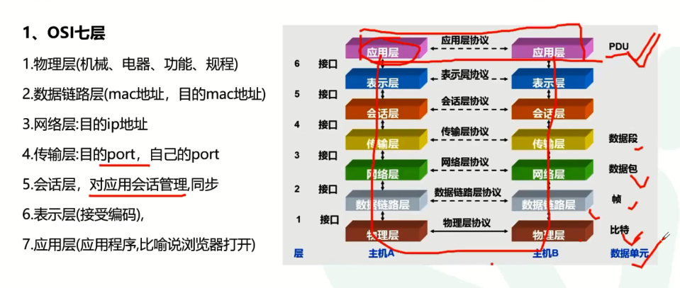
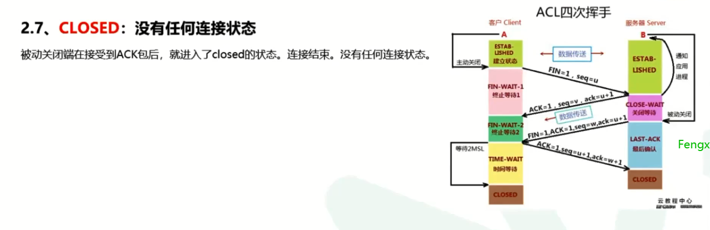
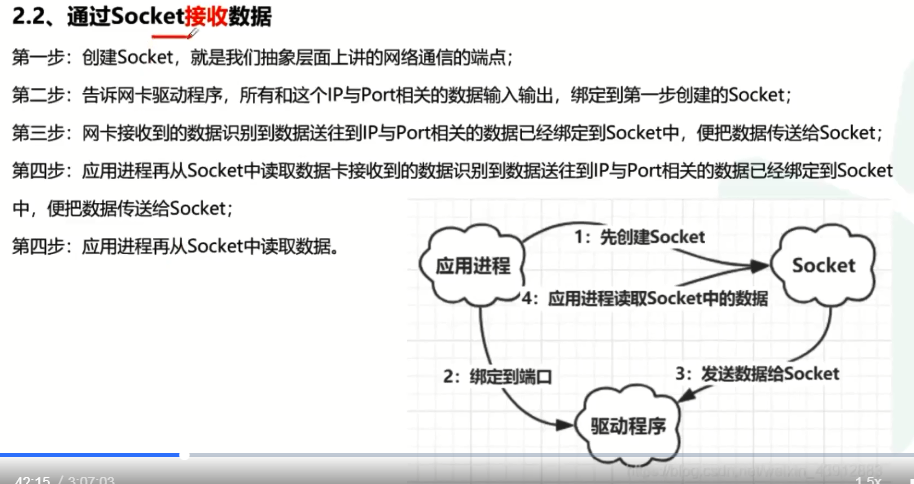
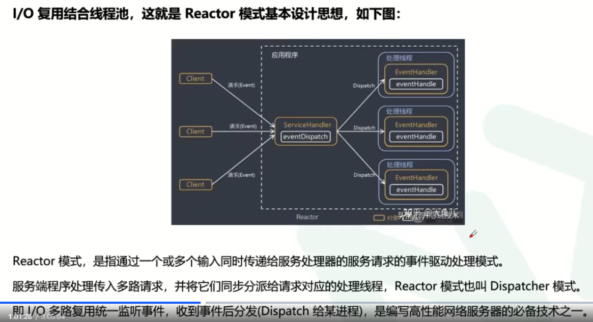
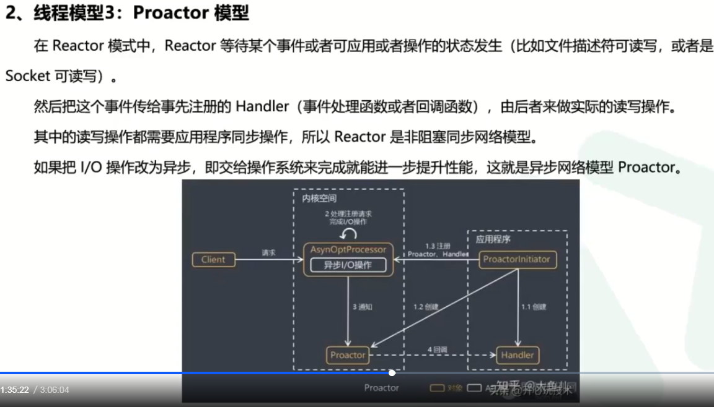

# 网络基础实战篇

## OSI网络七层模型

后来简化成了5层：

上图是对应的硬件设备

   

这个是协议栈

**表示层进一步说明：**

**会话层**

**传输层**

## TCP、IP协议设计剖析

如上，在IP层，加了IP首部，那么在传输层的所有数据（包括TCP首部）就是IP层的数据。每一层的数据包都是由该层的首部+上层的数据包

四次挥手

### TCP连接状态的深度解析

### Http，Https协议

### 客户端-服务器网络模型的设计和实现

# 网络实战进阶篇

## socket

上面的媒体就是：网卡

应用层在用户态，下面在内核态

## IO模型

可参考另外的一个md文件

## NIO编程

这种模式在许多项目中广泛使用，包括Nginx主从Reactor多进程模型，memcached，netty等

## Netty

