# 基础学习篇（第四版）

## 首次登录及线上求助

### 文字模式下指令的下达

#### 开始下达指令

```shell
[dmtsai@study ~]$ command [-options] parameter1 parameter2 ...
                    指令       选项     参数（1）  参数（2）
```

1. 命令的第一个一定是command，表示一个命令/批量脚本/script/可执行文件
2. options为选项设置，通常前面有-号，比如-h；有时候也可以用完整的名称，则使用--号，比如：--help
3. parameter1等为选项后面的参数，或者是command的参数。
4. 指令、选项、参数中间都是以空格分开，不能空格有多少位。
5. 指令太长，用\来跳脱[Enter]符号，使指令续行到下一行，。注 意！反斜线后就立刻接特殊字符，才能跳脱！

#### 几个重要的热键[Tab], [ctrl]-c, [ctrl]-d

##### Tab键


```shell
[dmtsai@study ~]$ ca[tab][tab] &lt;==[tab]按键是紧接在 a 字母后面！
cacertdir_rehash    cairo-sphinx  cancel          case
cache_check         cal           cancel.cups     cat
cache_dump          calibrate_ppa capsh           catchsegv
cache_metadata_size caller        captoinfo       catman
# 上面的 [tab] 指的是“按下那个tab键”，不是要你输入中括号内的tab啦！
# 所有以ca为开头的指令都被显示出来啦！很不错吧
# 命令后面的tab就是命令补全
```

```shell
[dmtsai@study ~]$ date --[tab][tab] &lt;==[tab]按键是紧接在 -- 后面！
--date --help --reference= --rfc-3339= --universal
--date= --iso-8601 --rfc-2822 --set= --version
# 瞧！系统会列出来 date 这个指令可以使用的选项有哪些喔～包括未来会用到的 --date 等项目
# tab放在选线或参数后面（也就是命令后面的第二个字串后面），则是文件补全或选项/参数补全（centos7.x环境下需要安装bash_completion软件）
```

##### Ctrl-C

> 中断正在运行的指令，所以如果正在运行很重要的指令，这个慎用。

##### Ctrl-D

> 键盘输入结束（EOF），另外也可以取代exit，比如你想离开命令行，就可以按下这个键。

##### Shift + Pageup / PageDown

如果指令的输出相当长，就可以用这个命令前翻看一下不在画面的部分。

#### linux系统的线上求助以及man page和info page，以及其他documents

##### man page

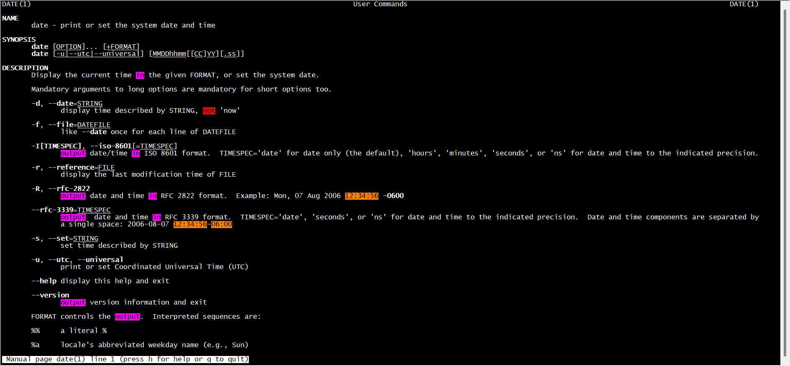


这个是man page的结果，看到头上的DATE(1)了吗？这个命令括号里的数字代表的是啥？1就表示“一般使用者可使用的指令”。好，这个后面的括号有如下几个含义：

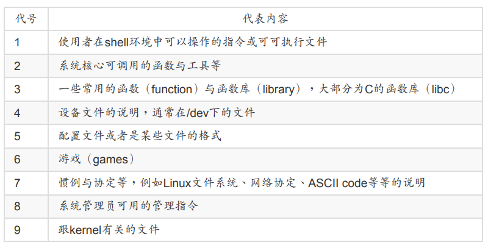

比如你man null的时候，会发现NULL(4)， 原来null这个是一个设备文件。

其中1，5，8这三个要记住，最好能背下来

man命令从上到下可以分为如下几个部分：

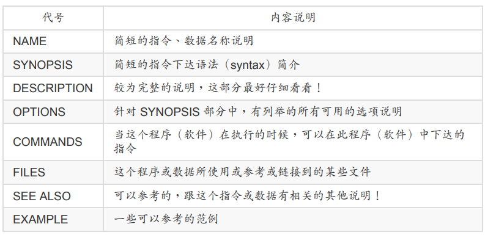

###### man page使用技巧

1. 使用上下键来上下移动，使用空白键向下翻页，也可以PageUp和PageDown来上下翻页。home回到首页，end到最后一页
2. 输入/xxx来查询字符串xxx位置，/xxx向下搜索，?xxx向上搜索。

如下：

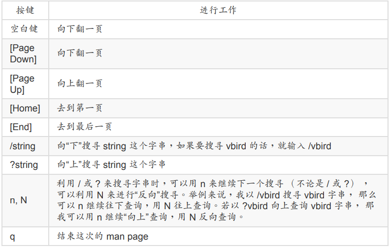


man实际上是读的文件，那这些文件一般都在哪里呢？不同的distribution有所不同，一般位于/usr/share/man， 我们可以修改配置文件来修改搜索路径，修改/etc/man_db.conf（有的版本为man.conf或manpath.conf或man.config）

##### info page

和man的用法差不多，info和man的不同是，info将文件数据拆成一个一个段落，每个段落用自己的页面来撰写，每个页面有类似网页的超链接来跳到不同的页面。

不过你要查询的目标数据的说明文档必须以info的格式来写成才能使用info的特殊功能。而这个支持info指令的文件默认放在/usr/share/info的目录当中，

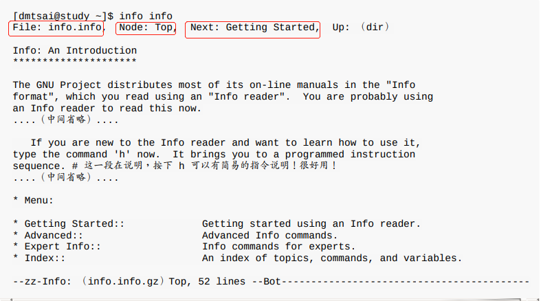

看看上面info这个指令的info显示，

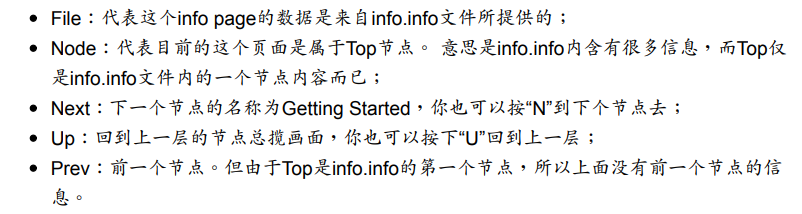

，你也会看到有“Menu”那个咚咚吧！下面共分为四小节，分别是Getting Started等等的， 我们可以使用上下左右按键来将光标移动到该文字或者“ * ”上面，按下Enter， 就可以前往该 小节了！另外，也可以按下[Tab]按键，就可以快速的将光标在上表的画面中的node间移动， 真的是非常的方便好用。

在info页面，你可以同步哦n，p，u来去到下一个，上一个，上一层的节点（node），看第二行以后就是针对info.info内的top的说明。另外在任何页面不知道如何使用按键使用了，按下**h**就能显示基本按键功能介绍（使用x退出h的帮助页面，在h页面不能使用其中的按键功能）。 下图为top这个节点按下h的显示，

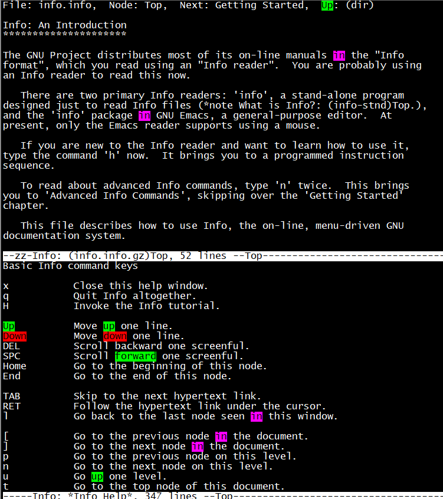

这些按键功能如下表：

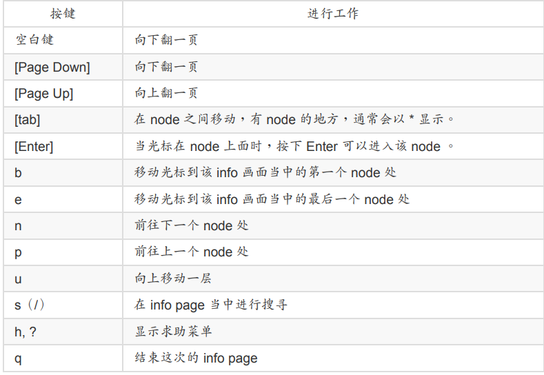


注意，只有这个指令按照info的格式写成了info文档，才能提供这么好的文档，否则info xxx的效果等同于man xxx，info的文件放在/usr/share/info里面

##### 其他有用的文档（document）

指令或者软件制作者，都会将自己的指令或者是软件的说明制作 成“线上说明文档”！ 但是，毕竟不是每个咚咚都需要做成线上说明文档的，还有相当多的说 明需要额外的文件！此时，这个所谓的 How-To（如何做的意思）就很重要啦！还有，某些软 件不只告诉你“如何做”，还会有一些相关的原理会说明呢

那么这些说明文档要摆在哪里呢？哈哈！就是摆在/usr/share/doc这个目录啦！所以说，你只 要到这个目录下面， 就会发现好多好多的说明文档啦！还不需要到网络上面找数据呢！厉害 吧！^_^ 举例来说，你可能会先想要知道 grub2 这个新版的开机管理软件有什么能使用的指 令？那可以到下面的目录瞧瞧： 

/usr/share/doc/grub2-tools-2.02

很多软件，都有安装须知，预计工作事项，未来工作计划等，还有可安装的程序，都放在/usr/share/doc当中哦。。而且这个目录下的数据主要是以套件（packages）为主，比如nano这个软件的相关信息在/usr/share/doc/nano-xxx(xxx为版本)。


##### 总结

1. 终端机模式，如果想知道某个命令，但却忘记了相关选项和参数，请先善用--help来查询相关信息
2. 有任何你不知道的命令或文件格式，如果想了解，使用man或info
3. 如果想要架设其他的一些服务，或想利用一组软件来达成某项功能时，请使用/usr/share/doc来看看有没有相关的文档说明

#### 简单的文本编辑器：nano

【此处省区。。。。】可直接看man

#### 正确的关机方法

linux跟windows可能有很多不同，windows可能就单个人时候，但是linux作为服务器一般可能有多人使用，关机一定要非常慎重。正常情况下，关机要专注如下情况：

1. 系统的使用状态，比如了解谁在线上，可以用"who"指令，看网络状态，可以使用“netstat -a”命令，要看看背后执行的程序可以使用”ps -aux"这个指令
2. 通知线上使用者关机的时刻：要让线上使用者有时间来结束工作，可以使用shutdown来达到。
3. 正确的关机指令：shutdown 和 reboot

##### 和关机相关的几个命令

因为关机重大，所以很多distribution只允许root用户才能进行类似shutdown或reboot的执行，不过在有的distribution中，比如centos，它允许你在本机前的tty1~tty7当中（图形或文字界面），用一般的用户关机。某些distribution要求你在关机的时候输入root密码。

###### sync

所有的数据都得要被读 入内存后才能够被CPU所处理，但是数据又常常需要由内存写回硬盘当中（例如储存的动 作）。 由于硬盘的速度太慢（相对于内存来说），如果常常让数据在内存与硬盘中来回写入/ 读出，系统的性能就不会太好。

因此在Linux系统中，为了加快数据的读取速度，所以在默认的情况中， 某些已经载入内存中 的数据将不会直接被写回硬盘，而是先暂存在内存当中，如此一来， 如果一个数据被你重复 的改写，那么由于他尚未被写入硬盘中，因此可以直接由内存当中读取出来， 在速度上一定 是快上相当多的！

不过，如此一来也造成些许的困扰，那就是万一你的系统因为某些特殊情况造成不正常关机 （例如停电或者是不小心踢到power）时，由于数据尚未被写入硬盘当中，哇！所以就会造成 数据的更新不正常啦！ 那要怎么办呢？这个时候就需要sync这个指令来进行数据的写入动作 啦！ 直接在命令行下输入sync，那么在内存中尚未被更新的数据，就会被写入硬盘中！所 以，这个指令在系统关机或重新开机之前， 很重要喔！最好多执行几次！

```bash
[dmtsai@study ~]$ su - # 这个指令在让你的身份变成 root ！下面请输入 root 的密码！
Password: # 就这里！请输入安装时你所设置的 root 密码！
Last login: Mon Jun 1 16:10:12 CST 2015 on pts/0
[root@study ~]# sync

# 事实上，sync可以被一般账户使用，只是一般账户使用时，只是将这个账户涉及到的内存更新到磁盘，而不是所有（root是所有！）
```

###### 关机指令shutdown

由于Linux的关机是那么重要的工作，因此除了你是在主机前面以实体终端机 （tty1~tty7） 来 登陆系统时， 不论用什么身份都能够关机之外，若你是使用远端管理工具（如通过pietty使用 ssh服务来从其他计算机登陆主机）， 那关机就只有root有权力而已喔

嗯！那么就来关机试试看吧！我们较常使用的是shutdown这个指令，而这个指令会通知系统 内的各个程序 （processes），并且将通知系统中的一些服务来关闭。shutdown可以达成如 下的工作：

1. 可以自由选择关机模式：是要关机或重新开机均可；
2. 可以设置关机时间: 可以设置成现在立刻关机, 也可以设置某一个特定的时间才关机。 
3. 可以自订关机讯息：在关机之前，可以将自己设置的讯息传送给线上 user 。 
4. 可以仅发出警告讯息：有时有可能你要进行一些测试，而不想让其他的使用者干扰，或 者是明白的告诉使用者某段时间要注意一下！这个时候可以使用 shutdown 来吓一吓使用 者，但却不是真的要关机啦！

```bash
[root@study ~]# /sbin/shutdown [-krhc] [时间] [警告讯息]
选项与参数：
-k ： 不要真的关机，只是发送警告讯息出去！
-r ： 在将系统的服务停掉之后就重新开机（常用）
-h ： 将系统的服务停掉后，立即关机。 （常用）
-c ： 取消已经在进行的 shutdown 指令内容。
时间 ： 指定系统关机的时间！时间的范例下面会说明。若没有这个项目，则默认 1 分钟后自动进行。
范例：
[root@study ~]# /sbin/shutdown -h 10 'I will shutdown after 10 mins'
Broadcast message from root@study.centos.vbird （Tue 2015-06-02 10:51:34 CST）:
I will shutdown after 10 mins
The system is going down for power-off at Tue 2015-06-02 11:01:34 CST!

# 下面是其他一些例子
[root@study ~]# shutdown -h now
立刻关机，其中 now 相当于时间为 0 的状态
[root@study ~]# shutdown -h 20:25
系统在今天的 20:25 分会关机，若在21:25才下达此指令，则隔天才关机
[root@study ~]# shutdown -h +10
系统再过十分钟后自动关机
[root@study ~]# shutdown -r now
系统立刻重新开机
[root@study ~]# shutdown -r +30 'The system will reboot'
再过三十分钟系统会重新开机，并显示后面的讯息给所有在线上的使用者
[root@study ~]# shutdown -k now 'This system will reboot'
仅发出警告信件的参数！系统并不会关机啦！吓唬人！
[root@study ~]# shutdown -c
取消这次的关机指令。
[root@study ~]# shutdown
默认1分钟之后关机
```

###### 重新开机，关机，reboot, halt, poweroff

> 注意，这几个都是去调用systemctl来完成关机的（包括shutdown），所以作用都差不多。

```bash
[root@study ~]# halt # 系统停止～屏幕可能会保留系统已经停止的讯息！
[root@study ~]# poweroff # 系统关机，所以没有提供额外的电力，屏幕空白！
```

###### 实际使用管理工具systemctl关机

如果你跟鸟哥一样是个老人家，那么一定会知道有个名为 init 的指令，这个指令可以切换不同 的执行等级～ 执行等级共有 0~6 七个，其中 0 就是关机、6 就是重新开机等等。不过，这个 init 目前只是一个相容模式而已～ 所以在 CentOS 7 当中，虽然你依旧可以使用“ init 0 ”来关 机，但是那已经跟所谓的“执行等级”无关了！

那目前系统中所有服务的管理是使用哪个指令呢？那就是 systemctl 啦！这个指令相当的复 杂！我们会在很后面系统管理员部份才讲的到！ 目前你只要学习 systemctl 当中与关机有关 的部份即可。要注意，上面谈到的 halt, poweroff, reboot, shutdown 等等，其实都是调用这个 systemctl 指令的喔！ 这个指令跟关机有关的语法如下：

```bash
[root@study ~]# systemctl [指令]
指令项目包括如下：
halt 进入系统停止的模式，屏幕可能会保留一些讯息，这与你的电源管理模式有关
poweroff 进入系统关机模式，直接关机没有提供电力喔！
reboot 直接重新开机
suspend 进入休眠模式
[root@study ~]# systemctl reboot # 系统重新开机
[root@study ~]# systemctl poweroff # 系统关机
```


## linux的文件权限和目录配置

## 认识和学习bash

### 认识bash这个shell

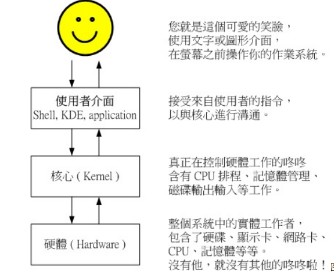

#### shell是一种壳程序

> 壳程序，只要能够操作应用程序的接口都能够称为壳程序，
>
> 狭义的壳程序指的是命令 行方面的软件，包括本章要介绍的 bash 等
>
> 广义的壳程序则包括图形接口的软件！因为图 形接口其实也能够操作各种应用程序来调用核心工作啊

#### 为什么要学习shell？

1. 命令行shell对不同的distribution基本相同，可以轻轻松松在各distribution转换，一法通万法通
2. 命令行最快，可以让你更好更深入的linux
3. 实现系统管理等其他复杂任务。

#### 系统的合法shell和/etc/shells功能

**有多种shell，而不是只有一个shell！**，

>由于早年的 Unix 年代，发展者众， 所以由于 shell 依据发展者的不同就有许多的版本，例如常听到的 Bourne SHell （sh） 、在 Sun 里头默认的 C SHell、 商业上常用的 K SHell、, 还有 TCSH 等等，每一种 Shell 都各有 其特点。至于 Linux 使用的这一种版本就称为“ Bourne Again SHell （简称 bash） ”，这个 Shell 是 Bourne Shell 的增强版本，也是基准于 GNU 的架构下发展出来的呦！

说说shell的简单历史：

1. 第一个流行的是由 Steven Bourne 发展出来的，为了纪念他所以就称为 Bourne shell ，或直接简称为 sh
2. 而后 来另一个广为流传的 shell 是由柏克莱大学的 Bill Joy 设计依附于 BSD 版的 Unix 系统中的 shell ，这个 shell 的语法有点类似 C 语言，所以才得名为 C shell ，简称为 csh 

那么目前我们的 Linux （以 CentOS 7.x 为例） 有多少我们可以使用的 shells 呢？ 你可以检 查一下 /etc/shells 这个文件，至少就有下面这几个可以用的 shells。

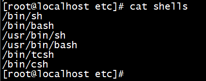


```bash
[root@localhost etc]# cat shells
/bin/sh   ---已经被bash取代
/bin/bash  ---linux默认的shell
/usr/bin/sh  ---
/usr/bin/bash  ---
/bin/tcsh  ---整合 C Shell ，提供更多的功能
/bin/csh   ---已经被 /bin/tcsh 所取代
```

虽然各家 shell 的功能都差不多，但是在某些语法的下达方面则有所不同，因此建议你还是得 要选择某一种 shell 来熟悉一下较佳。为什么我们系统上合法的 shell 要写入 /etc/shells 这个文 件啊？ 这是因为系统某些服务在运行过程中，会去检查使用者能够使用的 shells ，而这些 shell 的查询就是借由 /etc/shells 这个文件啰。

举例来说，某些 FTP 网站会去检查使用者的可用 shell ，而如果你不想要让这些使用者使用 FTP 以外的主机资源时，可能会给予该使用者一些怪怪的 shell，让使用者无法以其他服务登 陆主机。 这个时候，你就得将那些怪怪的 shell 写到 /etc/shells 当中了。举例来说，我们的 CentOS 7.x 的 /etc/shells 里头就有个 /sbin/nologin 文件的存在，这个就是我们说的怪怪的 shell 啰～。

总结：**通过指定shell可以限制资源的访问，这些shell统一要放到/etc/shells这个文件进行记录**。

#### 登录者的shell

我们在登录linux系统时，，默认会以某一个shell运行以这个身份输入的命令，那么这个shell是哪个呢？前面我们已经知道只要你以某个用户进行了登录，系统就会给我们一个shell进行工作。这个shell就记录在**/etc/passwd**这个文件里。

```bash
[dmtsai@study ~]$ cat /etc/passwd
root:x:0:0:root:/root:/bin/bash
bin:x:1:1:bin:/bin:/sbin/nologin
daemon:x:2:2:daemon:/sbin:/sbin/nologin
.....（下面省略）.....
```

这里就能看到像系统账号bin和daemon，就使用了特殊的shell。

#### bash shell功能

再来看看bash这个shell的功能

既然 /bin/bash 是 Linux 默认的 shell ，那么总是得了解一下这个玩意儿吧！bash 是 GNU 计 划中重要的工具软件之一，目前也是 Linux distributions 的标准 shell 。 bash 主要相容于 sh ，并且依据一些使用者需求而加强的 shell 版本。不论你使用的是那个 distribution ，你都难 逃需要学习 bash 的宿命啦！那么这个 shell 有什么好处，干嘛 Linux 要使用他作为默认的 shell 呢？ bash 主要的优点有下面几个：

1. 命令编修能力

   也就是记忆功能，在有的distribution里面，记住的命令可以高达1000以上。

   这些指令放在主文件夹内的.bash_history啦，不过注意，~/.bash_history记忆的是你前一次登录以前执行过的命令，而这一次登录执行的命令是暂存在内存里的，当你成功登出系统，这些指令才会写入到.bash_history.

2. 命令和文件补全功能

   还记得命令行后【tab】键吗？这个按键的功能 就是在 bash 里头才有的啦！常常在 bash 环境中使用 [tab] 是个很棒的习惯喔！因为至少可 以让你 1）少打很多字； 2）确定输入的数据是正确的！ 使用 [tab] 按键的时机依据 [tab] 接 在指令后或参数后而有所不同。复习一下：

   [Tab] 接在一串指令的第一个字的后面，则为命令补全； 

   [Tab] 接在一串指令的第二个字以后时，则为“文件补齐”！ 

   若安装 bash-completion 软件，则在某些指令后面使用 [tab] 按键时，可以进行“选项/参 数的补齐”功能！

3. 命令别名设置功能（alias）

   假如我需要知道这个目录下面的所有文件 （包含隐藏文件） 及所有的文件属性，那么我就必 须要下达“ ls -al ”这样的指令串，唉！真麻烦，有没有更快的取代方式？呵呵！就使用命令别 名呀！例如鸟哥最喜欢直接以 lm 这个自订的命令来取代上面的命令，也就是说， lm 会等于 ls -al 这样的一个功能，嘿！那么要如何作呢？就使用 alias 即可！你可以在命令行输入 alias 就可以知道目前的命令别名有哪些了！也可以直接下达命令来设置别名呦。

   ```bash
   alias lm='ls -al'
   ```

4. 工作控制、前景、背景控制（job control，foreground，background）

   使用前、背景的控制可以让工作进行的更 为顺利！至于工作控制（jobs）的用途则更广， 可以让我们随时将工作丢到背景中执行！而 不怕不小心使用了 [Ctrl] + c 来停掉该程序

5. shell script

   脚本余元

#### 指令的下达和快速编辑按钮

```bash
// 范例：如果指令串太长的话，如何使用两行来输出？
// 下面的指令是将三个文件复制到root这个目录，由于太长，使用"\[enter]"来换行，注意\和[enter]一定是中间没有空格的，\只跳脱紧挨
// 者的下一个字符。
[dmtsai@study ~]$ cp /var/spool/mail/root /etc/crontab \
&gt; /etc/fstab /root
```

另外，当命令行输入错误，想删除掉光标处之前后之后，或者想把光标移到开始和结尾的时候，是由快捷键按的。

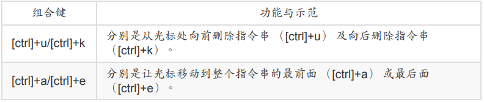


### shell的变量功能

变量，这里不解释，变量有如下几个好处

1. 通用的好处，有了变量，维护（特别是修改）将变得方便，

2. 某些变量会影响bash的操作环境

   比如，PATH这个变量，如果一个可执行命令或文件不在PATH变量指定的路径里面，就会报command not found的错误。当你在bash里面下达一个指令时，bash会根据PATH做指定的路径顺序来查找的。为了区分和自定义变量的不同，这些环境变量一般以大写字符来表示。

3. shell scripts中需要大量运用变量，不解释

如何显示一个变量的内容呢?    echo

#### 变量的取用和设置：echo，变量设置规则：unset

**使用echo来取用变量**，比如：

```bash
[dmtsai@study ~]$ echo $variable
[dmtsai@study ~]$ echo $PATH
/usr/local/bin:/usr/bin:/usr/local/sbin:/usr/sbin:/home/dmtsai/.local/bin:/home/dmtsai/bin
[dmtsai@study ~]$ echo ${PATH} # 近年来，鸟哥比较偏向使用这种格式喔！
// 变量的取用一定要加$，或者使用${}
```

**使用=来设置变量**，比如：

```bash
[dmtsai@study ~]$ echo ${myname}
&lt;==这里并没有任何数据～因为这个变量尚未被设置！是空的！
[dmtsai@study ~]$ myname=fengxueyong
[dmtsai@study ~]$ echo ${myname}
VBird &lt;==出现了！因为这个变量已经被设置了！
```

> 注意，每一种 shell 的语法都不相同～在变量的使用上，bash 在你没有 设置的变量中强迫去 echo 时，它会显示出空的值。 在其他某些 shell 中，随便去 echo 一个 不存在的变量，它是会出现错误讯息的喔！要注意！要注意

**变量规则**

1. 变量与变量内容以一个等号“=”来链接，如下所示： “myname=VBird”,等号两边不能直接接空白字符

2. 变量名称只能是英文字母与数字，但是开头字符不能是数字，如下为错误： “2myname=VBird”

3. 变量内容若有空白字符可使用双引号“"”或单引号“'”将变量内容结合起来

4. 双引号内的特殊字符如 $ 等，可以保有原本的特性，如下所示： “var="lang is $LANG"”则“echo $var”可得“lang is zh_TW.UTF-8”

5. 单引号内的特殊字符则仅为一般字符 （纯文本），如下所示： “var='lang is $LANG'”则“echo $var”可得“lang is $LANG”

6. 可用跳脱字符“ \ ”将特殊符号（如 [Enter], $, \, 空白字符, '等）变成一般字符，如： “myname=VBird\ Tsai”， 比如：

   ```bash
   [root@localhost ~]# myname=feng xueyong
   bash: xueyong: command not found...
   [root@localhost ~]# myname=feng\ xueyong
   [root@localhost ~]# echo $myname
   feng xueyong
   ```

7. 在一串指令的执行中，还需要借由其他额外的指令所提供的信息时，可以使用反单引 号“ 指令 ”或 “$（指令）”。特别注意，那个 ` 是键盘上方的数字键 1 左边那个按键，而不 是单引号，比如：

   ```bash
   [root@localhost ~]# version=$(uname -r)
   [root@localhost ~]# echo $version
   3.10.0-1160.el7.x86_64
   [root@localhost ~]# version2=`uname -r`
   [root@localhost ~]# echo $version2
   3.10.0-1160.el7.x86_64
   ```

8. 若该变量为扩增变量内容时，则可用 "$变量名称" 或 ${变量} 累加内容，比如：如下所示： “PATH="$PATH":/home/bin”或“PATH=${PATH}:/home/bin”

9. 若该变量需要在其他子程序执行，则需要以 export 来使变量变成环境变量： “export PATH”

   什么是“子程序”呢？就是说，在我目前这个 shell 的情况下，去启用另一个新的 shell ，新的那 个 shell 就是子程序啦！在一般的状态下，父程序的自订变量是无法在子程序内使用的。但是 通过 export 将变量变成环境变量后，就能够在子程序下面应用了！

10. 取消变量的方法为使用 unset ：“unset 变量名称”例如取消 myname 的设置： “unset myname”

    

    下面为总结：
    
    1. $(命令)或\`命令`可以作为外部的输入。比如
    
       ```bash
       [root@localhost ~]# A=`uname -r`
       [root@localhost ~]# echo $A
       3.10.0-1160.el7.x86_64
       [root@localhost ~]# A=$(uname -r)
       [root@localhost ~]# echo $A
       3.10.0-1160.el7.x86_64
       ```
    
    2. 如果要让变量的值保持$原有的特性，用双引号，如果单纯作为字符，就用单引号
    
    3. 用"$变量名称"或${变量}累加内容。
    
    4. 如果变量的值包含空格，使用单引号或双引号括起来，注意单引号和双引号的不同。

#### 环境变量的功能

##### 用env观察常见变量以及常见变量说明

```bash
[fengxueyong@localhost ~]$ env
XDG_SESSION_ID=6
HOSTNAME=localhost.localdomain
SHELL=/bin/bash
TERM=xterm-256color
HISTSIZE=1000
OLDPWD=/opt
USER=fengxueyong
LS_COLORS=rs=0:di=38;5;27:ln=38;5;51:mh=44;38;5;15:pi=40;38;5;11:so=38;5;13:do=38;5;5:bd=48;5;232;38;5;11:cd=48;5;232;38;5;3:or=48;5;232;38;5;9:mi=05;48;5;232;38;5;15:su=48;5;196;38;5;15:sg=48;5;11;38;5;16:ca=48;5;196;38;5;226:tw=48;5;10;38;5;16:ow=48;5;10;38;5;21:st=48;5;21;38;5;15:ex=38;5;34:*.tar=38;5;9:*.tgz=38;5;9:*.arc=38;5;9:*.arj=38;5;9:*.taz=38;5;9:*.lha=38;5;9:*.lz4=38;5;9:*.lzh=38;5;9:*.lzma=38;5;9:*.tlz=38;5;9:*.txz=38;5;9:*.tzo=38;5;9:*.t7z=38;5;9:*.zip=38;5;9:*.z=38;5;9:*.Z=38;5;9:*.dz=38;5;9:*.gz=38;5;9:*.lrz=38;5;9:*.lz=38;5;9:*.lzo=38;5;9:*.xz=38;5;9:*.bz2=38;5;9:*.bz=38;5;9:*.tbz=38;5;9:*.tbz2=38;5;9:*.tz=38;5;9:*.deb=38;5;9:*.rpm=38;5;9:*.jar=38;5;9:*.war=38;5;9:*.ear=38;5;9:*.sar=38;5;9:*.rar=38;5;9:*.alz=38;5;9:*.ace=38;5;9:*.zoo=38;5;9:*.cpio=38;5;9:*.7z=38;5;9:*.rz=38;5;9:*.cab=38;5;9:*.jpg=38;5;13:*.jpeg=38;5;13:*.gif=38;5;13:*.bmp=38;5;13:*.pbm=38;5;13:*.pgm=38;5;13:*.ppm=38;5;13:*.tga=38;5;13:*.xbm=38;5;13:*.xpm=38;5;13:*.tif=38;5;13:*.tiff=38;5;13:*.png=38;5;13:*.svg=38;5;13:*.svgz=38;5;13:*.mng=38;5;13:*.pcx=38;5;13:*.mov=38;5;13:*.mpg=38;5;13:*.mpeg=38;5;13:*.m2v=38;5;13:*.mkv=38;5;13:*.webm=38;5;13:*.ogm=38;5;13:*.mp4=38;5;13:*.m4v=38;5;13:*.mp4v=38;5;13:*.vob=38;5;13:*.qt=38;5;13:*.nuv=38;5;13:*.wmv=38;5;13:*.asf=38;5;13:*.rm=38;5;13:*.rmvb=38;5;13:*.flc=38;5;13:*.avi=38;5;13:*.fli=38;5;13:*.flv=38;5;13:*.gl=38;5;13:*.dl=38;5;13:*.xcf=38;5;13:*.xwd=38;5;13:*.yuv=38;5;13:*.cgm=38;5;13:*.emf=38;5;13:*.axv=38;5;13:*.anx=38;5;13:*.ogv=38;5;13:*.ogx=38;5;13:*.aac=38;5;45:*.au=38;5;45:*.flac=38;5;45:*.mid=38;5;45:*.midi=38;5;45:*.mka=38;5;45:*.mp3=38;5;45:*.mpc=38;5;45:*.ogg=38;5;45:*.ra=38;5;45:*.wav=38;5;45:*.axa=38;5;45:*.oga=38;5;45:*.spx=38;5;45:*.xspf=38;5;45:
MAIL=/var/spool/mail/fengxueyong
PATH=/usr/local/bin:/bin:/usr/bin:/usr/local/sbin:/usr/sbin:/home/fengxueyong/.local/bin:/home/fengxueyong/bin
PWD=/home/fengxueyong
LANG=en_US.UTF-8
HISTCONTROL=ignoredups
SHLVL=1
HOME=/home/fengxueyong
LOGNAME=fengxueyong
XDG_DATA_DIRS=/home/fengxueyong/.local/share/flatpak/exports/share:/var/lib/flatpak/exports/share:/usr/local/share:/usr/share
LESSOPEN=||/usr/bin/lesspipe.sh %s
_=/bin/env
```

env就是环境变量的意思，export也会输出类似的东西，但是export有额外的功能。

对一些常用的变量做个解释。

-  HOME，使用者的主文件夹，有很多程序可能会用到这个值
- SHELL，告诉我们目前这个环境用的是哪个shell，linux默认是/bin/bash
- PATH，可执行文件搜索的路径，多个路径之间用：号分割，文件的搜索是依据PATH变量内的目录来查询，，所以目录的顺序很重要。
- LANG，就是语系数据，这个也很重要。
- RANDOW，随机乱数，这里不进行螯述

##### set观察所有变量

一般来说，不论是否为环境变量，只要跟我们目前这个shell的操作接口有关的变量，通常都会被设置为大写字符，也就是说，基本上，在linux默认的情况下，使用{大写的字母}来设置的变量一般为系统内定需要的变量。那么我们来看看，有哪些比较重要的。

- PS1：提示字符的设置。

  这个东西就是“命令提示字符”哦，当我们每次按下【enter】时，最后要再次出现提示字符时，就会主动去读取这个变量值了。set中PS1显示的时一些特殊符号，

  ```bash
  [fengxueyong@localhost ~]$ set | grep PS1
  PS1='[\u@\h \W]\$ '
  // \u表示使用者的账号， \h表示主机名称在第一个小数点之前的名字， \W目录名，$表示提示字符，如果是root就是#，否则就是$
  ```

  这些符号的含义可以参看下面的说明：

  ```
  \d ：可显示出“星期 月 日”的日期格式，如："Mon Feb 2"
  \H ：完整的主机名称。举例来说，鸟哥的练习机为“study.centos.vbird”
  \h ：仅取主机名称在第一个小数点之前的名字，如鸟哥主机则为“study”后面省略
  \t ：显示时间，为 24 小时格式的“HH:MM:SS”
  \T ：显示时间，为 12 小时格式的“HH:MM:SS”
  \A ：显示时间，为 24 小时格式的“HH:MM”
  \@ ：显示时间，为 12 小时格式的“am/pm”样式
  \u ：目前使用者的帐号名称，如“dmtsai”；
  \v ：BASH 的版本信息，如鸟哥的测试主机版本为 4.2.46（1）-release，仅取“4.2”显示
  \w ：完整的工作目录名称，由根目录写起的目录名称。但主文件夹会以 ~ 取代；
  \W ：利用 basename 函数取得工作目录名称，所以仅会列出最后一个目录名。
  # ：下达的第几个指令。
  $ ：提示字符，如果是 root 时，提示字符为 # ，否则就是 $ 啰～
  ```

  好，你现在已经知道每次命令执行之后的提示信息为什么是那个样子了吧。知道这个之后，我们就可以通过修改PS1的值来达到来定制我们的命令提示符。

- $：（关于本shell的ID）

  钱字号本身也是个变量喔！这个咚咚代表的是“目前这个 Shell 的线程代号”，亦即是所谓的 PID （Process ID）。 更多的程序观念，我们会在第四篇的时候提及。想要知道我们的 shell 的 PID ，就可以用：“ echo $$ ”即可！出现的数字就是你的 PID 号码。

  ```bash
  [fengxueyong@localhost ~]$ echo $$
  5263
  [fengxueyong@localhost ~]$ ps 
     PID TTY          TIME CMD
    5263 pts/1    00:00:00 bash
    8337 pts/1    00:00:00 ps
  ```

- ？：（关于上个执行指令的回传值）

  问号也是一个特殊的变量？没错！在 bash 里面这个变量可重要的很！ 这个变量 是：“上一个执行的指令所回传的值”， 上面这句话的重点是“上一个指令”与“回传值”两个地 方。当我们执行某些指令时， 这些指令都会回传一个执行后的代码。一般来说，如果成功的 执行该指令， 则会回传一个 0 值，如果执行过程发生错误，就会回传“错误代码”才对！一般 就是以非为 0 的数值来取代。

  ```bash
  [dmtsai@study ~]$ echo $SHELL
  /bin/bash &lt;==可顺利显示！没有错误！
  [dmtsai@study ~]$ echo $?
  0 &lt;==因为没问题，所以回传值为 0
  [dmtsai@study ~]$ 12name=VBird
  bash: 12name=VBird: command not found... &lt;==发生错误了！bash回报有问题
  [dmtsai@study ~]$ echo $?
  127 &lt;==因为有问题，回传错误代码（非为0）
  # 错误代码回传值依据软件而有不同，我们可以利用这个代码来搜寻错误的原因喔！
  [dmtsai@study ~]$ echo $?
  0
  # 咦！怎么又变成正确了？这是因为 "?" 只与“上一个执行指令”有关，
  # 所以，我们上一个指令是执行“ echo $? ”，当然没有错误，所以是 0 没错！
  ```

  而且，shell脚本中经常大量使用这个$?值，比如：

  ```shell
  if [[ $? == 0 ]]; then    // 这个就表示如果前面执行命令的结果正常返回的话。
      ......
  fi
  ```

##### export：自定义变量转环境变量

谈了 env 与 set 现在知道有所谓的环境变量与自订变量，那么这两者之间有啥差异呢？其实 这两者的差异在于“ 该变量是否会被子程序所继续引用”啦。

当你登陆 Linux 并取得一个 bash 之后，你的 bash 就是一个独立的程序，这个程序的识别使 用的是一个称为程序识别码，被称为 PID 的就是。 **接下来你在这个 bash 下面所下达的任何 指令都是由这个 bash 所衍生出来的，那些被下达的指令就被称为子程序了**

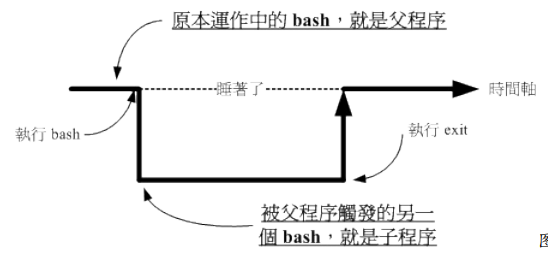

如上所示，我们在原本的 bash 下面执行另一个 bash ，结果操作的环境接口会跑到第二个 bash 去（就是子程序）， 那原本的 bash 就会在暂停的情况 （睡着了，就是 sleep）。整个 指令运行的环境是实线的部分！若要回到原本的 bash 去， 就只有将第二个 bash 结束掉 （下达 exit 或 logout） 才行。

这个程序概念与变量有啥关系啊？关系可大了！因为子程序仅会继承父程序的环境变量， 子 程序不会继承父程序的自订变量啦！所以你在原本 bash 的自订变量在进入了子程序后就会消 失不见， 一直到你离开子程序并回到原本的父程序后，这个变量才会又出现！ 换个角度来想，也就是说，如果我能将自订变量变成环境变量的话，那不就可以让该变量值 继续存在于子程序了？ 呵呵！没错！此时，那个 export 指令就很有用啦！如你想要让该变量 内容继续的在子程序中使用，那么就请执行：

```bash
[dmtsai@study ~]$ export 变量名称
```

这东西用在“分享自己的变量设置给后来调用的文件或其他程序”啦！ 像鸟哥常常在自己的主 文件后面调用其他附属文件（类似函数的功能），但是主文件与附属文件内都有相同的变量 名称， 若一再重复设置时，要修改也很麻烦，此时只要在原本的第一个文件内设置好“ export 变量 ”， 后面所调用的文件就能够使用这个变量设置了！而不需要重复设置，这非常实用于 shell script 当中喔。

如果是仅仅下达export，那就会显示所有的“环境变量”

#### 变量的有效范围

自定义变量只能当前程序有用（比如bash），当使用export后，这个变量就可以被子程序使用，也可以成为“环境变量”，环境变量可以被子程序使用。

有些书会用全局变量和区域变量还区分，大体上：

环境变量=全局变量，      自定义变量=区域变量。

为什么环境变量能被子程序使用，是因为：

1. 当启动一个 shell，操作系统会分配一记忆区块给 shell 使用，此内存内之变量可让子程 序取用
2. 若在父程序利用 export 功能，可以让自订变量的内容写到上述的记忆区块当中（环境变 量）；
3. 当载入另一个 shell 时 （亦即启动子程序，而离开原本的父程序了），子 shell 可以将父 shell 的环境变量所在的记忆区块导入自己的环境变量区块当中


#### 变量键盘读取、阵列和宣告：array，read，declare

##### read

read就是要读取使用者的键盘输入，	和经常看到的一些命令需要用户输入yes/no一样的形式。以此来达到和用户交互的目的。这种经常在shell script中使用

```bash
[dmtsai@study ~]$ read [-pt] variable
选项与参数：
-p ：后面可以接提示字符！
-t ：后面可以接等待的“秒数！”这个比较有趣～不会一直等待使用者啦！
范例一：让使用者由键盘输入一内容，将该内容变成名为 atest 的变量
[dmtsai@study ~]$ read atest
This is a test &lt;==此时光标会等待你输入！请输入左侧文字看看
[dmtsai@study ~]$ echo ${atest}
This is a test &lt;==你刚刚输入的数据已经变成一个变量内容！
范例二：提示使用者 30 秒内输入自己的大名，将该输入字串作为名为 named 的变量内容
[dmtsai@study ~]$ read -p "Please keyin your name: " -t 30 named
Please keyin your name: VBird Tsai &lt;==注意看，会有提示字符喔！
[dmtsai@study ~]$ echo ${named}
VBird Tsai &lt;==输入的数据又变成一个变量的内容了！
```

##### declare

宣告变量的类型，

```bash
[dmtsai@study ~]$ declare [-aixr] variable
选项与参数：
-a ：将后面名为 variable 的变量定义成为阵列 （array） 类型
-i ：将后面名为 variable 的变量定义成为整数数字 （integer） 类型
-x ：用法与 export 一样，就是将后面的 variable 变成环境变量；
-r ：将变量设置成为 readonly 类型，该变量不可被更改内容，也不能 unset
范例一：让变量 sum 进行 100+300+50 的加总结果
[dmtsai@study ~]$ sum=100+300+50
[dmtsai@study ~]$ echo ${sum}
100+300+50 &lt;==咦！怎么没有帮我计算加总？因为这是文字体态的变量属性啊！
[dmtsai@study ~]$ declare -i sum=100+300+50
[dmtsai@study ~]$ echo ${sum}
450 &lt;==瞭乎？？
```

由于在默认的情况下面， bash 对于变量有几个基本的定义： 

1. 变量类型默认为“字串”，所以若不指定变量类型，则 1+2 为一个“字串”而不是“计算式”。 所以上述第一个执行的结果才会出现那个情况的； 
2. bash 环境中的数值运算，默认最多仅能到达整数形态，所以 1/3 结果是 0；

现在你晓得为啥你需要进行变量宣告了吧？如果需要非字串类型的变量，那就得要进行变量 的宣告才行啦

```bash
范例二：将 sum 变成环境变量
[dmtsai@study ~]$ declare -x sum
[dmtsai@study ~]$ export &#124; grep sum
declare -ix sum="450" &lt;==果然出现了！包括有 i 与 x 的宣告！
范例三：让 sum 变成只读属性，不可更动！
[dmtsai@study ~]$ declare -r sum
[dmtsai@study ~]$ sum=tesgting
-bash: sum: readonly variable &lt;==老天爷～不能改这个变量了！
范例四：让 sum 变成非环境变量的自订变量吧！
[dmtsai@study ~]$ declare +x sum &lt;== 将 - 变成 + 可以进行“取消”动作
[dmtsai@study ~]$ declare -p sum &lt;== -p 可以单独列出变量的类型
declare -ir sum="450" &lt;== 看吧！只剩下 i, r 的类型，不具有 x 啰！
```


##### 阵列变量类型

也就是数组，在 bash 里头，阵列的设置方式是：

```
var[index]=content
```

意思是说，我有一个阵列名称为 var ，而这个阵列的内容为 var[1]=小明， var[2]=大明， var[3]=好明 .... 等等，那个 index 就是一些数字啦，重点是用中刮号 （[ ]） 来设置的。 目前 我们 bash 提供的是一维阵列。老实说，如果您不必写一些复杂的程序， 那么这个阵列的地 方，可以先略过，等到有需要再来学习即可！因为要制作出阵列， 通常与循环或者其他判断 式交互使用才有比较高的存在意义！

```bash
范例：设置上面提到的 var[1] ～ var[3] 的变量。
[dmtsai@study ~]$ var[1]="small min"
[dmtsai@study ~]$ var[2]="big min"
[dmtsai@study ~]$ var[3]="nice min"
[dmtsai@study ~]$ echo "${var[1]}, ${var[2]}, ${var[3]}"
small min, big min, nice min
```

阵列的变量类型比较有趣的地方在于“读取”，一般来说，建议直接以 ${阵列} 的方式来读取， 比较正确无误的啦！这也是为啥鸟哥一开始就建议你使用 ${变量} 来记忆的原因

##### 与文件系统和程序的限制关系：ulimit

想像一个状况：我的 Linux 主机里面同时登陆了十个人，这十个人不知怎么搞的， 同时打开 了 100 个文件，每个文件的大小约 10MBytes ，请问一下， 我的 Linux 主机的内存要有多大 才够？ 1010010 = 10000 MBytes = 10GBytes ... 老天爷，这样，系统不挂点才有鬼哩！为了 要预防这个情况的发生，所以我们的 bash 是可以“限制使用者的某些系统资源”的，包括可以 打开的文件数量， 可以使用的 CPU 时间，可以使用的内存总量等等。如何设置？用 ulimit 吧！

```bash
[dmtsai@study ~]$ ulimit [-SHacdfltu] [配额]
选项与参数：
-H ：hard limit ，严格的设置，必定不能超过这个设置的数值；
-S ：soft limit ，警告的设置，可以超过这个设置值，但是若超过则有警告讯息。
在设置上，通常 soft 会比 hard 小，举例来说，soft 可设置为 80 而 hard
设置为 100，那么你可以使用到 90 （因为没有超过 100），但介于 80~100 之间时，
系统会有警告讯息通知你！
-a ：后面不接任何选项与参数，可列出所有的限制额度；
-c ：当某些程序发生错误时，系统可能会将该程序在内存中的信息写成文件（除错用），
这种文件就被称为核心文件（core file）。此为限制每个核心文件的最大容量。
-f ：此 shell 可以创建的最大文件大小（一般可能设置为 2GB）单位为 KBytes
-d ：程序可使用的最大断裂内存（segment）容量；
-l ：可用于锁定 （lock） 的内存量
-t ：可使用的最大 CPU 时间 （单位为秒）
-u ：单一使用者可以使用的最大程序（process）数量。
范例一：列出你目前身份（假设为一般帐号）的所有限制数据数值
[dmtsai@study ~]$ ulimit -a
core file size （blocks, -c） 0 &lt;==只要是 0 就代表没限制
data seg size （kBytes, -d） unlimited
scheduling priority （-e） 0
file size （blocks, -f） unlimited &lt;==可创建的单一文件的大小
pending signals （-i） 4903
max locked memory （kBytes, -l） 64
max memory size （kBytes, -m） unlimited
open files （-n） 1024 &lt;==同时可打开的文件数量
pipe size （512 Bytes, -p） 8
POSIX message queues （Bytes, -q） 819200
real-time priority （-r） 0
stack size （kBytes, -s） 8192
cpu time （seconds, -t） unlimited
max user processes （-u） 4096
virtual memory （kBytes, -v） unlimited
file locks （-x） unlimited
范例二：限制使用者仅能创建 10MBytes 以下的容量的文件
[dmtsai@study ~]$ ulimit -f 10240
[dmtsai@study ~]$ ulimit -a &#124; grep 'file size'
core file size （blocks, -c） 0
file size （blocks, -f） 10240 &lt;==最大量为10240Kbyes，相当10MBytes
[dmtsai@study ~]$ dd if=/dev/zero of=123 bs=1M count=20
File size limit exceeded （core dumped） &lt;==尝试创建 20MB 的文件，结果失败了！
[dmtsai@study ~]$ rm 123 &lt;==赶快将这个文件删除啰！同时你得要登出再次的登陆才能解开 10M 的限制
```

还记得我们在第七章 Linux 磁盘文件系统里面提到过，单一 filesystem 能够支持的单一文件 大小与 block 的大小有关。但是文件系统的限制容量都允许的太大了！如果想要让使用者创建 的文件不要太大时， 我们是可以考虑用 ulimit 来限制使用者可以创建的文件大小喔！利用 ulimit -f 就可以来设置了！例如上面的范例二，要注意单位喔！单位是 KBytes。 若改天你一 直无法创建一个大容量的文件，记得瞧一瞧 ulimit 的信息喔

Tips 想要复原 ulimit 的设置最简单的方法就是登出再登陆，否则就是得要重新以 ulimit 设置 才行！ 不过，要注意的是，一般身份使用者如果以 ulimit 设置了 -f 的文件大小， 那么他“只 能继续减小文件大小，不能增加文件大小喔！”另外，若想要管控使用者的 ulimit 限值， 可以 参考第十三章的 pam 的介绍。

#### 变量内容的删除、取代和替换

##### 内容的删除和取代

```bash
范例一：先让小写的 path 自订变量设置的与 PATH 内容相同
[dmtsai@study ~]$ path=${PATH}
[dmtsai@study ~]$ echo ${path}
/usr/local/bin:/usr/bin:/usr/local/sbin:/usr/sbin:/home/dmtsai/.local/bin:/home/dmtsai/bin
范例二：假设我不喜欢 local/bin，所以要将前 1 个目录删除掉，如何显示？
[dmtsai@study ~]$ echo ${path#/*local/bin:}
/usr/bin:/usr/local/sbin:/usr/sbin:/home/dmtsai/.local/bin:/home/dmtsai/bin
// 删除了，怎么实现的？
```

上面这个范例很有趣的！他的重点可以用下面这张表格来说明

```text
${variable#/*local/bin:}
上面的特殊字体部分是关键字！用在这种删除模式所必须存在的
${variable#/*local/bin:}
这就是原本的变量名称，以上面范例二来说，这里就填写 path 这个“变量名称”啦！
${variable#/*local/bin:}
这是重点！代表“从变量内容的最前面开始向右删除”，且仅删除最短的那个
${variable#/*local/bin:}
代表要被删除的部分，由于 # 代表由前面开始删除，所以这里便由开始的 / 写起。
需要注意的是，我们还可以通过万用字符 * 来取代 0 到无穷多个任意字符
以上面范例二的结果来看， path 这个变量被删除的内容如下所示：
/usr/local/bin:/usr/bin:/usr/local/sbin:/usr/sbin:/home/dmtsai/.local/bin:/home/dmtsai/bi
```

。。。。。。【未细看】

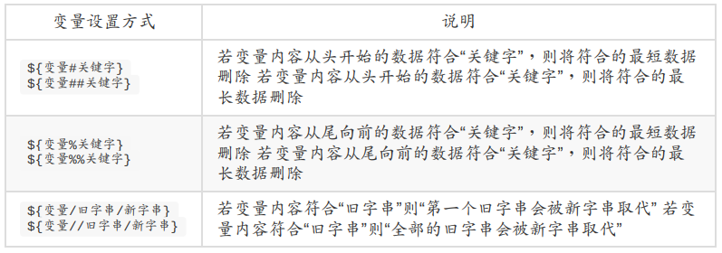

上面的为一些变量的设置方法的总结。具体可以再详细查询相关资料。


###  命令别名和历史命令

#### 别名命名：alias， unalias

```bash
[dmtsai@study ~]$ alias rm='rm -i'
// 给rm -i设置别名，后面再输入rm的时候实际上就是执行rm -i的意思
[dmtsai@study ~]$ unalias lm
// 如果先前给起了别名，那么这个就是取消lm这个别名。
[dmtsai@study ~]$ alias
alias egrep='egrep --color=auto'
alias fgrep='fgrep --color=auto'
alias grep='grep --color=auto'
alias l.='ls -d .* --color=auto'
alias ll='ls -l --color=auto'
alias lm='ls -al &#124; more'
alias ls='ls --color=auto'
alias rm='rm -i'
alias vi='vim'
// 列出bash的所有别名。
```

实际上，就是方便

#### 历史命令

```bash
[dmtsai@study ~]$ history [n]
[dmtsai@study ~]$ history [-c]
[dmtsai@study ~]$ history [-raw] histfiles
选项与参数：
n ：数字，意思是“要列出最近的 n 笔命令列表”的意思！
-c ：将目前的 shell 中的所有 history 内容全部消除
-a ：将目前新增的 history 指令新增入 histfiles 中，若没有加 histfiles ，
则默认写入 ~/.bash_history
-r ：将 histfiles 的内容读到目前这个 shell 的 history 记忆中；
-w ：将目前的 history 记忆内容写入 histfiles 中！
范例一：列出目前内存内的所有 history 记忆
[dmtsai@study ~]$ history
# 前面省略
1017 man bash
1018 ll
1019 history
1020 history
# 列出的信息当中，共分两栏，第一栏为该指令在这个 shell 当中的代码，
# 另一个则是指令本身的内容喔！至于会秀出几笔指令记录，则与 HISTSIZE 有关！
范例二：列出目前最近的 3 笔数据
[dmtsai@study ~]$ history 3
1019 history
1020 history
1021 history 3
范例三：立刻将目前的数据写入 histfile 当中
[dmtsai@study ~]$ history -w
# 在默认的情况下，会将历史纪录写入 ~/.bash_history 当中！
[dmtsai@study ~]$ echo ${HISTSIZE}
1000

```

在正常的情况下，历史命令的读取与记录是这样的：

1. 当我们以 bash 登陆 Linux 主机之后，系统会主动的由主文件夹的 ~/.bash_history 读取 以前曾经下过的指令，那么 ~/.bash_history 会记录几笔数据呢？这就与你 bash 的 HISTFILESIZE 这个变量设置值有关了！ 
2. 假设我这次登陆主机后，共下达过 100 次指令，“等我登出时， 系统就会将 101~1100 这 总共 1000 笔历史命令更新到 ~/.bash_history 当中。” 也就是说，历史命令在我登出时， 会将最近的 HISTFILESIZE 笔记录到我的纪录档当中啦！ 
3. 当然，也可以用 history -w 强制立刻写入的！那为何用“更新”两个字呢？ 因为 ~/.bash_history 记录的笔数永远都是 HISTFILESIZE 那么多，旧的讯息会被主动的拿 掉！ 仅保留最新的！

那么 history 这个历史命令只可以让我查询命令而已吗？呵呵！当然不止啊！ 我们可以利用相 关的功能来帮我们执行命令呢！举例来说啰

```bash
[dmtsai@study ~]$ !number
[dmtsai@study ~]$ !command
[dmtsai@study ~]$ !!
选项与参数：
number ：执行第几笔指令的意思；
command ：由最近的指令向前搜寻“指令串开头为 command”的那个指令，并执行；
!! ：就是执行上一个指令（相当于按↑按键后，按 Enter）
[dmtsai@study ~]$ history
66 man rm
67 alias
68 man history
69 history
[dmtsai@study ~]$ !66 &lt;==执行第 66 笔指令
[dmtsai@study ~]$ !! &lt;==执行上一个指令，本例中亦即 !66
[dmtsai@study ~]$ !al &lt;==执行最近以 al 为开头的指令（上头列出的第 67 个）
```


### bash shell的操作环境

#### 路径和指令搜索顺序

。现在我们知道系统里面其实有不少的 ls 指令， 或者是包括内置的 echo 指令，那么来想一想，如果一个指令 （例如 ls） 被下达时， 到底是哪一个 ls 被拿来运 行？很有趣吧！基本上，指令运行的顺序可以这样看：

1. 以相对/绝对路径执行指令，例如“ /bin/ls ”或“ ./ls ”； 
2. 由 alias 找到该指令来执行； 
3. 由 bash 内置的 （builtin） 指令来执行； 
4. 通过 $PATH 这个变量的顺序搜寻到的第一个指令来执行。

举例来说，你可以下达 /bin/ls 及单纯的 ls 看看，会发现使用 ls 有颜色但是 /bin/ls 则没有颜 色。 因为 /bin/ls 是直接取用该指令来下达，而 ls 会因为“ alias ls='ls --color=auto' ”这个命令 别名而先使用！ 如果想要了解指令搜寻的顺序，其实通过 type -a ls 也可以查询的到啦！上述 的顺序最好先了解喔！

例题：设置 echo 的命令别名成为 echo -n ，然后再观察 echo 执行的顺序答：

```bash
[dmtsai@study ~]$ alias echo='echo -n'
[dmtsai@study ~]$ type -a echo
echo is aliased to `echo -n'
echo is a shell builtin
echo is /usr/bin/echo
```

瞧！很清楚吧！先 alias 再 builtin 再由 $PATH 找到 /bin/echo 啰


#### bash 的进站与欢迎讯息：/etc/issue, /etc/motd

虾密！ bash 也有进站画面与欢迎讯息喔？真假？真的啊！ 还记得在终端机接口 （tty1 ~ tty6） 登陆的时候，会有几行提示的字串吗？那就是进站画面啊！ 那个字串写在哪里啊？呵 呵！在 /etc/issue 里面啊！先来看看：

```bash
[dmtsai@study ~]$ cat /etc/issue
\S
Kernel \r on an \m
```

鸟哥是以完全未更新过的 CentOS 7.1 作为范例，里面默认有三行，较有趣的地方在于 \r 与 \m。 就如同 $PS1 这变量一样，issue 这个文件的内容也是可以使用反斜线作为变量取用 喔！你可以 man issue 配合 man agetty 得到下面的结果：

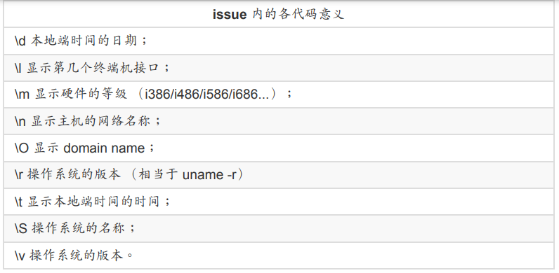


曾有鸟哥的学生在这个 /etc/issue 内修改数据，光是利用简单的英文字母作出属于他自己的进 站画面， 画面里面有他的中文名字呢！非常厉害！也有学生做成类似很大一个“囧”在进站画 面，都非常有趣！ 你要注意的是，除了 /etc/issue 之外还有个 /etc/issue.net 呢！这是啥？这个是提供给 telnet 这个远端登陆程序用的。 当我们使用 telnet 连接到主机时，主机的登陆画面就会显示 /etc/issue.net 而不是 /etc/issue 呢！

至于如果您想要让使用者登陆后取得一些讯息，例如您想要让大家都知道的讯息， 那么可以 将讯息加入 /etc/motd 里面去！例如：当登陆后，告诉登陆者， 系统将会在某个固定时间进 行维护工作，可以这样做 （一定要用 root 的身份才能修改喔！）

```bash
[root@study ~]# vim /etc/motd
Hello everyone,
Our server will be maintained at 2015/07/10 0:00 ~ 24:00.
Please don't login server at that time. ^_^
```

那么当你的使用者（包括所有的一般帐号与 root）登陆主机后，就会显示这样的讯息出来。

#### bash的环境配置文件

你是否会觉得奇怪，怎么我们什么动作都没有进行，但是一进入 bash 就取得一堆有用的变量 了？ 这是因为系统有一些环境设置文件的存在，让 bash 在启动时直接读取这些配置文件， 以规划好 bash 的操作环境啦！ 而这些配置文件又可以分为全体系统的配置文件以及使用者 个人偏好配置文件。要注意的是， 我们前几个小节谈到的命令别名啦、自订的变量啦，在你 登出 bash 后就会失效，所以你想要保留你的设置， 就得要将这些设置写入配置文件才行。 下面就让我们来聊聊吧

##### login与non-login shell

在开始介绍 bash 的配置文件前，我们一定要先知道的就是 login shell 与 non-login shell！ 重 点在于有没有登陆 （login） 啦！

1. login shell：取得 bash 时需要完整的登陆流程的，就称为 login shell。举例来说，你要由 tty1 ~ tty6 登陆，需要输入使用者的帐号与密码，此时取得的 bash 就称为“ login shell ”啰； 
2. non-login shell：取得 bash 接口的方法不需要重复登陆的举动，举例来说，（1）你以 X window 登陆 Linux 后， 再以 X 的图形化接口启动终端机，此时那个终端接口并没有需 要再次的输入帐号与密码，那个 bash 的环境就称为 non-login shell了。（2）你在原本 的 bash 环境下再次下达 bash 这个指令，同样的也没有输入帐号密码， 那第二个 bash （子程序） 也是 non-login shell 。

为什么要介绍 login, non-login shell 呢？这是因为这两个取得 bash 的情况中，读取的配置文 件数据并不一样所致。 由于我们需要登陆系统，所以先谈谈 login shell 会读取哪些配置文 件？一般来说，**login shell 其实只会读取这两个配置文件**：

1. /etc/profile：这是系统整体的设置，你最好不要修改这个文件；
2. ~/.bash_profile 或 ~/.bash_login 或 ~/.profile：属于使用者个人设置，你要改自己的数据，就写入这里。

那么，就让我们来聊一聊这两个文件吧！这两个文件的内容可是非常繁复的喔！

###### /etc/profile（login shell 才会读）

```shell
[root@localhost ~]# cat /etc/profile
# /etc/profile

# System wide environment and startup programs, for login setup
# Functions and aliases go in /etc/bashrc

# It's NOT a good idea to change this file unless you know what you
# are doing. It's much better to create a custom.sh shell script in
# /etc/profile.d/ to make custom changes to your environment, as this
# will prevent the need for merging in future updates.

# 对path的处理，会依据 UID 决定 PATH 变量要不要含有 sbin 的系统指令目录
pathmunge () {
    case ":${PATH}:" in
        *:"$1":*)
            ;;
        *)
            if [ "$2" = "after" ] ; then
                PATH=$PATH:$1
            else
                PATH=$1:$PATH
            fi
    esac
}

# MAIL：依据帐号设置好使用者的 mailbox 到 /var/spool/mail/帐号名
# USER：根据使用者的帐号设置此一变量内容；
if [ -x /usr/bin/id ]; then
    if [ -z "$EUID" ]; then
        # ksh workaround
        EUID=`/usr/bin/id -u`
        UID=`/usr/bin/id -ru`
    fi
    USER="`/usr/bin/id -un`"
    LOGNAME=$USER
    MAIL="/var/spool/mail/$USER"
fi


# Path manipulation
if [ "$EUID" = "0" ]; then
    pathmunge /usr/sbin
    pathmunge /usr/local/sbin
else
    pathmunge /usr/local/sbin after
    pathmunge /usr/sbin after
fi

# HOSTNAME：依据主机的 hostname 指令决定此一变量内容
# HISTSIZE：历史命令记录笔数。CentOS 7.x 设置为 1000
HOSTNAME=`/usr/bin/hostname 2>/dev/null`
HISTSIZE=1000
if [ "$HISTCONTROL" = "ignorespace" ] ; then
    export HISTCONTROL=ignoreboth
else
    export HISTCONTROL=ignoredups
fi

export PATH USER LOGNAME MAIL HOSTNAME HISTSIZE HISTCONTROL

# By default, we want umask to get set. This sets it for login shell
# Current threshold for system reserved uid/gids is 200
# You could check uidgid reservation validity in
# /usr/share/doc/setup-*/uidgid file

# umask：包括 root 默认为 022 而一般用户为 002 等！
if [ $UID -gt 199 ] && [ "`/usr/bin/id -gn`" = "`/usr/bin/id -un`" ]; then
    umask 002
else
    umask 022
fi

# /etc/profile 可不止会做这些事而已，他还会去调用外部的设置数据喔！在 CentOS 7.x 默认的
# 情况下，下面这些数据会依序的被调用进来
# 1. /etc/profile.d/*.sh，其实这是个目录内的众多文件！只要在 /etc/profile.d/ 这个目录内且扩展名为 .sh ，另外，使
# 用者能够具有 r 的权限， 那么该文件就会被 /etc/profile 调用进来。在 CentOS 7.x 中，这个
# 目录下面的文件规范了 bash 操作接口的颜色、 语系、ll 与 ls 指令的命令别名、vi 的命令别
# 名、which 的命令别名等等。如果你需要帮所有使用者设置一些共享的命令别名时， 可以在
# 这个目录下面自行创建扩展名为 .sh 的文件，并将所需要的数据写入即可喔
# 2. /etc/locale.conf，这个文件是由 /etc/profile.d/lang.sh 调用进来的！这也是我们决定 bash 默认使用何种语系的
# 重要配置文件！ 文件里最重要的就是 LANG/LC_ALL 这些个变量的设置啦！
# 3. /usr/share/bash-completion/completions/*，记得我们上头谈过 [tab] 的妙用吧？除了命令补齐、文件名补齐之外，还可以进行指令的选项/
# 参数补齐功能！那就是从这个目录里面找到相对应的指令来处理的！ 其实这个目录下面的内
# 容是由 /etc/profile.d/bash_completion.sh 这个文件载入的啦
# 4. /etc/profile.d/sh.local
for i in /etc/profile.d/*.sh /etc/profile.d/sh.local ; do
    if [ -r "$i" ]; then
        if [ "${-#*i}" != "$-" ]; then 
            . "$i"
        else
            . "$i" >/dev/null
        fi
    fi
done

unset i
unset -f pathmunge
```

接下来，让我们来瞧瞧，那么个人偏好的配置文件又是怎么回事？

###### ~/.bash_profile （login shell 才会读）

bash 在读完了整体环境设置的 /etc/profile 并借此调用其他配置文件后，接下来则是会读取使 用者的个人配置文件。 在 login shell 的 bash 环境中，所读取的个人偏好配置文件其实主要 有三个，依序分别是： 

1. ~/.bash_profile 
2. ~/.bash_login 
3. ~/.profile

其实 bash 的 login shell 设置只会读取上面三个文件的其中一个， 而读取的顺序则是依照上 面的顺序。也就是说，如果 ~/.bash_profile 存在，那么其他两个文件不论有无存在，都不会 被读取。 如果 ~/.bash_profile 不存在才会去读取 ~/.bash_login，而前两者都不存在才会读取 ~/.profile 的意思。 会有这么多的文件，其实是因应其他 shell 转换过来的使用者的习惯而 已.

```bash
[root@localhost ~]# cat .bash_profile
# .bash_profile

# Get the aliases and functions
if [ -f ~/.bashrc ]; then
        . ~/.bashrc
fi
# User specific environment and startup programs
PATH=$PATH:$HOME/bin
export PATH
```

这个文件内有设置 PATH 这个变量喔！而且还使用了 export 将 PATH 变成环境变量呢！ 由于 PATH 在 /etc/profile 当中已经设置过，所以在这里就以累加的方式增加使用者主文件夹下的 ~/bin/ 为额外的可执行文件放置目录。**这也就是说，你可以将自己创建的可执行文件放置到你 自己主文件夹下的 ~/bin/ 目录啦！ 那就可以直接执行该可执行文件而不需要使用绝对/相对路径来执行该文件**.

这个文件的内容比较有趣的地方在于 if ... then ... 那一段！那一段程序码我们会在第十二章 shell script 谈到，假设你现在是看不懂的。 该段的内容指的是“判断主文件夹下的 ~/.bashrc 存在否，若存在则读入 ~/.bashrc 的设置”。 bash 配置文件的读入方式比较有趣，主要是通过 一个指令“ source ”来读取的！ 也就是说 ~/.bash_profile 其实会再调用 ~/.bashrc 的设置内容 喔！最后，我们来看看整个 login shell 的读取流程：

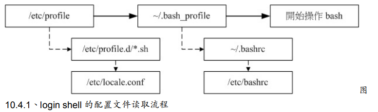

实线的的方向是主线流程，虚线的方向则是被调用的配置文件！从上面我们也可以清楚的知 道，在 CentOS 的 login shell 环境下，最终被读取的配置文件是“ ~/.bashrc ”这个文件喔！所 以，你当然可以将自己的偏好设置写入该文件即可。 下面我们还要讨论一下 source 与 ~/.bashrc 喔！
###### source: 读入环境配置文件的指令

由于 /etc/profile 与 ~/.bash_profile 都是在取得 login shell 的时候才会读取的配置文件，所 以， 如果你将自己的偏好设置写入上述的文件后，通常都是得登出再登陆后，该设置才会生 效。那么，能不能直接读取配置文件而不登出登陆呢？ 可以的！那就得要利用 source 这个指 令了！

```bash
[dmtsai@study ~]$ source 配置文件文件名
范例：将主文件夹的 ~/.bashrc 的设置读入目前的 bash 环境中
[dmtsai@study ~]$ source ~/.bashrc &lt;==下面这两个指令是一样的！
[dmtsai@study ~]$ . ~/.bashrc
```

利用 source 或小数点 （.） 都可以将配置文件的内容读进来目前的 shell 环境中！ 举例来 说，我修改了 ~/.bashrc ，那么不需要登出，立即以 source ~/.bashrc 就可以将刚刚最新设置 的内容读进来目前的环境中！很不错吧！还有，包括 ~/bash_profile 以及 /etc/profile 的设置 中， 很多时候也都是利用到这个 source （或小数点） 的功能喔！ 有没有可能会使用到不同环境配置文件的时候？有啊！ 最常发生在一个人的工作环境分为多 种情况的时候了！举个例子来说，在鸟哥的大型主机中， 常常需要负责两到三个不同的案 子，每个案子所需要处理的环境变量订定并不相同， 那么鸟哥就将这两三个案子分别编写属 于该案子的环境变量设置文件，当需要该环境时，就直接“ source 变量文件 ”，如此一来，环 境变量的设置就变的更简便而灵活了！

###### ~/.bashrc （non-login shell 会读）

谈完了 login shell 后，那么 non-login shell 这种非登陆情况取得 bash 操作接口的环境配置文 件又是什么？ 当你取得 non-login shell 时，该 bash 配置文件仅会读取 ~/.bashrc 而已啦！那 么默认的 ~/.bashrc 内容是如何？

```bash
[root@localhost ~]# cat .bashrc
# .bashrc

# User specific aliases and functions

alias rm='rm -i'
alias cp='cp -i'
alias mv='mv -i'

# Source global definitions
if [ -f /etc/bashrc ]; then
        . /etc/bashrc
fi
```

特别注意一下，由于 root 的身份与一般使用者不同，鸟哥是以 root 的身份取得上述的数据， 如果是一般使用者的 ~/.bashrc 会有些许不同。看一下，你会发现在 root 的 ~/.bashrc 中其实 已经规范了较为保险的命令别名了。 此外，咱们的 CentOS 7.x 还会主动的调用 /etc/bashrc 这个文件喔！为什么需要调用 /etc/bashrc 呢？ 因为 /etc/bashrc 帮我们的 bash 定义出下面的 数据：

1. 依据不同的 UID 规范出 umask 的值； 
2. 依据不同的 UID 规范出提示字符 （就是 PS1 变量）； 
3. 调用 /etc/profile.d/*.sh 的设置

你要注意的是，这个 /etc/bashrc 是 CentOS 特有的 （其实是 Red Hat 系统特有的），其他 不同的 distributions 可能会放置在不同的文件名就是了。由于这个 ~/.bashrc 会调用 /etc/bashrc 及 /etc/profile.d/*.sh ， 所以，万一你没有 ~/.bashrc （可能自己不小心将他删除 了），那么你会发现你的 bash 提示字符可能会变成这个样子：

```bash
-bash-4.2$
```

不要太担心啦！这是正常的，因为你并没有调用 /etc/bashrc 来规范 PS1 变量啦！而且这样的 情况也不会影响你的 bash 使用。 如果你想要将命令提示字符捉回来，那么可以复制 /etc/skel/.bashrc 到你的主文件夹，再修订一下你所想要的内容， 并使用 source 去调用 ~/.bashrc ，那你的命令提示字符就会回来啦！

##### 其他相关的配置文件

事实上还有一些配置文件可能会影响到你的 bash 操作的，下面就来谈一谈：

###### /etc/man_db.conf

这个文件乍看之下好像跟 bash 没相关性，但是对于系统管理员来说， 却也是很重要的一个 文件！这的文件的内容“规范了使用 man 的时候， man page 的路径到哪里去寻找！”所以说 的简单一点，这个文件规定了下达 man 的时候，该去哪里查看数据的路径设置！ 那么什么时候要来修改这个文件呢？如果你是以 tarball 的方式来安装你的数据，那么你的 man page 可能会放置在 /usr/local/softpackage/man 里头，那个 softpackage 是你的套件名 称， 这个时候你就得以手动的方式将该路径加到 /etc/man_db.conf 里头，否则使用 man 的 时候就会找不到相关的说明文档啰。

	###### ~/.bash_history

还记得我们在历史命令提到过这个文件吧？默认的情况下， 我们的历史命令就记录在这里 啊！而这个文件能够记录几笔数据，则与 HISTFILESIZE 这个变量有关啊。每次登陆 bash 后，bash 会先读取这个文件，将所有的历史指令读入内存， 因此，当我们登陆 bash 后就可 以查知上次使用过哪些指令啰

###### ~/.bash_logout

这个文件则记录了“当我登出 bash 后，系统再帮我做完什么动作后才离开”的意思。 你可以去 读取一下这个文件的内容，默认的情况下，登出时， bash 只是帮我们清掉屏幕的讯息而已。 不过，你也可以将一些备份或者是其他你认为重要的工作写在这个文件中 （例如清空暂存 盘）， 那么当你离开 Linux 的时候，就可以解决一些烦人的事情啰

#### 终端机的环境配置：stty，set

我们在第四章首次登陆 Linux 时就提过，可以在 tty1 ~ tty6 这六个命令行的终端机 （terminal） 环境中登陆，登陆的时候我们可以取得一些字符设置的功能喔！ 举例来说，我 们可以利用倒退键 （backspace，就是那个←符号的按键） 来删除命令列上的字符， 也可以 使用 [ctrl]+c 来强制终止一个指令的运行，当输入错误时，就会有声音跑出来警告。这是怎么 办到的呢？ 很简单啊！因为登陆终端机的时候，会自动的取得一些终端机的输入环境的设置 啊！ 

事实上，目前我们使用的 Linux distributions 都帮我们作了最棒的使用者环境了， 所以大家可 以不用担心操作环境的问题。不过，在某些 Unix like 的机器中，还是可能需要动用一些手 脚， 才能够让我们的输入比较快乐～举例来说，利用 [backspace] 删除，要比利用 [Del] 按键 来的顺手吧！ 但是某些 Unix 偏偏是以 [del] 来进行字符的删除啊！所以，这个时候就可以动 动手脚啰～ 

那么如何查阅目前的一些按键内容呢？可以利用 stty （setting tty 终端机的意思） 呢！ stty 也可以帮助设置终端机的输入按键代表意义喔！

```bash
[dmtsai@study ~]$ stty [-a]
选项与参数：
-a ：将目前所有的 stty 参数列出来；
范例一：列出所有的按键与按键内容
[dmtsai@study ~]$ stty -a
speed 38400 baud; rows 20; columns 90; line = 0;
intr = ^C; quit = ^\; erase = ^?; kill = ^U; eof = ^D; eol = &lt;undef&gt;; eol2 = &lt;undef&gt;;
swtch = &lt;undef&gt;; start = ^Q; stop = ^S; susp = ^Z; rprnt = ^R; werase = ^W; lnext = ^V;
flush = ^O; min = 1; time = 0;
....（以下省略）....
```

我们可以利用 stty -a 来列出目前环境中所有的按键列表，在上头的列表当中，需要注意的是 特殊字体那几个， 此外，如果出现 ^ 表示 [Ctrl] 那个按键的意思。举例来说， intr = ^C 表示 利用 [ctrl] + c 来达成的。几个重要的代表意义是： 

1. intr : 送出一个 interrupt （中断） 的讯号给目前正在 run 的程序 （就是终止啰！）； 
2. quit : 送出一个 quit 的讯号给目前正在 run 的程序； 
3. erase : 向后删除字符， 
4. kill : 删除在目前命令行上的所有文字； 
5. eof : End of file 的意思，代表“结束输入”。 
6. start : 在某个程序停止后，重新启动他的 output 
7. stop : 停止目前屏幕的输出； 
8. susp : 送出一个 terminal stop 的讯号给正在 run 的程序。

记不记得我们在第四章讲过几个 Linux 热键啊？没错！ 就是这个 stty 设置值内的 intr（[ctrl]+c） / eof（[ctrl]+d） 啰～至于删除字符，就是 erase 那个设置值啦！ 如果你想要 用 [ctrl]+h 来进行字符的删除，那么可以下达：

```bash
[dmtsai@study ~]$ stty erase ^h # 这个设置看看就好，不必真的实做！不然还要改回来！
```

那么从此之后，你的删除字符就得要使用 [ctrl]+h 啰，按下 [backspace] 则会出现 ^? 字样 呢！ 如果想要回复利用 [backspace] ，就下达 stty erase ^? 即可啊！ 至于更多的 stty 说明， 记得参考一下 man stty 的内容喔！

除了 stty 之外，其实我们的 bash 还有自己的一些终端机设置值呢！那就是利用 set 来设置 的！ 我们之前提到一些变量时，可以利用 set 来显示，除此之外，其实 set 还可以帮我们设 置整个指令输出/输入的环境。 例如记录历史命令、显示错误内容等等。

```bash
[dmtsai@study ~]$ set [-uvCHhmBx]
选项与参数：
-u ：默认不启用。若启用后，当使用未设置变量时，会显示错误讯息；
-v ：默认不启用。若启用后，在讯息被输出前，会先显示讯息的原始内容；
-x ：默认不启用。若启用后，在指令被执行前，会显示指令内容（前面有 ++ 符号）
-h ：默认启用。与历史命令有关；
-H ：默认启用。与历史命令有关；
-m ：默认启用。与工作管理有关；
-B ：默认启用。与刮号 [] 的作用有关；
-C ：默认不启用。若使用 &gt; 等，则若文件存在时，该文件不会被覆盖。
范例一：显示目前所有的 set 设置值
[dmtsai@study ~]$ echo $-
himBH
# 那个 $- 变量内容就是 set 的所有设置啦！ bash 默认是 himBH 喔！
范例二：设置 "若使用未定义变量时，则显示错误讯息"
[dmtsai@study ~]$ set -u
[dmtsai@study ~]$ echo $vbirding
-bash: vbirding: unbound variable
# 默认情况下，未设置/未宣告 的变量都会是“空的”，不过，若设置 -u 参数，
# 那么当使用未设置的变量时，就会有问题啦！很多的 shell 都默认启用 -u 参数。
# 若要取消这个参数，输入 set +u 即可！
范例三：执行前，显示该指令内容。
[dmtsai@study ~]$ set -x
++ printf '\033]0;%s@%s:%s\007' dmtsai study '~' # 这个是在列出提示字符的控制码！
[dmtsai@study ~]$ echo ${HOME}
+ echo /home/dmtsai
/home/dmtsai
++ printf '\033]0;%s@%s:%s\007' dmtsai study '~'
# 看见否？要输出的指令都会先被打印到屏幕上喔！前面会多出 + 的符号！
```

另外，其实我们还有其他的按键设置功能呢！就是在前一小节提到的 /etc/inputrc 这个文件里 面设置。 还有例如 /etc/DIRCOLORS 与 /usr/share/terminfo/ 等，也都是与终端机有关的环境 设置文件呢！ 不过，事实上，鸟哥并不建议您修改 tty 的环境呢，这是因为 bash 的环境已经 设置的很友好了， 我们不需要额外的设置或者修改，否则反而会产生一些困扰。不过，写在 这里的数据， 只是希望大家能够清楚的知道我们的终端机是如何进行设置的喔！ ^^！ 最后， 我们将 bash 默认的组合键给他汇整如下：

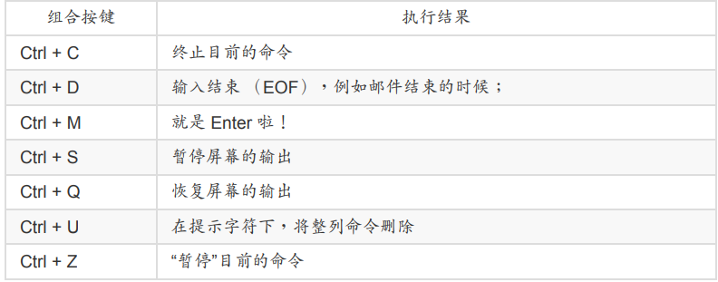


#### 万用字符和特殊符号

在 bash 的操作环境中还有一个非常有用的功能，那就是万用字符 （wildcard） ！ 我们利用 bash 处理数据就更方便了！下面我们列出一些常用的万用字符喔

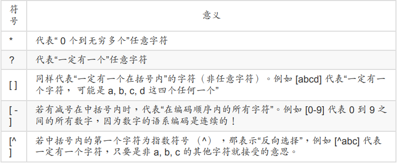

接下来让我们利用万用字符来玩些东西吧！首先，利用万用字符配合 ls 找文件名看看。

```bash
[dmtsai@study ~]$ LANG=C &lt;==由于与编码有关，先设置语系一下
范例一：找出 /etc/ 下面以 cron 为开头的文件名
[dmtsai@study ~]$ ll -d /etc/cron* &lt;==加上 -d 是为了仅显示目录而已
范例二：找出 /etc/ 下面文件名“刚好是五个字母”的文件名
[dmtsai@study ~]$ ll -d /etc/????? &lt;==由于 ? 一定有一个，所以五个 ? 就对了
范例三：找出 /etc/ 下面文件名含有数字的文件名
[dmtsai@study ~]$ ll -d /etc/*[0-9]* &lt;==记得中括号左右两边均需 *
范例四：找出 /etc/ 下面，文件名开头非为小写字母的文件名：
[dmtsai@study ~]$ ll -d /etc/[^a-z]* &lt;==注意中括号左边没有 *
范例五：将范例四找到的文件复制到 /tmp/upper 中
[dmtsai@study ~]$ mkdir /tmp/upper; cp -a /etc/[^a-z]* /tmp/upper
```

除了万用字符之外，bash 环境中的特殊符号有哪些呢？下面我们先汇整一下：

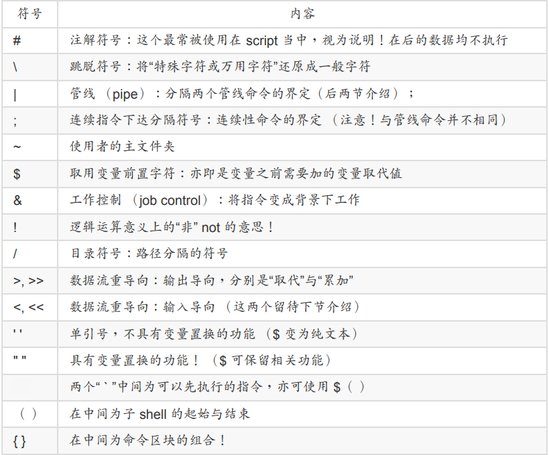

以上为 bash 环境中常见的特殊符号汇整！理论上，你的“文件名”尽量不要使用到上述的字符 啦！

###  数据流重导向


## 软件安装rPM，SRPM，YUM

那有没有想过，如果我的 Linux 系统与厂商的系统一模一样，那么在厂商的系统上面编译出 来的可执行文件， 自然也就可以在我的系统上面跑啰！也就是说，厂商先在他们的系统上面 编译好了我们使用者所需要的软件， 然后将这个编译好的可执行的软件直接释出给使用者来 安装，如此一来，由于我们本来就使用厂商的 Linux distribution ，所以当然系统 （硬件与操 作系统） 是一样的，那么使用厂商提供的编译过的可可执行文件就没有问题啦！ 说的比较白 话一些，那就是利用类似 Windows 的安装方式，由程序开发者直接在已知的系统上面编译 好，再将该程序直接给使用者来安装，如此而已。

那么如果在安装的时候还可以加上一些与这些程序相关的信息，将他创建成为数据库，那不 就可以进行安装、反安装、 升级与验证等等的相关功能啰 （类似 Windows 下面的“新增移除 程序”）？确实如此，在 Linux 上面至少就有两种常见的这方面的软件管理员，分别是 RPM 与 Debian 的 dpkg 。我们的 CentOS 主要是以 RPM 为主，但也不能不知道 dpkg 啦！所以 下面就来约略介绍一下这两个玩意儿

### 软件管理员介绍

#### linux界的两大主流：rpm和dpkg

如同刚刚谈过的方式，Linux 开发商先在固定的硬件平台与操作系统平台上面将需要安装或升 级的软件编译好， 然后将这个软件的所有相关文件打包成为一个特殊格式的文件，在这个软 件文件内还包含了预先侦测系统与相依软件的脚本， 并提供记载该软件提供的所有文件信息 等。最终将这个软件文件释出。用户端取得这个文件后，只要通过特定的指令来安装， 那么 该软件文件就会依照内部的脚本来侦测相依的前驱软件是否存在，若安装的环境符合需求， 那就会开始安装， 安装完成后还会将该软件的信息写入软件管理机制中，以达成未来可以进 行升级、移除等动作呢。

目前在 Linux 界软件安装方式最常见的有两种，分别是：

1. dpkg：这个机制最早是由 Debian Linux 社群所开发出来的，通过 dpkg 的机制， Debian 提供的软件就能够简单的安装起来，同时还能提供安装后的软件信息，实在非常 不错。 只要是衍生于 Debian 的其他 Linux distributions 大多使用 dpkg 这个机制来管理 软件的， 包括 B2D, Ubuntu 等等。
2. rpm：这个机制最早是由 Red Hat 这家公司开发出来的，后来实在很好用，因此很多 distributions 就使用这个机制来作为软件安装的管理方式。包括 Fedora, CentOS, SuSE 等等知名的开发商都是用这咚咚

如前所述，不论 dpkg/rpm 这些机制或多或少都会有软件属性相依的问题，那该如何解决呢？ 其实前面不是谈到过每个软件文件都有提供相依属性的检查吗？那么如果我们将相依属性的 数据做成列表， 等到实际软件安装时，若发生有相依属性的软件状况时，例如安装 A 需要先 安装 B 与 C ，而安装 B 则需要安装 D 与 E 时，那么当你要安装 A ，通过相依属性列表，管 理机制自动去取得 B, C, D, E 来同时安装， 不就解决了属性相依的问题吗。

没错！您真聪明！目前新的 Linux 开发商都有提供这样的“线上升级”机制，通过这个机制， 原 版光盘就只有第一次安装时需要用到而已，其他时候只要有网络，你就能够取得原本开发商 所提供的任何软件了呢！ 在 dpkg 管理机制上就开发出 APT 的线上升级机制，RPM 则依开 发商的不同，有 Red Hat 系统的 yum ， SuSE 系统的 Yast Online Update （YOU） 等

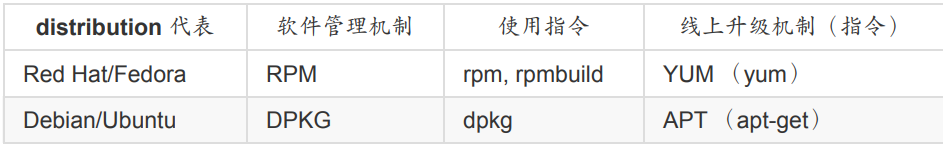


#### 什么是rpm和srpm

RedHat Package Manager，当初这个软件管理 的机制是由 Red Hat 这家公司发展出来的。 RPM 是以一种数据库记录的方式来将你所需要 的软件安装到你的 Linux 系统的一套管理机制。

他最大的特点就是将你要安装的软件先编译过， 并且打包成为 RPM 机制的包装文件，通过 包装好的软件里头默认的数据库记录， 记录这个软件要安装的时候必须具备的相依属性软 件，当安装在你的 Linux 主机时， RPM 会先依照软件里头的数据查询 Linux 主机的相依属性 软件是否满足， 若满足则予以安装，若不满足则不予安装。那么安装的时候就将该软件的信 息整个写入 RPM 的数据库中，以便未来的查询、验证与反安装。

这样一来的优点是：

1. 由于已经编译完成并且打包完毕，所以软件传输与安装上很方便 （不需要再重新编 译）；
2. 由于软件的信息都已经记录在 Linux 主机的数据库上，很方便查询、升级与反安装

但是这也造成些许的困扰。由于 RPM 文件是已经包装好的数据，也就是说， 里面的数据已 经都“编译完成”了！所以，该软件文件几乎只能安装在原本默认的硬件与操作系统版本中。 也就是说，你的主机系统环境必须要与当初创建这个软件文件的主机环境相同才行！ 举例来 说，rp-pppoe 这个 ADSL 拨接软件，他必须要在 ppp 这个软件存在的环境下才能进行安装！ 如果你的主机并没有 ppp 这个软件，那么很抱歉，除非你先安装 ppp 否则 rp-pppoe 就是不 让你安装的 （当然你可以强制安装，但是通常都会有点问题发生就是了！）。

所以，通常不同的 distribution 所释出的 RPM 文件，并不能用在其他的 distributions 上。举 例来说，Red Hat 释出的 RPM 文件，通常无法直接在 SuSE 上面进行安装的。

更有甚者，相 同 distribution 的不同版本之间也无法互通，例如 CentOS 6.x 的 RPM 文件就无法直接套用在 CentOS 7.x ！因此，这样可以发现这些软件管理机制的问题是：

1. 软件文件安装的环境必须与打包时的环境需求一致或相当； 
2. 需要满足软件的相依属性需求； 
3. 反安装时需要特别小心，最底层的软件不可先移除，否则可能造成整个系统的问题！

那怎么办？如果我真的想要安装其他 distributions 提供的好用的 RPM 软件文件时？ 呵呵！ 还好，还有 SRPM 这个东西！SRPM 是什么呢？顾名思义，他是 Source RPM 的意思，也就 是这个 RPM 文件里面含有源代码哩！特别注意的是，这个 SRPM 所提供的软件内容“并没有 经过编译”， 它提供的是源代码喔

通常 SRPM 的扩展名是以 *.src.rpm 这种格式来命名的。不过，既然 SRPM 提供的是源代 码，那么为什么我们不使用 Tarball 直接来安装就好了？这是因为 SRPM 虽然内容是源代 码， 但是他仍然含有该软件所需要的相依性软件说明、以及所有 RPM 文件所提供的数据。 同时，他与 RPM 不同的是，他也提供了参数配置文件 （就是 configure 与 makefile）。所 以，如果我们下载的是 SRPM ，那么要安装该软件时，你就必须要： 

1. 先将该软件以 RPM 管理的方式编译，此时 SRPM 会被编译成为 RPM 文件；
2. 然后将编译完成的 RPM 文件安装到 Linux 系统当中

怪了，怎么 SRPM 这么麻烦呐！还要重新编译一次，那么我们直接使用 RPM 来安装不就好 了？通常一个软件在释出的时候，都会同时释出该软件的 RPM 与 SRPM 。我们现在知道 RPM 文件必须要在相同的 Linux 环境下才能够安装，而 SRPM 既然是源代码的格式，自然我 们就可以通过修改 SRPM 内的参数配置文件，然后重新编译产生能适合我们 Linux 环境的 RPM 文件，如此一来，不就可以将该软件安装到我们的系统当中，而不必与原作者打包的 Linux 环境相同了？这就是 SRPM 的用处了。

以下是区别之处。

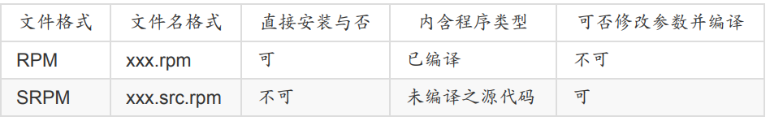


#### 什么是i386，i586，i686，noarch，x86_64

从上面的说明，现在我们知道 RPM 与 SRPM 的格式分别为：

>xxxxxxxxx.rpm <==RPM 的格式，已经经过编译且包装完成的 rpm 文件； 
>
>xxxxx.src.rpm <==SRPM的格式，包含未编译的源代码信息。

那么我们怎么知道这个软件的版本、适用的平台、编译释出的次数呢？只要通过文件名就可 以知道了！例如 rp-pppoe-3.11-5.el7.x86_64.rpm 这的文件的意义为:


除了后面适合的硬件平台与扩展名外，主要是以“-”来隔开各个部分，这样子可以很清楚的发 现该软件的名称、 版本信息、打包次数与操作的硬件平台！好了，来谈一谈每个不同的地方 吧：

1. 软件名称： 当然就是每一个软件的名称了！上面的范例就是 rp-pppoe 。 
2. 版本信息： 每一次更新版本就需要有一个版本的信息，否则如何知道这一版是新是旧？ 这里通常又分为主版本跟次版本。以上面为例，主版本为 3 ，在主版本的架构下更动部 分源代码内容，而释出一个新的版本，就是次版本啦！以上面为例，就是 11 啰！所以版 本名就为 3.11 
3. 释出版本次数： 通常就是编译的次数啦！那么为何需要重复的编译呢？这是由于同一版 的软件中，可能由于有某些 bug 或者是安全上的顾虑，所以必须要进行小幅度的 patch 或重设一些编译参数。 设置完成之后重新编译并打包成 RPM 文件！因此就有不同的打 包数出现了！ 
4. 操作硬件平台： 这是个很好玩的地方，由于 RPM 可以适用在不同的操作平台上，但是 不同的平台设置的参数还是有所差异性！ 并且，我们可以针对比较高阶的 CPU 来进行 最优化参数的设置，这样才能够使用高阶 CPU 所带来的硬件加速功能。 所以就有所谓 的 i386, i586, i686, x86_64 与 noarch 等的文件名称出现了.

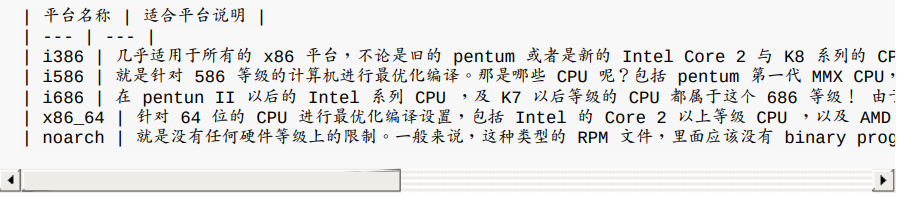


#### rpm的优点

由于 RPM 是通过预先编译并打包成为 RPM 文件格式后，再加以安装的一种方式，并且还能 够进行数据库的记载。 所以 RPM 有以下的优点：

1. RPM 内含已经编译过的程序与配置文件等数据，可以让使用者免除重新编译的困扰； 
2. RPM 在被安装之前，会先检查系统的硬盘容量、操作系统版本等，可避免文件被错误安 装； 
3. RPM 文件本身提供软件版本信息、相依属性软件名称、软件用途说明、软件所含文件等 信息，便于了解软件； 
4. RPM 管理的方式使用数据库记录 RPM 文件的相关参数，便于升级、移除、查询与验 证。

但是有没有想过，我们在前一章里面提过的，有些软件是有相关性的，例如要安装网卡驱动 程序，就得要有 kernel source 与 gcc 及 make 等软件。那么我们的 RPM 软件是否一定可以 安装完成呢？如果该软件安装之后，却找不到他相关的前驱软件， 那不是挺麻烦的吗？因为 安装好的软件也无法使用啊！

 为了解决这种具有相关性的软件之间的问题 （就是所谓的软件相依属性），RPM 就在提供打 包的软件时，同时加入一些讯息登录的功能，这些讯息包括软件的版本、 打包软件者、相依 属性的其他软件、本软件的功能说明、本软件的所有文件记录等等，然后在 Linux 系统上面 亦创建一个 RPM 软件数据库，如此一来，当你要安装某个以 RPM 型态提供的软件时，在安 装的过程中， RPM 会去检验一下数据库里面是否已经存在相关的软件了， 如果数据库显示 不存在，那么这个 RPM 文件“默认”就不能安装。呵呵！没有错，这个就是 RPM 类型的文件 最为人所诟病的“软件的属性相依”问题啦！


####  RPM 属性相依的克服方式： YUM 线上升级

为了重复利用既有的软件功能，因此很多软件都会以函数库的方式释出部分功能，以方便其 他软件的调用应用， 例如 PAM 模块的验证功能。此外，为了节省使用者的数据量，目前的 distributions 在释出软件时， 都会将软件的内容分为一般使用与开发使用 （development） 两大类。所以你才会常常看到有类似 pam-x.x.rpm 与 pam-devel-x.x.rpm 之类的文件名啊！ 而默认情况下，大部分的 software-devel-x.x.rpm 都不会安装，因为终端用户大部分不会去开 发软件嘛！

因此 RPM 软件文件就会有所谓的属性相依的问题产生 （其实所有的软 件管理几乎都有这方面的情况存在）。 那有没有办法解决啊？前面不是谈到 RPM 软件文件 内部会记录相依属性的数据吗？那想一想，要是我将这些相依属性的软件先列表， 在有要安 装软件需求的时候，先到这个列表去找，同时与系统内已安装的软件相比较，没安装到的相 依软件就一口气同时安装起来， 那不就解决了相依属性的问题了吗？有没有这种机制啊？有 啊！那就是 YUM 机制的由来！

CentOS （1）先将释出的软件放置到 YUM 服务器内，然后（2）分析这些软件的相依属性问 题，将软件内的记录信息写下来 （header）。 然后再将这些信息分析后记录成软件相关性的 清单列表。这些列表数据与软件所在的本机或网络位置可以称呼为容器或软件仓库或软件库 （repository）。 当用户端有软件安装的需求时，用户端主机会主动的向网络上面的 yum 服 务器的软件库网址下载清单列表， 然后通过清单列表的数据与本机 RPM 数据库已存在的软 件数据相比较，就能够一口气安装所有需要的具有相依属性的软件了。 整个流程可以简单的 如下图说明：

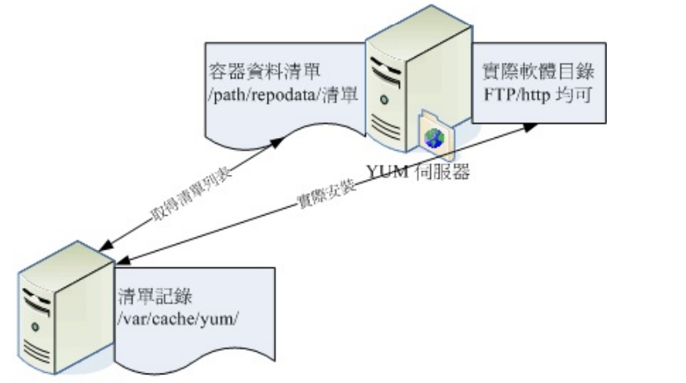

当用户端有升级、安装的需求时， yum 会向软件库要求清单的更新，等到清单更新到本机的 /var/cache/yum 里面后， 等一下更新时就会用这个本机清单与本机的 RPM 数据库进行比 较，这样就知道该下载什么软件。接下来 yum 会跑到软件库服务器 （yum server） 下载所 需要的软件 （因为有记录软件所在的网址），然后再通过 RPM 的机制开始安装软件啦！这 就是整个流程.

### rpm软件管理程序：rpm

RPM 的使用其实不难，只要使用 rpm 这个指令即可！鸟哥最喜欢的就是 rpm 指令的查询功 能了，可以让我很轻易的就知道某个系统有没有安装鸟哥要的软件呢！此外， 我们最好还是 得要知道一下，到底 RPM 类型的文件他们是将软件的相关文件放置在哪里呢？还有，我们说 的那个 RPM 的数据库又是放置在哪里呢。

#### rpm默认安装的路径

一般来说，RPM 类型的文件在安装的时候，会先去读取文件内记载的设置参数内容，然后将 该数据用来比对 Linux 系统的环境，以找出是否有属性相依的软件尚未安装的问题。例如 Openssh 这个连线软件需要通过 Openssl 这个加密软件的帮忙，所以得先安装 openssl 才能 装 openssh 的意思。那你的环境如果没有 openssl ， 你就无法安装 openssh 的意思啦

若环境检查合格了，那么 RPM 文件就开始被安装到你的 Linux 系统上。安装完毕后，该软件 相关的信息就会被写入 /var/lib/rpm/ 目录下的数据库文件中了。

上面这个目录内的数据很重 要喔！因为未来如果我们有任何软件升级的需求，版本之间的比较就是来自于这个数据库， 而如果你想要查询系统已经安装的软件，也是从这里查询的！同时，目前的 RPM 也提供数码 签章信息， 这些数码签章也是在这个目录内记录的呢！所以说，这个目录得要注意不要被删 除了啊！

那么软件内的文件到底是放置到哪里去啊？当然与文件系统有关对吧！我们在第五章的目录 配置谈过每个目录的意义， 这里再次的强调啰

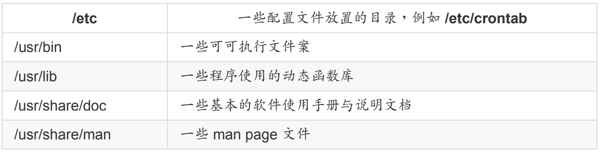


#### rpm安装（install）

因为安装软件是 root 的工作，因此你得要是 root 的身份才能够操作 rpm 这指令的。 用 rpm 来安装很简单啦！假设我要安装一个文件名为 rp-pppoe-3.11-5.el7.x86_64.rpm 的文件，那么 我可以这样：（假设原版光盘已经放在 /mnt 下面了）：

```bash
[root@study ~]# rpm -i /mnt/Packages/rp-pppoe-3.11-5.el7.x86_64.rpm
```

不过这样的参数太简单了，看不到详细信息也看不到进度。

```bash
[root@study ~]# rpm -ivh package_name
选项与参数：
-i ：install 的意思
-v ：察看更细部的安装信息画面
-h ：以安装信息列显示安装进度

范例一：安装原版光盘上的 rp-pppoe 软件
[root@study ~]# rpm -ivh /mnt/Packages/rp-pppoe-3.11-5.el7.x86_64.rpm
Preparing... ################################# [100%]
Updating / installing...
1:rp-pppoe-3.11-5.el7 ################################# [100%]

范例二、一口气安装两个以上的软件时：
[root@study ~]# rpm -ivh a.i386.rpm b.i386.rpm *.rpm
# 后面直接接上许多的软件文件！

范例三、直接由网络上面的某个文件安装，以网址来安装：
[root@study ~]# rpm -ivh http://website.name/path/pkgname.rpm
```

另外，如果我们在安装的过程当中发现问题，或者已经知道会发生的问题， 而还是“执意”要 安装这个软件时，可以使用如下的参数“强制”安装上去。

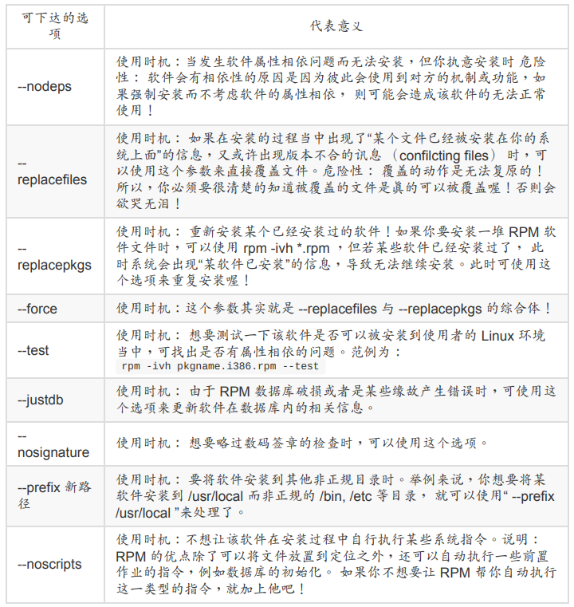


一般来说，rpm 的安装选项与参数大约就是这些了。通常鸟哥建议直接使用 -ivh 就好了， 如 果安装的过程中发现问题，一个一个去将问题找出来，尽量不要使用“ 暴力安装法 ”，就是通 过 --force 去强制安装！ 因为可能会发生很多不可预期的问题呢！除非你很清楚的知道使用上 面的参数后，安装的结果是你预期的。

#### rpm升级和更新（upgrade和freshen）

使用 RPM 来升级真是太简单了！就以 -Uvh 或 -Fvh 来升级即可，而 -Uvh 与 -Fvh 可以用的 选项与参数，跟 install 是一样的。不过， -U 与 -F 的意义还是不太一样的，基本的差别是这 样的：

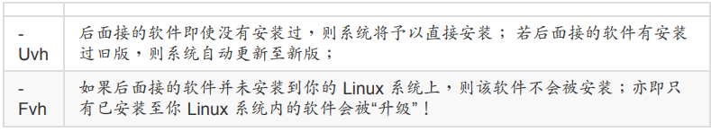

由上面的说明来看，如果你想要大量的升级系统旧版本的软件时，使用 -Fvh 则是比较好的作 法，因为没有安装的软件才不会被不小心安装进系统中。但是需要注意的是，如果你使用的 是 -Fvh ，偏偏你的机器上尚无这一个软件，那么很抱歉，该软件并不会被安装在你的 Linux 主机上面，所以请重新以 ivh 来安装吧

#### rpm查询

```bash
[root@study ~]# rpm -qa &lt;==已安装软件
[root@study ~]# rpm -q[licdR] 已安装的软件名称 &lt;==已安装软件
[root@study ~]# rpm -qf 存在于系统上面的某个文件名 &lt;==已安装软件
[root@study ~]# rpm -qp[licdR] 未安装的某个文件名称 &lt;==查阅RPM文件
选项与参数：
查询已安装软件的信息：
-q ：仅查询，后面接的软件名称是否有安装；
-qa ：列出所有的，已经安装在本机 Linux 系统上面的所有软件名称；
-qi ：列出该软件的详细信息 （information），包含开发商、版本与说明等；
-ql ：列出该软件所有的文件与目录所在完整文件名 （list）；
-qc ：列出该软件的所有配置文件 （找出在 /etc/ 下面的文件名而已）
-qd ：列出该软件的所有说明文档 （找出与 man 有关的文件而已）
-qR ：列出与该软件有关的相依软件所含的文件 （Required 的意思）
-qf ：由后面接的文件名称，找出该文件属于哪一个已安装的软件；
-q --scripts：列出是否含有安装后需要执行的脚本档，可用以 debug 喔！
查询某个 RPM 文件内含有的信息：
-qp[icdlR]：注意 -qp 后面接的所有参数以上面的说明一致。但用途仅在于找出
某个 RPM 文件内的信息，而非已安装的软件信息！注意！
```

在查询的部分，所有的参数之前都需要加上 -q 才是所谓的查询！查询主要分为两部分， 一个 是查已安装到系统上面的的软件信息，这部份的信息都是由 /var/lib/rpm/ 所提供。另一个则是 查某个 rpm 文件内容， 等于是由 RPM 文件内找出一些要写入数据库内的信息就是了，这部 份就得要使用 -qp （p 是 package 的意思）。 那就来看看几个简单的范例吧！

```bash
范例一：找出你的 Linux 是否有安装 logrotate 这个软件？
[root@study ~]# rpm -q logrotate
logrotate-3.8.6-4.el7.x86_64
[root@study ~]# rpm -q logrotating
package logrotating is not installed
# 注意到，系统会去找是否有安装后面接的软件名称。注意，不必要加上版本喔！
# 至于显示的结果，一看就知道有没有安装啦！
范例二：列出上题当中，属于该软件所提供的所有目录与文件：
[root@study ~]# rpm -ql logrotate
/etc/cron.daily/logrotate
/etc/logrotate.conf
....（以下省略）....
# 可以看出该软件到底提供了多少的文件与目录，也可以追踪软件的数据。
范例三：列出 logrotate 这个软件的相关说明数据：
[root@study ~]# rpm -qi logrotate
Name : logrotate # 软件名称
Version : 3.8.6 # 软件的版本
Release : 4.el7 # 释出的版本
Architecture: x86_64 # 编译时所针对的硬件等级
Install Date: Mon 04 May 2015 05:52:36 PM CST # 这个软件安装到本系统的时间
Group : System Environment/Base # 软件是放再哪一个软件群组中
Size : 102451 # 软件的大小
License : GPL+ # 释出的授权方式
Signature : RSA/SHA256, Fri 04 Jul 2014 11:34:56 AM CST, Key ID 24c6a8a7f4a80eb5
Source RPM : logrotate-3.8.6-4.el7.src.rpm # 这就是 SRPM 的文件名
Build Date : Tue 10 Jun 2014 05:58:02 AM CST # 软件编译打包的时间
Build Host : worker1.bsys.centos.org # 在哪一部主机上面编译的
Relocations : （not relocatable）
Packager : CentOS BuildSystem &lt;http://bugs.centos.org&gt;
Vendor : CentOS
URL : https://fedorahosted.org/logrotate/
Summary : Rotates, compresses, removes and mails system log files
Description : # 这个是详细的描述！
The logrotate utility is designed to simplify the administration of
log files on a system which generates a lot of log files. Logrotate
allows for the automatic rotation compression, removal and mailing of
log files. Logrotate can be set to handle a log file daily, weekly,
monthly or when the log file gets to a certain size. Normally,
logrotate runs as a daily cron job.
Install the logrotate package if you need a utility to deal with the
log files on your system.
# 列出该软件的 information （信息），里面的信息可多着呢，包括了软件名称、
# 版本、开发商、SRPM文件名称、打包次数、简单说明信息、软件打包者、
# 安装日期等等！如果想要详细的知道该软件的数据，用这个参数来了解一下
范例四：分别仅找出 logrotate 的配置文件与说明文档
[root@study ~]# rpm -qc logrotate
[root@study ~]# rpm -qd logrotate
范例五：若要成功安装 logrotate ，他还需要什么文件的帮忙？
[root@study ~]# rpm -qR logrotate
/bin/sh
config（logrotate） = 3.8.6-4.el7
coreutils &gt;= 5.92
....（以下省略）....
# 由这里看起来，呵呵～还需要很多文件的支持才行喔！
范例六：由上面的范例五，找出 /bin/sh 是那个软件提供的？
[root@study ~]# rpm -qf /bin/sh
bash-4.2.46-12.el7.x86_64
# 这个参数后面接的可是“文件”呐！不像前面都是接软件喔！
# 这个功能在查询系统的某个文件属于哪一个软件所有的。
范例七：假设我有下载一个 RPM 文件，想要知道该文件的需求文件，该如何？
[root@study ~]# rpm -qpR filename.i386.rpm
# 加上 -qpR ，找出该文件需求的数据！
```

常见的查询就是这些了！要特别说明的是，在查询本机上面的 RPM 软件相关信息时， 不需 要加上版本的名称，只要加上软件名称即可！因为他会由 /var/lib/rpm 这个数据库里面去查 询， 所以我们可以不需要加上版本名称。但是查询某个 RPM 文件就不同了，我们必须要列 出整个文件的完整文件名才行～ 这一点朋友们常常会搞错。下面我们就来做几个简单的练习 吧！ 

例题： 

1. 我想要知道我的系统当中，以 c 开头的软件有几个，如何实做？ 
2. 我的 WWW 服务器为 Apache ，我知道他使用的 RPM 软件文件名为 httpd 。现在，我想 要知道这个软件的所有配置文件放置在何处，可以怎么作？ 
3. 承上题，如果查出来的设置文件已经被我改过，但是我忘记了曾经修改过哪些地方，所 以想要直接重新安装一次该软件，该如何作？ 
4. 如果我误砍了某个重要文件，例如 /etc/crontab，偏偏不晓得他属于哪一个软件，该怎么 办？

答：

1. rpm -qa | grep ^c | wc -l 
2. rpm -qc httpd 
3. 假设该软件在网络上的网址为： http://web.site.name/path/httpd-x.x.xx.i386.rpm 则我可 以这样做： rpm -ivh http://web.site.name/path/httpd-x.x.xx.i386.rpm --replacepkgs 
4. 虽然已经没有这个文件了，不过没有关系，因为 RPM 有记录在 /var/lib/rpm 当中的数据 库啊！所以直接下达： rpm -qf /etc/crontab 就可以知道是那个软件啰！重新安装一次该 软件即可！

#### rpm验证和数码签章

